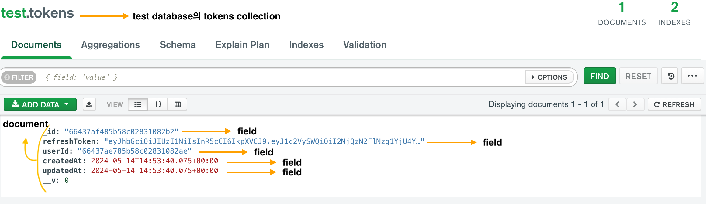
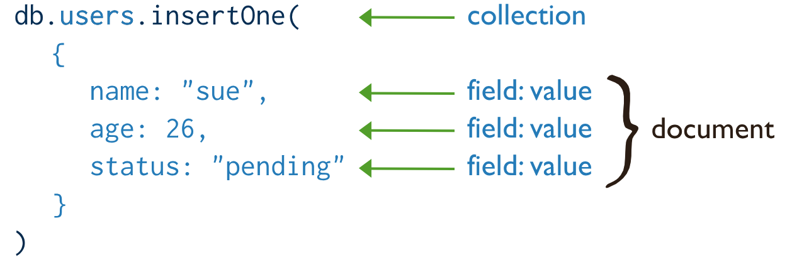
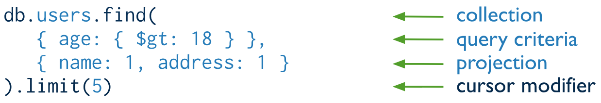
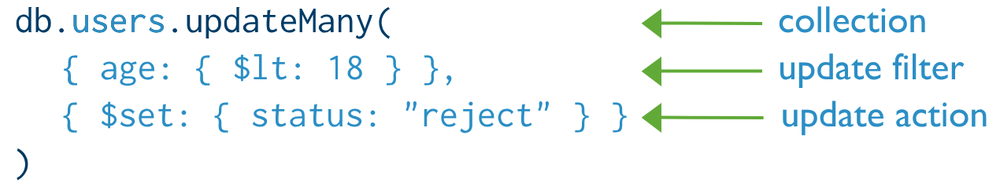
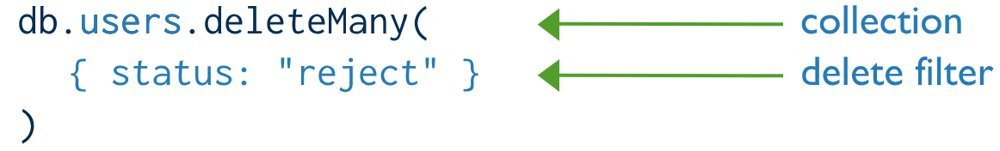

# MongoDB

데이터베이스 솔루션 혹은 데이터베이스 엔진의 이름이며 NoSQL 데이터베이스를 실행할 수 있는 툴입니다.

MongoDB는 파일에 저장하기 전에 이면에서 데이터를 변형하는 Binary JSON을 통해 컬렉션에 데이터를 저장하기 때문에 JavaScript 객체 표기법과 아주 흡사합니다.

## 계층

MongoDB는 Database > Collection > Document > Field 계층으로 이루어져 있습니다.




## MongoDB Compass

그래픽 사용자 인터페이스를 통해 데이터베이스와의 연결 및 상호작용을 돕는 도구입니다.

## Document Structure

MongoDB의 documents는 필드-값 의 쌍으로 데이터 구조를 가지고 있습니다.

```javascript
{
   field1: value1,
   field2: value2,
   field3: value3,
   ...
   fieldN: valueN
}
```

필드의 값의 경우에는 다른 document를 포함해서 BSON이 허용하는 모든 데이터 타입을 사용가능합니다.

```javascript
var mydoc = {
      _id: ObjectId("5099803df3f4948bd2f98391"),
      name: { first: "Alan", last: "Turing" },
      birth: new Date('Jun 23, 1912'),
      death: new Date('Jun 07, 1954'),
      contribs: [ "Turing machine", "Turing test","Turingery" ],
      views : NumberLong(1250000)
  }
```

### Field Names

필드 이름은 문자열입니다.\
다음은 document의 필드이름 제한사항입니다.

- `_id` 필드 이름은 primary key의 역활을 합니다.\
값은 반드시 유니크한 값이고 collection상에서 반드시 유일해야합니다.\
이는 변경이 불가능하고 배열이외의 모든 형태가 가능합니다.\

- 필드이름의 경우 (`$`)를 시작 문자로 사용 할 수 없습니다.\

- 필드이름의 경우 (`.`)을 시작 문자로 사용 할 수 없습니다.\

- 필드이름의 경우 null 이 포함된 필드를 가질수가 없습니다.

BSON document의 경우에는 중복되는 이름의 필드를 가지는 것을 혀용하지만 몽도디비에서는 허용하지 않습니다.\
만약 중복되는 필드를 가지게 허용하고 싶다면 driver documentation을 찾아서 필요한 driver를 추가해야합니다.

### Dot Notation

MongoDB는 (`.`) 을 통해서 array의 엘리먼트를 접근하거나 document의 필드를 접근할수가 있습니다.

#### Array

기본적으로 배열의 인덱스틑 0 부터 시작을 합니다.array의 이름이나 index의 포지션을 통해서 값을 접근 할 수 있습니다.

```javascript
"<array>.<index>"
```

예를들면 다음과 같은 document가 있다고 가정하면

```javascript
{
   ...
   contribs: [ "Turing machine", "Turing test", "Turingery" ],
   ...
}
```

세번째 엘리먼트를 접근하고 싶다면 `"contribs.2"` 를 통해 값에 접근하는 것이 가능합니다.

#### Embeded Documents

document의 필드도 (.)을 통해서 접근이 가능합니다.

```javascript
"<embedded document>.<field>"
```

예를들어 다음과 같은 형태의 documents가 있다고 가정해보갰습니다.

```javascript
{
   ...
   name: { first: "Alan", last: "Turing" },
   contact: { phone: { type: "cell", number: "111-222-3333" } },
   ...
}
```

`"name.last"` 또는 `"contact.phone.number"`

## Document Limitations

### Document Field Order

MongoDB는 document의 필드의 순서를 보장하지만 다음의 경우에는 예외입니다.

- `_id` 필드의 경우에는 항상 모든 document의 처음에 위치합니다.

- 필드이름을 변경하는 경우 필드의 순서가 변경되기도 합니다.

#### The _id Field

MongoDB에서 document는 유니크한 `_id`값 primary key로서 사용하여 collection 에 저장이 됩니다.\
MongoDB는 `ObjectIds`를 기본 `_id` 필드의 값으러 사용합니다.\
만약에 데이터 입력하는 단계에서 `_id` 필드가 없다면 몽고디비가 자동으로 해당 document에 `_id`필드와 ObejctId를 값으로 부여하게 됩니다.

추가적으로, 만약 mongod가 `_id` 필드가 없는 document를 입력데이터로 받게 되어도 자동으로 `ObjectID`를 가진 `_id`필드를 추가하게 됩니다.

`_id`필드는 다음과 같은 동작과 제한 사항을 가집니다.

- 기본적으로 데이터 생성시에 유니크한 인덱스 값을 collection이 생성될때 생성합니다.

- `_id` 필드는항상 document의 첫번째 필드로 존해합니다.\
만약 첫번째로 존재하지 않는 경우 해당 필드를 처음으로 자동으로 이동시킵니다.

- `_id` 필드는 array를 제외한 BSON이 제공하는 모든 데이터 형을 가질수 있습니다.

## ObjectId

`ObjectIds`는 작고, 유일한 값이며, 빠르게 생성이 가능하고 순차적입니다.\
`ObjectIds`의 값은 12-bytes로 구성되어있고 처음 4바이트는 timestamp를 나타내어 `ObjectIds`의 생성시기를 나타냅니다.

MongoDB에서 document는 유니크한 primary key로 사용 될 `_id`값을 필요로합니다.\
만약에 `_id`필드가 지정되지 않는다면 MongoDB는 기본적으로 `ObjectIds`를 `_id`의 값으로 사용합니다.\
예를들어 만약에 document의 최상단 레벨에 `_id`필드가 생성당시에 존재하지 않는다면, MongoDB 드라이버는 `_id`필드의 값을 `ObjectId`값을 추가합니다.

추가적으로, 만약에 mongod가 `_id`필드가 없는 document를 생성시에 전달받으면 자동으로 `_id`에 `ObjectId`값을 부여해서 추가시킵니다.\
MongoDB 클라이언트는 반드시 `_id`를 유니크한 `ObjectId`를 가지게 합니다.\
`ObjectId`를 값으로 사용을 하면 다음과 같은 이점이 있습니다.

- 몽고 shell에서 , 우리는 `ObjectId`의 생성시의 시간을 접근할수가 있습니다. `ObjectId.getTimestamp()`

- `_id`필드로 저장을 하면 대략적으로 생성시간 순서로 정렬되어 저장이 됩니다.

## MongoDB CRUD Operations

### Create Operations

생성과 추가는 collection에 새로운 documents를 추가하는 동작압니다.\
만약에 collection이 생성과 추가 당시에 존재하지 않는다면 해당 collection을 새롭게 생성합니다.

몽고디비는 다음의 두가지 collection에 추가할 수 있는 메서드입니다.

- `db.collection.insertOne()`

- `db.collection.insert Many()`

몽고디비에서의 추가 동작은 하나의 collection을 대상으로 이뤄집니다.\
쓰기작업에 대해서는 하나의 document 레벨에서의 원자성을 보장합니다.



### Insert Documents

`db.collection.insert()`는 하나 또는 다수의 document를 추가합니다.

#### Insert a Single Document

`db.collection.insertOne()` 은 하나의 document를 collection에 추가합니다.

```javascript
db.inventory.insertOne(
  {
    item: "canvas",
    qty: 100,
    tags: ["cotton"],
    size: { h: 28, w: 35.5, uom: "cm" }
  }
)
```

`insertOne()` 메서드는 새롭게 추가한 document를 새롭게 추가된 `_id` 필드를 추가해서 return합니다.

#### Insert Multiple Documents

`db.collection.insertMany()` 를 통해서 다수의 document를 collection에 추가할 수 있습니다.\
docoment를 array에 추가해서 전달하는 방식입니다.

```javascript
db.inventory.insertMany(
  [
    {
      item: "journal",
      qty: 25,
      tags: ["blank", "red"],
      size: { h: 14, w: 21, uom: "cm" } },
    {
      item: "mat",
      qty: 85, tags: ["gray"],
      size: { h: 27.9, w: 35.5, uom: "cm" }
    },
    {
      item: "mousepad",
      qty: 25,
      tags: ["gel", "blue"],
      size: { h: 19, w: 22.85, uom: "cm" }
    }
  ]
)
```

#### _id Field

몽고디비에서 저장되는 document는 `_id`필드를 primary key로 사용하시 위해 필요로합니다.\
만약 `_id`필드를 생략하도 document를 추가한다면 자동으로 몽고디비 드라이버가 `_id` 필드를 생성하고 값에 `ObjectId`값을 생성해 추가합니다.

수정작업시에도 update:true 값을 설정하면 새로운 document가 추가 됩니다.

### Read Operations

읽기동작은 collection에서 documents를 검색합니다.\
몽고디비에서는 다음 메서드를 제공합니다.

- `db.collection.find()`

조건과 제약을 추가해서 원하는 document를 받을수있습니다.



### Query Documents

이 페이지에서는 `db.collection.find()` 메서드를 사용해서 mongo shell 상에서 쿼리동작의 예를 보겠습니다.

```javascript
db.inventory.insertMany(
  [
    {
      item: "journal",
      qty: 25,
      size: { h: 14, w: 21, uom: "cm" },
      status: "A"
    },
    {
      item: "notebook",
      qty: 50,
      size: { h: 8.5, w: 11, uom: "in" },
      status: "A"
    },
    {
      item: "paper",
      qty: 100,
      size: { h: 8.5, w: 11, uom: "in" },
      status: "D"
    },
    {
      item: "planner",
      qty: 75,
      size: { h: 22.85, w: 30, uom: "cm" },
      status: "D"
    },
    {
      item: "postcard",
      qty: 45,
      size: { h: 10, w: 15.25, uom: "cm" },
      status: "A"
    }
  ]
);
```

#### Select All Documents in a Collection

collection에 존재하는 모든 document를 선택하기 위해서는 쿼리의 필터 파라메터에 빈 객체를 전달하면 됩니다.\
필터에 정의한 조건을 기반으로 특정 데이터를 추출하게 됩니다.

```javascript
db.inventory.find( {} )
```

이는 다음 SQL문과 동일합니다.

```javascript
SELECT * FROM inventory
```

#### Specify Equality Condition

필터에 특정 조건을 {키:값} 의 형태로 추가하면 됩니다.

```javascript
db.inventory.find( { status: "D" } )
```

이는 다음 SQL문과 동일합니다.

```javascript
SELECT * FROM inventory WHERE status = "D"
```

#### Specify Conditions Using Query Operators

쿼리의 필터에 쿼리 연산자를 추가해 더 구체적인 핉터를 작성할수 있습니다.

```javascript
db.inventory.find(
  {
    status: {
      $in: [ "A", "D" ]
    }
  }
)
```

이는 다음 SQL문과 동일합니다.

```javascript
SELECT * FROM inventory WHERE status in ("A", "D")
```

#### Specify AND Conditions

복합적인 쿼리를 통해 특정 조건으로 collection의 document에 하나 이상의 필드를 대상으로 질의를 할수가 있습니다.\
즉, 논리적인 AND 접속사를 통해 쿼리의 모든 조건에 만족하는 document를 collection으로부토 얻어낼수가 있습니다.

```javascript
db.inventory.find(
  {
    status: "A",
    qty: { $lt: 30 }
  }
)
```

이는 다음 SQL문과 동일합니다.

```javascript
SELECT * FROM inventory WHERE status = "A" AND qty
<
 30
```

#### Specify OR Conditions

$or 연산자를 사용하면, 각각의 조건을 조합하는 특정 쿼리를 작성해서 여러 조건중에 하나의 조건에라도 일치하는 document를 선택합니다.

```javascript
db.inventory.find(
  {
    $or:[
      { status: "A" },
      { qty: { $lt: 30 } }
    ]
  }
)
```

이는 다음 SQL문과 동일합니다.

```javascript
SELECT * FROM inventory WHERE status = "A" OR qty
<
 30
```

#### Specify AND as well as OR Conditions

```javascript
db.inventory.find( {
     status: "A",
     $or: [ { qty: { $lt: 30 } }, { item: /^p/ } ]
} )
```

이는 다음 SQL문과 동일합니다.

```javascript
SELECT * FROM inventory WHERE status = "A" AND ( qty
<
 30 OR item LIKE "p%")
 ```

### Update Operations

수정작업은 현재 collection에 존재하는 documents를 대상을 이뤄집니다.\
몽고디비는 다음의 메서드를 제공합니다.

- `db.collection.updateOne()`

- `db.collection.updateMany()`

- `db.collection.replaceOne()`

몽고디비에서 수정작업은 하나의 collection을 대상으로 이뤄집니다.\
모든 몽고디비에서의 쓰기작업은 하나의 document단위로 원자성을 가집니다.

특정 조건과 필터들을 통해서 수정하고자 하는 document를 특정지을수 있습니다.\
읽기작업에서 필터를 추가하는 방식과 동일합니다.



### Update Documents

#### 단일 문서 업데이트

다음 예제에서는 `Collection.updateOne()` 메서드를 사용하여 `inventory` collection에서 item이 "paper"인 document를 업데이트합니다.

```javascript
await db.collection('inventory').updateOne(
  { item: 'paper' },
  {
    $set: { 'size.uom': 'cm', status: 'P' },
    $currentDate: { lastModified: true }
  }
);
```

필드 값을 지정된 값으로 바꾸는 `$set` 연산자를 사용하여 `size.uom` 필드 값을 `"cm"`로, `status` 필드 값을 `"P"`로 업데이트합니다.

필드 값을 Date 또는 타임스탬프 로 현재 날짜로 설정하는 `$currentDate` 연산자를 사용하여 `lastModified` 필드의 값을 현재 날짜로 업데이트합니다.

#### 여러 문서 업데이트하기

다음 예제에서는 `Collection.updateMany()` 메서드를 사용하여 inventory collection에서 `qty` 가 `50` 미만인 모든 문서를 업데이트합니다.

```javascript
await db.collection('inventory').updateMany(
  { qty: { $lt: 50 } },
  {
    $set: { 'size.uom': 'in', status: 'P' },
    $currentDate: { lastModified: true }
  }
);
```

필드 값을 지정된 값으로 바꾸는 `$set` 연산자를 사용하여 `size.uom` 필드 값을 `"in"`로, `status` 필드 값을 `"P"`로 업데이트합니다.

필드 값을 Date 또는 타임스탬프 로 현재 날짜로 설정하는 `$currentDate` 연산자를 사용하여 `lastModified` 필드의 값을 현재 날짜로 업데이트합니다.\
`lastModified` 필드가 존재하지 않으면 `$currentDate`에서 필드를 만듭니다.

#### 문서 교체하기

필드를 제외한 문서의 전체 내용을 바꾸려면 `_id` 완전히 새로운 문서를 두 번째 인수로 `Collection.replaceOne()`에 전달합니다.

문서를 바꿀 때 대체 문서는 필드/값 쌍으로만 구성되어야 합니다.\
즉, 업데이트 연산자 표현식을 포함하지 마세요.

교체 문서는 원본 문서와 다른 필드를 가질 수 있습니다.\
교체 문서에서 `_id` 필드는 변경되지 않으므로 `_id` 필드를 생략할 수 있지만, `_id` 필드를 포함할 경우 현재 값과 동일한 값을 보유해야 합니다.

다음 예제에서는 `inventory` document에서 `item: "paper"`을 충족하는 첫 번째 collection을 대체합니다.

```javascript
await db.collection('inventory').replaceOne(
  { item: 'paper' },
  {
    item: 'paper',
    instock: [
      { warehouse: 'A', qty: 60 },
      { warehouse: 'B', qty: 40 }
    ]
  }
);
```

### Delete Operations

삭제작업은 collection에서 documents를 제거합니다. 몽고디비는 다음의 메서드를 제공합니다.

- `db.collection.deleteOne()`

- `db.collection.deleteMany()`

지정된 필터와 일치하는 단일 문서 또는 모든 문서를 삭제합니다.

몽고디비에서의 동작은 collection 단위로 동작합니다.\
이 작업또한 document단위로 원자성을 가집니다.

특정 조건과 필터를 통해 원하는 documents를 삭제합니다.



### Delete Documents

#### 단일 문서 또는 모든 문서를 삭제

`db.collection.remove()`는 지정된 필터와 일치하는 단일 문서 또는 모든 문서를 삭제합니다.

컬렉션에서 모든 문서 제거

```javascript
db.bios.remove( { } )
```

조건과 일치하는 모든 문서 제거

`products` collection에서 `qty`가 `20`보다 큰 모든 문서를 제거합니다.

```javascript
db.products.remove( { qty: { $gt: 20 } } )
```

조건과 일치하는 단일 문서 제거

`products` collection에서 `qty`가 `20`보다 큰 첫 번째 문서를 제거합니다.

```javascript
db.products.remove( { qty: { $gt: 20 } }, true )
```

#### 모든 문서 삭제

`inventory` collection에서 전체 문서를 삭제합니다.

```javascript
await db.collection('inventory').deleteMany({});
```

#### 조건과 일치하는 모든 문서 삭제

`inventory` collection에서 `status` field가 `"A"`인 모든 문서를 제거합니다.

```javascript
await db.collection('inventory').deleteMany({ status: 'A' });
```

#### 조건과 일치하는 문서 하나만 삭제

`db.collection.deleteOne()`은 여러 문서가 지정된 필터와 일치하더라도 지정된 필터와 일치하는 문서를 최대 한 개만 삭제합니다.

`status`가 `"D"`인 첫 번째 문서를 삭제합니다.

```javascript
await db.collection('inventory').deleteOne({ status: 'D' });
```

## 참고 자료

- [MongoDB](https://www.mongodb.com/ko-kr/docs/manual/)
- [yuby/mongodb-ko: MongoDB 한글 가이드문서](https://yuby.gitbooks.io/mongodb-ko/content/)
