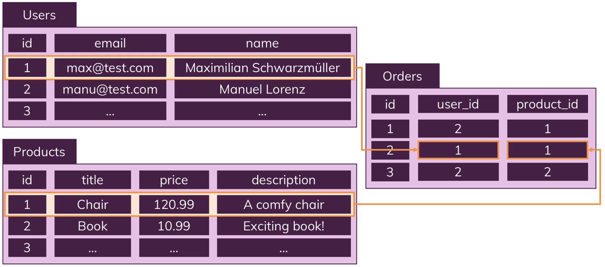

# SQL vs. NoSQL

## SQL 테이블 예시

Users, Products, Orders 테이블이 각각 있을 때 다른 테이블들을 연결할 수 있게 해 줍니다.
예를 들어 사용자가 다양한 제품들을 주문하고 한 제품을 다양한 사용자들이 주문하는 수도 있기 때문에 Orders 테이블은 Users와 Products 테이블의 연결고리로 설명할 수 있습니다.

## NoSQL

NoSQL에서 데이터의 일부는 다른 컬렉션 문서에 중첩 혹은 내장되어 있을 수 있습니다.\
따라서 SQL에서처럼 `id`에 따라 연결되는 것이 아니라 다른 문서에 데이터를 내장함으로써 관계를 표현할 수 있습니다.

