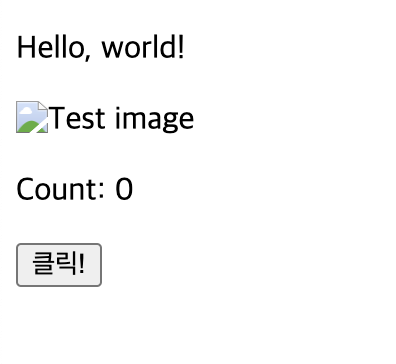
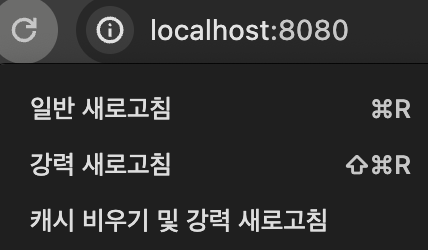

# Parcel

🚀 [**Parcel 공식문서**](https://parceljs.org/)

## Zero Configuration

- 특별한 설정 없이 바로 사용 가능한 빌드 도구입니다.\
  단순히 파일만 합쳐주는 것이 아닌 변환까지 포함됩니다.\
  내부적으로 SWC를 사용해 기존 도구보다 빠릅니다(ES Module을 적극 활용하는 Vite도 엄청나게 빠름).

- 참고:
  - [Parcel - Blazing fast, zero configuration web application bundler](https://github.com/ahastudio/til/tree/main/parcel)
  - [Vite](https://github.com/ahastudio/til/tree/main/vite)

## 실행

```bash
# index.html로 띄우기

npx parcel index.html

# 포트 지정

npx parcel index.html --port 8080
```

## 설정

설정이 필요 없다고 했지만, 다음 두가지 작업은 하는 게 좋습니다.

`package.json` 파일에 source 속성 추가.

```json
"source": "./index.html",
```

`source` 설정 후 `./index.html` 생략.

```bash
npx parcel --port 8080
```

### 파일 불러오기

`public/images` 경로에서 `test.jpg`를 불러왔습니다.

```typescript
import { useState } from 'react';
import Greeting from './components/Greeting';

export default function App() {
  const [count, setCount] = useState(0);

  const handleClick = () => {
    setCount(count + 1);
  };

  return (
    <div>
      <Greeting name='world' />
      
      <p>Count: {count}</p>
      <button type='button' onClick={handleClick}>
        클릭!
      </button>
    </div>
  );
}
```

하지만 제대로 불러오지 못했습니다.



#### 파일 불러오기 해결

```bash
npm i -D parcel-reporter-static-files-copy
```

[parcel-reporter-static-files-copy](https://github.com/elwin013/parcel-reporter-static-files-copy) 패키지 설치 후 `.parcelrc` 파일 작성합니다.

```bash
touch .parcelrc
```

이렇게 하면 static 폴더의 파일을 정적 파일로 Serving할 수 있습니다(이미지 등 Assets).

```json
{
  "extends": ["@parcel/config-default"],
  "reporters": ["...", "parcel-reporter-static-files-copy"]
}
```

`static`폴더 내부에 `/images/test.jpg`를 옮깁니다.

```bash
mkdir static
```

재실행하면 이미지를 불러올 수 있습니다.


혹시 이미지 불러오는 것을 실패했다면 브라우저에서 캐시 비우리 및 강력 새로고침을 해보시길 바랍니다.



### 빌드 + 정적 서버 실행

배포하고 싶다면 아래와 같이 실행합니다.\
`dist`폴더에서 확인할 수 있습니다.

```bash
npx parcel build

npx servor ./dist
```

- [servor](https://github.com/lukejacksonn/servor)

만약 다시 개발을 하고 싶다면 dist 폴더를 제거한 뒤 실행하면 됩니다.

```bash
rm -rf dist

npm start
```
