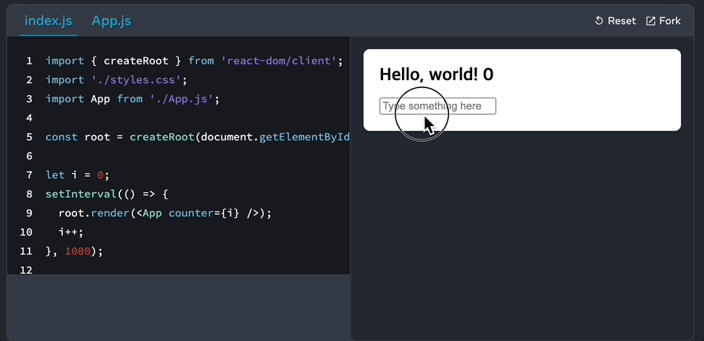

# 3. React

## 학습 키워드

- React란?
- React 컴포넌트
- React 리렌더링
- IoC(Inversion of Control)
- Library vs Framework

## 참고 문서

[React 공식문서](https://ko.legacy.reactjs.org/)\
[React Beta 문서](https://react.dev/)\
요즘 React 사용법을 다룬 문서. 베타 버전이고 완성도가 낮지만 (+ 한국어 버전이 없지만) 이것부터 읽는 걸 권장합니다.

- React로 작업하는 프로세스는 [Thinking in React](https://beta.reactjs.org/learn/thinking-in-react)를 참고. “상태”를 골라내는 게 핵심입니다.
- 한국어로 읽고 싶다면 [예전 문서의 설명](https://ko.reactjs.org/docs/thinking-in-react.html)만 살짝 참고하자.\
  (코드는 클래스 컴포넌트라면 참고하지 말 것!)
- [React 코어 개발자가 쓴 React에 대한 이해를 돕는 글](https://overreacted.io/ko/react-as-a-ui-runtime/) (필독!)

## 렌더링

- [createRoot](https://beta.reactjs.org/reference/react-dom/client/createRoot)
  - 한국어로 읽고 싶다면 [예전 문서](https://ko.reactjs.org/docs/react-dom-client.html#createroot)를 아주 살짝 참고합니다.

```tsx
function Greeting() {
  return <p>Hello, world!</p>;
}

function main() {
  const element = document.getElementById('root');

  if (!element) {
    return;
  }

  const root = ReactDOM.createRoot(element);

  root.render(<Greeting />);
}

main();
```

여러 개의 Root를 만들거나, 여러 번 render해도 됩니다.

여러 번 render하는 카운터 예제. 변경된 부분만 업데이트하기 때문에 하단 입력 컨트롤에 입력한 값이 그대로 유지됩니다.

- [updating-a-root-component](https://beta.reactjs.org/reference/react-dom/client/createRoot#updating-a-root-component)



## 리렌더링

- [React는 컴포넌트를 언제 다시 리렌더링 할까요?](https://velog.io/@surim014/react-rerender)\
  상태가 변경될 때 리렌더링 합니다.
- [왜 리액트에서 리렌더링이 발생하는가.](https://medium.com/@yujso66/%EB%B2%88%EC%97%AD-%EC%99%9C-%EB%A6%AC%EC%95%A1%ED%8A%B8%EC%97%90%EC%84%9C-%EB%A6%AC%EB%A0%8C%EB%8D%94%EB%A7%81%EC%9D%B4-%EB%B0%9C%EC%83%9D%ED%95%98%EB%8A%94%EA%B0%80-74dd239b0063)
- [React 렌더링 동작에 대한 (거의) 완벽한 가이드](https://velog.io/@superlipbalm/blogged-answers-a-mostly-complete-guide-to-react-rendering-behavior)

## 보너스

[면접 때 종종 나오는 (쓸모 없는) 질문인 “React는 프레임워크인가요, 라이브러리인가요?”에 대한 React 개발자의 답변](https://twitter.com/trueadm/status/1194567962784653312)

[제어의 역전](https://martinfowler.com/bliki/InversionOfControl.html)(IoC: Inversion of Control)이 Framework의 주요한 특징이고, React는 IoC를 통해 상태와 업데이트가 얽힌 복잡한 상황을 간단히 선언형 UI로 구성하는 혜택을 누립니다(이게 바로 React의 첫 번째 특징이다).\
그 누구도 매번 root를 render하는 방식으로 쓰면서 “이게 라이브러리지!”라며 감탄하지 않는다.

하지만 일반적으로는 (Martin Fowler의 개탄처럼) IoC는 IoC 컨테이너와 엮여서 DI와 동의어처럼 쓰이고, Next.js, Remix 같은 걸 Framework이라고 부르니 면접 때 괜히 이런 걸로 싸우지는 말자.\
“리액트 개발자가 이렇게 이야기했다니까요!”라고 해봐야 서로 감정만 상할 뿐입니다.
