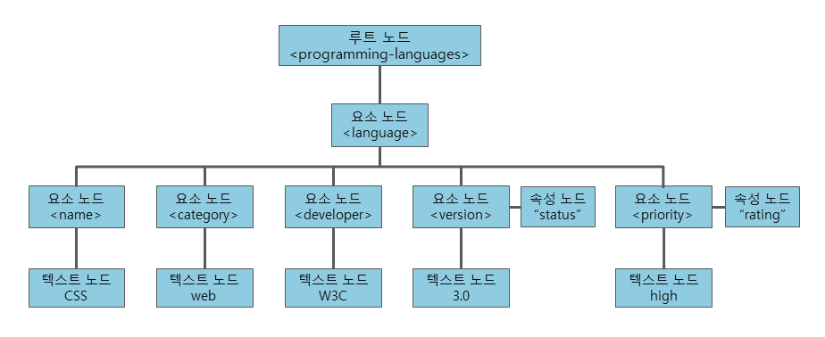
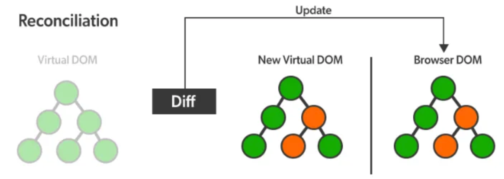

# 1. JSX

## 학습 키워드

- React에서 JSX를 사용하는 목적
- Syntactic sugar
- React.createElement
- React Element
- React StrictMode
- VDOM(Virtual DOM)이란?
  - DOM이란?
  - DOM과 Virtual DOM의 차이
- Reconciliation(재조정) 과정은 무엇인가?

## React에서 JSX를 사용하는 목적

JavaScript 코드 안에 마크업(HTML 코드)을 쉽게 작성하고 구조화하는 데 있습니다.

## XML-like syntax extension to ECMAScript

JSX(JavaScript XML)는 JavaScript 코드에서 XML과 유사한 문법을 사용하여 React 엘리먼트를 작성할 수 있게 하는 확장 문법입니다.\
JSX는 XML처럼 작성된 부분을 `React.createElement`을 쓰는 JavaScript 코드로 변환합니다.\
중괄호를 써서 JavaScript 코드를 그대로 쓸 수 있고, 결국은 JavaScript 코드와 1:1로 매칭됩니다.

변환기(Transpiler) 중 제일 유명한 [Babel](https://babeljs.io/repl)로 확인 가능합니다.\
→ “Presets”에서 “react”를 체크하거나, “Plugins”에서 “@babel/plugin-transform-react-jsx”를 추가하면 JSX를 실험할 수 있습니다.

JSX 파일에 `/* @jsx 어쩌고 */` 주석을 추가하면 `React.createElement` 대신 “어쩌고”를 쓰게 됩니다.

## React.createElement

### Examples

```jsx
React.createElement(component, props, ...children)
```

#### Example #1

JSX 코드

```jsx
<p>Hello, world!</p>
```

변환된 JS 코드

- 속성이 없는 경우

```jsx
React.createElement("p", null, "Hello, world!");
```

#### Example #2

JSX 코드

```jsx
<Greeting name="world" />
```

변환된 JS 코드

- 자식이 없는 경우

```jsx
React.createElement(Greeting, { name: "world" });
```

#### Example #3

JSX 코드

```jsx
<Button type="submit">Send</Button>
```

변환된 JS 코드

- 컴포넌트가 HTML 기본 태그가 아닌 경우

```jsx
React.createElement(Button, { type: "submit" }, "Send");
```

#### Example #4

JSX 코드

```jsx
<div className="test">
  <p>Hello, world!</p>
  <Button type="submit">Send</Button>
</div>
```

변환된 JS 코드

- 자식이 다수인 경우

```jsx
React.createElement(
  "div",
  { className: "test" },
  React.createElement("p", null, "Hello, world!"),
  React.createElement(Button, { type: "submit" }, "Send")
);
```

#### Example #5

JSX 코드

```jsx
<div>
  <p>Count: {count}!</p>
  <button type="button" onClick={() => setCount(count + 1)}>Increase</button>
</div>
```

변환된 JS 코드

```jsx
React.createElement(
  "div",
  null,
  React.createElement("p", null, "Count: ", count, "!"),
  React.createElement("button", { type: "button", onClick: () => setCount(count + 1) }, "Increase")
);
```

## React Element

Javascript에서 `document.createElment`로 DOM을 만들 듯, `React.createElement`는 `React Element`를 만들어줍니다.\
JSX 대신 `React.createElement`를 직접 사용해서 `React Element` 트리를 갱신하는데 쓸 수 있습니다.

### JSX Runtime

JSX Runtime은 _jsx란 함수를 직접 지원합니다.

JSX 코드

```jsx
import React from 'react';

function App() {
  return <h1>Hello World</h1>;
}
```

기존 변환된 JS 코드

```jsx
import React from 'react';

function App() {
  return React.createElement('h1', null, 'Hello world');
}
```

JSX 코드

```jsx
import React from 'react';

function App() {
  return <h1>Hello World</h1>;
}
```

17버전 변환된 JS 코드

```jsx
// Inserted by a compiler (don't import it yourself!)
import {jsx as _jsx} from 'react/jsx-runtime';

function App() {
  return _jsx('h1', { children: 'Hello world' });
}
```

### Preact

Preact는 h란 함수를 직접 지원합니다.\
`createElement` 대신 `h`를 사용합니다.

```jsx
import { h } from 'preact';

h('div', { id: 'foo' }, 'Hello!');
// <div id="foo">Hello!</div>

h('div', { id: 'foo' }, 'Hello', null, ['Preact!']);
// <div id="foo">Hello Preact!</div>

h(
    'div',
    { id: 'foo' },
    h('span', null, 'Hello!')
);
// <div id="foo"><span>Hello!</span></div>
```

## React StrictMode

개발 모드에서 더 많은 경고와 검사를 수행하여 React 애플리케이션에서 잠재적인 문제를 발견하고 해결하기 쉽게 도와주는 모드입니다.\
개발 시에 더 많은 검사와 경고를 수행하기 위해 애플리케이션을 두 번 렌더링합니다.

```jsx
root.render((
  <React.StrictMode>
    <App />
  </React.StrictMode>
))
```

## VDOM (Virtual DOM)

VDOM은 프로그래밍에서 사용되는 개념입니다.\
트리는 자기 반복적인 구조를 가진 기하학적 패턴을 말합니다.\
트리의 각 요소는 트리(하위 트리)로 이루어져 있습니다.\
VDOM은 React Element들이 계층 구조를 이루어 트리로 표현된 것 입니다.

### DOM(Document Object Model)이란?

DOM은 웹 페이지의 각각의 요소, 텍스트, 이미지 등을 프로그램이 이해하고 다룰 수 있게 해주는 트리 형태의 모델입니다.\
DOM이 없다면 프로그램은 웹 페이지의 각 요소와 그 구조를 몰라서 웹 페이지를 변경하거나 제어하는 것이 어려워집니다.\
개발자는 DOM이 제공하는 API를 통해 DOM구조에 접근을 하여 원하는 Element를 입맛대로 DOM 조작을할 수 있습니다.



### DOM과 Virtual DOM의 차이

Virtual DOM은 실제 DOM의 복사본입니다.\
하지만 Virtual DOM은 브라우저에 있는 문서에 직접적으로 접근할 수 없습니다.
따서 Virtual DOM으로 화면에 보여지는 내용을 직접 수정할 수 없습니다.

### VDOM의 역할

React에서는 화면을 업데이트할 때마다 Virtual DOM(VDOM) 트리를 생성합니다.\
VDOM은 React에서 사용되는 가상의 HTML 표현으로, 실제 DOM의 복제품입니다.\
웹 페이지에서 요소, 텍스트, 이미지 등을 바꾸려할 때 DOM조작을 필요로 하게 됩니다.\

만약 폰트의 컬러를 바꾸게 된다면 브라우저는 HTML을 탐색해 해당 Element를 찾고, 해당 Element와 자식 Element들을 DOM에서 제거합니다.\
이후 새롭게 수정된 Element로 이를 교체하게됩니다.\
이런 작업이 반복적으로 수행 된다면 퍼포먼스적으로 무리가 있을 수도 있습니다.\
리를 보완하기 위해 재조정이라는 과정을 수행합니다.

### Reconciliation(재조정)

#### 두개의 가상돔 객체

React는 `렌더링 이전 화면 구조를 나타내는 가상돔`과 `렌더링 이후에 보이게 될 화면 구조를 나타내는 가상돔`을 가지고 있습니다.\
리액트는 STATE가 변경될 때마다 Re-Rendering이 발생합니다.\
실제 브라우저가 그려지기 이전, Re-Rendering이 발생할때마다 새로운 내용이 담긴 가상돔을 생성하게 됩니다.\
렌더링 이전에 화면의 내용을 담고있는 첫번째 가상돔과 업데이트 이후에 발생할 두번째 가상돔을 비교합니다.
React는 이를 통해 차이가 발생한 부분만 브라우저상의 실제 DOM에 적용하게 되는 것이죠.



만약 10개의 항목이 바뀌었다면 실제 DOM을 10번 반복해 수정하는 것이 아닌, 한 번에 집단화시켜 이를 적용하게 됩니다.\
이렇게 변경된 모든 Element들을 집단화시켜 이를 한번에 실제 DOM에 적용하는 과정을 Reconciliation(재조정)이라고 합니다.

### React 엔진

```jsx
// react 객체에는 React 엔진이 내장되어 있습니다.

import React from 'react';
```

React 엔진은 화면을 업데이트할 때 변경된 부분만을 감지하여 VDOM을 수정합니다.\
실제 DOM 조작을 최소화하고 성능을 향상시키기 위한 과정입니다(재조정).

### ReactDOM

ReactDOM은 React 엔진이 수정한 VDOM을 사용하여 실제 DOM을 업데이트합니다.

```jsx
import React from 'react';
import ReactDOM from 'react-dom';
import App from './app';

ReactDOM.render(
  <React.StrictMode>
    <App />
  </React.StrictMode>,
  document.getElementById('root')
);
```

## React Developer Tools

React 애플리케이션을 개발 및 디버깅하기 위한 브라우저 확장 도구입니다.\
Virtual DOM(VDOM)을 시각적으로 탐색하고 디버깅하는 데 사용됩니다.

### 설치

- [react devtools extensions](https://github.com/facebook/react/tree/main/packages/react-devtools-extensions)
  - [Chrome web store](https://chrome.google.com/webstore/detail/react-developer-tools/fmkadmapgofadopljbjfkapdkoienihi?hl=en)
  - [Firefox Add-ons](https://addons.mozilla.org/en-US/firefox/addon/react-devtools/)
  - [Edge Add-ons](https://microsoftedge.microsoft.com/addons/detail/react-developer-tools/gpphkfbcpidddadnkolkpfckpihlkkil)

    → [Strict Mode](https://ko.reactjs.org/docs/strict-mode.html)를 쓰지 않으면 경고를 표시할 수 있습니다.

## VDOM을 쓰는 이유?

🤪 미신: VDOM을 쓰는 건 빠르기 때문이다.

👉 [현실](https://twitter.com/dan_abramov/status/842329893044146176): 속도는 필요한 만큼만 빠릅니다.\
더 큰 이유는 유지보수에 더 좋기 때문입니다.

### Dan Abramov

- [Redux](https://redux.js.org/) 창시자
- [React Core 개발자](https://beta.reactjs.org/learn/meet-the-team)

> “이 접근방식이 React의 **선언적 API**를 가능하게 합니다”

VDOM이 무엇이고, 왜 쓰는지 안다면 활용할 수 있는 [최적화 기법](https://ko.reactjs.org/docs/optimizing-performance.html)이 존재함.

## 참고 자료

- [facebook의 JSX 소개](https://facebook.github.io/jsx/)
- [React 공식문서의 JSX 소개](https://ko.reactjs.org/docs/introducing-jsx.html)
- [Babel, JSX, 그리고 빌드 과정들](https://ko.reactjs.org/docs/faq-build.html)
- [JSX 이해하기](https://ko.reactjs.org/docs/jsx-in-depth.html)

- [JSX 없이 사용하는 React](https://ko.reactjs.org/docs/react-without-jsx.html)
- [createElement](https://beta.reactjs.org/reference/react/createElement)

- [_jsx](https://reactjs.org/blog/2020/09/22/introducing-the-new-jsx-transform.html)
- [h()](https://preactjs.com/guide/v10/api-reference/#h--createelement)

- [VDOM (Virtual DOM)](https://ko.reactjs.org/docs/faq-internals.html)
- [재조정 (Reconciliation)](https://ko.reactjs.org/docs/reconciliation.html)

- [Virtual DOM (React) 핵심정리](https://callmedevmomo.medium.com/virtual-dom-react-%ED%95%B5%EC%8B%AC%EC%A0%95%EB%A6%AC-bfbfcecc4fbb)
