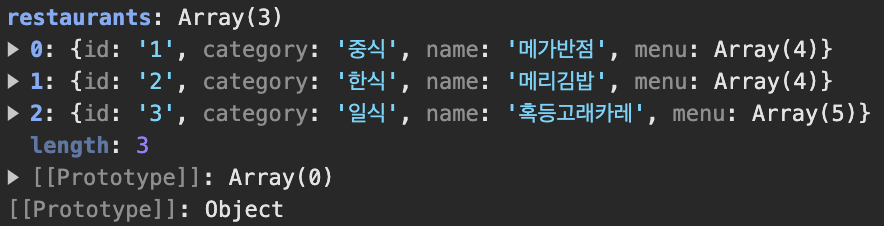

# 5. usehooks-ts

## 학습 키워드

- usehooks-ts
  - useBoolean
  - useEffectOnce
  - useFetch
  - useInterval
  - useEventListener
  - useLocalStorage
  - useDarkMode
- swr
- react-query

## usehooks-ts

모든 Hook에 대한 코드가 웹 사이트에 직접 노출되어 있습니다.

```bash
npm i usehooks-ts
```

### [useBoolean](https://usehooks-ts.com/react-hook/use-boolean)

참/거짓을 다룰 땐 toggle 같이 의도가 명확한 함수를 쓰는 게 좋습니다.

```tsx
import { useCallback, useState } from 'react';

export function useBoolean(defaultValue) {
  const [value, setValue] = useState(!!defaultValue);

  const setTrue = useCallback(() => {
    setValue(true);
  }, []);

  const setFalse = useCallback(() => {
    setValue(false);
  }, []);

  const toggle = useCallback(() => {
    setValue((x) => !x);
  }, []);

  return { value, setValue, setTrue, setFalse, toggle };
}
```

### [useEffectOnce](https://usehooks-ts.com/react-hook/use-effect-once)

의존성 배열을 빈 배열로 넣어서 한 번만 실행하는 Effect를 잡아줄 때가 많은데, 이걸 쓰면 더 명확히 드러나게 됩니다.

```tsx
import { useEffect } from 'react';

export function useEffectOnce(effect) {
  useEffect(effect, []);
}
```

### [useFetch](https://usehooks-ts.com/react-hook/use-fetch)

```tsx

interface Restaurant {
  id: string;
  category: string;
  name: string;
  menu: {
    id: string;
    name: string;
    price: number;
  }[];
}

interface Restaurants {
  [restaurants: string]: Restaurant[];
}

// useFetch가 엔드포인트에서 가져오는 데이터의 타입
const { data, error } = useFetch<Restaurants>('http://url');
```



정말 간단히 쓸 때 좋습니다.

몇 가지 기능이 살짝 더 있는 useFetch 라이브러리가 따로 있습니다.

- [use-http](https://use-http.com/)

조금 더 복잡해도 괜찮다면, 캐시 이슈를 고려한 좋은 대안이 있다.

- [SWR](https://swr.vercel.app/ko)
- [TanStack Query](https://tanstack.com/query)

### [useInterval](https://usehooks-ts.com/react-hook/use-interval)

React에서 `setInterval` 등을 쓸 때는 주의해야 할 부분이 있어서 Custom Hook을 만들어서 해결해야 합니다.

#### 문제 예시

리엑트 컴포넌트는 입력을 받아서 출력을 만드는 역할을 가지고 있습니다.\
리엑트에서 입력은 출력을 바꾸는 것(`state`와 `prop`)을 의미합니다.\
리엑트의 컴포넌트는 입력이 바뀌면 렌더링이 발생할 수 있는 구조입니다.\
아래의 `setInterval`은 출력을 바꾸는 일을 하기 보다 입력을 바꾸는 Side Effect입니다.\
그렇기 때문에 Side Effect를 분리하는 일은 중요합니다.

```jsx
// count는 증가하지만 다수의 인터벌로 인한 문제

function Counter() {
  // 입력
  const [count, setCount] = useState(0);

  // 사이드 이펙트
  setInterval(() => {
    setCount(count + 1);
  }, 1000);

  // 출력
  return <h1>{count}</h1>;
}
```

1. state인 `count`가 변경되면 렌더링이 발생합니다.\

2. 렌더링이 되면 새로운 컴포넌트 인스턴스가 생성되고, 이전의 컴포넌트 인스턴스는 사라집니다.\

3. 클로저는 이전 컴포넌트 인스턴스가 언마운트되거나 사라지더라도, 해당 컴포넌트에서 실행된 `setInterval`과 같은 비동기 작업은 자동으로 중지되지 않습니다.\
   위의 코드에서 이전 컴포넌트 인스턴스가 언마운트되지는 않지만 업데이트 되면서 `setInterval`이 다시 호출됩니다.
   하지만 이전 컴포넌트의 `setInterval`은 사라지지 않고 1초 마다 `setCount()`를 통해 `count`에 1을 더하게 됩니다.\

4. `setInterval`은 컴포넌트가 렌더링될 때마다 호출되므로, 매 렌더링 시마다 새로운 인터벌이 추가됩니다.\

5. 클로저는 함수가 생성될 때(mount)의 환경(스코프)을 기억하는 특성을 가지고 있습니다.\
   클로저 효과 때문에 첫 번째 렌더링에서의 `setInterval`은 `0 + 1`만 반복됩니다.\
   `count`가 1이 되고 두 번째 렌더링에서의 `setInterval`은 `1 + 1`만 반복됩니다.\
   이런식으로 여러개의 인터벌이 생성되고 실행되면서 count는 0을 포함, 0부터 1씩 증가된 숫자들을 오가며 변하게 됩니다

#### [useEffect 관점](https://overreacted.io/ko/a-complete-guide-to-useeffect/)

`useEffect`는 Side Effect를 수행하는 콜백 함수입니다.\

```jsx
// count도 증가하고 인터벌도 하나 이지만 불필요한 useEffect 호출로 인한 문제

function Counter() {
  // 입력
  const [count, setCount] = useState(0);

  // 사이드 이펙트
  useEffect(() => {
    const id = setInterval(() => {
      setCount(count + 1);
    }, 1000);

    // clean up
    return () => clearInterval(id);
  });

  // 출력(UI 생성)
  return <h1>{count}</h1>;
}
```

`useEffect`의 `clean up`을 통해 컴포넌트가 업데이트 될 때 `clearInterval`으로 이전 `setInterval`을 정리해 주며 해결할 수 있습니다.\

1. 초기 렌더링 시에 `Counter` 컴포넌트가 마운트됩니다.

2. `useEffect` 훅이 실행되고, 그 안에서 `setInterval` 함수를 사용하여 1초마다 `setCount(count + 1)`이 호출되는 타이머가 설정됩니다.

3. 타이머에 의해 1초가 지날 때마다 `setCount(count + 1)`이 호출되어 `count` 값이 업데이트됩니다.

4. count 값이 업데이트되면 React는 컴포넌트를 리랜더링합니다.

5. 리랜더링된 컴포넌트에서는 다시 `useEffect`가 실행되고, 이때 `clearInterval`을 포함한 정리(clean-up) 함수가 반환됩니다.

6. 다음 타이머가 설정되어 1초마다 `setCount(count + 1)`이 호출되는 과정이 반복됩니다.

React의 상태(State)는 컴포넌트의 생명주기 동안 유지되기 때문에 이러한 방식으로 1초마다 `count` 값이 업데이트되고, 이에 따라 컴포넌트가 리랜더링됩니다.\

하지만 문제가 있습니다.
`count` 값이 업데이트 될 때마다 `useEffect`가 불필요하게 호출됩니다.\
따라서 빈 배열 의존성을 통해 초기 렌더링에만 실행하도록 합니다.

```jsx
// 인터벌이 하나이고, 불필요한 useEffect 호출도 없지만 count가 증가하지 않는 문제

function Counter() {
  // 입력
  const [count, setCount] = useState(0);

  // 사이드 이펙트
  useEffect(() => {
    const id = setInterval(() => {
      setCount(count + 1);
    }, 1000);

    // clean up
    return () => clearInterval(id);
  }, []);

  // 출력
  return <h1>{count}</h1>;
}
```

의존성을 추가하지 또 다른 문제가 발생했습니다.\
React의 `setState`는 비동기적으로 동작하며, 클로저(Closure)의 영향을 받을 수 있습니다.\
따라서 `setCount(count + 1)`에서의 `count`는 현재 렌더링에서의 값이 아닌 이전 렌더링에서의 값일 수 있습니다.\
`count`가 변경되기 전에 업데이트로 인한
그래서 `setCount(count + 1)`는 0 + 1이 반복되며 `count`는 변하지 않게 됩니다.

그렇다면 함수형 업데이트(Functional Update)로 이 문제를 해결할 수 있습니다.

```jsx
function Counter() {
  // 입력
  const [count, setCount] = useState(0);

  // 사이드 이펙트
  useEffect(() => {
    const id = setInterval(() => {
      // 함수형 업데이트
      setCount((prevCount) => prevCount + 1);
    }, 1000);

    // clean up
    return () => clearInterval(id);
  }, []);

  // 출력
  return <h1>{count}</h1>;
}
```

함수형 업데이트는 setState의 콜백 함수에 이전 상태를 매개변수로 받아와서 새로운 상태를 반환하는 패턴입니다.\
빈 배열 의존성으로 첫 렌더 이후 호출되지 않기 때문에

#### [Ref 활용](https://overreacted.io/making-setinterval-declarative-with-react-hooks/)

### [useEventListener](https://usehooks-ts.com/react-hook/use-event-listener)

모든 종류의 이벤트를 확인할 수 있음. 특히 dispatchEvent로 전달되는 커스텀 이벤트에 반응하기 좋다. (강력 추천!)

### [useLocalStorage](https://usehooks-ts.com/react-hook/use-local-storage)

localStorage와 JSON으로 객체 영속화.

이벤트를 통해(dispatchEvent + useEventListener) 다른 컴포넌트와 동기화하는 게 매우 중요한 특징.

### [useDarkMode](https://usehooks-ts.com/react-hook/use-dark-mode)

## 참고 자료

[usehooks-ts](https://usehooks-ts.com/)
[React에서의 타이머 part 1 : setInterval 말고 이것! - 코드종님 영상](https://youtu.be/2tUdyY5uBSw)
