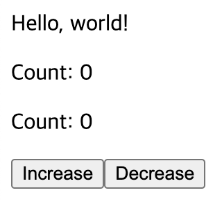

# 2. TSyringe

## 학습 키워드

- TSyringe
- 의존성 주입(Dependency Injection)
- reflect-metadata
- singleton (싱글톤)

## TSyringe

TypeScript용 DI 도구(IoC Container). External Store를 관리하는데 활용할 수 있습니다.\
React 컴포넌트 입장에서는 “전역”처럼 여겨집니다.\
“Prop Drilling” 문제를 우아하게 해결할 수 있는 방법 중 하나입니다.\
(React로 한정하면 Context도 쓸 수 있습니다)

의존성 설치

```bash
npm i tsyringe reflect-metadata
```

모든 프로그램이 시작하는 `src/main.tsx` 파일과 `src/setupTests.ts` 파일에서 reflect-metadata 임포트.
reflect-metadata는 TypeScript에서는 런타임에 타입 정보를 사용하기 위해 사용하는 polyfill.

```tsx
import 'reflect-metadata';
```

```javascript
// jest.config.js

setupFilesAfterEnv: [
  '@testing-library/jest-dom/extend-expect',
  '<rootDir>/src/setupTests.ts', // 이 부분 없다면 추가
],
```

싱글톤으로 관리할 CounterStore 클래스를 준비:

```tsx
import { singleton } from 'tsyringe';

@singleton()
class CounterStore {
  // …(중략)...
}
```

만약 `@singleton()`에 오류가 있다면 `tscocnfig.json` 설정 확인('@' 데코레이터 문제일 경우)

```json
// tscocnfig.json

{
  "compilerOptions": {
    "experimentalDecorators": true,
    // 나머지 옵션들...
  },
  // 다른 설정들...
}
```

싱글톤 CounterStore 객체를 사용:

```tsx
import { container } from 'tsyringe';

const counterStore = container.resolve(CounterStore);
```

테스트에서 TSyringe에서 관리하는 객체를 초기화할 수 있다.

```tsx
container.clearInstances();
```

## 상태 변경 알림

`Store`는 어떤 식으로든 `action`을 처리하고, 상태가 바뀌면 연결된 컴포넌트를 `forceUpdate`한다.

### TSyringe 사용 예시



#### App.tsx

```tsx
import CountControl from './components/CountControl';
import Counter from './components/Counter';

function App() {
  return (
    <div>
      <p>Hello, world!</p>
      <Counter />
      <Counter />
      <CountControl />
    </div>
  );
}

export default App;
```

#### CounterStore.ts

TSyringe의 store으로 `count`를 관리

```tsx
/* eslint-disable no-shadow */
import { singleton } from 'tsyringe';

type listener = () => void;

@singleton()
class CounterStore {
  count = 0;

  // 변수 listeners는 각 컴포넌트의 forceUpdate를 담을 set 객체
  listeners = new Set<listener>();

  // 컴포넌트 각각의 forceUpdate를 호출
  publish() {
    this.listeners.forEach((listener) => {
      listener();
    });
  }

  // 변수 listeners에 특정 컴포넌트의 forceUpdate를 set 객체에 추가
  addListener(listener: listener) {
    this.listeners.add(listener);
  }

  // 변수 listeners에 특정 컴포넌트의 forceUpdate를 set 객체에서 제거
  removeListener(listener: listener) {
    this.listeners.delete(listener);
  }
}

export default CounterStore;
```

#### Counter.tsx

UI를 담당하는 컴포넌트

```tsx

import { container } from 'tsyringe';
import { useEffect } from 'react';

import CounterStore from '../stores/CounterStore';
import useForceUpdate from '../hooks/useForceUpdate';

function Counter() {
  // TSyringe의 store
  const store = container.resolve(CounterStore);

  // 강제로 리랜더링하는 함수
  const forceUpdate = useForceUpdate();

  // Counter 컴포넌트 마다 각자의 forceUpdate를 store에 저장
  useEffect(() => {
    store.addListener(forceUpdate);

    return () => store.removeListener(forceUpdate);
  }, [store, forceUpdate]);

  // store의 count를 화면에 출력
  return (
    <div>
      <p>
        Count:
        {' '}
        {store.count}
      </p>
    </div>
  );
}

export default Counter;
```

#### CountControl.tsx

Business를 담당하는 컴포넌트

```tsx
import { container } from 'tsyringe';

import CounterStore from '../stores/CounterStore';

function CountControl() {
  const store = container.resolve(CounterStore);

  // 버튼을 클릭하면 store의 count에 1을 더함
  const handleClickIncrease = () => {
    store.count += 1;
    // 컴포넌트 각각의 forceUpdate를 호출
    store.publish();
  };

  // 버튼을 클릭하면 store의 count에 1을 뺌
  const handleClickDecrease = () => {
    store.count -= 1;
    // 컴포넌트 각각의 forceUpdate를 호출
    store.publish();
  };

  return (
    <div>
      <button type="button" onClick={handleClickIncrease}>
        Increase
      </button>
      <button type="button" onClick={handleClickDecrease}>
        Decrease
      </button>
    </div>
  );
}

export default CountControl;
```

#### useForceUpdate.ts

호출될 시 리렌더링

```tsx
import { useCallback, useState } from 'react';

export default function useForceUpdate() {
  const [, setState] = useState({});

  // state를 변경시켜 리랜더링을 발생
  return useCallback(() => setState({}), []);
}
```

### test 코드 작성시 문제

'increase' 버튼을 한 번 눌렀을 때와 두 번 눌렀을 때를 테스트 했습니다.\
한 번 눌렀을 때의 테스트는 통과했지만, 두 번 눌렀을 때의 테스트는 실패했습니다.\
이유는 첫 번째 테스트에서 한 번 누른 것이 두 번째 테스트에 영향을 주어 결국 세번 누른게 되었기 때문입니다.\
각각의 테스트 코드는 독립적이여야 하지만 전역 변수를 사용하면서 독립적이지 않게 되었습니다.

```tsx
// App.test.tsx

import { fireEvent, render, screen } from '@testing-library/react';

import App from './App';

const context = describe;

test('App', () => {
  render(<App />);
});

describe('App', () => {
  // 통과
  context('when press increase button once', () => {
    it('counter', () => {
      render(<App />);

      fireEvent.click(screen.getByText('Increase'));

      expect(screen.getAllByText('Count: 1')).toHaveLength(2);
    });
  });

  // 실패
  context('when press increase button twice', () => {
    it('counter', () => {
      render(<App />);

      fireEvent.click(screen.getByText('Increase'));
      fireEvent.click(screen.getByText('Increase'));

      // 'Count: 3'일 때 통과
      expect(screen.getAllByText('Count: 2')).toHaveLength(2);
    });
  });
});
```

#### 문제 해결

`beforeEach`와 `container.clearInstances();`을 사용합니다.\
각각의 테스트 전에 전역 변수를 초기화하여 테스트 코드를 독립적으로 바꿉니다.

```tsx
// App.test.tsx

import { fireEvent, render, screen } from '@testing-library/react';
import { container } from 'tsyringe';

import App from './App';

const context = describe;

test('App', () => {
  render(<App />);
});

describe('App', () => {
  // 전역 변수를 원래대로 초기화
  beforeEach(() => {
    container.clearInstances();
  });

  context('when press increase button once', () => {
    it('counter', () => {
      render(<App />);

      fireEvent.click(screen.getByText('Increase'));

      expect(screen.getAllByText('Count: 1')).toHaveLength(2);
    });
  });

  context('when press increase button twice', () => {
    it('counter', () => {
      render(<App />);

      fireEvent.click(screen.getByText('Increase'));
      fireEvent.click(screen.getByText('Increase'));

      expect(screen.getAllByText('Count: 2')).toHaveLength(2);
    });
  });
});
```

### 캡슐화 & custom hook

기존 코드를 리팩토링할 수 있습니다.

#### Counter.tsx 변경

UI 부분만 남기고 나머지 로직을 custom hook으로 뺐습니다.

```tsx
import useCounterStore from '../hooks/useCounterStore';

function Counter() {
  const store = useCounterStore();

  return (
    <div>
      <p>
        Count:
        {' '}
        {store.count}
      </p>
    </div>
  );
}

export default Counter;
```

#### useCounterStore.tsx 생성

```tsx
import { container } from 'tsyringe';
import { useEffect } from 'react';

import CounterStore from '../stores/CounterStore';
import useForceUpdate from './useForceUpdate';

function useCounterStore() {
  const store = container.resolve(CounterStore);

  const forceUpdate = useForceUpdate();

  useEffect(() => {
    store.addListener(forceUpdate);

    return () => store.removeListener(forceUpdate);
  }, [store, forceUpdate]);

  return store;
}

export default useCounterStore;
```

#### CountControl.tsx 변경

`handleClickIncrease`와 `handleClickDecrease`의 내부 로직을 캡슐화 하였습니다.

```tsx
import { container } from 'tsyringe';

import CounterStore from '../stores/CounterStore';

function CountControl() {
  const store = container.resolve(CounterStore);

  const handleClickIncrease = () => {
    store.increase();
  };

  const handleClickDecrease = () => {
    store.decrease();
  };

  return (
    <div>
      <button type="button" onClick={handleClickIncrease}>
        Increase
      </button>
      <button type="button" onClick={handleClickDecrease}>
        Decrease
      </button>
    </div>
  );
}

export default CountControl;
```

#### CounterStore.ts 변경

```tsx
/* eslint-disable no-shadow */
import { singleton } from 'tsyringe';

type listener = () => void;

@singleton()
class CounterStore {
  count = 0;

  listeners = new Set<listener>();

  increase() {
    this.count += 1;
    this.publish();
  }

  decrease() {
    this.count -= 1;
    this.publish();
  }

  publish() {
    this.listeners.forEach((listener) => {
      listener();
    });
  }

  addListener(listener: listener) {
    this.listeners.add(listener);
  }

  removeListener(listener: listener) {
    this.listeners.delete(listener);
  }
}

export default CounterStore;
```

컴포넌트는 해당 `Store`에서 상태를 얻어서 UI를 업데이트하게 되는데, 선언형 UI가 얼마나 편한지 절실히 느낄 수 있습니다.

## 참고 자료

- [TSyringe](https://github.com/microsoft/tsyringe)
- [reflect-metadata](https://github.com/rbuckton/reflect-metadata)
- [The problem with passing props](https://beta.reactjs.org/learn/passing-data-deeply-with-context#the-problem-with-passing-props)
