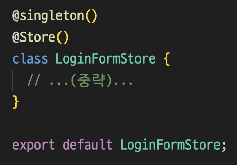

# 4. usestore-ts

## 학습 키워드

- usestore-ts
- useSyncExternalStore

## Example

```tsx
import { Store, Action, useStore } from 'usestore-ts';

@Store()
class CounterStore {
  count = 0;

  @Action()
  increase() {
    this.count += 1;
  }

  @Action()
  reset() {
    this.count = 0;
  }
}

const counterStore = new CounterStore();

export default function Counter() {
  // [{프로퍼티}, 가져올 store의 인스턴스] = useStore(가져올 store)
  const [{ count }, store] = useStore(counterStore);

  return (
    <div>
      <p>
        Count:
        {' '}
        {count}
      </p>
      <p>
        <button type="button" onClick={() => store.increase()}>
          Increase
        </button>
        <button type="button" onClick={() => store.reset()}>
          Reset
        </button>
      </p>
    </div>
  )
}
```

## usestore 만들어 보기

### ObjectStore.ts

```tsx
type listener = () => void;

export default class ObjectStore {
  /**
   * 컴포넌트 별 forceUpdate를 담을 Set 객체
   */
  private listeners = new Set<listener>();

  /**
   * listeners Set 객체에 forceUpdate를 추가
   * @param listener forceUpdate
   */
  addListener(listener: listener) {
    this.listeners.add(listener);
  }

    /**
   * listeners Set 객체에 forceUpdate를 제거
   * @param listener forceUpdate
   */
  removeListener(listener: listener) {
    this.listeners.delete(listener);
  }

  /**
   * 리렌더링
   */
  protected publish() {
    this.listeners.forEach((listener) => listener());
  }
}
```

### CounterStore.ts

```tsx
/* eslint-disable no-shadow */
import { singleton } from 'tsyringe';

import ObjectStore from './ObjectStore';

// singleton으로 인해 전체 애플리케이션에서 CounterStore 클래스의 인스턴스가 하나만 존재
// 여러 인스턴스를 생성하려고 하면 동일한 인스턴스가 재사용
@singleton()
export default class CounterStore extends ObjectStore {
  count = 0;

  /**
   * 카운트를 증가
   * @param step 얼만큼 변화할지
   */
  increase(step = 1) {
    this.count += step;
    this.publish();
  }

  /**
   * 카운트를 감소
   * @param step 얼만큼 변화할지
   */
  decrease(step = 1) {
    this.count -= step;
    this.publish();
  }
}
```

### useObjectStore.tsx

```tsx
import { useEffect } from 'react';

import useForceUpdate from './useForceUpdate';
import ObjectStore from '../stores/ObjectStore';

/**
 * ObjectStore 클래스를 사용해 forceUpdate를 listeners 객체에 추가 또는 삭제
 * @param store
 * @returns CounterStore {count: 0, listeners: set(), {decrease: f, ... , {addListener: f, ...}}}
 */
export default function useObjectStore<T extends ObjectStore>(store: T): T {
  const forceUpdate = useForceUpdate();

  useEffect(() => {
    store.addListener(forceUpdate);

  return () => store.removeListener(forceUpdate);
}, [store, forceUpdate]);

  return store;
}
```

### useCounterStore.tsx

```tsx
import { container } from 'tsyringe';

import CounterStore from '../stores/CounterStore';
import useObjectStore from './useObjectStore';

/**
 * CounterStore 클래스의 싱글톤 인스턴스를 생성하거나 검색
 * @returns CounterStore {count: 0, listeners: set(), {decrease: f, ... , {addListener: f, ...}}}
 */
export default function useCounterStore(): CounterStore {
  const store = container.resolve(CounterStore);

  return useObjectStore(store);
}
```

### useForceUpdate.ts

```tsx
import { useCallback, useState } from 'react';

/**
 * 강제 리렌더링을 만드는 훅
 * @returns setState를 호출하는 콜백 함수
 */
export default function useForceUpdate() {
  const [, setState] = useState({});

  return useCallback(() => setState({}), []);
}
```

### CountControl.tsx

```tsx
import useCounterStore from '../hooks/useCounterStore';

/**
 * increase, decrease 버튼 UI 담당 컴포넌트
 */
export default function CountControl() {
  const store = useCounterStore();

  const { count } = store;

  return (
    <div>
      <p>{count}</p>
      <button type="button" onClick={() => store.increase()}>
        Increase
      </button>
      <button type="button" onClick={() => store.increase(10)}>
        Increase 10
      </button>
      <button type="button" onClick={() => store.decrease()}>
        Decrease
      </button>
      <button type="button" onClick={() => store.decrease(10)}>
        Decrease 10
      </button>
    </div>
  );
}
```

## usestore-ts 사용

### Installation

```bash
npm install usestore-ts
```

### Configure TypeScript

```json
// tsconfig.json
    "experimentalDecorators": true,
    "emitDecoratorMetadata": true,
```

### Example

```tsx
import { Store, Action, useStore } from 'usestore-ts';

@Store()
class CounterStore {
  count = 0;

  @Action()
  increase() {
    this.count += 1;
  }

  @Action()
  reset() {
    this.count = 0;
  }
}

const counterStore = new CounterStore();

export default function Counter() {
  const [{ count }, store] = useStore(counterStore);

  return (
    <div>
      <p>
        Count:
        {' '}
        {count}
      </p>
      <p>
        <button type="button" onClick={() => store.increase()}>
          Increase
        </button>
        <button type="button" onClick={() => store.reset()}>
          Reset
        </button>
      </p>
    </div>
  )
}
```

### Store 작성

```tsx
// CounterStore.ts

import { singleton } from 'tsyringe';

import { Store, Action } from 'usestore-ts';

@singleton()
@Store()
class CounterStore {
  count = 0;

  @Action()
  increase(step = 1) {
    this.count += step;
  }

  @Action()
  decrease(step = 1) {
    this.count -= step;
  }
}

// export default에서 decorator 적용이 안 되는 문제가 있기 때문에 분리해서 작성
export default CounterStore;
```

### 커스텀 Hook 작성

```tsx
// useCounterStore.tsx

import { container } from 'tsyringe';

import { useStore } from 'usestore-ts';

import CounterStore from '../stores/CounterStore';

export default function useCounterStore() {
  const store = container.resolve(CounterStore);
  return useStore(store);
}
```

비동기 함수에 `@Action`을 붙이면 다르게 작동할 수 있다는 점에 주의\
별도의 액션을 만들면 신경 쓸 부분이 줄어듭니다.

```tsx
@singleton()
@Store()
class PostStore {
  posts: Post[] = [];

  async fetchPosts() {
    this.startLoading();

    const posts = await fetchPosts();

    this.completeLoading(posts);
  }

  @Action()
  startLoading() {
    this.posts = [];
  }

  @Action()
  completeLoading(posts: Post[]) {
    this.posts = posts;
  }
}
```

## useSyncExternalStore

useSyncExternalStore는 외부 store를 구독할 수 있는 React Hook입니다.

```tsx
const snapshot = useSyncExternalStore(subscribe, getSnapshot, getServerSnapshot?)
```

### parameter

- `subscribe`\
: 하나의 callback 인수를 받아 store에 구독하는 함수입니다.\
store가 변경되면 제공된 callback을 호출해야 합니다.\
그러면 컴포넌트가 리렌더링됩니다.\
subscribe 함수는 구독을 정리하는 함수를 반환해야 합니다.

- `getSnapshot`
: 컴포넌트에 필요한 store 데이터의 스냅샷을 반환하는 함수입니다.\
스토어가 변경되지 않은 상태에서 getSnapshot을 반복적으로 호출하면 동일한 값을 반환해야 합니다.\
저장소가 변경되어 반환된 값이 다르면 (Object.is와 비교하여) React는 컴포넌트를 리렌더링합니다.

`optional getServerSnapshot`
: store에 있는 데이터의 초기 스냅샷을 반환하는 함수입니다.\
서버 렌더링 도중과 클라이언트에서 서버 렌더링 된 콘텐츠의 하이드레이션 중에만 사용됩니다.\
서버 스냅샷은 클라이언트와 서버 간에 동일해야 하며 일반적으로 직렬화되어 서버에서 클라이언트로 전달됩니다.\
이 함수가 제공되지 않으면 서버에서 컴포넌트를 렌더링할 때 오류가 발생합니다.

### return

렌더링 로직에 사용할 수 있는 store의 현재 스냅샷입니다.

### 사용법

컴포넌트의 최상위 레벨에서 `useSyncExternalStore`를 호출하여 외부 데이터 저장소에서 값을 읽습니다.

```tsx
import { useSyncExternalStore } from 'react';
import { todosStore } from './todoStore.js';

export default function TodosApp() {
  const todos = useSyncExternalStore(todosStore.subscribe, todosStore.getSnapshot);
  return (
    <>
      <button onClick={() => todosStore.addTodo()}>Add todo</button>
      <hr />
      <ul>
        {todos.map(todo => (
          <li key={todo.id}>{todo.text}</li>
        ))}
      </ul>
    </>
  );
}
```

### 주의 사항

가능하면 내장된 React `state`를 `useState` 및 `useReducer`와 함께 사용하는 것이 좋습니다.\
`useSyncExternalStore` API는 기존 비 React 코드와 통합해야 할 때 주로 유용합니다.

### Error: Cannot find store glue

`parcel`이 컴파일하는 과정에서 `export default class` 로 내보낼 때 `decorator` 적용이 안 되는 문제가 발생할 수 있습니다.\

#### 해결 방법

1. `export default`에서와 `class`를 분리하여 작성하는 방법이 있습니다. (추천)
  

2. TSC를 사용하는 방법이 있습니다.\
  이 경우 속도가 느려진다는 단점이 있습니다.\
  TSC를 사용하려면 `.parcelrc` 파일을 다음과 같이 변경하면 됩니다.

    ```json
    {
      "extends": ["@parcel/config-default"],
      "reporters": ["...", "parcel-reporter-static-files-copy"],
      "transformers": {
        "*.{ts,tsx}": ["@parcel/transformer-typescript-tsc"]
      }
    }
    ```

3. parcel의 버전을 낮추는 방법이 있습니다.\
  parcel 이 업데이트되면서 내부적으로 세팅 기본값이 바뀌어서 컴파일하는 과정에서 export default class 로 내보낼 때 데코레이터 적용이 안되는 것 일 수도 있다고 합니다.


## 참고

- [usestore-ts](https://usestore-ts.com/)
- [useSyncExternalStore](https://beta.reactjs.org/reference/react/useSyncExternalStore)
- [useSyncExternalStore(ko)](https://ko.react.dev/reference/react/useSyncExternalStore)
- [FECONF 2022 - 상태관리 이 전쟁을 끝내러 왔다](https://youtu.be/KEDUqA9JeIo)
