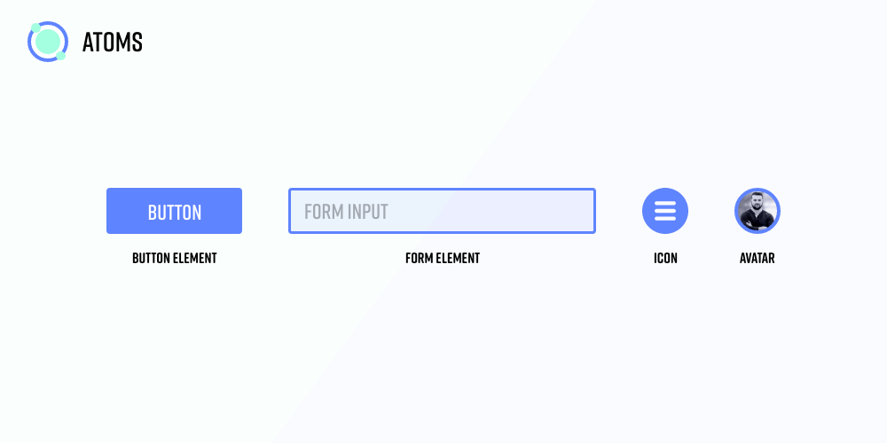
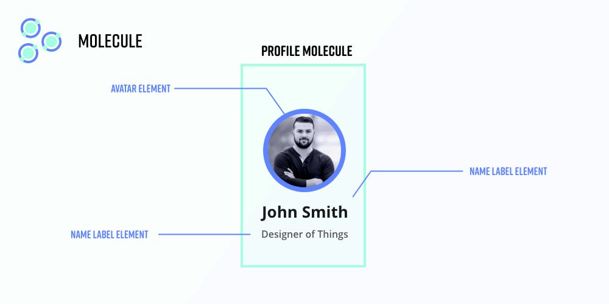
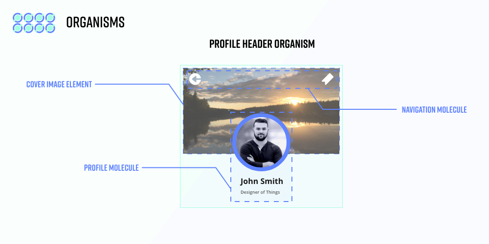
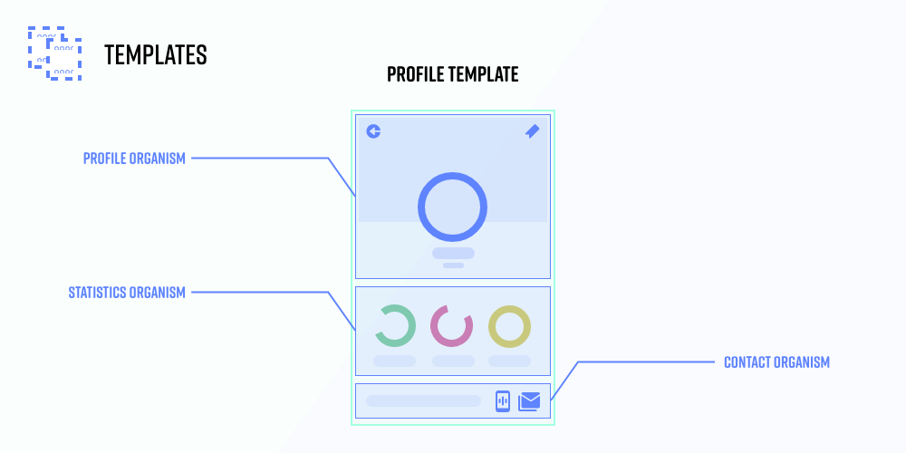
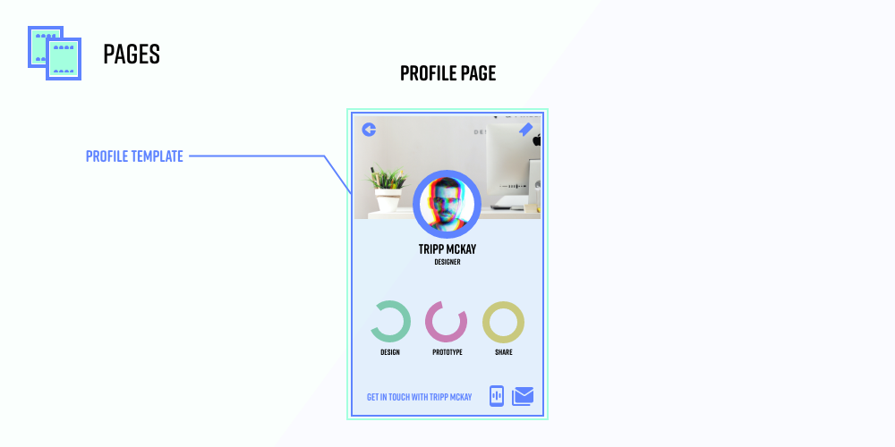

# 1. Design System

## 학습 키워드

- 반응형 웹 디자인(Responsive web design)
- 디자인 시스템(Design System)
- Atomic Design

## 반응형 웹 디자인

웹사이트가 다양한 디바이스와 화면 크기에 대응하여 최적의 사용자 경험을 제공하는 디자인 접근 방식입니다.\
사용자가 데스크톱, 노트북, 태블릿, 스마트폰 등 다양한 기기에서 웹사이트를 방문할 때 일관된 형태와 사용이 가능하도록 합니다.

픽셀(px)이 아닌 퍼센트(%)나 em 등을 사용한 유연한 그리드 시스템,\
화면의 너비, 높이, 해상도 등과 같은 다양한 미디어 특성에 따라 스타일을 다르게 적용하는 미디어 쿼리,\
이미지 리소스에 대한 적절한 크기 조정 및 해상도 조정 기법을 사용한 유연한 이미지 및 미디어,\
텍스트, 이미지, 비디오 등의 컨텐츠가 화면 크기에 맞게 조절되도록 탄력적인 레이아웃 같은 요소가 반응형 웹 디자인에 포함됩니다.

## 디자인 시스템(Design System)

Summary: A design system is a set of standards to manage design at scale by reducing redundancy while creating a shared language and visual consistency across different pages and channels.

요약: 디자인 시스템은 여러 페이지와 채널에서 중복을 줄이고, 공유 언어와 시각적 일관성을 만들어 대규모 디자인을 효과적으로 관리하기 위한 표준의 집합입니다.

Definition: A design system is a complete set of standards intended to manage design at scale using reusable components and patterns.

정의: 디자인 시스템은 재사용 가능한 요소와 패턴을 사용하여 대규모 디자인을 관리하기 위한 표준의 집합입니다.

우리는 Theme과 Component라는 개념을 활용할 수 있습니다.

### UX & UI

#### User Experience

UX는 사용자의 경험입니다.

카카오톡을 예시로 들면 카카오톡의 UX는 채팅이 됩니다.\
UX는 친구 검색, 친구 추가, 친구와 대화 등이 있습니다.

#### User Interface

UI는 사용자의 경험을 실현시키는 수단입니다.

카카오톡을 예시로 들면 UI는 어플리케이션입니다.\
UI는 어떤 폰트, 컬러, 레이아웃을 고려해야합니다.

### 사용자 중심의 디자인 분야에서 유명한 인물

Jakob Nielsen(사용성 테스트)과 Donald Norman(UX 전반적), Alan Cooper(비주얼 베이직)은 UX 분야에서 전설적인 인물입니다.

### 디자인 시스템의 사례

사례에 나오는 디자인 시스템은 일관된 형태로 작동할 수 있도록 서비스를 제공해줍니다.

- [Atlassian Design System](https://atlassian.design/)
- [Material Design (Google)](https://m3.material.io/)
- [Base Web (Uber)](https://baseweb.design/)
- [Polaris (Shopify)](https://polaris.shopify.com/)
- [Lightning Design System (Salesforce)](https://www.lightningdesignsystem.com/)
- [Mailchimp Pattern Library](https://ux.mailchimp.com/patterns/color)
- [Ant Design](https://ant.design/)

### 디자인 시스템 Gallery

- [Design Systems Gallery](https://designsystemsrepo.com/design-systems/)
- [Design Systems](https://www.designsystems.com/open-design-systems/)

## Atomic Design

### Atomic Design이란

Atomic design은 디자인 시스템을 만들기 위한 방법론입니다.

### 왜 필요한가?

- 아토믹 디자인은 디자인 시스템을 제작하는 명확한 방법론을 제공합니다.
- 클라이언트와 팀 구성원은 실제 단계를 목격함으로써 디자인 시스템의 개념을 더 잘 이해할 수 있습니다.
- 아토믹 디자인을 통해 추상적인 것부터 구체적인 것까지 이동할 수 있으므로 일관성과 확장성을 동시에 유지할 수 있습니다.
- 구성 요소를 조립하는 대신 분해하는 방식으로 시스템을 만들기 때문에 체계적으로 바로 구축할 수 있습니다.

### 특징

Atomic design에는 다섯 가지 명확한 단계가 있습니다.

#### 원자 (Atoms)

Atoms은 더 이상 쪼갤 수 없는 단위 요소입니다.\
웹 인터페이스에 적용할 때, Atoms은 HTML 태그로 이루어져 있습니다.\
예를 들어, `form label`, `input`, 또는 `button`과 같은 것들이 Atoms입니다.

Atoms은 color palettes, fonts와 같은 보다 추상적인 요소뿐만 아니라 애니메이션과 같은 인터페이스의 보다 무형의 측면도 포함될 수 있습니다.

#### 분자 (Molecules)

Molecules는 Atoms들이 결합하여 만들어집니다.\
Molecules는 자체적으로 특성을 갖고 디자인 시스템의 기반을 형성합니다.\
`form label`, `input` 또는 `button`과 같은 것들은 개별적으로는 그다지 유용하지 않지만, 이러한 것들을 폼이라는 Molecules로 결합하면 함께 기능을 수행할 수 있게 됩니다.

Molecules는 "한 가지 일을 잘 수행한다"를 장려합니다.\
Molecules는 경험상 재사용을 위해 만들어진 상대적으로 간단한 원자 조합입니다.

#### 생물 (Organisms)

Organisms은 Molecules들을 결합하여 상대적으로 복잡하고 독립적인 인터페이스의 구성 요소를 형성합니다.\
이제 디자인이 점점 구체화되기 시작하며 사용자에게 의미 있는 정보를 제공하거나 인터렉션 할 수 있는 UI를 제공하는 등 서비스로서 의미를 갖습니다.\
Organisms은 서로 비슷하거나 다른 Molecules 유형으로 구성될 수 있습니다.

예를 들어, `header` Organisms에는 `logo`(atom), `navigation`(molecule), `search form`(molecule) 및 `list`와 같은 다양한 구성 요소가 포함될 수 있습니다.

#### 템플릿 (Templates)

Templates 단계에서는 고객 및 최종 산출물에 더 적합한 언어를 사용하여 조직들을 함께 묶어 페이지를 형성합니다.\
이곳에서 디자인이 점점 구체화되고 레이아웃 등이 작동하는 것을 볼 수 있습니다.

실제 콘텐츠가 입혀지기 전 UI 요소, 레이아웃, 기능이 어떻게 배치될지 정하는 와이어 프레임이라고 볼 수 있습니다.\
따라서 자주 재사용되는 컴포넌트가 됩니다.

#### 페이지 (Pages)

페이지는 템플릿의 구체적인 인스턴스입니다.\
여기서는 가상 콘텐츠를 실제 콘텐츠로 대체하여 사용자가 최종적으로 볼 것과 비슷한 모습을 제공합니다.\
일반적으론 하나의 URI 당 하나의 Page 컴포넌트만 존재합니다.

페이지는 템플릿의 변형을 테스트하는 플랫폼 역할도 합니다.\
예를 들어 40자를 포함하는 헤드라인과 340자를 포함하는 헤드라인을 보여주고 싶을 수 있습니다.\
마찬가지로, 할인 코드가 적용된 10개 항목과 1개 항목이 포함된 사용자 장바구니의 모양을 조사할 수 있습니다.\
이러한 특정 사례는 반복 프로세스와 시스템 구성에 영향을 미칩니다.

## 참고 자료

- [Laura Kalbag의 “Design Systems” 소개](https://24ways.org/2012/design-systems/)
- [Laura Kalbag의 “Design Systems” 슬라이드](https://speakerdeck.com/laurakalbag/design-systems-1)
- [Nielsen Norman Group의 “Design Systems 101”](https://www.nngroup.com/articles/design-systems-101/)
- [제이콥 닐슨](https://ko.wikipedia.org/wiki/%EC%A0%9C%EC%9D%B4%EC%BD%A5_%EB%8B%90%EC%8A%A8)
- [도널드 노먼](https://ko.wikipedia.org/wiki/%EB%8F%84%EB%84%90%EB%93%9C_%EB%85%B8%EB%A8%BC)
- [Alan Cooper](https://en.wikipedia.org/wiki/Alan_Cooper)
- [Atomic Design 소개 글](https://bradfrost.com/blog/post/atomic-web-design/)
- [Atomic Design 전자책](https://atomicdesign.bradfrost.com/)
- [Effective Atomic Design](https://kciter.so/posts/effective-atomic-design)
