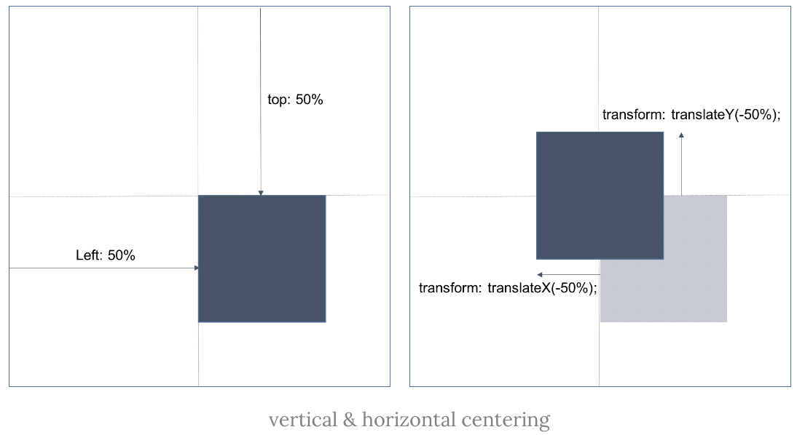
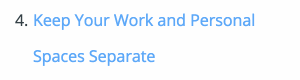

# 중앙 정렬, 수평 정렬, 수직 정렬

## 수평/수직 정렬(Horizontal & Vertical Align)

### 자식 요소가 중앙으로 갈 경우

요소의 너비와 높이가 고정되어 있는 경우, 요소의 너비와 높이가 불확정 상태의 경우 모두 사용 가능한 방법입니다.

```css
.parent {
  position: relative;
}

.child {
  position: absolute

  /* 요소의 왼쪽 위 꼭지점이 기준 */
  top: 50%;
  left: 50%;

  /* transform은 자신의 크기를 기준으로 좌표 이동 */
  /* 요소의 높이/너비의 반(50%)만큼 위/왼쪽으로 이동 */
  transform: translate(-50%, -50%);
}
```



### 부모 요소가 자식요소를 중앙으로 보내는 경우

`Flexbox` 를 사용한 방법은 아래와 같습니다.

```csscn
.parent {
  display: flex;
  justify-content: center;
  align-items: center;
}
```

`Grid` 를 사용한 방법은 아래와 같습니다.

#### 첫 번째 방법

```css
.parent {
  display: grid;
  justify-content: center;
  align-items: center;
}
```

#### 두 번째 방법

```css
.parent {
  display: grid;
  place-items: center;
}
```

자식 요소를 화면에 중앙으로 배치하고 싶을 경우 부모 요소의 높이는 화면의 높이만큼 이여야 합니다.

## 수평 정렬(Horizontal Align)

### inline/ inline-block 요소 수평 정렬

부모 요소에 `text-align: center;`를 지정합니다.
`inline`/ `inline-block`인 자식 요소는 수평 중앙 정렬이 됩니다.

```css
.container {
  text-align: center;
}
```

### block 요소 수평 정렬

정렬 대상 요소에 `width` 를 명시적으로 지정하고 `margin-right` 과 `margin-left` 프로퍼티에 `auto` 를 지정합니다.

```css
.item {
  /* block의 width는 100%이기 때문에 100% 보다 낮추지 않으면 중앙정렬을 할 수 없습니다.*/
  width: 200px;
  margin: 0 auto;
}
```

### 복수의 block 요소 수평 정렬

복수의 `block` 요소는 기본적으로 수직 정렬됩니다.\
이것을 수평정렬하기 위해서는 정렬 대상 `block` 요소를 `inline-block` 요소로 변경한 후 부모 요소에 `text-align: center;`를 지정합니다.

정렬 대상 요소에 `width` 를 지정하지 않으면 콘텐츠의 너비가 너비에 맞추어 결정되므로 명시적으로 너비를 지정합니다.

```css
.container {
  text-align: center;
}
.item {
  width: 150px;
  display: inline-block;
}
```

### Flexbox 수평 정렬

정렬 대상의 부모 요소에 아래의 룰셋을 선언합니다.

```css
.container {
  display: flex;
  justify-content: center;
}
```

## 수직 정렬(Vertical Align)

### inline/inline-block 요소 수직 정렬

#### Single line(비추)

정렬 대상의 부모 요소에 `padding-top` 과 `padding-bottom` 프로퍼티값을 동일하게 적용합니다.

```css
.container {
  /* 위 아래 동일하게 50px */
  padding: 50px;
}
```

`padding` 을 사용할 수 없는 경우, 요소의 `height` 와 `line-height` 프로퍼티값을 동일하게 적용합니다.

```css
.container {
  height: 100px;
  /* 글자 높이를 변경하기 위해서 사용하는 CSS 속성(줄 간격에 영향) */
  line-height: 100px;
}
```

단, 이 방법은 행간이 지나치게 넓어지거나 Click Dead Zone 이슈가 발생하는 등 여러 줄의 텍스트에는 사용할 수 없습니다.

Click Dead Zone은 복수행일 때 `line-height` 로 인해 발생하는 클릭할 수 없는 구역입니다.



#### Multiple lines

여러 줄의 텍스트의 경우, `padding-top`과 `padding-bottom` 프로퍼티값을 동일하게 적용하는 방법도 가능합니다.

또 다른 방법으로 `vertical-align` 프로퍼티를 사용한 방법도 가능합니다.
이 방법은 `table` 속성을 사용하여야 합니다.

```css
.parent {
  display: table;
  height: 100px;
}

.child {
  display: table-cell;
  vertical-align: middle;
}
```

#### Flexbox

flexbox를 사용하여 위의 방법보다 간단하게 사용할 수 있습니다.

```css
.container {
  display: flex;
  justify-content: center;
  flex-direction: column;
  height: 400px;
}
```

## block 요소

### 요소의 높이가 고정되어 있는 경우

부모 요소를 기준으로 절대 위치를 지정합니다.

```css
.parent {
  position: relative;
}

.child {
  position: absolute;
  top: 50%;
  height: 100px;
  /* height(100px)의 반 만큼 위로 이동 */
  margin-top: -50px;
}
```

### 요소의 높이가 불확정 상태의 경우

부모 요소를 기준으로 절대 위치를 지정합니다.

```css
.parent {
  position: relative;
}
.child {
  position: absolute;
  top: 50%;
  /* 요소의 높이의 반(50%) 만큼 위로 이동 */
  transform: translateY(-50%);
}
```

### Flexbox 정렬

부모 요소에 Flexbox layout을 지정합니다.

```css
.parent {
  display: flex;
  /* 위에서 아래로 수직 배치 */
  flex-direction: column;
  /* 중앙정렬 */
  justify-content: center;
}
```

## 자료

- [poiemaweb](https://poiemaweb.com/css3-centering)
