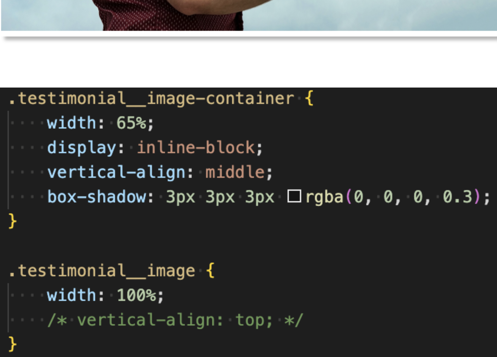
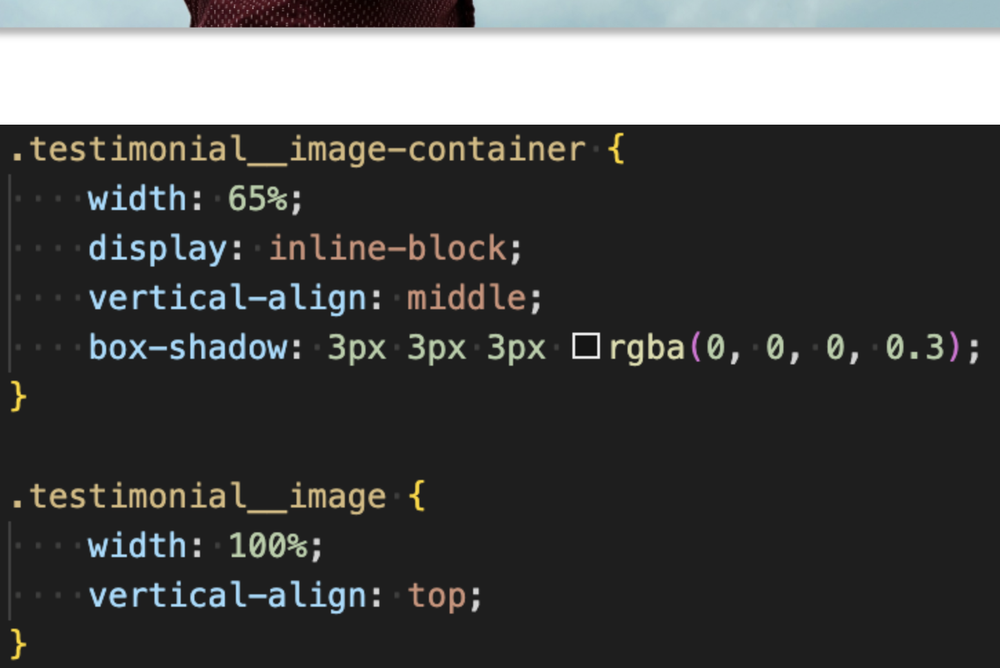

# background

## background 기본 사용

- `/` 앞은 위치 (`background-position`)
- `/` 뒤는 크기 (`background-size`)

```css
background: color image position / size repeat attachment origin clip;
```

## 각 속성 설명

| 속성                    | 예시                                  | 설명                     |
| ----------------------- | ------------------------------------- | ------------------------ |
| `background-color`      | `#f0f0f0`, `transparent`              | 배경 색상                |
| `background-image`      | `url(bg.png)`, `radial-gradient(...)` | 배경 이미지              |
| `background-position`   | `center`, `50px 100px`                | 이미지 위치              |
| `background-size`       | `cover`, `100px 100px`                | 이미지 크기 (`/`로 구분) |
| `background-repeat`     | `no-repeat`, `repeat-x`               | 반복 여부                |
| `background-attachment` | `scroll`, `fixed`                     | 스크롤 시 배경 고정 여부 |
| `background-origin`     | `padding-box`, `border-box`           | 이미지 기준 위치         |
| `background-clip`       | `content-box`, `border-box`           | 색상 적용 범위           |

### 예시 코드

```css
background: url(circle.png) 50px 50px / 100px 100px no-repeat #f0f0f0;
```

이 코드는 아래와 동일합니다:

```css
background-image: url(circle.png);
background-position: 50px 50px;
background-size: 100px 100px;
background-repeat: no-repeat;
background-color: #f0f0f0;
```

## 배경 이미지와 인라인 요소 버그

이미지를 가지고 있는 `container`가 `inline-block`일때 `box-shadow`에 생기는 여백 버그가 있습니다.



`container`안의 이미지에 `vertical-align`을 `top` 혹은 `bottom`을 사용하여 해결합니다.



이미지의 `display`를 `block`으로 설정하여 해결하는 방법도 있습니다.
