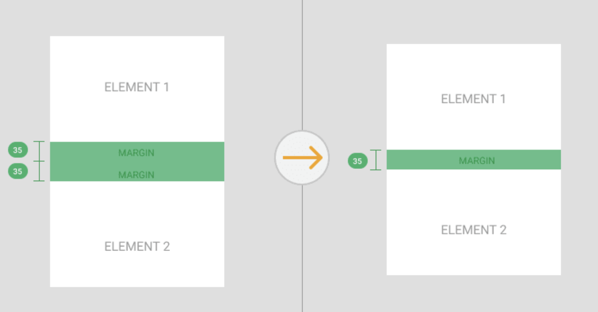
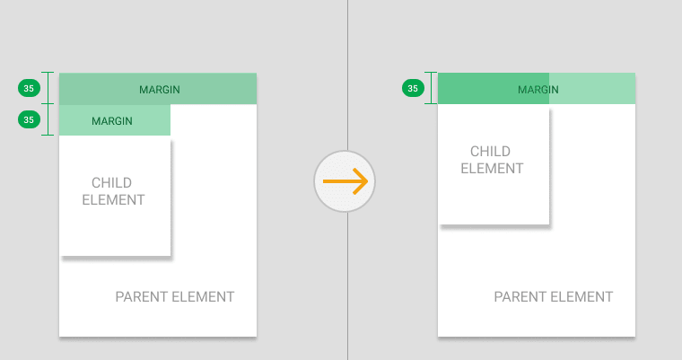
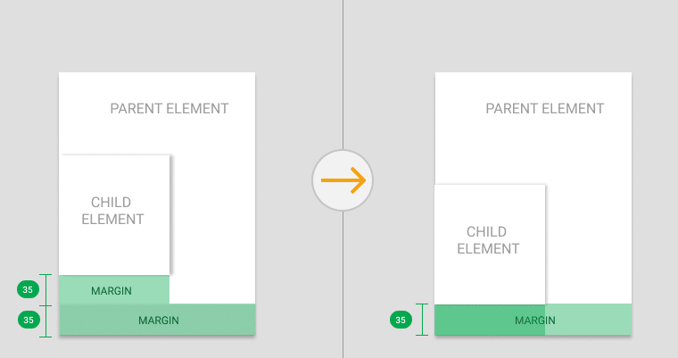
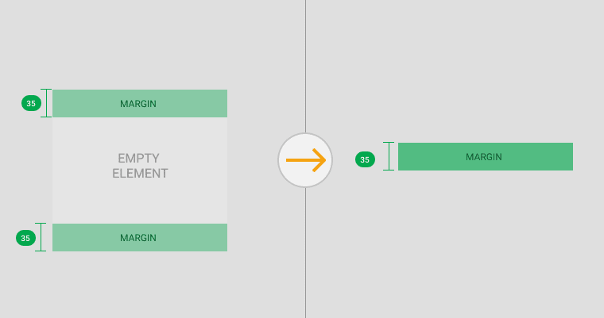

# 박스 모델, 여백 상쇄

## box-sizing

`box-sizing` 프로퍼티는 `width`, `height` 프로퍼티의 대상 영역을 변경할 수 있습니다.
`box-sizing` 프로퍼티의 기본값은 `content-box`입니다.

```css
/* box-sizing은 상속이 되지 않음 */
/* 자식 요소 적용하고 싶을 때는 universe selector을 통해 전체 설정 */
* {
  box-sizing: border-box;
}
```

```css
/* margin을 제외한 크기가 기준 */
box-sizing: border-box;

/* content의 width, height 크기가 기준 */
box-sizing: content-box;
```


## margin collapse(여백 상쇄)

두 개 이상 블록 요소의 `margin` 이 겹칠 때 어느 한 쪽만 적용하는 브라우저 규칙입니다.
**세로**로 겹치는 `margin` 에만 적용됩니다.

### 인접 형제 박스 간 상하 margin이 겹칠 때

인접 형제가 있는 경우 상단 요소의 `margin-bottom` 과 하단 요소의 `margin-top` 중 하나는 상쇄됩니다.
마진의 크기는 두 형제의 `margin` 중 큰쪽으로 적용됩니다.



### 부모와 자식의 margin이 겹칠 때

부모가 시각적으로 투명한 상태가 되면 자식과 부모의 `margin` 이 합쳐져 더 큰쪽의 `margin` 값으로 적용됩니다.
(자식의 `margin` 과 부모의 `padding` 이 겹치는게 아님, 착각 금지)

#### 시각적으로 투명한 상태

- `inline` 레벨의 요소에 콘텐츠(텍스트 등)가 없을경우

- 상단, 하단에 명시적으로 `padding` 또는 `border` 값을 주지 않은 경우 등…




### 빈 태그의 상하 margin이 겹칠 때

어떤 태그의 시각적인 요소가 없다면 그 태그의 `margin` 값은 상하의 `margin` 값 중 큰 값이 `margin` 값이 됩니다.



## 참고

- [Carlos Augusto de Medeir Filho](https://dev.to/camfilho/margin-collapse-explained-by-images-361e)
- [poiemaweb](https://poiemaweb.com/css3-box-model#4-box-sizing-%ED%94%84%EB%A1%9C%ED%8D%BC%ED%8B%B0)
- [Carlos Augusto de Medeir Filho](https://dev.to/camfilho/margin-collapse-explained-by-images-361e)
