# Clip Path

`clip-path`는 시각적으로만 요소를 특정 모양으로 잘라내는 속성입니다.\
실제 DOM 구조에는 영향 없습니다.\
이 속성을 사용하면 사각형 외에도 원, 다각형, SVG 경로(path) 등으로 요소를 보이게 할 수 있습니다.

## 기본 문법

```css
clip-path: <shape>;
```

## 좌표 시스템

좌표의 원점은 왼쪽 상단이며, x축은 오른쪽 방향, y축은 아래쪽 방향을 가리킵니다.

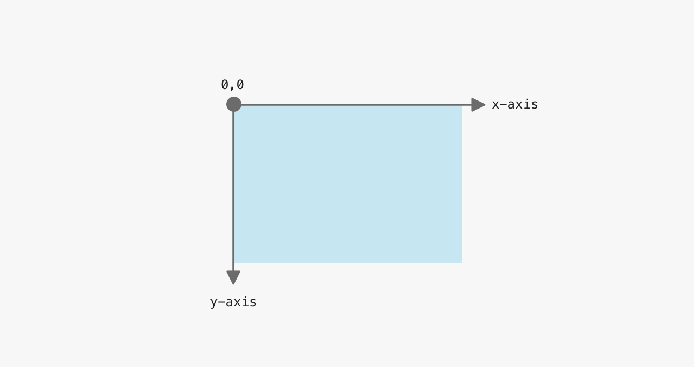

아래의 예시를 보면 `100px` 크기의 원(`circle`)이 클리핑 영역이고, 중심은 `(0, 0)` 즉 왼쪽 상단에 위치해 있습니다.\
원과 배경이 겹치는 진하게 파란색으로 강조된 부분 이외의 부분은 잘리게 됩니다.\
전체 원을 보이게 하려면 x축과 y축의 위치값을 변경해야 합니다.

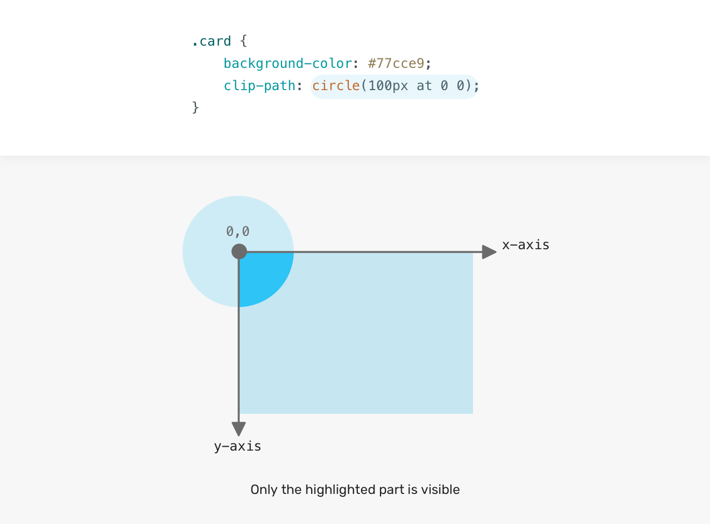

왼쪽에서 `100px`, 위에서 `100px` 떨어진 위치에 원의 중심을 배치한 결과입니다.\
이제 `100px`의 원 전체가 보이게 됩니다.

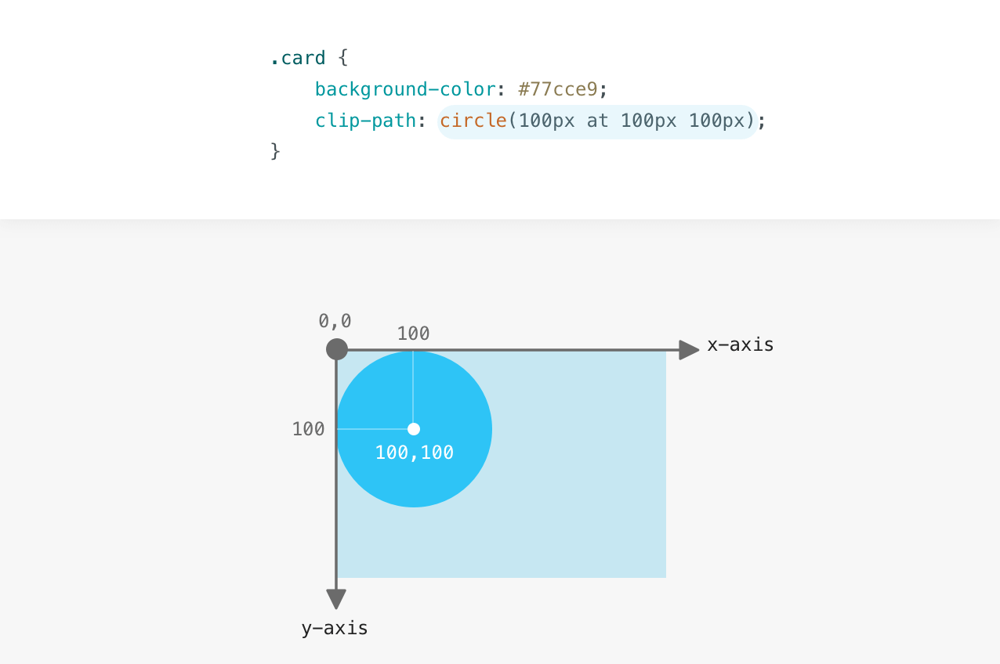

## clip-path 값

### 직사각형 잘라내기

아래의 예제는 모든 면(상, 우, 하, 좌)에서 `20px` 안쪽으로 잘려집니다.

```css
/* top & bottom & left & right */
clip-path: inset(20px);

or

/* top & bottom, left & right */
clip-path: inset(20px 20px);
```

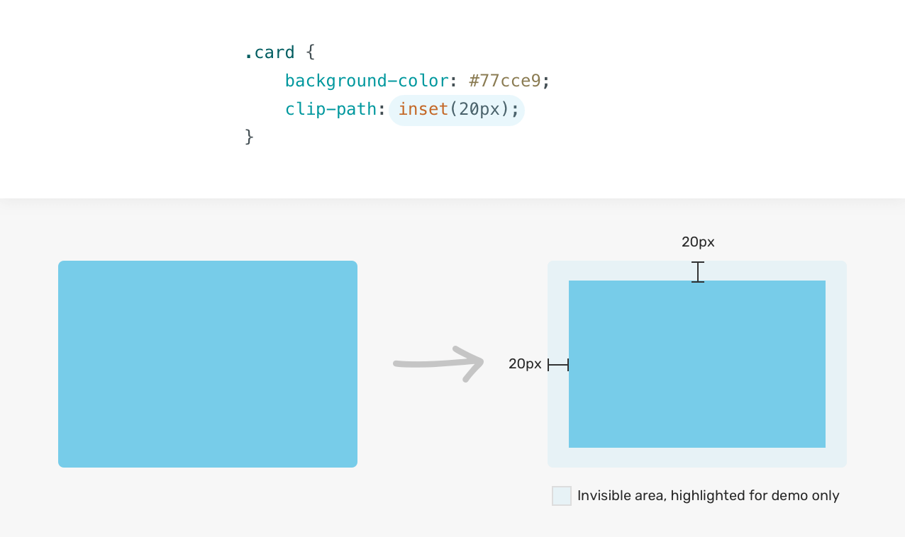

특정 방향만 조정할 수 있습니다.\
아래의 예제는 기존 모양에서 하단(bottom)만 `50px`만큼 잘라냅니다.

```css
/* top, right, bottom, left */
clip-path: inset(20px 20px 50px 20px);
```

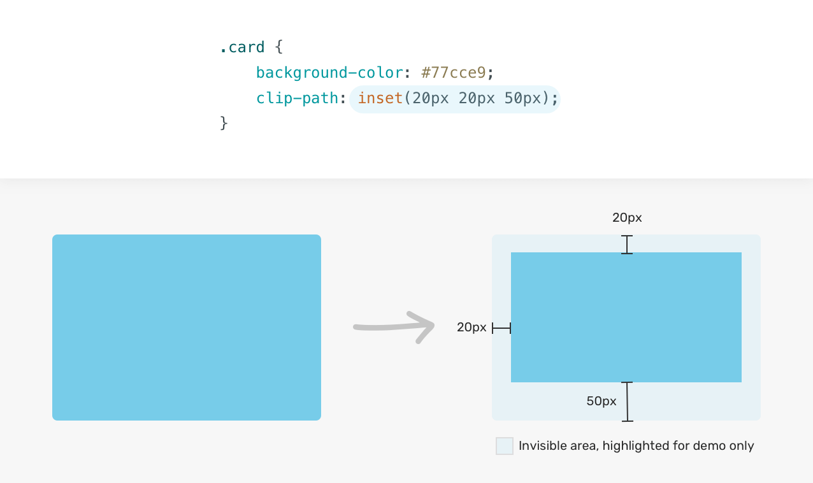

#### round 키워드로 모서리를 둥글게 만들기

`round <border-radius>` 키워드를 사용하면 모서리를 둥글게 만들 수 있습니다.

```css
clip-path: inset(20px 20px 50px round 15px);
```

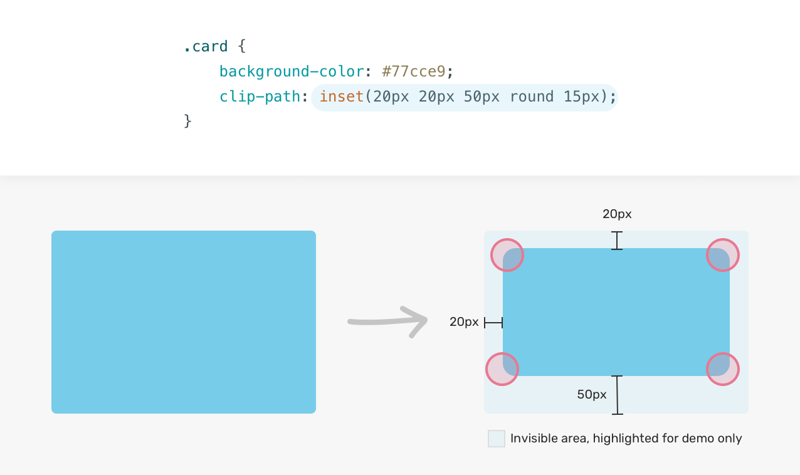

각 모서리에 대해 다른 반지름을 설정할 수도 있습니다.\
아래 예제는 오른쪽 위와 왼쪽 아래 모서리는 반지름이 0이라는 뜻입니다.

```css
clip-path: inset(20px 20px 50px round 15px 0);
```

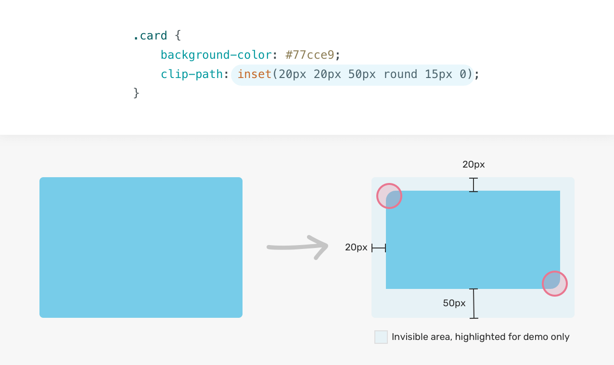

### 원형 잘라내기

```css
/* 반지름, 위치 */
clip-path: circle(50% at center);
```

아래 예제는 반지름이 `80px`이고, 중심이 x축 `50%`, y축 `50%` 위치에 있는 원형 클리핑이다.

```css
/* 반지름, x축 & y축 */
clip-path: circle(80px at 50% 50%);
```

### 타원형 잘라내기

가로/세로 크기를 따로 지정해서 타원형 클리핑을 만들 수 있습니다.\
아래 예제는 중심이 가운데에 위치하고, 가로 `100px`, 세로 `80px` 크기의 타원으로 자릅니다.

```css
clip-path: ellipse(100px 80px at center);
```

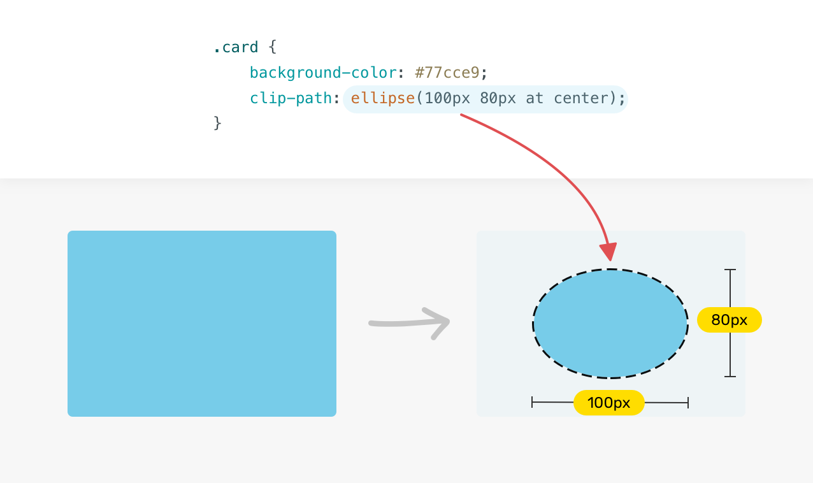

### 다각형 잘라내기

여러 개의 x/y 좌표 쌍을 직접 정의하여 다양한 모양을 만들 수 있습니다.

```css
clip-path: polygon(x y, x y, x y, x y);
```

아래 예제는 사각형 형태로 자른 polygon입니다.

```css
clip-path: polygon(5% 5%, 95% 5%, 95% 95%, 5% 95%);
```

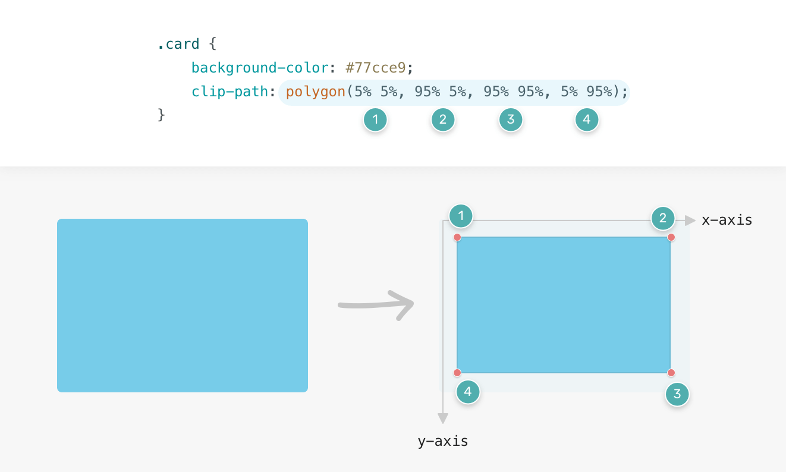

### SVG path로 잘라내기

SVG 경로(SVG path)를 이용해 특정 영역을 잘래낼 수 있습니다.\
아직 브라우저 호환성은 아직 완벽하지 않기 때문에 인라인 SVG를 작성하고, 그걸 url()로 참조하는 방법을 사용할 수 있습니다.

#### SVG 코드

```html
<svg class="svg">
  <clipPath id="triangle" clipPathUnits="objectBoundingBox">
    <path d="M0.05,0.05 h1 v1"></path>
  </clipPath>
</svg>
```

#### CSS에서 사용

```css
.card {
  clip-path: url("#triangle");
}
```

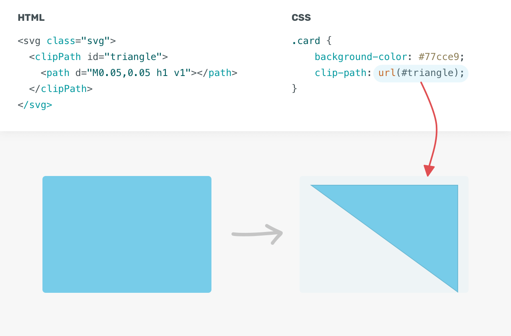

## 실전 예제

### 기울어진 효과

`clip-path`의 `polygon()`으로 살짝 기울어진 형태로 보이는 패턴을 만들 수 있습니다.

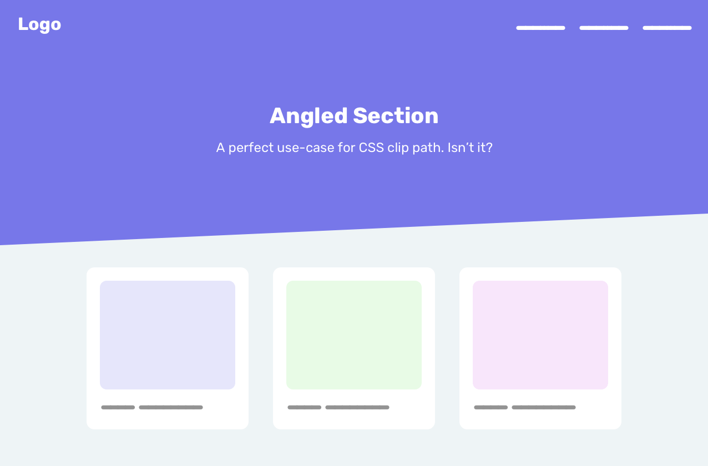

```css
.section {
  clip-path: polygon(0 0, 100% 0, 100% 80%, 0 100%);
}
```

polygon에 숫자 8개를 일일이 조정하는 것이 꽤 번거롭다면 브라우저 자체에 모양 생성을 맡길 수도 있습니다.

우선 아래처럼 clip-path를 설정합니다.

```css
.section {
  clip-path: polygon(0 0, 100% 0, 100% 100%, 0 100%);
}
```

그다음 개발자 도구(DevTools)에서 해당 섹션을 Inspect 합니다.\
clip-path 값 왼쪽에 있는 작은 다각형 아이콘을 클릭하면, 브라우저 내에서 직접 마우스로 polygon을 수정할 수 있는 에디터가 나타납니다.


### 뷰포트 너비에 따른 각도 조절

`calc()`와 뷰포트 단위(`vw`)를 함께 사용하면, 기울어진 각도를 뷰포트 너비에 따라 상대적으로 조절할 수 있습니다.

```css
.section {
  clip-path: polygon(0 0, 100% 0, 100% calc(100% - 5vw), 0 100%);
}
```

### 다중 기울기 효과

기울어진 섹션이 여러 개 필요할 때 `box-shadow`나 `border` 요소들은 `clip-path`에 의해 잘려버리기 때문에, 적용이 안 됩니다.

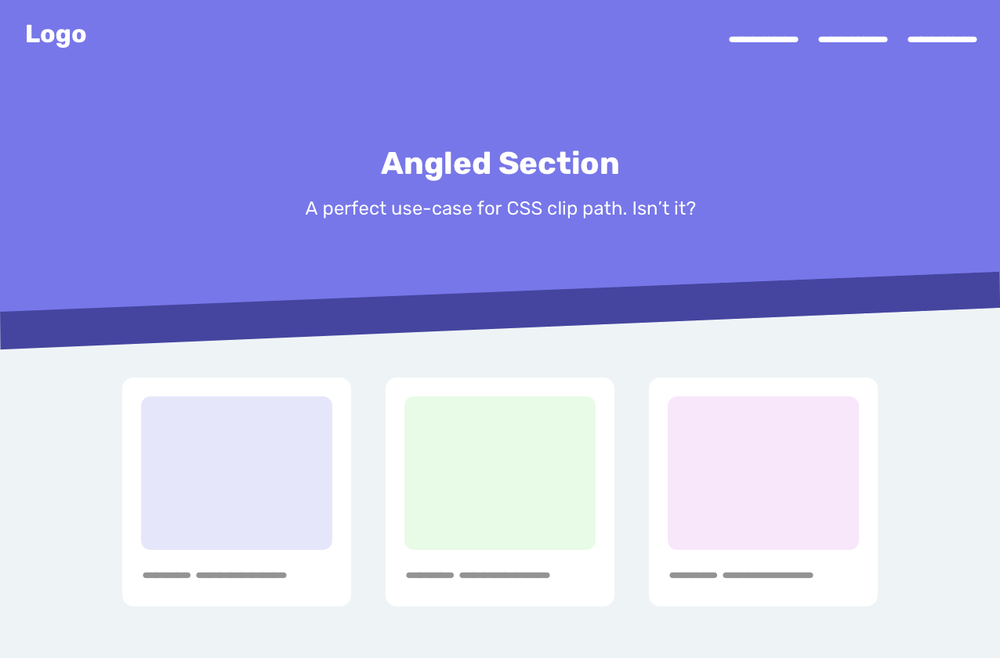

이런 경우 여러 개의 요소를 쌓고, 각각 다른 `clip-path`를 적용해야 합니다.

```html
<div class="hero">
  
</div>
```

```css
.hero {
  position: relative;
  min-height: 350px;
}

.hero img {
  position: absolute;
  left: 0;
  top: 0;
  width: 100%;
  height: 100%;
  clip-path: polygon(0 0, 100% 0, 100% 80%, 0 90%);
}

/* 위 요소와 같은 크기와 clip-path를 가지지만, z-index: -1과 bottom: -20%로 아래로 깔려 있음 */
.hero:after {
  content: "";
  position: absolute;
  left: 0;
  bottom: -20%;
  z-index: -1;
  width: 100%;
  height: 100%;
  background-color: #4545a0;
  clip-path: polygon(0 0, 100% 0, 100% 80%, 0 90%);
}
```

### 스크롤 시 노출 효과

IntersectionObserver API를 사용하면, 사용자가 스크롤할 때 특정 요소를 점차적으로 나타나게 만들 수 있습니다.

아래 예시는 사용자가 스크롤하면서 이미지가 점점 나타나는 효과를 보여줍니다.

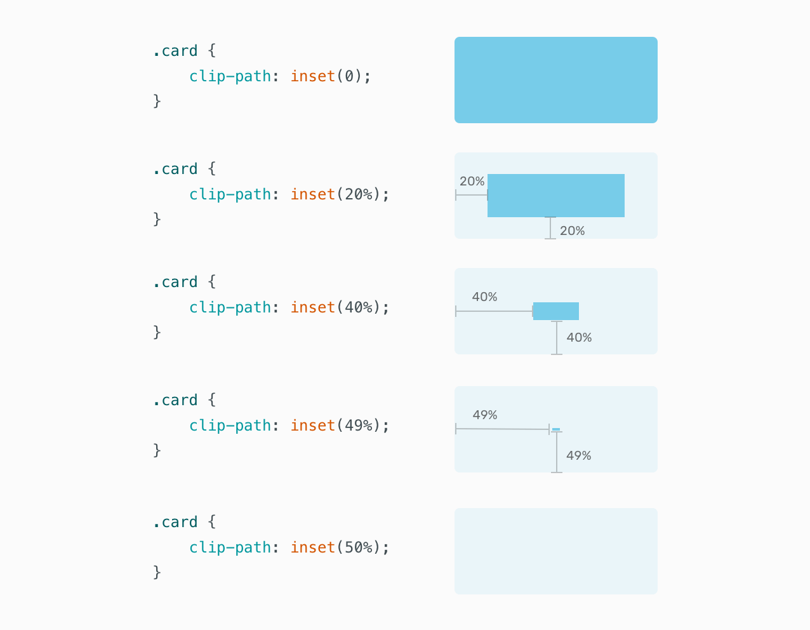

파란색 사각형이 `inset(50%)`이 적용되면 완전히 보이지 않게 됩니다.\
방향(상,우,하,좌) 모두에서 요소의 중심까지 잘라내기 때문에 결과적으로 중앙 부분도 전부 잘려서 아무것도 보이지 않게 됩니다.

반대로 clip-path: inset(0)이라면, 전체 요소가 다 보이게 됩니다.

아래 예시에서는 사용자가 스크롤할 때 이미지를 보여주도록 구현했습니다.

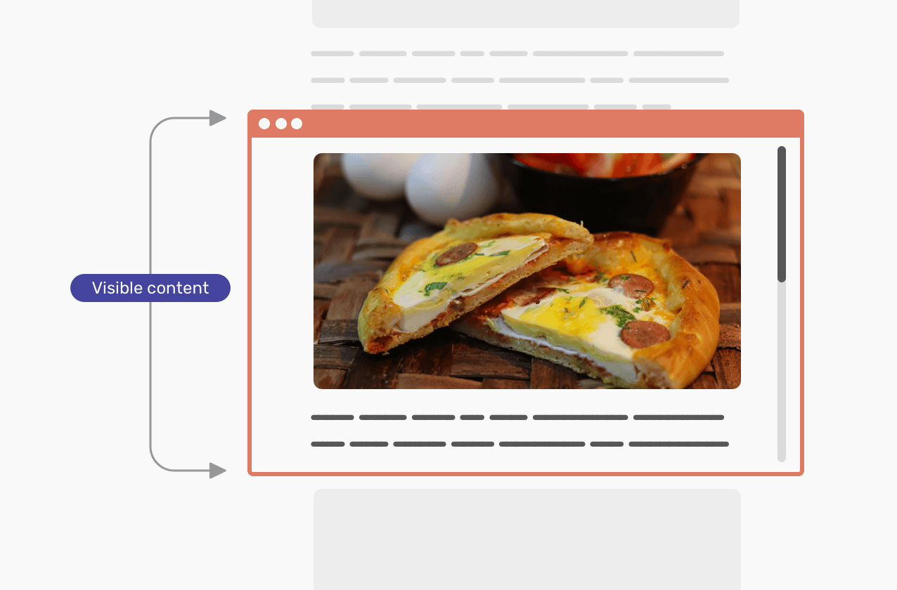

```js
const images = document.querySelectorAll("img");

function check(entries) {
  entries.map((entry) => {
    if (entry.isIntersecting) {
      entry.target.classList.add("is-visible");
      observer.unobserve(entry.target);
    }
  });
}

const observer = new IntersectionObserver(check);
images.forEach((image) => observer.observe(image));
```

```css
img {
  clip-path: inset(50%);
  transition: 1.2s ease-in;
}

img.is-visible {
  clip-path: inset(0);
}
```

#### 방향 제어

애니메이션의 방향도 제어할 수 있습니다.\
위에서 아래로 나타나게 하려면, 아래쪽(bottom)의 값을 100% → 0으로 트랜지션하면 됩니다.

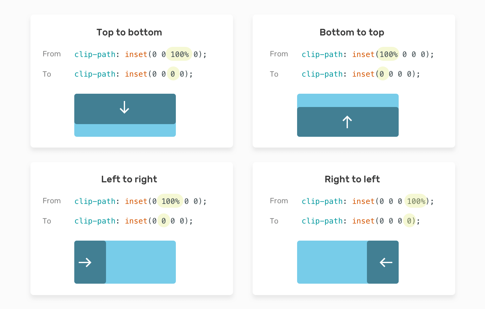

### Hover 및 애니메이션 효과

특정 위치에서 확장(scale)하는 호버 효과를 추가하여 `clip-path`를 활용한 호버 및 애니메이션 효과에도 활용할 수 있습니다.

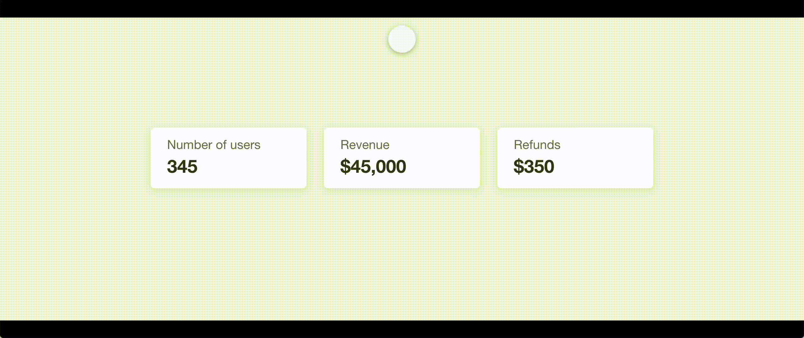

```css
:root {
  --pos: left center;
  --size: 0;
}

.stats__item:before {
  position: absolute;
  left: 0;
  top: 0;
  width: 100%;
  height: 100%;
  background-color: #7777e9;
  clip-path: circle(var(--size) at var(--pos));
  transition: 0.4s linear;
}

.stats__item:hover:before {
  --size: 300px;
}
```

위치 변수인 `--pos`만 바꾸면 애니메이션 시작 위치도 손쉽게 바꿀 수 있습니다.

### Ripple 효과

`clip-path`를 이용해 중심에서 원이 퍼져나가는 듯한 애니메이션을 만들 수 있습니다.

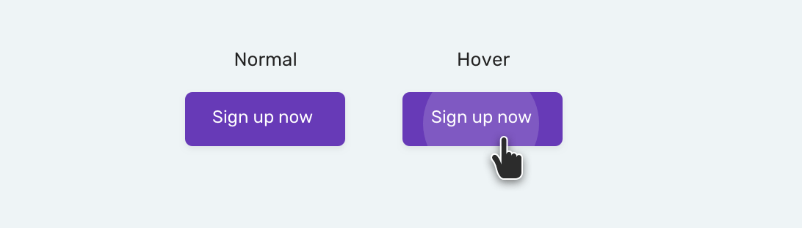

```html
<button class="button"><span>Sign up now</span></button>
```

```css
.button {
  position: relative;
}

.button span {
  position: relative;
  z-index: 1;
}

.button:before {
  content: "";
  position: absolute;
  left: 0;
  top: 0;
  width: 100%;
  height: 100%;
  background-color: #fff;
  opacity: 0.1;
  clip-path: circle(0 at center);
  transition: 0.3s ease-out;
}

.button:hover:before {
  clip-path: circle(100px at center);
}
```

## 알아두면 좋은 점들

- 클리핑된 영역은 포인터 이벤트를 받지 않습니다.\
  즉, 잘린 영역 위에서는 클릭, 호버 등이 작동하지 않습니다.

- `em`, `rem` 같은 상대 단위도 사용할 수 있습니다.\
  즉, 폰트 크기에 따라 유동적인 클리핑도 가능합니다.

## 참고

[Understanding Clip Path in CSS](https://ishadeed.com/article/clip-path/)
