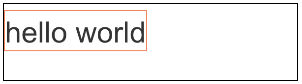

# 디스플레이

HTML 요소는 `block` 또는 `inline` 특성을 갖습니다.\
`display` 속성을 통해 HTML 요소를 아래와 같이 변경할 수 있습니다.

| 프로퍼티값     | 설명                                                               |
| -------------- | ------------------------------------------------------------------ |
| `block`        | `block` 특성을 가지는 요소(`block` 레벨 요소)로 지정               |
| `inline`       | `inline` 특성을 가지는 요소(`inline` 레벨 요소)로 지정             |
| `inline-block` | `inline-block` 특성을 가지는 요소(`inline-block` 레벨 요소)로 지정 |
| `none`         | 해당 요소를 화면에 표시하지 않는다 (공간조차 사라진다)             |

## block

- 항상 새로운 라인에서 시작합니다.

- 화면 크기 전체의 가로폭을 차지합니다. (`width: 100%`)

- `width`, `height`, `margin`, `padding` 프로퍼티 지정이 가능합니다.
  “block box 크기” = “줄 크기” + “줄 외 공간”

- 레이아웃을 작업하는 요소로 적합합니다.

### block box의 크기

```html
<div class="wrapper">
  <div class="outer"><span class="inner">hello world</span></div>
</div>
```

```css
<style>
    .wrapper {
        max-width: 1180px;
        margin: 0 auto;
        display: flex;
        justify-content: center;
    }
    .wrapper .outer {
        width: 300px;
        height: 80px;
        border: 1px solid black;
    }
    .wrapper .inner {
        font-size: 30px;
        border: 1px solid coral;
    }
</style>
```



coral 색 박스가 “줄 크기”이며 검은색 박스가 “줄 외 공간”b니다.\
만약 `font-size`가 `outer`의 크기를 넘어갈 경우 `outer`의 크기는 바뀌지 않고 `inner`의 text가 `outer`의 크기 밖으로 넘어가게 됩니다.

## inline

- 새로운 라인에서 시작하지 않으며 문장의 중간에 들어갈 수 있습니다.

- content의 너비만큼 가로폭을 차지합니다.

- inline 레벨 요소 뒤에 공백(엔터, 스페이스 등)이 있는 경우, 정의하지 않은 space(4px)가 자동 지정됩니다.

- `width`, `height`, `margin-top`, `margin-bottom` 프로퍼티(크기 속성)를 지정할 수 없습니다.
  “inline box 크기” = “줄 크기”

- 텍스트를 작업하는 요소로 적합합니다.

- 인라인 요소는 `line-height`로 줄의 높낮이를 조절할 수 있고 `text-align`으로 텍스트의 종앙, 좌,우측 정렬을 할 수 있습니다.

### inline box의 크기

```html
<div class="wrapper">
  <span class="outer">hello world</span>
</div>
```

```css
<style>
    .wrapper {
        max-width: 1180px;
        margin: 0 auto;
    }
    .wrapper .outer {
        font-size: 30px;
        border: 1px solid coral;
    }
</style>
```


## inline-block

`block`과 `inline` 두 속성의 중간 형태로, 요소들을 인라인처럼 나란히 배치하면서도 블록 요소처럼 크기와 여백을 조절할 수 있습니다.

## width: auto와 height: auto의 의미

### width: auto와 height: auto 일 때 inline-block

inline-block 요소에서 `width: auto`와 `height: auto`를 하면 내용물(자식 요소)의 크기에 맞춰 자동으로 크기를 조절합니다.

### width: auto와 height: auto 일 때 block

block 요소에서 `height: auto`는 inline-block과 마찬가지로 자식 요소 크기를 기준으로 설정하지만, `width: auto` 는 내용물 크기에 맞춰 자동 조절되지 않습니다.\
block 요소의 `width: auto`의 의미는 부모 요소의 한 줄을 다 채우라는 뜻으로, 조금 더 수치적으로 설명하자면 `width = 100% – 좌/우 margin`으로 이해할 수 있습니다.\
따라서 block 요소의 `width: auto`는 `width: 100%`와 같지 않습니다.\
만약 `width: 100%`을 하게 된다면 자식 요소는 부모 요소를 좌/우 margin만큼 넘어갈 수 있습니다.

### 부모요소가 height: auto 일 때 자식 요소의 위치속성

`width`에 내용물 너비값이 들어가고, `height`에는 특정값이 들어가지 않습니다.\
부모요소를 `height: auto`로 설정 시에는 기준이 불특정 값이 되기 때문에 자식 요소의 위치속성(`left`, `right`, `top`, `bottom`)을 `%`로 지정하게 되면, 위치속성 `top`을 이용하여도 세로방향으로 움직이지 않습니다.\
만약 상대값(`%`)이 아니라 절대값(`px`)로 설정하게 되면, 부모의 크기에 상관없이 움직일 수 있으므로 정상적으로 작동합니다.

### block과 inline-block width, height 차이점

|  차이점   |                    `block`                     |                `inline-block`                 |
| :-------: | :--------------------------------------------: | :-------------------------------------------: |
|  `width`  | 너비가 지정되어 있지 않으면, 최대한으로 늘어남 | 높이가 지정되어 있지 않으면 최소한으로 줄어듬 |
| `height`  | 너비가 지정되어 있지 않으면, 최대한으로 줄어듬 | 높이가 지정되어 있지 않으면 최소한으로 줄어듬 |
| 배열 방향 |    한 줄에 세로 방향으로 한줄에 무조건 하나    |     한줄에 가로 방향으로 최대한 많이 나옴     |
|   정렬    |        부모의 `text-align`에 의해 정렬         |             `margin`에 의해 정렬              |

## display: none (디스플레이: 없음)과 visibility: hidden (가시성: 숨김)의 차이

```css
/* 숨긴 공간을 다른 요소들이 공간을 차지 */
/* 모달에 자주 사용 */
.box {
  display: none;
}

/* 숨긴 공간을 다른 요소들이 공간을 차지하지 못하게 유지 */
.box {
  visibility: hidden;
}
```

## 예기치 않은 inline-block 동작

- `inline-block`은 `inline` 레벨 요소와 같이 한 줄에 표현됩니다.

- `width`, `height`, `margin` 프로퍼티를 모두 지정할 수 있습니다.

- `inline-block` 레벨 요소 뒤에 공백(엔터, 스페이스 등)이 있는 경우, 정의하지 않은 스페이스(`4px`)가 자동 지정됩니다.
  이로 인해 예기치 않은 `inline-block` 동작이 발생할 수 있습니다.

### 예시

아래는 예기치 않은 `inline-block` 동작의 예시 상황입니다.

#### HTML

```html
<header class="main-header">
  <div>
    <a href="index.html"> uHost </a>
  </div>

  <nav class="main-nav">
    <ul class="main-nav__items">
      <li class="main-nav__item">
        <a href="packages/index.html">Packages</a>
      </li>
      <li class="main-nav__item">
        <a href="customers/index.html">Customers</a>
      </li>
      <li class="main-nav__item">
        <a href="start-hosting/index.html">Start Hosting</a>
      </li>
    </ul>
  </nav>
</header>
```

#### CSS

```css
.main-header {
  width: 100%;
  background: #2ddf5c;
  padding: 8px 16px;
}

.main-header > div {
  display: inline-block;
}

/* Packages, Customers, Start Hosting을 포함하는 nav */
.main-nav {
  display: inline-block;
  text-align: right;
  /* 전체 너비에서 .main-header>div를 뺀 값을 witdh로 */
  width: calc(100% - 49px);
}

.main-nav__items {
  margin: 0;
  padding: 0;
  list-style: none;
}

.main-nav__item {
  display: inline-block;
}
```

#### 결과


uHost와 Packages, Customers, Start Hosting를 같은 행으로 위치시키려고 합니다.\
uHost를 감싸는 `.main-header>div`의 `width`는 `48.11px` 입니다.\
나머지 `a`태그들을 깜싸는 `.main-nav`는 전체 width 에서 49px을 뺀 값으로 하면 한 줄로 되어야 합니다.\
하지만 `.main-nav`의 width를 `width: calc(100% - 49px)`로 맞추었지만 여전히 같은 행에 위치하지 않습니다.

이유는 아래와 같습니다.

#### 실패한 이유

- HTML에서 사용한 줄바꿈 등의 공백도 문자로 간주하여 inline 요소로 추가 되어 크기를 차지합니다.

```html
<!-- 줄바꿈 공백 있음 -->
<div>
  <nav>
    <!-- 줄바꿈 공백 없음 -->
    <div><nav></nav></div>
  </nav>
</div>
```

따라서 CSS 에서 가로폭의 길이를 계산후 적용했을 때 생각했던 대로 되지 않는다면 HTML의 공백 때문이 아닌지 고려해봐야 합니다.

위의 이유로 `inline-block` 두 개의 `width` 를 `50%` 로 주거나 세 개를 `33%` 준다면 `block` 들이 한 줄로 위치하지 않고 마지막 `block` 은 다음 줄로 넘어갈 수 있습니다.

또 다른 해결 방법으로는 [Fighting the Space Between Inline Block Elements](https://css-tricks.com/fighting-the-space-between-inline-block-elements/)를 참고하세요.

## HTML 태그 별 기본 display 속성

### `display: block`

전후 줄바꿈이 들어가 다른 엘리먼트들을 다른 줄로 밀어내고 혼자 한 줄을 차지합니다.(`width:100%`)
inline 엘리먼트와 달리 `width`, `height` 속성을 지정할 수 있습니다.
`margin`, `padding` 속성이 상하좌우 모두 반영됩니다.

`html`, `body`, `form`, `div`, `p`, `h1` ~ `h6`, `header`, `footer`, `summary`, `main`, `section`, `hr`, `ul`, `ol`, `nav`, `hr` , `option`, `blockquote`, `option`, `nav`, `ol`, `ul`, `section`, `main`, `summary`, `footer`, `header`

### `display: inline`

전후 줄바꿈 없이 한 줄에 다른 엘리먼트들과 나란히 배치됩니다.\
`width`와 `height` 속성을 무시합니다.\
`margin`과 `padding` 속성은 좌우 간격만 반영이 되고, 상하 간격은 반영이 되지 않습니다.

`span`, `a`, `strong`, `em`, `br`, `label`, `font`, `i`, `output`, `picture`, `s`, `q`, `bdo`, `bdi`, `acronyum`, `abbr`, `menuitem`, `mark`, `map`, `frame`, `code`, `big`, `b`, `strong`, `wbr`, ...

#### 대체요소 (replaced elements)

내용이 CSS 또는 HTML의 일부가 아닌 외부 요소에 의해 대체되는 HTML 요소를 말합니다.\
내부적으로 외부 콘텐츠(예: 이미지, 비디오)를 포함하기 때문에 `width`와 `height`으로 가로와 세로 길이를 조절할 수 있습니다.

`img`, `iframe`, `video`, `audio`, `object`, `embed` ,`canvas`

### `display: inline-block`

inline 엘리먼트처럼 전후 줄바꿈 없이 한 줄에 다른 엘리먼트들과 나란히 배치됩니다.
block 엘리먼트처럼 `width`와 `height` 속성 지정 및 `margin`과 `padding` 속성의 상하 간격 지정이 가능합니다.

`button`, `input`, `select`, `textarea`, `meter`, `applet`, `param`, `progress`

### none

실제로 화면에 나타나지 않도록 하는 속성입니다.

`DOCTYPE`, `script`, `style`, `link`, `head`, `title`, `noscript`, `meta`, `area`, `audio`, `base`, `basefont`, `datalist`, `noframes`, `rp`

### list-item

list-style 속성에 의해 지정된 내용으로 `::marker` 가상 요소를 생성하도록 합니다.
block 특성을 가지고 있습니다.

`li`

## 참고 자료

[poiemaweb](https://poiemaweb.com/css3-display)
[oursmalljoy](https://oursmalljoy.com/css-vertical-align/#concept-of-line)
[[CSS] 요소(element)종류 HTML Tag Default display 속성](https://emunhi.com/view/201807/31135011071?menuNo=10002)
[CSS의 display 속성: inline, block, inline-block](https://www.daleseo.com/css-display-inline-block/)
