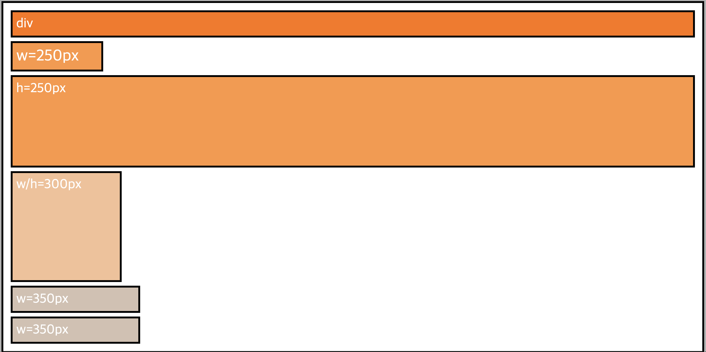
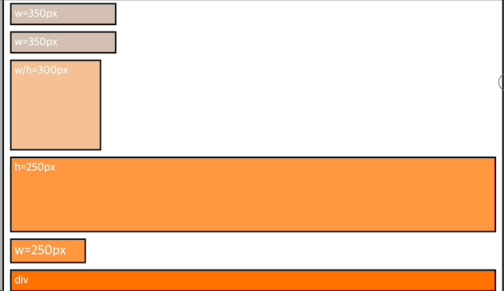

# Flexbox

Flexbox는 요소의 배치를 바꾸는 현대 방식이자 display 프로퍼티의 또 다른 값이라고 할 수 있습니다.\
[display](https://velog.io/@zimablue14/%EB%94%94%EC%8A%A4%ED%94%8C%EB%A0%88%EC%9D%B4) 프로퍼티는 디스플레이 블록을 인라인 또는 인라인 블록으로 설정해 요소들의 동작을 변경할 수 있습니다.

display 프로퍼티에 flex 값을 연결해서 사용하면 해당 요소가 이른바 Flex 컨테이너로 바뀝니다.\
부모에 적용할 수 있는 프로퍼티에는 `flex-flow` 프로퍼티와 `justify-content` 프로퍼티 `align-content` 프로퍼티와 `align-items` 프로퍼티가 있습니다.

Flex 컨테이너 내부에는 다른 중첩 요소가 들어갑니다 이러한 요소는 '자식'이라고 불리며 Flex 항목(`Items`)이라고도 불립니다.\
자식에 적용할 수 있는 프로퍼티에는 `order`와 `flex`, 그리고 `align-self`가 있습니다.


## The Flex-Container

### display

#### 기본 값

```css
.flex-container {
  background: white;
  padding: 10px;
  border: 5px solid black;
}
```



#### display: flex

블록 레벨 요소에서 보이며 화면의 크기 또는 너비를 변경하면 지정된 너비가 될 때까지 너비가 축소되고, 화면 너비를 늘리면 부모 요소의 너비가 증가 됩니다.\
세 번째 요소를 제외한 모든 요소가 부모 요소에서 사용 가능한 전체 높이를 사용하고 있습니다.\
이 항목들의 높이는 네 번째 요소를 따라갑니다.

```css
.flex-container {
  background: white;
  padding: 10px;
  border: 5px solid black;
  display: flex;
}
```


#### display: inline-flex

display: flex 선언과 달리 요소들의 크기를 변경할 수 없습니다.\
이제 크기가 정의된 실제 너비에 의해 사전 정의되기 때문입니다.\
부모 요소의 크기도 더 이상 변경되지 않습니다.\
콘텐츠를 모두 표시하는 데 필요한 공간만 사용합니다.

```css
.flex-container {
  background: white;
  padding: 10px;
  border: 5px solid black;
  display: inline-flex;
}
```


### flex-direction

#### row

```css
.flex-container {
  background: white;
  padding: 10px;
  border: 5px solid black;
  display: flex;
  flex-direction: row;
}
```


#### row-reverse

```css
.flex-container {
  background: white;
  padding: 10px;
  border: 5px solid black;
  display: flex;
  flex-direction: row-reverse;
}
```


#### column

```css
.flex-container {
  background: white;
  padding: 10px;
  border: 5px solid black;
  display: flex;
  flex-direction: column;
}
```


#### column-reverse

```css
.flex-container {
  background: white;
  padding: 10px;
  border: 5px solid black;
  display: flex;
  flex-direction: column-reverse;
}
```



### flex-wrap

items의 줄바꿈 여부와 줄바꿈 방법을 정의하는 것입니다.

#### nowrap

```css
.flex-container {
  background: white;
  padding: 10px;
  border: 5px solid black;
  display: flex;
  flex-wrap: nowrap;
}
```


#### wrap

요소가 정의된 값 아래로 너비를 줄여야 하는 순간이 오면 너비가 350px인 요소부터 순서대로 아래 행으로 내려갑니다.

첫 번째 행에서는 최대 높이에 맞춰 다른 요소들의 높이가 조정되지만 새로운 행으로 내려온 요소는 단순히 콘텐츠를 표시하는 데 필요한 높이만 사용합니다.

```css
.flex-container {
  background: white;
  padding: 10px;
  border: 5px solid black;
  display: flex;
  flex-wrap: wrap;
}
```


#### wrap-reverse

요소가 정의된 값 아래로 너비를 줄여야 하는 순간이 오면 너비가 350px인 요소부터 순서대로 윗 행으로 올라갑니다.

또한 세 번째 항목의 위치를 보면 위가 아니라 아래를 기준으로 표시되어 있습니다.

```css
.flex-container {
  background: white;
  padding: 10px;
  border: 5px solid black;
  display: flex;
  flex-wrap: wrap-reverse;
}
```


### flex-flow

flex-direction, flex-wrap 속성의 단축 속성입니다.

```css
.flex-container {
  display: flex;
  flex-flow: flex-direction flex-wrap;
}
```

## Main Axis vs. Cross Axis

`flex-direction`은 기본 축을 정의하며 교차 축은 언제나 기본 축과 동일한 시작점을 공유합니다.


### justify-content

컨테이너의 기본 축(Main Axis)을 따라 아이템들을 정렬하는 데 활용됩니다.\
기본값이 `flex-start`이며 item들이 주축의 시작 부분에서 시작하여 배치됩니다.

### align-items

flex 항목이 교차 축(Cross Axis)을 따라 아이템들을 정렬하는 데 활용됩니다.\
기본값은 `stretch` 이며 항목이 정렬 컨테이너보다 작은 경우 자동 크기 조정 항목은 항목의 너비 및 높이 제한을 고려하여 컨테이너를 채울 수 있도록 동일하게 확대됩니다.


### align-content

Flex 컨테이너 내의 여러 줄(다중 행)을 가지고 있으며 줄들 사이에 여백이 있을 때, 교차 축을 따라 여백을 어떻게 다룰지를 지정하는 데 사용됩니다. (줄 간격)\
싱글 라인의 Flex 컨테이너에서는 `align-content`가 적용되지 않습니다.

## The Flex Items

### order

최초 HTML 코드값에 따라 지정된 요소들의 순서를 바꿀 수 있으며 기본값은 `order: 0`입니다.
기본 축을 기준으로 숫자가 클수록 뒷 순서에 배치됩니다.

#### 기본 값 (모든 요소가 order: 0)


#### 네 번째 요소에만 order: 1 적용

```css
.item-4 {
  background: #f5c096;
  color: white;
  padding: 10px;
  border: 5px solid black;
  margin: 10px;
  width: 300px;
  height: 300px;
  order: 1;
}
```


#### 네 번째 요소에만 order: -1 적용

```css
.item-4 {
  background: #f5c096;
  color: white;
  padding: 10px;
  border: 5px solid black;
  margin: 10px;
  width: 300px;
  height: 300px;
  order: -1;
}
```


### align-self

특정 요소의 배치만 교차 축을 기준으로 변경할 수 있습니다.

#### align-self 기본 값


#### 세 번째 요소 배치 변경

flex-container의 `align-items`는 `center` 이지만 세 번째 자식 요소에 `align-self`를 `flex-start`로 설정했습니다.

```css
.flex-container {
  background: white;
  padding: 10px;
  border: 5px solid black;
  height: 1300px;
  display: flex;
  flex-direction: row;
  flex-wrap: nowrap;
  justify-content: flex-start;
  align-items: center;
}

.item-3 {
  background: #ff9640;
  color: white;
  padding: 10px;
  border: 5px solid black;
  margin: 10px;
  height: 250px;
  align-self: flex-start;
}
```


#### align-items와의 차이

`align-items`는 모든 항목에 해당하는 프로퍼티인 반면 `align-self`를 사용하면 전체 flex 컨테이너의 일부분인 단일 요소의 배치를 정의할 수 있습니다.

## flex

`flex-grow`, `flex-shrink`, `flex-basis`를 쓰는 대신 `flex` 프로퍼티 축약형을 사용할 수 있습니다.

```css
flex: 0 1 auto;
```

기본적으로 Flexbox에서는 Flex 컨테이너 내의 아이템들이 여유 공간이 있어도 자동으로 늘어나지 않습니다.\
이는 기본 설정에서 아이템들이 `flex-grow` 속성이 0으로 설정되어 있기 때문입니다.\
Flex 컨테이너에 여유 공간이 있어도 아이템들은 자신의 기본 크기를 유지합니다.

Flex 컨테이너의 공간보다 아이템 크기가 커서 여유가 없는 경우, 아이템들은 flex-shrink 속성에 따라 동일한 비율로 줄어듭니다.\
기본적으로 `flex-shrink` 속성은 1로 설정되어 있어, 컨테이너의 공간이 부족할 때 모든 아이템은 동일한 비율로 축소됩니다.

아이템은 콘텐츠 크기에 따라 크기가 결정됩니다.
`flex-basis` 기본값은 `auto`이기 때문입니다..

아래는 자주 사용되는 속성 값입니다.

```css
flex: 1
/* 위와 아래는 동일 */
flex: 1 1 0%
```

위의 `flex: 1`은 요소가 다음과 같이 동작하도록 합니다.

- 남은 공간을 동일하게 나눠 가질 수 있도록 성장합니다. `(flex-grow: 1;)`
- 필요할 때 동일한 비율로 줄어들 수 있습니다. `(flex-shrink: 1;)`
- 기본 크기를 0으로 설정하여 부모 컨테이너의 전체 크기를 기준으로 동작합니다. `(flex-basis: 0%;)`

### flex-basis (유연한 박스의 기본 영역)

기본 축에 설정된 기본값에 따라 설정되어 Flex 아이템 요소의 크기를 정의합니다.

flex-basis가 `auto`일 경우 기본 축이 왼쪽에서 오른쪽(`row`)이면 `width` 값으로 설정되고 기본 축이 위에서 아래(`column`)라면 `height`를 설정됩니다.

또한 flex 컨테이너의 너비의 백분율 값으로 사용할 수도 있습니다.

#### flex-basis 예시

```css
.item {
  flex-basis: auto; /* 기본값 */
  /* flex-basis: 0; */
  /* flex-basis: 50%; */
  /* flex-basis: 300px; */
  /* flex-basis: 10rem; */
  /* flex-basis: content; */
}
```


기본값 `auto`는 해당 아이템의 `width`값을 사용합니다.\
아이템의 `width`를 따로 설정하지 않으면 그냥 컨텐츠의 크기와 같습니다.

```css
.item {
  flex-basis: 100px;
}
```


원래의 `width`가 `100px`이 안되는 AAA와 CCC는 `100px`로 늘어났고, 원래 `100px`이 넘는 BBB는 그대로 유지됩니다.

```css
.item {
  width: 100px;
}
```


반면 `width`를 설정하면, 원래 `100px`을 넘는 BBB도 `100px`로 맞춰집니다.

`flex-basis`가 0인 경우 `flex-grow`, `flex-shrink` 설정 비율대로 아이템 너비(높이)를 배분합니다.

`flex-grow`는 아이템들의 `flex-basis`를 제외한 여백 부분을 `flex-grow`에 지정된 숫자의 비율로 나누어 가집니다.\
`flex-basis: 0`으로 설정하면 아이템의 기본 크기가 0이므로 여백이 100%인 상태가 됩니다.\
따라서 content의 크기와 관계 없이 `flex-grow` 설정 비율대로 아이템의 너비를 배분합니다.

#### 0%와 100%의 차이점 요약

- `flex-basis: 0%`:

  - 아이템의 기본 크기를 0으로 설정.
  - 아이템은 자신의 콘텐츠 크기를 무시하고, 주로 `flex-grow`에 의해 여유 공간을 차지.
  - 모든 아이템이 균등하게 여유 공간을 차지.

- `flex-basis: 100%`:

  - 아이템의 기본 크기를 컨테이너의 전체 크기로 설정.
  - 아이템은 기본적으로 컨테이너의 크기를 채우려 함.
  - 이는 특정 아이템이 더 많은 공간을 차지하게 하거나, 컨테이너의 크기를 채우는 용도로 사용.

### flex-grow (유연하게 늘리기)

아무 요소도 차지하지 않는 남는 공간이 있을 때, 너비를 증가시키면 `flex-grow` 값이 할당된 요소들의 `flex-grow` 값의 총 합을 남는 공간으로 나누어 `flex-grow` 값만큼 차지하게 됩니다.\
`flex-grow`의 초깃값은 0입니다.

#### flex-grow 기본 값


### 다섯 번째 요소에 flex-grow 값을 올렸을 때

```css
.item-5 {
  background: #d3c0b1;
  color: white;
  padding: 10px;
  border: 5px solid black;
  margin: 10px;
  width: 350px;
  flex-grow: 1;
}
```


마지막 항목(여섯 번째 요소)은 `flex-grow` 값이 0이므로 최대 너비인 350픽셀 이상으로 커지지 않습니다.\
반면 `flex-grow`에 1을 할당한 5번 항목의 너비를 확인해 보면 그 이상으로 커집니다.\
요소들의 `flex-grow`의 총 합은 1이기 때문에 `flex-grow`가 1인 다섯 번째 요소가 남는 모든 공간만큼 늘어나게 됩니다.

### flex-shrink (유연하게 줄이기)

너비를 줄일 때 요소가 동작하는 방식을 정의합니다.\
아이템이 flex-basis의 값보다 작아질 수 있는지를 결정합니다.

먼저 축소 여부를 지정할 수 있는데 기본값을 1로 설정하면 요소를 축소할 수 있고 그 값이 0인 요소는 축소할 수 없습니다.\
`flex-shrink` 값 0이 아니게 설정하면 요소를 축소할 수 있습니다.\
즉, 0보다 큰 값이 세팅이 되면 해당 아이템이 유연한(Flexible) 박스로 변하고 `flex-basis`보다 작아집니다.

만약 하나의 요소가 `flex-shrink: 1;`이고, 다른 하나의 요소가 `flex-shrink: 4;`라면 `flex-shrink: 1;`인 요소가 1이 줄어들 때 `flex-shrink: 4;`인 요소는 4가 줄어듭니다.

## 참고

- [이번에야말로 CSS Flex를 익혀보자](https://studiomeal.com/archives/197)
- [Flexbox: flex-basis auto와 0의 차이점 [2/16]](https://velog.io/@garcon/Flexbox-flex-basis-auto%EC%99%80-0%EC%9D%98-%EC%B0%A8%EC%9D%B4%EC%A0%90)
- [CSS - The Complete Guide 2024 (incl. Flexbox, Grid & Sass)](https://www.udemy.com/course/css-flexbox-grid-sass/)
- [CSS-TRICKS](https://css-tricks.com/snippets/css/a-guide-to-flexbox/)
