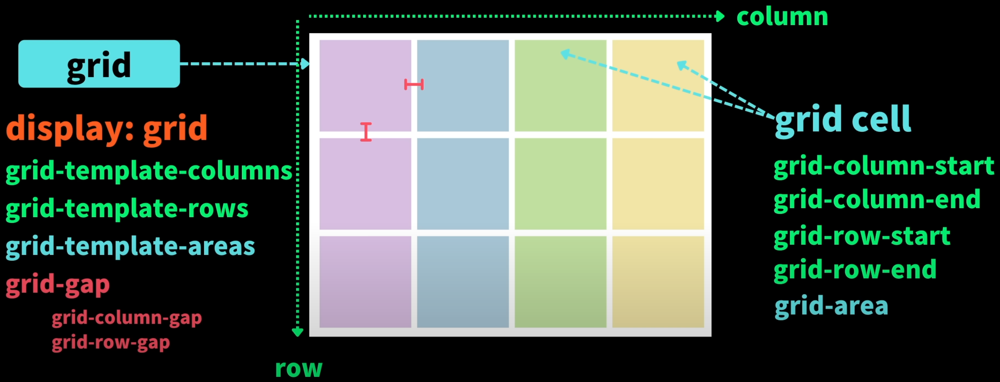
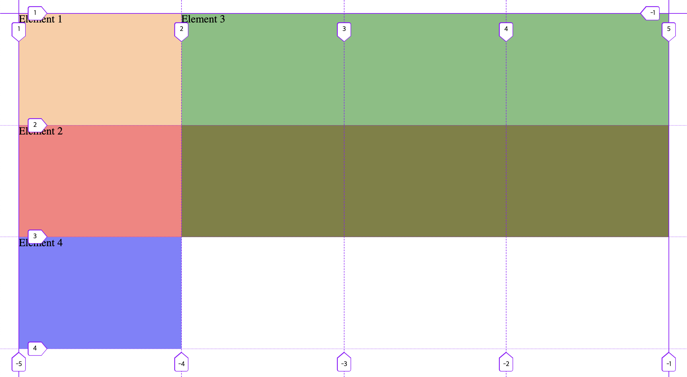

# Grid

Grid는 컨테이너에서 모든 것을 구성할 수 있는 기회이자 필요에 따라 미디어 쿼리로 조정함으로써 재배치에 소요되는 작업을 줄일 수 있는 방법입니다.


`flex`는 주로 한 축(행 또는 열)을 기반으로 한 1차원 레이아웃을 다룹니다.\
주로 아이템을 가로로 나열하거나 세로로 나열하는 데 사용됩니다.

`Grid`는 행과 열을 기반으로 한 2차원 레이아웃을 구축하는 데 사용됩니다.\
행과 열의 교차점에 그리드 아이템을 배치할 수 있습니다.

`flex`만 사용해도 자유자제로 아이템을 배치할 수 있기 때문에 많이 사용되지만 필요에 따라 `flex`와 `Grid`를 적절히 사용하는 것이 좋습니다.



`display: grid`의 기본 동작은 하나의 열만 생성하며 자식 요소만큼의 행을 생성합니다.

## grid container

### grid-template-columns

그리드 컨테이너의 열 크기를 정의하는 속성입니다.\
열의 크기, 개수, 및 유연성을 설정할 수 있습니다.

#### grid-template-columns 예시

```css
.container {
  margin: 20px;
  display: grid;
}
```


```css
.container {
  margin: 20px;
  display: grid;
  grid-template-columns: 200px 2fr 20% 1fr;
}
```


첫 번째 열은 `200px`, 세 번째 열은 `.container`의 패딩 영역 내부인 콘텐츠 영역의 크기가 `100%` 였을 때 `20%` 만큼의 공간을 차지 합니다.\
두 번째 열과 네 번째 열은 `fr`(fractional unit)이라는 단위가 사용되었습니다.

### grid-template-rows

그리드 컨테이너의 행 크기를 정의하는 속성입니다.\
행의 크기, 개수, 및 유연성을 설정할 수 있습니다.

```css
.container {
  margin: 20px;
  display: grid;
  grid-template-columns: 200px 2fr 20% 1fr;
  grid-template-rows: 5rem 2.5rem;
}
```


### gaps

`margin`을 사용하면 마킹된 영역 내에서 요소의 배치를 바꿨을 뿐 라인의 배치가 바뀌지는 않지만, `gap`을 사용하면 그리드 레이아웃의 열과 행 간격을 지정하여 그리드 아이템들이 서로 떨어진 간격을 가지게 됩니다.

#### row-gap

열 사이의 공백을 정의합니다.

```css
row-gap: 10px;
```


#### column-gap

열 사이의 공백을 정의합니다.

```css
column-gap: 20px;
```


#### gap

`row-gap`과 `column-gap`을 축약형으로 표현하고 싶다면 `gap`을 사용할 수 있습니다.

```css
gap: row-gap column-gap;
```

#### gap 예시

```css
gap: 10px 20px;
```


### grid-template(축약형)

`grid-template-rows`와 `grid-template-columns`를 조합한 단축 속성입니다.\
`grid-template: 50% 50% / 200px;`은 각각 50% 인 두개의 행(row)과 200px 너비의 한개의 열(column)의 그리드를 생성합니다.

### grid-template-areas & grid-area

그리드 영역을 명시적으로 정의하기 위해 사용됩니다.\
이 속성을 사용하면 그리드 컨테이너 내에서 각 셀의 배치와 영역을 미리 지정할 수 있습니다.

그리드의 숫자 만큼 따옴표를 사용하여 행을 나누고 따옴표 안의 space를 사용해서 열을 나눌 수 있습니다.\
나눠진 각 셀에 사용할 이름을 지정하면 됩니다.

만약 어떤 요소에 라벨을 주고 싶지 않거나 빈 상태로 두고 싶다면 마침표(`.`)를 입력하면 됩니다.

#### grid-template-areas & grid-area 예시

네 개의 열과 세 개의 행이 있습니다.
1행의 4개의 열을 `header`로 명시했습니다.
2행의 1, 2열은 빈 상태이고 3, 4열은 `main`으로 명시했습니다.
3행의 4개의 열을 `footer`로 명시했습니다.

```css
.container {
  margin: 20px;
  display: grid;
  height: 500px;
  grid-template-columns: repeat(4, 25%);
  grid-template-rows:
    [row-1-start] 5rem [row-1-end row-2-start] minmax(10px, auto)
    [row-2-end row-3-start] 100px [row-3-end];
  gap: 10px 20px;
  grid-template-areas:
    "header header header header"
    ". . main main"
    "footer footer footer footer";
}

.el1 {
  background: rgba(255, 154, 72, 0.5);
}

.el2 {
  background: rgba(255, 0, 0, 0.5);
  grid-area: main;
}

.el3 {
  background: rgba(0, 128, 0, 0.5);
  grid-area: header;
}

.el4 {
  background: rgba(0, 4, 255, 0.5);
  grid-area: footer;
}
```


### grid-auto-rows

어떤 요소에든 `display: grid`를 추가하면 모든 직속 자식 요소를 새 행에 넣는 것이 기본값입니다.

일반적으로 그리드를 `grid-template-columns`와 `grid-template-rows`를 통해 명시적으로 정하지만, 사전 정의된 행과 열에 들어가지 못한 다른 인용문들은 암시적으로 정의된 그리드에 자동으로 추가된 셀에 삽입된다는 점입니다.

암시적으로 정의되어 자동 생성되는 행의 스타일을 만들고 싶다면 `grid-auto-rows`을 사용하면 됩니다.\
기본 값은 `auto`이며 모든 행의 높이를 동일하게 하고 싶다면 `grid-auto-rows`를 사용하여 높이를 분명히 설정하는 것도 좋은 방법입니다.

### grid-auto-flow, grid-auto-columns

그리드에게 새로운 항목을 새 행으로 추가하지 말고 열로 덧붙이라고 명령하고 싶다면 `grid-auto-flow`을 사용할 수 있습니다.\
기본 값은 `row`이며 `column`으로 변경하여 새로운 자식 요소를 열로 생성되도록 설정할 수 있습니다.

이후 `grid-auto-columns`으로 암시적으로 자동 생성되는 열 스타일을 만들수 있습니다.

## grid cell

브라우저의 읽기 설정에 따라 달라지겠지만 일반적으로 gird는 왼쪽 상단에서 시작하여 오른쪽 하단 순으로 셀을 채워 넣습니다.

### start & end

기본적으로 모든 컨테이너의 자식 요소는 1개의 셀을 차지합니다.
(`start`만 사용시 오른쪽으로 1칸이 기본 값)

하지만 `grid-column-start`와 `grid-column-end`을 사용하면 1개 이상의 열을 차지할 수 있습니다.

```css
.el3 {
  background: rgba(0, 128, 0, 0.5);
  grid-column-start: 3;
  grid-column-end: 5;
}
```


`grid-column-start`에는 해당 셀의 시작 열을 입력하고 `grid-column-end`에는 끝나는 열을 입력합니다.

마찬가지로 `grid-row-start`와 `grid-row-end`을 사용하면 1개 이상의 행을 차지할 수 있습니다.

```css
.el3 {
  background: rgba(0, 128, 0, 0.5);
  grid-column-start: 3;
  grid-column-end: 5;
  grid-row-start: 1;
  grid-row-end: 3;
}
```


### 축약형 (grid-column, grid-row, grid-area)

`grid-column-start`와 `grid-column-end` 또는 `grid-row-start`와 `grid-row-end`를 하나로 줄여줄 수 있습니다.

첫 번째 값으로 시작 값을 넣고 두 번째 값은 슬래시(`/`)로 구분합니다.

#### grid-row

```css
grid-row-start: row-2-start;
grid-row-end: span 1;
```

위의 값은 아래의 값으로 축약할 수 있습니다.

```css
grid-row: row-2-start / span 1;
```

#### grid-column

```css
grid-column-start: 1;
grid-column-end: -1;
```

위의 값은 아래의 값으로 축약할 수 있습니다.

```css
grid-column: 1 / -1;
```

#### grid-area

모든 값을 하나의 프로퍼티로 축약할 수 있습니다.\
`grid-area` 프로퍼티는 값의 순서가 명확히 정해져 있으며 `grid-row-start`로 시작하여 `grid-column-start`, `grid-row-end`, `grid-column-end` 순서로 사용합니다.

```css
grid-row-start: row-1-start;
grid-column-start: 2;
grid-row-end: row-2-end;
grid-column-end: span 3;
```

위의 값은 아래의 값으로 축약할 수 있습니다.

```css
grid-area: row-1-start / 2 / row-2-end/ span 3;
```

## 단위

Grid를 사용할 때 반응형으로 만드는 것이 중요하기 때문에 `px`단위 보다는 사용 가능한 부모 Grid 너비를 `%`나 `fr`로 나눠 유동적으로 변경될 수 있도록 사용하는 것이 좋습니다.

### fractional unit (fr)

`fr`은 사용 가능한 공간을 비율로 나누는 역할을 합니다.\
"사용 가능한 공간"이라는 용어는 Grid 레이아웃에서 각 열과 행이 차지할 수 있는 공간을 의미합니다.\
이 공간은 부모 컨테이너의 크기에서 각 열과 행에 할당되는 비율에 의해 결정됩니다.

```css
.container {
  margin: 20px;
  display: grid;
  grid-template-columns: 200px 2fr 20% 1fr;
  grid-template-rows: 5rem 2.5rem;
}
```

위의 예시에서 사용가는 한 공간은 `.container`의 콘텐츠 영역에서 `200px`과 `20%`를 제외한 공간을 의미합니다.\
두 번째 열과 네 번째 열에서 총 `3fr`을 사용했기 때문에 두 번째 열은 `(100% - 20% - 200px) * 2/3`이 되며, 네 번째 열은 `(100% - 20% - 200px) * 1/3`이 됩니다.

### auto

`auto`를 사용하면 절대적 또는 상대적 비분수 단위를 몇 개 두고 마지막 열 혹은 행이 사용할 수 있는 남은 공간을 차지하게끔 만들고 싶을 수 있습니다.

즉, `auto`를 사용하면 편리하게 빈 공간을 채울 수 있다습니다.

```css
.container {
  margin: 20px;
  display: grid;
  grid-template-columns: 200px 5rem 20% auto;
  grid-template-rows: 5rem auto;
}
```


`auto`로 설정된 두번 째 행은 콘텐츠가 들어갈 만큼의 높이만큼만 차지하게 되며, `auto`로 설정된 네 번째 열은 남은 공간 전체만큼의 크기를 차지합니다.

### repeat()

반복되는 패턴을 생성하기 위해 사용되는 헬퍼 함수입니다.

```css
grid-template-columns: repeat(number_of_times, track_size);
```

첫 번째 인수는 얼마나 자주 반복할지를 나타냅니다.\
두 번째 인수는 반복해야 하는 패턴의 크기를 나타냅니다.

25%의 크기를 가진 열 4개를 생성합니다.

```css
.container {
  margin: 20px;
  display: grid;
  grid-template-columns: repeat(4, 25%);
  grid-template-rows: 5rem auto;
}
```


### minmax()

특정 셀이 최소 너비 또는 높이보다 크고 어떤 최댓값보다 작게 만들 때 유용한 함수입니다.

```css
grid-template-columns: minmax(minimum, maximum);
```

- minimum: 트랙의 최소 크기를 나타냅니다.

- maximum: 트랙의 최대 크기를 나타냅니다.

### 음수 라인

음수 라인은 그리드의 끝부터 세기 시작합니다.

```css
.el2 {
  background: rgba(255, 0, 0, 0.5);
  grid-column-start: 1;
  grid-column-end: -1;
}
```


위의 예시의 경우 `grid-column-end: -1;`은 `grid-column-end: 5;`와 같습니다.

### span

그리드 아이템이 현재 위치에서 몇 개의 트랙(track)을 걸쳐 확장할지를 지정하는 데에 쓰입니다.
`span` 다음에 오는 숫자는 확장할 트랙의 개수를 나타내며 명시적인 열 또는 행 번호를 사용하지 않고도 상대적인 위치에서 아이템을 확장할 때 특히 편리하게 사용됩니다.

#### span 예시

3번 라인 열에서 시작하여 2개 열의 셀을 차지하고 끝내라는 의미입니다.

```css
.el3 {
  background: rgba(0, 128, 0, 0.5);
  grid-column-start: 3;
  grid-column-end: span 2;
  grid-row-start: 1;
  grid-row-end: 3;
}
```


만약 `span 3`으로 수정하고 새로 고침 하면 아무것도 달라지지 않는데 더 이상 오른쪽으로 갈 수 없기 때문입니다.

```css
.el3 {
  background: rgba(0, 128, 0, 0.5);
  grid-column-start: 3;
  grid-column-end: span 3;
  grid-row-start: 1;
  grid-row-end: 3;
}
```


### 중첩된 셀

조건만 명시적으로 설정한다면 요소는 중첩되어 같은 셀을 차지할 수 있습니다.\
중첩되었을 경우 셀의 위 아래는 DOM의 순서를 따릅니다.

#### 중첩된 셀 예시

`el2`는 2행부터 시작하고 `el3`은 1행부터 2행까지 범위를 차지하기 때문에 2행에 범위가 중첩됩니다.\
이 때 `el3`이 `el2` 다음에 오므로 `el3`이 위에 옵니다.

```css
.el2 {
  background: rgba(255, 0, 0, 0.5);
  grid-column-start: 1;
  grid-column-end: -1;
  grid-row-start: 2;
}

.el3 {
  background: rgba(0, 128, 0, 0.5);
  grid-column-start: 2;
  grid-column-end: span 3;
  grid-row-start: 1;
  grid-row-end: 3;
}
```



만약 `el2`에 `z-index`를 10으로 설정하게 되면 `el2`이 위로 올라오게 됩니다.


### Grid Line Naming (\[ ])

열과 행이 있는 라인에 이름을 줄 수도 있습니다.\
이름은 span과 같은 예약어 이외에는 아무거나 사용할 수 있습니다.\
대괄호`[]` 안에 원하는 이름을 넣어 할당할 수 있으며, 공백을 넣어 원하는 두 번째 이름도 할당할 수 있습니다.

#### Grid Line Naming 예시

`grid-template-rows`에서 각 행에 이름을 할당했습니다.\
할당된 이름은 `el2`와 `el3`에서 사용되었습니다.

```css
.container {
  margin: 20px;
  display: grid;
  height: 500px;
  grid-template-columns: repeat(4, 25%);
  grid-template-rows:
    [row-1-start] 5rem [row-1-end row-2-start] minmax(10px, auto)
    [row-2-end row-3-start] 100px [row-3-end];
}

.el1 {
  background: rgba(255, 154, 72, 0.5);
}

.el2 {
  background: rgba(255, 0, 0, 0.5);
  grid-column-start: 1;
  grid-column-end: -1;
  grid-row-start: row-2-start;
  grid-row-end: span 1;
  z-index: 10;
}

.el3 {
  background: rgba(0, 128, 0, 0.5);
  grid-column-start: 2;
  grid-column-end: span 3;
  grid-row-start: row-1-start;
  grid-row-end: row-2-end;
}

.el4 {
  background: rgba(0, 4, 255, 0.5);
}
```


`repeat()`이 적용된 라인에는 앞의 내용처럼 라인에 이름을 줄 수 없습니다.\
이런 경우 `repeat()`의 두 번째 인수인 `track_size` 값 앞 뒤에 대괄호`[]`를 사용하여 라인 이름을 부여할 수 있습니다.

```css
grid-template-columns: repeat(4, [col-start] 25% [col-end]);
```

사용할 때는 라인 이름과 라인 번호를 함께 사용하면 됩니다.

```css
.el1 {
  background: rgba(255, 154, 72, 0.5);
  grid-column: col-start 2 / col-end 2;
}
```


`col-start`는 첫 번째 열이며 `col-end`는 두 번째 열이기 때문에 `col-start 2`는 두 번째 열이며 `col-end 2`는 세 번째 열입니다.

### 자동으로 생성된 템플릿 영역

`-start`와 `-end`라는 패턴의 이름을 사용하면 행, 열 사이에 넣는 모든 것을 둘러싸는 그리드 영역이 자동으로 생성되고 `-start`와 `-end` 앞의 단어로 이름이 주어집니다.

#### 자동으로 생성된 템플릿 영역 예시

`hd`라는 이름은 없지만 `.el3`에서 `hd`를 사용했습니다.\
1행 라인과 2행 라인 그리고 각열은 `hd`를 포함한 이름으로 이루어졌기 때문에 `hd`라는 그리드 영역이 첫 번째 행 전체를 차지합니다.

```css
.container {
  margin: 20px;
  display: grid;
  height: 500px;
  grid-template-columns:
    [hd-start] repeat(4, [col-start] 25% [col-end])
    [hd-end];
  grid-template-rows:
    [hd-start] 5rem [hd-end row-2-start] minmax(10px, auto)
    [row-2-end row-3-start] 100px [row-3-end];
  gap: 10px 20px;
  grid-template-areas:
    "header header header header"
    ". . main main"
    "footer footer footer footer";
}

.el1 {
  background: rgba(255, 154, 72, 0.5);
  grid-column: col-start 2 / col-end 2;
}

.el2 {
  background: rgba(255, 0, 0, 0.5);
  grid-area: main;
}

.el3 {
  background: rgba(0, 128, 0, 0.5);
  grid-area: hd;
}

.el4 {
  background: rgba(0, 4, 255, 0.5);
  grid-area: footer;
}
```


### auto-fill

`auto-fill`은 현재 행을 최대한 많은 항목으로 채운 다음에 줄바꿈하여 새로운 행이 나오게 하는 것입니다.

행에 들어갈 항목의 최대 개수를 제한하려면 그리드를 포함한 컨테이너에 최대 너비를 할당하면 됩니다.

#### auto-fill 예시

`auto-fill`을 적용하지 않으면 너비를 늘리는 경우에 새로 확보된 공간을 채우지 않고 원래 상태를 그대로 유지합니다.

```css
.container {
  margin: 20px;
  display: grid;
  grid-template-columns: repeat(2, 10rem);
  justify-content: center;
  grid-gap: 1.5rem;
  grid-auto-rows: minmax(8rem, auto);
  grid-auto-flow: row;
}
```


`auto-fill`을 적용하고 뷰포트를 늘리면 새로운 라인으로 넘어갑니다.

```css
.container {
  margin: 20px;
  display: grid;
  grid-template-columns: repeat(auto-fill, 10rem);
  justify-content: center;
  grid-gap: 1.5rem;
  grid-auto-rows: minmax(8rem, auto);
  grid-auto-flow: row;
}
```


### auto-fit

`auto-fit`은 `auto-fill`과 거의 동일하게 동작하지만 자동으로 가운데 정렬합니다.

`auto-fill`은 내용이 적을 때는 반복된 트랙이 불필요하게 생성될 수 있습니다.\
`auto-fit`은 사용 가능한 공간에 그리드 트랙을 채우지만, 내용이 적으면 불필요한 트랙을 생성하지 않습니다.

`auto-fit`은 전체 행을 채울 만큼 항목의 개수가 충분하지 않은 경우에 `auto-fill` 대신 사용하면 좋습니다.

#### auto-fit 예시

`auto-fill` 적용시


`auto-fit` 적용시


### dense

`dense`의 역할은 빈 공간을 두는 기본 동작을 새로 작성하는 겁니다.

#### dense 예시

세 개의 열을 가진 그리드의 첫 번째와 두 번째 요소가 두 개씩 열을 차지하도록 하였을 때, 첫 줄은 빈칸이 생기게 됩니다.

```css
.container {
  margin: 20px;
  display: grid;
  grid-template-columns: repeat(3, 10rem);
  grid-template-rows: 20rem;
  justify-content: center;
  grid-gap: 1.5rem;
  grid-auto-rows: minmax(8rem, auto);
  grid-auto-flow: row;
}

.quote:nth-of-type(2) {
  grid-column: span 2;
}
```


container의 프로퍼티의 `grid-auto-flow`에 `dense`를 사용하면 `flow` 방향에 따라서 아이템은 주어진 순서나 구조에 상관없이 가능한 한 빠르게 배치되며, 빈 공간이 있을 경우 그것을 최대한 채우도록 합니다.

```css
.container {
  margin: 20px;
  display: grid;
  grid-template-columns: repeat(3, 10rem);
  grid-template-rows: 20rem;
  justify-content: center;
  grid-gap: 1.5rem;
  grid-auto-rows: minmax(8rem, auto);
  grid-auto-flow: row dense;
}

.quote:nth-of-type(2) {
  grid-column: span 2;
}
```


다만 스크린 리더가 DOM 순서에 따라 위에서 아래로 페이지에 나타나는 DOM 항목을 읽기 때문에 시각적인 요소를 옮기면 페이지에서 스크린 리더 사용자에게 보이는 것과 다른 사용자들에게 보이는 게 달라집니다.

따라서 `dense`를 사용해서 시각적인 순서를 바꾸는 건 권장하지 않으며 정말 유의해서 적용해야합니다.

## 배치

### justify-items

그리드 아이템들을 수평 방향으로 정렬하는 데 사용됩니다.\
그리드 컨테이너 내의 모든 그리드 아이템에 일괄적으로 적용되며 기본값은 `stretch` 이며 `start`, `end`, `center`가 있습니다.

#### justify-items 예시

`justify-items` 적용 전입니다.

```css
.container {
  margin: 20px;
  display: grid;
  height: 500px;
  grid-template-columns:
    [hd-start] repeat(4, [col-start] 25% [col-end])
    [hd-end];
  grid-template-rows:
    [hd-start] 5rem [hd-end row-2-start] minmax(10px, auto)
    [row-2-end row-3-start] 100px [row-3-end];
  gap: 10px 20px;
  grid-template-areas:
    "header header header header"
    ". . main main"
    "footer footer footer footer";
}
```


`justify-items: center` 적용 후 할당된 셀의 중앙에 배치됩니다.

```css
.container {
  margin: 20px;
  display: grid;
  height: 500px;
  grid-template-columns:
    [hd-start] repeat(4, [col-start] 25% [col-end])
    [hd-end];
  grid-template-rows:
    [hd-start] 5rem [hd-end row-2-start] minmax(10px, auto)
    [row-2-end row-3-start] 100px [row-3-end];
  gap: 10px 20px;
  grid-template-areas:
    "header header header header"
    ". . main main"
    "footer footer footer footer";
  justify-items: center;
}
```


`justify-items: start` 적용 후 할당된 셀의 시작에 배치됩니다.

```css
.container {
  margin: 20px;
  display: grid;
  height: 500px;
  grid-template-columns:
    [hd-start] repeat(4, [col-start] 25% [col-end])
    [hd-end];
  grid-template-rows:
    [hd-start] 5rem [hd-end row-2-start] minmax(10px, auto)
    [row-2-end row-3-start] 100px [row-3-end];
  gap: 10px 20px;
  grid-template-areas:
    "header header header header"
    ". . main main"
    "footer footer footer footer";
  justify-items: start;
}
```


이외에도 `justify-items: end` 등이 있으며 시작점과 끝점은 사용자가 사용하는 브라우저의 읽기 방향에 달려있습니다.

### align-items

CSS Grid 레이아웃에서 그리드 아이템들을 수직 방향으로 정렬하는 데 사용됩니다.\
그리드 컨테이너 내의 모든 그리드 아이템에 일괄적으로 적용되며 기본값은 `stretch` 이며 `start`, `end`, `center`가 있습니다.

#### align-items 예시

`align-items` 적용 전입니다.

```css
.container {
  margin: 20px;
  display: grid;
  height: 500px;
  grid-template-columns:
    [hd-start] repeat(4, [col-start] 25% [col-end])
    [hd-end];
  grid-template-rows:
    [hd-start] 5rem [hd-end row-2-start] minmax(10px, auto)
    [row-2-end row-3-start] 100px [row-3-end];
  gap: 10px 20px;
  grid-template-areas:
    "header header header header"
    ". . main main"
    "footer footer footer footer";
}
```


`align-items: center` 적용 후 할당된 셀의 중앙에 배치됩니다.

```css
.container {
  margin: 20px;
  display: grid;
  height: 500px;
  grid-template-columns:
    [hd-start] repeat(4, [col-start] 25% [col-end])
    [hd-end];
  grid-template-rows:
    [hd-start] 5rem [hd-end row-2-start] minmax(10px, auto)
    [row-2-end row-3-start] 100px [row-3-end];
  gap: 10px 20px;
  grid-template-areas:
    "header header header header"
    ". . main main"
    "footer footer footer footer";
  justify-items: stretch;
  align-items: center;
}
```


### justify-content

높이와 너비가 정해져 있지만 행과 열로 완전히 채워지지 않은 그리드를 수평 방향으로 정렬하는 데 사용됩니다.

- `start`(기본 값): 그리드 아이템을 그리드 컨테이너의 시작 부분에 정렬합니다.

- `end`: 그리드 아이템을 그리드 컨테이너의 끝 부분에 정렬합니다.

- `center`: 그리드 아이템을 그리드 컨테이너의 가운데에 정렬합니다.

- `space-between`: 그리드 아이템을 동일한 간격으로 배치하며 컨테이너의 양 끝에는 배치하지 않습니다.

- `space-around`: 그리드 아이템을 동일한 간격으로 배치하며 컨테이너의 양 끝도 포함하여 간격을 조절합니다.

- `space-evenly`: 그리드 아이템을 동일한 간격으로 배치하며 컨테이너의 양 끝과 그리드 아이템 사이에도 동일한 간격을 조절합니다.

그리드 컨테이너의 크기보다 그리드 아이템들의 크기가 작을 때 적용되며, 그리드 아이템 간의 간격을 조절합니다.

글보다는 이미지를 보는 것이 이해가 잘 될 수 있습니다.

#### justify-content 예시

먼저 콘텐츠의 크기보다 큰 그리드 컨테이너를 생성합니다.

`grid-template-columns` 값을 보면 전체 열의 크기에서 20%를 차지하는 콘텐츠 4개를 만들라고 하였습니다.\
100%에서 20% 4개의 콘텐츠를 만들게 된다면 100% 중 80%만 사용하는 것이기 때문에 빈 공간이 생기게 됩니다.

```css
.container {
  margin: 20px;
  display: grid;
  height: 800px;
  width: 800px;
  grid-template-columns:
    [hd-start] repeat(4, [col-start] 20% [col-end])
    [hd-end];
  grid-template-rows:
    [hd-start] 5rem [hd-end row-2-start] minmax(10px, 20rem)
    [row-2-end row-3-start] 100px [row-3-end];
  gap: 10px 20px;
  grid-template-areas:
    "header header header header"
    ". . main main"
    "footer footer footer footer";
  justify-items: stretch;
  align-items: stretch;
}
```

아래의 이미지 상으로는 빈 공간이 보이지 않습니다.


빈 공간이 보이지 않는 이유는 `justify-content: start`는 그리드 아이템을 시작 부분에 정렬하는데 그리드 아이템을 그리드 셀에 맞도록 늘리기 때문에 속성에 의해 빈 공간이 보이지 않습니다.

`justify-content: end`로 설정하면 그리드 아이템을 그리드 컨테이너의 끝 부분에 정렬하기 때문에 이미지의 가장 왼쪽을 보면 빈 공간(빗금)이 보입니다.

```css
.container {
  margin: 20px;
  display: grid;
  height: 800px;
  width: 800px;
  grid-template-columns:
    [hd-start] repeat(4, [col-start] 20% [col-end])
    [hd-end];
  grid-template-rows:
    [hd-start] 5rem [hd-end row-2-start] minmax(10px, 20rem)
    [row-2-end row-3-start] 100px [row-3-end];
  gap: 10px 20px;
  grid-template-areas:
    "header header header header"
    ". . main main"
    "footer footer footer footer";
  justify-items: stretch;
  align-items: stretch;
  justify-content: end;
}
```


### align-content

높이와 너비가 정해져 있지만 행과 열로 완전히 채워지지 않은 그리드를 수직 방향으로 정렬하는 데 사용됩니다.

#### align-content 예시

확보한 공간을 그리드가 모두 채우지 않을 수 있는 경우지만 빈 칸(빗금)이 보이지 않습니다.

```css
.container {
  margin: 20px;
  display: grid;
  height: 800px;
  width: 800px;
  grid-template-columns:
    [hd-start] repeat(4, [col-start] 20% [col-end])
    [hd-end];
  grid-template-rows:
    [hd-start] 5rem [hd-end row-2-start] minmax(10px, 20rem)
    [row-2-end row-3-start] 100px [row-3-end];
  gap: 10px 20px;
  grid-template-areas:
    "header header header header"
    ". . main main"
    "footer footer footer footer";
  justify-items: stretch;
  align-items: stretch;
  justify-content: end;
}
```


`align-content: end` 로 설정하면 그리드 아이템을 그리드 컨테이너의 끝 부분에 정렬하기 때문에 이미지의 가장 윗쪽을 보면 빈 공간(빗금)이 보입니다.

```css
.container {
  margin: 20px;
  display: grid;
  height: 800px;
  width: 800px;
  grid-template-columns:
    [hd-start] repeat(4, [col-start] 20% [col-end])
    [hd-end];
  grid-template-rows:
    [hd-start] 5rem [hd-end row-2-start] minmax(10px, 20rem)
    [row-2-end row-3-start] 100px [row-3-end];
  gap: 10px 20px;
  grid-template-areas:
    "header header header header"
    ". . main main"
    "footer footer footer footer";
  justify-items: stretch;
  align-items: stretch;
  justify-content: end;
  align-content: end;
}
```


`justify-content`와 `align-content`는 확보한 공간을 그리드가 모두 채우지 않을 수 있는 경우에도 그리드가 해당 컨테이너 내에 특정 방식으로 배치되도록 지정하는 데 매우 유용하게 활용할 수 있습니다.

### justify-self, align-self

한 요소를 다른 요소와는 다르게 배치하고 싶은 경우에 `justify-self`와 `align-self`를 사용합니다.

`justify-self`는 요소를 x축을 기준으로 배치하고 `align-self`는 y축을 기준으로 요소를 배치합니다.

#### justify-self, align-self 예시


`justify-self: center`를 사용하여 `el2`를 가운데로 수직 정렬 합니다.

```css
.el2 {
  background: rgba(255, 0, 0, 0.5);
  grid-area: main;
  justify-self: center;
}
```


`align-self: center`를 사용하여 `el2`를 가운데로 수평 정렬 합니다.

```css
.el2 {
  background: rgba(255, 0, 0, 0.5);
  grid-area: main;
  align-self: center;
}
```


## 참고

- [드림 코딩](https://www.youtube.com/watch?v=nxi1EXmPHRs)
