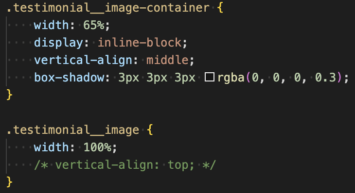
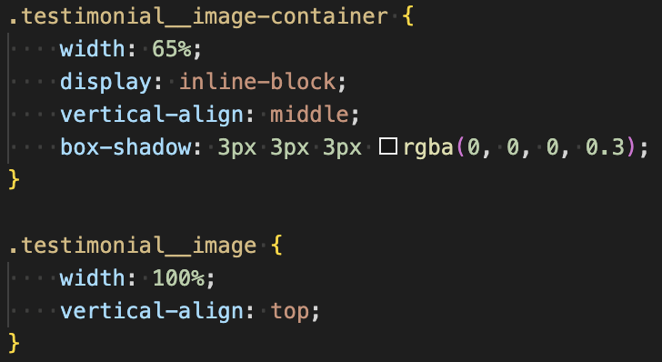

# 배경 이미지와 인라인 요소 버그

이미지를 가지고 있는 `container`가 `inline-block` 일때 `box-shadow` 에 생기는 여백 버그가 있습니다.

`container` 안의 이미지에 `vertical-align`을 `top` 혹은 `bottom` 을 사용하여 해결합니다.

이미지의 `display`를 `block` 으로 설정하여 해결하는 방법도 있습니다.
