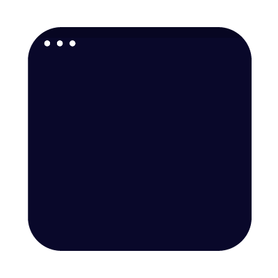
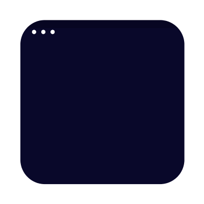
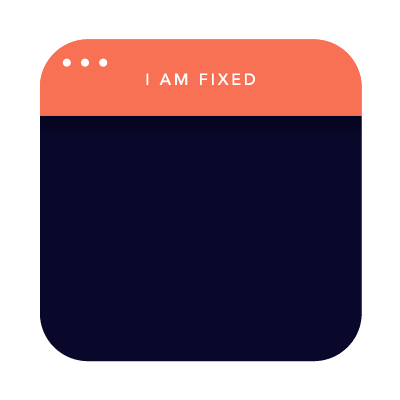
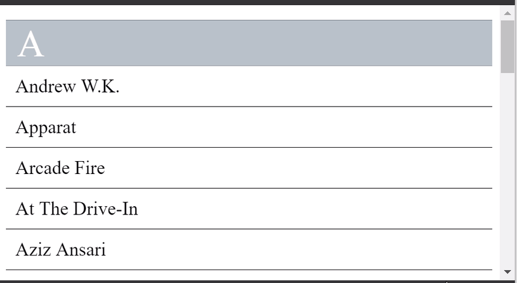
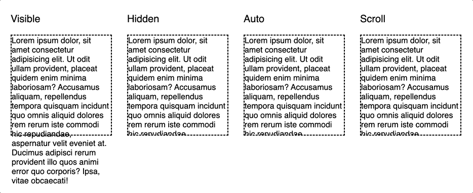
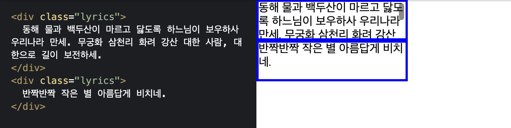

# position & overflow

## position

`position` 프로퍼티는 `top`, `bottom`, `left`, `right` 프로퍼티와 함께 사용하여 위치를 지정합니다.

```css
position: static;
position: relative;
position: absolute;
position: fixed;
position: sticky;
```

### static(기본위치)

`position`의 기본 설정입니다.\
부모 요소의 위치를 기준으로 위에서 아래로, 왼쪽에서 오른쪽으로 순서에 따라 배치됩니다.



### relative(상대위치)

원래 있어야 할 자리를 기준으로 표 프로퍼티(`top`, `bottom`, `left`, `right`)를 사용하여 위치를 이동시킵니다.\
무조건 부모를 기준으로 위치하게 됩니다.



### absolute(절대위치)

`position`이 설정된 가장 가까이에 있는 상위 박스 기준입니다.

상위 박스에 `position`이 설정된 박스가 없다면(`static`), `<html>`(document body)가 기준입니다.\
따라서 부모 요소를 배치의 기준으로 삼기 위해서는 부모 요소에 relative를 정의하여야 합니다.

`absolute` 설정시 요소가 문서 흐름에서 제외됩니다.\
(부모요소가 `static` 이라면 부모 요소의 영역을 벗어나 자유롭게 어디든지 위치할 수 있습니다)


### fixed(고정위치)

viewport가 기준입니다.\
스크롤이 되더라도 화면에서 사라지지 않고 항상 같은 곳에 위치합니다.

`fixed` 설정시 요소가 문서 흐름에서 제외됩니다.\
(부모 요소의 영역을 벗어나 자유롭게 어디든지 위치할 수 있습니다)



### sticky

원래 있어야 하는 자리가 기준이지만 스크롤 시에도 위치 고정됩니다.\
요소와 뷰포트 간의 정해진 간격에 도달하면 `fixed` 배치로 바뀝니다.\
부모 요소 콘텐츠의 내부 끝 부분에 도달하면 `fixed`가 풀립니다.

아래의 gif 예시로 설명드리겠습니다.

1. 스크롤을 내리자 A블럭이 위로 올라갑니다.

2. A블럭은 뷰포트 상단과 어느정도의 간격이 좁혀지자 어떤 위치에 고정됩니다.
3. A블럭이 속한 부모요소의 아래 경계선은 Aziz Ansari 블럭의 아래에 위치한 수평선입니다.
   따라서 A블럭은 Aziz Ansari 블럭의 아래 수평선에 도달하면서 고정이 풀립니다.



#### sticky 속성이 동작하지 않는다면?

1. 도달 위치 설정이 되어 있는지 확인

   `sticky` 엘리먼트는 `top`, `bottom`, `left`, `right` 속성 중 하나는 반드시 필요합니다.\
   설정 된 위치에서 `fixed` 속성처럼 동작해야 하는데 기준 위치가 없기 때문에 동작하지 않는 경우 입니다.

   ```css
   .sticky {
     position: sticky;
     top: 0;
   }
   ```

2. 크로스 브라우징 및 브라우저 확인

   Safari에서도 동작하게 하려면, 위와 같이 `-webkit-sticky` 속성을 추가해주시면 됩니다.

   ```css
   .sticky {
     position: -webkit-sticky;
     position: sticky;
     top: 0;
   }
   ```

3. 부모 또는 조상 노드에 `overflow` 속성이 설정되어 있는지 확인

   브라우저의 develop tool에서 아래 코드를 실행시켜, `sticky` 속성의 부모 또는 조상 노드에 `overflow` 설정이 되어 있는지 확인하실 수 있습니다.

   ```js
   //sticky element selector에 sticky 속성을 사용하고자하는 엘리먼트의 selector 설정
   let parent = document.querySelector(
     "[sticky element selector]"
   ).parentElement;

   while (parent) {
     const hasOverflow = getComputedStyle(parent).overflow;
     if (hasOverflow !== "visible") {
       console.log(hasOverflow, parent);
     }
     parent = parent.parentElement;
   }
   ```

4. 부모 노드의 `height` 가 설정되어 있는지 확인
   `sticky` 속성을 갖는 엘리먼트의 부모 노드는 반드시 `height` 가 설정되어 있어야합니다.
   그렇지 않으면 `sticky` 속성의 엘리먼트는 `stiatc` 속성처럼 동작하게 됩니다.

   ```css
   올바른 예
   height: auto
   height: unset
   height: 100vh
   height: 1000px
   height: 5em

   올바르지 않은 예
   height: xx%; 같이 퍼센트로 설정한 경우에는 동작하지 않습니다.
   ```

### stacking context (`z-index`)

- `position` 프로퍼티가 요소에 적용된 경우에만 `z-index` 를 추가하는 것이 효과가 있습니다.

- z-index는 `position` 프로퍼티가 `static` 이외인 요소에만 적용됩니다.

- `z-index` 는 부모 요소 내부 순서에만 영향을 줄 수 있습니다.

- `z-index` 가 아무리 높아도 부모 요소끼리의 `z` 가 정해지면 부모 보다 높은 `z` 위에 갈 수 없습니다.

#### position에 대한 이해와 stacking context을 모를 경우 겪게될 사례

일반적으로 반 투명한 backdrop을 전체 화면에 씌우고 싶을 때 `z-index`를 사용합니다.

이때 `position` 을 `relative` 로 하게되면 부모 요소의 순서에는 영향을 줄 수 없기 때문에 backdrop의 부모 요소에 포함되지 않은 다른 요소들 위로는 적용되지 않습니다.

`position` 을 `absolute` 로 할 경우 부모 요소의 `position` 을 모두 static으로 하고 html을 기준으로 모든 요소들의 위로 적용할 수 있습니다.\
하지만 스크롤하게 되면 첫 화면 외의 아래 부분에는 적용되지 않습니다.

`position` 을 `fixed` 로 할 경우 html을 기준으로 모든 요소들의 위로 적용할 수 있고 스크롤할 때에도 고정적으로 화면에 적용될 수 있습니다.

##### fixed를 사용한 예시 backdrop

```css
.backdrop {
  position: fixed;
  z-index: 100;
  width: 100vw;
  height: 100vh;
  background: rgba(0, 0, 0, 0.5);
}
```

## overflow

`overflow` 프로퍼티는 자식 요소가 부모 요소의 영역를 벗어났을 때 처리 방법을 정의합니다.

```css
overflow: visible;
overflow: hidden;
overflow: auto;
overflow: scroll;
```



### overflow: auto

작은별은 영역을 벗어나지 않았기 때문에 스크롤이 표시되지 않았고 애국가는 영역을 벗어났기 때문에 스크롤 표시합니다.



| 프로퍼티값 | Description                                                                                         |
| ---------- | --------------------------------------------------------------------------------------------------- |
| `visible`  | 영역을 벗어난 부분을 표시합니다. (기본값)                                                           |
| `hidden`   | 영역을 벗어난 부분을 잘라내어 보이지 않게 합니다.                                                   |
| `auto`     | 영역을 벗어난 부분이 있을때만 스크롤 표시합니다.                                                    |
| `scroll`   | 영역을 벗어난 부분이 없어도 스크롤 표시합니다. (현재 대부분 브라우저는 auto과 동일하게 작동합니다.) |

### overflow: hidden을 body에 적용할 경우

`overflow: hidden`은 적용된 박스 안의 아이템들이 박스의 범위를 넘어가면 보이지 않게 합니다.\
하지만 body 태그에 적용하면 `overflow` 속성이 html로 넘어가면서 body 태그에는 `overflow: hidden`이 적용되지 않습니다.

```css
html {
}

body {
  overflow: hidden;
}
```

위와 같이 코드를 작성하여도 아래처럼 동작하게 됩니다.

```css
html {
  overflow: hidden;
}

body {
}
```

위의 상황에서 `overflow: hidden` 속성을 html 태그에도 적용한다면 html 도 body와 같은 선언이 있으므로 body의 `overflow` 속성이 html로 가지 못하고 적용됩니다.

```css
html {
  overflow: hidden;
    or
  overflow: auto;
}

body {
  overflow: hidden;
}
```

### overflow-x, overflow-y

특정 방향으로만 스크롤을 표시하고자 할 때는 `overflow-x` 또는 `overflow-y` 프로퍼티를 사용합니다.

```css
div {
  overflow-y: auto;
}
```

`overflow`로 `overflow-x`와 `overflow-y`를 사용할 수 있습니다.

```css
overflow: auto hidden;
```

위와 아래의 코드는 같습니다.

```css
overflow-x: auto;
overflow-y: hidden;
```

### 가로 스크롤

위의 예시 `overflow: auto;` 또는 `overflow: scroll;`에서는 주어진 영역이 넘어가면 줄바꿈이 되면서 세로 방향으로 스크롤이 되었습니다.

주어진 공간을 넘어가는 컨텐츠를 줄바꿈하지 않고 사용자가 가로 방향으로 스크롤할 수 있도록 해주고 싶다면 `white-space: nowrap;`을 사용하면 됩니다.

그러면 가로 공간이 부족해도 줄바꿈이 발생하지 않아서 가로 스크롤을 사용할 수 있습니다.

```css
.lyrics {
  overflow: auto;
  white-space: nowrap;
}
```

## 참고 자료

- [CSS의 overflow 속성 사용법](https://www.daleseo.com/css-white-space/)
- [[HTML/CSS] Position sticky 적용 방법](https://deeplify.dev/front-end/markup/position-sticky)
- [Suraj Vishwakarma](https://dev.to/surajondev/css-position-property-explained-3eg7)
