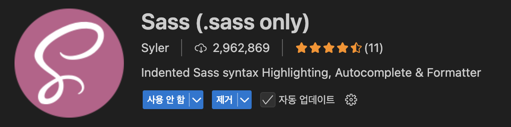

# SASS (Syntactically Awesome Style Sheets)

CSS를 더 효율적으로 관리하기 위해 많이 사용하는 도구 중 하나가 Sass입니다.\
Sass는 CSS 전처리기이며, 두 가지 문법 형태인 SCSS와 SASS를 제공합니다.

## SCSS vs SASS 차이

| 항목   | SCSS (`.scss`)        | SASS (`.sass`)                       |
| ------ | --------------------- | ------------------------------------ |
| 문법   | CSS와 거의 동일       | 들여쓰기 기반 (중괄호 X, 세미콜론 X) |
| 가독성 | CSS 경험자에게 익숙함 | 더 간결하지만 익숙하지 않으면 불편   |
| 확장자 | `.scss`               | `.sass`                              |
| 추천도 | 더 많이 사용됨        | 상대적으로 드묾                      |

### SCSS 예시

```scss
$main-color: #333;

body {
  font: 100% Helvetica, sans-serif;
  color: $main-color;

  .container {
    padding: 20px;
  }
}
```

### SASS 예시

```scss
$main-color: #333

body
  font: 100% Helvetica, sans-serif
  color: $main-color

  .container
    padding: 20px
```

> 대부분의 프론트엔드 프로젝트에서는 `SCSS` 문법을 사용합니다. CSS와 거의 동일하기 때문에 진입 장벽이 낮습니다.

## Sass 설치 방법 (Node.js 기반)

### React, Next.js, Vite 등 Node.js 기반

프레임워크가 React, Next.js, Vite 등 Node.js 기반이라면 아래 명령어만 실행하면 됩니다.

```bash
npm install sass
```

설치되는 것은 Dart Sass이며, 현재 공식적으로 권장되는 Sass 구현입니다.

| 설치 방식        | 명령어                        | 용도                  | 지금은?           |
| ---------------- | ----------------------------- | --------------------- | ----------------- |
| 로컬 설치        | `npm install sass`            | 프로젝트 내에서 사용  | 권장              |
| X 루비 기반 Sass | `gem install sass`            | 옛날 Rails, Jekyll 등 | 사용 중단         |
| X 전역 CLI 설치  | `brew install sass/sass/sass` | 수동 SCSS 변환용      | 일반적으론 불필요 |

### 정적 HTML + SCSS 프로젝트

정적 HTML + SCSS 프로젝트에서 CLI로 직접 SCSS를 변환하려면 전역(global) 설치가 필요합니다.

```bash
npm install -g sass
```

### 아래와 같은 명령어는 더 이상 필요하지 않습니다

- `gem install sass` → 루비 Sass (지원 종료)
- `brew install sass/sass/sass` → 전역 CLI 설치 (대부분 필요 없음)

### VSC 확장



## SCSS → CSS로 바꾸는 법

| 상황                      | `sass` 명령어 필요 여부 | 설명                         |
| ------------------------- | ----------------------- | ---------------------------- |
| React, Vite, Next.js 등   | X 필요 없음             | `.scss` 파일을 자동으로 변환 |
| 정적 HTML + SCSS 프로젝트 | 필요함                  | 직접 CSS로 컴파일 필요       |

### 1. React, Vite, Next.js 같은 프레임워크 사용 시

`sass` 명령어는 필요 없습니다.\
빌드 도구가 알아서 `.scss`를 감지하고 CSS로 자동 컴파일해줍니다.

```tsx
// App.tsx
import "./App.scss";
```

이렇게 `import`만 하면 끝입니다.\
내부적으로 Webpack이나 Vite가 변환을 처리합니다.

### 2. HTML + SCSS만 있는 정적 프로젝트일 경우

이 경우에는 `sass` 명령어로 직접 CSS로 변환해야 합니다.

```bash
# 단일 파일 변환
sass style.scss style.css

# 단일 파일 감시
sass --watch style.scss:style.css

# 폴더 전체 감시 (자동 컴파일)
sass --watch scss/:css/
```

## 중첩 프로퍼티 (Nesting)

Scss에서는 CSS 속성들 중 같은 접두어를 가지는 속성들을 중첩해서 표현할 수 있습니다.\
예를 들어 `font`, `border`, `animation`, `transition` 등입니다.

### 중첩 프로퍼티가 있는 SCSS

```scss
.button {
  font: {
    family: "Arial";
    size: 16px;
    weight: bold;
  }

  border: {
    style: solid;
    width: 1px;
    color: #333;
  }
}
```

### 중첩 프로퍼티가 없는 CSS

```css
.button {
  font-family: "Arial";
  font-size: 16px;
  font-weight: bold;

  border-style: solid;
  border-width: 1px;
  border-color: #333;
}
```

## 변수 (variables)

반복적으로 사용하는 값(색상, 폰트, 크기 등)을 변수로 관리할 수 있습니다.

### 변수 기본 문법

변수 이름 앞에는 `$` 기호를 붙입니다.\
일반적인 CSS 속성 값뿐만 아니라, 색상, 문자열, 숫자, 리스트, 맵 등 다양한 타입을 저장할 수 있습니다.

```scss
$변수이름: 값;
```

변수는 선언된 위치 기준으로 아래에서만 유효합니다.\
따라서 같은 이름의 변수를 다시 선언하면, 해당 범위에서는 새 값이 적용됩니다.

```scss
$color: red;

.header {
  color: $color; // red
}

$color: blue;

.footer {
  color: $color; // blue
}
```

### List

쉼표(`,`) 또는 공백으로 구분된 값들의 나열을 List 변수라고 합니다.\
자바스크립트의 배열과 비슷하며, 1부터 시작하는 인덱스로 접근합니다.

#### list.nth()

```scss
@use "sass:list";

$colors: red green blue;

.item-1 {
  color: list.nth($colors, 1); // red
}
.item-2 {
  color: list.nth($colors, 2); // green
}
```

#### list.join()

두 리스트를 하나로 병합합니다.

```scss
@use "sass:list";

$list-a: 1px solid red;
$list-b: dashed blue;

.joined {
  border: list.join($list-a, $list-b);
  // 결과: 1px solid red dashed blue
}
```

#### list.append()

리스트에 값을 뒤에 추가합니다.

```scss
@use "sass:list";

$sizes: 10px 20px;

.appended {
  padding: list.append($sizes, 30px);
  // 결과: 10px 20px 30px
}
```

#### list.index()

리스트에서 값의 위치(인덱스)를 반환합니다. (1부터 시작)

```scss
@use "sass:list";

$colors: red green blue;

.found {
  order: list.index($colors, green); // 결과: 2
}
```

#### list.separator()

리스트가 공백 구분인지 쉼표 구분인지 확인합니다.

```scss
@use "sass:list";

$list1: a b c;
$list2: (a, b, c);

.sep-a {
  content: list.separator($list1); // space
}

.sep-b {
  content: list.separator($list2); // comma
}
```

#### list.is-bracketed()

리스트가 대괄호 `[]`로 감싸져 있는지 확인합니다.

```scss
@use "sass:list";

$list-a: [10px 20px];
$list-b: 10px 20px;

.check-a {
  content: list.is-bracketed($list-a); // true
}

.check-b {
  content: list.is-bracketed($list-b); // false
}
```

#### 리스트 관련 함수 (`@use 'sass:list'`)

| 함수                        | 설명                         |
| --------------------------- | ---------------------------- |
| `list.nth($list, n)`        | n번째 요소 반환 (1부터 시작) |
| `list.length($list)`        | 리스트 길이 반환             |
| `list.join($list1, $list2)` | 리스트 병합                  |
| `list.append($list, $val)`  | 리스트에 값 추가             |
| `list.index($list, $value)` | 해당 값의 인덱스 반환        |
| `list.is-bracketed($list)`  | 대괄호 리스트 여부 확인      |
| `list.separator($list)`     | 구분자(공백 or 쉼표) 반환    |

> 최신 Sass에서는 반드시 `@use 'sass:list'`를 선언한 뒤, `list.` 접두어와 함께 함수 호출해야 합니다.

### Maps

맵(Map)은 키-값 쌍(key-value pair) 으로 구성된 자료구조로, 자바스크립트의 객체와 유사합니다.

Sass는 기존의 전역 함수 `map-get()` 사용을 폐지하고, 모듈 방식인 `@use 'sass:map'`과 `map.get()`을 사용하는 것을 권장합니다.

#### Map 정의 예시

```scss
$colors: (
  primary: #3498db,
  danger: #e74c3c,
);
```

#### 값 꺼내기

```scss
@use "sass:map";

.button {
  background-color: map.get($colors, primary);
}
```

- `map.get()`을 사용하면 키에 해당하는 값을 반환합니다.
- `@use 'sass:map'`이 반드시 필요합니다.

#### 반복 처리 (`@each`와 함께 사용)

```scss
@use "sass:map";

$themes: (
  light: #fff,
  dark: #000,
);

@each $name, $color in $themes {
  .theme-#{$name} {
    background-color: $color;
  }
}
```

#### Map 관련 함수

| 함수                        | 설명                     |
| --------------------------- | ------------------------ |
| `map.get($map, $key)`       | 해당 키의 값 반환        |
| `map.has-key($map, $key)`   | 키 존재 여부 확인        |
| `map.keys($map)`            | 키 목록 리스트 반환      |
| `map.values($map)`          | 값 목록 리스트 반환      |
| `map.merge($map1, $map2)`   | 두 맵 병합               |
| `map.remove($map, $key...)` | 지정된 키 제거           |
| `map.set($map, $key, $val)` | 값을 덮어쓰며 새 맵 생성 |

> 모든 함수는 `@use 'sass:map'` 이후, `map.` 접두어로 사용해야 합니다.

#### 자주 하는 실수

```scss
.button {
  background-color: $colors.primary; // 작동하지 않음
}
```

- Sass는 자바스크립트처럼 `.` 연산자로 접근할 수 없습니다.
- 항상 `map.get($map, $key)`로 값을 꺼내야 합니다.

## 내장 함수

### 색상 함수

Sass(SCSS)는 색상(color)을 조절할 수 있는 다양한 내장 함수들을 제공합니다.\
기존의 `lighten()`, `darken()` 등은 더 이상 권장되지 않으며, `@use 'sass:color'` 모듈과 함께 `color.adjust()` 함수 사용이 표준입니다.

#### 색상을 밝게 만들기 (lighten → color.adjust)

```scss
@use "sass:color";

$base-color: #3498db;

.button {
  background-color: color.adjust($base-color, $lightness: 20%);
}
```

- `lightness`를 `+` 값으로 지정하면 더 밝아집니다.

#### 색상을 어둡게 만들기 (darken → color.adjust)

```scss
@use "sass:color";

$base-color: #3498db;

.button {
  background-color: color.adjust($base-color, $lightness: -15%);
}
```

- `lightness`를 `-` 값으로 지정하면 더 어두워집니다.

#### 채도를 높이거나 줄이기 (saturate/desaturate → color.adjust)

```scss
@use "sass:color";

// 채도 증가
$color-1: color.adjust(#3498db, $saturation: 30%);

// 채도 감소
$color-2: color.adjust(#3498db, $saturation: -30%);
```

#### 색상 회전 (hue 조정)

```scss
@use "sass:color";

$shifted: color.adjust(#3498db, $hue: 60deg);
```

#### 색상 혼합

```scss
@use "sass:color";

$mix: color.mix(#3498db, #e74c3c, 50%);
```

#### 투명도 설정

```scss
@use "sass:color";

$semi: color.change(#3498db, $alpha: 0.5);
```

#### 마무리 정리

| 이전 함수                 | 대체 함수 (권장)                        | 설명        |
| ------------------------- | --------------------------------------- | ----------- |
| `lighten($color, %)`      | `color.adjust($color, $lightness: +%)`  | 밝기 증가   |
| `darken($color, %)`       | `color.adjust($color, $lightness: -%)`  | 밝기 감소   |
| `saturate($color, %)`     | `color.adjust($color, $saturation: +%)` | 채도 증가   |
| `desaturate($color, %)`   | `color.adjust($color, $saturation: -%)` | 채도 감소   |
| `adjust-hue($color, deg)` | `color.adjust($color, $hue: deg)`       | 색상 회전   |
| `mix($c1, $c2, %)`        | `color.mix($c1, $c2, %)`                | 색상 혼합   |
| `rgba($color, alpha)`     | `color.change($color, $alpha: val)`     | 투명도 조절 |

> 이 모든 함수는 `@use 'sass:color'` 선언 후 사용해야 합니다.

### 문자열 함수

Sass에서는 문자열 조작을 위한 다양한 내장 함수를 제공합니다.\
현재는 대부분 전역에서도 작동하지만, 앞으로는 `@use 'sass:string'` 방식이 표준이 됩니다.

#### 사용 전 모듈 불러오기

```scss
@use "sass:string";
```

#### 주요 문자열 함수

| 함수                                   | 설명                   | 예시                                         |
| -------------------------------------- | ---------------------- | -------------------------------------------- |
| `string.quote($str)`                   | 문자열을 따옴표로 감쌈 | `string.quote(hello)` → `"hello"`            |
| `string.unquote($str)`                 | 따옴표 제거            | `string.unquote("hello")` → `hello`          |
| `string.length($str)`                  | 문자열 길이            | `string.length("hello")` → `5`               |
| `string.to-upper-case($str)`           | 대문자로               | `string.to-upper-case("abc")` → `"ABC"`      |
| `string.to-lower-case($str)`           | 소문자로               | `string.to-lower-case("ABC")` → `"abc"`      |
| `string.index($str, $substr)`          | 부분 문자열 위치 반환  | `string.index("hello", "e")` → `2`           |
| `string.insert($str, $insert, $index)` | 문자열 삽입            | `string.insert("heyo", "ll", 3)` → `"hello"` |
| `string.slice($str, $start, $end?)`    | 부분 문자열 추출       | `string.slice("hello", 2, 4)` → `"ell"`      |

#### 문자열 함수 예시

```scss
@use "sass:string";

$env: "dev";

body::before {
  content: "This is " + string.quote($env);
  // → "This is \"dev\""
}
```

> 대부분의 전역 문자열 함수(`quote()`, `str-slice()` 등)는 아직 사용 가능하지만, Sass 3.0 이후에는 전역 함수 사용이 중단될 예정입니다.  
> 따라서 지금부터는 `@use 'sass:string'`과 `string.` 접두어를 붙여 사용하는 방식에 익숙해져야 합니다.

### 숫자 함수

숫자 계산은 디자인 시스템이나 반응형 계산에서 매우 유용하며,  
Sass 2.0 이후로는 대부분 `@use 'sass:math'` 모듈을 통해 사용하는 것이 표준입니다.

#### 사용 전 선언

```scss
@use "sass:math";
```

#### 주요 숫자 함수

| 함수                    | 설명          | 예시                               |
| ----------------------- | ------------- | ---------------------------------- |
| `math.abs($num)`        | 절댓값 반환   | `math.abs(-5)` → `5`               |
| `math.ceil($num)`       | 올림          | `math.ceil(4.2)` → `5`             |
| `math.floor($num)`      | 내림          | `math.floor(4.9)` → `4`            |
| `math.round($num)`      | 반올림        | `math.round(3.6)` → `4`            |
| `math.percentage($num)` | 퍼센트 변환   | `math.percentage(0.5)` → `50%`     |
| `math.min($a, $b)`      | 최소값        | `math.min(1px, 2px)` → `1px`       |
| `math.max($a, $b)`      | 최대값        | `math.max(1rem, 2rem)` → `2rem`    |
| `math.random()`         | 0~1 무작위 값 | `math.random()` → `0.39482...`     |
| `math.random($limit)`   | 1~limit 정수  | `math.random(5)` → `1 ~ 5 중 하나` |

#### 숫자 함수 예시

```scss
@use "sass:math";

$spacing: 4.3;

.box {
  margin: math.round($spacing) * 1px;
  // 결과: margin: 4px;
}
```

> 기존 전역 함수 `round()`, `ceil()`, `percentage()` 등은 Sass 3.0에서 제거될 예정입니다.
> 지금부터는 `@use 'sass:math'` 후 `math.` 접두어로 사용하는 방식에 익숙해지는 것이 안전합니다.

### 유닛 함수

Sass에서는 숫자의 단위를 다루기 위한 유틸리티 함수들을 제공합니다.\
이 함수들은 현재까지는 전역(global)으로 사용 가능하지만, 미래에는 `@use 'sass:math'` 또는 `sass:meta`를 통해 사용할 가능성도 있습니다.

#### 주요 유닛 함수

| 함수                       | 설명                                | 예시                              |
| -------------------------- | ----------------------------------- | --------------------------------- |
| `unit($number)`            | 숫자의 단위만 추출                  | `unit(10px)` → `"px"`             |
| `unitless($number)`        | 단위가 없는지 확인                  | `unitless(5)` → `true`            |
| `comparable($num1, $num2)` | 두 숫자의 단위가 비교 가능한지 확인 | `comparable(10px, 1em)` → `false` |

#### 유닛 함수 예시

```scss
$length: 12em;
$value: 100;

.check-unit {
  content: unit($length); // → "em"
}

.check-unitless {
  content: unitless($value); // → true
}

.check-compare {
  content: comparable(10px, 1em); // → false
}
```

> 참고: `unitless()`, `unit()`, `comparable()`는 현재 전역 함수이지만, Sass 3.0 대비를 위해 `math.` 또는 `meta.` 접두어 방식으로도 접근할 수 있도록 준비하는 것이 좋습니다.

### 불리언 함수

Sass에서는 불리언 값의 반전을 위한 단일 함수 `not()`을 제공합니다.\
현재까지는 전역 함수로 사용 가능하며, `@if` 문 등 조건문 안에서 자주 쓰입니다.

#### not()

주어진 값을 반전시켜 `true` → `false`, `false` → `true`로 반환합니다.

```scss
$enabled: false;

.button {
  display: if(not($enabled), block, none);
}
```

#### falsy 값

Sass에서는 다음 값들이 falsy로 간주됩니다:

- `false`
- `null`
- `()` (빈 리스트)
- `""` (빈 문자열)

```scss
$empty-list: ();
$empty-string: "";

@if not($empty-list) {
  // 실행됨
}

@if not($empty-string) {
  // 실행됨
}
```

> 참고: `not()`은 현재까지는 전역 함수지만, 미래에는 `@use 'sass:boolean'`과 같은 모듈 방식으로 분리될 가능성이 있어, 함수 명시와 주석 처리를 해두는 습관이 좋습니다.

### 타입 검사 함수

Sass는 값의 자료형, 단위, 리스트/맵 길이 등을 확인할 수 있는 다양한 타입 검사 함수를 제공합니다.\
이 함수들 중 일부는 앞으로 `@use 'sass:meta'`, `@use 'sass:math'` 기반으로 전환될 가능성이 높습니다.

#### 주요 타입 검사 함수 정리

| 함수                            | 설명                  | 예시                               |
| ------------------------------- | --------------------- | ---------------------------------- |
| `type-of($value)`               | 자료형 반환           | `type-of(42)` → `number`           |
| `unit($number)`                 | 단위 반환             | `unit(10px)` → `"px"`              |
| `unitless($number)`             | 단위 없는지 확인      | `unitless(100)` → `true`           |
| `is-unitless($number)`          | `unitless()`의 별칭   | `is-unitless(2em)` → `false`       |
| `length($list)`                 | 리스트 또는 맵 길이   | `length(1px solid red)` → `3`      |
| `call($function-name, args...)` | 사용자 정의 함수 실행 | `call(my-fn, 1)` → `my-fn(1)` 실행 |

#### 타입 검사 예시

```scss
$value: 16px;
$list: 1px solid red;

.check-type {
  content: type-of($value); // "number"
}

.check-unit {
  content: unit($value); // "px"
}

.check-length {
  content: length($list); // 3
}
```

> `unit()`, `unitless()`, `length()` 등은 현재는 전역 함수지만,  
> Sass 3.0 이후에는 `@use 'sass:math'` 또는 `@use 'sass:meta'` 방식으로 전환될 가능성이 있습니다.  
> 지금부터 명시적으로 사용하는 습관을 들이면 안전합니다.

## 사칙연산

Sass에서는 CSS에서 불가능했던 변수 간 계산, 단위 포함 숫자 연산, 비율 계산 등을 지원합니다.\
이는 디자인 시스템이나 반응형 UI 계산에 매우 유용합니다.

### 지원되는 연산자

| 연산자 | 의미                                    |
| ------ | --------------------------------------- |
| `+`    | 더하기                                  |
| `-`    | 빼기                                    |
| `*`    | 곱하기                                  |
| `/`    | 사용 중단 예정 → `math.div()` 사용 권장 |

> `/` 연산자는 CSS에서는 구분자로 쓰이기 때문에, Sass에서는 반드시 `math.div()`를 사용해야 안전합니다.

### 기본 연산 예시

```scss
@use "sass:math";

$base: 16px;

.container {
  padding: $base * 1.5; // 24px
  margin: $base + 8px; // 24px
  font-size: math.div($base, 2); // 8px
}
```

### 컴파일 결과

```css
.container {
  padding: 24px;
  margin: 24px;
  font-size: 8px;
}
```

### 서로 다른 단위 연산

- 단위가 같으면 자유롭게 연산 가능
- 단위가 다르면 오류 발생하거나 자동 변환

```scss
$width: 100px;
$gutter: 20px;

.content {
  width: $width - $gutter; // 80px
}
```

```scss
$em-size: 2em;
$px-size: 16px;

// 오류 발생
// width: $em-size + $px-size;
```

### 단위 없는 숫자와 연산

단위 없는 숫자는 어떤 단위와도 자유롭게 계산할 수 있습니다.

```scss
$base: 16px;
$ratio: 1.5;

.card {
  padding: $base * $ratio; // 24px
}
```

### 연산자 우선순위

- `*`, `/` 가 `+`, `-`보다 먼저 계산됨
- 괄호로 우선순위 조절 가능

```scss
$size: 20px;

.box {
  width: $size + 10px * 2; // 40px
  height: ($size + 10px) * 2; // 60px
}
```

### `/` 나눗셈 주의사항

#### 문제 되는 예시 (전통 방식)

```scss
$font-size: 16px;
$line-height: 24px;

font: $font-size / $line-height; // 결과 예측 불가 (CSS에서 구분자로 인식)
```

#### 명확하게 나눗셈으로 쓰기

```scss
@use "sass:math";

font: math.div($font-size, $line-height); // 0.66667
```

#### CSS에 그대로 출력되길 원할 때

```scss
font: 16px/24px; // 그대로 출력됨 (줄간격 목적)
```

> Sass 2.0 이후 `/` 연산자는 사용 중단(deprecated) 되었으며, 반드시 `math.div()`를 사용해 CSS와의 충돌을 피해야 합니다.

## 모듈 시스템

SCSS는 스타일 코드를 기능별로 나눠 재사용할 수 있도록 모듈 시스템을 지원합니다.\
이때 사용하는 것이 `@import`, `@use`, `@forward`, 그리고 `partials`입니다.

| 개념           | 설명                                   |
| -------------- | -------------------------------------- |
| `_파일명.scss` | Partial, 컴파일되지 않고 import/사용만 |
| `@import`      | 기존 방식 (deprecated)                 |
| `@use`         | Better Import, 네임스페이스 자동 적용  |
| `@forward`     | 모듈을 외부로 재공유                   |

현대 Sass 모듈 시스템의 경우 `@use` + `@forward` + `partials` 조합이 표준입니다.\
구조적인 스타일 관리를 원한다면 반드시 이 방식에 익숙해지는 것을 추천합니다.

### Partials (부분 파일)

Partials는 Sass에서 여러 파일로 스타일을 나누어 관리할 때 사용하는 방식입니다.

#### Partials 특징

- 파일 이름 앞에 밑줄(`_`)을 붙이면 컴파일 대상이 아님
- 오직 다른 SCSS 파일에서 불러와서 사용할 목적

```scss
// _variables.scss
$primary-color: #3498db;
$padding: 16px;
```

```scss
@import "variables";

.button {
  padding: $padding;
  background: $primary-color;
}
```

- 위 파일은 SCSS 단독으로는 컴파일되지 않음
- 다른 파일에서 `@import`나 `@use`로 불러와야 사용 가능

### @import (기존 방식 - Deprecated)

```scss
@import "variables";
@import "button";
```

- 파일 확장자 `.scss`, 앞의 `_`는 생략 가능
- 여러 파일을 한 번에 import 가능: `@import 'a', 'b', 'c';`

하지만 Sass 공식 문서에서는 더 이상 `@import` 사용을 권장하지 않습니다.  
대신 `@use`와 `@forward`를 사용하는 Better Import 방식을 추천합니다.

### @use (Better Import – 권장 방식)

```scss
@use "variables";
```

- 파일 확장자 `.scss`, 앞의 `_`는 생략 가능
- `@use`는 불러온 모듈의 변수, 믹스인, 함수 등에 네임스페이스를 자동으로 붙입니다.

```scss
// variables.scss
$primary-color: #3498db;

// main.scss
@use "variables";

.button {
  color: variables.$primary-color;
}
```

#### 별칭 붙이기 (`as`)

```scss
@use "variables" as v;

.title {
  color: v.$primary-color;
}
```

### 4. @forward (재공유용)

`@forward`는 다른 모듈을 외부로 내보내는 역할을 합니다.\
예를 들어 공통 스타일을 모아서 한 번에 불러오게 만들 수 있습니다.

```scss
// styles/_index.scss
@forward "variables";
@forward "mixins";
```

```scss
// main.scss
@use "styles/index" as *;

.title {
  color: $primary-color;
}
```

- `@use ... as *;`로 사용하면 네임스페이스 없이 직접 접근 가능
- 다만 충돌 위험이 있으니 주의가 필요

### @use vs @import 비교

| 구분           | @import        | @use                         |
| -------------- | -------------- | ---------------------------- |
| 중복 import    | 허용 (중복됨)  | 한 번만 적용됨               |
| 네임스페이스   | 없음           | 기본적으로 네임스페이스 붙음 |
| 변수 충돌 방지 | 없음           | 있음                         |
| 성능           | 느림           | 더 빠름                      |
| 권장 여부      | 사용 중단 예정 | 공식 권장 방식               |

## 미디어 쿼리, Mixin 사용하기

SCSS는 CSS의 미디어 쿼리를 그대로 지원할 뿐 아니라, 중첩(Nesting)과 Mixin을 활용해 더 깔끔하고 재사용 가능한 코드로 만들 수 있습니다.\
SCSS의 중첩 + Mixin 조합은 반응형 스타일을 매우 직관적이고 관리하기 좋게 만들어줍니다.

### 기본 사용법 (SCSS)

```scss
.container {
  padding: 20px;

  @media (max-width: 768px) {
    padding: 10px;
  }
}
```

#### 컴파일 결과 (CSS)

```css
.container {
  padding: 20px;
}

@media (max-width: 768px) {
  .container {
    padding: 10px;
  }
}
```

### 미디어 쿼리 분기별 예시

| 구분     | 조건                    | 설명                        |
| -------- | ----------------------- | --------------------------- |
| 모바일   | `max-width: 480px`      | 480px 이하                  |
| 태블릿   | `max-width: 768px`      | 태블릿 이하                 |
| 데스크탑 | `min-width: 1024px`     | 1024px 이상                 |
| 고해상도 | `min-resolution: 2dppx` | Retina 등 고해상도 디바이스 |

### Mixin으로 공통화하기

매번 같은 조건을 반복하지 않도록 `@mixin`을 사용해 재사용할 수 있습니다.

```scss
// _media.scss
@mixin mobile {
  @media (max-width: 480px) {
    @content;
  }
}

@mixin tablet {
  @media (max-width: 768px) {
    @content;
  }
}

@mixin desktop {
  @media (min-width: 1024px) {
    @content;
  }
}
```

#### 사용 예시

```scss
.card {
  padding: 24px;

  @include mobile {
    padding: 12px;
  }

  @include tablet {
    padding: 16px;
  }
}
```

### 파라미터를 받는 Mixin 만들기

더 유연하게 만들고 싶다면 파라미터를 받도록 구성할 수도 있습니다.

```scss
@mixin respond($breakpoint) {
  @if $breakpoint == mobile {
    @media (max-width: 480px) {
      @content;
    }
  } @else if $breakpoint == tablet {
    @media (max-width: 768px) {
      @content;
    }
  } @else if $breakpoint == desktop {
    @media (min-width: 1024px) {
      @content;
    }
  }
}
```

```scss
.container {
  width: 100%;

  @include respond(tablet) {
    width: 90%;
  }

  @include respond(mobile) {
    width: 100%;
  }
}
```

### Sass 상속 (`@extend`)

Sass에서는 공통 스타일을 재사용하기 위해 상속(Extend)을 사용할 수 있습니다.\  
`@extend`는 하나의 셀렉터가 다른 셀렉터의 스타일을 그대로 물려받도록 합니다.

#### 상속 사용법

```scss
// %의 의미는 아래에 나옴
%button-base {
  padding: 12px 16px;
  border: none;
  cursor: pointer;
}

.primary-button {
  @extend %button-base;
  background: blue;
  color: white;
}

.secondary-button {
  @extend %button-base;
  background: gray;
  color: black;
}
```

#### 상속 컴파일 결과 (CSS)

```css
.primary-button,
.secondary-button {
  padding: 12px 16px;
  border: none;
  cursor: pointer;
}

.primary-button {
  background: blue;
  color: white;
}

.secondary-button {
  background: gray;
  color: black;
}
```

#### `%placeholder`란?

Sass에서는 일반 클래스 대신 `%placeholder` 선택자를 정의해서 `@extend`할 수 있습니다.

```scss
%button-base {
  padding: 12px 16px;
  border: none;
}
```

- `%`로 시작하는 선택자는 CSS에 출력되지 않음
- 오직 다른 셀렉터가 `@extend`할 때만 컴파일 대상이 됩니다

##### `%placeholder` 사용 예시

```scss
%button-base {
  padding: 12px 16px;
  border: none;
  cursor: pointer;
}

.primary-button {
  @extend %button-base;
  background: blue;
  color: white;
}

.secondary-button {
  @extend %button-base;
  background: gray;
  color: black;
}
```

##### `%placeholder` 컴파일 결과 (CSS)

```css
.primary-button,
.secondary-button {
  padding: 12px 16px;
  border: none;
  cursor: pointer;
}

.primary-button {
  background: blue;
  color: white;
}

.secondary-button {
  background: gray;
  color: black;
}
```

→ `%button-base`는 CSS에 출력되지 않음  
→ 오직 `.primary-button`, `.secondary-button`에만 스타일이 반영됨

##### 일반 클래스와의 차이

```scss
.button-base {
  padding: 1rem;
}

.btn {
  @extend .button-base;
}
```

#### 결과

```css
.button-base,
.btn {
  padding: 1rem;
}
```

→ `.button-base`는 사용하지 않아도 CSS에 남음  
→ 불필요한 코드 낭비 + 네임스페이스 충돌 위험

#### 일반 클래스도 상속 가능

```scss
.alert {
  padding: 1rem;
  border: 1px solid red;
}

.error {
  @extend .alert;
  color: red;
}
```

그러나 실제 프로젝트에서는 `%placeholder` 사용이 더 안전합니다.\
(일반 클래스 상속은 CSS 셀렉터 중복을 일으키기 쉬움)

#### @extend 사용 시 주의사항

| 주의점                         | 설명                                                    |
| ------------------------------ | ------------------------------------------------------- |
| 셀렉터 구조 복잡해짐           | 여러 `@extend`가 얽히면 컴파일된 CSS가 비대해질 수 있음 |
| 유지보수 어려움                | 적용 범위 추적이 어려워짐                               |
| BEM 등 구조적 설계와 충돌 가능 | BEM 방식에서는 보통 `@extend`보다 Mixin을 선호          |

#### 언제 사용하면 좋은가?

- 반복되는 시각적 속성이 있고, 구조적으로 잘 분리되어 있을 때
- `placeholder selector`를 이용해 모듈화된 UI 요소 구성할 때

#### `@extend` vs `@mixin` 비교

| 항목           | `@extend`            | `@mixin`           |
| -------------- | -------------------- | ------------------ |
| 목적           | 스타일 공유          | 스타일 재사용      |
| 코드 중복 제거 | 매우 효과적          | 어느 정도 가능     |
| 매개변수       | 없음                 | 있음               |
| 유연성         | 제한적               | 매우 유연          |
| CSS 출력 위치  | 병합됨 (같은 셀렉터) | 삽입 위치에 출력됨 |

- Sass의 `@extend`는 코드 중복을 줄이고, 공통 스타일을 재사용하는 강력한 도구입니다.
- 하지만 복잡한 프로젝트에서는 `@mixin`을 더 유연하게 활용할 수 있으므로, 둘을 적절히 조합해서 사용하는 것이 좋습니다.

## 꼭 기억해야 할 점

Sass는 브라우저에서 직접 실행되지 않습니다.\
대신 개발 단계에서만 사용되며, 프로덕션 단계에서는 반드시 일반 CSS로 컴파일해야 합니다.

즉, Sass는 CSS를 더 잘 작성하기 위한 "개발 보조 도구"일 뿐이고, 브라우저가 해석하는 건 언제나 `.css` 파일입니다.
