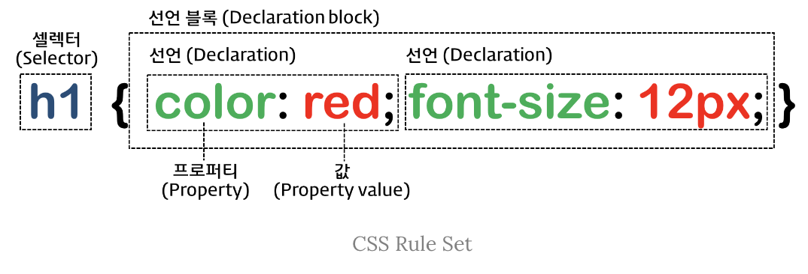
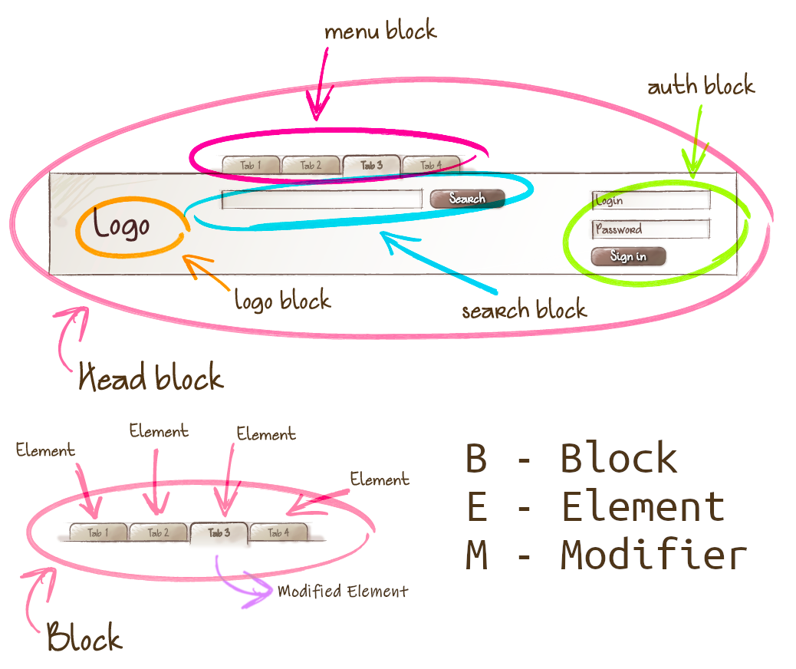
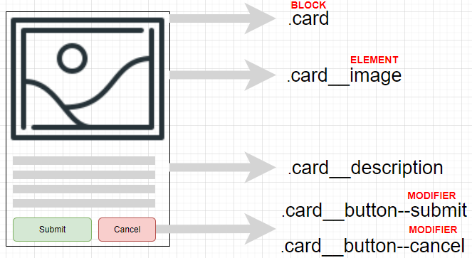
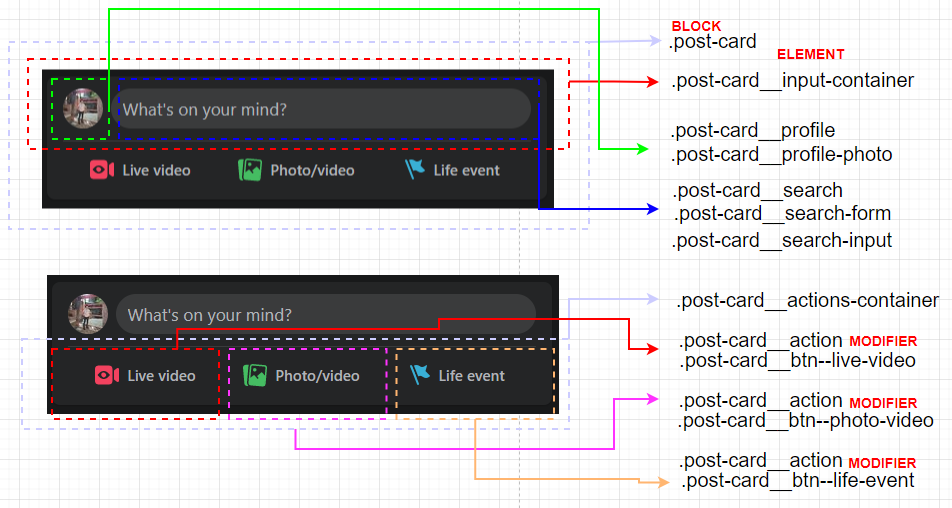

# 선택자, 명시도, 상속, 결합자, 클래스 이름 형식

## CSS Selectors(선택자)



selectors는 style을 적용하고자하는 HTML 요소를 특정할 때 사용됩니다.\
위의 이미지와 같이 selector를 특정하고 선언블록을 생성합니다.\
선언블록 내에서 프로퍼티와 값을 작성하면 특정한 selector에 원하는 css style을 적용할 수 있습니다.

### 선택자 네이밍

class 혹은 id 선택자의 이름을 정할땐 띄어쓰기 대신‘- 를 사용하는 kebab case를 추천합니다.

### Elements

html 태그 요소를 직접 지칭하는 선택자입니다.

```html
<h1>Our header</h1>
```

```css
h1 {
  color: red;
}
```

### Classes

class 속성값을 가진 html 요소를 지칭하는 선택자입니다.

```html
<h1 class="blog-post">Our header</h1>
```

```css
.blog-post {
  color: red;
}
```

#### 다중 CSS 클래스 (클래스 간 공백)

두 클래스가 동일한 프로퍼티에 대한 스타일을 정의하는 경우 다중 CSS 클래스라고 합니다.\
`class=”main-section highlighted”` 과 같이 클래스 간에 공백을 추가하여 다중 클래스 설정 가능합니다.\
파일에서 나중에 정의된 클래스가 우선순위를 갖습니다.

```html
<section class="main-section highlighted">Our header</h1>
```

```css
.main-section {
  height: 800px;
  border: 1px solid #ccc;
}

.highlighted {
  border: 2px solid #fa923f;
  padding: 16 px;
}
```

결과물

```css
height: 800px;
border: 2px solid #fa923f;
padding: 16 px;
```

### Universal

HTML 문서 내의 모든 요소를 지칭하는 선택자입니다.

```css
* {
  color: red;
}
```

### IDs

id 속성값을 가진 html 요소를 지칭하는 선택자입니다.

ID는 재사용 불가, 동일 ID 사용 불가합니다.

```html
<h1 id="main-title">Our header</h1>
```

```css
#main-title {
  color: red;
}
```

### Attributes (대괄호)

```html
<button disabled>Click</button>
```

```css
[disabled] {
  color: red;
}
```

```html
<button type="submit">Edit</button>
```

```css
[type="submit"] {
  display: block;
  margin-block: 1rem;
}
```

## specificity

명시도는 CSS가 적용되는 우선순위를 결정하는 기준입니다.

- 명시도가 같으면 나중에 선언된 것이 우선 적용됩니다.
- 구체적일수록 우선 적용(Combinator)됩니다.

### 가장 우선순: !important > Inline Style > Id > Class > Tag > Universal

[specifishity](./img/specifishity.png)

### 개별성 규칙과 점수

우선 순위는 점수로 계산되며, 높을 수록 우선 순위를 갖습니다.

| 선택자             | 예시                          | 점수  |
| ------------------ | ----------------------------- | ----- |
| 전체 선택자        | `*`                           | 0     |
| 태그 선택자        | `div`, `p`, `h1`              | 1     |
| 가상 요소 선택자   | `::before`, `::after`         | 1     |
| 클래스 선택자      | `.box`, `.title`              | 10    |
| 가상 클래스 선택자 | `:hover`, `:visited`, `:link` | 10    |
| 아이디 선택자      | `#title`, `#main`             | 100   |
| 인라인 선택자      | `style="color:red"`           | 1,000 |

| 천의 자리 | 백의 자리 | 십의 자리               | 일의 자리      |
| --------- | --------- | ----------------------- | -------------- |
| 인라인    | 아이디    | 클래스 속성 가상 클래스 | 태그 가상 요소 |

## inheritance(상속)

상속은 부모 요소에 적용된 스타일을 자식요소가 그대로 물려받아 적용되는 것입니다.\
단, 모든 속성이 전부 상속되지는 않습니다.

```css
div {
  color: red;
}
```

```html
<div>
  <p>inherit</p>
  <!-- p태그는 부모인 div 태그의 속성인 red를 물려받습니다 -->
</div>
```

### 상속되는 프로퍼티

`font-family`, `font-size`, `font-weight`, `line-height`, `visibility`, `opacity`, `color`, `line-height`, `text-align`, `white-space`, `list-style`

### 상속이 되지않는 프로퍼티

`margin`, `padding`, `border` , `box-sizing`, `display`, `background`, `vertical-align`, `text-ecoration`, `top`/`right`/`bottom`/`left`, `position`, `overflow`, `width`/`height`

## combinator(결합자)

CSS 선택자는 결합하여 사용할 수 있습니다.

### Adjacent Sibling(인접 형제 결합자)

선택자 사이에 '`+`' 기호를 사용합니다.\
앞의 선택자 바로 뒤에 나오는 뒤의 선택자를 지칭합니다.

```css
h2 + p {
  color: red;
}
```

```html
<!-- <h2>태그 바로 뒤에 나오는 인접한 형제 요소인 <p>태그를 선택자로 지정 -->
<div>
  <h2>Not applied</h2>
  <p>CSS applied</p>
  <!-- red -->
  <h2>Not applied</h2>
  <h3>Not applied</h3>
  <p>Not applied</p>
  <h2>Not applied</h2>
  <p>CSS applied</p>
  <!-- red -->
</div>
```

### General Sibling(일반 형제 결합자)

선택자 사이에 '`~`' 기호를 사용합니다.\
앞의 선택자 이후에 나오는 뒤의 선택자 요소들을 지칭합니다.

```css
h2 ~ p {
  color: red;
}
```

```html
<!-- <h2>태그 이후로 나오는 형제 요소인 <p>태그를 선택자로 지정 -->
<div>
  <h2>Not applied</h2>
  <p>CSS applied</p>
  <!-- red -->
  <h2>Not applied</h2>
  <h3>Not applied</h3>
  <p>CSS applied</p>
  <!-- red -->
</div>
```

### Child(자식 선택자)

선택자 사이에 '`>`' 기호를 사용합니다.\
앞의 선택자의 직속 자식 요소중 뒤의 선택자와 동일한 요소들을 지칭합니다.

```css
div > p {
  color: red;
}
```

```html
<!-- <div>태그의 직속 자식 요소인 <p>태그를 선택자로 지정 -->
<div>
  <div>Not applied</div>
  <p>CSS applied</p>
  <!-- red -->
  <div>Not applied</div>
  <article>
    <p>Not applied</p>
  </article>
  <p>CSS applied</p>
  <!-- red -->
</div>
```

### Descendant(자손, 하위 선택자)

선택자 사이에 띄어쓰기를 사용합니다.\
앞의 선택자의 하위 요소에 있는 뒤의 선택자 모두를 선택합니다.

```css
div p {
  color: red;
}
```

```html
<!-- <div>태그의 하위 요소인 <p>태그를 선택자로 지정 -->
<div>
  <div>Not applied</div>
  <p>CSS applied</p>
  <!-- red -->
  <div>Not applied</div>
  <article>
    <p>CSS applied</p>
    <!-- red -->
  </article>
  <p>CSS applied</p>
  <!-- red -->
</div>
```

### Group(그룹 선택자)

선택자 사이에 쉼표를 사용합니다.\
쉼표로 이어진 모든 선택자에 스타일을 적용합니다.

```css
p,
#title,
.red {
  color: red;
}
/* 아래의 css 와 같음 */
```

위의 코드와 아래 코드는 동일한 스타일을 적용합니다.

```css
p {
  color: red;
}
#title {
  color: red;
}
.red {
  color: red:
}
```

## pseudo class

요소의 특수 상태에 대한 스타일을 정의 할 수 있는 클래스 이름입니다.

특수 상태의 예로는

- 마우스가 올라와 있을때

- 링크를 방문했을 때와 아직 방문하지 않았을 때

- 포커스가 들어와 있을 때

등이 있습니다.

```css
/* 가상 클래스 선택자 */
기준선택자: 가상 클래스 이름;
```

### 링크 셀렉터(Link pseudo-classes), 동적 셀렉터(User action pseudo-classes)

| 가상 클래스 이름 | Description                      |
| ---------------- | -------------------------------- |
| `:link`          | 셀렉터가 방문하지 않은 링크일 때 |
| `:visited`       | 셀렉터가 방문한 링크일 때        |
| `:hover`         | 셀렉터에 마우스가 올라와 있을 때 |
| `:active`        | 셀렉터가 클릭된 상태일 때        |
| `:focus`         | 셀렉터에 포커스가 들어와 있을 때 |

### UI 요소 상태 셀렉터(UI element states pseudo-classes)

| 가상 클래스 이름 | Description                      |
| ---------------- | -------------------------------- |
| `:checked`       | 셀렉터가 체크 상태일 때          |
| `:enabled`       | 셀렉터가 사용 가능한 상태일 때   |
| `:disabled`      | 셀렉터가 사용 불가능한 상태일 때 |

### 구조 가상 클래스 셀렉터(Structural pseudo-classes)

| 가상 클래스 이름       | Description                                                                                                                      |
| ---------------------- | -------------------------------------------------------------------------------------------------------------------------------- |
| `:first-child`         | 셀렉터에 해당하는 모든 요소 중 첫번째 자식인 요소를 선택합니다.                                                                  |
| `:last-child`          | 셀렉터에 해당하는 모든 요소 중 마지막 자식인 요소를 선택합니다.                                                                  |
| `:nth-child(n)`        | 셀렉터에 해당하는 모든 요소 중 앞에서 n번째 자식인 요소를 선택합니다.                                                            |
| `:nth-last-child(n)`   | 셀렉터에 해당하는 모든 요소 중 뒤에서 n번째 자식인 요소를 선택합니다.                                                            |
| `:first-of-type`       | 셀렉터에 해당하는 요소의 부모 요소의 자식 요소 중 첫번째 등장하는 요소를 선택합니다.                                             |
| `:last-of-type`        | 셀렉터에 해당하는 요소의 부모 요소의 자식 요소 중 마지막에 등장하는 요소를 선택합니다.                                           |
| `:nth-of-type(n)`      | 셀렉터에 해당하는 요소의 부모 요소의 자식 요소 중 앞에서 n번째에 등장하는 요소를 선택합니다.                                     |
| `:nth-last-of-type(n)` | 셀렉터에 해당하는 요소의 부모 요소의 자식 요소 중 뒤에서 n번째에 등장하는 요소를 선택합니다                                      |
| `:root`                | 문서 트리의 루트 요소를 선택합니다.HTML 문서에서 사용한다면 `:root`의 명시도가 더 높다는 점을 제외하면 html 선택자와 똑같습니다. |

### 부정 셀렉터(Negation pseudo-class)

| 가상 클래스 이름 | Description                                    |
| ---------------- | ---------------------------------------------- |
| `:not`(셀렉터)   | 셀렉터에 해당하지 않는 모든 요소를 선택합니다. |

### 정합성 체크 셀렉터(validity pseudo-class

| 가상 클래스 이름   | Description                                                      |
| ------------------ | ---------------------------------------------------------------- |
| `:valid`(셀렉터)   | 정합성 검증이 성공한 `input` 요소 또는 `form` 요소를 선택합니다. |
| `:invalid`(셀렉터) | 정합성 검증이 실패한 `input` 요소 또는 `form` 요소를 선택합니다. |

## 가상 요소 셀렉터 (Pseudo-Element Selector)

가상 요소는 요소의 특정 부분에 스타일을 적용하기 위하여 사용된다. 특정 부분이란 예를 들어 다음과 같다.

- 요소 콘텐츠의 첫글자 또는 첫줄

- 요소 콘텐츠의 앞 또는 뒤가 있습니다.

```css
/* 가상 요소 선택자 */
기준 선택자 ::가상 요소 이름
```

| 가상 요소 셀렉터 | Description                                                                          |
| ---------------- | ------------------------------------------------------------------------------------ |
| ::first-letter   | 콘텐츠의 첫글자를 선택한다.                                                          |
| ::first-line     | 콘텐츠의 첫줄을 선택한다. 블록 요소에만 적용할 수 있다.                              |
| ::after          | 콘텐츠의 뒤에 위치하는 공간을 선택한다. 일반적으로 content 프로퍼티와 함께 사용된다. |
| ::before         | 콘텐츠의 앞에 위치하는 공간을 선택한다. 일반적으로 content 프로퍼티와 함께 사용된다. |
| ::selection      | 드래그한 콘텐츠를 선택한다. iOS Safari 등 일부 브라우저에서 동작 않는다.             |

## 클래스 이름 형식

실수로 클래스 이름을 재사용하는 일을 막고 목적을 분명히 하기 위해 클래스 이름을 정할 때 CSS 방법론을 사용하는 것을 추천드립니다.


- Block: 재사용 가능한 기능적으로 독립적인 페이지 컴포넌트
- Element: 블럭을 구성하는 단위
- Modifier: 블럭이나 엘리먼트의 속성

### BEM(Block + Element + Modifier) 예시

```html
<div class="block__element--modifier"></div>
```

아래는 BEM의 예시 이미지들입니다.






## Class Selectors VS ID Selectors

클래스는 스타일을 위해서 주로 사용하고 아이디는 섹션과 링크에 사용하면 좋습니다.\
`id` 선택자의 경우 스타일 선택자가 아닌 어떤 목적으로 사용되는 경우가 있기 때문입니다.

예시로 html에서 내부 링크를 사용할 때 `href` 속성에 `id`를 사용합니다.

```html
<nav>
  <a href="#intro" class="active">Intro</a>
  <!-- Intro 링크 클릭하면 id가 intro인 섹션으로 이동 -->
  <a href="#outro">Outro</a>
  <!-- Outro 링크 클릭하면 id가 outro인 섹션으로 이동 -->
</nav>

<section id="intro" class="main-section highlighted">
  <p>This is intro section.</p>
</section>

<section id="outro" class="main-section">
  <p>This is the outro section.</p>
</section>
```

## 참고

- [poiemaweb](https://poiemaweb.com/css3-selector)
- [CSS에도 상속이 있나요?](https://jigeumblog.tistory.com/35)
- [Brayan Arrieta Alfaro's Blog](https://brayanarrieta.hashnode.dev/guide-to-bem-naming-convention-to-css)
- [DEVOPEDIA](https://devopedia.org/bem-methodology)
- [Sourced Code](https://sourcedcode.com/blog/css/what-is-bem-with-examples)
- [Khusharth A Patani](https://dev.to/khusharth/write-clean-css-code-an-introduction-to-bem-4j57)
