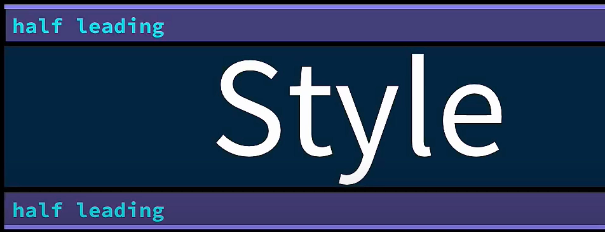

# Text & Font

## Generic Families

제네릭 패밀리는 여러 폰트들을 유사한 스타일로 묶는 일종의 분류체계로 안에 속한 폰트의 특정 속성을 지정해 줍니다.

### serif

serif에는 획의 삐짐이 있는 폰트 스타일을 가진 폰트들이 속합니다.

### sans-serif

sans-serif에는 획의 삐짐이 없는 폰트 스타일을 가진 폰트들이 속합니다.

### cursive

cursive에는 필기체 폰트 스타일을 가진 폰트들이 속합니다.

### monospace (Fixed-width)

monospace에는 각 글자의 너비가 동일한 스타일을 가진 폰트들이 속합니다.

### fantasy

fantasy에는 주로 특별한 제목이나 문장 강조에 사용되거나, 어떤 컨텐츠의 분위기를 강조하고자 할 때 활용되는 독특하고 화려한 디자인을 가진 폰트들이 속합니다.

## Font Families

구체적인 폰트들의 집합을 말합니다.

예를 들어 Georgia와 Times New Roman 둘 다 제네릭 패밀리의 일원으로 serif 패밀리지만 다른 폰트 패밀리이기에 둘 다 획의 삐짐은 있어도 서로 달라 보입니다.

다시 말해 각 제네릭 패밀리 안에 폰트 패밀리가 있는 겁니다.

## Browser Setting

웹사이트를 탐색하게 되면 브라우저가 웹사이트를 보여주는데 옵션에 따라 폰트가 달라질 수 있습니다.


### 첫 번째 옵션 (기본 동작)

폰트를 결정하는 기본 동작은 바로 브라우저가 결정하게 됩니다.

기본 동작이란 CSS 코드에서 폰트 패밀리를 지정하지 않으면 브라우저가 적용하는 기본 폰트를 선택하고 선택한 폰트 패밀리를 적용하는 것을 말합니다.

#### 글꼴 맞춤설정

브라우저에 의해 기본적으로 적용되는 '표준 글꼴'을 정할 수 있습니다.


### 두 번째 옵션 (제네릭 페밀리)

CSS 코드에 특정 제네릭 패밀리를 정의한 경우 우리가 브라우저 설정에서 정한 폰트 중 하나를 선택해 사용할 수 있습니다.

### 세 번째 옵션 (폰트 페밀리)

사용자의 브라우저에서 기본적으로 제공하지 않는 폰트를 사용하도록 CSS 코드에서 선택할 수 있으며 브라우저 설정의 직접적인 영향을 받지 않습니다.

#### 폰트 페밀리를 가져오는 방법

1. 로컬 사용자의 컴퓨터에 저장되어 있는 폰트 사용
   ex) fallback

2. 웹 폰트 사용
   ex) google fonts

3. 서버에 저장되어 있는 폰트 사용

## font-family

`font-family`를 선언할 때 폰트 패밀리 이름이 여러 어절이라면 큰따옴표가 필요합니다.

선언 패턴으로 가장 구체적인 것부터 쓰는데 폰트 패밀리 다음으로 제네릭 패밀리를 작성하게 됩니다.

```css
body {
  font-family: "Montserrat", sans-serif;
}
```

폰트 패밀리는 둘 이상일 경우 아래와 같이 작성을 하는데, 이렇게 되면 브라우저가 `Monserrat`를 찾게 됩니다.
`Monserrat` 폰트 패밀리를 적용하고 찾지 못할 경우 다음 폰트 패밀리인 `Verdana`로 넘어갑니다.
만약 `Verdana` 폰트 패밀리를 적용하고 찾지 못할 경우 `sans-serif` 제네릭 패밀리로 대체한 후 정의한 제네릭 패밀리에서 골라 폰트를 적용하게 됩니다.

```css
body {
  font-family: "Montserrat", "Verdana", sans-serif;
}
```

## fallback font

만약 웹 폰트를 추가하지 않고 폰트 패밀리만 추가하면 사용자의 기기에 해당 폰트 패밀리가 기본 혹은 어떻게든 설치되었거나 브라우저가 해당 폰트 패밀리를 인지해야 페이지가 표시됩니다.

문제점은 폰트 패밀리를 설치하게 만들거나 특정 브라우저를 사용하도록 사용자에게 강요할 수 없기 때문에 그 두 가지 요소를 제어하지 못합니다.

이때 사용 가능한 옵션이 있습니다.
[CSS Font Stack](https://www.cssfontstack.com/)에서 사용하려는 폰트 패밀리가 널리 사용되는지 알 수 있습니다.\
최고의 방법은 아니지만 해당 폰트가 Window와 Mac을 사용하는 유저의 로컬에 설치되어 있을 확률을 염두해서 사용한다면 원래 의도한 대로 웹 사이트가 표시될 확률도 높일 수 있습니다.

## font-face

웹페이지에서 사용할 폰트를 브라우저에게 알려주는 방법 중 하나입니다.\
웹 폰트를 사용하여 `font-weight`과 `font-style`을 변경하며 사용하고 싶은 해당 font-face를 모두 추가하여 불러와야합니다.

### font-weight

`font-weight`는 폰트의 굵기를 말하며 `100`에서 `900` 사이의 숫자로 이루어져있습니다.\
숫자가 클수록 폰트의 굵기가 두꺼워지며 `bold`는 `700`, `bolder`는 일반적으로 상속된 폰트보다 더 두꺼운 굵기를 뜻합니다.\
또한 `400`은 기준이 되는 굵기이며 `normal`과 같습니다.

### font-style

폰트의 스타일을 설정하는 CSS 속성입니다.\
이 속성을 사용하면 글꼴을 기울임체(italic), 진하게 표시(bold), 혹은 기본(normal) 스타일 등으로 지정할 수 있습니다.\
만약 웹 폰트의 font-face를 추가하지 않고 Italic을 사용한다면, 웹 폰트의 Italic 스타일이 아닌 브라우저가 웹 사이트에 Italic 스타일을 추가하게 됩니다.

### custom-font

고유 폰트를 웹사이트에 추가하여 사용할 수 있습니다.\
폰트 파일인 tts 파일을 사용할 폴더에 넣어준 다음 `@font-face`를 통해 css 파일에 불러오면 해당 폰트를 사용할 수 있습니다.

```css
@font-face {
  font-family: "AnonymousPro";
  src: url("anonymousPro-Regular.ttf") format("truetype");
}

@font-face {
  font-family: "AnonymousPro";
  src: url("anonymousPro-Bold.ttf") format("truetype");
  font-weight: 700;
}
```

### 폰트 포맷

`format()`은 브라우저에게 폰트 포맷에 대한 추가 정보를 주는 것입니다.

#### TrueType(.ttf)

- TrueType는 Apple과 Microsoft가 공동 개발한 글꼴 포맷으로, 다양한 운영 체제에서 지원됩니다.

- 폰트에 대한 정보와 디자인 데이터가 포함되어 있으며, 크기를 조절해도 깨지지 않고 선명하게 표시됩니다.

- 대부분의 운영 체제와 프로그램에서 지원하며, 인지도가 높고 가장 널리 쓰이는 기본 포맷입니다.
  인쇄 및 화면 디스플레이에 모두 적합합니다.

#### OpenType(.otf)

- OpenType은 Adobe와 Microsoft가 협력하여 개발한 글꼴 포맷으로, TrueType와 PostScript 기술을 결합한 것입니다.

- TrueType와 같이 크기를 조절해도 선명하게 표시되며, 다양한 글꼴 스타일과 다국어 문자를 지원합니다.

- 특수한 글꼴 기능을 제공하며, 웹 및 인쇄용으로 사용 가능합니다.

#### WebOpenType(.woff)

- 웹에서 사용하기 위해 개발된 폰트 포맷으로, 주로 웹사이트에서 사용됩니다.

- 압축된 트루타입 폰트나 오픈타입 폰트이며 파일 크기를 줄이고 다운로드 속도를 향상시키는데 중점을 둔 포맷입니다.

- 브라우저 호환성이 좋고, 웹사이트 속도와 퍼포먼스에 도움이 됩니다.

#### WebOpenType2(.woff2)

- WOFF보다 더 효율적인 압축 방식을 사용하여 폰트 파일 크기를 더 작게 만듭니다. 이는 웹페이지의 로딩 속도를 개선하고 사용자 경험을 향상시키는 데 도움이 됩니다.
  성능:

- 더 빠른 다운로드 시간과 적은 대역폭을 사용하여 웹사이트의 성능을 향상시킵니다. 특히 모바일 장치와 저속 연결에서 이점을 제공합니다.
  브라우저 호환성:

- 모든 구형 브라우저에서는 지원되지 않을 수 있으므로 폰트 호환성을 고려해야 합니다.

#### EmbeddedOpenType(.eot)

- 과거의 인터넷 익스플로러(IE) 브라우저에서 주로 사용되었습니다. IE 6부터 IE 8 등의 구형 브라우저에서 폰트 호환성을 유지하기 위해 EOT가 활용되었습니다.

- 글 작성 기준(24.01.06) IE만 유일하게 지원합니다.


#### 주의 사항

1. 여러 개의 폰트 페이스를 가져올 땐 서로 다른 폰트 페이스를 구분하는 기준이 되는 폰트 굵기를 반드시 추가해야 합니다.
   만약 추가하지 않을 경우 늘 마지막에 가져온 코드가 적용됩니다.

2. ttf 파일의 첫 글자를 소문자로 하지 않으면 Internet Explorer에서 오류가 발생할 수 있습니다.

## 기타 프로퍼티

### user-select

사용자가 텍스트를 선택할 수 있는지 지정합니다.

|        값        |                              설명                              |
| :--------------: | :------------------------------------------------------------: |
| `auto` (default) | 브라우저 허용시 텍스트를 더블클릭 혹은 드래그할 경우 선택 가능 |
|      `none`      |            텍스트 영역을 클릭 및 드래그로 선택 불가            |
|      `all`       |         단순 클릭 한 번만으로 텍스트 영역이 선택 가능          |
|      `text`      |         텍스트를 더블클릭 혹은 드래그할 경우 선택 가능         |

### text-decoration-line

#### 속성 값

텍스트에 사용되는 선 장식의 종류를 설정합니다.

|       값       |                                                    설명                                                    |
| :------------: | :--------------------------------------------------------------------------------------------------------: |
|     `none`     |                                  텍스트에 어떤 장식도 적용되지 않습니다.                                   |
|  `underline`   |                                        텍스트에 밑줄을 추가합니다.                                         |
|   `overline`   |                                         텍스트 위에 줄을 그립니다.                                         |
| `line-through` |                               텍스트 중앙을 가로지르는 취소선을 추가합니다.                                |
|    `blink`     | 깜박이는 효과를 주는 것으로, 브라우저의 지원은 제한적이며 사용을 권장하지 않습니다. (CSS3에서는 비표준 값) |

### font-variant

텍스트의 속성을 변경하는 데 사용됩니다.

### font-stretch

글꼴의 너비를 조절하는 데 사용됩니다.

### letter-spacing

글자 간격을 설정하는 값을 취하는데 픽셀(px) 또는 rem 단위를 사용합니다.

### white-space

텍스트 요소의 공백 처리 방식을 결정하는 데 사용됩니다.
텍스트의 줄 바꿈, 공백, 탭 등을 어떻게 다룰지를 제어합니다.

#### `normal` (기본 값)

- html 텍스트의 연속 공백을 하나로 합칩니다.\
  (두 칸이상 연속으로 띄어쓰기를 하거나 들여쓰기를 하는 것도 불가능)

- 개행(줄바꿈) 문자도 다른 공백 문자와 동일하게 처리합니다.\
  (`&nbsp;`와 같은 HTML 엔티티(entity)를 쓰는 편법을 동원하지 않는 이상 줄바꿈 문자를 이용해서 원하는 위치에서 수동으로 줄바꿈을 할 수 있는 방법은 없음)

- 한 줄이 너무 길어서 부모 요소의 가로폭을 넘칠 경우 자동으로 줄을 바꿉니다.

```html
<p>
  값은 다음과 같은 의미를 갖으며, 이는 공백 처리 및 줄바꿈 규칙에 따라
  구현됩니다. This is some text. This is some text.
</p>
```


#### `nowrap`

- html 텍스트의 연속 공백을 하나로 합칩니다.
  ( 연속된 띄어쓰기, 들여쓰기 그리고 줄바꿈 문자를 모두 무시하고 띄어쓰기 한 번으로 처리)

- 줄 바꿈은 `<br>` 요소에서만 일어납니다.
  (부모 요소 안의 가로폭을 넘어가더라도 자동으로 줄바꿈이 일어나지 않음)

```html
<p>
  값은 다음과 같은 의미를 갖으며, 이는 공백 처리 및 줄바꿈 규칙에 따라
  구현됩니다. This is some text. This is some text.
</p>
```


#### `pre`

- html 텍스트의 연속 공백 유지합니다.\
  (연속된 띄어쓰기와 들여쓰기, 줄바꿈이 있는 그대로 유지)

```html
<p>
  값은 다음과 같은 의미를 갖으며, 이는 공백 처리 및 줄바꿈 규칙에 따라
  구현됩니다. This is some text. This is some text.
</p>
```


#### `pre-wrap`

- html 텍스트의 연속 공백 유지합니다.\
  (연속된 띄어쓰기와 들여쓰기, 줄바꿈이 있는 그대로 유지)

- 줄바꿈은 개행 문자와 `<br>` 요소에서 일어나며, 텍스트 안에 긴 행이 있을 때 해당 행에서 자동으로 줄바꿈이 일어납니다.

```html
<p>
  값은 다음과 같은 의미를 갖으며, 이는 공백 처리 및 줄바꿈 규칙에 따라
  구현됩니다. This is some text. This is some text.
</p>
```


#### `pre-line`

- html 텍스트의 연속 공백을 하나로 합칩니다.\
  (연속된 띄어쓰기와 들여쓰기는 무시하고 모두 띄어쓰기 한 번으로 처리)

- 줄 바꿈은 개행 문자와 `<br>` 요소에서 일어나며, 텍스트 안에 긴 행이 있을 때 해당 행에서 자동으로 줄바꿈이 일어납니다.

```html
<p>
  값은 다음과 같은 의미를 갖으며, 이는 공백 처리 및 줄바꿈 규칙에 따라
  구현됩니다. This is some text. This is some text.
</p>
```


#### `break-spaces`

이 값은 다음을 제외하고는 pre-wrap과 동일합니다.

- 연속되는 공백이 텍스트의 콘텐츠 박스의 끝에 있더라도 하나로 합쳐지지 않습니다. 즉, 연속되는 공백이 공간을 차지합니다.

- 하지만, 연속되는 공백이 공간을 차지한다고 하더라도 콘텐츠 박스의 끝 경계를 오버플로(overflow, 경계를 넘어섬)하지 않습니다.\
  그렇기 때문에 콘텐츠 박스 고유의 크기(min-content의 크기나 max-content의 크기)에 영향을 줍니다.

- 연속되는 공백의 사이나 끝에서도 자동으로 줄바꿈할 기회가 주어질 수 있습니다.

```html
<p>
  값은 다음과 같은 의미를 갖으며, 이는 공백 처리 및 줄바꿈 규칙에 따라
  구현됩니다. This is some text. This is some text.
</p>
```


#### white-space 속성 값의 구현을 정리한 표

|      \       | Enter | Space, Tab | 텍스트 자동 줄바꿈 | 줄 끝의 공백 |
| :----------: | :---: | :--------: | :----------------: | :----------: |
|    normal    | 합침  |    합침    |         예         |     제거     |
|    nowrap    | 합침  |    합침    |       아니오       |     제거     |
|     pre      | 보존  |    보존    |       아니오       |     보존     |
|   pre-wrap   | 보존  |    보존    |         예         |     걸림     |
|   pre-line   | 보존  |    합침    |         예         |     제거     |
| break-spaces | 보존  |    보존    |         예         | 자동 줄바꿈  |

### line-height

한 줄의 텍스트가 차지하는 높이를 조절하는 데 사용됩니다.\
콘텐츠 박스에서 위아래 공간의 크기를 결정하는 것입니다.\
(`line-height`는 `font-size` + leading 영역)



단위 값으로는 `px`, `em`, `%`(비추), 배수(추천) 등과 같은 길이 단위를 사용하여 특정 크기로 지정하며 숫자만 입력할 경우 현재 폰트 크기에 대한 배수로, 상대적인 값을 나타냅니다.

단, 퍼센트 값은 요소 자체의 폰트 크기를 기준으로 하지 않고 부모에게서 상속한 폰트 크기를 기준으로 하기도 해서 예상치 못한 결과가 나올 수 있기 때문에 퍼센트 값은 사용하지 않는 것이 좋습니다.

`line-height` 프로퍼티는 기본적으로 사용하는 폰트 패밀리의 영향을 받습니다


(위의 이미지에서 `line-height`는 `19px`)

`line-height`의 기본 값은 normal이며 폰트 종류에 따라 수치가 달라집니다.\
따라서 일반적으로는 normal보다는 고정적인 값을 지정하게됩니다.


`line-height`가 커지면 leading 영역이 균등하게 커지며, `line-height`가 1이 되면 `font-size`와 `line-height`가 일치하게 됩니다.


`line-height`가 1일 때 font의 종류에 따라 해당 영역보다 큰 경우가 있습니다.\
이 부분은 font를 만들 때 정해진 것이기 때문에 컨트롤하기 힘들며 경우에 따라서 font가 중앙에 놓이지 않아 보일 수 있습니다.


### text-decoration

밑줄, 윗줄, 취소선을 텍스트에 추가할 수 있고 선 모양과 색깔, 두께도 바꿀 수 있습니다.

#### line

- `none`
  : 기본값으로, 텍스트 장식을 제거합니다.

- `underline`
  : 텍스트에 밑줄을 추가합니다.

- `overline`
  : 텍스트 위에 선을 추가합니다.

- `line-through`
  : 텍스트 중간에 취소선을 추가합니다.

- `blink`
  : 깜빡이는 텍스트 효과를 주는데 사용되지만, 대부분의 브라우저에서는 지원되지 않습니다.

#### style

- `dotted`
  : 점선으로 텍스트를 장식합니다.

- `dashed`
  : 대시선(점선)으로 텍스트를 장식합니다.

- `solid`
  : 실선으로 텍스트를 장식합니다.

- `double`
  : 이중선으로 텍스트를 장식합니다.

- `wavy`
  : 파동선으로 텍스트를 장식합니다.

#### color

#### thickness

- `auto`
  : 브라우저가 기본값으로 자동 설정합니다.

- `from-font`
  : 폰트의 선 굵기 값에서 계산된 값을 사용합니다.

- `length`
  : 특정 길이 값을 지정하여 텍스트 장식의 두께를 설정합니다. 예를 들어, px, em, % 등의 단위를 사용할 수 있습니다.

### text-shadow

텍스트에 그림자 효과를 추가하는 데 사용됩니다.

```css
text-shadow: h-shadow v-shadow blur-radius color;
```

- `h-shadow`
  : 그림자의 수평 위치를 나타내는 값입니다.
  x축에 대한 오프셋(offset)

- `v-shadow`
  : 그림자의 수직 위치를 나타내는 값입니다.
  y축에 대한 오프셋(offset)

- `blur-radius`
  : 그림자의 흐림 정도를 나타내는 값으로, 선택적입니다. 이 값이 없으면 그림자는 날카로워집니다.

- `color`
  : 그림자의 색상을 지정하는 값입니다.

### font shorthand

폰트 관련된 여러 속성을 한 줄로 축약하여 설정하는 방법입니다.

```css
selector {
  font: font-style font-variant font-weight font-size/line-height font-family;
}
```

속성은 모두 선택적이며 순서를 지키고 해당하는 값만 쓰면 됩니다.
`font-size/line-height`는 `/`를 기준으로 구분하여 사용합니다.

### font-display

CSS @font-face 규칙에 사용되는 속성 중 하나로, 웹 폰트가 로드될 때의 동작을 지정하는 데 사용됩니다.

#### 차단 기간(block-period)

폰트 로딩이 진행되는 과정을 말합니다.\
차단 기간 동안 텍스트가 나타나는 공간은 화면에 나타나지 않는 대안(fallback) 폰트 페이스가 차지합니다.\
폰트 페이스는 화면엔 나타나지 않지만 공간은 차지하기 때문에 텍스트만 보이지 않고 웹사이트의 기본적인 구조나 스타일링은 그대로입니다.

#### 교체 기간(swap-period)

폰트 로딩이 진행되는 과정을 말합니다.\
차단 기간에서 사용자가 웹사이트를 둘러보기 시작하면 대안 폰트가 등장합니다.\
그다음 교체 기간으로 넘어가는데요, 이때 브라우저가 대안 폰트의 스타일을 실제로 우리가 설정한 폰트 스타일로 바꾸는 기간을 말합니다.


- `auto`
  : 폰트 로딩에 필요한 모든 결정권을 브라우저에 주며 브라우저가 자동으로 최적의 표시 방법을 선택합니다.\
  방문한 사용자의 브라우저가 기본값으로 폰트를 최대한 빨리 표시하는 방식으로 동작합니다.\
  현재 대부분의 브라우저는 block을 선택합니다.

- `swap`
  : 차단 기간이 발생하지 않으며 교체 기간이 무한합니다.\
  교체 기간에서 웹 폰트가 사용 가능할 때까지 기본 폰트로 대체된 후, 웹 폰트가 로드되면 대체 폰트로 교체됩니다.\
  사용자는 폰트 로딩이 끝나기 전에 콘텐츠를 볼 수 있지만, FOIT 현상이 발생할 수 있습니다.

- `block`
  : 짧은 차단 기간을 갖으며 웹 폰트 로딩이 지연되면 텍스트는 없지만 플레이스 홀더가 공간을 차지하며 렌더링이 끝날 때까지 표시되지 않습니다.\
  즉, 화면에 보이지 않는 폰트를 불러옵니다.\
  교체 기간에는 swap과 같이 대안 폰트를 불러오고 브라우저는 대안 폰트를 우리가 만든 사용자 지정 폰트로 바꿉니다.\
  FOIT (Flash of Invisible Text)가 발생할 수 있습니다.

- `fallback`
  : 매우 짧은 차단 기간을 갖으며 `block`과 같이 화면에 보이지 않는 폰트를 불러옵니다.\
  짧은 교체 기간이 갖으며 짧은 시간 동안 브라우저는 사용자 지정 폰트를 불러오고 폰트를 대안 폰트로 바꿉니다.\
  브라우저가 짧은 교체 기간 동안 작업을 완료한다면 해당 폰트를 사용자 지정 폰트로 바꿀 수 있지만 그게 아니라면 계속 대안 폰트가 나타나게 됩니다.

- `optional`
  : 매우 짧은 차단 기간을 갖으며 교체 기간이 발생하지 않습니다.\
  값은 사용 가능한 경우에만 폰트를 로드하도록 브라우저에 지시합니다.\
  만약 브라우저가 폰트를 캐시에 저장하고 있다면 다시 다운로드하지 않고 기존에 캐시된 폰트를 사용합니다.\
  그러나 캐시에 없는 경우에는 로드하지 않고 기본 폰트로 대체합니다.\
  또한 게다가 인터넷의 연결 속도에 따라 달라집니다.\
  브라우저가 인터넷 연결 속도가 빠르다고 판단하면 사용자 지정 폰트를 즉시 불러오지만 속도가 느려서 연결 상태가 좋지 않으면 브라우저는 대안 폰트를 사용하고 사용자 지정 폰트는 불러오지 않습니다.\
  페이지를 새로 고침 할 때만 상황을 바꿀 수 있습니다.

## 참고

- [[ㄹ] 라인하이트 line height | 코딩가나다 | 빔캠프](https://www.youtube.com/watch?v=SDa7f8os2WA)
- [CSS - The Complete Guide 2024 (incl. Flexbox, Grid & Sass)](https://www.udemy.com/course/css-flexbox-grid-sass/)
- [CSS white-space 속성 – 올바른 이해와 사용 방법](https://codingeverybody.kr/css-white-space-%EC%86%8D%EC%84%B1-%EC%98%AC%EB%B0%94%EB%A5%B8-%EC%9D%B4%ED%95%B4%EC%99%80-%EC%82%AC%EC%9A%A9-%EB%B0%A9%EB%B2%95/)
