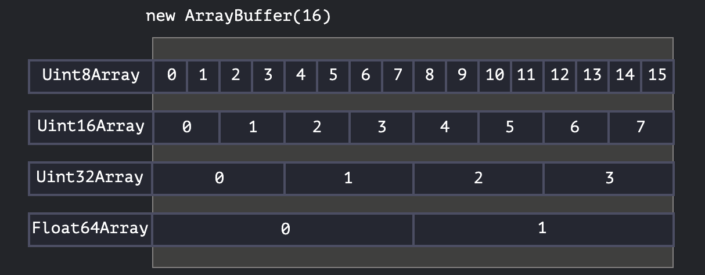
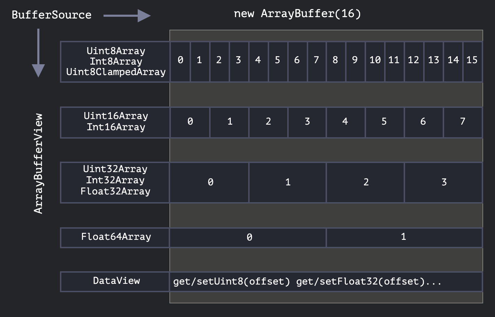

# ArrayBuffer, binary arrays

JavaScript에서 이진 데이터를 다룰 수 있도록 해주는 객체입니다.\
웹 개발에서 이진 데이터를 주로 다루는 상황은 네트워크에서 전송되는 이진 데이터를 처리할 때(파일 생성, 업로드, 다운로드)와 관련된 경우가 많습니다.

또 다른 일반적인 사례는 이미지 처리입니다.\
파일 시스템에서 이진 데이터를 읽고 쓸 때, 숫자, 문자, 이미지 데이터처럼 메모리에 저장된 원시 데이터(raw data)를 효율적으로 처리할 수 있습니다.\
이러한 작업들은 모두 JavaScript에서 가능하며, 이진 데이터를 다루는 작업은 매우 빠르게 처리됩니다.

즉, 고정된 크기의 바이트 배열을 나타내며, 메모리의 특정 크기만큼의 공간을 예약해 둔 것이며, 이 공간을 사용하여 다양한 형식의 이진 데이터를 저장하고 조작할 수 있습니다.

다만 혼란스러울 수 있는 부분은 여러 클래스들이 존재하기 때문입니다.\
예를 들면:

- `ArrayBuffer`, `Uint8Array`, `DataView`, `Blob`, `File` 등이 있습니다.

JavaScript에서 이진 데이터는 다른 언어들과는 다소 다른 방식으로 구현되어 있지만, 구조를 이해하고 나면 꽤 간단합니다.

이진 데이터를 다루는 기본 객체는 `ArrayBuffer`입니다. 이것은 고정된 길이의 연속된 메모리 공간을 참조하는 객체입니다.

다음과 같이 `ArrayBuffer`를 생성할 수 있습니다:

```js
let buffer = new ArrayBuffer(4); // 길이가 4인 버퍼 생성
alert(buffer.byteLength); // 4
```

ArrayBuffer는 바이트 단위로 데이터를 저장합니다.\
1바이트는 8비트이고, 각 바이트에는 0~255 사이의 값을 저장할 수 있습니다.

이 코드는 16바이트 크기의 연속된 메모리 공간을 할당하고, 그 공간을 0으로 초기화합니다.

1bit는 2가지 경우의수 (0과 1)룰 가지고 2bits는 4가지 경우의 수(2 \* 2)를 가집니다.

1byte는 8bits이므로 256가지의 경우의 수(2**⁸**)를 갖습니다.

즉 1byte는 0에서 255의 정수를 구현할 수 있습니다.

예시에서는 0~255 정수를 구현할 수 있는 공간 4개를 갖습니다.

```jsx
[ 00000000 ] [ 00000000 ] [ 00000000 ] [ 00000000 ]
   바이트1        바이트2       바이트3        바이트4
     ↑             ↑           ↑            ↑
   8비트          8비트         8비트         8비트
```

## 기본 개념: `ArrayBuffer`는 배열이 아니다

혼동을 피하기 위해서, `ArrayBuffer`는 일반적인 배열과는 다르다는 점을 강조할 필요가 있습니다:

- 길이가 고정되어 있으며, 한 번 크기가 정해지면 크기를 변경할 수 없습니다.\
  `ArrayBuffer`는 생성할 때 미리 크기를 정해야 합니다.

- 메모리에서 해당 크기만큼 정확히 공간을 차지합니다.

- 개별 바이트에 접근하려면 buffer[index]로 접근할 수 없고, 뷰(view) 객체를 사용해야 합니다.

`ArrayBuffer` 자체는 단지 메모리 공간일 뿐입니다.\
그 안에 어떤 데이터가 있는지에 대한 정보는 없습니다.\
단순히 연속된 바이트들의 집합일 뿐입니다.

### 뷰 객체

`ArrayBuffer`의 내용을 데이터를 읽고 쓰려면 뷰 객체(`TypedArray`)를 사용해야 합니다.\
뷰 객체는 `ArrayBuffer`에 저장된 데이터를 특정 형식으로 해석해주는 역할을 합니다.\
뷰 자체는 데이터를 저장하지 않으며, `ArrayBuffer`에 저장된 데이터를 "해석하는 도구"라고 생각할 수 있습니다.

예를 들어:

- `Uint8Array`는 `ArrayBuffer`의 각 바이트를 0에서 255 사이의 숫자로 해석합니다.\
  이 값은 8비트 부호 없는 정수(Unsigned Integer)입니다.
- `Uint16Array`는 2바이트씩 묶어서 0에서 65535 사이의 숫자로 해석합니다. 이것은 16비트 부호 없는 정수입니다.
- `Uint32Array`는 4바이트씩 묶어서 0에서 4294967295 사이의 숫자로 해석합니다. 이것은 32비트 부호 없는 정수입니다.
- `Float64Array`는 8바이트씩 묶어서 부동소수점 숫자로 해석합니다. 부동소수점 값은 매우 높은 정밀도를 가집니다.

따라서 16바이트의 `ArrayBuffer`는 16개의 작은 숫자로 해석할 수도 있고, 2바이트씩 묶어 8개의 큰 숫자로, 4바이트씩 묶어 4개의 더 큰 숫자로, 또는 8바이트씩 묶어 2개의 매우 정밀한 부동소수점 값으로 해석할 수 있습니다.



### Uint8Array

- `1 byte = 8 bits`
- 표현 가능한 경우의 수 = `2^8 = 256`
- **저장 가능한 값: `0 ~ 255`**

```jsx
let buffer = new ArrayBuffer(4); // 4바이트 메모리 공간
let view = new Uint8Array(buffer); // 1바이트씩 해석하는 view

console.log(view.length); // 4
console.log(view[0]); // 0
console.log(view[1]); // 0
console.log(view[2]); // 0
console.log(view[3]); // 0

view[0] = 42;
view[1] = 255;
view[3] = 10;

console.log(view[0]); // 42
console.log(view[1]); // 255
console.log(view[2]); // 0    ← 값 안 넣었으니 그대로
console.log(view[3]); // 10
```

### Uint16Array

- 2 bytes = 16 bits
- 표현 가능한 경우의 수 = `2^16 = 65,536`
- 저장 가능한 값: `0 ~ 65535`

```jsx
let buffer = new ArrayBuffer(4); // 4바이트 메모리 공간
let view16 = new Uint16Array(buffer); // 2바이트씩 해석하는 view

console.log(view16.length); // 2
console.log(view16[0]); // 0
console.log(view16[1]); // 0

view16[0] = 1;
view16[1] = 65535;

console.log(view16[0]); // 1
console.log(view16[1]); // 65535
```

### Uint32Array

- `4 bytes = 32 bits`
- 표현 가능한 경우의 수 = `2^32 = 4,294,967,296`
- **저장 가능한 값: `0 ~ 4,294,967,295`**

```jsx
let buffer = new ArrayBuffer(8); // 8바이트 메모리 공간
let view32 = new Uint32Array(buffer); // 4바이트씩 해석하는 view

console.log(view32.length); // 2
console.log(view32[0]); // 0
console.log(view32[1]); // 0

view32[0] = 1;
view32[1] = 4294967295;

console.log(view32[0]); // 1
console.log(view32[1]); // 4294967295
```

- 각 값은 **4바이트(32비트)**를 차지하고,
- `ArrayBuffer(8)`은 총 8바이트 → `Uint32Array`로 보면 **두 칸**

### Float64Array

- `8 bytes = 64 bits`
- 표현 가능한 값: IEEE 754 부동소수점 수
  (대략 `±5.0 × 10⁻³²⁴ ~ ±1.8 × 10³⁰⁸`)
- **저장 가능한 값: 아주 큰/작은 실수**

```jsx
let buffer = new ArrayBuffer(8); // 8바이트 메모리 공간
let viewF64 = new Float64Array(buffer); // 8바이트씩 해석하는 view

console.log(viewF64.length); // 1
console.log(viewF64[0]); // 0

viewF64[0] = 3.14159265358979;

console.log(viewF64[0]); // 3.14159265358979
```

- `Float64Array`는 **실수 1개 = 8바이트**로 해석하므로,
- 8바이트 buffer에 단 **1개 값만 저장** 가능

### `ArrayBuffer`는 이진 데이터의 기본 객체

`ArrayBuffer`는 모든 이진 데이터를 다룰 때의 기본 객체입니다.\
하지만 그 안에 데이터를 쓰거나, 데이터를 읽기 위해서는 반드시 뷰를 사용해야 합니다.

예를 들어:

```js
let buffer = new ArrayBuffer(16); // 길이가 16인 버퍼 생성

let view = new Uint32Array(buffer); // 버퍼를 32비트 정수 배열로 해석

alert(Uint32Array.BYTES_PER_ELEMENT); // 각 정수는 4바이트를 사용
alert(view.length); // 4, 정수 4개를 저장할 수 있음
alert(view.byteLength); // 16, 바이트 단위 크기는 16

// 값을 쓰기
view[0] = 123456;

// 값을 순회
for (let num of view) {
  alert(num); // 123456, 그 다음은 0, 0, 0 (총 4개의 값)
}

console.log(view[0]); // 123456 출력
```

이 예제에서, `ArrayBuffer`는 16바이트의 메모리 공간을 할당합니다.\
그 공간은 `Uint32Array` 뷰를 통해 32비트(4바이트) 단위로 해석됩니다.\
이를 통해 데이터를 저장하고 읽을 수 있습니다.

## TypedArray

모든 뷰(`Uint8Array`, `Uint32Array` 등)를 통칭하는 일반적인 용어는 TypedArray입니다.\
이들은 동일한 메서드와 속성 세트를 공유합니다.

> 주의: `TypedArray`라는 생성자는 없으며, `Int8Array`, `Uint8Array` 등 `ArrayBuffer`에 대한 뷰를 나타내는 일반적인 "우산" 용어일 뿐입니다.\
> `new TypedArray`와 같은 표현을 보게 되면, 이는 `new Int8Array`, `new Uint8Array` 등과 동일하다는 의미입니다.

Typed array는 일반 배열처럼 인덱스를 가지며 반복 가능한 iterable 속성을 가집니다.

Typed array 생성자(예: `Int8Array` 또는 `Float64Array` 등)는 인수의 유형에 따라 다르게 동작합니다.

### TypedArray가 왜 필요할까?

- 자바스크립트의 일반 배열(`Array`)은 유연하지만, **바이너리 처리에는 부적합**
- 이미지, 오디오, 비디오, 파일 등은 **정확한 비트/바이트 단위의 숫자 조작**이 필요함
- `TypedArray`는 **고정 크기 숫자 배열**로 크기를 바꿀 수 없고, 숫자만 다루기 때문에 일반 배열보다 **빠르고 정밀한 바이너리 처리**가 가능
- **배열 메서드 사용 가능**: `map`, `forEach`, `filter`, `slice`, `reduce`
  (단, `push`, `pop`, `splice`, `concat` 처럼 길이 변경 메서드는 사용 불가)

### TypedArray 종류

| TypedArray 타입     | 바이트 수 | 설명                     | 값 범위                    |
| ------------------- | --------- | ------------------------ | -------------------------- |
| `Int8Array`         | 1         | 부호 있는 8비트 정수     | -128 ~ 127                 |
| `Uint8Array`        | 1         | 부호 없는 8비트 정수     | 0 ~ 255                    |
| `Uint8ClampedArray` | 1         | 0~255 범위 제한 배열     | 0 ~ 255 (값이 넘치면 잘림) |
| `Int16Array`        | 2         | 부호 있는 16비트 정수    | -32,768 ~ 32,767           |
| `Uint16Array`       | 2         | 부호 없는 16비트 정수    | 0 ~ 65,535                 |
| `Int32Array`        | 4         | 부호 있는 32비트 정수    | -2³¹ ~ 2³¹-1               |
| `Uint32Array`       | 4         | 부호 없는 32비트 정수    | 0 ~ 4,294,967,295          |
| `Float32Array`      | 4         | 32비트 부동소수점 (실수) | ±1.2×10⁻³⁸ ~ ±3.4×10³⁸     |
| `Float64Array`      | 8         | 64비트 부동소수점 (실수) | ±5.0×10⁻³²⁴ ~ ±1.8×10³⁰⁸   |

### TypedArray 생성 방법 (5가지)

```js
// 1. 빈 버퍼 위에 뷰 만들기
new TypedArray(buffer, [byteOffset], [length]);
// buffer: 바라볼 ArrayBuffer
// byteOffset: 시작 위치 (바이트 단위) — 기본값 0
// length: 요소 개수 — 기본값: 가능한 한 끝까지

// 2. 일반 배열로부터 생성
new TypedArray(object);

// 3. 기존 TypedArray 복사
new TypedArray(typedArray);

// 4. 길이만 지정 (0으로 채워짐)
new TypedArray(length);

// 5. 아무 인자 없이 (빈 배열)
new TypedArray();
```

1. `ArrayBuffer` 인자가 주어지면, 해당 버퍼 위에 view를 생성합니다.

   선택적으로 `byteOffset`과 `length`를 지정해 버퍼의 일부만 view로 지정할 수 있습니다.

   ```jsx
   // 예제 1: 전체 버퍼를 해석
   let buffer = new ArrayBuffer(8); // 8바이트 메모리
   let view = new Uint16Array(buffer); // 2바이트씩 해석 → 4개 요소

   console.log(view.length); // 4

   // 예제 2: 버퍼의 일부만 view로 지정
   let buffer = new ArrayBuffer(8); // 8바이트
   let view = new Uint16Array(buffer, 2, 2);
   // byteOffset = 2 → 2바이트 지점부터 시작
   // length = 2 → 요소 2개

   // 0~7 바이트 중 2~3, 4~5 바이트 사용한다는 의미
   ```

2. `Array` 또는 array-like 객체를 주면, 동일한 길이의 TypedArray를 만들고 값을 복사합니다.

   ```jsx
   let arr = new Uint8Array([10, 20, 30, 255]);
   alert(arr.length); // 4
   console.log(arr[1]); // 20
   ```

3. 다른 TypedArray를 주면, 길이만큼 새로 생성하고 값을 복사하며, 타입이 달라지면 적절히 변환합니다.

   ```jsx
   let arr16 = new Uint16Array([1, 1000]);
   let arr8 = new Uint8Array(arr16);
   alert(arr8[0]); // 1
   alert(arr8[1]); // 232 (1000은 8비트에 담을 수 없으므로 잘림, 1000 % 256 === 232)
   ```

4. 숫자를 인자로 주면, 해당 길이의 TypedArray를 생성합니다.

   byte 길이는 `length × TypedArray.BYTES_PER_ELEMENT`입니다.

   **(`.BYTES_PER_ELEMENT`는 타입당 요소 하나가 차지하는 바이트 수**를 알려주는 정적 속성)

   ````jsx
   let arr = new Uint16Array(4);
   alert(Uint16Array.BYTES_PER_ELEMENT); // 2
   alert(arr.byteLength); // 8
   ```ㄴ

   ````

5. 인수 없이 호출하면, 길이가 0인 typed array가 생성됩니다.

`ArrayBuffer`를 언급하지 않고도 `TypedArray`를 생성할 수 있습니다.\
하지만 뷰는 항상 기본이 되는 `ArrayBuffer` 없이 존재할 수 없으므로, 인수가 제공되지 않은 경우를 제외하고 모든 경우에 자동으로 생성됩니다.

`ArrayBuffer`에 접근하기 위해 사용할 수 있는 속성은 다음과 같습니다:

- `arr.buffer` – `ArrayBuffer`를 참조합니다.

- `arr.byteLength` – `ArrayBuffer`의 길이를 나타냅니다.

따라서 우리는 항상 한 뷰에서 다른 뷰로 이동할 수 있습니다:

```js
let arr8 = new Uint8Array([0, 1, 2, 3]);

// 같은 데이터에 대한 또 다른 뷰
let arr16 = new Uint16Array(arr8.buffer);
```

다음은 typed array의 목록입니다:

- `Uint8Array`, `Uint16Array`, `Uint32Array` – 각각 8비트, 16비트, 32비트 정수에 해당합니다.
  - `Uint8ClampedArray` – 8비트 정수를 위한 것으로, 할당 시 "클램프" 처리합니다(아래 참조).
- `Int8Array`, `Int16Array`, `Int32Array` – 부호가 있는 정수 숫자(음수 가능)에 해당합니다.
- `Float32Array`, `Float64Array` – 각각 32비트 및 64비트의 부동소수점 숫자입니다.

### 단일 값 타입이 없는 점

`Int8Array`와 같은 이름이 있음에도 불구하고, JavaScript에는 `int` 또는 `int8`과 같은 단일 값 타입은 존재하지 않습니다.\
이는 `Int8Array`가 이러한 개별 값을 저장하는 배열이 아니라, 오히려 `ArrayBuffer`에 대한 뷰이기 때문입니다.

## Out-of-bounds behavior

타입 배열에 범위를 초과하는 값을 쓰려고 시도하면 어떻게 될까요?\
TypedArray는 **넘치는 값(overflow)**을 자동으로 자르고(truncate) 저장합니다.

**에러가 발생하지 않아요.**

예를 들어, `Uint8Array`에 256을 넣어보겠습니다.\
이진 형식으로 256은 100000000 (9비트)이지만, `Uint8Array`는 각 값당 8비트만 제공하므로 유효 범위는 0에서 255까지입니다.

더 큰 숫자의 경우, 가장 오른쪽(덜 중요한) 8비트만 저장되고 나머지는 잘립니다.\
따라서 우리는 0을 얻게 됩니다.

257의 경우, 이진 형식은 `100000001` (9비트)로, 가장 오른쪽 8비트가 저장되므로 배열에는 1이 들어갑니다.\
즉, 숫자는 2<sup>8</sup>로 나눈 나머지가 저장됩니다.

다음은 그 예시입니다:

```js
let uint8array = new Uint8Array(16);

let num = 256;
alert(num.toString(2)); // 100000000 (이진 표현)

uint8array[0] = 256;
uint8array[1] = 257;

alert(uint8array[0]); // 0
alert(uint8array[1]); // 1
```

`Uint8ClampedArray`는 이 점에서 특별하며, 그 동작이 다릅니다.\
255보다 큰 숫자에 대해서는 항상 255를 저장하고, 음수에 대해서는 0을 저장합니다.\
이러한 동작은 이미지 처리에 유용합니다.

## TypedArray methods

TypedArray는 일반 배열 메서드를 대부분 지원합니다: `map`, `slice`, `find`, `reduce` ...

반복(iterate), `map`, `slice`, `find`, `reduce` 등을 사용할 수 있습니다.

하지만 다음 두 메서드는 없습니다:

- `splice`는 메모리가 고정되어 있기 때문에 값을 삭제할 수 없습니다.
  값을 "삭제"할 수 없는데, 이는 타입 배열이 버퍼에 대한 뷰(view)이며, 이러한 버퍼는 고정적이고 연속적인 메모리 영역이기 때문입니다.\
  우리가 할 수 있는 것은 0으로 할당하는 것뿐입니다.

- `concat` 배열 병합은 지원하지 않습니다.

두 가지 추가 메서드가 있습니다.

- `arr.set(fromArr, [offset])`: `fromArr`의 모든 요소를 `arr`에 복사하며, 시작 위치는 `offset`에서 시작합니다 (기본값은 0).

- `arr.subarray([begin, end])`: 시작부터 끝까지(미포함) 같은 유형의 새로운 뷰를 생성합니다.\
  이는 `slice` 메서드와 유사하지만, 아무것도 복사하지 않고 단지 주어진 데이터 조각에서 작업할 새로운 뷰를 생성합니다.

이러한 메서드는 타입 배열을 복사하고, 혼합하며, 기존 배열로부터 새로운 배열을 만드는 등의 작업을 가능하게 합니다.

## DataView

`DataView`는 `ArrayBuffer`에 대한 특별하고 매우 유연한 "untyped" 뷰입니다.\
이를 통해 어떤 오프셋에서든지 어떤 형식으로든 데이터를 접근할 수 있습니다.

타입 배열에서는 생성자가 형식을 결정합니다.\
전체 배열은 균일해야 합니다.

- `i`번째 숫자는 `arr[i]`로 접근합니다.

- 그러나 `DataView`를 사용하면 `.getUint8(i)` 또는 `.getUint16(i)`와 같은 메서드로 데이터에 접근합니다.\
  생성 시점이 아닌 메서드 호출 시점에 형식을 선택합니다.

구문은 다음과 같습니다:

```js
new DataView(buffer, [byteOffset], [byteLength]);
```

- `buffer`: 기본 `ArrayBuffer`.\
  타입 배열과 달리 `DataView`는 자체적으로 버퍼를 생성하지 않습니다.\
  미리 준비되어 있어야 합니다.

- `byteOffset`: 뷰의 시작 바이트 위치(기본값은 0). 어디서부터 읽을지.

- `byteLength`: 뷰의 바이트 길이(기본값은 `buffer`의 끝까지). 몇 바이트까지 읽을지.

예를 들어, 같은 버퍼에서 서로 다른 형식의 숫자를 추출하는 예는 다음과 같습니다:

```js
// 모든 값이 최대값 255인 4바이트의 이진 배열
let buffer = new Uint8Array([255, 255, 255, 255]).buffer;

let dataView = new DataView(buffer);

// 오프셋 0에서 8비트 숫자 가져오기
alert(dataView.getUint8(0)); // 255

// 이제 오프셋 0에서 16비트 숫자를 가져오면 2바이트로 구성되어 65535로 해석됩니다.
alert(dataView.getUint16(0)); // 65535 (가장 큰 16비트 부호 없는 정수)

// 오프셋 0에서 32비트 숫자 가져오기
alert(dataView.getUint32(0)); // 4294967295 (가장 큰 32비트 부호 없는 정수)

dataView.setUint32(0, 0); // 4바이트 숫자를 0으로 설정하여 모든 바이트를 0으로 설정합니다.
```

`DataView`는 동일한 버퍼에 혼합 형식 데이터를 저장할 때 유용합니다.\
예를 들어, (16비트 정수, 32비트 부동소수점) 쌍의 시퀀스를 저장할 때 `DataView`를 사용하면 쉽게 접근할 수 있습니다.

### 왜 필요한가요?

`TypedArray`는 아래처럼 **타입이 고정**돼요

```jsx
let view = new Uint16Array(buffer); // 무조건 2바이트 단위 정수로만 해석
```

하지만 어떤 경우에는...

- **1바이트짜리 정수**
- **2바이트짜리 정수**
- **4바이트짜리 실수**
  이런 다양한 타입을 **한 메모리 공간에서 섞어서** 써야 할 때가 있어요
  (예: 바이너리 파일 포맷, 네트워크 프로토콜 등).

이럴 때는 `DataView`를 써야 합니다.

- 바이너리 파일 포맷 분석 (예: PNG, MP3, PDF 등)
- 네트워크 데이터 수신/전송 (정해진 바이트 포맷으로 구성됨)
- 다양한 타입이 **한 버퍼에 혼합되어 있을 때**

```jsx
// 예: [2바이트 정수, 4바이트 실수] 구조일 때
let view = new DataView(buffer);
let id = view.getUint16(0); // 0~1
let score = view.getFloat32(2); // 2~5
```

### DataView 문법

```jsx
new DataView(buffer, [byteOffset], [byteLength]);
```

- `buffer`: 기반이 되는 `ArrayBuffer`
- `byteOffset`: 어디서부터 읽을지 (기본값: 0)
- `byteLength`: 몇 바이트까지 읽을지 (기본값: 끝까지)

#### DataView 읽기/쓰기 메서드

| 메서드 이름                 | 설명                                  |
| --------------------------- | ------------------------------------- |
| `.getUint8(offset)`         | 1바이트 부호 없는 정수 읽기           |
| `.getUint16(offset)`        | 2바이트 부호 없는 정수 읽기           |
| `.getInt32(offset)`         | 4바이트 부호 있는 정수 읽기           |
| `.getFloat32(offset)`       | 4바이트 실수 읽기                     |
| `.setUint32(offset, value)` | 4바이트 정수 쓰기                     |
| ...                         | (형식별로 다양한 get/set 메서드 존재) |

#### DataView 예제

```jsx
let buffer = new Uint8Array([255, 255, 255, 255]).buffer;
let dataView = new DataView(buffer);

alert(dataView.getUint8(0)); // 255 (1바이트 읽음)
alert(dataView.getUint16(0)); // 65535 (앞의 2바이트 읽음)
alert(dataView.getUint32(0)); // 4294967295 (4바이트 전부 읽음)

dataView.setUint32(0, 0); // 0을 4바이트로 저장 → [0, 0, 0, 0]
```

## 요약

`ArrayBuffer`는 고정 길이의 연속 메모리 영역에 대한 참조인 핵심 객체입니다.\
`ArrayBuffer`에서 거의 모든 작업을 수행하려면 뷰가 필요합니다.

- 뷰는 `TypedArray`일 수 있습니다.

  - `Uint8Array`, `Uint16Array`, `Uint32Array` – 각각 8, 16 및 32비트의 부호 없는 정수용.

  - `Uint8ClampedArray` – 8비트 정수로, 할당 시 값을 “클램프”합니다.

  - `Int8Array`, `Int16Array`, `Int32Array` – 부호 있는 정수 (음수 가능)용.

  - `Float32Array`, `Float64Array` – 각각 32비트 및 64비트의 부호 있는 부동 소수점 숫자용.

- 또는 `DataView`일 수 있습니다 – 형식을 지정하기 위해 메서드를 사용하는 뷰로, 예: `getUint8(offset)`.

대부분의 경우, 우리는 타입 배열을 직접 생성하고 조작하여 `ArrayBuffer`를 "공통 분모"로 숨깁니다.\
필요할 경우 `.buffer`를 통해 접근하고 다른 뷰를 만들 수 있습니다.

이진 데이터 작업에 사용되는 메서드 설명에는 두 가지 추가 용어가 있습니다.

- `ArrayBufferView`는 이러한 모든 종류의 뷰를 포괄하는 용어입니다.

- `BufferSource`는 `ArrayBuffer` 또는 `ArrayBufferView`를 포괄하는 용어입니다.

`BufferSource`는 "모든 종류의 이진 데이터"를 의미하므로 가장 일반적인 용어 중 하나입니다.\
`ArrayBuffer` 또는 그 위의 뷰를 가리킵니다.

| 항목      | `TypedArray`                   | `DataView`                           |
| --------- | ------------------------------ | ------------------------------------ |
| 타입 고정 | 생성 시 지정 (`Uint8Array` 등) | 없음. 읽을 때마다 메서드로 지정      |
| 구조      | 연속된 동일 타입의 숫자 배열   | 바이트 단위 위치 지정 가능           |
| 용도      | 일반적인 숫자 배열 처리        | 섞인 구조의 바이너리 데이터 해석용   |
| 접근 방식 | `arr[i]`                       | `getUintX(offset)` / `setUintX(...)` |

다음은 요약 정리입니다.



## 자료

- [ArrayBuffer, binary arrays](https://ko.javascript.info/arraybuffer-binary-arrays)
