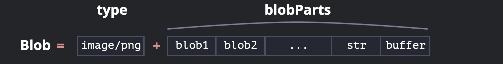

# blob(blob Binary Large Object)

대형 이진 객체를 의미하며 브라우저에서 파일이나 JavaScript에서 이진 데이터(binary data)를 다룰 때 사용되는 인터페이스입니다.\
JavaScript 표준의 `ArrayBuffer` 및 뷰와 함께 사용됩니다.\
보통 MIME 타입을 나타내는 `type`과 `blobParts`라 불리는 다른 Blob 객체, 문자열, 그리고 `BufferSource`들의 시퀀스로 구성됩니다.



파일을 나타내며, 이미지, 비디오, 텍스트 파일 등을 처리하는 데 유용하며, 파일 시스템을 직접 다루지 않으면서도 파일이나 데이터를 조작할 수 있도록 해줍니다.

## blob 특징

- 불변성: 한 번 생성된 `Blob`은 직접 수정할 수 없으며, JavaScript 문자열과 비슷하게 동작합니다.\
`Blob` 내 데이터를 수정할 수는 없지만, 부분적으로 슬라이스하여 새로운 Blob 객체를 만들거나, 이를 섞어서 새로운 `Blob`을 만들 수 있습니다.\
마치 문자열에서 특정 문자를 수정할 수는 없지만, 수정된 새로운 문자열을 만들 수 있는 것과 같습니다.\
데이터를 변경하려면 새로운 Blob 객체를 생성해야 합니다.

- 크기와 형식 지정: Blob은 크기(바이트 단위)와 데이터 형식을 지정할 수 있습니다.\
예를 들어, 텍스트를 text/plain으로, 이미지를 image/png 형식으로 저장할 수 있습니다.

- 부분 데이터 처리: Blob은 slice() 메서드를 사용해 데이터를 부분적으로 가져올 수 있습니다.

## Blob 생성 방법

```js
const options = { type: "application/json" };
// Typed Array와 문자열로부터 Blob 생성
const hello = new Uint8Array([72, 101, 108, 108, 111]); // "Hello"를 이진 데이터로 표현한 것
const array = [hello, ", World!"];

// 문자열로부터 Blob 생성
const data = new Blob(array, options);
// 첫 번째 인수는 반드시 배열이어야 합니다.
```

### option

- `type` (Optional)\
블롭에 저장할 데이터의 MIME 타입이며, 예를 들어 `image/png`와 같은 형식입니다.
기본 값은 빈 문자열(`''`)입니다.

- `endings` (Optional)
데이터가 텍스트일 때 현재 운영체제(OS)의 줄바꿈 형식에 맞게 개행 문자(`\n`)를 어떻게 변환할지 여부를 결정합니다.\
기본 값인 `"transparent"`는 개행 문자를 바꾸지 않고 블롭 데이터로 복사합니다.\
`"native"`를 지정하면 호스트 시스템 컨벤션에 맞춰서 변환합니다.

## Blob 프로퍼티

### Blob.size

`Blob` 인터페이스의 `size` 속성은 Blob 또는 File의 크기를 바이트 단위로 반환합니다.

### Blob.type

`Blob` 객체의 `type` 속성은 데이터의 MIME 유형을 반환합니다.

```html
<input type="file" id="input" multiple />
<output id="output">파일 선택...</output>
```

```js
const input = document.getElementById("input");
const output = document.getElementById("output");

input.addEventListener("change", (event) => {
  output.innerText = "";

  for (const file of event.target.files) {
    output.innerText += `${file.name}의 크기는 ${file.size} 바이트입니다.\n`;
  }
});

// 스크린샷 2024-10-03 13.42.00.png의 크기는 617136 바이트입니다.
```

#### MIME type

MIME type은 파일의 형식을 나타내는 문자열로 파일과 같이 송신되는데 content의 형식을 나타내기 위해 사용합니다.\
"media type"으로 사용하며, 예를 들면 오디오 파일은 audio/ogg로 그림 파일은 image/png로 분류할 수 있습니다.

```html
<input type="file" id="input" multiple />
<output id="output">이미지 파일 선택...</output>
```

```js
// 우리 애플리케이션에서는 GIF, PNG, JPEG 이미지만 허용
const allowedFileTypes = ["image/png", "image/jpeg", "image/gif"];

const input = document.getElementById("input");
const output = document.getElementById("output");

input.addEventListener("change", (event) => {
  const files = event.target.files;

  // input으로 파일을 받았는지 확인
  if (files.length === 0) {
    output.innerText = "이미지 파일 선택...";
    return;
  }

  // input으로 받은 이미지 파일의 type이 "image/png", "image/jpeg", "image/gif" 인지 확인
  if (Array.from(files).every((file) => allowedFileTypes.includes(file.type))) {
    // "image/png", "image/jpeg", "image/gif" 타입이라면
    output.innerText = "모든 파일 사용 가능!";
  } else {
    // "image/png", "image/jpeg", "image/gif" 타입이 아니라면
    output.innerText = "이미지 파일만 선택하세요.";
  }
});
```

## blob 메서드

### arrayBuffer()

`Blob` 객체의 데이터를 [ArrayBuffer](./array-buffer.md) 형태로 읽는 비동기 메서드입니다.\
`ArrayBuffer`는 고정 크기의 원시 이진 데이터 버퍼로, 이를 통해 바이트 단위로 데이터를 다룰 수 있습니다.

```js
blob.arrayBuffer().then((buffer) => {
  console.log(buffer); // ArrayBuffer 객체 출력
});
```

### slice()

데이터를 일부만 잘라서 새로운 `Blob`을 생성합니다.

```js
blob.slice([byteStart], [byteEnd], [contentType]);

const part = data.slice(0, 5); // "Hello"만 잘라냄
```

- `byteStart`: 시작 바이트, 기본값은 0입니다.
- `byteEnd`: 마지막 바이트(끝 바이트는 포함되지 않음), 기본값은 끝까지입니다.
- `contentType`: 새 `Blob`의 `type`, 기본값은 원본과 동일합니다.

인수는 `array.slice`와 유사하게 작동하며, 음수 값을 사용할 수도 있습니다.

### stream()

`Blob` 객체의 내용을 `ReadableStream` 객체로 반환합니다.\
`ReadableStream`은 데이터를 일정한 조각(chunks)으로 비동기적으로 읽을 수 있도록 해줍니다.\
즉, 데이터를 한꺼번에 메모리로 읽어오지 않고, 데이터를 작은 조각으로 나누어 순차적으로 읽고 처리할 수 있습니다.

```js
const readableStream = blob.stream(); // Blob 데이터를 읽기 위한 ReadableStream을 반환
```

### text()

`Blob` 데이터를 문자열로 변환하여 읽을 수 있습니다.

```js
data.text().then(text => {
  console.log(text); // "Hello, World!"
});
```

## Blob 객체를 URL처럼 사용하는 것

`Blob` 객체는 `<a>`, `` 같은 HTML 태그에서 URL로 쉽게 사용할 수 있으며, 이를 통해 내용을 표시하거나 다운로드할 수 있습니다.\
특히 `Blob`의 `type` 속성 덕분에, 이 객체는 다운로드 및 업로드에 사용될 수 있으며, 네트워크 요청에서 `Content-Type`으로 지정됩니다.

### 예시 1: 동적으로 생성된 Blob을 파일로 다운로드하기

아래 예시는 링크를 클릭하면 `hello world`라는 내용을 가진 동적으로 생성된 `Blob`을 파일로 다운로드하게 합니다:

```html
<!-- download 속성은 링크 클릭 시 페이지 이동 대신 파일 다운로드를 강제함 -->
<a download="hello.txt" href="#" id="link">Download</a>

<script>
let blob = new Blob(["Hello, world!"], {type: 'text/plain'});

link.href = URL.createObjectURL(blob);
</script>
```

위 코드에서는 `URL.createObjectURL(blob)`을 사용하여 `Blob`을 위한 고유한 `URL`을 생성하고, 이를 링크의 `href`로 설정합니다. 그 결과, 링크를 클릭하면 `hello.txt` 파일이 다운로드됩니다.

### 예시 2: JavaScript로 동적으로 링크 생성 및 다운로드 실행

HTML 없이 JavaScript만으로 링크를 생성하고 클릭을 시뮬레이션하여 다운로드를 자동으로 시작할 수도 있습니다:

```js
let link = document.createElement('a');  // a 요소 생성
link.download = 'hello.txt';  // 다운로드 파일 이름 설정

let blob = new Blob(['Hello, world!'], {type: 'text/plain'});  // Blob 생성

link.href = URL.createObjectURL(blob);  // Blob을 위한 URL 생성

link.click();  // 클릭 시뮬레이션으로 다운로드 시작

URL.revokeObjectURL(link.href);  // 메모리 해제를 위해 URL 해제
```

#### `URL.createObjectURL` 설명

`URL.createObjectURL`은 `Blob`을 받아 고유한 URL을 생성합니다.\
이 URL은 대개 다음과 같은 형식입니다:

```text
blob:<https://javascript.info/1e67e00e-860d-40a5-89ae-6ab0cbee6273>
```

브라우저는 `URL.createObjectURL`로 생성된 URL과 Blob 간의 매핑을 내부적으로 저장하므로, 짧은 URL로도 해당 Blob에 접근할 수 있습니다.\
이 URL은 현재 문서가 열려 있는 동안에만 유효하며, ``, `<a>` 등의 태그에서 참조할 수 있습니다.

### 메모리 관리

하지만 이러한 URL이 생성될 때 `Blob`은 메모리에 상주하게 되며, 브라우저가 이를 해제할 수 없습니다.\
문서가 언로드(unload)되면 매핑이 자동으로 해제되지만, 앱이 오래 실행되는 경우 이 해제가 바로 이루어지지 않을 수 있습니다.

따라서 더 이상 필요하지 않은 경우, `URL.revokeObjectURL(url)`을 호출해 URL 매핑을 제거하고 메모리를 해제할 수 있습니다.\
예를 들어, 단순히 한 번만 사용할 `Blob`은 다운로드 후 즉시 메모리에서 해제하는 것이 좋습니다.

```js
URL.revokeObjectURL(link.href);  // 메모리 해제를 위해 URL 해제
```

다만, `URL.revokeObjectURL(link.href)`를 호출하면 해당 URL은 더 이상 유효하지 않게 되므로, HTML 링크처럼 여러 번 사용해야 하는 경우에는 이 호출을 생략해야 합니다.

## Blob을 Base64로 변환하는 방법

`Blob`을 base64로 변환하는 것은 `Blob` 데이터를 텍스트 형식으로 변환하는 대안적인 방법입니다. Base64는 바이너리 데이터를 안전한 ASCII 문자들로 인코딩하여 표현하는 방식이며, 이 방식은 특히 "data-url"에서 자주 사용됩니다.

### Data URL 형식

- 형식: `data:[<mediatype>][;base64],<data>`

- 사용처: Data URL은 일반적인 URL처럼 HTML 태그의 `src`나 `href`에 사용할 수 있습니다.\
예를 들어, 이미지를 base64로 인코딩한 후 `` 태그에 삽입하면 해당 이미지를 화면에 표시할 수 있습니다.

#### 예시: Smiley 이미지

```html

```

이와 같은 형태로, base64로 인코딩된 이미지를 `` 태그의 `src` 속성에 넣으면 브라우저가 이를 디코딩해 이미지를 표시합니다.

### Blob을 base64로 변환하는 방법

Blob을 base64로 변환하려면 JavaScript의 `FileReader` 객체를 사용할 수 있습니다.\
`FileReader`는 다양한 형식으로 `Blob` 데이터를 읽을 수 있습니다.

예시: Blob을 base64로 변환하여 다운로드

```js
let link = document.createElement('a'); // a 요소 생성
link.download = 'hello.txt';  // 다운로드할 파일 이름 설정

let blob = new Blob(['Hello, world!'], {type: 'text/plain'});  // Blob 생성

let reader = new FileReader();
reader.readAsDataURL(blob);  // Blob을 base64로 변환

reader.onload = function() {
  link.href = reader.result;  // base64 데이터 URL을 링크의 href에 설정
  link.click();  // 다운로드 시작
};
```

### URL.createObjectURL(blob) vs Blob to data URL

1. URL.createObjectURL(blob):

    - 메모리를 신경 써야 할 경우에는 사용 후 `URL.revokeObjectURL`을 호출하여 메모리를 해제해야 합니다.

    - 별도의 인코딩이나 디코딩 과정이 없으므로 더 빠르고 간단하게 `Blob`에 접근할 수 있습니다.

2. Blob to data URL:

    - 메모리 해제를 신경 쓸 필요가 없습니다.

    - 하지만 큰 `Blob` 객체를 인코딩할 때 성능 저하와 메모리 낭비가 발생할 수 있습니다.

`URL.createObjectURL(blob)`은 성능과 메모리 관리 측면에서 더 나은 선택이지만, 필요에 따라 두 방법 모두 사용할 수 있습니다.

## 이미지에서 Blob 생성하기

HTML의 `<canvas>` 요소를 사용하면 이미지를 Blob으로 쉽게 변환할 수 있습니다.\
이 방법은 이미지를 업로드하거나 가공하는 데 유용합니다.\
전체 이미지, 특정 이미지 부분, 또는 페이지의 스크린샷을 `Blob`으로 만들 수 있습니다.

### 주요 단계

1. `<canvas>`에 이미지를 그립니다 (drawImage 메서드를 사용).

2. `canvas.toBlob(callback, format, quality)` 메서드를 사용해 이미지를 Blob으로 변환합니다.\
이 메서드는 비동기적으로 작동하며, 변환이 완료되면 콜백 함수에 Blob을 전달합니다.

### 이미지 복사 및 Blob 생성 예시

```js
// 이미지 선택
let img = document.querySelector('img');

// 이미지와 동일한 크기의 <canvas> 생성
let canvas = document.createElement('canvas');
canvas.width = img.clientWidth;
canvas.height = img.clientHeight;

let context = canvas.getContext('2d');

// 이미지를 <canvas>에 그리기
context.drawImage(img, 0, 0);

// 이미지를 Blob으로 변환 (비동기 작업)
canvas.toBlob(function(blob) {
  // Blob 생성 후 다운로드 링크 생성
  let link = document.createElement('a');
  link.download = 'example.png';  // 파일명 설정
  link.href = URL.createObjectURL(blob);  // Blob을 URL로 변환
  link.click();  // 다운로드 시작

  // 메모리 해제를 위해 URL 제거
  URL.revokeObjectURL(link.href);
}, 'image/png');
```

### async/await 방식 사용

비동기 함수로 `Blob`을 처리하려면 `async/await`을 사용할 수 있습니다.

```js
let blob = await new Promise(resolve => canvas.toBlob(resolve, 'image/png'));
// Blob 사용 예: 업로드, 저장 등
```

### 페이지 스크린샷 Blob 생성

페이지의 스크린샷을 Blob으로 변환하려면 `html2canvas`와 같은 라이브러리를 사용할 수 있습니다.\
이 라이브러리는 페이지 요소를 읽어 `<canvas>`에 그린 다음, 앞서 설명한 방식으로 Blob을 만들 수 있습니다.

```js
// html2canvas 사용 예시
html2canvas(document.body).then(canvas => {
  canvas.toBlob(function(blob) {
    // Blob 처리: 다운로드, 업로드 등
  }, 'image/png');
});
```

이 방법을 사용하면 이미지 편집, 특정 부분 캡처, 또는 페이지 전체의 스크린샷을 Blob으로 변환할 수 있습니다.

## Blob을 ArrayBuffer로 변환

`Blob` 생성자는 거의 모든 것으로부터 Blob을 생성할 수 있으며, 그 안에는 `BufferSource`도 포함됩니다.

그러나 저수준 처리를 수행해야 하는 경우, `FileReader`를 사용하여 Blob에서 가장 저수준인 `ArrayBuffer`를 얻을 수 있습니다.

```js
// blob에서 arrayBuffer 얻기
let fileReader = new FileReader();

fileReader.readAsArrayBuffer(blob);

fileReader.onload = function(event) {
  let arrayBuffer = fileReader.result;
};
```

## 요약

`ArrayBuffer`, `Uint8Array` 및 기타 `BufferSource`는 "이진 데이터"인 반면, `Blob`은 "타입이 있는 이진 데이터"를 나타냅니다.

이는 `Blob`이 브라우저에서 매우 흔한 업로드/다운로드 작업에 편리함을 줍니다.

웹 요청을 수행하는 메서드들(예: `XMLHttpRequest`, `fetch` 등)은 `Blob`을 다른 이진 타입과 마찬가지로 네이티브로 처리할 수 있습니다.

우리는 Blob과 저수준 이진 데이터 타입 간에 쉽게 변환할 수 있습니다.

- `new Blob(...)` 생성자를 사용해 타입 배열로부터 Blob을 생성할 수 있습니다.

- `FileReader`를 사용해 Blob에서 다시 `ArrayBuffer`를 얻고, 그 후 저수준 이진 처리를 위해 이를 뷰로 만들 수 있습니다.

## 자료

- [Blob](https://ko.javascript.info/blob)
