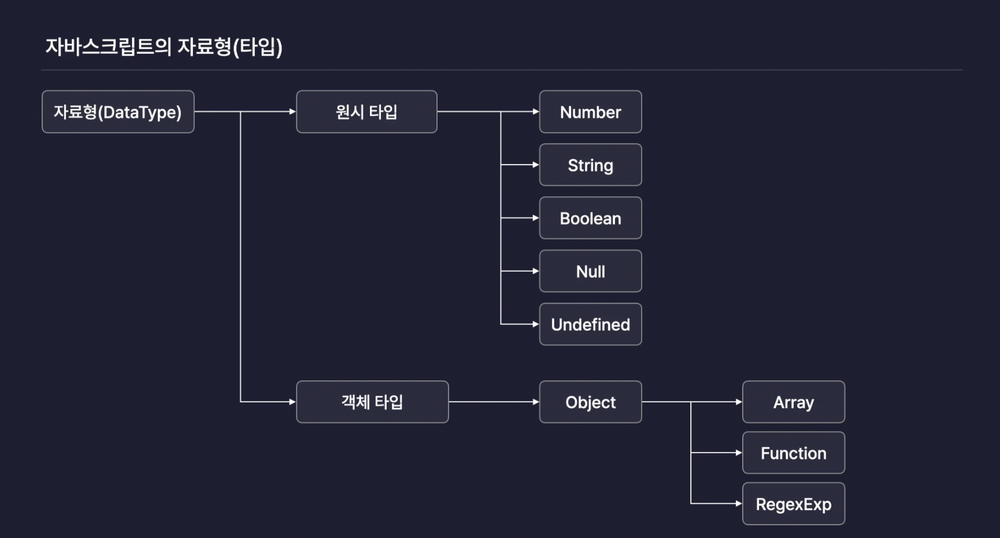
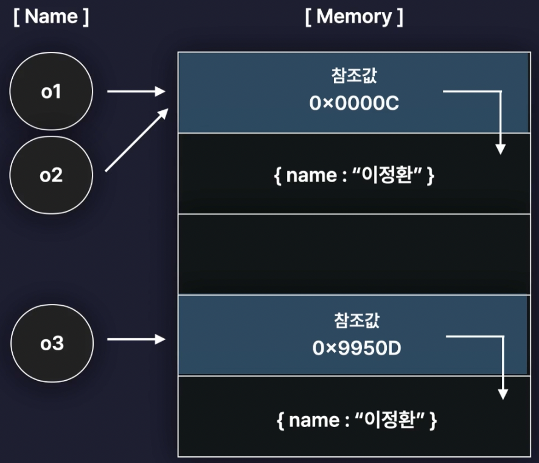
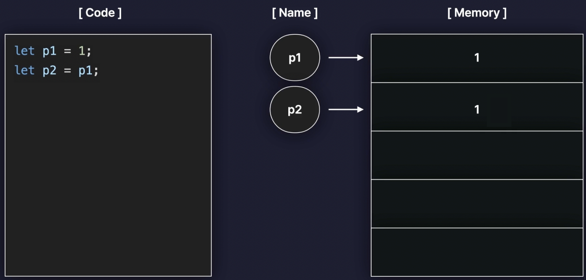
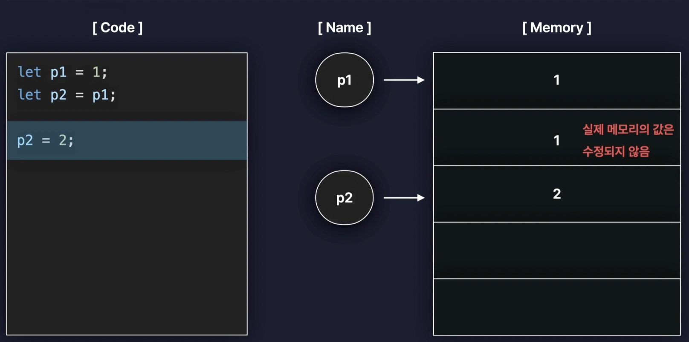
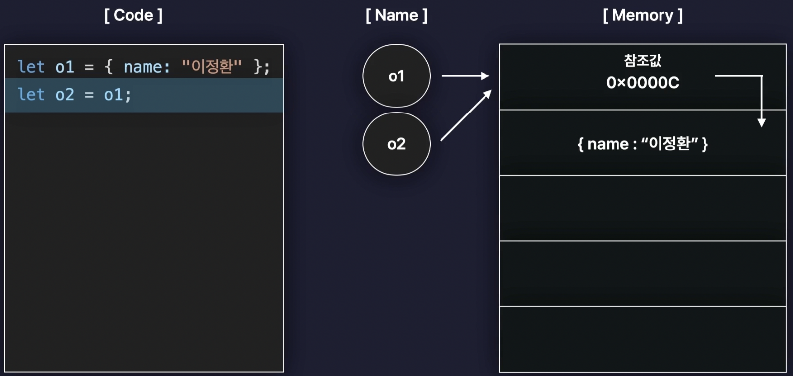
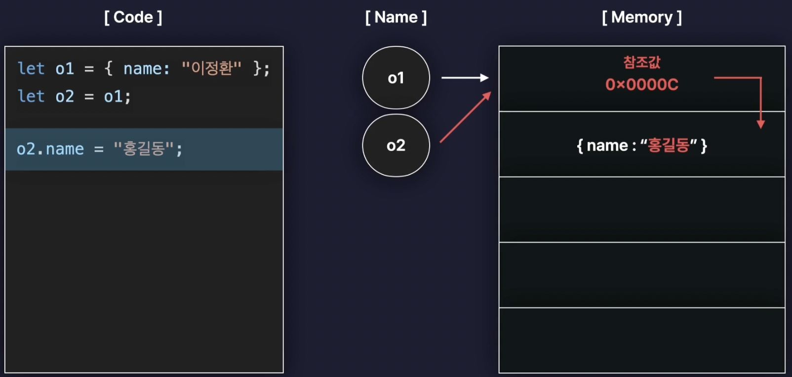
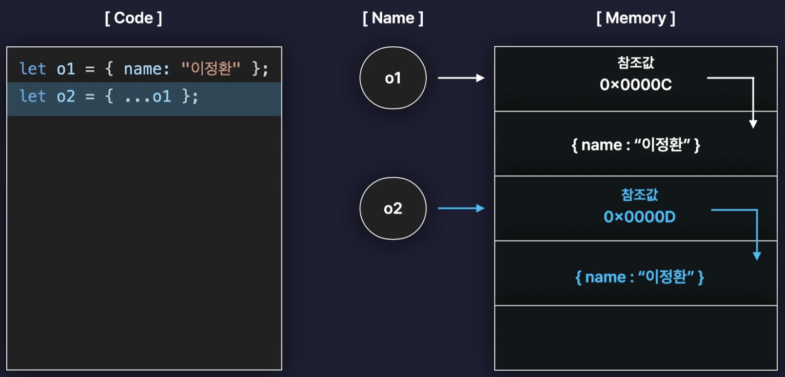
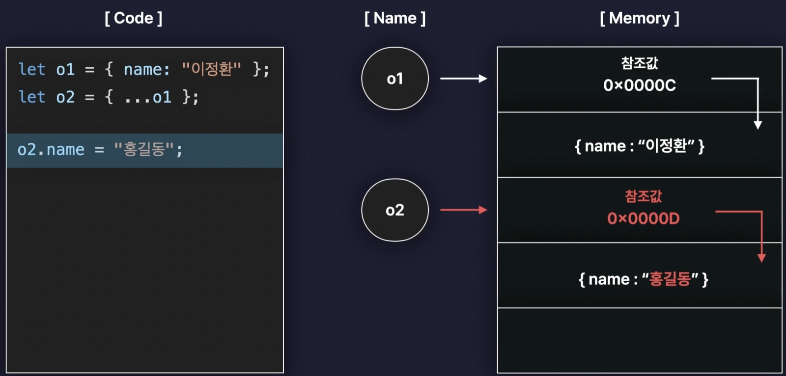

# 데이터 타입과 복사, 복제



원시타입과 객체타입은 값이 저장되거나 복사되는 과정이 서로 다릅니다.

## 원시 타입(Primitive Type)

stack memory에 저장되는 데이터
값 자체로써 변수에 저장되고 복사 됩니다. (메모리 값 수정하지 않는 불변값)

- Number
- String
- Boolean
- null
- undefined
- Symbol

### 기본형의 메모리 할당

```javascript
let a;
a = "abc";
```

|  주소  | ... |   1002    | 1003 | 1004 | 1005 | ... |
| :----: | :-: | :-------: | :--: | :--: | :--: | :-: |
| 데이터 |     |  이름: a  |      |      |      |     |
|        |     | 값: @5004 |      |      |      |     |

|  주소  | ... | 5002 | 5003 | 5004  | 5005 | ... |
| :----: | :-: | :--: | :--: | :---: | :--: | :-: |
| 데이터 |     |      |      | 'abc' |      |     |

#### 기본형의 재할당

```javascript
let a;
a = "abc";
a = "abcdef";
```

|  주소  | ... |        1002        | 1003 | 1004 | 1005 | ... |
| :----: | :-: | :----------------: | :--: | :--: | :--: | :-: |
| 데이터 |     |      이름: a       |      |      |      |     |
|        |     | 값: @5004 -> @5005 |      |      |      |     |

|  주소  | ... | 5002 | 5003 | 5004  |   5005   | ... |
| :----: | :-: | :--: | :--: | :---: | :------: | :-: |
| 데이터 |     |      |      | 'abc' | 'abcdef' |     |

a의 값을 바꾸면 값의 주소가 바뀜

### 같은 원시 값을 가진 두 변수 비교

```javascript
let a = "abc";
let b = "abc";

console.log(a === b);
// true
```

|  주소  | ... |   1002    |   1003    | 1004 | 1005 | ... |
| :----: | :-: | :-------: | :-------: | :--: | :--: | :-: |
| 데이터 |     |  이름: a  |  이름: b  |      |      |     |
|        |     | 값: @5004 | 값: @5004 |      |      |     |

|  주소  | ... | 5002 | 5003 | 5004  | 5005 | ... |
| :----: | :-: | :--: | :--: | :---: | :--: | :-: |
| 데이터 |     |      |      | 'abc' |      |     |

### 깊은 복사

```javascript
let a = 10;
let b = a;

console.log(a === b);
// true
```

|  주소  | ... |   1002    |   1003    | 1004 | 1005 | ... |
| :----: | :-: | :-------: | :-------: | :--: | :--: | :-: |
| 데이터 |     |  이름: a  |  이름: b  |      |      |     |
|        |     | 값: @5002 | 값: @5002 |      |      |     |

|  주소  | ... | 5002 | 5003 | 5004 | 5005 | ... |
| :----: | :-: | :--: | :--: | :--: | :--: | :-: |
| 데이터 |     |  10  |      |      |      |     |

#### 깊은 복사 재할당

```javascript
let a = 10;
let b = a;

b = 15;

console.log(a === b);
// false
```

|  주소  | ... |   1002    |        1003        | 1004 | 1005 | ... |
| :----: | :-: | :-------: | :----------------: | :--: | :--: | :-: |
| 데이터 |     |  이름: a  |      이름: b       |      |      |     |
|        |     | 값: @5002 | 값: @5002 -> @5003 |      |      |     |

|  주소  | ... | 5002 | 5003 | 5004 | 5005 | ... |
| :----: | :-: | :--: | :--: | :--: | :--: | :-: |
| 데이터 |     |  10  |  15  |      |      |     |

## 참조 타입(Reference Type)

heap memory에 저장되는 데이터
stack memory에 주소를 저장하고 실제 객체와 함수는 heap memory에 저장합니다.
참조값을 통해 변수에 저장되고 복사 됩니다. (메모리 값 수정되는 가변값)

- Object
- Array (순차저장, 순회 등이 추가된 객체)
- Function (호출, 선언 등이 추가된 객체)
- RegExp
- Set/ WeakSet
- Map/ WeakSet
  ...

### 참조형의 메모리 할당

```javascript
let obj = {
  a: 1,
  b: "bbb",
};

console.log(obj);
//{a: 1, b: 'bbb'}
```

|  주소  | ... |   1002    | 1003 | 1004 | 1005 | ... |
| :----: | :-: | :-------: | :--: | :--: | :--: | :-: |
| 데이터 |     | 이름: obj |      |      |      |     |
|        |     | 값: @5002 |      |      |      |     |

|  주소  | ... |   5002    | 5003 | 5004  | 5005 | ... |
| :----: | :-: | :-------: | :--: | :---: | :--: | :-: |
| 데이터 |     | @7103 ~ ? |  1   | 'bbb' |      |     |

|  주소  | ... | 7002 |   7003    |   7004    | 7005 | ... |
| :----: | :-: | :--: | :-------: | :-------: | :--: | :-: |
| 데이터 |     |      |  이름: a  |  이름: b  |      |     |
|        |     |      | 값: @5003 | 값: @5004 |      |     |

#### 참조형의 재할당

```javascript
let obj = {
  a: 1,
  b: "bbb",
};

obj.a = 2;

console.log(obj);
// {a: 2, b: 'bbb'}
```

|  주소  | ... |   1002    | 1003 | 1004 | 1005 | ... |
| :----: | :-: | :-------: | :--: | :--: | :--: | :-: |
| 데이터 |     | 이름: obj |      |      |      |     |
|        |     | 값: @5002 |      |      |      |     |

|  주소  | ... |   5002    | 5003 | 5004  | 5005 | ... |
| :----: | :-: | :-------: | :--: | :---: | :--: | :-: |
| 데이터 |     | @7103 ~ ? |  1   | 'bbb' |  2   |     |

|  주소  | ... | 7102 |        7103        |   7104    | 7105 | ... |
| :----: | :-: | :--: | :----------------: | :-------: | :--: | :-: |
| 데이터 |     |      |      이름: a       |  이름: b  |      |     |
|        |     |      | 값: @5003 -> @5005 | 값: @5004 |      |     |

프로퍼티의 값이 바뀌어도 obj라는 값의 주소는 변하지 않음

### 중첩 객체의 메모리 할당

```javascript
let obj = {
  x: 3,
  arr: [3, 4],
};

console.log(obj);
// {x: 3, arr: Array(2)}
```

|  주소  | ... |   1002    | 1003 | 1004 | 1005 | ... |
| :----: | :-: | :-------: | :--: | :--: | :--: | :-: |
| 데이터 |     | 이름: obj |      |      |      |     |
|        |     | 값: @5002 |      |      |      |     |

|  주소  | ... |   5002    | 5003 |   5004    | 5005 | ... |
| :----: | :-: | :-------: | :--: | :-------: | :--: | :-: |
| 데이터 |     | @7103 ~ ? |  3   | @8104 ~ ? |  4   |     |

|  주소  | ... | 7102 |   7103    |   7104    | 7105 | ... |
| :----: | :-: | :--: | :-------: | :-------: | :--: | :-: |
| 데이터 |     |      |  이름: x  | 이름: arr |      |     |
|        |     |      | 값: @5003 | 값: @5004 |      |     |

|  주소  | ... |   8104    |   8105    | 8106 | 8107 | ... |
| :----: | :-: | :-------: | :-------: | :--: | :--: | :-: |
| 데이터 |     |  이름: 0  |  이름: 1  |      |      |     |
|        |     | 값: @5003 | 값: @5005 |      |      |     |

#### 중첩 객체의 재할당

```javascript
let obj = {
  x: 3,
  arr: [3, 4],
};

obj.arr = "str";

console.log(obj);
// {x: 3, arr: 'str'}
```

|  주소  | ... |   1002    | 1003 | 1004 | 1005 | ... |
| :----: | :-: | :-------: | :--: | :--: | :--: | :-: |
| 데이터 |     | 이름: obj |      |      |      |     |
|        |     | 값: @5002 |      |      |      |     |

|  주소  | ... |   5002    | 5003 |   5004    | 5005 | 5006  | ... |
| :----: | :-: | :-------: | :--: | :-------: | :--: | :---: | :-: |
| 데이터 |     | @7103 ~ ? |  3   | @8104 ~ ? |  4   | 'str' |     |

|  주소  | ... | 7102 |   7103    |        7104        | 7105 | ... |
| :----: | :-: | :--: | :-------: | :----------------: | :--: | :-: |
| 데이터 |     |      |  이름: x  |     이름: arr      |      |     |
|        |     |      | 값: @5003 | 값: @5004 -> @5006 |      |     |

|  주소  | ... |   8104    |   8105    | 8106 | 8107 | ... |
| :----: | :-: | :-------: | :-------: | :--: | :--: | :-: |
| 데이터 |     |  이름: 0  |  이름: 1  |      |      |     |
|        |     | 값: @5003 | 값: @5005 |      |      |     |

@5004는 참조 카운트가 0이 되어 가비지 컬렉터로 인해 사라집니다.

### 같은 참조 값을 가진 두 변수 비교

```javascript
let obj1 = {
  c: 10,
};

let obj2 = {
  c: 10,
};

console.log(obj1 === obj2);
// false

console.log(obj1.c === obj2.c);
// true
```

|  주소  | ... |    1002    |    1003    | 1004 | 1005 | ... |
| :----: | :-: | :--------: | :--------: | :--: | :--: | :-: |
| 데이터 |     | 이름: obj1 | 이름: obj2 |      |      |     |
|        |     | 값: @5002  | 값: @5003  |      |      |     |

|  주소  | ... | 5002  | 5003  | 5004 | 5005 | ... |
| :----: | :-: | :---: | :---: | :--: | :--: | :-: |
| 데이터 |     | @7103 | @7104 |  10  |      |     |

|  주소  | ... | 7102 |   7103    |   7104    | 7105 | ... |
| :----: | :-: | :--: | :-------: | :-------: | :--: | :-: |
| 데이터 |     |      |  이름: c  |  이름: c  |      |     |
|        |     |      | 값: @5004 | 값: @5004 |      |     |

`obj1.c`와 `obj2.c`는 메모리 상에서 서로 다른 위치에 저장된 값이 됩니다.

### 얕은 복사

```javascript
let obj1 = {
  c: 10,
  d: "ddd",
};

let obj2 = obj1;

console.log(obj1 === obj2);
// true
```

|  주소  | ... |    1002    |    1003    | 1004 | 1005 | ... |
| :----: | :-: | :--------: | :--------: | :--: | :--: | :-: |
| 데이터 |     | 이름: obj1 | 이름: obj2 |      |      |     |
|        |     | 값: @5002  | 값: @5002  |      |      |     |

|  주소  | ... |   5002    | 5003 | 5004  | 5005 | ... |
| :----: | :-: | :-------: | :--: | :---: | :--: | :-: |
| 데이터 |     | @7103 ~ ? |  10  | 'ddd' |      |     |

|  주소  | ... | 7102 |   7103    |   7104    | 7105 | ... |
| :----: | :-: | :--: | :-------: | :-------: | :--: | :-: |
| 데이터 |     |      |  이름: c  |  이름: d  |      |     |
|        |     |      | 값: @5003 | 값: @5004 |      |     |

#### 얕은 복사 재할당

```javascript
let obj1 = {
  c: 10,
  d: "ddd",
};

let obj2 = obj1;
obj2.c = 20;

console.log(obj1 === obj2);
// true

console.log(obj1);
// {c: 20, d: 'd'}
```

|  주소  | ... |    1002    |    1003    | 1004 | 1005 | ... |
| :----: | :-: | :--------: | :--------: | :--: | :--: | :-: |
| 데이터 |     | 이름: obj1 | 이름: obj2 |      |      |     |
|        |     | 값: @5002  | 값: @5002  |      |      |     |

|  주소  | ... |   5002    | 5003 | 5004  | 5005 | ... |
| :----: | :-: | :-------: | :--: | :---: | :--: | :-: |
| 데이터 |     | @7103 ~ ? |  10  | 'ddd' |  20  |     |

|  주소  | ... | 7102 |        7103        |   7104    | 7105 | ... |
| :----: | :-: | :--: | :----------------: | :-------: | :--: | :-: |
| 데이터 |     |      |      이름: c       |  이름: d  |      |     |
|        |     |      | 값: @5003 -> @5005 | 값: @5004 |      |     |

객체를 복사하고 복사한 객체의 값을 바꾸었을 때 원본 객체의 값도 같이 바뀝니다.
이러한 이유 때문에 매번 새로운 객체를 만들거나 불변객체를 사용합니다.

### 객체간의 비교

```js
let o1 = { name: "zimablue" };
let o2 = o1;
let o3 = { ...o1 };

console.log(o1 === o2); // true
console.log(o1 === o3); // false
```



참조값이 아닌 프로퍼티를 비교하고 싶다면 `JSON.stringify` 같은 메서드를 사용해야 합니다.

```jsx
let o1 = { name: "zimablue" };
let o2 = o1;
let o3 = { ...o1 };

// 얕은 비교: 참조값을 기준으로 비교
console.log(o1 === o2); // true
console.log(o1 === o3); // false

// 깊은 비교: 객체를 문자열로 변환하여 비교
console.log(JSON.stringfy(o1) === JSON.stringfy(o3)); // true
```

## 요약

### 원시 타입 요약

#### 원시 타입 깊은 복사 요약



#### 원시 타입 깊은 복사 재할당 요약



### 참조 타입 요약

#### 참조 타입 얕은 복사 요약



#### 참조 타입 얕은 복사 재할당 요약



#### 참조 타입 깊은 복사 요약



#### 참조 타입 깊은 복사 재할당 요약



## 참고

- [코어 자바스크립트](https://www.inflearn.com/course/%ED%95%B5%EC%8B%AC%EA%B0%9C%EB%85%90-javascript-flow/dashboard)
- [한입 크기로 잘라 먹는 리액트(React.js)](https://www.udemy.com/course/winterlood-react-basic/)
