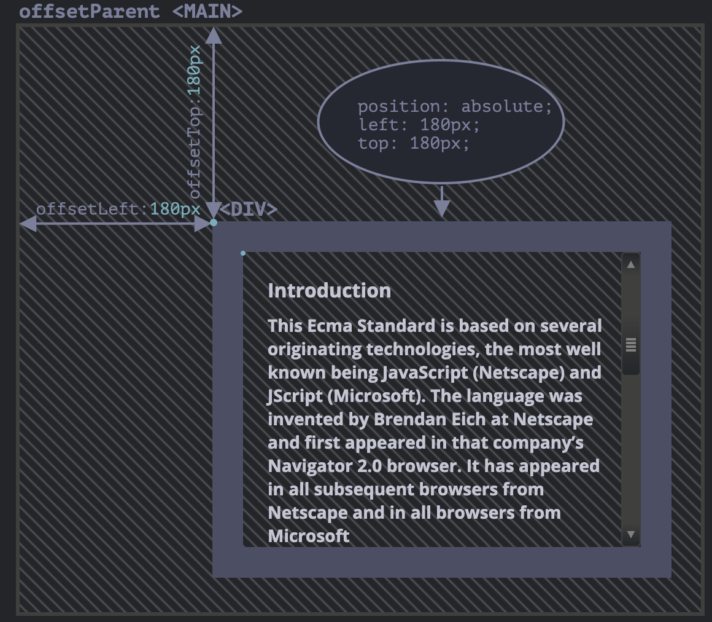
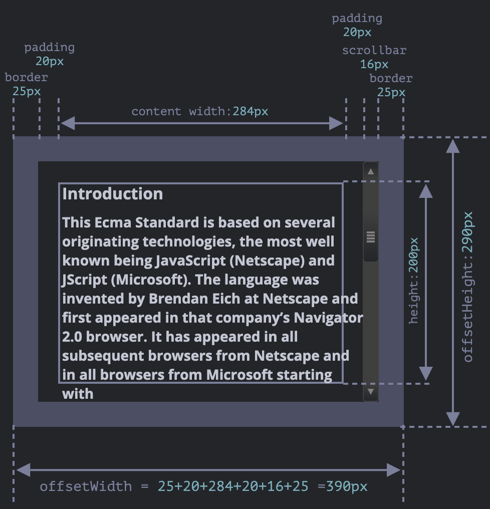
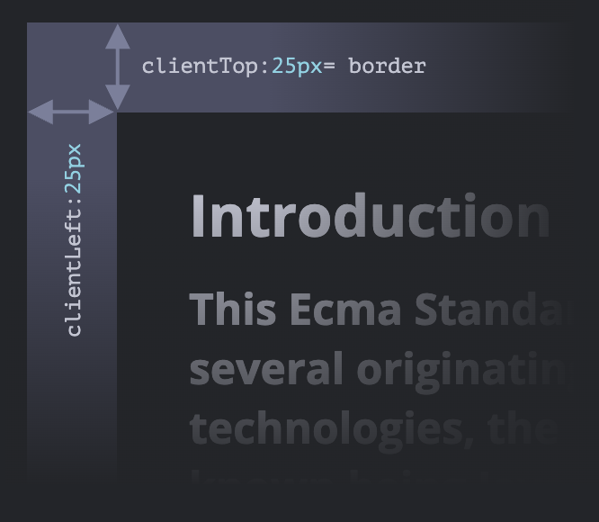
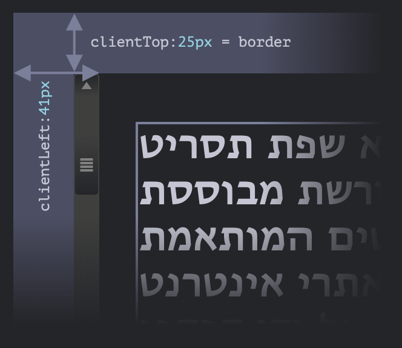
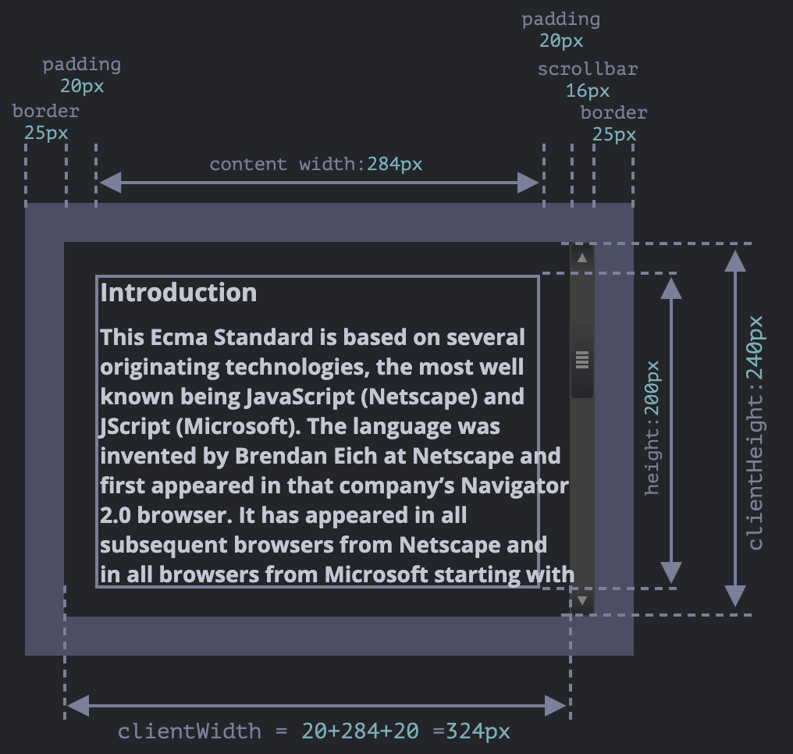
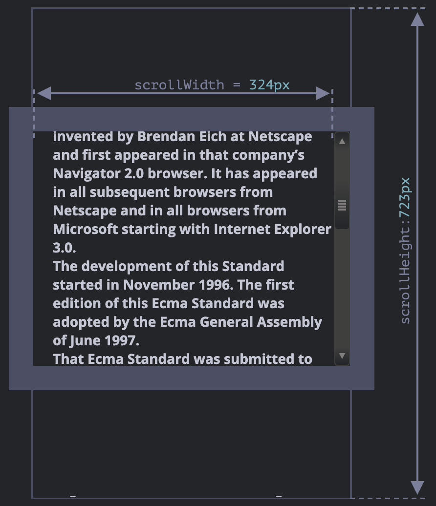
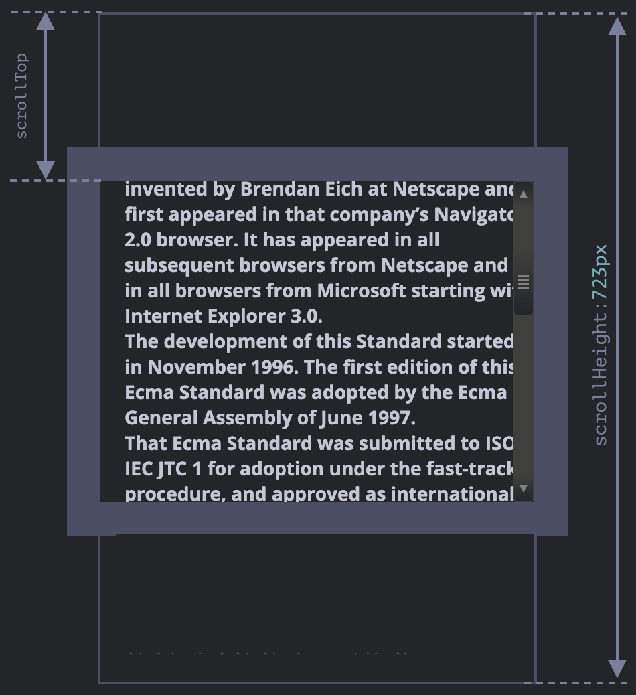

# 요소 사이즈와 스크롤

CSS를 `getComputedStyle`을 사용해 너비와 높이를 얻는 것은 좋지 않습니다.\
CSS `width`와 `height`는 다른 CSS 프로퍼티의 영향을 받습니다.\
요소의 너비와 높이 계산 방법을 '지정’하는 box-sizing이 이런 프로퍼티의 대표적인 예입니다.\
또한 CSS의 `width`와 `height`는 `auto`일 수 있습니다.

밑에 나올 기하 프로퍼티 이미지에 대한 정보 이미지입니다.


- `padding-bottom` 영역으로 텍스트가 넘칠 수 있습니다.
- 요소를 다룰 때는 스크롤바가 차지하는 공간을 항상 염두해야 합니다.

## 기하 프로퍼티


### offsetParent와 offsetLeft, offsetTop

offset은 마진은 포함되지 않는 요소의 너비와 높이에 패딩, 스크롤바, 테두리를 합친 크기이며 화면에서 차지하는 영역 전체 크기입니다.

#### offsetParent

```javascript
parentObj = element.offsetParent;
```

`offsetParent` 프로퍼티는 해당 요소를 렌더링할 때, 좌표 계산에 사용되는 가장 가까운 조상 요소의 참조를 반환합니다.\
`offsetParent`에 의해 반환되는 가장 가까운 조상 요소는 아래 셋 중 하나에 속하게 됩니다.

1. CSS position 프로퍼티가 absolute나 relative, fixed, sticky인 가장 가까운 조상 요소
2. `<td>`나 `<th>`, 혹은 `<table>`
3. `<body>`

#### offsetLeft, offsetTop

`offsetLeft`는 `offsetParent`를 기준으로 각각 요소가 오른쪽으로 얼마나 떨어져 있는지를 나타냅니다.\
`offsetTop`은 `offsetParent`를 기준으로 각각 요소가 아래쪽으로 얼마나 떨어져 있는지를 나타냅니다.

```javascript
const colorTable = document.getElementById("t1");
const tOLeft = colorTable.offsetLeft;
const topPos = colorTable.offsetTop;
```

```html
<main style="position: relative" id="main">
  <article>
    <div id="example" style="position: absolute; left: 180px; top: 180px">...</div>
  </article>
</main>
<script>
  alert(example.offsetParent.id); // main
  alert(example.offsetLeft); // 180 (주의: 문자열 '180px'이 아닌 숫자 180이 반환됩니다.)
  alert(example.offsetTop); // 180
</script>
```



다음 같은 경우엔 `offsetParent`가 `null`이 될 수 있습니다.

1. 화면에 보이지 않는 요소(CSS display 프로퍼티가 none이거나 문서 내에 있지 않은 요소)
2. `<body>`와 `<html>`
3. `position` 프로퍼티가 `fixed`인 요소(뷰포트에 고정되어 문서 흐름에서 벗어나고 브라우저 창에 고정되어 있으므로)

### offsetWidth와 offsetHeight

`offsetWidth`와 `offsetHeight`는 요소 '가장 바깥 부분(outer)'이 차지하는 너비와 높이 정보를 제공합니다.



### clientTop과 clientLeft

clientTop과 clientLeft를 사용하면 테두리 두께를 측정할 수 있습니다.



clientTop과 clientLeft를 사용하면 왼쪽 테두리 너비와 위쪽 테두리 높이를 측정할 수 있습니다.



아랍어나 히브리어처럼 오른쪽에서 왼쪽으로 글이 전개되는 언어일 때 브라우저에선 스크롤바가 오른쪽이 아닌 왼쪽에 나타나게 되는데, 그럼 `clientLeft`에 스크롤바의 너비가 포함됩니다.\
`clientLeft`가 25가 아닌 스크롤바 너비를 포함한 41(25 + 16)이 됩니다.

### clientWidth와 clientHeight

`clientWidth`와 `clientHeight` 프로퍼티는 스크롤바를 제외한 콘텐츠 너비와 패딩이 포함한 테두리 안 영역의 사이즈 정보를 제공합니다.



패딩이 없는 경우엔 `clientWidth`와 `clientHeight`를 사용해 콘텐츠 영역 크기를 구할 수 있습니다.

### scrollWidth와 scrollHeight

`scrollWidth`와 `scrollHeight` 프로퍼티는 스크롤바에 의해 감춰진 영역도 포함합니다.



- `scrollWidth`는 수평 스크롤바가 없기 때문에 안쪽 영역 전체를 나타내는 `clientWidth`와 동일합니다.
- `scrollHeight`는 세로 스크롤바에 가려진 부분을 포함하는 콘텐츠 영역 안쪽 전체의 높이입니다.

`scrollWidth`와 `scrollHeight`는 요소 크기를 콘텐츠가 차지하는 만큼 늘리고자 할 때 사용할 수 있습니다.

```javascript
// 콘텐츠가 차지하는 높이만큼 요소 높이를 늘림
element.style.height = `${element.scrollHeight}px`;
```

### scrollLeft와 scrollTop

`scrollLeft`와 `scrollTop`은 가로 스크롤이 오른쪽, 세로 스크롤이 아래로 움직임에 따라 가려진 영역의 너비와 높이를 나타냅니다.

아래에서 `scrollTop`은 ‘세로 스크롤바에 의해 가려져 보이지 않는’ 위쪽 콘텐츠의 높이가 됩니다.



## 참고

- [요소 사이즈와 스크롤](https://ko.javascript.info/size-and-scroll)
