# 프로토타입

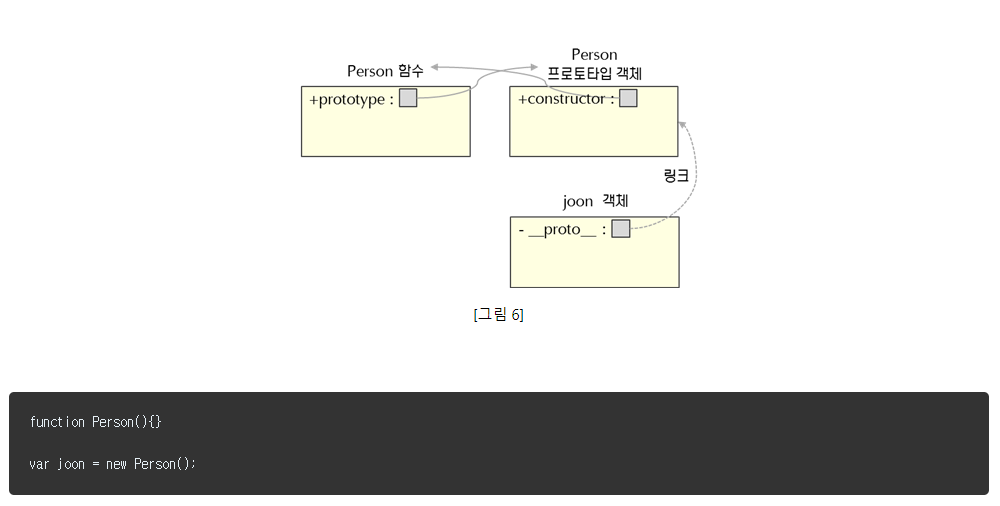

## 1. 프로토 타입이란

타입 객체 프로토 타입은 두 가지를 의미합니다

1. 생성자 함수(`Constructor`)의 멤버 `prototype` 속성

2. 생성자 함수와 `new` 키워드로 만들어진 인스턴스(`instance`)를 생성자 함수(`Constructor`)의 prototype 속성(`prototype`)과 이어주는 링크인 프로토(`[[Prodotype]]`)
   즉, 1번과 instance를 이어주는 프로토(`[[Prodotype]]`)

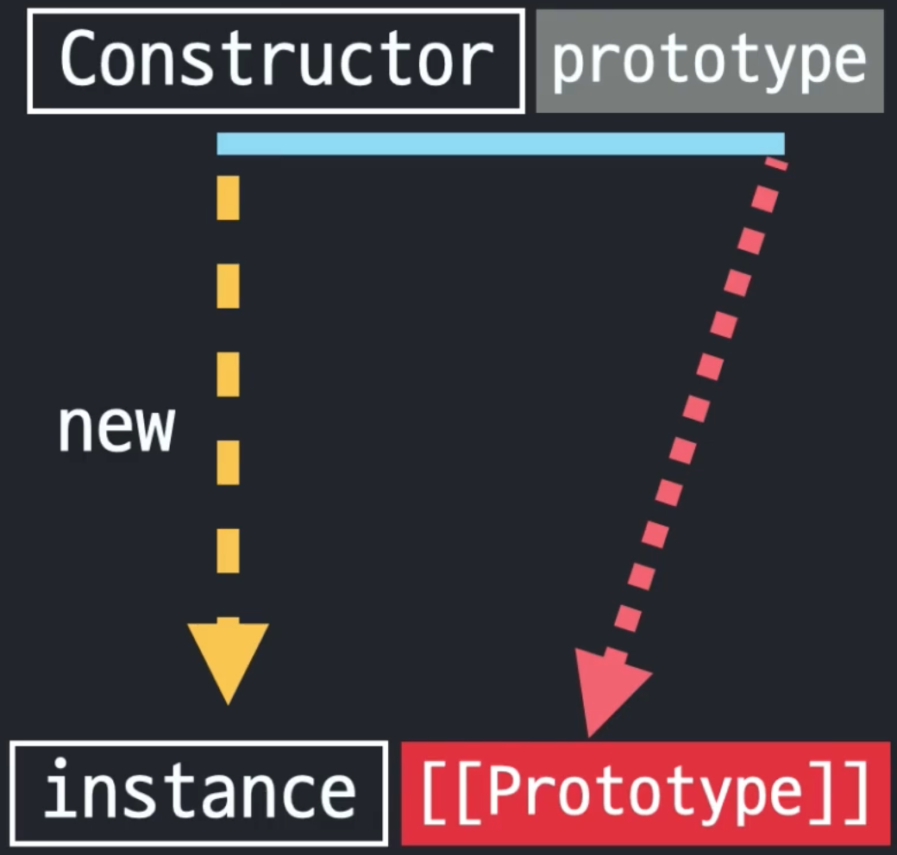

프로토(`[[Prodotype]]`)는 접근가능한 것이 아니기 때문에 실제 동작상 이미지는 아래와 같습니다.

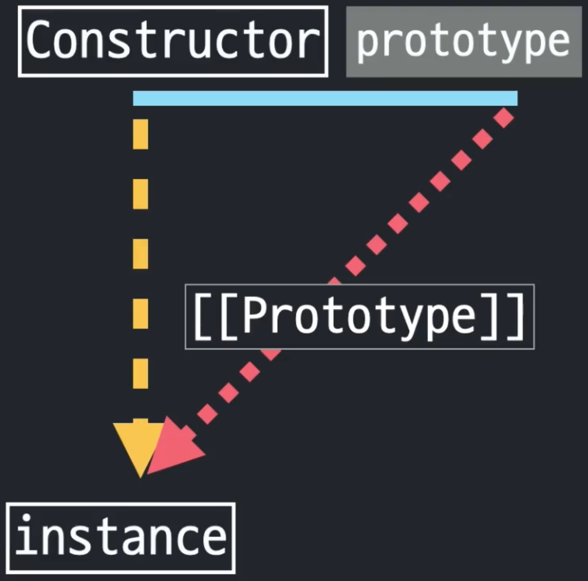

## 2. prototype 속성(`.prototype`)과 프로토(`[[Prototype]]`)의 관계

아래의 `from, isArray, of, ... , prototype`은 배열의 생성자 함수 `Array`가 가지고 있는 프로퍼티입니다.
그 중 `prototype` 프로퍼티는 `at(), concat(), ...` 등의 매서드를 가지고 있습니다.

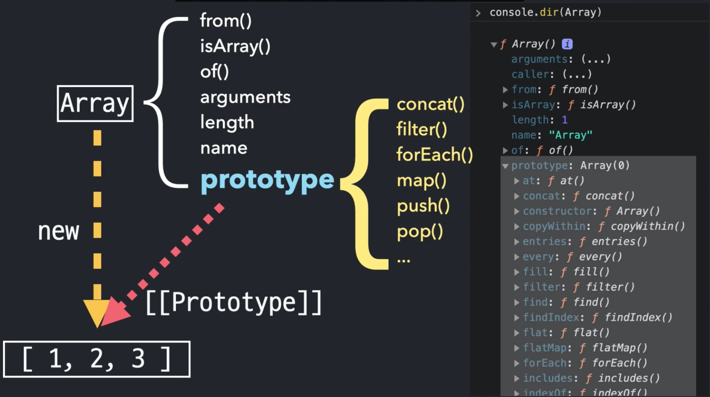

아래는 생성자 함수 `Array`의 인스턴스 `[1, 2, 3]` 배열이 가지고 있는 프로토(`[[Prodotype]]`)의 매서드입니다.

생성자 함수 `Array`가 가지고 있는 `prototype`과 인스턴스 `[1, 2, 3]`이 가지고 있는 프로토(`[[Prodotype]]`)의 매서드가 동일합니다.

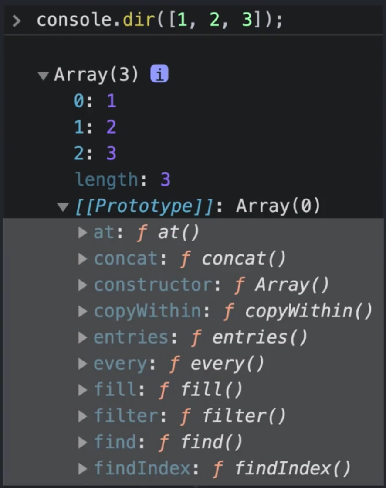

그리고 `prototype`과 `[[Prodotype]]`가 가지고 있는 `constructor` 프로퍼티는 생성자 함수 `Array()`를 가리키고 있습니다.

따라서 내부적으로 아래의 코드 네 개가 같습니다.

```javascript
1. Array // ƒ Array() { [native code] }
2. [1, 2, 3].constructor // ƒ Array() { [native code] }
3. [1, 2, 3].[[Prototype]].constructor
4. Array.prototype.constructor // ƒ Array() { [native code] }
```

실제로 `[1, 2, 3].[[Prototype]].constructor`는 입력해서 `Array`에 접근 할 수는 없습니다.
내부적으로 가리키고 있는 것을 표현한 것입니다.
밑에 나올 "4.instance로부터 prototype 프로퍼티에 직접 접근하는 법"을 참조해 주세요.

## 3. \[\[Prodotype]]를 이용한 메서드 접근

`null`과 `undefined`를 제외한 데이터에는 모두 생성자 함수가 존재합니다.
생성자 함수에는 데이터가 사용할 수 있는 메서드가 있고, 데이터의 프로토(`[[Prodotype]]`)를 이용해 생성자 함수의 프로토 타입(`prototype`)에 접근하여 메서드를 사용합니다.

아래의 이미지 처럼 배열 데이터에는 값과 `length`만 존재하고 메서드는 없습니다.
메서드는 위의 설명과 같이 프로토(`[[Prodotype]]`) 통로로 가져와서 사용합니다.


### 데이터 타입에 따른 메서드 호출 방식 차이

위의 설명에서 사용한 예시들(배열)은 모두 참조형 타입의 데이터입니다.

기본형 타입의 데이터의 경우 메서드 호출 방식이 조금 다릅니다.

#### 기본형 타입의 데이터

기본형 타입의 데이터가 사용할 수 있는 메서드를 보기 위해서는 기본형 타입의 데이터의 프로토(`[[Prodotype]]`)를 확인하면 됩니다.

그래서 `console.dir`로 문자 리터럴의 프로토(`[[Prodotype]]`) 프로퍼티를 확인해 봤습니다.

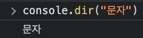

아무것도 나오지 않았습니다.

문자나 숫자 리터럴 자체는 객체가 아닙니다.
따라서 문자 리터럴은 인스턴스가 아니므로 프로토(`[[Prodotype]]`)가 존재하지 않는 것입니다.

하지만 문자 리터럴로 메서드를 사용할 수 있습니다.

문자 리터럴에는 프로토(`[[Prodotype]]`)가 없는데 어떻게 String 생성자 함수의 프로토 타입(`prototype`)에 접근하여 메서드를 사용하는걸까요?

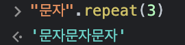

이유는 데이터 타입에 따른 메서드 호출 방식 차이가 있기 때문입니다.

프로토(`[[Prodotype]]`)가 존재하지 않을 때 메서드 호출 순서는 다음과 같습니다.

1. 기본형 타입의 메서드를 호출합니다.

   

2. 자바스크립트는 메서드를 사용한 기본형 타입의 리터럴에 해당하는 생성자 함수의 인스턴스를 임시로 만듭니다.

   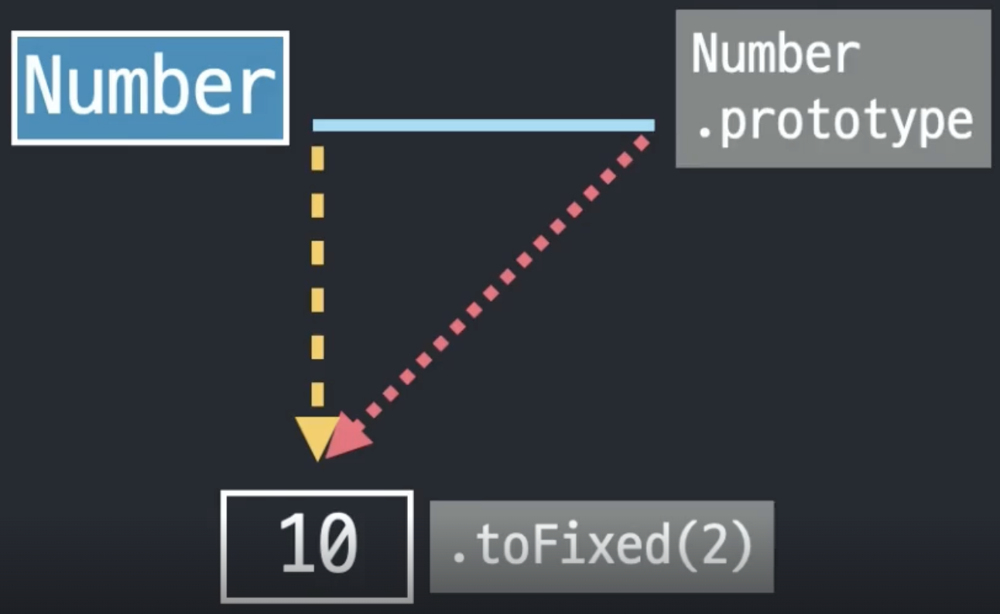

3. 프로토 타입에 있는 메서드를 적용해서 원하는 결과를 얻습니다.

   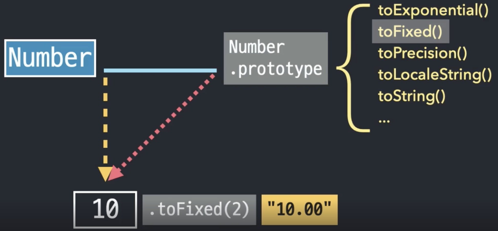

4. 결과를 얻으면 임시 인스턴스를 제거합니다.

   

#### 참조형 타입의 데이터

참조형 데이터는 처음부터 인스턴스이기 때문에 메서드를 호출할 때 기본형 타입의 데이터에서 사용한 방식을 거치지 않습니다.

## 4. instance로부터 prototype 프로퍼티에 직접 접근하는 법

instance에서 프로토 타입(`prototype`) 프로퍼티에 직접 접근하는 것을 알아보겠습니다.

프로토(`[[Prodotype]]`)가 프로토 타입(`prototype`)과 연결되어 있기 때문에 `instance.[[Prodotype]]`로 접근할 수 있을 것 같아 보입니다.
하지만 `instance.[[Prodotype]]`을 입력하면 에러가 납니다.

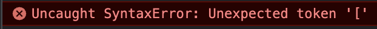

`instance.[[Prodotype]]` 대신 아래와 같이 입력하면 프로토 타입(`prototype`)에 접근할 수 있습니다.

```javascript
// 공식적인 방법
1. Object.getPrototypeOf(instance)

// 비공식적인 방법
1. instance.__proto__
```

### instance로부터 생성자 함수에 접근하는 예시

```javascript
function Person(name, age) {
  this.name = name;
  this.age = age;
}

// Person.prototype에 접근
const zima = new Person("robot", 100);
const mk0 = new Person.prototype.constructor("robot", 100);

const mk1 = new zima.constructor("robot", 80);
const mk3 = new Object.getPrototypeOf(zima).constructor("robot", 60);
const mk3 = new zima.__proto__.constructor("robot", 40);
```

## 5. 메서드 상속, 동작 원리

`Person` 생성자의 인스턴스인 `zima`와 `blue`에 `setOlder`와 `getAge` 메서드를 각각 만들었습니다.

```javascript
function Person(name, age) {
  this.name = name;
  this.age = age;
}
const zima = new Person("robot", 100);
const blue = new Person("AI", 1);

// Person의 instance를 만들고 해당 instance에 각각 메서드 추가
zima.setOlder = function () {
  this.age += 1;
};
blue.setOlder = function () {
  this.age += 1;
};

zima.getAge = function () {
  return this.age;
};
blue.getAge = function () {
  return this.age;
};
```

위의 코드와 동일하지만 코드를 줄이는 방법이 있습니다.
`setOlder`와 `getAge` 메서드를 인스턴스에 하나하나 추가하기보다 `Person` 생성자의 Prototype에 추가하는 것입니다.

`Person` 생성자의 `Prototype`에 추가된 메서드는 `[[Prototype]]`을 통해 새로 생성되는 모든 인스턴스에서 사용할 수 있습니다.

```javascript
function Person(name, age) {
  this.name = name;
  this.age = age;
}

// Person에 instance에서 사용할 메서드 추가
Person.prototype.setOlder = function () {
  this.age += 1;
};

Person.prototype.getAge = function () {
  return this.age;
};

// 인스턴스는 Person에 미리 추가된 메서드 사용 가능
const zima = new Person("robot", 100);
const blue = new Person("AI", 1);
```

## 6. 프로토타입 체이닝

`prototype` 프로퍼티 역시도 객체입니다.
객체인 `prototype` 프로퍼티도 `Object` 생성자 함수의 `new` 연산으로 생성된 인스턴스가 됩니다.
따라서 `prototype` 프로퍼티가 인스턴스라면 `prototype` 프로퍼티는 프로토(`[[Prototype]]`)를 갖습니다.
`prototype`의 프로토(`[[Prototype]]`)는`Object` 생성자 함수의 `prototype` 프로퍼티와 연결되어 있습니다.
이렇게 `prototype` 프로퍼티가 연결되어 있는 것을 프로토 타입 체인이라고 합니다.

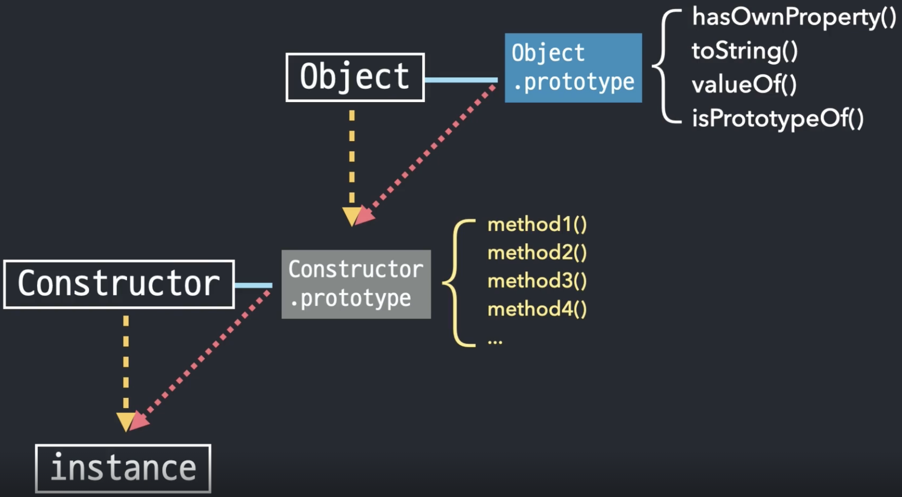

위와 같은 방식으로 모든 데이터는 Object 생성자 함수의 `prototype` 프로퍼티와 연결되어 있습니다.

객체의 `prototype`에 있는 메서드는 프로토 타입 체이닝을 통해 모든 데이터 타입에서 적용할 수 있습니다.

반면 객체전용 메서드는 객체 생성자 함수에 직접 정의되어 있습니다.

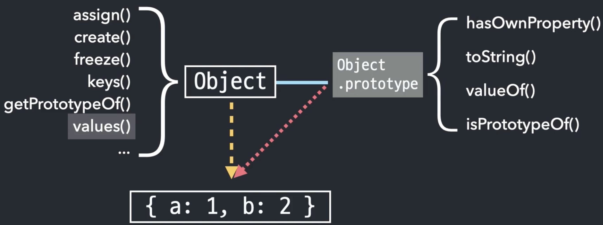

```javascript
// 객체전용 메서드는 instance가 아닌 Object로 사용
Object.assign(obj)
Object.create(obj)
Object.freeze(obj)
Object.keys(obj)
Object.getPrototypeOf(obj)
Object.values(obj)
...

```

## 참고

- [코어 자바스크립트](https://www.inflearn.com/course/%ED%95%B5%EC%8B%AC%EA%B0%9C%EB%85%90-javascript-flow?utm_source=google&utm_medium=cpc&utm_campaign=02.general_devlang&utm_content=javascript_dsa&utm_term=&gad=1&gclid=CjwKCAjw38SoBhB6EiwA8EQVLjG31YSA9XuFCesiK0stju7H9Ei3qTfvTRYDnsu_srKmorW6Rgys7RoC0EgQAvD_BwE)
- [넥스트리소프트](https://www.nextree.co.kr/p7323)
