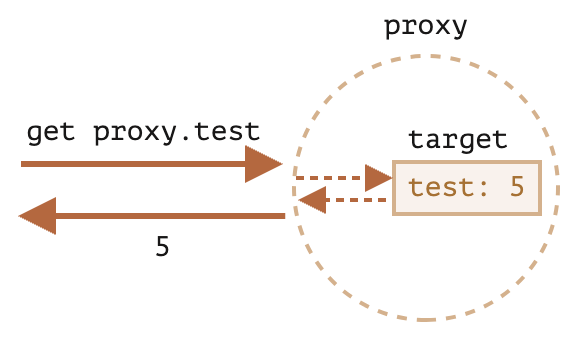

# Proxy와 Reflect

## Proxy

특정 객체를 감싸 프로퍼티 읽기, 쓰기와 같은 객체에 가해지는 작업을 중간에서 가로채는 객체입니다.

```js
let proxy = new Proxy(target, handler);
```

- `target`: 감싸게 될 객체로, 함수를 포함한 모든 객체가 가능합니다.

- `handler`: 동작을 가로채는 메서드인 '트랩(trap)'이 담긴 객체로, 여기서 프락시를 설정합니다.
  (예시: `get` 트랩은 `target`의 프로퍼티를 읽을 때, `set` 트랩은 `target`의 프로퍼티를 쓸 때 활성화됨)

### Proxy Trap

프록시 API의 핵심은 특정 개체의 연산을 위해 트랩을 만드는 것이며, 트랩은 Proxy 객체에서 원본 객체의 기본 동작을 가로채고(customize) 처리할 수 있는 `handler` 함수입니다.

| 트랩 이름                  | 설명                                                |
| -------------------------- | --------------------------------------------------- |
| `get`                      | 프로퍼티를 읽을 때 (ex: `obj.prop`)                 |
| `set`                      | 프로퍼티에 쓸 때 (ex: `obj.prop = value`)           |
| `has`                      | `in` 연산자가 동작할 때 (ex: `'prop' in obj`)       |
| `deleteProperty`           | `delete` 연산자가 동작할 때 (ex: `delete obj.prop`) |
| `ownKeys`                  | 키 조회할 때 (ex: `Object.keys(obj)`)               |
| `apply`                    | 함수를 호출할 때 (ex: `func()`)                     |
| `construct`                | `new` 연산자가 동작할 때 (ex: `new Foo()`)          |
| `defineProperty`           | 속성 정의할 때 (ex: `Object.defineProperty()`)      |
| `getOwnPropertyDescriptor` | 속성 설명자 조회할 때                               |
| `preventExtensions`        | 확장 금지 (ex: `Object.preventExtensions(obj)`)     |
| `isExtensible`             | 확장 가능 여부 확인                                 |
| `getPrototypeOf`           | 프로토타입 조회                                     |
| `setPrototypeOf`           | 프로토타입 설정                                     |

#### 트랩이 없는 프락시를 사용한 예시

아래의 예시의 프락시엔 트랩이 없기 때문에 proxy에 가해지는 모든 작업은 `target`에 전달됩니다.

```js
let target = {};
let proxy = new Proxy(target, {}); // 빈 핸들러

// 프락시에 값을 씀 -- (1)
proxy.test = 5;

// target에 새로운 프로퍼티가 생김
alert(target.test); // 5

// 프락시를 사용해 값을 읽기 -- (2)
alert(proxy.test); // 5,

// 반복도 동작 -- (3)
for (let key in proxy) alert(key); // test
```

트랩이 없으면 proxy는 `target`을 둘러싸는 투명한 래퍼가 됩니다.



### get 트랩

```js
get(target, property, receiver);
```

- `target`: 동작을 전달할 객체로 new Proxy의 첫 번째 인자입니다.

- `property`: 프로퍼티 이름

- `receiver`: 타깃 프로퍼티가 getter라면 `receiver`는 getter가 호출될 때 `this` 입니다.\
  대개는 proxy 객체 자신이 `this`가 됩니다.\
  프락시 객체를 상속받은 객체가 있다면 해당 객체가 `this`가 되기도 합니다.

#### get 트랩 예시 1

```js
let numbers = [0, 1, 2];

const numbersHandler = {
  get(target, property) {
    if (property in target) {
      return target[property];
    } else {
      return 0; // 기본값을 0으로 설정
    }
  },
};

const numbers = new Proxy(numbers, numbersHandler);

alert(numbers[1]); // 1
alert(numbers[123]); // 0 (해당하는 요소가 배열에 없으므로 0이 반환됨)
```

#### get 트랩 예시 2

```js
let dictionary = {
  Hello: "안녕하세요",
  Bye: "안녕히 가세요",
};

dictionary = new Proxy(dictionary, {
  get(target, property) {
    // 프로퍼티를 읽기를 가로챕니다.
    if (property in target) {
      // 조건: 사전에 구절이 있는 경우
      return target[property]; // 번역문을 반환합니다
    } else {
      // 구절이 없는 경우엔 구절 그대로를 반환합니다.
      return property;
    }
  },
});

// dictionary에 없는 구절을 입력하면 입력값이 그대로 반환됩니다.
alert(dictionary["Hello"]); // 안녕하세요
alert(dictionary["Welcome to Proxy"]); // Welcome to Proxy (입력값이 그대로 출력됨)
```

#### get 트랩 예시 3

```js
const course = {
  title: "JavaScript - The Complete Guide",
};

const courseHandler = {
  get(obj, property) {
    console.log(property); // title, length, rating
    if (property === "length") {
      return 0;
    }
    return obj[property] || "NOT FOUND";
  },
};

const pCourse = new Proxy(course, courseHandler);

console.log(pCourse.title); // JavaScript - The Complete Guide
console.log(pCourse.length); // 0
console.log(pCourse.rating); // NOT FOUND
```

### set 트랩

```js
set(target, property, value, receiver);
```

- `target`: 동작을 전달할 객체로 `new Proxy`의 첫 번째 인자입니다.

- `property`: 프로퍼티 이름

- `value`: 프로퍼티 값

- `receiver`: `get` 트랩과 유사하게 동작하는 객체로, setter 프로퍼티에만 관여합니다.

`set` 트랩을 사용할 땐 값을 쓰는 게 성공했을 때 반드시 `true`를 반환해줘야 합니다.\
`true`를 반환하지 않았거나 falsy한 값을 반환하게 되면 TypeError가 발생합니다.

#### set 트랩 예시 1

```js
let numbers = [];

numbers = new Proxy(numbers, {
  // (*)
  set(target, property, value) {
    // 프로퍼티에 값을 쓰는 동작을 가로챕니다.
    if (typeof value == "number") {
      target[property] = value;
      return true;
    } else {
      return false;
    }
  },
});

numbers.push(1); // 추가가 성공했습니다.
numbers.push(2); // 추가가 성공했습니다.
alert("Length is: " + numbers.length); // 2

numbers.push("test"); // Error: 'set' on proxy

alert("윗줄에서 에러가 발생했기 때문에 이 줄은 절대 실행되지 않습니다.");
```

#### set 트랩 예시 2

```js
const course = {
  title: "JavaScript - The Complete Guide",
};

const courseHandler = {
  get(obj, property) {
    console.log(property); // title, length, rating
    if (property === "length") {
      return 0;
    }
    return obj[property] || "NOT FOUND";
  },
  set(obj, property, value) {
    if (property === "title") {
      return true;
    }
    obj[property] = value;

    return true;
  },
};

const pCourse = new Proxy(course, courseHandler);

pCourse.rating = "5";
pCourse.title = "Python";

console.log(pCourse.title); // JavaScript - The Complete Guide
console.log(pCourse.length); // 0
console.log(pCourse.rating); // 5
```

### Proxy 주의

- 객체를 프락시로 감싼 이후엔 절대로 타깃 객체를 참조하는 코드가 없어야 합니다.
- 값을 쓰는 게 성공적으로 처리되었으면 [[Set]]은 반드시 true를 반환해야 합니다.\
  그렇지 않은 경우는 false를 반환해야 합니다.
- 값을 지우는 게 성공적으로 처리되었으면 [[Delete]]는 반드시 true를 반환해야 합니다.\
  그렇지 않은 경우는 false를 반환해야 합니다.
- 프락시 객체를 대상으로 [[GetPrototypeOf]]가 적용되면 프락시 객체의 타깃 객체에 [[GetPrototypeOf]]를 적용한 것과 동일한 값이 반환되어야 합니다.

### Proxy와 Reflect 활용 예시

#### 존재하지 않는 프로퍼티를 읽으려고 할 때 에러 던지기

존재하지 않는 프로퍼티 값을 읽으려고 하면 보통은 `undefined`가 반환됩니다.\
`undefined` 대신 에러를 던지는 프락시를 만들어봅시다.\
이렇게 해 놓으면 프로그래밍 중에 저지르는 실수를 미연에 방지할 수 있을 겁니다.\
객체 `target`을 받는 함수 `wrap(target)`를 만들고 위에서 언급한 기능을 구현하여 함수 `wrap(target)`이 프락시를 반환하도록 해보세요.\
함수는 아래와 같이 동작해야 합니다.

```js
let user = {
  name: "John",
};

function wrap(target) {
  return new Proxy(target, {
    get(target, prop, receiver) {
      if (prop in target) {
        return Reflect.get(target, prop, receiver);
      } else {
        throw new ReferenceError(`Property doesn't exist: "${prop}"`);
      }
    },
  });
}

user = wrap(user);

alert(user.name); // John
alert(user.age); // ReferenceError: Property doesn't exist "age"
```

#### 음수 인덱스를 사용해 배열 요소에 접근하기

아래의 예시처럼 몇몇 프로그래밍 언어는 음수 인덱스를 사용해 배열 끝을 기준으로 요소에 접근할 수 있게 해줍니다.\
`array[-N]`는 `array[array.length - N]`와 동일합니다.

```js
let array = [1, 2, 3];

array[-1]; // 3, 마지막 요소
array[-2]; // 2, 뒤에서 두 번째 요소
array[-3]; // 1, 뒤에서 세 번째 요소
```

음수 인덱스를 사용해 배열 요소에 접근할 수 있도록 해주는 프락시를 만들수 있습니다.

```js
let array = [1, 2, 3];

array = new Proxy(array, {
  get(target, prop, receiver) {
    if (prop < 0) {
      // arr[1] 같은 형태로 배열 요소에 접근하는 경우에도
      // prop은 문자열이기 때문에 숫자로 바꿔줘야 합니다.
      prop = +prop + target.length;
    }
    return Reflect.get(target, prop, receiver);
  },
});

alert(array[-1]); // 3
alert(array[-2]); // 2
```

#### Observable 만들기

프락시를 반환해 ‘객체를 observable 하게 만들어주는’ 함수를 만들 수 있습니다.

```js
let handlers = Symbol("handlers");

function makeObservable(target) {
  // 1. 핸들러를 저장할 곳을 초기화합니다.
  target[handlers] = [];

  // 나중에 호출될 것을 대비하여 핸들러 함수를 배열에 저장합니다.
  target.observe = function (handler) {
    this[handlers].push(handler);
  };

  // 2. 변경을 처리할 프락시를 만듭니다.
  return new Proxy(target, {
    set(target, property, value, receiver) {
      let success = Reflect.set(...arguments); // 동작을 객체에 전달합니다.
      if (success) {
        // 에러 없이 프로퍼티를 제대로 설정했으면
        // 모든 핸들러를 호출합니다.
        target[handlers].forEach((handler) => handler(property, value));
      }
      return success;
    },
  });
}

let user = {};

user = makeObservable(user);

user.observe((key, value) => {
  alert(`SET ${key}=${value}`);
});

user.name = "John";
```

## Reflect

`Reflect`는 `Object`가 하던 작업을 더 정직하고 일관된 방식으로 수행하는 함수 집합입니다.\
객체에 대한 기본적인 연산(속성 접근, 설정, 삭제 등)을 함수 형태로 제공합니다.

### Reflect와 Object의 차이점

| 기능                        | Object 사용 방식                          | Reflect 대체 메서드                        | 차이점 요약        |
| --------------------------- | ----------------------------------------- | ------------------------------------------ | ------------------ |
| 속성 읽기                   | `obj[prop]`                               | `Reflect.get(obj, prop)`                   | 동일 기능          |
| 속성 설정                   | `obj[prop] = value`                       | `Reflect.set(obj, prop, value)`            | 실패 시 false 반환 |
| 속성 삭제                   | `delete obj[prop]`                        | `Reflect.deleteProperty(obj, prop)`        | 실패 시 false 반환 |
| 프로토타입 가져오기         | `Object.getPrototypeOf(obj)`              | `Reflect.getPrototypeOf(obj)`              | 동일               |
| 프로토타입 설정             | `Object.setPrototypeOf(obj, proto)`       | `Reflect.setPrototypeOf(obj, proto)`       | 실패 시 false      |
| 확장 가능 여부 확인         | `Object.isExtensible(obj)`                | `Reflect.isExtensible(obj)`                | 동일               |
| 확장 금지 설정              | `Object.preventExtensions(obj)`           | `Reflect.preventExtensions(obj)`           | 동일               |
| 속성 정의                   | `Object.defineProperty(obj, prop, desc)`  | `Reflect.defineProperty(obj, prop, desc)`  | 실패 시 false      |
| 속성 설명자 조회            | `Object.getOwnPropertyDescriptor(obj, p)` | `Reflect.getOwnPropertyDescriptor(obj, p)` | 동일               |
| 모든 키 조회                | `Object.keys(obj)`                        | `Reflect.ownKeys(obj)`                     | Symbol 포함        |
| 속성 존재 여부 확인         | `'prop' in obj`                           | `Reflect.has(obj, prop)`                   | 동일               |
| 함수 호출 (`fn(...)`)       | 없음                                      | `Reflect.apply(fn, thisArg, argsArray)`    | 함수처럼 사용 가능 |
| 생성자 호출 (`new Fn(...)`) | 없음                                      | `Reflect.construct(Fn, args)`              | 생성자 함수 실행   |

### Reflect 사용하는 경우

- Proxy 트랩 내에서 원래 연산을 안전하게 전달할 때

- 동작 성공 여부를 `boolean`으로 간단히 판별하고 싶을 때

- `apply`, `construct`처럼 연산자를 함수처럼 써야 할 때

- `try`/`catch` 없이도 실패 제어 흐름을 만들고 싶을 때

### Reflect 사용 예제

#### Reflect로 속성 설정

```js
const obj = {};
Reflect.set(obj, "name", "John");
console.log(obj.name); // "John"
```

#### Reflect로 속성 삭제

```js
const user = { age: 30 };
Reflect.deleteProperty(user, "age"); // true
console.log(user.age); // undefined
```

#### Reflect로 함수 호출

```js
function greet(name) {
  return `Hello, ${name}`;
}
console.log(Reflect.apply(greet, null, ["Lee"])); // Hello, Lee
```

### Reflect로 생성자 호출

```js
function User(name) {
  this.name = name;
}
const newUser = Reflect.construct(User, ["Jane"]);
console.log(newUser.name); // Jane
```

## Proxy에서 Reflect 사용하기

Reflect는 Proxy 생성을 단순하게 해주는 내장 객체입니다.\

### Proxy Trap과 Reflect의 메소드 비교

Reflect의 메소드는 Proxy의 트랩과 1:1로 매칭됩니다.

|    Proxy Trap    |        연산         |            Reflect 호출             |  내부 메서드  |
| :--------------: | :-----------------: | :---------------------------------: | :-----------: |
|      `get`       |     `obj[prop]`     |      `Reflect.get(obj, prop)`       |    [[Get]]    |
|      `set`       | `obj[prop] = value` |   `Reflect.set(obj, prop, value)`   |    [[Set]]    |
| `deleteProperty` | `delete obj[prop]`  | `Reflect.deleteProperty(obj, prop)` |  [[Delete]]   |
|   `construct`    |   `new F(value)`    |    `Reflect.construct(F, value)`    | [[Construct]] |
|       ...        |         ...         |                 ...                 |      ...      |

### Proxy에서 Reflect를 사용하는 이유

Proxy가 가로챌 수 있는 모든 내부 메서드에는 Reflect에 동일한 이름과 인자를 가진 대응 메서드가 있다는 것이 중요합니다.\
Reflect를 사용하여 해당 연산을 원래 객체로 "전달(forward)"할 수 있습니다.

아래 예제에서는 `get`과 `set` 트랩이 읽기/쓰기 연산을 원래 객체에 투명하게 전달(forward)하면서 메시지를 보여줍니다.

```js
let user = {
  name: "John",
};

user = new Proxy(user, {
  get(target, prop, receiver) {
    alert(`GET ${prop}`);
    return Reflect.get(target, prop, receiver); // (1)
  },
  set(target, prop, val, receiver) {
    alert(`SET ${prop}=${val}`);
    // 성공하면 true, 실패하면 false를 반환
    return Reflect.set(target, prop, val, receiver); // (2)
  },
});

let name = user.name; // "GET name" 출력
user.name = "Pete"; // "SET name=Pete" 출력
```

트랩이 해당 연산을 원래 객체로 전달하고 싶다면, 동일한 인자를 넣어 `Reflect.<메서드>`를 호출하면 간단해집니다.

### Proxy에서 receiver 인자를 써야 하는 이유

대부분의 경우, Reflect 없이도 동일한 작업을 할 수 있습니다.\
예를 들어,`Reflect.get(target, prop, receiver)`는 단순히 `target[prop]`으로도 대체 가능합니다.

```js
let user = {
  _name: "Guest",
  get name() {
    return this._name;
  },
};

let userProxy = new Proxy(user, {
  get(target, prop, receiver) {
    return target[prop];
  },
});

alert(userProxy.name); // Guest
```

하지만 `user` 객체를 상속한 또 다른 객체 `admin`을 만든다면 문제가 생깁니다.

```js
let user = {
  _name: "Guest",
  get name() {
    return this._name;
  },
};

let userProxy = new Proxy(user, {
  get(target, prop, receiver) {
    return target[prop]; // (*) target = user
  },
});

let admin = {
  __proto__: userProxy,
  _name: "Admin",
};

// 기대값: "Admin"
alert(admin.name); // 결과: "Guest" (?!?)
```

- `dmin.name`을 읽으려 할 때, `admin` 객체에는 `name`이라는 속성이 없으므로 프로토타입 체인을 따라 검색합니다.

- `admin.__proto__`는 `userProxy`이므로, `userProxy`의 `get` 트랩이 실행됩니다.

- 그리고 `target[prop]`은 실제로 `user[prop]`이고, `user`의 `name` getter가 실행됩니다.

문제는 여기서 getter는 `this._name`을 참조하는데, `this`가 `user`로 고정되어 있다는 점입니다.\
그래서 `user._name` = "Guest"를 반환하게 된 것입니다.

## 참고

- [Proxy와 Reflect](https://ko.javascript.info/proxy)
