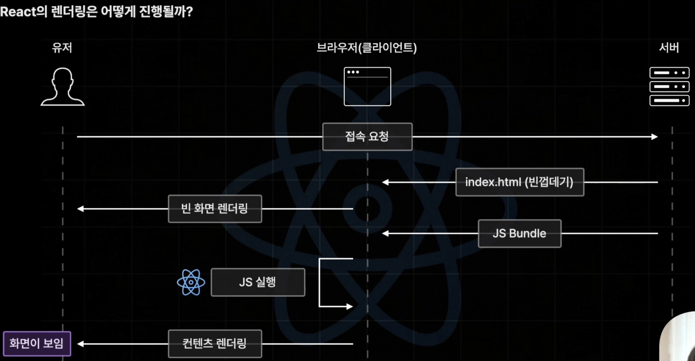
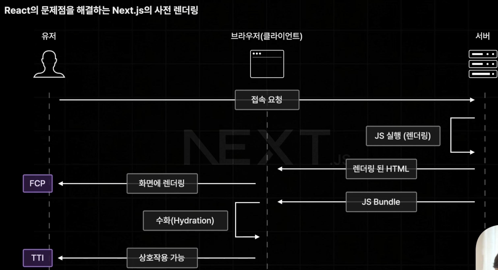
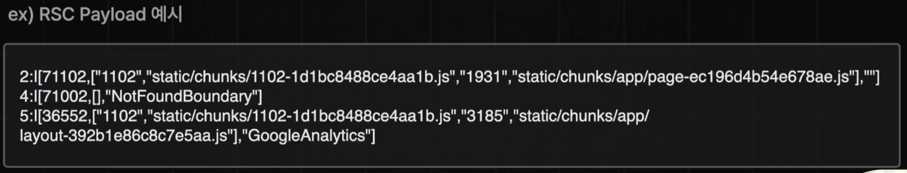

# Next.js

## React와 Next.js의 차이

### React의 Client Side Rendering



#### React의 장점


JS Bundle에 서비스에 접근 가능한 모든 컴포넌트 코드가 존재하기 때문에 초기 접속 과정 이후 서버에 요청 없이 JS 실행으로 페이지를 전환할 수 있습니다.\
따라서 초기 접속 과정 이후 페이지 이동이 매우 빠르고 쾌적합니다.

#### React의 단점


대신 초기 접속 속도가 느립니다.

- FCP가 3sec 이상일 경우 이탈율 32% 증가
- FCP가 5sec 이상일 경우 이탈율 90% 증가
- FCP가 6sec 이상일 경우 이탈율 106% 증가
- FCP가 10sec 이상일 경우 이탈율 123% 증가

### Next.js를 사용하는 이유

Nest.js는 렌더링 과정에서 서버측에서 JS로 미리 렌더링합니다.



이후 클라이언트 컴포넌트를 실행하여 바로 상호작용은 되지 않지만 완성된 html을 사전 렌더링하기 때문에 빠른 FCP를 달성하였습니다.\
단, JS Bundle은 현재 페이지에 필요한 JS Bundle만 전달 됩니다.


또한 초기 접속 과정 이후에는 React의 방식 그대로 처리하여 빠른 페이지 이동을 그대로 가져갔습니다.

- 화면에 렌더링: HTML 코드를 브라우저가 화면에 그려내는 작업
- JS 렌더링: 자바스크립트 코드(React 컴포넌트)를 HTML로 변환하는 과정
- TTI(Time To Interactive): 상호작용까지 가능해진 시점
- Hydration: JS 코드를 기존 HTML 요소들과 연결
- Pre Fetching: 현재 페이지에 링크등을 통해 이동할 가능성 있는 모든 페이지의 데이터를 미리 불러오는 것.


여기서 JS Bundle은 용량을 줄이기 위해 요청 페이지의 JS Bundle만 전달 됩니다.\
이후 이동할 페이지의 데이터를 미리 불러오는 Pre Fetching 기능을 통해 현재 페이지에서 이동할 수 있는 모든 페이지의 JS 코드를 불러옵니다.

#### app router에서의 차이점

JS 실행을 하여 사전 렌더링 할 때, 서버 컴포넌트만 따로 먼저 실행하고 이후에 클라이언트 컴포넌트를 실행합니다.


서버 컴포넌트를 실행하면 RSC Payload라는 JSON과 비슷한 형태의 문자열이 생성됩니다.

#### RSC Payload

RSC Payload는 React Server Component의 순수한 데이터이며 직렬화 한 결과입니다.

RSC Payload에는 서버 컴포넌트의 렌더링 결과, 연결된 클라이언트 컴포넌트의 위치, 클라이언트 컴포넌트에게 전달하는 Props의 값을 포함합니다.



app router의 경우 page router와 다르게 서버 컴포넌트를 사용합니다.\
서버 컴포넌트는 RSC Payload라는 JSON과 비슷한 형태의 문자열로 표현됩니다.\
클라이언트 컴포넌트를 포함하는 JS Bundle과 서버 컴포넌트인 RSC Payload를 함께 전달합니다.


## App Router vs. Page Router

Next.js는 13버전부터 새로운 라우팅 방식인 App Router를 도입했습니다.\
App Router는 React 18의 최신 기능을 중심으로, 더 유연하고 선언적인 방식으로 진화한 구조입니다.\
중첩 레이아웃, 서버 컴포넌트, 데이터 스트리밍, 폴더 기반 명확한 라우팅이 큰 장점입니다.

App Router는 Pages Router에 비해 성능이 다소 떨어질 수 있지만, DOM 태그 수가 많아질수록 성능 차이가 줄어드는 경향이 있습니다.\
따라서 프로젝트의 규모가 커질수록 App Router의 구조적인 이점이 두드러지며, 새로운 기능을 적극 활용하려면 App Router 사용을 추천합니다.

### 페이지 라우팅 설정 방식 변경

#### Pages Router 라우팅 설정 방식

기존 방식은 파일 기반 라우팅으로, `pages` 폴더 하위에 파일을 생성하면 해당 경로가 자동으로 라우팅됩니다.

```plain
src/
└── pages
    ├── about.js
    ├── index.js
    └── team.js
```

#### App Router 라우팅 설정 방식

App Router는 폴더 기반 라우팅입니다.\
각 폴더 안에 `page.js`, `layout.js`, `loading.js`, `error.js` 등 다양한 UI 역할을 하는 파일을 추가할 수 있어 구조적인 표현이 명확해졌습니다.

```plain
src/
└── app
    ├── about
    │   └── page.js
    ├── globals.css
    ├── layout.js
    ├── login
    │   └── page.js
    ├── page.js
    └── team
        └── route.js
```

### 레이아웃 설정 방식 변경

#### Pages Router 레이아웃 설정 방식

- `_app.js`와 `_document.js`를 사용해 전체 레이아웃과 초기 HTML 구조를 설정합니다.
- 페이지마다 레이아웃을 재사용하려면 HOC나 `getLayout` 패턴을 사용해야 했습니다.

#### App Router 레이아웃 설정 방식

- `layout.js` 파일로 영역별 중첩 레이아웃이 가능해졌습니다.
- 각 폴더에 `layout.js`를 두면 해당 경로 이하의 모든 페이지에서 자동으로 해당 레이아웃을 공유합니다.

```plain
src/
└── app
    ├── market
    │   ├── buy
    │   │   ├── page.js
    │   │   └── layout.js
    │   ├── sell
    │   │   └── page.js
    │   ├── layout.js
```

```jsx
// app/market/layout.js
export default function layout({ children }) {
  return (
    <section>
      <h1>About Section</h1>
      {children}
    </section>
  );
}
```

### 데이터 페팅 방식 변경

#### Pages Router 데이터 페팅 방식 변경

- `getServerSideProps`, `getStaticProps`, `getInitialProps` 등을 사용.

- 클라이언트와 서버 사이의 구분이 명확하지 않아 혼동되기도 했습니다.

#### App Router 데이터 페팅 방식 변경

- `fetch`, `async`/`await` 기반의 서버 컴포넌트(Server Components) 중심.

- React의 `use`와 같은 새로운 기능으로 서버에서 직접 데이터 fetch 가능.

- 클라이언트 컴포넌트는 `"use client"` 지시어를 통해 명시적으로 선언.

### React 18 신규 기능 추가

- React Server Component (RSC): 클라이언트 번들 크기를 줄이고, 서버에서 렌더링된 HTML을 빠르게 전달.

- Streaming: 일부 UI를 먼저 보여주고, 데이터가 로드되는 대로 나머지를 이어서 보여주는 점진적 렌더링 지원.

- Suspense와 loading.js 파일을 통한 로딩 UI 설정.

## 참고

- [한 입 크기로 잘라먹는 Next.js(15+)](https://www.udemy.com/course/onebite-next/)
- [[Next.js] App Router에 대해서 (+ Pages Router와 비교)](https://dygreen.tistory.com/entry/Nextjs-App-Router-%EC%97%90-%EB%8C%80%ED%95%B4%EC%84%9C-Pages-Router%EC%99%80-%EB%B9%84%EA%B5%90)
