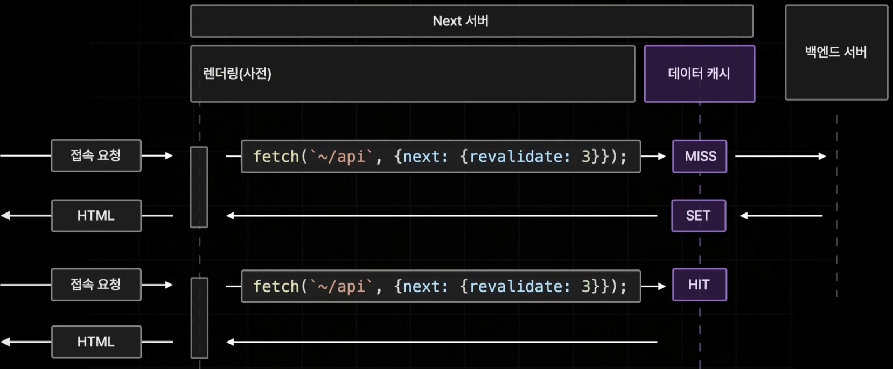
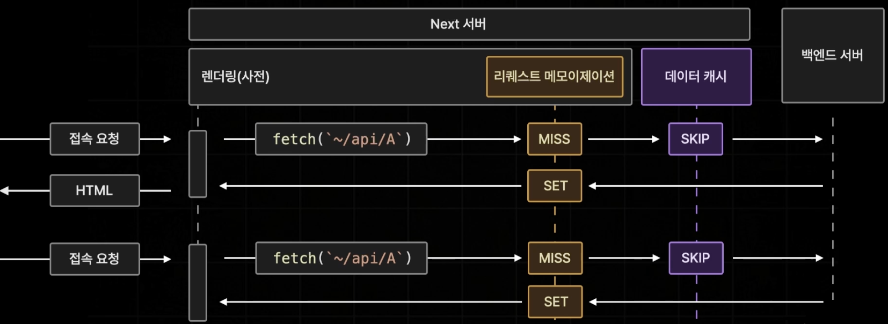

# Caching in Next.js

캐싱은 불필요한 데이터 요청의 수를 줄여, 웹 서비스의 성능을 크게 개선할 수 있습니다.

|      Mechanism      |         What         | Where  |                 Purpose                  |             Duration             |
| :-----------------: | :------------------: | :----: | :--------------------------------------: | :------------------------------: |
|     Data Cache      |        데이터        | Server |    사용자 요청 및 배포 간 데이터 저장    | 서버 가동중 영구적 (재검증 가능) |
| Request Memoization |    함수의 반환 값    | Server | React Component 트리에서 데이터를 재사용 |      요청 라이프사이클 동안      |
|  Full Route Cache   | HTML 및 RSC 페이로드 | Server |      렌더링 비용 절감 및 성능 향상       |       지속적 (재검증 가능)       |
|    Router Cache     |     RSC 페이로드     | Client |       네비게이션 시 서버 요청 감소       |    사용자 세션 또는 시간 기반    |

## Data Cache (서버로부터 불러온 데이터 보관)

`fetch` 메서드를 활용해 백엔드 서버로부터 불러온 데이터를 Next 서버에서 보관하는 기능입니다.\
서버 가동중에는 영구적으로 데이터를 보관하거나, 특정 시간을 주기로 갱신 시키는 것도 가능합니다.

Next에서 `fetch`의 두 번째 인수에 옵션으로 적용할 수 있습니다.

### 예시

```tsx
const response = await fetch(`~/api`, { cache: "force-cache" });
```

#### 1. `{ cache: "no-store" }`

캐싱을 하지 않도록 설정하여 데이터 페칭의 결과를 저장하지 않습니다. (15버전의 기본값)


#### 2. `{ cache: "force-cache" }`

요청의 결과를 무조건 캐싱하며 한 번 호출 된 이후에는 다시 호출되지 않습니다.\
캐싱된 데이터는 JSON 형태로 Next의 서버에 보관됩니다.


#### 3. `{ next: { revalidate: 10 } }`

Page Router의 ISR 방식과 비슷하게 특정 시간을 주기로 캐시를 업데이트 합니다.




#### 4. `{ next: { tag: ['a'] } }`

Page Router의 On-Demand ISR 방식과 비슷하게 요청이 들어왔을 때 데이터를 최신화 합니다.\
특정 태그를 붙일 수 있는 옵션으로 태그를 통해 데이터 캐시를 초기화 하거나 재검증 시키도록 설정할 수 있습니다.

```ts
// 태그로 데이터 캐시
fetch(`https://...`, { next: { tags: ["a", "b", "c"] } });
```

그런 다음, 태그와 함께 `revalidateTag`를 호출하여 캐시 항목을 제거할 수 있습니다:

```ts
// 특정 태그가 있는 항목을 재검증
revalidateTag("a");
```

#### 5. `Route Segment`

`Route Segment` 옵션을 사용하면 `Page`, `Layout` 또는 Route Handler의 동작을 직접 내보내는 다음 변수를 통해 구성할 수 있습니다.

- `export const revalidate = 5`

  `revalidate`라는 이름을 사용하는 상수를 export로 내보내면 `{ next: { revalidate: 10 } }`와 동일한 효과를 볼 수 있습니다.

  ```tsx
  export const revalidate = 3600; // 최대 1시간마다 revalidate

  fetch(`https://...`);
  ```

- `export const dynamic = "force-dynamic`

  fetch 요청에서 캐시 설정을 `{ cache: "no-store" }`로 설정한 것과 같습니다.\
   `force-dynamic`은 NextJS에 파일 내 어디에서든 필요한 모든 데이터를 항상 다시 가져오도록 지시합니다.

  ```tsx
  export const dynamic = "force-dynamic";

  fetch(`https://...`);
  ```

## Request Memoization (중복된 API 요청을 하나의 요청으로)

중복된 API 요청을 하나의 요청으로 합쳐주는 기능입니다.\
오직 하나의 페이지를 렌더링 하는 동안에만 중복된 API 요청을 캐싱하기 위해 존재합니다.\
Next에서 자동으로 동작합니다.


렌더링이 종료되면 모든 캐시가 소멸됩니다.



### Request Memoization 사용 이유

Page Router 에서는 서버측에서 데이터를 fetching 하기 위해서 `getServerSideProps`, `getStaticProps` 같은 서버 측에서만 실행되는 함수를 사용했습니다.\
page 컴포넌트에게는 데이터를 props로 넘겨주는 방식을 사용했습니다.

App Router에서는 서버 컴포넌트를 도입하면서 컴포넌트가 각각 자신에게 필요한 데이터를 직접 fetching 하는 방식으로 진행됩니다.\
이러한 패턴을 사용하다 보니동일한 데이터를 필요로 하는 예외적인 경우가 생기게 되면서 이러한 문제점을 해결하기 위해서 자동으로 제공하기 시작했습니다.

#### Request Memoization 참고

같은 경로의 요청이라도 다른 헤더 구성을 가지고 있다면 중복 요청은 피할 수 없습니다.

```tsx
// 이렇게 headers가 다르면 두 번 요청합니다.

const response = await fetch("http://localhost:8080/messages", {
  headers: {
    "X-ID": "layout",
  },
});

const response = await fetch("http://localhost:8080/messages", {
  headers: {
    "X-ID": "page",
  },
});
```

```tsx
// 이 경우 요청은 한번 이루어 집니다.

const response = await fetch("http://localhost:8080/messages");

const response = await fetch("http://localhost:8080/messages");
```

## Full Route Cache (빌드될 때(빌드 타임) 특정 페이지의 렌더링 결과를 캐싱)

Next 서버측에서 프로젝트가 빌드될 때(빌드 타임) 특정 페이지의 렌더링 결과를 캐싱하는 기능입니다.


`/a` 페이지가 빌드 될 때 렌더링을 완료하게 되면 생성 결과를 풀 라우트 캐시라는 이름으로 서버에 저장하게 됩니다.\
이 후 페이지가 실제로 접속 요청을 받고 사용되면 렌더링 없이 캐시된 페이지를 브라우저에 전송합니다.

단, 모든 페이지가 풀 라우트 캐시에 저장되지는 않습니다.

### Dynamic Page와 Static Page

Next에 존재하는 모든 페이지는 해당 페이지에 있는 서버 컴포넌트들의 동적 함수 사용과 데이터 캐시 설정에 따라서 Dynamic Page와 Static Page로 분류가 됩니다.\
(클라이언트 컴포넌트는 페이지 유형에 영향을 미치지 않음)

풀 라우트 캐시는 Static Page에만 적용됩니다.\
따라서 될 수 있으면 최대한 많은 페이지가 Static Page가 되도록 하여 풀 라우트 캐시를 사용하는 것이 좋습니다.

#### Dynamic Page와 Static Page의 분류 기준

특정 페이지가 접속 요청을 받을 때 마다 매번 변화가 생기거나, 데이터가 달라지는 경우 Dynamic Page로 분류합니다.

| 동적 함수 사용 | 데이터 캐시 사용 | 페이지 분류  | 풀 라우트 캐시 제공 |
| :------------: | :--------------: | :----------: | :-----------------: |
|       O        |        X         | Dynamic Page |          X          |
|       O        |        O         | Dynamic Page |          X          |
|       X        |        X         | Dynamic Page |          X          |
|       X        |        O         | Static Page  |          O          |

예를 들어,

1. 캐시되지 않는 Data Fetching을 사용할 경우\
   (Cache 옵션이 존재하지 않거나 `{ cache: "no-store" }`인 경우)

   ```jsx
   async function Comp() {
     const response = await fetch("...");

     return <div>...</div>;
   }
   ```

   ```jsx
   async function Comp() {
     const response = await fetch("...", { cache: "no-store" });

     return <div>...</div>;
   }
   ```

2. 동적 함수를 사용하는 컴포넌트가 있을 경우\
   (쿠키, 헤더, 쿼리스트링)

   ```jsx
   import { cookies } from "next/headers";

   async function Comp() {
     const cookieStore = cookies();
     const theme = cookieStore.get("theme");

     return <div>...</div>;
   }
   ```

   ```jsx
   import { headers } from "next/headers";

   async function Comp() {
     const cookieStore = headers();
     const authorization = headersList.get("authorization");

     return <div>...</div>;
   }
   ```

   ```jsx
   async function Page({ searchParams }: { searchParams: { q: string } }) {
     const q = searchParams.q;

     return <div>...</div>;
   }
   ```

Dynamic Page가 아닌 모든 페이지는 Static Page로 분류 됩니다.

#### 풀 라우트 캐시 제공 가능한 Static Page


#### 풀 라우트 캐시 제공 불가한 Dynamic Page


#### revalidate가 되어있는 fetching을 사용할 경우의 풀 라우트 캐시

데이터가 새롭게 갱신될 때 다른 캐시와 함께 풀 라우트 캐시도 새로 갱신이 됩니다.


## Router Cache (한 번 접속한 페이지의 Layout만 따로 보관)

브라우저에 저장되는 캐시로 페이지 이동을 효율적으로 진행하기 위해 페이지의 일부 데이터를 보관함입니다.

여러 Page가 공통된 Layout을 사용하는 경우 중복된 데이터(RSC payload)를 여러차례 브라우저에서 요청하거나 전달받게 되는 문제가 발생할 수 있습니다.


브라우저 측에 Client Router Cache라는 Cache 공간을 추가합니다.\
페이지에 접속할 때 서버로 부터 전달 받게 되는 데이터(RSC payload) 중에 중복된 레이아웃에 해당하는 부분만 따로 추출합니다.\
Next.js는 추출한 부분을 Client Router Cache 라는 이름으로 보관하도록 자동으로 설정합니다.

Router Cache는 한 번 접속한 페이지의 Layout만 따로 보관하여 나중에 페이지 이동이 추가로 발생하게 되었을 때 해당하는 페이지의 공통된 Layout을 서버로 부터 중복되게 불러오지 않을 수 있도록 최적화 해주는 기술입니다.

> 브라우저를 새로고침을 하거나 탭을 끄는 경우 Client Router Cache는 사라집니다.
