# Data Fetching

## React와 Next.js의 Data Fetching 비교

### React의 Data Fetching

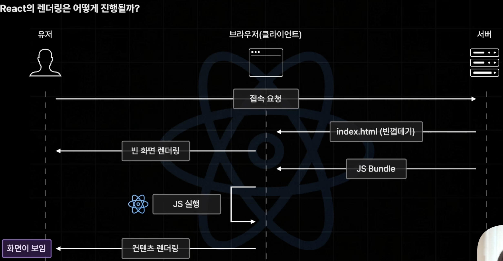

React는 FCP 이후(컴포넌트 마운트 이후) 백엔드 서버에 데이터 요청을 하기 때문에 데이터가 포함된 페이지를 보게 될 때까지 시간이 오래 걸립니다.

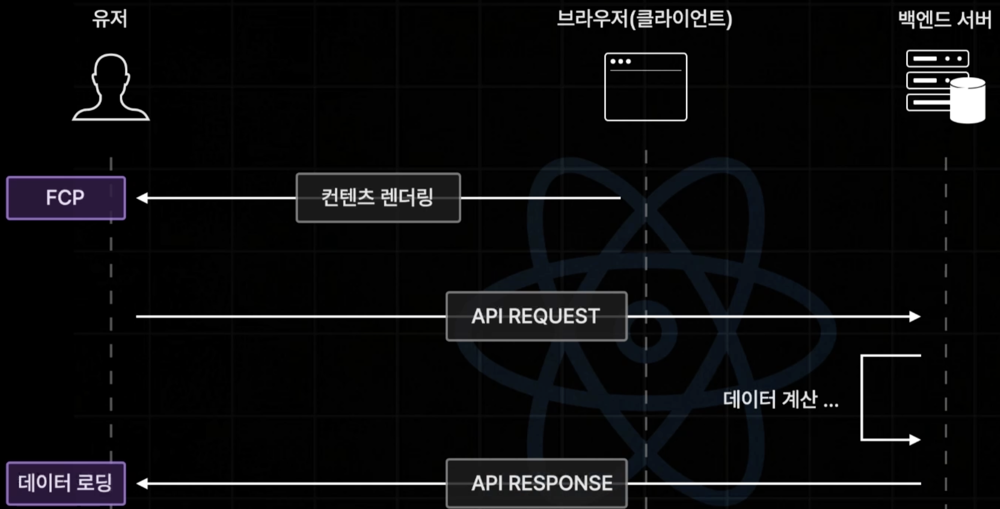

### Next.js의 Data Fetching

#### 서버사이드 렌더링 Server-Side Rendering (SSR)

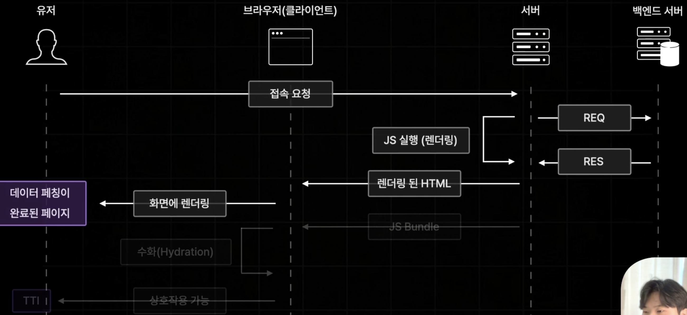

Next.js는 사전 렌더링 기능을 통해 FCP도 빠르지만 서버에서 JS코드를 실행해서 사전 렌더링 진행하는 과정에서 현재 필요한 데이터를 미리 불러오도록 설정할 수 있습니다.\
그렇게 된다면 사용자는 추가적인 로딩 없이 초기 페이지를 빠르게 볼 수 있습니다.

요청이 들어올 때 마다 사전 렌더링을 진행하는 가장 기본적인 렌더링 방식을 서버사이드 렌더링이라고 합니다.

#### 정적 사이트 생성 Static Site Generation (SSG)

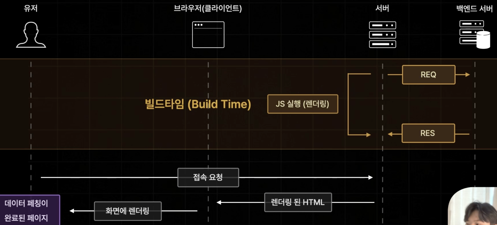

그런데 만약 백엔드 서버의 응답이 느리거나 문제가 발생한다면 차라리 리엑트의 방식이 더 나을 수도 있게 됩니다.\
그런 경우를 대비하여 Next.js는 사전 렌더링이 오래 걸릴것이라고 예상되는 페이지의 경우 빌드할 때 미리 사전 렌더링을 하도록 설정하게 할 수 있습니다.

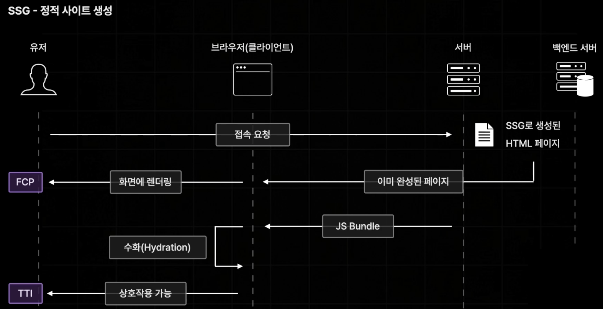

빌드 타임에 미리 페이지를 사전 렌더링 해두는 방식을 정적 사이트 생성이라고 합니다.\
정적 사이트 생성을 통해 사전 렌더링에 많은 시간이 소요되는 페이지 이더라도 사용자의 요청에는 매우 빠른 속도로 응답 가능힙니다.

하지만 매번 똑같은 페이지만 응답되기 때문에 최신 데이터 반영이 어려운 문제가 있습니다.

#### 증분 정적 재생성 Incremental Static Regeneration (ISR)

SSG 방식으로 생성된 정적 페이지를 일정 시간을 주기로 다시 생성하는 기술입니다.

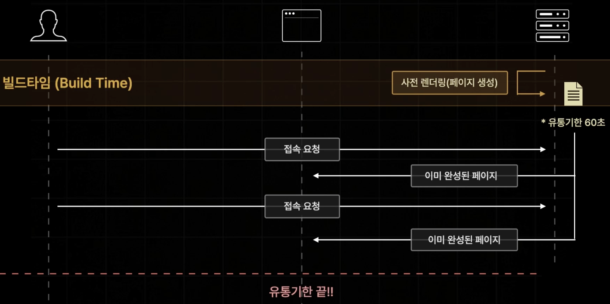
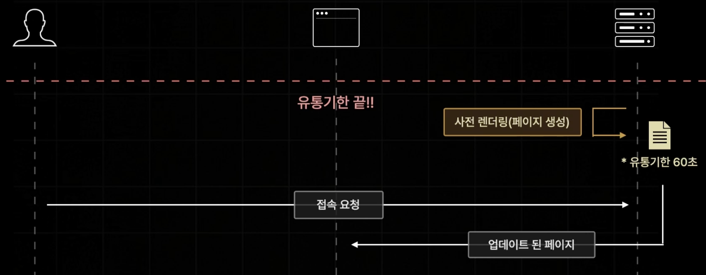

유통기한 이후 바로 새로 재생성된 페이지를 반환하는 것은 아닙니다.\
원래 가지고 있던 페이지를 반환하고, 반환하면서 새로운 페이지를 생성하게 됩니다.\
따라서 유통기한이 지나고, 첫 반환 이후부터 재생성된 페이지를 반환합니다.


따라서 ISR 방식은 이미 만들어져 있는 페이지를 반환하기 때문에 빠른 SSG 방식의 장점과 주기적으로 업데이트를 하는 SSR의 장점을 모두 가지고 있습니다.

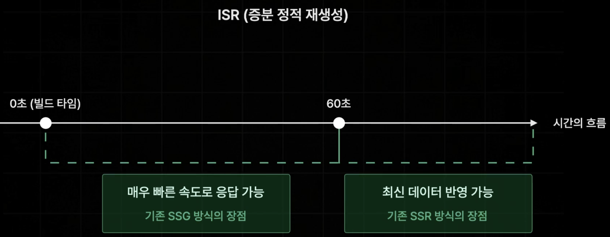

하지만 ISR 방식의 문제점도 있습니다.

1. ISR은 시간과 관계없이 사용자의 행동에 따라 데이터가 업데이트 되는 페이지는 적용하기 어렵습니다.

    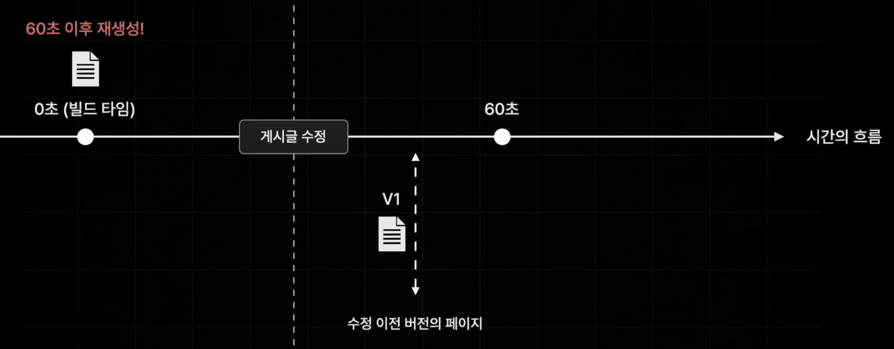

2. 불필요한 페이지가 생성될 수 있습니다.

    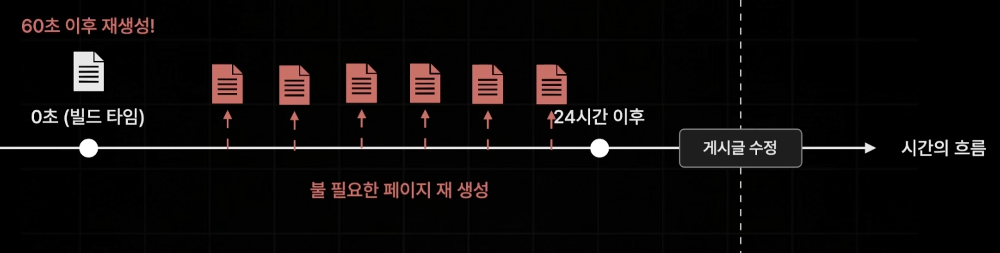

#### On-Demand ISR

기존의 ISR 방식은 시간을 기준으로 페이지를 업데이트합니다.\
그래서 발생하는 문제가 있는데요.\
On-Demand ISR 방식은 요청을 받을 때 마다 페이지를 업데이트합니다.

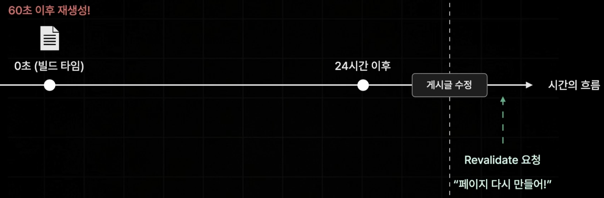

## 캐싱

NextJS는 안보이는곳에서 굉장히 공격적인 캐싱을 합니다.\
유저가 들어간 페이지들의 데이터까지 모두 캐싱합니다\
그래서 다른 페이지에 갔다가 돌아온다면 캐시에서 존재하고 있는 페이지를 로딩하여 최대한 빨리 보여지게 합니다.\
페이지를 새로고침할때만, 그러니까 본질적으로 이 페이지를 떠났다가 다시 돌아올때만 페이지가 다시 설계됩니다.

### 배포 환경에서 캐싱

NextJS는 실제로 앱에서 사전 생성될 수 있는 모든 페이지를 모두 사전 렌더링하고 생성하여 기본적으로는 동적 웹페이지가 아니게 됩니다.\
즉, 빌드 프로세스에서 모든 데이터를 불러오고 렌더링 하여 사전 생성됩니다.\
그런 다음 NextJS는 사전 렌더링된 페이지들을 캐싱하여 모든 방문자에게 제공할 수 있게 합니다.

페이지를 다시 실행하기 전까지 사전 생성된 페이지를 사용하기 때문에 데이터를 다시 가져오지 않습니다.\
그렇기 때문에 페이지에서 보이는 데이터가 변화하게 된다면 이는 문제가 됩니다.

따라서 NextJS에게 캐시의 전체나 일부를 비우고 가장 최신 데이터를 가져오게 해야 합니다.

## Server Actions and Mutations (`action`)

Server Action은 브라우저에서 호출할 수 있는 서버에서 실행되는 비동기 함수입니다.\
별도의 api 없이 함수 하나 만으로 브라우저에서 Next.js의 서버측에서 실행되는 함수를 직접 호출 할 수 있습니다.

Server Action은 React의 `"use server"` 지시어를 사용하여 정의할 수 있습니다.\
이 지시어는 Server Action이라는 것을 생성하는데, 특정 함수를 오직 서버에서만 실행될 수 있게 보장해주는 기능입니다.

Server Action은 NextJS 특유의 기능이 아닌 React 자체에서 지원하는 기능입니다.\
클라이언트 측 표준 React 프로젝트에는 해당되지 않지만, React를 감싸는 NextJS와 같은 프레임워크로 잠금 해제되는 기능입니다.

### 인라인 함수에서의 사용

async 함수의 본문 상단에 `"use server"` 지시어를 추가하여 해당 함수를 Server Action으로 설정할 수 있습니다.

```tsx
// app/page.jsx

export default function Page() {
  // Server Action
  async function create() {
    'use server'
    // 데이터 변조
    const name = formData.get("name");
    // 예시) 서버에서만 가능한 sql문으로 데이터 베이스에도 직접 접근 가능
    await sql`INSERT INTO Names (name) VALUES(${name})`;
  }

  return (
    <form action={create}>
      <input name="name" />
      <button type="submit">제출</button>
    </form>
  )
}
```

### 모듈 수준에서의 사용

별도의 파일 상단에 `"use server"`를 추가하면 해당 파일 내의 모든 내보내기가 Server Action으로 간주됩니다.

```tsx
// app/actions.js

'use server'

export async function create() {}
```

클라이언트 컴포넌트에서 Server Action을 `import`하여 사용할 수 있습니다.

```tsx
// app/ui/button.tsx

'use client'

import { create } from '@/app/actions'

export function Button() {
  return <Button onClick={create} />
}
```

### Server Action을 prop으로 전달하기

Server Action을 클라이언트 컴포넌트의 `prop`으로 전달하는 것도 가능합니다.\
이 경우, props의 이름이 `action` 또는 `Action`으로 끝나야 TypeScript 플러그인이 이를 Server Action으로 인식합니다.\
이는 실제로 Server Action인지 일반 함수인지 판별할 수 없기 때문입니다.

```tsx
<ClientComponent updateItemAction={updateItem} />
```

```tsx
// app/client-component.tsx

'use client'

export default function ClientComponent({
  updateItemAction,
}: {
  updateItemAction: (formData: FormData) => void
}) {
  return <form action={updateItemAction}>{/* ... */}</form>
```

### Server Actions 호출 방법

- 폼에서의 사용: Server Actions는 `<form>` 요소의 action 속성을 통해 호출할 수 있습니다.\
이때, Server Components는 기본적으로 점진적 향상을 지원하여, JavaScript가 로드되지 않았거나 비활성화된 경우에도 폼이 제출될 수 있습니다.

- 클라이언트에서의 사용: Client Components에서는 JavaScript가 로드되지 않은 경우 폼 제출이 대기하며, 클라이언트 하이드레이션을 우선시합니다.\
하이드레이션이 완료된 후에는 폼 제출 시 브라우저가 새로 고침되지 않습니다.

### 다양한 호출 방식

- 다양한 요소에서 호출 가능: Server Actions는 `<form>`에만 국한되지 않으며, 이벤트 핸들러, `useEffect`, 서드파티 라이브러리, `<button>` 같은 다른 폼 요소에서도 호출할 수 있습니다.

### Next.js와의 통합

- 캐싱 및 재검증: Server Actions는 Next.js의 캐싱 및 재검증 시스템과 통합되어, 호출 시 서버와의 단일 요청으로 업데이트된 UI와 새로운 데이터를 반환할 수 있습니다.

### HTTP 메서드

- POST 메서드 사용: Server Actions는 백그라운드에서 POST 메서드를 사용하여 호출됩니다. 이 메서드만 사용할 수 있습니다.

### 직렬화

- 인수와 반환 값: Server Actions의 인수와 반환 값은 React에 의해 직렬화 가능해야 합니다.\
이는 데이터를 네트워크로 전송하기 위해 변환할 수 있어야 한다는 의미입니다.\
예를들어 사용자가 폼에 입력한 정보를 Server Action으로 보낼 때, 이 정보는 문자열, 숫자 등의 데이터로 변환되어 서버로 전송됩니다.\
그리고 서버는 이 정보를 받아서 처리한 후, 다시 직렬화된 결과를 클라이언트에 전달합니다.

### 재사용 가능성

- 함수로서의 특성: Server Actions는 함수로 정의되므로 애플리케이션의 어디에서나 재사용할 수 있습니다.

### 런타임 상속

페이지 및 레이아웃에서 런타임 상속: Server Actions는 사용되는 페이지나 레이아웃에서 런타임을 상속받아, 특정 런타임 환경에서 실행됩니다.

### Route Segment Config 상속

- 환경 상속: Server Actions는 사용되는 페이지나 레이아웃의 환경(예: 런타임 및 구성)을 상속받습니다.\
이를 통해 특정 설정이나 제한을 함께 사용할 수 있습니다.\
예를 들어 만약 페이지가 1초 이상 걸리는 작업을 허용하지 않는 설정이 있다면, 이 규칙은 Server Actions에도 적용됩니다.

### 예시

`form` 태그의 `action` 속성은 `form`을 전송할 서버 쪽의 script 파일을 지정합니다.\
이 `form`이 제출되면 NextJS가 자동으로 요청을 생성하여 웹사이트를 제공하는 NextJS 서버로 보내게 됩니다.

```jsx
"use client"

import classes from './page.module.css';

// server action을 import
import { shareMeal } from '@/lib/actions';

import ImagePicker from '@/components/meals/image-picker';
import MealsFormSubmit from '@/components/meals/meals-form-submit';

export default function ShareMealPage() {

  return (
    <>
      <header className={classes.header}>
        <h1>
          Share your <span className={classes.highlight}>favorite meal</span>
        </h1>
        <p>Or any other meal you feel needs sharing!</p>
      </header>
      <main className={classes.main}>
        <form className={classes.form} action={shareMeal}>
          <div className={classes.row}>
            <p>
              <label htmlFor="name">Your name</label>
              <input type="text" id="name" name="name" required />
            </p>
            <p>
              <label htmlFor="email">Your email</label>
              <input type="email" id="email" name="email" required />
            </p>
          </div>
          <p>
            <label htmlFor="title">Title</label>
            <input type="text" id="title" name="title" required />
          </p>
          <p>
            <label htmlFor="summary">Short Summary</label>
            <input type="text" id="summary" name="summary" required />
          </p>
          <p>
            <label htmlFor="instructions">Instructions</label>
            <textarea
              id="instructions"
              name="instructions"
              rows="10"
              required
            />
          </p>
          <ImagePicker label="Your image" name="image" />
          <p className={classes.actions}>
            <MealsFormSubmit />
          </p>
        </form>
      </main>
    </>
  );
}
```

컴포넌트 내 어딘가에서 클라이언트용 기능을 사용하기 위해 `"use client"` 를 사용할 수 있고, 서버 측의 `form` 제출 제어 로직을 JSX 코드와 같은 파일에 두고 싶지 않기 때문에 분리하였습니다.

```jsx
"use server";

import { redirect } from "next/navigation";

import { saveMeal } from "./meals";

export const shareMeal = async (formData) => {
  const meal = {
    title: formData.get('title'),
    summary: formData.get('summary'),
    instructions: formData.get('instructions'),
    image: formData.get('image'),
    creator: formData.get('name'),
    creator_email: formData.get('email')
  }

  await saveMeal(meal);
  redirect('/meals');
}
```

## 자료

- [한 입 크기로 잘라먹는 Next.js(15+)](https://www.udemy.com/course/onebite-next/?srsltid=AfmBOorFsq4T73zxeAwsqbj4QsTR-KI1w--pDL5kZwMkM7g-kfZKfFSV)
