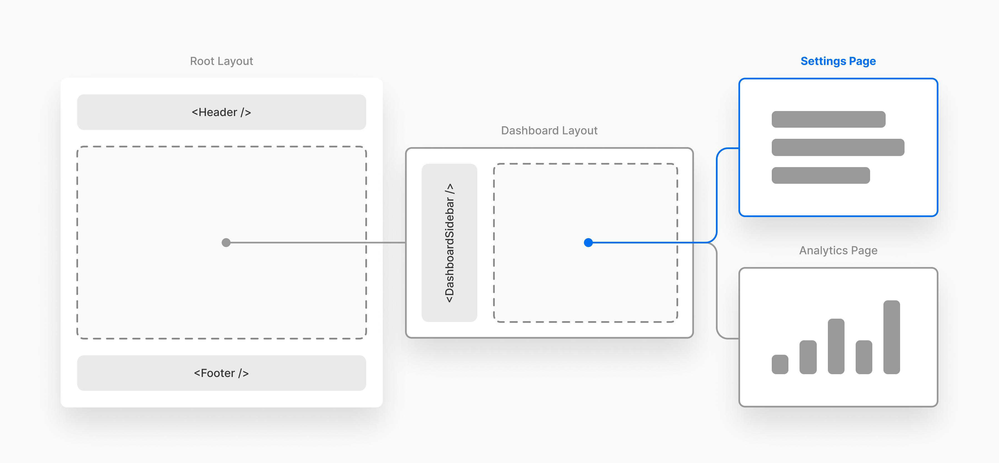

# File Conventions

## 보호된 파일명

`app` 폴더에는 `page.js`, `icon.png` 또는 `layout.js` 와 같은 보호 파일명이 있어서 다양한 기능을 사용할 수 있게합니다.

## 페이지 및 레이아웃

`page.js` 파일이 페이지의 내용을 정의한다면, `layout.js` 파일은 하나 또는 그 이상의 페이지를 감싸는 껍데기를 정의합니다.\
레이아웃이 wrapper이고 페이지가 실제 내용이라고 생각하면 쉽습니다.



### layout.js

모든 Next 프로젝트에는 최소 하나의 Root `layout.js` 파일이 필요합니다.\
또한 중첩된 `layout.js` 파일도 있을 수 있습니다.\
`layout.js`는 서로 상쇄되지 않고 중첩된다는 것이 중요합니다.

형제 및 중첩 페이지를 감싸는 신규 레이아웃 생성합니다.

```tsx
// app/layout.tsx

export default function RootLayout({
  children,
}: {
  children: React.ReactNode
}) {
  return (
    <html lang="en">
      <body>{children}</body>
    </html>
  )
}
```

```tsx
// app/dashboard/layout.tsx

export default function DashboardLayout({
  children,
}: {
  children: React.ReactNode
}) {
  return <section>{children}</section>
}
```

metadata 사용

```tsx
// app/layout.js

export const metadata = {
  title: 'NextJS Course App',
  description: 'Your first NextJS app!',
};

export default function RootLayout({ children }) {
  return (
    <html lang="en">
      <body>{children}</body>
    </html>
  );
}
```

#### metadata

`<head>`에 들어가는 모든 내용은 `metadata`에 의해 설정되거나 NextJS로 인해 이면에서 자동으로 설정됩니다.\
page 또는 layout에서만 사용 가능합니다.

`metadata`는 동적으로도 생성 가능합니다.

```tsx
export async function generateMetadata({ params }) {
  const meal = getMeal(params.mealSlug)

  if (!meal) {
    // 이 컴포넌트가 실행되는것을 멈추고 제일 가까운 not-found나 오류화면을 보여줌
    notFound();
  }

  return {
    title: meal.title,
    description: meal.summary
  };
}
```

#### children

현재 활성화된 페이지의 내용입니다.\
`children`을 통해 중첩 레이아웃 또는 페이지에 접근할 수 있습니다.

### page.js

신규 페이지 생성합니다. (예: `app/about/page.js`은 `<your-domain>/about page`을 생성)

```tsx
// app/blog/[slug]/page.tsx

export default function Page({
  params,
  searchParams,
}: {
  params: { slug: string }
  searchParams: { [key: string]: string | string[] | undefined }
}) {
  return <h1>My Page</h1>
}
```

### not-found.js

‘Not Found’ 오류에 대한 폴백 페이지(형제 또는 중첩 페이지 또는 레이아웃에서 전달된)

```tsx
// app/not-found.tsx

import Link from 'next/link'

export default function NotFound() {
  return (
    <div>
      <h2>Not Found</h2>
      <p>Could not find requested resource</p>
      <Link href="/">Return Home</Link>
    </div>
  )
}
```

#### 동적 라우트의 not-found.js

만약 대괄호(`[]`)를 사용한 동적 라우트에 존재하지 않는 페이지를 입력하면 실제로 존재하는지 아닌지를 NextJS가 이해하지 못하기 때문에 런타임 오류가 발생합니다.\
동적 경로이기 때문에 라우트 상으로는 문제가 없지만 실제로는 없기 때문입니다.\
이런 경우 조건문과 `notFound()`함수를 사용하면 해결할 수 있습니다.

`notFound()`함수를 호출하면 NEXT_NOT_FOUND 오류가 발생하며, 오류가 발생한 라우트 세그먼트의 렌더링이 중단됩니다.\
`not-found` 파일을 지정하면 해당 세그먼트 내에서 Not Found UI를 렌더링하여 이러한 오류를 처리할 수 있습니다.

```tsx
// [slug]/page.js

import { notFound } from "next/navigation";

import { DUMMY_NEWS } from "@/dummy-news";

export default function NewsDetailPage({ params }) {
  const newSlug = params.slug;
  const newsItem = DUMMY_NEWS.find(
    newsItem => newsItem.slug === newSlug
  );

  // [slug] 부분에 들어갈 동적 경로의 페이지가 있는지 없는지 확인
  if (!newsItem) {
    notFound();
  }

  return (
    <article className="news-article">
      <header>
        
        <h1>{newsItem.title}</h1>
        <time dateTime={newsItem.date}>{newsItem.date}</time>
      </header>
      <p>{newsItem.content}</p>
    </article>
  )
}
```

### error.js

기타 오류에 대한 폴백 페이지입니다. (형제 또는 중첩 페이지 또는 레이아웃에서 전달된)

```tsx
'use client' // 오류는 서버가 작동 중일 때 말고도 클라이언트 사이드에서도 발생할 수 있기 때문에

import { useEffect } from 'react'

export default function Error({
  error,
  reset,
}: {
  error: Error & { digest?: string }
  reset: () => void
}) {
  useEffect(() => {
    // Log the error to an error reporting service
    console.error(error)
  }, [error])

  return (
    <div>
      <h2>Something went wrong!</h2>
      <button
        onClick={
          // Attempt to recover by trying to re-render the segment
          () => reset()
        }
      >
        Try again
      </button>
    </div>
  )
}
```

### loading.js

형제 또는 중첩 페이지(또는 레이아웃)가 데이터를 가져오는 동안 표시되는 폴백 페이지

```tsx
export default function Loading() {
  // 커스텀 로딩 스켈레톤 컴포넌트를 사용할 수도 있음
  return <p>Loading...</p>
}
```

### route.js

API 경로 생성(즉, JSX 코드가 아닌 데이터를 반환하는 페이지, 예: JSON 형식)

```tsx
// route.ts

export async function GET(request: Request) {}

export async function HEAD(request: Request) {}

export async function POST(request: Request) {}

export async function PUT(request: Request) {}

export async function DELETE(request: Request) {}

export async function PATCH(request: Request) {}

// 만약 OPTIONS 메서드가 정의되지 않은 경우, Next.js는 이를 자동으로 구현하고, 라우트 핸들러에 정의된 다른 메서드들(GET, POST 등)을 기반으로 적절한 Allow 응답 헤더를 설정합니다. OPTIONS 메서드는 클라이언트가 서버에서 지원하는 HTTP 메서드를 확인하는 데 사용됩니다. 직접 정의하려면 다음과 같이 작성할 수 있습니다:
export async function OPTIONS(request: Request) {}
```

```tsx
// app/dashboard/[team]/route.ts

type Params = {
  team: string
}

export async function GET(request: Request, context: { params: Params }) {
  const team = context.params.team // '1'
}

// Params라는 타입을 정의하여 라우트의 URL 파라미터 타입을 지정합니다.
```

### default.js

Next.js가 전체 페이지 새로고침 후에도 슬롯의 활성 상태(현재 페이지)를 복구할 수 없을 때, 대체 화면을 보여주기 위해 사용됩니다.\
만약 일치하는 하위 페이지가 없으면 `default.js`가 렌더링되며, 이 파일이 없으면 404 페이지가 대신 나타납니다. 특히 자식 경로에 대해서도 `default.js`가 필요할 수 있습니다.

### instrumentation.js

애플리케이션에 모니터링 및 로깅 도구를 통합하는 데 사용됩니다.\
이를 통해 애플리케이션의 성능과 동작을 추적하고, 프로덕션 환경에서 발생하는 문제를 디버깅할 수 있습니다.

이 파일을 사용하려면, 애플리케이션의 루트에 배치하거나 src 폴더를 사용하는 경우 그 안에 넣으면 됩니다.

#### Config Option

```tsx
module.exports = {
  experimental: {
    instrumentationHook: true,
  },
}
```

#### Export

```tsx
import { registerOTel } from '@vercel/otel'

export function register() {
  registerOTel('next-app')
}
```

### middleware.js

요청이 완료되기 전에 서버에서 코드를 실행하는 미들웨어를 작성하는 데 사용됩니다.\
들어오는 요청에 따라 응답을 재작성, 리디렉션, 요청이나 응답 헤더 수정, 또는 직접 응답하는 방식으로 응답을 수정할 수 있습니다.

미들웨어는 경로가 렌더링되기 전에 실행되며, 인증, 권한 부여, 로깅, 리디렉션 처리 같은 서버 측 로직을 구현할 때 유용합니다.

즉, 어떤 url로 접근을 했을 때 그 url에 맵핑되는 라우터가 매칭되기 전에 middleware가 먼저 실행됩니다.

`middleware.ts`(또는 .js) 파일을 프로젝트 루트에 배치하여 미들웨어를 정의할 수 있습니다.
예를 들어, app 또는 pages와 같은 레벨에 두거나, src 폴더 안에 넣을 수 있습니다.

```tsx
// middleware.ts

import { NextResponse, NextRequest } from 'next/server'

// 이 함수 내부에서 await을 사용하는 경우, async로 표시할 수 있습니다.
export function middleware(request: NextRequest) {
  // 요청을 /home으로 리디렉션
  return NextResponse.redirect(new URL('/home', request.url))
}

export const config = {
  // about 경로에 미들웨어를 적용
  matcher: '/about/:path*',
}
```

#### Middleware function

파일은 기본 내보내기 또는 `middleware`라는 이름의 단일 함수를 내보내야 합니다. 동일한 파일에서 여러 미들웨어를 지원하지 않습니다.

```js filename="middleware.js"
// 기본 내보내기 예제
export default function middleware(request) {
  // 미들웨어 로직
}
```

#### Config object (optional)

선택적으로, 미들웨어 함수와 함께 config 객체를 내보낼 수 있습니다.\
이 객체에는 미들웨어가 적용될 경로를 지정하는 `matcher`가 포함됩니다.

##### Matcher

`matcher` 옵션을 사용하여 미들웨어가 실행될 특정 경로를 지정할 수 있습니다.\
여러 가지 방법으로 이러한 경로를 지정할 수 있습니다.

- 단일 경로의 경우: 문자열을 직접 사용하여 경로를 정의합니다. 예: `'/about'`.

- 여러 경로의 경우: 배열을 사용하여 여러 경로를 나열합니다.\
예시: `matcher: ['/about', '/contact']`는 `/about` 및 `/contact` 경로의 요청에 미들웨어를 적용합니다.\

즉, 이 경로들이 아닌 다른 경로의 요청은 미들웨어를 거치지 않고 그대로 진행되며, 미들웨어가 실행되는 범위를 선택적으로 제한할 수 있는 기능입니다.

또한, `matcher`는 정규 표현식을 통해 복잡한 경로 지정도 지원하여 포함하거나 제외할 경로를 정확하게 제어할 수 있습니다.\
예시: `matcher: ['/((?!api|_next/static|_next/image|.*\\.png$).*)']`.

`matcher` 옵션은 다음 키를 가진 객체 배열도 허용합니다:

- `source`: 요청 경로를 매칭하는 데 사용되는 경로 또는 패턴입니다. 직접 경로 매칭을 위한 문자열이거나, 더 복잡한 매칭을 위한 패턴일 수 있습니다.

- `regexp` (선택 사항): 소스를 기반으로 매칭을 세밀하게 조정하는 정규 표현식 문자열입니다. 포함하거나 제외할 경로를 추가로 제어합니다.

- `locale` (선택 사항): `false`로 설정하면 경로 매칭에서 로케일 기반 라우팅을 무시합니다.

- `has` (선택 사항): 헤더, 쿼리 매개변수 또는 쿠키와 같은 특정 요청 요소의 존재 여부에 따른 조건을 지정합니다.

- `missing` (선택 사항): 누락된 헤더 또는 쿠키와 같은 특정 요청 요소가 없는 경우에 대한 조건을 지정합니다.

```js filename="middleware.js"
export const config = {
  matcher: [
    {
      source: '/api/*',
      regexp: '^/api/(.*)',
      locale: false,
      has: [
        { type: 'header', key: 'Authorization', value: 'Bearer Token' },
        { type: 'query', key: 'userId', value: '123' },
      ],
      missing: [{ type: 'cookie', key: 'session', value: 'active' }],
    },
  ],
}
```

#### `request`

미들웨어를 정의할 때, 기본 내보내기 함수는 `request`라는 단일 매개변수를 받습니다. 이 매개변수는 들어오는 HTTP 요청을 나타내는 `NextRequest`의 인스턴스입니다.

```tsx filename="middleware.ts" switcher
import type { NextRequest } from 'next/server'

export function middleware(request: NextRequest) {
  // 미들웨어 로직은 여기에 작성됩니다.
}
```

#### NextResponse

미들웨어는 Web Response API를 확장하는 `NextResponse` 객체를 사용할 수 있습니다.\
`NextResponse` 객체를 반환하여 쿠키를 직접 조작하고, 헤더를 설정하고, 리디렉션을 구현하며, 경로를 재작성할 수 있습니다.

#### 알아두면 좋은 점

`NextRequest`는 Next.js 미들웨어에서 들어오는 HTTP 요청을 나타내는 타입이며, `NextResponse`는 HTTP 응답을 조작하고 다시 보내는 데 사용되는 클래스입니다.

리디렉션의 경우, `NextResponse.redirect` 대신 `Response.redirect`를 사용할 수도 있습니다.

#### Runtime

미들웨어는 Edge runtime만 지원합니다.\
Node.js 런타임은 사용할 수 없습니다.

### template.js

레이아웃과 유사하지만, 각 자식 레이아웃이나 페이지를 감싸는 역할을 합니다.\
레이아웃과는 달리, 레이아웃은 경로를 가로질러 지속되며 상태를 유지하는 반면, 템플릿은 내비게이션 시 각 자식에 대해 새로운 인스턴스를 생성합니다.

즉, 템플릿은 페이지 간 이동할 때마다 자식 컴포넌트의 새 인스턴스를 생성하므로 상태가 초기화됩니다.

```tsx
// app/template.tsx

export default function Template({
  children
}: {
  children: React.ReactNode
}) {
  return <div>{children}</div>
}
```

### globals.css

`layout.js` 파일에 `import` 되어 로딩된 모든 페이지에서 사용됩니다.

### icon.png

favicon으로 사용하게 됩니다.

## 커스텀 컴포넌트

`header` 같은 경우 특별할 파일명이 아니기 때문에 레이아웃 또는 페이지로 렌더링 되지 않습니다.

```tsx
// app/header.jsx

export default function header() {
  return (
    <>
      
      <h1>Welcome to this NextJS Course!</h1>
    </>
  )
}
```

그렇기 때문에 `app` 폴더 외부에서 위치해도 상관없습니다.

```tsx
// components/page.js

import Link from "next/link";

import Header from './components/header'

export default function Home() {
  console.log(`Executing...`)
  return (
    <main>
      <Header />
      <p>🔥 Let&apos;s get started! 🔥</p>
      <p><Link href="/about">About Us</Link></p>
    </main>
  );
}
```

`jsconfig` 파일에서 `import` 경로에 앳 사인(`@`)를 사용해 `root` 프로젝트를 조회할 수 있습니다.

```tsx
// components/page.js

import Link from "next/link";

import Header from '@/components/header'

export default function Home() {
  console.log(`Executing...`)
  return (
    <main>
      <Header />
      <p>🔥 Let&apos;s get started! 🔥</p>
      <p><Link href="/about">About Us</Link></p>
    </main>
  );
}
```

```json
// jsconfig.js

{
  "compilerOptions": {
    "paths": {
      "@/*": ["./*"]
    }
  }
}
```
