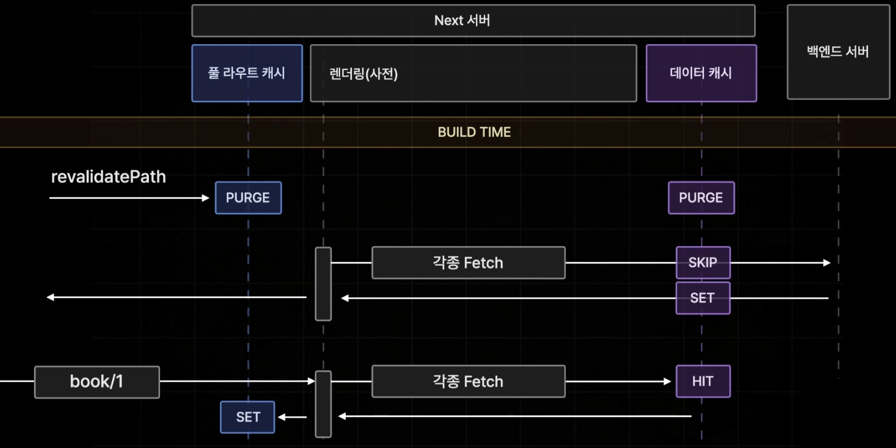

# Function

## usePathName()

`usePathname`은 현재 URL의 경로명을 읽을 수 있게 해주는 클라이언트 컴포넌트 훅입니다.

```tsx
// app/example-client-component.tsx
"use client";

import { usePathname } from "next/navigation";

export default function ExampleClientComponent() {
  const pathname = usePathname();
  return <p>Current pathname: {pathname}</p>;
}
```

```js
// app/example-client-component.js
"use client";

import { usePathname } from "next/navigation";

export default function ExampleClientComponent() {
  const pathname = usePathname();
  return <p>Current pathname: {pathname}</p>;
}
```

`usePathname`은 의도적으로 클라이언트 컴포넌트에서 사용해야 합니다.\
클라이언트 컴포넌트는 서버 컴포넌트 아키텍처의 중요한 부분으로, 성능 저하 요소가 아닙니다.

예를 들어, `usePathname`을 사용하는 클라이언트 컴포넌트는 초기 페이지 로드 시 HTML로 렌더링됩니다.\
새로운 경로로 이동할 때, 이 컴포넌트는 다시 가져올 필요가 없습니다.\
대신, 컴포넌트는 한 번 다운로드(클라이언트 자바스크립트 번들)되고 현재 상태에 따라 다시 렌더링됩니다.

### usePathName 알아두면 좋은 점

- 서버 컴포넌트에서 현재 URL을 읽는 것은 지원되지 않습니다.\
  이는 페이지 탐색 간 레이아웃 상태가 유지되도록 지원하기 위한 의도적인 설계입니다.

- 호환 모드:
  - 대체 경로가 렌더링되거나 Next.js에 의해 자동으로 정적으로 최적화된 pages 디렉토리 페이지일 때 usePathname이 `null`을 반환할 수 있습니다.
  - 프로젝트에 app 및 pages 디렉토리가 모두 있는 경우 Next.js가 자동으로 타입을 업데이트합니다.

### usePathName Parameters

```ts
const pathname = usePathname();
```

`usePathname`은 파라미터를 받지 않습니다.

### usePathName Returns

`usePathname`은 현재 URL의 경로명을 나타내는 문자열을 반환합니다.\

예를 들어

|         URL         |        반환 값        |
| :-----------------: | :-------------------: |
|         `/`         |         `'/'`         |
|    `/dashboard`     |    `'/dashboard'`     |
|  `/dashboard?v=2`   |    `'/dashboard'`     |
| `/blog/hello-world` | `'/blog/hello-world'` |

### usePathName Examples

경로 변경에 반응하여 작업 수행

```tsx
// app/example-client-component.tsx
"use client";

import { usePathname, useSearchParams } from "next/navigation";

function ExampleClientComponent() {
  const pathname = usePathname();
  const searchParams = useSearchParams();
  useEffect(() => {
    // 여기에서 작업 수행...
  }, [pathname, searchParams]);
}
```

```js
app / example - client - component.js;
("use client");

import { usePathname, useSearchParams } from "next/navigation";

function ExampleClientComponent() {
  const pathname = usePathname();
  const searchParams = useSearchParams();
  useEffect(() => {
    // 여기에서 작업 수행...
  }, [pathname, searchParams]);
}
```

## revalidatePath()

`revalidatePath` 함수는 특정 경로에 대해 캐시된 데이터를 필요에 따라 삭제할 수 있게 해줍니다.\
`revalidatePath` 는 서버 측에 특정 경로에 해당하는 페이지를 다시 생성(재검증)해 줄 것을 요청합니다.\
특정 경로의 페이지는 랜더링이 진행되고 아래 컴포넌트도 랜더링을 진행합니다.

NextJS는 기본적으로 캐시된 페이지를 보여줍니다.\
데이터베이스의 데이터가 변경되었다고 해서 페이지가 업데이트되지는 않기 때문에 오래된 데이터에 기반했을지 모르는 페이지를 보여줄 수 있습니다.\
`revalidatePath`는 데이터를 변경할 때마다 호출해야 하는 함수이며, `revalidatePath`를 통해 NextJS에 일부 페이지의 데이터가 변경되었다는 것을 알리고 어떤 페이지의 데이터가 변경되었는지도 알려야 합니다.

`revalidatePath`를 사용할 수 있는 두 가지 장소가 있으며, 달성하려는 목표에 따라 다릅니다:

- `Route Handlers`: 서드 파티 이벤트(예: 웹훅)에 응답하여 데이터를 재검증합니다.

- `Server Actions`: 사용자 상호작용(예: 폼 제출, 버튼 클릭) 후 데이터를 재검증합니다.

### 캐시된 데이터란?

웹사이트를 방문할 때 서버에서 데이터를 받아오면, 이 데이터를 다시 요청할 필요 없이 미리 저장해 두는 것을 "캐싱"이라고 합니다.\
하지만, 이 데이터가 오래되어 업데이트가 필요한 경우, 캐시를 지우고 새 데이터를 불러와야 합니다.\
`revalidatePath`는 이 캐시를 지워주는 역할을 합니다.

### 어떻게 동작하나요?

경로를 무효화한다는 것은, 그 경로의 캐시된 데이터를 삭제하고, 다음 번에 그 경로를 방문할 때 최신 데이터를 다시 가져오게 한다는 뜻입니다.\
이 함수는 서버와 클라이언트 모두에서 작동하며, 페이지나 레이아웃 등 다양한 부분에서 사용할 수 있습니다.

### 주요 포인트

- 즉시 새로운 데이터를 불러오진 않음: 이 함수는 무효화된 경로를 다음에 방문할 때 새 데이터를 불러옵니다.

- 동적 경로 지원: 동적으로 변화하는 URL(예: `/product/[slug]`)도 처리할 수 있습니다.

- 특정 페이지, 레이아웃 구분 가능: `revalidatePath`는 특정 페이지나 레이아웃만 무효화하는 옵션도 제공합니다.

### revalidatePath Parameters

```ts
revalidatePath(path: string, type?: 'page' | 'layout'): void;
```

`path`: 무효화하려는 데이터와 관련된 파일 시스템 경로(예: `/product/[slug]/page`) 또는 실제 경로 세그먼트(예: `/product/123`)를 나타내는 문자열입니다. 1024자 미만이어야 하며, 대소문자를 구분합니다.
`type`: (선택 사항) 무효화할 경로의 유형을 변경하기 위한 `'page'` 또는 `'layout'` 문자열입니다. `path`에 동적 세그먼트가 포함된 경우(예: `/product/[slug]/page`), 이 매개변수가 필요합니다. 경로가 실제 경로 세그먼트를 참조하는 경우, 예: 동적 페이지(예: `/product/[slug]/page`)의 경우 `/product/1`을 사용하면 `type`을 제공할 필요가 없습니다.

### revalidatePath Returns

`revalidatePath`는 값을 반환하지 않습니다.

### revalidatePath 의 다양한 재검증 방식 Examples

#### 1. 특정 URL 재검증

특정 주소에 해당하는 페이지만 재검증

```ts
import { revalidatePath } from "next/cache";
// /blog/post-1 경로가 해당
revalidatePath("/blog/post-1");
```

#### 2. revalidatePath page 경로 재검증

특정 경로의 모든 동적 페이지를 재검증

```ts
import { revalidatePath } from "next/cache";
// /blog/[slug] 경로의 page가 해당
revalidatePath("/blog/[slug]", "page");
// /(main)/post/[slug] 경로의 page가 해당
revalidatePath("/(main)/post/[slug]", "page");
```

이는 다음 페이지 방문 시 제공된 `page` 파일과 일치하는 모든 URL을 재검증합니다.\
특정 페이지 이하의 페이지는 무효화되지 않습니다.\
예를 들어, `/blog/[slug]`는 `/blog/[slug]/[author]`를 무효화하지 않습니다.

#### 3. revalidatePath layout 경로 재검증

특정 레이아웃을 갖는 모든 페이지 재검증

```ts
import { revalidatePath } from "next/cache";
revalidatePath("/blog/[slug]", "layout");
// 또는 경로 그룹과 함께 사용
revalidatePath("/(main)/post/[slug]", "layout");
```

이는 다음 페이지 방문 시 제공된 `layout` 파일과 일치하는 모든 URL을 재검증합니다.\
이는 동일한 레이아웃을 가진 페이지들이 다음 방문 시 재검증되도록 합니다.\
예를 들어, 위의 경우에서 `/blog/[slug]/[another]`도 다음 방문 시 재검증됩니다.

#### 4. revalidatePath 모든 데이터 재검증

```ts
import { revalidatePath } from "next/cache";

revalidatePath("/", "layout");
```

이는 클라이언트 측 라우터 캐시를 제거하고, 다음 페이지 방문 시 데이터 캐시를 재검증합니다.

#### 5. revalidateTag 태그 기준, 데이터 캐시 재검증

특정 캐시 태그에 대해 필요에 따라 캐시된 데이터를 무효화할 수 있게 해줍니다.

앞서 나온 옵션들은 해당 경로의 모든 데이터 캐시를 삭제하기 때문에 불필요한 캐시도 삭제될 수 있습니다.\
`revalidateTag`는 오직 태그 값을 갖고 있는 `fetch` 의 데이터 캐시만 삭제 하기 때문에 호율적으로 페이지를 재검증 할 수 있습니다.

##### revalidateTag 사용 예시

`fetch`의 캐시 옵션을 태그로 설정합니다.

```tsx
// 태그로 데이터 캐시
fetch(`https://...`, { next: { tags: ["a", "b", "c"] } });
```

`fetch`의 태그를 똑같이 명시하고 `revalidateTag`가 호출이 되게 되면 해당 태그 값을 갖는 모든 데이터 캐시가 재검증 됩니다.

```ts
// 특정 태그가 있는 항목을 재검증
revalidateTag("a");
```

##### revalidateTag 실제 사용 예시

```ts
import { revalidatePath } from "next/cache";

async function ReviewList({ bookId }: { bookId: string }) {
  // `fetch` 메서드의 태그 옵션을 캐시로 설정
  const response = await fetch(
    `${process.env.NEXT_PUBLIC_API_SERVER_URL}/review/book/${bookId}`,
    { next: { tags: [`review-${bookId}`] } }
  );

  if (!response.ok) {
    throw new Error(`Review fetch failed: ${response.statusText}`);
  }

  const reviews: ReviewData[] = await response.json();

  return (
    <section>
      {reviews.map((review) => (
        <ReviewItem key={`review-item-${review.id}`} {...review} />
      ))}
    </section>
  );
}
```

```ts
"use server";

import { revalidateTag } from "next/cache";

export async function createReviewAction(formData: FormData) {
  const bookId = formData.get("bookId")?.toString();
  const content = formData.get("content")?.toString();
  const author = formData.get("author")?.toString();

  if (!bookId || !content || !author) return;

  try {
    const response = await fetch(
      `${process.env.NEXT_PUBLIC_API_SERVER_URL}/review`,
      {
        method: "POST",
        body: JSON.stringify({ bookId, content, author }),
      }
    );

    // `fetch` 메서드의 태그와 동일한 태그를 사용
    revalidateTag(`review-${bookId}`);
  } catch (err) {
    console.error(err);

    return;
  }
}
```

### revalidatePath 서버 액션

```ts
// app/actions.ts
"use server";

import { revalidatePath } from "next/cache";

export default async function submit() {
  await submitForm();
  revalidatePath("/");
}
```

### revalidatePath 라우트 핸들러

```ts
// app/api/revalidate/route.ts
import { revalidatePath } from "next/cache";
import type { NextRequest } from "next/server";

export async function GET(request: NextRequest) {
  const path = request.nextUrl.searchParams.get("path");

  if (path) {
    revalidatePath(path);
    return Response.json({ revalidated: true, now: Date.now() });
  }

  return Response.json({
    revalidated: false,
    now: Date.now(),
    message: "Missing path to revalidate",
  });
}
```

### revalidatePath 주의

- `revalidatePath`는 서버측에서만 호출 할 수 있습니다.

- `revalidatePath`는 해당 페이지를 데이터 캐시와 풀 라우트 캐시까지 삭제합니다.\
  즉 다음 번 페이지는 다이나믹 페이지처럼 느리게 생성이 됩니다.

#### revalidatePath 이후 과정



1. `revalidatePath` 요청이 들어오게 되면 서버는 빌드 타임에 생성된 풀 라우트 캐시와 데이터 캐시를 삭제합니다.

2. 이후 캐시가 삭제된 페이지는 새롭게 생성되게 됩니다.

3. 페이지가 새롭게 생성되면서 서버에서 받는 데이터를 데이터 케시에 저장합니다.

4. 페이지가 생성되고 브라우저로부터 다음 번 요청이 왔을 때 실시간으로 다시 페이지를 생성하며 풀 라우트 캐시에 저장합니다.

### revalidatePath vs. router.refreshs

`router.refresh`를 호출하면 Router 캐시가 지워지고, Data Cache 또는 Full Route Cache를 무효화하지 않고 서버에서 경로 세그먼트가 다시 렌더링됩니다.

차이점은 `revalidatePath`는 Data Cache와 Full Route Cache를 제거하는 반면, `router.refresh()`는 클라이언트 측 API로서 Data Cache와 Full Route Cache를 변경하지 않습니다.

## useRouter

Next.js에서 클라이언트 컴포넌트 내에서 프로그래밍 방식으로 라우트를 변경할 수 있도록 도와줍니다.\
(서버 컴포넌트에서는 `redirect` 사용, 외부 URL로 이동할 때는 `window.location.href`와 같은 브라우저 API를 선호)\
하지만 대부분의 네비게이션 상황에서는 `<Link>` 컴포넌트를 사용하는 것이 권장됩니다.\
`useRouter`는 특별한 요구 사항이 있을 때 유용합니다.

### useRouter 기본 예시

```tsx
"use client";

import { useRouter } from "next/navigation";

export default function Page() {
  const router = useRouter();

  return (
    <button type="button" onClick={() => router.push("/dashboard")}>
      대시보드로 이동
    </button>
  );
}
```

### useRouter의 주요 메서드

- `router.push(href: string, { scroll: boolean })`:\
  새로운 라우트로 이동하며 브라우저의 히스토리 스택에 새 항목을 추가합니다.\
  `scroll` 옵션을 `false`로 설정하면 페이지 상단으로 스크롤되는 것을 방지할 수 있습니다.\
  뒤로가기를 했을 때 직전 히스토리로 이동합니다.

- `router.replace(href: string, { scroll: boolean })`:\
  `push()`와 유사하지만, 히스토리 항목을 새로 추가하지 않고 현재 항목을 대체합니다.\
  즉, 뒤로가기를 했을 때 이전 히스토리를 건너 뛰게 됩니다.

- `router.refresh()`:\
  현재 페이지를 새로고침하여 서버에서 최신 데이터를 다시 요청합니다.\
  서버 컴포넌트를 업데이트하면서 클라이언트 측 상태(useState)나 브라우저 상태(예: 스크롤 위치)는 유지됩니다.

- `router.prefetch(href: string)`:\
  빠른 클라이언트 전환을 위해 특정 경로를 미리 로드합니다.\
  이는 페이지 전환 성능을 향상시키기 위해 사용됩니다.

- `router.back()`:\
  브라우저의 히스토리 스택에서 이전 페이지로 이동합니다.

- `router.forward()`:\
  히스토리 스택에서 다음 페이지로 이동합니다.

#### useRouter 주의 사항

`<Link>` 컴포넌트는 자동으로 경로를 뷰포트에 보이게 될 때 미리 로드합니다.\
캐싱된 요청이 있을 경우 refresh()는 동일한 결과를 다시 가져올 수 있습니다.\
또한 동적 API(예: 쿠키, 헤더)로 인해 응답이 달라질 수 있습니다.\
`next/router`에서 `next/navigation`으로의 마이그레이션 `App Router`를 사용하는 경우, `next/router` 대신 `next/navigation`을 사용해야 합니다.\
마이그레이션 시 알아야 할 주요 변경 사항은 다음과 같습니다:

1. `useRouter`는 `next/router`가 아닌 `next/navigation`에서 가져와야 합니다.

2. `pathname` 문자열은 더 이상 사용되지 않으며, 대신 `usePathname()`을 사용해야 합니다.

3. `query` 객체는 사라졌고, `useSearchParams()`로 대체되었습니다.

4. `router.events`는 다른 방식으로 대체되었습니다.

### 라우트 변경 감지 (`usePathname`, `useSearchParams`)

클라이언트 컴포넌트 내에서 URL 변경을 감지하려면 `usePathname()`과 `useSearchParams()` 훅을 사용하여 라우트 변경을 처리할 수 있습니다.

```jsx
"use client";

import { useEffect } from "react";
import { usePathname, useSearchParams } from "next/navigation";

export function NavigationEvents() {
  const pathname = usePathname();
  const searchParams = useSearchParams();

  useEffect(() => {
    const url = `${pathname}?${searchParams}`;
    console.log(url);
    // 현재 URL을 처리할 수 있습니다
  }, [pathname, searchParams]);

  return "...";
}
```

### useRouter 스크롤 상단으로 이동 방지

Next.js는 기본적으로 새로운 경로로 이동할 때 페이지 상단으로 자동 스크롤합니다.\
이 동작을 비활성화하려면 `router.push()`나 `router.replace()`에 `scroll: false` 옵션을 전달하면 됩니다.

```tsx
"use client";

import { useRouter } from "next/navigation";

export default function Page() {
  const router = useRouter();

  return (
    <button
      type="button"
      onClick={() => router.push("/dashboard", { scroll: false })}
    >
      대시보드
    </button>
  );
}
```

#### useRouter 참고 사항

- `Suspense`: `useSearchParams()`를 사용할 때는 클라이언트 렌더링 중 가장 가까운 `Suspense` 경계까지 감싸줘야 합니다.\
  이는 정적 렌더링 시 클라이언트 사이드 렌더링이 발생하기 때문입니다.

## useSearchParams

`useSearchParams`는 현재 URL의 query string을 읽을 수 있게 해주는 Client Component 훅입니다.

```tsx
import { useSearchParams } from "next/navigation";

const searchParams = useSearchParams();
```

### returns

#### URLSearchParams.get()

검색 파라미터와 연결된 첫 번째 값을 반환합니다.

| URL                  | `searchParams.get("a")` |
| -------------------- | ----------------------- |
| `/dashboard?a=1`     | `'1'`                   |
| `/dashboard?a=`      | `''`                    |
| `/dashboard?b=3`     | `null`                  |
| `/dashboard?a=1&a=2` | `'1'`                   |

#### URLSearchParams.has()

주어진 파라미터가 존재하는지 여부를 나타내는 불리언 값을 반환합니다.

| URL              | `searchParams.has("a")` |
| ---------------- | ----------------------- |
| `/dashboard?a=1` | `true`                  |
| `/dashboard?b=3` | `false`                 |

#### URLSearchParams.getAll()

특정 검색 파라미터(key)에 대한 모든 값을 배열로 반환합니다.

| URL                  | `searchParams.getAll("a")` |
| -------------------- | -------------------------- |
| `/dashboard?a=1&a=2` | `['1', '2']`               |
| `/dashboard?b=3`     | `[]`                       |
| `/dashboard?c=`      | `[]`                       |
| `/dashboard`         | `[]`                       |

#### URLSearchParams.keys()

URLSearchParams 객체의 모든 키(key)를 `Iterator`로 반환합니다.

| URL                  | `searchParams.keys()` |
| -------------------- | --------------------- |
| `/dashboard?a=1`     | `['a']`               |
| `/dashboard?a=1&b=2` | `['a', 'b']`          |
| `/dashboard`         | `[]`                  |

#### URLSearchParams.values()

URLSearchParams 객체의 모든 값(value)을 `Iterator`로 반환합니다.

| URL                  | `searchParams.values()` |
| -------------------- | ----------------------- |
| `/dashboard?a=1`     | `['1']`                 |
| `/dashboard?a=1&b=2` | `['1', '2']`            |

#### URLSearchParams.entries()

URLSearchParams 객체의 모든 키-값 쌍을 `[key, value]` 형태의 `Iterator`로 반환합니다.

| URL                  | `searchParams.entries()`   |
| -------------------- | -------------------------- |
| `/dashboard?a=1`     | `[['a', '1']]`             |
| `/dashboard?a=1&b=2` | `[['a', '1'], ['b', '2']]` |

#### URLSearchParams.forEach()

URLSearchParams 객체의 모든 키-값 쌍에 대해 콜백 함수를 실행합니다.

```tsx
const searchParams = new URLSearchParams("?a=1&b=2");

searchParams.forEach((value, key) => {
  console.log(`${key}: ${value}`);
});

// 출력 결과
// a: 1
// b: 2
```

| URL                  | 콜백 결과      |
| -------------------- | -------------- |
| `/dashboard?a=1&b=2` | `a: 1`, `b: 2` |

#### URLSearchParams.toString()

URLSearchParams 객체를 query string 형식의 문자열로 반환합니다.

| 설정       | `searchParams.toString()` |
| ---------- | ------------------------- |
| `?a=1&b=2` | `'a=1&b=2'`               |

## generateStaticParams

Next.js에서 동적 경로를 빌드 시점에 미리 생성할 수 있게 합니다.\
이 함수는 동적 경로가 필요한 페이지의 특정 경로 매개변수들을 미리 정의하고, 각 페이지를 정적으로 렌더링하는데 사용됩니다.

```tsx
// book/[id]/page.tsx
import { notFound } from "next/navigation";
import style from "./page.module.css";

// book/1, bool/2, book/3 페이지가 static 페이지로 빌드 타임에 렌더링 되어 만들어 짐
export function generateStaticParams () {
  return [{ id: "1" }, { id: "2" }, { id: "3" }]
}

export default async function Page({
  params,
}: {
  params: Promise<{ id: string | string[] }>;
}) {
  const { id: pathVariable } = await params;

  const response = await fetch(
    `${process.env.NEXT_PUBLIC_API_SERVER_URL}/book/${pathVariable}`
  )
  if (!response.ok) {
    if (response.status === 404 ) notFound();
    return <div>오류가 발생했습니다...</div>;
  }

  const book = await response.json();

  return (...);
}
```

### generateStaticParams 주요 개념

- 동작 방식: `generateStaticParams`가 반환한 경로에 맞춰 페이지를 정적으로 생성합니다.

- 함수 호출 시점: 개발(next dev)에서는 경로 이동 시마다 호출되고, 빌드(next build)에서는 한 번 실행됩니다.\
  ISR(Incremental Static Regeneration) 중에는 재실행되지 않습니다.

- 사용 이유: `getStaticPaths`와 유사하게, 경로를 정적 페이지로 미리 생성하여 성능을 향상시킵니다.

### 여러 동적 세그먼트 및 캐치 올 경로

`generateStaticParams`는 단일 세그먼트뿐만 아니라 여러 세그먼트를 다룰 수 있습니다.\
예를 들어 `/products/[category]/[product]` 경로가 있을 때, 두 세그먼트에 대한 경로 목록을 반환할 수 있습니다.

```jsx
export function generateStaticParams() {
  return [
    { category: "a", product: "1" },
    { category: "b", product: "2" },
    { category: "c", product: "3" },
  ];
}
```

### 동적 렌더링 제어

- 일부 경로만 생성\
  : 빌드 시 특정 경로만 미리 생성하고, 나머지는 런타임 시 렌더링하고 싶다면 일부만 반환하고, `dynamicParams` 옵션을 설정할 수 있습니다.

- 모든 경로를 런타임에 생성\
  : 경로를 빌드 시 생성하지 않고 런타임에 동적으로 렌더링하려면 빈 배열을 반환하거나 `dynamic = 'force-static'`을 설정합니다.

### generateStaticParams 활용 예시

1. 모든 경로를 빌드 시 정적으로 생성

   ```jsx
   export async function generateStaticParams() {
     const posts = await fetch("https://.../posts").then((res) => res.json());
     return posts.map((post) => ({ slug: post.slug }));
   }
   ```

2. 일부 경로만 빌드 시 생성\
   : 경로의 일부만 반환하여 첫 방문 시 나머지를 동적으로 렌더링할 수 있습니다.

3. 캐치올 동적 세그먼트\
   : `slug` 배열을 통해 `/product/[...slug]`와 같은 경로를 설정할 수 있습니다.

   ```jsx
   export function generateStaticParams() {
     return [{ slug: ["a", "1"] }, { slug: ["b", "2"] }, { slug: ["c", "3"] }];
   }
   ```

### generateStaticParams 주의

1. `generateStaticParams`가 반환하는 URL parameter 값은 문자열이여야 합니다.

2. `generateStaticParams` 함수를 내보내게 되면,
   페이지 컴포넌트 내부의 데이터 캐싱이 설정되지 않은 `fetch`가 존재하지 않더라도 해당 페이지가 Static page로 강제로 설정됩니다.

### dynamicParams

`generateStaticParams`이 반환한 URL parameter 이외에는 404 Page로 보내버리고 싶다면 `dynamicParams`를 `false`로 하면 됩니다.

```tsx
export const dynamicParams = false;

// book/1, bool/2, book/3 페이지 이외의 페이지는 404로 보내짐
export function generateStaticParams() {
  return [{ id: "1" }, { id: "2" }, { id: "3" }];
}
```

## dynamic

특정 페이지의 유형을 강제로 Static 또는 Dynamic 페이지로 설정합니다.

```ts
export const dynamic = "auto";
// 'auto' | 'force-dynamic' | 'error' | 'force-static'
```

1. auto: 아무것도 강제하지 않음(기본값)

2. force-dynamic: 페이지를 강제로 Dynamic 페이지로 설정

3. force-static: 페이지를 강제로 Static 페이지로 설정.\
   페이지 내부에서 사용한 동적 함수는 빈 값(`undefined`)을 반환하도록 설정됨.\
   데이터 fetching도 캐싱되도록 설정됨.

4. error: 페이지를 강제로 Static 페이지로 설정\
   (Static 페이지로 설정하면 안되는 이유가 있다면 빌드 오류 발생)

## useSelectedLayoutSegment

```tsx
const segment = useSelectedLayoutSegment(parallelRoutesKey?: string)
```

Client Component 훅으로, 호출된 Layout 바로 아래 수준의 활성 경로 세그먼트를 읽을 수 있게 해줍니다.\
탭과 같은 내비게이션 UI에서 유용하며, 부모 Layout 내부에서 활성 자식 세그먼트에 따라 스타일을 변경할 수 있습니다.

`useSelectedLayoutSegment`는 한 단계 아래의 세그먼트만 반환합니다.\
모든 활성 세그먼트를 반환하려면 `useSelectedLayoutSegments`를 참조하세요.

|          Layout           |           방문한 URL           | 반환된 세그먼트 |
| :-----------------------: | :----------------------------: | :-------------: |
|      `app/layout.js`      |              `/`               |     `null`      |
|      `app/layout.js`      |          `/dashboard`          |  `'dashboard'`  |
| `app/dashboard/layout.js` |          `/dashboard`          |     `null`      |
| `app/dashboard/layout.js` |     `/dashboard/settings`      |  `'settings'`   |
| `app/dashboard/layout.js` |     `/dashboard/analytics`     |  `'analytics'`  |
| `app/dashboard/layout.js` | `/dashboard/analytics/monthly` |  `'analytics'`  |

## useSelectedLayoutSegments

`useSelectedLayoutSegments`는 Client Component 훅으로, 호출된 Layout 아래 수준의 활성 경로 세그먼트를 읽을 수 있게 해줍니다.

반환된 세그먼트에는 Route Groups이 포함될 수 있으며, UI에 포함시키지 않으려면 filter() 배열 메서드를 사용하여 괄호로 시작하는 항목을 제거할 수 있습니다.

```tsx
const segments = useSelectedLayoutSegments(parallelRoutesKey?: string);
```

|          Layout           |      방문한 URL       |        반환된 세그먼트        |
| :-----------------------: | :-------------------: | :---------------------------: |
|      `app/layout.js`      |          `/`          |             `[]`              |
|      `app/layout.js`      |     `/dashboard`      |        [`'dashboard'`]        |
|      `app/layout.js`      | `/dashboard/settings` | [`'dashboard'`, `'settings'`] |
| `app/dashboard/layout.js` |     `/dashboard`      |             `[]`              |
| `app/dashboard/layout.js` | `/dashboard/settings` |         ['settings']          |
