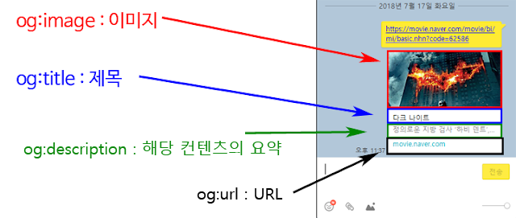

# Optimizing

## Image(`import Image from 'next/image'`)

Next.js에서는 특별한 내장 이미지 요소가 있고 이것은 더 최적화된 방법으로 이미지를 출력할 수 있게 도와줍니다.\
예를 들어 페이지에서 실제로 보이는 경우에만 이미지가 표시되도록 이미지를 지연 로딩하여 구현하며 경량화된 이미지 타입으로 불러옵니다.\
추가적인 구성 없이 자동적으로 이를 실행해줍니다.

```tsx
// app/page.js

import Image from "next/image";

export default function Page() {
  return <Image src={logoImg} alt="A plate with food on it" />;
}
```

html의 이미지 요소를 보면 추가되어 있는 속성을 볼 수 있습니다.

```html
<!-- html -->


```

`loading="lazy"`은 이미지가 지연로딩되도록 합니다.

`srcset`은 Netx.js에서 자동으로 추가한 것으로, `srcset`으로 포트와 웹사이트를 방문하는 기기에 따라 크기가 조정된 이미지가 로딩되도록 보장합니다.\
또한 자동적으로 사용자에 의해 사용되는 브라우저에 가장 알맞는 파일 포맷으로 이미지를 서브합니다.

`width="1024" height="1024"` 자동적으로 너비와 높이를 추론되어 있으며, 원한다면 덮어 쓸 수 있습니다.\
또한 너비와 높이를 설정하면 NextJS는 해당 이미지에 적합한 공간을 미리 마련해 두어 이미지가 표시될 때 요소들의 레이아웃이 갑자기 움직이지 않도록 설정해 줍니다.

NextJS Image 컴포넌트에서 너비와 높이를 설정해주면 불필요하게 큰 이미지의 크기를 고정시켜 효율적으로 이미지를 불러올 수 있습니다.

```tsx
// app/page.js

import Image from "next/image";

export default function Page() {
  return (
    <Image
      src={logoImg}
      width={100} // 수동으로 오버라이드
      height={100} // 수동으로 오버라이드
      alt="A plate with food on it"
    />
  );
}
```

단, 로컬 이미지를 크기를 조정하여 로드하고 싶을 때는 때는 가급적이면 이렇게 `width` 와 `height` 를 설정하는 것보다 이미지의 `sizes` 라는 프로퍼티를 사용하는 것이 좋습니다.

```tsx
// app/page.js

import Image from "next/image";

export default function Page() {
  return (
    <Image
      src={logoImg}
      sizes="10vw" // 현재 사용하는 뷰포트의 대략 10%의 너비로 조정
      alt="A plate with food on it"
    />
  );
}
```

### Props

다음은 `Image` 컴포넌트에서 사용할 수 있는 `props`의 요약입니다.

|        Prop         |                 Example                  |      Type       |   Status   |
| :-----------------: | :--------------------------------------: | :-------------: | :--------: |
|        `src`        |           `src="/profile.png"`           |     String      |  Required  |
|       `width`       |              `width={500}`               |  Integer (px)   |  Required  |
|      `height`       |              `height={500}`              |  Integer (px)   |  Required  |
|        `alt`        |      `alt="Picture of the author"`       |     String      |  Required  |
|      `loader`       |          `loader={imageLoader}`          |    Function     |     -      |
|       `fill`        |              `fill={true}`               |     Boolean     |     -      |
|       `sizes`       | `sizes="(max-width: 768px) 100vw, 33vw"` |     String      |     -      |
|      `quality`      |              `quality={80}`              | Integer (1-100) |     -      |
|     `priority`      |            `priority={true}`             |     Boolean     |     -      |
|    `placeholder`    |           `placeholder="blur"`           |     String      |     -      |
|       `style`       |     `style={{objectFit: "contain"}}`     |     Object      |     -      |
| `onLoadingComplete` |   `onLoadingComplete={img => done())}`   |    Function     | Deprecated |
|      `onLoad`       |       `onLoad={event => done())}`        |    Function     |     -      |
|      `onError`      |        `onError(event => fail()}`        |    Function     |     -      |
|      `loading`      |             `loading="lazy"`             |     String      |     -      |
|    `blurDataURL`    |    `blurDataURL="data:image/jpeg..."`    |     String      |     -      |
|    `overrideSrc`    |         `overrideSrc="/seo.png"`         |     String      |     -      |

### priority 경고

`Image` 컴포넌트를 사용하다보면 이미지가 페이지를 로딩할 때 항상 보여서, 해당 이미지가 화면 내에서 용량을 많이 차지하기 때문에 `priority` 속성을 추가해달라는 경고를 볼 수 있습니다.

```plaintext
// 경고

warn-once.js:16 Image with src "/_next/static/media/logo.5daadb4d.png" was detected as the Largest Contentful Paint (LCP). Please add the "priority" property if this image is above the fold.
```

만약 로고처럼 첫 로딩 시 보이는 이미지라면 레이지로딩을 할 필요가 없습니다.\
`priority` 속성을 아래와 같이 추가하여 우선적으로 로딩되도록 하면 됩니다.

```tsx
// app/page.js

import Image from "next/image";

export default function Page() {
  return <Image src={logoImg} alt="A plate with food on it" priority />;
}
```

### (외부에서 이미지를 가져올 경우)

```plaintext
// 에러

Error: Invalid src prop (https://도메인/main_3250387/32503877629.20220527022132.jpg) on `next/image`, hostname "도메인" is not configured under images in your `next.config.js`
```

사용하고자 하는 이미지가 현재 Next 프로젝트에 저장되있는게 아니라 외부 URL을 사용하는 경우 Next.js의 보안 때문에 차단됩니다.\

#### domains

해결하기 위해서는 `next.config.js`의 `domains` 속성에 추가해서 불러오는 이미지가 안전하다는 것을 알려줘야 합니다.

```js
// next.config.js

module.exports = {
  images: {
    domains: ["도메인 주소"],
  },
};
```

#### remotePatterns

`remotePatterns`은 `domains`보다 더 타이트하게 제한할 수 있습니다.

```js
// next.config.js

module.exports = {
  images: {
    remotePatterns: [
      {
        protocol: "https",
        hostname: "res.cloudinary.com",
        port: "",
        pathname: "/account123/**",
        search: "",
      },
    ],
  },
};
```

`remotePatterns`은 외부 도메인과 특정 포트에 대해서만 경로를 설정해 줄 수 있습니다.\
추가적으로 와일드 카드를 통해 여러 서브 도메인에 대해서 외부 경로를 설정해 줄 수있는데, 위 옵션에 설정한 내용 중, 프로토콜, 호스트 이름, 포트 번호, 서브 도메인 등 하나라도 일치하지 않는 경우에는 400 에러가 발생합니다.

#### fill

외부에서 받아오는 이미지의 경우 크기를 알 수 없으니 `fill` 속성을 사용합니다.\
`fill` prop은 렌더링되는 이미지 요소의 위치를 절대적으로 설정하기 때문에 그 요소는 가장 가까운 부모 컨테이너에 위치하게 됩니다.

```tsx
import Image from "next/image";

function Post({ post }) {
  return (
    <div className="post-image">
      <Image src={post.image} fill alt={post.title} />
    </div>
  );
}
```

```css
.post-image {
  width: 8rem;
  height: 6rem;
  position: relative;
}
```

## metadata

`<head>`에 들어가는 모든 내용은 `metadata`에 의해 설정되거나 NextJS로 인해 이면에서 자동으로 설정됩니다.\
`page` 또는 `layout` 에서만 사용 가능합니다.

- discription은 표시되는 검색 결과의 제목 아래에 표시되는 텍스트입니다.
- openGraph는 떤 HTML 문서의 메타정보를 쉽게 표시하기 위해서 메타정보에 해당하는 제목, 설명, 문서의 타입, 대표 URL 등 다양한 요소들에 대해서 사람들이 통일해서 쓸 수 있도록 정의해놓은 프로토콜입니다.

### 정적 페이지 메타데이터

```tsx
import { Metadata } from "next";

export const metadata: Metadata = {
  title: meal.title,
  description: meal.summary,
  openGraph: {
    title: meal.title,
    description: meal.summary,
    images: ["/thumbnail.png"],
  },
};
```

### 동적 페이지 메타데이터

`metadata`는 `generateMetadata`로 현재 페이지 메타 데이터를 동적으로도 생성 가능합니다.\
`generateMetadata`는 현재 page가 전달 받는 매개변수를 그대로 받을 수 있습니다.

```tsx
import { Metadata } from "next";

import { Suspense } from "react";

type Props = {
  searchParams: {
    q?: string;
  };
};

// 동적 메타데이터 생성
export function generateMetadata({ searchParams }: Props): Metadata {
  return {
    title: `${searchParams.q} : 검색`,
    description: `${searchParams.q} 검색 결과입니다`,
    openGraph: {
      title: `${searchParams.q} : 검색`,
      description: `${searchParams.q} 검색 결과입니다`,
      images: ["/thumbnail.png"],
    },
  };
}

export default function Page({ searchParams }: Props) {
  return (
    <Suspense
      key={searchParams.q || ""}
      fallback={<BookListSkeleton count={3} />}
    >
      <SearchResult q={searchParams.q || ""} />
    </Suspense>
  );
}
```

### layout metadata

`layout.js`에서 설정한 `metadata` 는 페이지에서 설정한 `metadata` 와 병합됩니다.\
`page.js`에서 `metadata` 를 전혀 설정하지 않았다면 그 페이지에는 이 `metadata` 객체 전체가 사용되게 됩니다.

예를 들어 제목만 설정되어 있고 설명은 없는 페이지에서는 `layout.js`의 메타데이터 설명이 해당 페이지의 제목과 병합됩니다.

```tsx
export const metadata = {
  title: "NextPosts",
  description: "Browse and share amazing posts.",
};

export default function RootLayout({ children }) {
  return (
    <html lang="en">
      <body>
        <Header />
        <main>{children}</main>
      </body>
    </html>
  );
}
```


