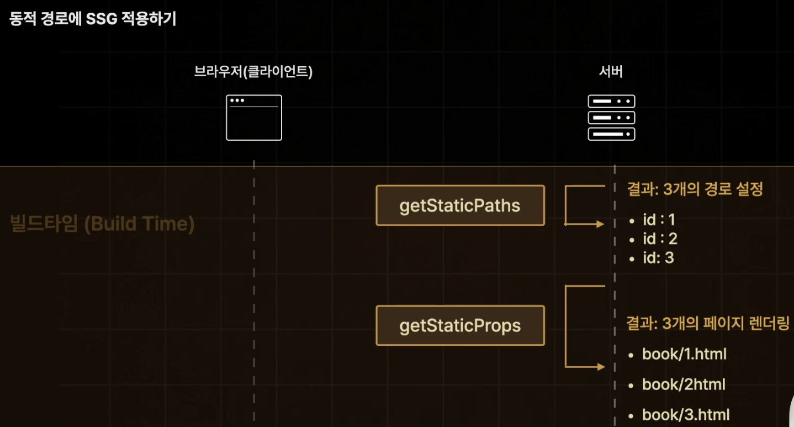
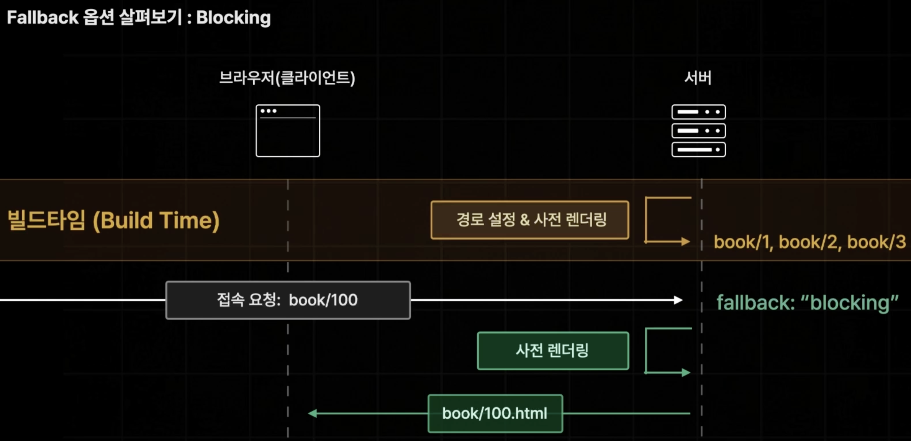

# Pages Router

## getServerSideProps

페이지에서 `getServerSideProps` (서버 사이드 렌더링)이라는 함수를 내보내면, Next.js는 `getServerSideProps`에서 반환된 데이터를 사용해 각 요청마다 페이지를 사전 렌더링합니다.

```tsx
import type { InferGetServerSidePropsType, GetServerSideProps } from 'next'

type Repo = {
  name: string
  stargazers_count: number
}

// 컴포넌트보다 먼저 실행되어, 컴포넌트에 필요한 데이터를 불러오는 함수
export const getServerSideProps = (async () => {
  // 외부 API에서 데이터를 가져옴
  const res = await fetch('https://api.github.com/repos/vercel/next.js')
  const repo: Repo = await res.json()
  // props를 통해 페이지에 데이터를 전달, 반환은 꼭 props 객체 사용
  return { props: { repo } }
}) satisfies GetServerSideProps<{ repo: Repo }>

export default function Page({
  repo,
  // InferGetServerSidePropsType는 getServerSideProps의 반환 값 타입을 자동으로 추론해 주는 타입
}: InferGetServerSidePropsType<typeof getServerSideProps>) {
  return (
    <main>
      <p>{repo.stargazers_count}</p>
    </main>
  )
}
```

### getServerSideProps 주의

`getServerSideProps`는 사전 렌더링시 서버에서 단 한 번만 실행이 됩니다.\
따라서 내부에서 브라우저 환경에서만 이용할 수 있는 window 객체 등에는 접근할 수 없습니다.

## getStaticProps

`getStaticProps`는 Next.js에서 페이지를 정적으로 생성하기 위해 사용하는 함수입니다.\
빌드 타임에 필요한 데이터를 서버에서 미리 가져와 페이지를 렌더링하며, 클라이언트 요청 이전에 페이지가 완성되므로 빠른 로딩과 SEO 최적화에 유리합니다.\
이를 사용하여 CMS 데이터나 API 응답을 페이지에 미리 반영할 수 있습니다.

### 주요 개념 및 예시

서버에서 실행: `getStaticProps`는 서버에서만 실행되며, 클라이언트 번들에 포함되지 않습니다.\
그래서 데이터베이스나 API를 직접 호출하는 서버 전용 코드를 안전하게 사용할 수 있습니다.

```tsx
// pages/index.tsx
import type { InferGetStaticPropsType, GetStaticProps } from 'next'

type Repo = {
  name: string
  stargazers_count: number
}

// 빌드 타임에 GitHub API에서 데이터를 받아옴
export const getStaticProps: GetStaticProps<{ repo: Repo }> = async () => {
  const res = await fetch('<https://api.github.com/repos/vercel/next.js>')
  const repo = await res.json()
  return { props: { repo } }
}

// 받아온 데이터를 페이지에 표시
export default function Page({ repo }: InferGetStaticPropsType<typeof getStaticProps>) {
  return (
    <div>
      <h1>{repo.name}</h1>
      <p>Stars: {repo.stargazers_count}</p>
    </div>
  )
}
```

`getStaticProps`에서 `revalidate`를 사용하면 ISR 방식을 사용할 수 있습니다.

```tsx
// pages/index.tsx
import type { InferGetStaticPropsType, GetStaticProps } from 'next'

type Repo = {
  name: string
  stargazers_count: number
}

// 빌드 타임에 GitHub API에서 데이터를 받아옴
export const getStaticProps: GetStaticProps<{ repo: Repo }> = async () => {
  const res = await fetch('<https://api.github.com/repos/vercel/next.js>')
  const repo = await res.json()
  return {
    props: { repo },
    // 3초 마다 SSR 방식처럼 새 페이지를 업데이트
    revalidate: 3,
    }
}

// 받아온 데이터를 페이지에 표시
export default function Page({ repo }: InferGetStaticPropsType<typeof getStaticProps>) {
  return (
    <div>
      <h1>{repo.name}</h1>
      <p>Stars: {repo.stargazers_count}</p>
    </div>
  )
}
```

### 정적 HTML과 JSON 생성

`getStaticProps`가 반환한 데이터는 빌드 타임에 정적 HTML과 JSON 파일로 생성됩니다. 이 JSON 파일은 클라이언트 사이드 전환 시 사용되어 빠른 페이지 전환이 가능합니다.

#### 사용 사례

- 빌드 타임에 데이터가 확정된 경우: 사용자가 요청하기 전에 데이터가 준비되어야 할 때 유용합니다.

- SEO가 중요한 페이지: 검색 엔진에서 미리 렌더링된 페이지를 읽을 수 있어 SEO 성능이 개선됩니다.

- 데이터가 사용자별이 아닌 공용 데이터일 때: 사용자에 따라 달라지지 않는 데이터를 페이지에 제공하는 경우, getStaticProps는 페이지 성능 최적화에 적합합니다.

### 미리보기 모드 지원

`getStaticProps`는 미리보기 모드를 지원하여, 정적 생성된 페이지를 임시로 요청 시 렌더링하도록 할 수 있습니다.\
이 기능은 CMS의 초안을 확인하는 등 필요한 경우 유용합니다.

추가 예시 - CMS 데이터: 아래는 CMS로부터 블로그 게시물 목록을 가져와 정적 페이지로 만드는 예시입니다.

```tsx
// pages/blog.tsx
export default function Blog({ posts }: { posts: { title: string }[] }) {
  return (
    <ul>
      {posts.map((post, index) => (
        <li key={index}>{post.title}</li>
      ))}
    </ul>
  )
}

export const getStaticProps: GetStaticProps = async () => {
  const res = await fetch('<https://example.com/api/posts>')  // CMS API 호출
  const posts = await res.json()

  return {
    props: {
      posts,
    },
  }
}
```

위 예시에서는 `getStaticProps`가 CMS API에서 posts 데이터를 가져와 Blog 컴포넌트로 전달하며, 빌드 타임에 게시물 목록을 미리 렌더링합니다.

### 요약

- `getStaticProps`: 빌드 타임에 데이터를 미리 받아 정적 페이지를 생성하여, 로딩 속도와 SEO를 최적화합니다.

- 사용 위치: 페이지 컴포넌트에서만 사용할 수 있으며, `_app`,`_document`, `_error` 등에서는 사용할 수 없습니다.

- 적용 사례: CMS 데이터, API 데이터를 미리 받아야 할 때 유용하며, 사용자 맞춤이 필요 없는 공용 데이터 제공에 적합합니다.

이렇게 `getStaticProps`는 Next.js에서 빌드 타임에 데이터를 미리 확보해, 페이지 로딩과 SEO 성능을 극대화하는 데 활용됩니다.

### getStaticProps 주의

`getStaticProps`는 빌드 타임에 실행되기 때문에 개발 모드에서는 확인할 수 없습니다.

## getStaticPaths



`getStaticPaths`는 Next.js에서 정적 페이지(static pages)를 미리 생성할 때 사용하는 함수입니다.\
이 함수는 빌드 시점에 어떤 경로(페이지 URL)를 미리 만들어야 하는지를 지정해줍니다.

### 사용 목적

주로 동적 라우팅(dynamic routing)을 사용하는 페이지에서 사용됩니다. 예를 들어, `posts/[id].js` 같은 파일 구조에서는 `[id]`에 따라 URL이 달라집니다.\
`getStaticPaths`는 이 `[id]`에 들어갈 값들을 미리 지정해서 해당 페이지들을 정적 페이지로 생성하게 합니다.

### 필수 리턴값

- `paths`: 미리 만들어질 경로들을 배열로 지정합니다.\
이 배열 안에는 `{ params: { id: '1' } }`처럼 각 경로의 파라미터 값이 들어갑니다.\
여기서 id는 URL에서 동적으로 변하는 값입니다.

- `fallback`: `true`, `false`, 또는 `'blocking'`으로 설정할 수 있으며, 이 설정에 따라 미리 지정되지 않은 경로 요청 시 처리 방식을 결정합니다.
  - `true`: 즉시 생성 + 데이터 없는 풀백 상태의 페이지만 미리 반환 (Like SSR)
  
  - `false`: 404 Not Found 반환
  
  - `"blocking"`: 즉시 생성 (Like SSR)
  

### getStaticPaths 예제 코드

```jsx
import { GetStaticPropsContext, InferGetStaticPropsType } from "next";
import { useRouter } from "next/router";
import Image from "next/image";

import style from "./[id].module.css";
import fetchOneBook from "@/lib/fetch-one-book";

// 어떤 경로를 미리 생성할지 지정
export const getStaticPaths = () => {

  return {
    // id가 "1", "2", "3"인 페이지를 미리 생성하겠다는 뜻
    paths: [
      { params: { id: "1" } },
      { params: { id: "2" } },
      { params: { id: "3" } }
    ],
    // 경로에 지정되지 않은 id에 대해서도 요청이 오면 페이지를 생성
    // "4" 같은 미리 정의되지 않은 id로 요청이 들어오면 해당 페이지를 동적으로 생성하여 캐시
    fallback: true,
  };
};

// 각 경로에서 필요한 데이터를 가져와서 페이지에 전달
export const getStaticProps = async (
  context: GetStaticPropsContext
) => {
  const id = context.params!.id;
  const book = await fetchOneBook(Number(id));

  // 데이터를 props로 반환하여 페이지 컴포넌트에 전달
  return { props: { book } };
};

export default function Page({
  book
}: InferGetStaticPropsType<typeof getStaticProps>) {
  const router = useRouter();

  // 아직 생성되지 않은 페이지가 요청되었을 때 로딩 화면을 표시
  if (router.isFallback) return <p>로딩중입니다.</p>;
  //  book 데이터가 없으면 오류 메시지를 표시
  if (!book) return <p>문제가 발생했습니다. 다시 시도하세요.</p>;

  const {
    title,
    subTitle,
    description,
    author,
    publisher,
    coverImgUrl
  } = book;

  return (
    <div className={style.container}>
      <div className={style.cover_img_container}>
        <Image
          src={coverImgUrl}
          alt={title}
          layout="fill"
          objectFit="cover"
        />
      </div>
      <div className={style.title}>{title}</div>
      <div className={style.subTitle}>{subTitle}</div>
      <div className={style.author}>
        {author} | {publisher}
      </div>
      <div className={style.description}>{description}</div>
    </div>
  );
}
```

위 코드에서는 `id`가 `1`과 `2`인 페이지가 빌드 시점에 미리 생성됩니다.\
`fallback`: `false`는 이외의 id에 대해선 404 페이지를 보여준다는 의미입니다.

### getStaticPaths 요약

- 역할: 빌드 시점에 특정 경로를 미리 생성하여 빠른 로딩 속도를 제공합니다.

- 필수 요소: `paths`로 생성할 경로 지정, `fallback`으로 미리 지정되지 않은 경로 처리 방식 결정.

## 자료

- [한 입 크기로 잘라먹는 Next.js(15+)](https://www.udemy.com/course/onebite-next/?srsltid=AfmBOoouKULu5MsIC6TetGWtEP7Gmr9wegFjZhFJ5CO5THnjqk_tMJZj)
