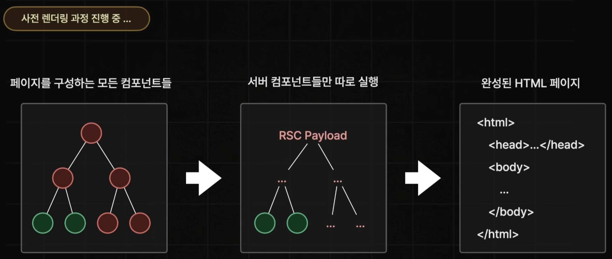

# Rendering

Next.js는 리액트 서버 컴포넌트 그리고 클라이언트 컴포넌트가 있습니다.

creat React app이나 Vite의 도움을 받아 만드는 모든 바닐라 리액트 앱들에서 기본적으로 클라이언트 컴포넌트를 사용하고 있습니다.\
React.js는 순수한 클라이언트 사이드 라이브러리로 브라우저에서 클라이언트 측에서 코드를 실행합니다.

Next.js는 풀스택 프레임워크이기 때문에 프론트엔드 뿐 아니라 백엔드도 있습니다.\
기본적으로 Next.js에서 모든 컴포넌트는 서버 컴포넌트입니다.\
따라서 Next.js와 작업할 때 코드는 백엔드에서도 실행됩니다.

## React 18 버전 부터 추가된 서버 컴포넌트를 적용하면서 달라진 렌더링

Next.js가 렌더링 과정중 문제가 있습니다.\
사전 렌더링 과정 중 상호작용을 위한 Hydration을 위해 JS Bundle을 전달합니다.\
JS Bundle에 포함이 되어서 브라우저에 전달된 리엑트 컴포넌트들은 한 번 더 실행이 됩니다.

그런데 여기서 JS Bundle에 포함된 컴포넌트들에는 한 번 더 실행이 되지 않아도 되는 컴포넌트도 포함되어 있습니다.


JS Bundle에는 상호작용이 꼭 필요한 React Hooks나 event 등이 있는 컴포넌트들과 상호작용 기능이 없어서 Hydration이 필요하지 않은 정적인 컴포넌트도 같이 포함이 되어 있었습니다.


하지만 페이지 라우터에서는 상호작용이 필요한 컴포넌트와 그렇지 않은 컴포넌트를 분류하지 않았습니다.\
JS Bundle에 포함시켰기 때문에 JS Bundle의 크기는 불필요하게 커졌습니다.\
또한 어쩔 수 없이 상호작용이 필요 없는 컴포넌트들도 한 번 더 실행하기 때문에 Hydration이 진행되는 시간도 늘어나서 TTI까지의 시간도 늦춰졌습니다.


그래서 사전 렌더링 과정에서 상호작용이 없는 컴포넌트를 JS Bundle에서 제외시키기 위해 다른 유형으로 분류하였습니다.


유형을 분류하기 위해 나온 것이 리엑트 서버 컴포넌트입니다.\
상호작용이 없어서 서버측에서만 실행되면 되는 컴포넌트를 서버 컴포넌트로 분류했습니다.\
상호작용이 있어서 Hydration이 필요하기 때문에 서버와 브라우저에서 한 번씩 실행되어야 하는 컴포넌트는 기존의 클라이언트 컴포넌트로 분류했습니다.


Next 서버가 사전 렌더링을 진행하는 과정에서 HTML을 생성하기 위한 렌더링을 진행할 때는 모든 컴포넌트를 실행합니다.\
하지만 JS Bundle에 전달하는 과정에서는 서버 컴포넌트를 제외하고 클라이언트 컴포넌트만 브라우저에 전달합니다.

## 리액트 서버 컴포넌트

React Server Components는 UI를 서버에서 렌더링하고, 캐시를 통해 성능을 최적화하는 기능입니다.\
모든 리액트 컴포넌트들은 그것들이 페이지인지, 레이아웃인지, 기본 컴포넌트인지에 상관없이 브라우저가 아닌 오직 서버에서만 사전 렌더링 진행할 때 딱 한 번 실행됩니다.\
이것을 리액트 서버 컴포넌트라 부릅니다.

예시로 `console.log()`를 사용해도 브라우저 개발자 툴에서 실행 로그를 확인할 수 없으며 터미널에서만 확인할 수 있습니다.

서버 렌더링에는 정적 렌더링(Static), 동적 렌더링(Dynamic), 스트리밍(Streaming)이라는 세 가지 방식이 있습니다.

### 리액트 서버 컴포넌트 사용 이유

- 데이터 페칭: 서버에서 데이터를 가져와 클라이언트 요청을 줄여 성능을 개선합니다.

- 보안: 토큰이나 API 키와 같은 민감한 데이터와 로직을 서버에만 두고, 클라이언트에 노출시키지 않아 보안을 강화합니다.

- 캐싱: 렌더링된 결과를 저장해, 이후 같은 데이터를 재사용해 성능을 높입니다.

- 성능: 다운로드해야 하는 클라이언트 측의 자바스크립트 코드가 줄어들 수 있어 웹사이트의 성능을 향상시킬 수 있습니다.

- SEO: 웹 검색 크롤러들은 완성 컨텐츠를 포함하는 페이지들을 볼 수 있기 때문에 검색엔진 최적화에도 좋습니다.

- 스트리밍: 렌더링 작업을 청크로 분할하고 준비되는 대로 클라이언트에 스트리밍하여 페이지의 일부가 준비되면 바로 보여주고, 나머지는 준비되는 대로 표시해 사용자 경험을 향상시킵니다.

### 특징

- `Event Listener` 사용 불가
- `React Hooks`사용 불가
- 컴포넌트를 `async` 함수로 정의 가능

### Static Rendering (기본 설정)

Static Rendering은 빌드 타임에 미리 경로를 렌더링하는 방식입니다. 즉, 페이지가 사용자에게 요청되기 전에 이미 서버에서 HTML 파일을 만들어둡니다. 이 방식은 주로 변경이 거의 없고 사용자마다 동일한 콘텐츠를 보여줄 때 적합합니다. 예를 들어, 블로그 게시물이나 제품 페이지처럼 자주 변하지 않는 페이지가 이에 해당합니다.

Next.js는 Static Rendering된 결과를 캐시하고, 이를 CDN(Content Delivery Network)에 저장하여 사용자와 서버 간의 응답 속도를 높일 수 있습니다.

### Dynamic Rendering

Dynamic Rendering은 요청 시 경로를 각 사용자마다 새로 렌더링하는 방식입니다.\
사용자가 요청할 때마다 서버에서 실시간으로 데이터를 가져오고 페이지를 렌더링합니다.\
주로 사용자에 따라 다른 데이터를 보여줘야 할 때나, 요청 시점에만 알 수 있는 정보가 있을 때 사용합니다.\
예를 들어, 사용자별 맞춤화된 대시보드나 검색 결과 페이지가 이에 해당됩니다.

Next.js는 동적으로 렌더링할 때에도, 일부 데이터는 캐시하고 일부는 실시간으로 가져오는 방식으로 혼합된 처리가 가능합니다.\
이는 성능을 최적화하면서도 동적 콘텐츠를 지원합니다.

#### Dynamic Functions

Next.js에서 동적 함수를 사용하면 페이지가 항상 요청 시 렌더링됩니다.\
동적 함수는 쿠키나 요청 헤더, 검색 매개변수 같은 요청에 따라 달라지는 데이터를 처리할 때 유용합니다.

동적 API는 다음과 같으며, 이 함수들 중 하나를 사용하면 전체 경로가 요청 시 동적으로 렌더링됩니다.

- `cookies()`

- `headers()`

- `unstable_noStore()`

- `unstable_after()`

- `searchParams` prop

### Streaming


Streaming은 서버에서 콘텐츠를 청크 단위로 나누어 순차적으로 렌더링하고, 준비되는 대로 클라이언트에 스트리밍하는 방식입니다.\
이를 통해 사용자는 페이지의 일부를 빠르게 볼 수 있고, 전체 콘텐츠가 렌더링될 때까지 기다릴 필요가 없습니다.

Streaming은 초기 페이지 로드 성능을 크게 개선할 수 있는 기술로, 특히 느린 데이터 소스를 처리해야 할 때 유용합니다.\
예를 들어, 제품 페이지에서 리뷰 데이터를 가져오는 경우, 리뷰가 모두 로드되기 전에 페이지의 다른 콘텐츠를 먼저 보여줄 수 있습니다.

Next.js는 기본적으로 Streaming을 지원하며, `loading.js` 파일과 React `Suspense`를 사용 통해 특정 UI 컴포넌트를 로딩 중임을 표시하면서도 스트리밍을 적용할 수 있습니다.

이렇게 각 렌더링 방식은 사용자의 요구와 페이지 특성에 맞게 선택될 수 있으며, 성능과 사용자 경험을 동시에 고려한 전략입니다.

Static 페이지는 빌드 타임에 모든 비동기 작업을 끝내기 때문에 스트리밍을 사용 의미가 없습니다.\
따라서 Streaming은 Dynamic 페이지에서 사용할 때 유용합니다.

#### Loading과 Suspense의 차이

`loading.js`는 전체 페이지 컴포넌트 단위 로딩에 적합합니다.\
React의 `Suspense`는 경계를 정의함으로써 특정 컴포넌트 단위에서 세밀한 로딩 처리가 필요할 때 사용하면 좋습니다.

#### 쿼리 스트링이 변경될 때 Suspense로 스트리밍 하기

`Suspense` 스트리밍은 브라우저에서 쿼리 스트링이 변경될 때 트리거 되지 않습니다.\
그래서 검색에서 `Suspense`를 이용할 때 최초 검색 이후에는 `Suspense`가 적용되지 않는 문제가 발생했습니다.\
하지만 `Suspense` 컴포넌트에 `key` props를 전달하여 쿼리 스트링이 변경될 때 트리거 되도록 할 수 있습니다.

```tsx
const { q } = await searchParams;

<Suspense key={q || ""} fallback={<div>Loading ...</div>}>
  <SearchResult q={q || ""}/>
</Suspense>
```

React에서 `key`가 변하면 `Suspense`를 새로운 컴포넌트로 인식하여 새로 그리고, 다시 `fallback` 상태로 돌아갑니다.\
따라서 `key`의 값으로 쿼리 스트링을 전달하면 쿼리 스트링이 변경될 때마다 `Suspense`는 트리거 됩니다.

## 클라이언트 컴포넌트

어떤 사용자 상호작용을 기다리고 있는 부분은 클라이언트에서 실행되는 코드가 필요하므로 클라이언트 컴포넌트여야 합니다.\
상호작용에 사용하는 eventHandler, 리액트 훅들은 서버 측에서는 사용 불가하기 때문에 클라이언트 컴포넌트를 사용해야합니다.

클라이언트 컴포넌트는 사전 렌더링 진행할 때 한 번, 하이드레이션 진행할 때 한 번, 총 두 번 실행됩니다.

### 클라이언트 컴포넌트 사용 이유

- 상호작용: Client Components는 상태 관리, 이벤트 처리, 효과 적용이 가능하여 사용자와의 실시간 상호작용을 지원합니다.

- 브라우저 API 접근: 브라우저에 있는 API, 예를 들어 `Geolocation` API, `localStorage` 등을 사용할 수 있습니다.

### 클라이언트 컴포넌트 사용 방법

클라이언트 컴포넌트를 만들고 싶다면 Next.js에게 컴포넌트를 잡고 있는 파일 위에 특별한 지시어를 사용하여 드러나게 알려야 합니다.\
파일 상단에 `"use client"` 지시어를 import 위에 추가하면 됩니다.

이 지시어를 선언하면 해당 파일과 그 안의 모든 자식 컴포넌트는 클라이언트 측에서 실행됩니다.\
이를 통해 컴포넌트가 클라이언트 번들에 포함되어 인터랙티브한 기능을 제공합니다.

```jsx
'use client'
import { useState } from 'react'

export default function Counter() {
  const [count, setCount] = useState(0)

  return (
    <div>
      <p>You clicked {count} times</p>
      <button onClick={() => setCount(count + 1)}>Click me</button>
    </div>
  )
}
```

### Hydration

`'use client'`는 client에서만 렌더한다는 의미가 아니라 client에서도 렌더를 한다는 의미입니다.
`'use client'`를 사용해도 일단 서버에서 렌더링(브라우저가 이해할 수 있는 HTML로 변환)됩니다.

사용자가 요청을 보내면 Next.js는 요청에 맞는 components를 HTML로 변환하여 응답합니다.\
HTML이 사용자에게 전달되면 React를 로드하고 React에 HTML을 초기화 합니다.(`init(HTML)`)\
그럼 HTML은 interactive한 React component가 됩니다.

Next.js에서 렌더링한 HTML은 React application으로 초기화되기 전까지는 하드 코딩된 HTML과 같으며 서버 컴포넌트를 사용한 경우가 이에 해당됩니다.\
`'use client'`는 HTML을 interactive한 React component로 만들어 달라는 표시이며 클라이언트 컴포넌트가 이에 해당합니다.

## 언제 어떤 컴포넌트를 사용해야 할까?

| | Server Component | Client Component |
| - | - | - |
| 데이터 페칭 | O | X |
| 백엔드 리소스에 직접 접근 | O | X |
| 민감한 정보를 서버에 보관 (액세스 토큰, API 키 등) | O | X |
| 대형 종속성을 서버에 유지 / 클라이언트 측 JavaScript 줄이기 | O | X |
| 인터랙티비티 및 이벤트 리스너 추가 (`onClick()`, `onChange()` 등) | X | O |
| 상태 및 생명주기 효과 사용 (`useState()`, `useReducer()`, `useEffect()` 등) | X | O |
| 브라우저 전용 API 사용 | X | O |
| 상태, 효과 또는 브라우저 전용 API에 의존하는 커스텀 훅 사용 | X | O |
| [React 클래스 컴포넌트](https://react.dev/reference/react/Component) 사용 | X | O |

## 서버 컴포넌트와 클라이언트 컴포넌트 혼합하기

서버와 클라이언트 컴포넌트를 함께 사용할 때, UI 구조를 컴포넌트 트리로 시각화하는 것이 도움이 될 수 있습니다.\
트리는 루트 레이아웃(기본적으로 서버 컴포넌트)부터 시작하며, 이 트리 내에서 클라이언트 컴포넌트는 `"use client"` 지시어를 통해 명확히 정의된 부분에서만 동작하게 됩니다.

### 중요한 개념

- 클라이언트 컴포넌트 모듈 내에서는 서버 컴포넌트를 직접 `import`할 수 없습니다.\
클라이언트 컴포넌트는 서버 컴포넌트 이후에 렌더링되기 때문에 서버 컴포넌트를 가져오려면 새로운 요청이 필요합니다.

- 서버와 클라이언트 사이에서 코드를 왔다 갔다 하지 않고, 클라이언트가 서버의 데이터에 접근해야 할 때마다 새로운 요청을 서버로 보냅니다.

- 새로운 요청이 있을 때 모든 서버 컴포넌트가 먼저 렌더링됩니다.\
그 후, 클라이언트에서 React는 서버에서 받은 데이터(RSC Payload)를 사용해 클라이언트와 서버 컴포넌트를 통합하여 처리합니다.

### 불가능한 패턴: 서버 컴포넌트를 클라이언트 컴포넌트에 직접 import

서버 컴포넌트를 클라이언트 컴포넌트 안에 직접 import하는 것은 불가능합니다. 아래는 잘못된 예시입니다:

```tsx
'use client'
import ServerComponent from './Server-Component'

export default function ClientComponent() {
  const [count, setCount] = useState(0)
  return (
    <>
      <button onClick={() => setCount(count + 1)}>{count}</button>
      <ServerComponent />  // 서버 컴포넌트는 직접 import할 수 없습니다.
    </>
  )
}
```

### 가능한 패턴: 서버 컴포넌트를 props로 전달

서버 컴포넌트를 클라이언트 컴포넌트로 전달할 때는 props, 특히 children을 사용해 클라이언트 컴포넌트에 서버 컴포넌트를 넘길 수 있습니다. 아래는 지원되는 패턴의 예시입니다:

```tsx
'use client'
import { useState } from 'react'

export default function ClientComponent({ children }) {
  const [count, setCount] = useState(0)
  return (
    <>
      <button onClick={() => setCount(count + 1)}>{count}</button>
      {children}  // 서버 컴포넌트가 이 위치에 렌더링됩니다.
    </>
  )
}
```

부모 컴포넌트에서 서버 컴포넌트를 클라이언트 컴포넌트의 자식으로 전달할 수 있습니다:

```tsx
import ClientComponent from './client-component'
import ServerComponent from './server-component'

export default function Page() {
  return (
    <ClientComponent>
      <ServerComponent />  // 서버 컴포넌트를 자식으로 전달합니다.
    </ClientComponent>
  )
}
```

이렇게 하면 클라이언트 컴포넌트와 서버 컴포넌트가 서로 독립적으로 렌더링될 수 있습니다.

## 주의 사항

### 서버 컴포넌트에는 브라우저에서 실행될 코드가 포함되면 안됩니다

```jsx
// src/app/page.tsx
export default function Home() {
  // React Hooks 불가
  const [state, setState] = useState("");
  useEffect(() => {});

  return (
    <div
    // 이벤트 핸들러 불가
      onClick={() => {
        console.log("Click!");
      }}
    >
      인덱스
    </div>
  )
}
```

```jsx
import BrowserLib from "BrowserLib";

export default function Home() {
  // 브라우저에서 실행되는 기능을 담고 있는 라이브러리 호출 불가
  BrowserLib();

  return <div>인덱스</div>
}
```

### 클라이언트 컴포넌트는 클라이언트에서만 실행되는게 아닙니다

```jsx
"use client";

export default function Home() {
  // server와 client에서 각각 한 번씩 두 번 실행
  // 터미널과 브라우저 모두에서 볼 수 있음
  console.log("렌더링");

  return <div>인덱스</div>
}
```

### 클라이언트 컴포넌트에서 서버 컴포넌트를 import 할 수 없습니다

```jsx
export default function ServerComponent() {

  return <div>서버 컴포넌트</div>;
}
```

```jsx
"use client";

// 불가능
import ServerComponent from "./server-component.tsx"

export default function ClientComponent() {

  return <ServerComponent />
}
```

클라이언트 컴포넌트의 코드는 서버와 브라우저에서 모두 실행이 됩니다.
서버 컴포넌트의 코드는 오직 서버에서만 실행 됩니다.
따라서 Hydration을 위해 브라우저에서 실행될 때 서버 컴포넌트의 코드는 존재하지 않기 때문에 문제가 발생합니다.

클라이언트 컴포넌트에서 서버 컴포넌트를 import 하면 Next.js는 문제가 발생할 것을 알기에 서버 컴포넌트를 자동으로 클라이언트 컴포넌트로 변경합니다.

만약 어쩔 수 없이 클라이언트 컴포넌트가 서버 컴포넌트를 자식으로 가져야 한다면 `children props`로 받아서 렌더링을 시켜주는 방법이 있습니다.

```tsx
"use client";

// 불가능
import ServerComponent from "./server-component.tsx"

export default function ClientComponent({
  children
  }: {
    children: ReactNode
  }) {

  return <div>{children}</div>
}
```

`children Props`로 전달된 서버 컴포넌트는 클라이언트 컴포넌트로 변경되지 않습니다.\
서버 컴포넌트를 직접 실행할 필요 없이 서버 컴포넌트의 결과만 `children props`로 전달 받는 구조이기 때문입니다.

```tsx
import ClientComponent from "./client-component";
import ServerComponent from "./server-component";

export default function Home() {
  return (
    <div>
      <ClientComponent>
        <ServerComponent>
      </ClientComponent>
    </div>
  )
}
```

### 서버 컴포넌트에서 클라이언트 컴포넌트에게 직렬화 되지 않는 Props는 전달 불가능합니다

직렬화는 객체, 배열, 클래스 등의 복잡한 구조의 데이터를 네트워크 상으로 전송하기 위해 아주 단순한 형태(문자열, Byte)로 변환하는 것입니다.

```jsx
// before
const person = { name: "이정환", age: 27 }
```

```jsx
// after
{"name":"이정환","age":27}
```

자바스크립트의 함수는 직렬화가 불가능합니다.\
자바스크립트의 함수는 값이 아닌 코드 블럭을 포함하고 있는 특수한 형태이기 때문입니다.\
또한 클로저, 렉시컬 스코프 같은 다양한 환경에 의존하는 경우가 많기 때문에 단순한 문자열이나 Byte로 변환하기 힘듭니다.

따라서 서버 컴포넌트에서 클라이언트 컴포넌트로 향하는 Props에는 함수를 전달할 수 없습니다.


JS를 실행하여 사전 렌더링을 진행할 때, 서버 컴포넌트만 따로 먼저 실행하고 이후에 클라이언트 컴포넌트를 실행합니다.



서버 컴포넌트를 실행하면 RSC Payload라는 JSON과 비슷한 형태의 문자열이 생성됩니다.

#### RSC Payload

RSC Payload는 React Server Component의 순수한 데이터이며 직렬화 한 결과입니다.


RSC Payload에는 서버 컴포넌트의 렌더링 결과, 연결된 클라이언트 컴포넌트의 위치, 클라이언트 컴포넌트에게 전달하는 Props의 값을 포함합니다.

만약 서버 컴포넌트에서 클라이언트 컴포넌트로 함수 형태의 값을 전달한다면 해당 함수값도 직렬화 되어서 RSC Payload에 포함이 되어야 합니다.\
하지만 함수는 직렬화가 불가능하기 때문에 RSC Payload에 포함이 될 수 없습니다.

## 자료

- [NEXT.js](https://nextjs.org/learn/dashboard-app)
- [한 입 크기로 잘라먹는 Next.js(15+)](https://www.udemy.com/course/onebite-next/?srsltid=AfmBOorFsq4T73zxeAwsqbj4QsTR-KI1w--pDL5kZwMkM7g-kfZKfFSV)
