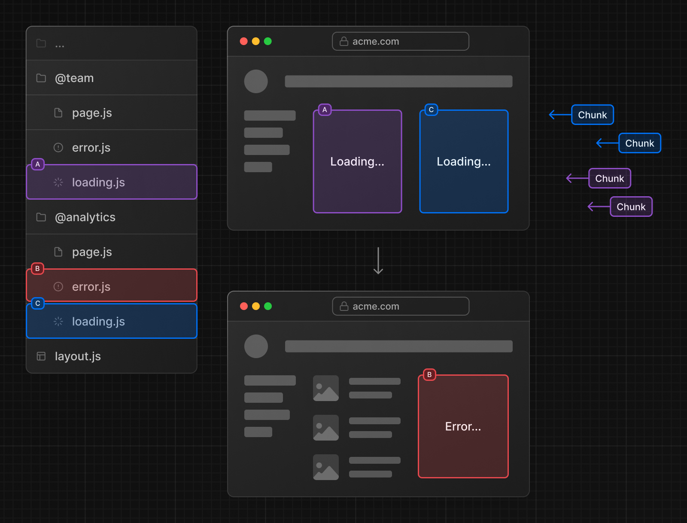

# Routing

## 페이지간 이동 (Link)

Next.js에서는 `a`태그 대신 `Link` 컴포넌트를 사용합니다.\
`a`태그를 사용할 경우 경로 간 새로고침이 발생합니다.

```tsx
import Link from "next/link";

export default function Page() {
  return <Link href="/dashboard">Dashboard</Link>;
}
```

### Link가 원하는 대로 이동하지 않을 때 생각해볼 것

`Link` 는 내부적으로 `onClick` 이벤트를 처리하여 Next.js의 라우터(next/router)를 통해 페이지 전환을 수행합니다.\
따라서 이벤트 버블링의 영향을 받을 수 있습니다.

#### Link를 사용하며 실제 발생한 문제 예시

`Link`의 경로로 가기 위해 이미지 링크를 클릭을 했는데 `/${target.User.id}` 경로로 가지지 않았습니다.\
대신 `/${post.User.id}/status/${post.postId}`로 이동 되었습니다.

```tsx
export default function Post({ noImage }: Props) {
  return (
    <PostArticle post={target}>
      <div className={style.postWrapper}>
        <div className={style.postUserSection}>
          {/* /${target.User.id}로 이동하기 위해 이미지 링크를 클릭했지만 실패 */}
          <Link href={`/${target.User.id}`} className={style.postUserImage}>
            
            <div className={style.postShade} />
          </Link>
        </div>
      </div>
    </PostArticle>
  );
}
```

이유는 이벤트 버블링이 발생해서 `Link`에서 발생한 이벤트가 부모인 `PostArticle`의 `onClick` 이벤트로 전파되었습니다.\
`onClick`은 버블링 단계에서 실행되는 이벤트입니다.\
마지막으로 발생한 이벤트가 `PostArticle`의 `onClick` 이벤트이기 때문에 해당 로직(`router.push`)이 실행되는 경로로 이동됩니다.\
즉 `/${target.User.id}`가 아닌 `/${post.User.id}/status/${post.postId}`로 이동 되었습니다.

```tsx
export default function PostArticle({ children, post }: Props) {
  const router = useRouter();

  const onClick = () => {
    router.push(`/${post.User.id}/status/${post.postId}`);
  };

  return (
    {/* /${target.User.id}로 이동하려고 클릭해도 /${post.User.id}/status/${post.postId}로 이동 됨 */}
    <article onClick={onClick} className={style.post}>
      {children}
    </article>
  );
}
```

#### onClickCapture 를 사용하며 문제 예시 해결

`onClickCapture`는 capture 단계에서 이벤트를 실행할 수 있습니다.
이벤트는 DOM 트리의 상위 요소에서 하위 요소로 전달되며 이걸 capture 단계라고 합니다.(document → PostArticle → Post의 Link)\
이 과정에서 `onClickCapture` 가 등록된 `PostArticle`에서 이벤트를 먼저 처리합니다.\
상위 단계에서 이벤트가 처리되므로, `PostArticle`는 버블링 단계로 이벤트가 전달되지 않게됩니다.\
이후 `Post`의 `Link`가 처리되면서 마지막 발생된 이벤트의 `Link`의 경로인 `/${target.User.id}`로 이동되었습니다.

```tsx
export default function PostArticle({ children, post }: Props) {
  const router = useRouter();

  const onClick = () => {
    router.push(`/${post.User.id}/status/${post.postId}`);
  };

  return (
    {/* onClickCapture를 사용하여 버블링에 이벤트가 실행되지 않고 캡처링때 미리 실행됨 */}
    <article onClickCapture={onClick} className={style.post}>
      {children}
    </article>
  );
}
```

자세한 내용은 [단계별 이벤트 캡처](https://ko.react.dev/learn/responding-to-events#capture-phase-events) 참고.

## 동적 라우트 (`[folderName]`)


NextJS에서 dynamic route (동적 라우트)는 대괄호(`[]`)를 사용한 중첩 폴더를 추가해 만들 수 있습니다.\
NextJS에서 지원되는 특수한 문법으로 대괄호 사이에 임의로 식별자를 넣을 수 있습니다.

```tsx
// app/blog/page.js

import Link from "next/link";

export default function BlogPage() {
  return (
    <main>
      <h1>The Blog</h1>
      <p>
        <Link href="/blog/post-1">Post 1</Link>
      </p>
      <p>
        <Link href="/blog/post-2">Post 2</Link>
      </p>
    </main>
  );
}
```

```tsx
// app/blog/[slug]/page.js

export default function BlogPostPage({ params }: { params: { slug: string } }) {
  // post-1 또는 post-2
  return (
    <main>
      <h1>My Post: {params.slug}</h1>
    </main>
  );
}
```

`<p><Link href="/blog/post-1">Post 1</Link></p>` 링크를 클릭하면 `[slug]`폴더는 `post-1` 이 됩니다.\
`<p><Link href="/blog/post-2">Post 2</Link></p>` 링크를 클릭하면 `[slug]`폴더는 `post-2` 이 됩니다.

|           Route           | Example URL |     params      |
| :-----------------------: | :---------: | :-------------: |
| `app/blog/[slug]/page.js` |  `/blog/a`  | `{ slug: 'a' }` |
| `app/blog/[slug]/page.js` |  `/blog/b`  | `{ slug: 'b' }` |
| `app/blog/[slug]/page.js` |  `/blog/c`  | `{ slug: 'c' }` |

### Catch-all Segments (`[...folderName]`)


Catch-all 세그먼트는 여러 세그먼트(경로의 일부)를 한 번에 처리하는 기능입니다.\
파일 이름에 대괄호(`[]`)와 줄임표(`...`)를 사용하여 해당 경로의 모든 하위 세그먼트를 캡처합니다.

예를 들어, `app/shop/[...slug]/page.js`라는 파일이 있으면 `/shop` 뒤에 오는 경로들이 무엇이든 다 처리할 수 있습니다.

다음과 같은 경로들이 모두 일치합니다.

- `/shop/clothes`

- `/shop/clothes/tops`

- `/shop/clothes/tops/t-shirts`

params는 경로 뒤에 오는 세그먼트들을 배열로 저장합니다. 예시를 보면:

- `/shop/a` → `{ slug: ['a'] }`

- `/shop/a/b` → `{ slug: ['a', 'b'] }`

- `/shop/a/b/c` → `{ slug: ['a', 'b', 'c'] }`

즉, 뒤에 몇 개의 세그먼트가 오든 그 경로를 모두 캡처할 수 있는 기능입니다.

### Optional Catch-all Segments (`[[...folderName]]`)


Optional Catch-all 세그먼트는 catch-all과 거의 같지만, 추가로 경로에 세그먼트가 아예 없는 경우도 처리할 수 있습니다.\
이중 대괄호(`[[...]]`)를 사용하여 만듭니다.

예를 들어, `app/shop/[[...slug]]/page.js`라는 파일이 있으면 다음과 같은 경로들에 모두 일치합니다:

- `/shop` (경로에 세그먼트가 아예 없는 경우)

- `/shop/clothes`

- `/shop/clothes/tops`

- `/shop/clothes/tops/t-shirts`

여기서 /shop 경로에도 일치한다는 점이 catch-all 세그먼트와의 차이입니다.\
매개변수가 없어도 경로가 일치한다는 것이 핵심입니다.\
params는 경로에 세그먼트가 없으면 빈 객체로 반환됩니다.

- `/shop` → `{}`

- `/shop/a` → `{ slug: ['a'] }`

- `/shop/a/b` → `{ slug: ['a', 'b'] }`

- `/shop/a/b/c` → `{ slug: ['a', 'b', 'c'] }`

Catch-all은 경로 뒤에 반드시 세그먼트가 필요하지만, optional catch-all은 세그먼트가 없어도 일치할 수 있는 점이 차이입니다.

### 경로 매개 변수

NextJS는 `props` 객체를 모든 페이지 컴포넌트에 넘기며 `params`를 `prop`에서 구조 분해 할당을 통해 뽑아 낼 수 있습니다.

`params` `prop` 안에는 dynamic route (동적 라우트)에 임의로 넣은 모든 이름이 있는 객체가 있습니다.\

```tsx
// app/blog/[slug]/page.js

export default function BlogPostPage({ params }) {
  // `http://localhost:3000/blog/post-1`으로 접근 했을 때
  console.log(params); // { slug: 'post-1' }

  return (
    <main>
      <h1>Blog Post</h1>
    </main>
  );
}
```

## Parallel Routes(`@folderName`)


하나의 화면 안에 여러 개의 페이지를 병렬로 함께 렌더링 시켜주는 패턴.

Parallel Routes는 Next.js에서 동적인 앱을 구축할 때, 동일한 레이아웃 내에서 여러 페이지를 동시에 또는 조건에 따라 렌더링할 수 있게 해줍니다.\
소셜 미디어 대시보드 같은 곳에서 유용하며, 페이지 내 여러 섹션을 분리하여 동시에 처리할 수 있게 합니다.

예를 들어, 대시보드에 `team`과 `analytics`라는 두 페이지가 있다면, 이 두 페이지를 Parallel Routes를 통해 하나의 레이아웃에서 동시에 렌더링할 수 있습니다.

### Slots


Parallel Routes는 slots라는 개념을 사용합니다. Slots는 `@folder` 규칙을 따라 파일 구조 내에서 정의됩니다.

예를 들어:

```graphql
app/
  ├── @team/team
  │   └── page.js
  ├── @analytics/
  │   └── page.js
  └── layout.js
```

위의 파일 구조에서는 `@team`과 `@analytics`라는 두 개의 slot이 정의됩니다.\
이 slots들은 `layout.js` 파일에서 props로 전달되어 병렬로 렌더링될 수 있습니다.

### 레이아웃에서 Slots 사용 예시

```tsx
// app/layout.js

export default function Layout({
  children,
  team,
  analytics,
}: {
  children: React.ReactNode;
  analytics: React.ReactNode;
  team: React.ReactNode;
}) {
  return (
    <>
      {children} {/*메인 콘텐츠 */}
      {team} {/* 팀 관련 콘텐츠 */}
      {analytics} {/* 분석 관련 콘텐츠*/}
    </>
  );
}
```

이 구조는 대시보드에서 메인 콘텐츠(`children`)와 두 개의 부가 페이지(team과 analytics)를 동시에 렌더링할 수 있게 해줍니다.

### Slots와 URL

Slots는 URL에 영향을 미치지 않습니다.\
예를 들어, `@analytics` slot의 URL은 `/@analytics/views`가 아닌 `/views`가 됩니다.\
Slots는 내부적으로 분리된 레이아웃이지만, 라우트 세그먼트처럼 URL을 생성하지 않는다는 특징이 있습니다.

#### 알아두면 좋은 점

`children` prop은 기본적으로 모든 레이아웃에 포함된 slot으로, 특별히 정의하지 않아도 됩니다.\
Parallel Routes는 복잡한 앱에서 UI를 효율적으로 관리할 수 있게 도와줍니다.

```graphql
app/
  ├── @team/team
  │   └── page.js
  ├── @analytics/
  │   └── page.js
  ├── page.js     /* layout에서 children으로 받아오는 페이지 */
  └── layout.js
```

위의 경로는 사실 아래와 같다고 생각해도 됩니다.

```graphql
app/
  ├── @team/team
  │   └── page.js
  ├── @analytics/
  │   └── page.js
  ├── @children/
  │   └── page.js
  └── layout.js
```

### 하위 추가 URL 경로가 있을 때

```graphql
app/
  ├── @analytics/
  │   └── page.js
  │   └── setting/
  │       └── page.js /* setting일 때 전달되는 컴포넌트 */
  ├── @team/
  │   └── page.js     /* setting일 때 전달되는 컴포넌트 */
  ├── layout.js
  └── page.js         /* setting일 때 전달되는 컴포넌트 */
```

만약 `/setting` 경로가 되면 `layout`에게 전달되는 props는 어떻게 되는 걸까요?\
`@analytics/`의 경우는 `setting/` 폴더 아래의 `page`컴포넌트가 전달됩니다.\
`@team/`의 경우 `setting/` 폴더가 존재하지 않기 때문에 404 처리가 되어야 하지만 Next.js는 이전의 컴포넌트인 `page` 컴포넌트를 전달하도록 되어 있습니다.\
`children`의 경우에도 `app` 밑에 `setting/` 폴더가 없기 때문에 이전 `page` 컴포넌트를 전달하게 됩니다.

#### 하위 추가 URL 경로 주의할 점

항상 각각의 slot이 이전의 페이지를 유지하게 되는 건 아닙니다.\
브라우저 측에서 클라이언트 사이드 렌더링 방식으로 페이지를 이동하는 `Link` 컴포넌트를 이용할 때에만 한정됩니다.

해당 경로에서 브라우저를 새로고침하게 되면 `404 page`로 리다이렉션됩니다.\
브라우저에서 처음 접속하게 되는 경우에는 `layout` 컴포넌트에서 이전의 페이지를 모르기 때문에 이전의 페이지를 렌더링 할 수 없기 때문입니다.

이러한 사항을 방지해 주기 위해서는 slot에 `404 page` 대신 렌더링할 `default` page를 만들어 주어야 합니다.\
`children`도 해당되는 내용이기 때문에 상위 폴더에도 추가해야 합니다.

```graphql
app/
  ├── @analytics/
  │   └── page.js
  │   └── setting/
  │       └── page.js /* /setting 경로에서 새로고침할 때 전달되는 컴포넌트 */
  ├── @team/
  │   └── page.js
  │   └── default.js  /* /setting 경로에서 새로고침할 때 전달되는 컴포넌트 */
  ├── default.js      /* /setting 경로에서 새로고침할 때 전달되는 컴포넌트 */
  ├── layout.js
  └── page.js
```

### Active state and navigation

Parallel Routes에서의 Active State와 Navigation은 사용자가 여러 페이지를 탐색할 때 각 slot에 어떤 콘텐츠가 표시될지를 결정하는 중요한 요소입니다.

#### Soft Navigation vs Hard Navigation

- Soft Navigation: 클라이언트 측 탐색에서 페이지 일부만 업데이트되며, 다른 slot의 활성 상태는 유지됩니다.\
  예를 들어, 대시보드의 한 부분만 변경하고 나머지는 그대로 남겨둡니다.

- Hard Navigation: 전체 페이지를 새로고침할 때, Next.js는 현재 URL과 일치하지 않는 slot의 활성 상태를 기억하지 않습니다.\
  이 경우, `default.js` 파일을 사용하여 기본 상태를 렌더링하거나 해당하는 파일이 없으면 `404` 에러 페이지가 표시됩니다.

#### default.js


`default.js`는 일치하지 않는 slot에 기본으로 표시될 내용을 정의하는 파일입니다.\
예를 들어, /settings 페이지에서 `@team`은 관련된 콘텐츠를 보여주지만, `@analytics`에 해당하는 내용이 없으면 `default.js`에서 기본 페이지를 렌더링할 수 있습니다.

#### useSelectedLayoutSegment(s) Hook

이 Hook을 사용하면 특정 slot 내에서 현재 활성화된 페이지 세그먼트를 읽어올 수 있습니다.\
예를 들어, 사용자가 `/login` 페이지에 있을 때, `useSelectedLayoutSegment('auth')`는 `"login"`을 반환합니다.\
이를 통해 현재 어떤 하위 페이지가 활성 상태인지 알 수 있습니다.

```tsx
"use client";

import { useSelectedLayoutSegment } from "next/navigation";

export default function Layout({ auth }: { auth: React.ReactNode }) {
  const loginSegment = useSelectedLayoutSegment("auth");
  // ...
}
```

#### 정리

Parallel Routes는 대시보드나 복잡한 UI에서 여러 페이지를 동시 또는 조건에 따라 렌더링할 수 있게 도와줍니다.\
Soft Navigation과 Hard Navigation의 차이점과 함께 `default.js`와 `useSelectedLayoutSegment`는 페이지 상태를 관리하는 데 유용한 도구입니다.

### Conditional Routes

Parallel Routes를 사용하여 사용자 역할과 같은 특정 조건에 따라 라우트를 조건부로 렌더링할 수 있습니다.\
예를 들어, `/admin` 또는 `/user` 역할에 대해 다른 대시보드 페이지를 렌더링하려면:


```tsx
app / dashboard / layout.tsx;
import { checkUserRole } from "@/lib/auth";

export default function Layout({
  user,
  admin,
}: {
  user: React.ReactNode;
  admin: React.ReactNode;
}) {
  const role = checkUserRole();
  return <>{role === "admin" ? admin : user}</>;
}
```

### Tab Groups

사용자가 slot을 독립적으로 탐색할 수 있도록 slots 내에 `layout`을 추가할 수 있습니다.\
이는 탭을 만드는 데 유용합니다.

예를 들어, `@analytics` slot에는 두 개의 하위 페이지 `/page-views`와 `/visitors`가 있습니다.


`@analytics` 내에 `layout` 파일을 생성하여 두 페이지 간에 탭을 공유하게 합니다:

```tsx
// filename="app/@analytics/layout.tsx" switcher
import Link from "next/link";

export default function Layout({ children }: { children: React.ReactNode }) {
  return (
    <>
      <nav>
        <Link href="/page-views">Page Views</Link>
        <Link href="/visitors">Visitors</Link>
      </nav>
      <div>{children}</div>
    </>
  );
}
```

### Loading and Error UI

Parallel Routes는 독립적으로 스트리밍될 수 있으므로 각 라우트에 대해 독립적인 오류 및 로딩 상태를 정의할 수 있습니다:



## Intercepting Routes(`(.)folderName`)

초기 접속 요청이 아닌 클라이언트 사이드 방식 렌더링, 즉 `Link`나 `Router`의 `push`처럼 클라이언트 측에서 경로를 변경할 때 사용하는 라우팅 패턴입니다.\
이 패턴은 사용자가 동일한 경로에 접속하더라도 요청을 가로채서 원래 렌더링될 페이지 대신 원하는 페이지를 렌더링하도록 설정할 수 있습니다.


### Intercepting Routes의 실제 사용 예시


인스타그램에서 게시물을 클릭하면 피드 페이지 위로 모달 형태의 상세 페이지가 보입니다.


상세 페이지에서 새로 고침을 하면 원래의 상세 페이지로 돌아오게 됩니다.


모달 형태의 상세 페이지와 원래의 상세 페이지의 URL 경로가 같지만, 렌더링된 화면은 다릅니다.

웹사이트에서 새로운 페이지로 완전히 이동하지 않고, 현재 페이지 위에 다른 페이지의 내용을 겹쳐서 보여줄 수 있는 기능입니다.\
예를 들어, 사진 목록에서 사진을 클릭했을 때, 새 창이 아닌, 현재 페이지 위에 사진을 모달(팝업 창)로 띄워서 보여주는 것입니다.\
이때 URL은 바뀌지만, 페이지는 그대로 유지됩니다.

### Soft Navigation과 Hard Navigation

- Soft Navigation: 페이지 전체가 새로 로드되지 않고, 모달처럼 부드럽게 새로운 내용을 덧붙여 보여줍니다. URL이 바뀌긴 하지만 페이지 전환 없이 자연스럽게 동작합니다.

- Hard Navigation: URL을 직접 입력하거나 페이지를 새로 고침할 때 발생합니다. 이 경우, 모달이 아닌, 해당 페이지로 완전히 이동하게 됩니다.

### 경로 규칙

Intercepting Routes에서는 `( .. )` 같은 규칙을 사용해 경로를 지정합니다. 이 규칙은 부모 디렉토리로 가는 것과 비슷합니다.\
어떤 경로의 폴더를 intercepting 하는지에 따라 달라집니다.

- `(.)`: 현재 위치와 같은 경로입니다. (동일 경로)

- `( .. )`: 한 단계 위의 경로입니다.

- `( .. )( .. )`: 두 단계 위의 경로입니다.

- `(...)`: 애플리케이션의 최상단, 즉 처음 시작하는 경로를 뜻합니다.

예를 들어, 사진 목록에서 특정 사진을 모달로 띄우고 싶다면, `(..)photo`라는 경로를 사용해서 사진을 모달로 가로챌 수 있습니다.


### 모달 예시

이 기능을 사용하면 페이지 이동 없이 모달을 만들 수 있습니다.\

예를 들어 사용자가 사진을 클릭하면 모달이 열리고, URL은 사진 페이지로 바뀝니다.\
사용자가 페이지를 새로고침해도 모달이 계속 열려 있거나, 이전 페이지로 돌아갔을 때 모달이 닫히는 기능을 쉽게 만들 수 있습니다.\
즉, Intercepting Routes는 사용자가 페이지를 완전히 벗어나지 않고도 새로운 내용을 볼 수 있도록 해주는 기능으로, 특히 모달 창을 띄울 때 유용합니다.

```graphql
src/
  ├── app/
  │   ├── @modal/
  │   │   └── default.tsx
  │   │   └── (.)book/
  │   │       └── [id]/
  │   │           └── page.tsx
  │   ├── book/
  │   │   └── [id]/
  │   │       └──page.tsx
  │   └── layout.tsx
  └── components/
      └──modal.tsx
```

아래의 코드 예시는 `book/[id]/page.js`로 가는 경로를 `(.)book/[id]/page.js` 로 인터셉트합니다.\
`(.)book/[id]/page.js`는 병렬 라우팅을 사용하여 `@madal` slot의 부모 layout인, root의 `layout.js`에 `modal` props 로 전달합니다.\

```tsx
// src/app/@modal/(.)book/[id]/page.tsx
import BookPage from "@/app/book/[id]/page";

import Modal from "@/components/modal";

export default function Page(props: any) {
  return (
    <Modal>
      <BookPage {...props} />
    </Modal>
  );
}
```

`createPortal`로 `src/app/layout.tsx`에 있는 `modal-root` 라는 id를 가진 요소에서 `dialog`를 두어 사용합니다.

```tsx
// src/components/modal.tsx

"use client";

import { ReactNode, useEffect, useRef } from "react";
import { createPortal } from "react-dom";

import { useRouter } from "next/navigation";

import style from "./modal.module.css";

export default function Modal({ children }: { children: ReactNode }) {
  const dialogRef = useRef<HTMLDialogElement>(null);
  const router = useRouter();

  // 모달이 꺼져 있다면 dialog 열기
  useEffect(() => {
    if (!dialogRef.current?.open) {
      dialogRef.current?.showModal();
      dialogRef.current?.scrollTo({
        top: 0,
      });
    }
  }, []);

  return createPortal(
    <dialog
      className={style.modal}
      ref={dialogRef}
      // 백드롭이나 esc 누를 시 뒤로가기
      onClick={(e) => {
        if ((e.target as any).nodeName === "DIALOG") {
          router.back();
        }
      }}
      onClose={() => router.back()}
    >
      {children}
    </dialog>,
    document.getElementById("modal-root") as HTMLElement
  );
}
```

`@modal/(.)book/[id]/page.js`에서 `modal` props를 받아옵니다.

```tsx
// src/app/layout.tsx

import "./globals.css";
import style from "./layout.module.css";

export default function RootLayout({
  children,
  modal,
}: Readonly<{
  children: React.ReactNode;
  modal: React.ReactNode;
}>) {
  return (
    <html lang="en">
      <body>
        <div className={style.container}>
          <main>{children}</main>
        </div>
        {modal}
        <div id="modal-root"></div>
      </body>
    </html>
  );
}
```

`@modal`에서 `"/"` 경로일 때 보여줄 `modal` props가 없기 때문에 `default`로 `null`을 전달해 줍니다.

```tsx
// src/app/@modal/default.tsx

export default function Default() {
  return null;
}
```

## Route Groups(`(folderName)`)

Route Groups는 Next.js 애플리케이션에서 URL 경로에 영향을 주지 않고 폴더를 그룹화하여 논리적으로 파일을 구성하는 기능입니다.\
폴더 이름을 괄호로 묶어 `(folder)`와 같은 형태로 사용합니다.\
이렇게 하면 URL 경로에 해당 폴더가 포함되지 않습니다.

### 주요 활용 방법

#### URL 경로에 영향을 주지 않고 경로를 그룹화

경로 세그먼트를 논리적으로 그룹화하면서 URL 구조에는 변화가 없습니다.


- app 폴더 안에 있는 폴더들은 일반적으로 그 이름이 URL 경로로 표시됩니다.\
  만약 `app/shop` 폴더가 있다면, 해당 파일은 `/shop` 경로에서 볼 수 있습니다.

- 그러나 폴더 이름을 괄호 안에 넣어 `(shop)`과 같이 작성하면, 이 폴더는 URL에 나타나지 않습니다.\
  이를 통해 URL 경로에 영향을 주지 않으면서 파일을 그룹화할 수 있습니다.


- 예시: `(marketing)` 및 `(shop)` 내부의 경로는 동일한 URL 계층 구조를 공유하지만, 각 그룹 내에 `layout.js` 파일을 추가하여 각 그룹에 대해 다른 레이아웃을 생성할 수 있습니다.

#### 중첩 레이아웃 활성화

- 동일한 URL 경로에서 여러 레이아웃을 적용해야 할 때, Route Groups을 사용하여 각 그룹별로 `layout.js` 파일을 추가할 수 있습니다.


- 예시: `(shop)` 폴더에 `layout.js` 파일을 추가하여 `account`와 `cart` 경로에 동일한 레이아웃을 적용할 수 있으며, 다른 경로 `(checkout)`에는 레이아웃을 적용하지 않을 수 있습니다.

#### 여러 루트 레이아웃 생성

- 루트 레이아웃은 페이지 전체에 적용되는 최상위 레이아웃입니다.\
  `layout.js` 파일을 Route Groups에 각각 추가하여 애플리케이션의 각 섹션을 독립적인 UI로 분리할 수 있습니다.

- 예시: 최상위 `layout.js` 파일을 제거하고 `(marketing)` 및 `(shop)` 각각의 폴더 안에 `layout.js` 파일을 추가하면, 해당 그룹별로 완전히 다른 UI가 적용됩니다.\
  이렇게 하면 애플리케이션의 특정 섹션들에 각기 다른 UI를 사용할 수 있습니다.


루트 전용 레이아웃 설정도 가능합니다.\
루트 페이지에는 헤더를 사용하고 싶지 않은 경우 예시:


```tsx
// app.(content).layout.js

import MainHeader from "@/components/main-header";
import "../globals.css";

export const metadata = {
  title: "Next.js Page Routing & Rendering",
  description: "Learn how to route to different pages.",
};

export default function RootLayout({ children }) {
  return (
    <html lang="en">
      <body>
        <div id="page">
          <MainHeader />
          {children}
        </div>
      </body>
    </html>
  );
}
```

```tsx
// app.(marketing).layout.js

import "../globals.css";

export const metadata = {
  title: "Next.js Page Routing & Rendering",
  description: "Learn how to route to different pages.",
};

export default function RootLayout({ children }) {
  return (
    <html lang="en">
      <body>{children}</body>
    </html>
  );
}
```

### 유의사항

- Route Group은 URL 경로에 영향을 주지 않으며, 이름은 파일 구성용으로만 사용됩니다.

- 동일한 URL로 연결될 수 있는 경로 그룹은 오류를 일으킬 수 있습니다 (예: `(marketing)/about`과 `(shop)/about`은 둘 다 `/about`으로 연결).

- 여러 루트 레이아웃을 사용할 경우, 내비게이션 시 전체 페이지가 로드됩니다.

## Route Handlers(`api/route.ts`)


Route Handlers를 사용하면 웹 `Request`와 `Response` API를 사용하여 특정 라우트에 대한 사용자 정의 요청 핸들러를 만들 수 있습니다.

Route Handlers는 `app` 디렉토리 내에서만 사용할 수 있습니다.\
`pages` 디렉토리 내의 API Routes와 동일한 기능을 하므로, API Routes와 Route Handlers를 함께 사용할 필요가 없습니다.

```tsx
// app/api/test/route.js

export function GET(request) {
  return new Response("Hello!");
}
```

```tsx
export default async function DashboardPage() {
  const response = await fetch("http://localhost:3000/api/test");
  const data = await response.json();

  console.log(data); // Hello!
}
```

### Convention

Route Handlers는 `app` 디렉토리 내의 `route.ts` 파일로 정의됩니다.

```ts
// app/api/route.ts
export async function GET(request: Request) {}
```

Route Handlers는 `page.js` 및 `layout.js`와 유사하게 `app` 디렉토리 내 어디에나 중첩될 수 있습니다.\
하지만 `page.js`와 동일한 라우트 경로(세그먼트) 레벨에 `route.js` 파일이 있을 수 없습니다.

### Supported HTTP Methods

`GET`, `POST`, `PUT`, `PATCH`, `DELETE`, `HEAD`, `OPTIONS` HTTP 메서드를 지원합니다.\
지원되지 않는 메서드가 호출되면 `405 Method Not Allowed` 응답을 반환합니다.

### Extended `NextRequest` and `NextResponse` APIs

Next.js는 기본 `Request` 및 `Response` API를 지원하는 것 외에도, `NextRequest`와 `NextResponse`를 확장하여 고급 사용 사례를 위한 편리한 헬퍼를 제공합니다.

### Caching

Route Handlers는 기본적으로 캐시되지 않습니다.\
그러나 `GET` 메서드에 대해 캐시를 선택할 수 있습니다.\
Route Handler 파일에 `export const dynamic = 'force-static'`과 같은 route config option을 사용합니다.

```ts filename="app/items/route.ts" switcher
export const dynamic = "force-static";

export async function GET() {
  const res = await fetch("https://data.mongodb-api.com/...", {
    headers: {
      "Content-Type": "application/json",
      "API-Key": process.env.DATA_API_KEY,
    },
  });
  const data = await res.json();

  return Response.json({ data });
}
```

### Special Route Handlers

`sitemap.ts`, `opengraph-image.tsx`, `icon.tsx` 및 기타 메타데이터 파일과 같은 특별한 Route Handlers는 동적 함수나 동적 구성 옵션을 사용하지 않는 한 기본적으로 정적입니다.

### Route Resolution

`route`는 가장 낮은 레벨의 라우팅 원시 형태로 간주할 수 있습니다.

- `page`와 같은 레이아웃이나 클라이언트 측 탐색에 참여하지 않습니다.
- `page.js`와 동일한 라우트에 `route.js` 파일이 있을 수 없습니다.

|         Page         |       Route        | Result |
| :------------------: | :----------------: | :----: |
|    `app/page.js`     |   `app/route.js`   |   X    |
|    `app/page.js`     | `app/api/route.js` |   O    |
| `app/[user]/page.js` | `app/api/route.js` |   O    |

각 `route.js` 또는 `page.js` 파일은 해당 라우트에 대한 모든 HTTP 메서드를 처리합니다.

```jsx filename="app/page.js"
export default function Page() {
  return <h1>Hello, Next.js!</h1>;
}

// ❌ Conflict
// `app/route.js`
export async function POST(request) {}
```

다음 예제는 Route Handlers를 다른 Next.js API 및 기능과 결합하는 방법을 보여줍니다.

### Revalidating Cached Data

`next.revalidate` 옵션을 사용하여 캐시된 데이터를 재검증할 수 있습니다.

```ts filename="app/items/route.ts" switcher
export async function GET() {
  const res = await fetch("https://data.mongodb-api.com/...", {
    next: { revalidate: 60 }, // 60초마다 재검증
  });
  const data = await res.json();

  return Response.json(data);
}
```

또는 `revalidate` 세그먼트 구성 옵션을 사용할 수 있습니다:

```ts
export const revalidate = 60;
```

### Dynamic Functions

Route Handlers는 Next.js의 `cookies` 및 `headers`와 같은 동적 함수와 함께 사용할 수 있습니다.

#### Cookies

`next/headers`에서 `cookies`를 사용하여 쿠키를 읽거나 설정할 수 있습니다.\
이 서버 함수는 Route Handler에서 직접 호출되거나 다른 함수 내에서 중첩될 수 있습니다.

또는 `Set-Cookie`헤더를 사용하여 새 `Response`를 반환할 수 있습니다.

```ts filename="app/api/route.ts" switcher
import { cookies } from "next/headers";

export async function GET(request: Request) {
  const cookieStore = cookies();
  const token = cookieStore.get("token");

  return new Response("Hello, Next.js!", {
    status: 200,
    headers: { "Set-Cookie": `token=${token.value}` },
  });
}
```

기본 웹 API를 사용하여 요청에서 쿠키를 읽을 수도 있습니다 (`NextRequest`)

```ts filename="app/api/route.ts" switcher
import { type NextRequest } from "next/server";

export async function GET(request: NextRequest) {
  const token = request.cookies.get("token");
}
```

#### Headers

`next/headers`에서 `headers`를 사용하여 헤더를 읽을 수 있습니다.\
이 서버 함수는 Route Handler에서 직접 호출되거나 다른 함수 내에서 중첩될 수 있습니다.

이 `headers` 인스턴스는 읽기 전용입니다.\
헤더를 설정하려면 새 `headers`와 함께 새 `Response`를 반환해야 합니다.

```ts filename="app/api/route.ts" switcher
import { headers } from "next/headers";

export async function GET(request: Request) {
  const headersList = headers();
  const referer = headersList.get("referer");

  return new Response("Hello, Next.js!", {
    status: 200,
    headers: { referer: referer },
  });
}
```

기본 웹 API를 사용하여 요청에서 헤더를 읽을 수도 있습니다 (`NextRequest`)

```ts filename="app/api/route.ts" switcher
import { type NextRequest } from "next/server";

export async function GET(request: NextRequest) {
  const requestHeaders = new Headers(request.headers);
}
```

### Redirects

```ts filename="app/api/route.ts" switcher
import { redirect } from "next/navigation";

export async function GET(request: Request) {
  redirect("https://nextjs.org/");
}
```

### Dynamic Route Segments

Route Handlers는 Dynamic Segments를 사용하여 동적 데이터를 기반으로 요청 핸들러를 생성할 수 있습니다.

```ts filename="app/items/[slug]/route.ts" switcher
export async function GET(
  request: Request,
  { params }: { params: { slug: string } }
) {
  const slug = params.slug; // 'a', 'b', 또는 'c'
}
```

| Route                       | Example URL | `params`        |
| --------------------------- | ----------- | --------------- |
| `app/items/[slug]/route.js` | `/items/a`  | `{ slug: 'a' }` |
| `app/items/[slug]/route.js` | `/items/b`  | `{ slug: 'b' }` |
| `app/items/[slug]/route.js` | `/items/c`  | `{ slug: 'c' }` |

### URL Query Parameters

Route Handler에 전달되는 요청 객체는 `NextRequest` 인스턴스로, 쿼리 매개변수를 보다 쉽게 처리할 수 있는 편리한 추가 메서드를 제공합니다.

```ts filename="app/api/search/route.ts" switcher
import { type NextRequest } from "next/server";

export function GET(request: NextRequest) {
  const searchParams = request.nextUrl.searchParams;
  const query = searchParams.get("query");
  // query는 /api/search?query=hello일 때 "hello"입니다.
}
```

### Streaming

스트리밍은 OpenAI와 같은 대형 언어 모델(LLM)과 함께 AI 생성 콘텐츠를 위해 일반적으로 사용됩니다.\
AI SDK에서 자세히 알아보세요.

```ts filename="app/api/chat/route.ts" switcher
import { openai } from "@ai-sdk/openai";
import { StreamingTextResponse, streamText } from "ai";

export async function POST(req) {
  const { messages } = await req.json();
  const result = await streamText({
    model: openai("gpt-4-turbo"),
    messages,
  });

  return new StreamingTextResponse(result.toAIStream());
}
```

이러한 추상화는 스트림을 생성하기 위해 웹 API를 사용합니다.\
기본 웹 API를 직접 사용할 수도 있습니다.

```ts filename="app/api/route.ts" switcher
// https://developer.mozilla.org/docs/Web/API/ReadableStream#convert_async_iterator_to_stream
function iteratorToStream(iterator: any) {
  return new ReadableStream({
    async pull(controller) {
      const { value, done } = await iterator.next();

      if (done) {
        controller.close();
      } else {
        controller.enqueue(value);
      }
    },
  });
}

function sleep(time: number) {
  return new Promise((resolve) => {
    setTimeout(resolve, time);
  });
}

const encoder = new TextEncoder();

async function* makeIterator() {
  yield encoder.encode("<p>One</p>");
  await sleep(200);
  yield encoder.encode("<p>Two</p>");
  await sleep(200);
  yield encoder.encode("<p>Three</p>");
}

export async function GET() {
  const iterator = makeIterator();
  const stream = iteratorToStream(iterator);

  return new Response(stream);
}
```

### Request Body

기본 웹 API 메서드를 사용하여 `Request` 본문을 읽을 수 있습니다:

```ts filename="app/items/route.ts" switcher
export async function POST(request: Request) {
  const res = await request.json();
  return Response.json({ res });
}
```

### Request Body FormData

`request.formData()` 함수를 사용하여 `FormData`를 읽을 수 있습니다:

```ts filename="app/items/route.ts" switcher
export async function POST(request: Request) {
  const formData = await request.formData();
  const name = formData.get("name");
  const email = formData.get("email");
  return Response.json({ name, email });
}
```

`formData` 데이터는 모두 문자열이므로 `zod-form-data`를 사용하여 요청을 검증하고 원하는 형식(예: `number`)으로 데이터를 가져올 수 있습니다.

### CORS

기본 웹 API 메서드를 사용하여 특정 Route Handler에 대한 CORS 헤더를 설정할 수 있습니다:

```ts filename="app/api/route.ts" switcher
export async function GET(request: Request) {
  return new Response("Hello, Next.js!", {
    status: 200,
    headers: {
      "Access-Control-Allow-Origin": "*",
      "Access-Control-Allow-Methods": "GET, POST, PUT, DELETE, OPTIONS",
      "Access-Control-Allow-Headers": "Content-Type, Authorization",
    },
  });
}
```

### Webhooks

Route Handler를 사용하여 타사 서비스의 웹훅을 수신할 수 있습니다:

```ts filename="app/api/route.ts" switcher
export async function POST(request: Request) {
  try {
    const text = await request.text();
    // 웹훅 페이로드 처리
  } catch (error) {
    return new Response(`Webhook error: ${error.message}`, {
      status: 400,
    });
  }

  return new Response("Success!", {
    status: 200,
  });
}
```

특히, Pages Router의 API Routes와 달리 `bodyParser`를 사용하여 추가 구성을 할 필요가 없습니다.

### Non-UI Responses

Route Handlers를 사용하여 UI가 아닌 콘텐츠를 반환할 수 있습니다.\
`sitemap.xml`, `robots.txt`, `app icons`, `open graph images` 등은 모두 기본적으로 지원됩니다.

```ts filename="app/rss.xml/route.ts" switcher
export async function GET() {
  return new Response(
    `<?xml version="1.0" encoding="UTF-8" ?>
<rss version="2.0">

<channel>
  <title>Next.js Documentation</title>
  <link>https://nextjs.org/docs</link>
  <description>The React Framework for the Web</description>
</channel>

</rss>`,
    {
      headers: {
        "Content-Type": "text/xml",
      },
    }
  );
}
```

### Segment Config Options

Route Handlers는 페이지 및 레이아웃과 동일한 route segment configuration을 사용합니다.

```ts filename="app/items/route.ts" switcher
export const dynamic = "auto";
export const dynamicParams = true;
export const revalidate = false;
export const fetchCache = "auto";
export const runtime = "nodejs";
export const preferredRegion = "auto";
```

## 참고

- [한 입 크기로 잘라먹는 Next.js(15+)](https://www.udemy.com/course/onebite-next/?srsltid=AfmBOorVVEPJU4_dI-KQEwEmGyG9RPB7H94pAGu-nnZpXFxO48bQKkN7)
