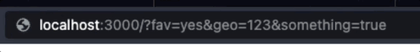
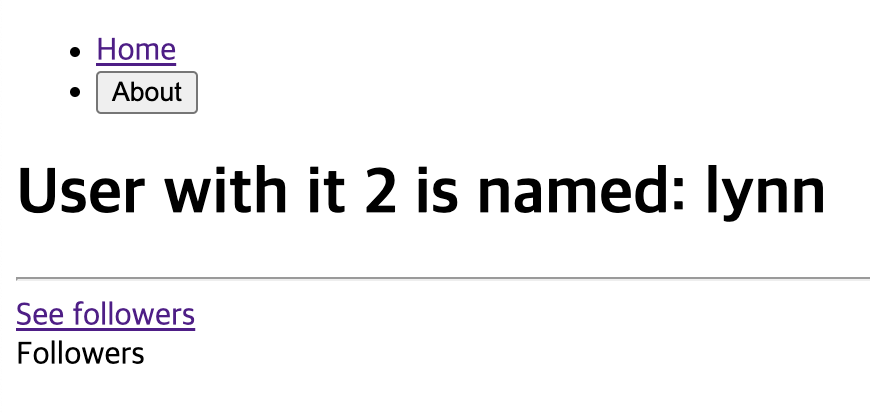

# 리엑트 라우터 v6.4

## 설치 방법

```bash
npm install react-router-dom
```

공식 문서: [React Router](https://reactrouter.com/en/main/start/tutorial)

## 라우트 정의

### BrowserRouter

v6 이전 버전에서 사용되었던 기존 컴포넌트입니다. 이를 통해 라우팅을 설정하고 앱을 브라우저의 URL과 동기화할 수 있습니다.

```jsx
// Router.tsx

import { BrowserRouter, Route, Routes } from "react-router-dom";
import Header from "./components/Header";
import Home from "./screens/Home";
import About from "./screens/About";

function Router() {
  return (
    <BrowserRouter>
      <Header />
      <Routes>
        <Route path="/" element={<Home />} />
        <Route path="/about" element={<About />} />
      </Routes>
    </BrowserRouter>
  );
}

export default Router;
```

### createBrowserRouter

```jsx
// App.js

import { createBrowserRouter, RouterProvider } from "react-router-dom";

const router = createBrowserRouter([{ path: "/", element: <Home /> }]);

function App() {
  // "/" 주소는 <Home />으로 이동
  return <RouterProvider router={router} />;
}
```

react-router-dom에서 제공하는 `createBrowserRouter` 함수를 import합니다.
react-router-dom은 DOM History API를 사용하여 URL을 업데이트하고 기록 스택을 관리합니다.
라우트 정의 객체로 된 배열을 매개변수로 받습니다.

### 라우트 정의 객체로 된 배열

#### path

활성화 되어야 하는 경로를 추가합니다.

#### element

라우트가 활성화되면 로딩되는 컴포넌트 정보를 추가합니다.

### RouterProvider

모든 데이터 라우터 객체들을 렌더링하고 데이터 API를 활성화합니다.

## 페이지들간 이동

`<a>` 태그와 다르게 새로운 HTTP 요청없이 링크를 사용할 수 있습니다.

### Link

```jsx
// MainNavigation.js

import { Link } from "react-router-dom";

function MainNavigation() {
  return (
    <header>
      <nav>
        <ul>
          <li>
            // Home 클릭시 "/" 주소로 이동
            <Link to="/">Home</Link>
          </li>
          <li>
            // Products 클릭시 "/products" 주소로 이동
            <Link to="/products">Products</Link>
          </li>
        </ul>
      </nav>
    </header>
  );
}

export default MainNavigation;
```

### NavLink

NavLink는 Link와 똑같이 사용하지만 콜백 함수를 받는 className 프로퍼티를 사용할 수 있습니다.
콜백 함수는 `isActive`와 `isPending`이라는 boolean을 반환하는 프로퍼티 객체를 받습니다.

- `isActive`는 url에 해당하는 링크가 활성 상태이면 true입니다.
- `isPending`는 데이터를 로딩할 때 true입니다.

### end

'/' 경로의 NavLink의 경우 모든 NavLink가 '/'로 시작합니다.
( `/products` 도 '/'로 시작하기 때문에 활성)
'/' 경로의 NavLink에 end 프로퍼티를 사용하여 '/'로 끝날 때만 NavLink가 활성화 되도록 합니다.

```jsx
// MainNavigation.js

import { NavLink } from "react-router-dom";

import classes from "./MainNavigation.module.css";

function MainNavigation() {
  return (
    <header className={classes.header}>
      <nav>
        <ul className={classes.list}>
          <li>
            <NavLink
              to="/"
              // NavLink가 활성화 되면 className이 classes.active
              className={({ isActive }) =>
                isActive ? classes.active : undefined
              }
              // end 프로퍼티
              end
            >
              Home
            </NavLink>
          </li>
          <li>
            <NavLink
              to="/products"
              className={({ isActive }) =>
                isActive ? classes.active : undefined
              }
            >
              Products
            </NavLink>
          </li>
        </ul>
      </nav>
    </header>
  );
}

export default MainNavigation;
```

### useNavigate

클릭뿐 아니라 폼이 제출되었거나 타이머가 만료되었을 때 등 여러 상황에서 네비게이션 동작을 일으킬 수 있습니다.

```jsx
// Home.js

import { Link, useNavigate } from "react-router-dom";

function Home() {
  const navigate = useNavigate();

  function navegateHandler() {
    // useNavigate사용
    navigate("/products");
  }

  return (
    <>
      <h1>My Home Page</h1>
      <p>
        // 텍스트를 클릭하면 "/products"으로 이동 Go to{" "}
        <Link to="/products">the list of products</Link>
      </p>
      <p>
        // 버튼을 클릭하면 "/products" 으로 이동
        <button onClick={navegateHandler}>Navigate</button>
      </p>
    </>
  );
}

export default Home;
```

### 동적 라우팅(Path Variable)과 쿼리(Query Parameter, Query String)

페이지 주소를 정의 할 때 유동적인 값을 전달해야 할 때 파라미터와 쿼리를 사용합니다.

```tsx
동적 라우팅:  /users/123      # Fetch a user who has id 123
쿼리:       /users?id=123   # Fetch a user who has id of 123
```

- 파라미터(`URL Params`)는 특정 id 나 이름을 가지고 데이터를 식별 할 때 사용합니다.

- 쿼리(`Query`)의 경우엔 어떤 키워드를 검색하거나, 정렬이나 필터링 요청을 할 때 필요한 옵션을 전달 할 때 사용됩니다.

```plaintxt
/users  # 사용자 목록을 가져온다.
/users/123  # 아이디가 123인 사용자를 가져온다.
/users?occupation=programer  # 프로그래머인 사용자 목록을 가져온다.
```

### useParams (URL Params)

`useParams` 파라미터를 사용하여 동적 라우트(Path Variable)를 할 수 있습니다.
예를 들어, `/users/:id`와 같은 라우트에서 `:id` 부분은 동적으로 변하는 매개변수를 나타냅니다.
이러한 매개변수에 접근하려면 `useParams`를 사용할 수 있습니다.

```jsx
// App.js

import { createBrowserRouter, RouterProvider } from "react-router-dom";

import HomePage from "./pages/Home";
import ProductPage from "./pages/Product";
import RootLayout from "./pages/Root";
import ErrorPage from "./pages/Error";
import ProductDetailPage from "./pages/ProductDetail";

const router = createBrowserRouter([
  {
    path: "/",
    element: <RootLayout />,
    errorElement: <ErrorPage />,
    children: [
      { path: "/", element: <HomePage /> },
      { path: "/products", element: <ProductPage /> },
      { path: "/products/:productId", element: <ProductDetailPage /> },
      // url 경로에 ':(콜론)'을 사용하여 이후 올 주소를 매개변수로 사용할 수 있습니다.
      // {productId: 작성 매개변수}
    ],
  },
]);

function App() {
  return <RouterProvider router={router} />;
}

export default App;
```

```jsx
// ProductDetail.js

import { useParams } from "react-router-dom";

function ProductDetailPage() {
  const params = useParams();
  // {productId: 작성 매개변수}

  return (
    <>
      <h1>Product Details!</h1>
      // 작성 매개변수가 화면에 출력
      <p>{params.productId}</p>
    </>
  );
}

export default ProductDetailPage;
```

### useSearchParams (Query)

URL 쿼리 매개변수(Query Parameter, Query String)를 조작하기 위해 사용됩니다.
URL의 `?key=value` 형태의 쿼리 문자열을 다룰 때 유용합니다.

`useSearchParams`는 `URLSearchParams`를 반환합니다.
`URLSearchParams`는 Instance methods를 사용할 수 있습니다.

```jsx
let [searchParams, setSearchParams] = useSearchParams();
```

- `searchParams.get('key')` - `key`의 `value`를 반환, 해당 `key` 의 `value` 가 두 개 이상이라면 제일 먼저 나온 value 만 반환

- `searchParams.getAll('key')` - `key` 에 해당하는 모든 `value` 를 반환

- `searchParams.toString()` - 쿼리 스트링을 string 형태로 반환

#### Instance methods 예시

url이 `localhost:3000/?fav=yes&geo=123&something=true`일 때

```jsx
// Home.tsx

import React from "react";
import { users } from "./db";
import { Link, useSearchParams } from "react-router-dom";

function Home() {
  const [readSearchParams, setSearchParams] = useSearchParams();
  console.log(readSearchParams.has("geo"));
  // true
  console.log(readSearchParams.get("geo"));
  // 123

  return (
    <div>
      <h1>Users</h1>
      {users.map((user) => (
        <li key={user.id}>
          <Link to={`/users/${user.id}`}>{user.name}</Link>
        </li>
      ))}
    </div>
  );
}

export default Home;
```

#### setSearchParams 예시

`setSearchParams`을 사용하여 url이 `localhost:3000/?fav=yes&geo=123&something=true`일 때
`localhost:3000/?day=today&tomorrow=123`으로 변경합니다.

```jsx
// Home.tsx

import React from "react";
import { users } from "./db";
import { Link, useSearchParams } from "react-router-dom";

function Home() {
  const [readSearchParams, setSearchParams] = useSearchParams();
  setTimeout(() => {
    setSearchParams({
      day: "today",
      tomorrow: "123",
    });
  });

  return (
    <div>
      <h1>Users</h1>
      {users.map((user) => (
        <li key={user.id}>
          <Link to={`/users/${user.id}`}>{user.name}</Link>
        </li>
      ))}
    </div>
  );
}

export default Home;
```



## 중첩된 라우트

네비게이션 컴포넌트를 여러 페이지 컴포넌트에 포함시키고 싶습니다.

```jsx
// MainNavigation.js

import { Link } from "react-router-dom";

function MainNavigation() {
  return (
    <header>
      <nav>
        <ul>
          <li>
            // Home 클릭시 "/" 주소로 이동
            <Link to="/">Home</Link>
          </li>
          <li>
            // Products 클릭시 "/products" 주소로 이동
            <Link to="/products">Products</Link>
          </li>
        </ul>
      </nav>
    </header>
  );
}

export default MainNavigation;
```

네비게이션을 포함하고 싶은 페이지 컴포넌트에 하나하나 포함시키는 방법이 있습니다.
하지만 많은 페이지에 네비게이션이 필요하다면 번거로운 작업이 될 수 있습니다.

```jsx
// MainNavigation.js

import { Link } from "react-router-dom";

import MainNavigation from "../components/MainNavigation";

function Home() {
  return (
    <>
      // 원하는 위치에 네비게이션 컴포넌트 추가
      <MainNavigation />
      <h1>My Home Page</h1>
      <p>
        Go to <Link to="/products">the list of products</Link>
      </p>
    </>
  );
}

export default Home;
```

### 해결 방법

번거롭지 않기 위해 네비게이션 컴포넌트를 `RouterProvider` 위에 올린다거나 `RouterProvider` 를 래핑하는 레이아웃 컴포넌트 사용하는 방법으로도 해결할 수 있습니다.

```jsx
// App.js

import { createBrowserRouter, RouterProvider } from "react-router-dom";

const router = createBrowserRouter([
  { path: "/", element: <Home /> },
  { path: "/products", element: <ProductPage /> },
]);

function App() {
  return (
    // 이렇게 하면 해결될것 같음
    <MainNavigation />
    <RouterProvider router={router} />
  )
}
```

하지만 네비게이션에 정의된 링크들은 `RouterProvider` 안에서 렌더링될 경우에만 작동합니다.

그래서 라우트 정의 객체로 된 배열에 다른 라우트를 감싸는 래퍼를 로딩하는 요소를 추가하고 래퍼를 로딩하는 요소에 `children` 프로퍼티를 추가합니다.

```jsx
// App.js

import { createBrowserRouter, RouterProvider } from "react-router-dom";

import HomePage from "./pages/Home";
import ProductPage from "./pages/Product";
import RootLayout from "./pages/Root";

const router = createBrowserRouter([
  {
    // 부모 라우트
    path: "/",
    element: <RootLayout />,
    children: [
      // 포함된 자식 라우트들
      { path: "/", element: <HomePage /> },
      { path: "/products", element: <ProductPage /> },
    ],
  },
]);

function App() {
  return <RouterProvider router={router} />;
}

export default App;
```

`children` 프로퍼티 포함된 라우트는 '/' 주소 라우트의 자식 라우트가 됩니다.
그리고 부모 라우트는 포함된 라우트의 래퍼역할을 하게 됩니다.

### Outlet

`Outlet`컴포넌트는 자녀 라우트 요소들이 렌더링되어야 할 장소를 표시합니다.
네비게이션 컴포넌트를 렌더링하고, 네비게이션을 포함하고 싶은 자녀 라우트 컴포넌트와 요소를 그 밑에 정의합니다.

```jsx
// Root.js

import { Outlet } from "react-router-dom";

import MainNavigation from "../components/MainNavigation";

function RootLayout() {
  return (
    <>
      <MainNavigation />
      <main>
        <Outlet />
        // <HomePage />와 <ProductPage /> 컴포넌트가 렌더링 됨
      </main>
    </>
  );
}

export default RootLayout;
```

```jsx
// App.js

import { createBrowserRouter, RouterProvider } from "react-router-dom";

import HomePage from "./pages/Home";
import ProductPage from "./pages/Product";
import RootLayout from "./pages/Root";

const router = createBrowserRouter([
  {
    // 부모 라우트
    path: "/",
    // Outlet 사용 컴포넌트
    element: <RootLayout />,
    children: [
      // Outlet 위치에 렌더링될 자녀 컴포넌트들
      { path: "/", element: <HomePage /> },
      { path: "/products", element: <ProductPage /> },
    ],
  },
]);

function App() {
  return <RouterProvider router={router} />;
}

export default App;
```

#### 예시2

`<User />`의 하위에 `<Followers />`가 있습니다.

```jsx
// Router.tsx

import { createBrowserRouter } from "react-router-dom";
import Home from "./screens/Home";
import About from "./screens/About";
import Root from "./Root";
import NotFound from "./screens/NotFound";
import ErrorComponent from "./components/ErrorComponent";
import User from "./screens/users/User";
import Followers from "./screens/users/Followers";

const router = createBrowserRouter([
  {
    path: "/",
    element: <Root />,
    children: [
      { path: "", element: <Home />, errorElement: <ErrorComponent /> },
      { path: "about", element: <About /> },
      {
        path: "users/:userId",
        element: <User />,
        children: [{ path: "followers", element: <Followers /> }],
      },
    ],
    errorElement: <NotFound />,
  },
]);

export default router;
```

`<User />` 컴포넌트의 `See followers`를 클릭하면 경로는 `users/:userId/followers`가 되면서 `<Followers />` 컴포넌트를 보여주게 됩니다.

```jsx
// User.tsx

import React from "react";
import { Link, Outlet, useParams } from "react-router-dom";
import { users } from "../db";

function User() {
  const { userId } = useParams();
  return (
    <div>
      <h1>
        User with it {userId} is named: {users[Number(userId) - 1].name}
      </h1>
      <hr />
      <Link to="followers">See followers</Link>
      <Outlet />
    </div>
  );
}

export default User;
```

```jsx
// Followers.tsx

import React from "react";

function Followers() {
  return <div>Followers</div>;
}

export default Followers;
```

이 때 `<User />` 컴포넌트는 `<Outlet />`을 사용하기 때문에 `<Outlet />`을 URL과 매치되는 자식으로 대체합니다.
따라서 `users/:userId/followers`경로에서는 `<User />` 와 `<Followers />` 가 함께 렌더링 됩니다.



localhost:3000/users/2/followers

### useOutletContext

`useOutletContext`는 라우터의 Outlet에서 컨텍스트 정보를 가져오는 데 사용됩니다.
자식 컴포넌트에서 `context`를 보낼 수 있습니다.

`useOutletContext`을 사용하면 동적으로 라우팅 제어할 수 있습니다.
`Outlet`에서 렌더링되는 컴포넌트들이 동적으로 라우팅 상태에 접근하여, 라우팅에 필요한 정보를 활용할 수 있습니다.

```jsx
// User.tsx

import React from "react";
import { Link, Outlet, useParams } from "react-router-dom";
import { users } from "../db";

function User() {
  const { userId } = useParams();
  return (
    <div>
      <h1>
        User with it {userId} is named: {users[Number(userId) - 1].name}
      </h1>
      <hr />
      <Link to="followers">See followers</Link>
      <Outlet context={{ nameOfMyUser: users[Number(userId) - 1].name }} />
    </div>
  );
}

export default User;
```

```jsx
// Followers.tsx

import React from "react";
import { useOutletContext } from "react-router-dom";

interface IFollowersContext {
  nameOfMyUser: string;
}

function Followers() {
  const { nameOfMyUser } = useOutletContext<IFollowersContext>();
  return <h1>Here are {nameOfMyUser}의 followers</h1>;
}

export default Followers;
```

## 에러

라우트 정의 객체로 된 배열에 `errorElement` 프로퍼티를 추가합니다.
"/" 경로에서 에러가 발생하면 ErrorPage 컴포넌트로 이동합니다.

```jsx
// App.js
import { createBrowserRouter, RouterProvider } from "react-router-dom";

import HomePage from "./pages/Home";
import ProductPage from "./pages/Product";
import RootLayout from "./pages/Root";
import ErrorPage from "./pages/Error";

const router = createBrowserRouter([
  {
    path: "/",
    element: <RootLayout />,
    errorElement: <ErrorPage />,
    children: [
      { path: "/", element: <HomePage /> },
      { path: "/products", element: <ProductPage /> },
    ],
  },
]);

function App() {
  return <RouterProvider router={router} />;
}

export default App;
```

```jsx
// Error.js

import MainNavigation from "../components/MainNavigation";

function ErrorPage() {
  return (
    <>
      <MainNavigation />
      <main>
        <h1>An error occurrde!</h1>
        <p>Could not find this page!</p>
      </main>
    </>
  );
}

export default ErrorPage;
```

## 절대 경로와 상대 경로

자식 라우트의 경로가 슬래쉬(`'/'`)없이 시작하면 절대 경로에서 상대 경로로 바뀝니다.
상대 경로로 바뀌게 되면 자식 라우트의 경로는 부모 라우트의 경로 뒤에 첨부한 형태로 바뀝니다.

이 규칙은 Link 또는 NavLink 에도 동일하게 적용됩니다.
경로가 슬래쉬(`'/'`)없이 시작된다면 경로는 현재 페이지 경로 뒤에 첨부됩니다.

### 절대경로1

```jsx
// App.js

import { createBrowserRouter, RouterProvider } from "react-router-dom";

import HomePage from "./pages/Home";
import ProductPage from "./pages/Product";
import RootLayout from "./pages/Root";
import ErrorPage from "./pages/Error";
import ProductDetailPage from "./pages/ProductDetailPage";

const router = createBrowserRouter([
  {
    path: "/root",
    element: <RootLayout />,
    // '/root' 경로로 발생한 오류에만 동작
    errorElement: <ErrorPage />,
    children: [
      // http://localhost:3000/root
      { path: "/root", element: <HomePage /> },
      // http://localhost:3000/root/products
      { path: "/root/products", element: <ProductPage /> },
      // http://localhost:3000/root/products/:productId
      { path: "/root/products/:productId", element: <ProductDetailPage /> },
    ],
  },
]);

function App() {
  return <RouterProvider router={router} />;
}

export default App;
```

### 상대경로1

```jsx
// App.js

import { createBrowserRouter, RouterProvider } from "react-router-dom";

import HomePage from "./pages/Home";
import ProductPage from "./pages/Product";
import RootLayout from "./pages/Root";
import ErrorPage from "./pages/Error";
import ProductDetailPage from "./pages/ProductDetailPage";

const router = createBrowserRouter([
  {
    path: "/root",
    element: <RootLayout />,
    // '/root' 경로로 발생한 오류에만 동작
    errorElement: <ErrorPage />,
    children: [
      // http://localhost:3000/root
      { path: "", element: <HomePage /> },
      // http://localhost:3000/root/products
      { path: "products", element: <ProductPage /> },
      // http://localhost:3000/root/products/:productId
      { path: "products/:productId", element: <ProductDetailPage /> },
    ],
  },
]);

function App() {
  return <RouterProvider router={router} />;
}

export default App;
```

### 절대경로2

```jsx
// Home.js

import { Link, useNavigate } from "react-router-dom";

function Home() {
  const navigate = useNavigate();

  function navegateHandler() {
    navigate("/root/products");
  }

  return (
    <>
      <h1>My Home Page</h1>
      <p>
        Go to <Link to="/root/products">the list of products</Link>
      </p>
      <p>
        <button onClick={navegateHandler}>Navigate</button>
      </p>
    </>
  );
}

export default Home;
```

### 상대경로2

```jsx
// Home.js

import { Link, useNavigate } from "react-router-dom";

function Home() {
  const navigate = useNavigate();

  function navegateHandler() {
    navigate("/root/products");
  }

  return (
    <>
      <h1>My Home Page</h1>
      <p>
        Go to <Link to="products">the list of products</Link>
      </p>
      <p>
        <button onClick={navegateHandler}>Navigate</button>
      </p>
    </>
  );
}

export default Home;
```

### relative

#### relative route

```jsx
// ProductDetailPage.js

import { useParams } from "react-router-dom";

function ProductDetailPage() {
  const params = useParams();

  return (
    <>
      <h1>Product Details!</h1>
      <p>{params.productId}</p>
      <p>
        <Link to=".." relative="route">
          Back
        </Link>
      </p>
      // Back을 클릭하면 부모 라우트인 /root 로 이동
    </>
  );
}

export default ProductDetailPage;
```

#### relative path

```jsx
// ProductDetailPage.js

import { useParams } from "react-router-dom";

function ProductDetailPage() {
  const params = useParams();

  return (
    <>
      <h1>Product Details!</h1>
      <p>{params.productId}</p>
      <p>
        <Link to=".." relative="path">
          Back
        </Link>
      </p>
      // Back을 클릭하면 한 세그먼트만 제거한 /root/products 로 이동
    </>
  );
}

export default ProductDetailPage;
```

## 인덱스 라우트

부모 라우트와 경로가 동일한 자식 라우트(빈 경로로 설정한)에 index 라우트를 사용할 수 있습니다.
부모 라우트가 활성되면 index 라우트가 기본 라우트가 됩니다.

```jsx
// App.js

import { createBrowserRouter, RouterProvider } from "react-router-dom";

import HomePage from "./pages/Home";
import ProductPage from "./pages/Product";
import RootLayout from "./pages/Root";
import ErrorPage from "./pages/Error";
import ProductDetailPage from "./pages/ProductDetail";

const router = createBrowserRouter([
  {
    path: "/",
    element: <RootLayout />,
    errorElement: <ErrorPage />,
    children: [
      // path 프로퍼티 대신 index 프로퍼티를 사용합니다.
      // "path: ''"와 동일합니다.
      { index: true, element: <HomePage /> },
      { path: "products", element: <ProductPage /> },
      { path: "products/:productId", element: <ProductDetailPage /> },
    ],
  },
]);

function App() {
  return <RouterProvider router={router} />;
}

export default App;
```

## Loader()

loader 프로퍼티는 함수를 값으로 취합니다.

loader 프로퍼티는 라우터가 어떤 라우트를 방문하기 전에 loader 프로퍼티가 취한 함수를 실행하도록 합니다.

즉, 어떤 라우트가 렌더링 되기 직전에 `loader()` 함수가 리액트 라우터에 의해 트리거 되고 실행됩니다.
따라서 `loader()` 함수가 시간이 오래 걸린다면 해당 라우트도 그만큼 오래 걸릴 수도 있습니다.

### Loader 주의사항

loader함수는 리액트 컴포넌트가 아니기 때문에 리액트 훅을 사용할 수 없습니다.
(브라우저 기능은 사용할 수 있습니다.)

#### 예시

아래의 EventsPage는 컴포넌트가 렌더링되면 `http://localhost:8080/events`에서 데이터를 받아오고 있습니다.

하지만 컴포넌트가 JSX 코드가 렌더링되기 전에 먼저 데이터를 가져오고 싶습니다.
컴포넌트를 렌더링했지만 데이터를 아직 가져오지 못해서 걱정하는 것을 막기 위해서입니다.

(물론 데이터를 늦게 가져와서 컴포넌트 자체가 렌더링되지 않는 문제가 걱정이 된다면 useNavigation을 찾아보시길 바랍니다.)

```javascript
// EventsPage.js

import { useEffect, useState } from "react";

import EventsList from "../components/EventsList";

function EventsPage() {
  const [isLoading, setIsLoading] = useState(false);
  const [fetchedEvents, setFetchedEvents] = useState();
  const [error, setError] = useState();

  // useEffect를 통해 컴포넌트를 렌더링 한 후에 데이터를 가져옴
  useEffect(() => {
    async function fetchEvents() {
      setIsLoading(true);
      const response = await fetch("http://localhost:8080/events");

      if (!response.ok) {
        setError("Fetching events failed.");
      } else {
        const resData = await response.json();
        setFetchedEvents(resData.events);
      }
      setIsLoading(false);
    }

    fetchEvents();
  }, []);
  return (
    <>
      <div style={{ textAlign: "center" }}>
        {isLoading && <p>Loading...</p>}
        {error && <p>{error}</p>}
      </div>
      {!isLoading && fetchedEvents && <EventsList events={fetchedEvents} />}
    </>
  );
}

export default EventsPage;
```

#### loader 사용하여 렌더링 전에 데이터를 가져오기

EventsPage 라우트를 방문하기 전에 loader를 실행하여 데이터를 가져옵니다.

```javascript
// App.js

import { createBrowserRouter, RouterProvider } from "react-router-dom";

import HomePage from "./pages/HomePage";
import EventsPage from "./pages/EventsPage";
import EventDetailPage from "./pages/EventDetailPage";
import NewEventPage from "./pages/NewEventPage";
import EditEventPage from "./pages/EditEventPage";
import RootLayout from "./pages/RootLayout";
import EvnetsRootLayout from "./pages/EvnetsRootLayout";

const router = createBrowserRouter([
  {
    path: "/",
    element: <RootLayout />,
    children: [
      { index: true, element: <HomePage /> },
      {
        path: "events",
        element: <EvnetsRootLayout />,
        children: [
          {
            index: true,
            element: <EventsPage />,
            // loader 사용하여 EventsPage 방문 전 fetch 실행
            loader: async () => {
              const response = await fetch("http://localhost:8080/events");
              // status가 200-299 사이라면 true
              if (!response.ok) {
                // ...
              } else {
                const resData = await response.json();
                // return 은 렌더링되고 있는 페이지에 제공할 수 있음
                return resData.events;
              }
            },
          },
          { path: ":eventId", element: <EventDetailPage /> },
          { path: "new", element: <NewEventPage /> },
          { path: ":eventId/edit", element: <EditEventPage /> },
        ],
      },
    ],
  },
]);

function App() {
  return <RouterProvider router={router} />;
}

export default App;
```

### useLoaderData

`useLoaderData`를 사용하여 가장 가까운 loader 함수가 있는 라우트에서 loader 프로퍼티가 return 한 데이터를 받을 수 있습니다.

이외에도 `useRouteLoaderData`를 사용하면 loader 프로퍼티가 사용된 라우트의 하위 라우트에서도 데이터 사용이 가능합니다. (useRouteLoaderData 참고)

```javascript
// EventsPage.js

import { useLoaderData } from "react-router-dom";

import EventsList from "../components/EventsList";

function EventsPage() {
  // 만약 loader에서 Promise가 return 되어도 resolving된 데이터로 받음
  const events = useLoaderData();

  return <EventsList events={events} />;
}

export default EventsPage;
```

### loader 함수의 위치

일반적으로 loader 프로퍼티가 취한 함수는 사용되어야할 파일에 위치합니다.
따라서 위의 코드에서 함수의 위치를 수정해보겠습니다.

```javascript
// App.js

import { createBrowserRouter, RouterProvider } from "react-router-dom";

import HomePage from "./pages/HomePage";
// loader에 사용할 함수를 EventsPage에서 import
import EventsPage, { loader as eventsLoader } from "./pages/EventsPage";
import EventDetailPage from "./pages/EventDetailPage";
import NewEventPage from "./pages/NewEventPage";
import EditEventPage from "./pages/EditEventPage";
import RootLayout from "./pages/RootLayout";
import EvnetsRootLayout from "./pages/EvnetsRootLayout";

const router = createBrowserRouter([
  {
    path: "/",
    element: <RootLayout />,
    children: [
      { index: true, element: <HomePage /> },
      {
        path: "events",
        element: <EvnetsRootLayout />,
        children: [
          {
            index: true,
            element: <EventsPage />,
            // EventsPage에서 사용할 loader코드는 EventsPage에 작성하여
            // App.js 페이지를 간소화
            loader: eventsLoader,
          },
          { path: ":eventId", element: <EventDetailPage /> },
          { path: "new", element: <NewEventPage /> },
          { path: ":eventId/edit", element: <EditEventPage /> },
        ],
      },
    ],
  },
]);

function App() {
  return <RouterProvider router={router} />;
}

export default App;
```

```javascript
// EventsPage.js

import { useLoaderData } from "react-router-dom";

import EventsList from "../components/EventsList";

function EventsPage() {
  const events = useLoaderData();

  return <EventsList events={events} />;
}

export default EventsPage;

// loader에 사용할 함수를 따로 export
export async function loader() {
  const response = await fetch("http://localhost:8080/events");

  if (!response.ok) {
    // ...
  } else {
    const resData = await response.json();
    return resData.events;
  }
}
```

### useRouteLoaderData()를 사용하여 loader 재사용

자식 라우트에서 부모 라우트에 있는 loader를 사용할 때는 `useLoaderData`가 아닌 `useRouteLoaderData`를 사용합니다.

`useLoaderData`를 사용하면 loader가 추가된 라우트보다 더 낮은 수준 또는 같은 수준에 있는 컴포넌트에 있는 loader 데이터에 액세스할 수 있습니다.

#### useRouteLoaderData()를 사용하여 loader 재사용 예시

`EventDetailPage.js`와 `EditEventPage.js` 에서 `eventDetailLoader`를 사용하여 데이터를 받으려고 합니다.

```javascript
// App.js

import { createBrowserRouter, RouterProvider } from "react-router-dom";

import HomePage from "./pages/HomePage";
import EventsPage, { loader as eventsLoader } from "./pages/EventsPage";
import EventDetailPage, {
  loader as eventDetailLoader,
} from "./pages/EventDetailPage";
import NewEventPage from "./pages/NewEventPage";
import EditEventPage from "./pages/EditEventPage";
import RootLayout from "./pages/RootLayout";
import EvnetsRootLayout from "./pages/EvnetsRootLayout";
import ErrorPage from "./pages/ErrorPage";

const router = createBrowserRouter([
  {
    path: "/",
    element: <RootLayout />,
    errorElement: <ErrorPage />,
    children: [
      { index: true, element: <HomePage /> },
      {
        path: "events",
        element: <EvnetsRootLayout />,
        children: [
          {
            index: true,
            element: <EventsPage />,
            loader: eventsLoader,
          },
          {
            path: ":eventId",
            // useRouteLoaderData를 위한 id
            id: "event-detail",
            // 상위 라우트에 loader을 등록해서 하위 라우트에서 모두 loader를 사용할 수 있도록 함
            loader: eventDetailLoader,
            children: [
              // eventDetailLoader 함수를 사용할 라우트1
              { index: true, element: <EventDetailPage /> },
              // eventDetailLoader 함수를 사용할 라우트2
              { path: ":edit", element: <EditEventPage /> },
            ],
          },
          { path: "new", element: <NewEventPage /> },
        ],
      },
    ],
  },
]);

function App() {
  return <RouterProvider router={router} />;
}

export default App;
```

`EventDetailPage`에 있는 loader를 부모 라우트에 등록하여 사용합니다.

```javascript
// EventDetailPage.js

import { useRouteLoaderData, json } from "react-router-dom";

import EventItem from "../components/EventItem";

function EventDetailPage() {
  // useRouteLoaderData(loader 프로퍼티가 있는 부모 라우트의 id)
  const data = useRouteLoaderData("event-detail");
  return <EventItem event={data.event} />;
}

export default EventDetailPage;

export async function loader({ request, params }) {
  const id = params.eventId;
  const response = await fetch("http://localhost:8080/events/" + id);
  if (!response.ok) {
    throw json(
      { message: "Could not fetch details for selected event." },
      { status: 500 }
    );
  } else {
    return response;
  }
}
```

`EditEventPage`도 `EventDetailPage`에 있는 loader를 사용할 수 있습니다.

```javascript
// EditEventPage.js

import { useRouteLoaderData } from "react-router-dom";

import EventForm from "../components/EventForm";

function EditEventPage() {
  // useRouteLoaderData(loader 프로퍼티가 있는 부모 라우트의 id)
  const data = useRouteLoaderData("event-detail");
  return <EventForm event={data.event} />;
}

export default EditEventPage;
```

### loader로 인한 지연시간 피드백(useNavigation)

`loader()` 함수는 라우트가 렌더링 되기 전에 실행되며 함수의 지연시간에 따른 해당 라우트도 지연됩니다.
지연시간 발생을 대비하여 사용자에게 상태를 피드백해줄 수 있는 방법이 있습니다.

#### useNavigation

`useNavigation()`은 세가지의 state를 가지고 있습니다.
각각의 상태는 라우트 전환이 일어나지 않고 있는지, 전환이 이루어지고 데이터를 로딩하고 있는지 또는 데이터를 제출하는지에 따라 달라집니다.

- **idle**: 보류 중인 탐색이 없습니다.

- **loading**: 다음 페이지를 렌더링하기 위해 다음 경로의 로더가 호출됩니다.

- **submitting**: POST, PUT, PATCH 또는 DELETE를 사용한 양식 제출로 인해 라우팅 작업이 호출되고 있습니다.

이중 라우트이 전환이 이루어지고 데이터를 로딩하고 있는 상태에 해당하기 때문에 `loading` 상태라면 Loding 인디케이터를 띄워줄 수 있도록 합니다.

##### useNavigation 예시1

```javascript
// RootLayout.js

import { Outlet, useNavigation } from "react-router-dom";

import MainNavigation from "../components/MainNavigation";

function RootLayout() {
  const navigation = useNavigation();

  return (
    <>
      <MainNavigation />
      <main>
        // navigation.state가 loading 상태라면 화면에 Loading 인디케이터를 출력
        {navigation.state === "loading" && <p>Loading...</p>}
        // Outlet은 자식 라우트를 뜻하며 EventsPage.js가 포함되어 있음 // 즉,
        EventsPage.js가 렌더링 중이라면 Loading 인디케이터를 출력
        <Outlet />
      </main>
    </>
  );
}

export default RootLayout;
```

##### useNavigation 예시2

```javascript
// EventForm.js

import { useNavigate, Form, useNavigation } from "react-router-dom";

import classes from "./EventForm.module.css";

function EventForm({ method, event }) {
  const navigate = useNavigate();
  const navigation = useNavigation();

  // EventForm 양식 제출로 인한 라우팅 작업이 호출이 진행중이라면 isSubmitting은 true
  const isSubmitting = navigation.state === "submitting";

  function cancelHandler() {
    navigate("..");
  }

  return (
    <Form method="post" className={classes.form}>
      <p>
        <label htmlFor="title">Title</label>
        <input
          id="title"
          type="text"
          name="title"
          required
          defaultValue={event ? event.title : ""}
        />
      </p>
      <p>
        <label htmlFor="image">Image</label>
        <input
          id="image"
          type="url"
          name="image"
          required
          defaultValue={event ? event.image : ""}
        />
      </p>
      <p>
        <label htmlFor="date">Date</label>
        <input
          id="date"
          type="date"
          name="date"
          required
          defaultValue={event ? event.date : ""}
        />
      </p>
      <p>
        <label htmlFor="description">Description</label>
        <textarea
          id="description"
          name="description"
          rows="5"
          required
          defaultValue={event ? event.description : ""}
        />
      </p>
      <div className={classes.actions}>
        <button type="button" onClick={cancelHandler} disabled={isSubmitting}>
          Cancel
        </button>
        // 양식 제출로 인한 라우팅 작업이 호출이 진행중이라면 버튼 비활성화, // 버튼
        텍스트를 'Submitting...'으로 바뀌어 사용자가 기다릴 수 있도록 유도
        <button disabled={isSubmitting}>
          {isSubmitting ? "Submitting..." : "Save"}
        </button>
      </div>
    </Form>
  );
}

export default EventForm;
```

### 응답 객체

loader에서 모든 종류의 데이터를 return할 수 있습니다.
`loader()`는 응답 객체도 return할 수 있습니다.
그리고 리엑트 라우터는 응답 객체들에서 자동으로 데이터를 추출합니다.
즉, response에서 수작업으로 데이터를 추출할 필요가 없습니다.

#### 수정 전

fetch API의 응답 객체는 `.json()` 함수를 제공하고 있어서`JSON.parse()` 대신 사용할 수 있습니다.
`.json()`함수는 응답 객체의 body만 javascript 객체로 변환하여 읽어 오는 역할을 합니다.

```javascript
// EventsPage.js
import { useLoaderData } from "react-router-dom";

import EventsList from "../components/EventsList";

function EventsPage() {
  const events = useLoaderData();

  return <EventsList events={events} />;
}

export default EventsPage;

// loader에 사용할 함수를 따로 export
export async function loader() {
  const response = await fetch("http://localhost:8080/events");

  if (!response.ok) {
    // ...
  } else {
    // 응답 객체를 json()하여 JSON 데이터를 javascript 객체로 변환
    const resData = await response.json();
    // javascript로 변환된 resData의 events를 반환
    return resData.events;
  }
}
```

#### 수정 후

```javascript
import { useLoaderData } from "react-router-dom";

import EventsList from "../components/EventsList";

function EventsPage() {
  // promise 객체를 받아 react router에서 events를 알아서 추출
  const data = useLoaderData();
  const events = data.events;

  return <EventsList events={events} />;
}

export default EventsPage;

// loader에 사용할 함수를 따로 export
export async function loader() {
  const response = await fetch("http://localhost:8080/events");

  if (!response.ok) {
    // ...
  } else {
    // fetch로 받아온 promise 응답 객체를 변환하지 않고 반환
    return response;
  }
}
```

### 에러 처리

loader 함수에서는 `useState`와 같은 리액트 훅을 제외한 `localStorage`와 같은 브라우저 API를 사용할 수 있습니다.

따라서 throw 연산자를 통해 에러를 생성할 수 있으며 loader에 에러가 throw 되면 가장 가까운 `errorElement` 요소를 렌더링합니다.

#### 에러 처리 예시

`loader`함수에서 데이터 가져오는 것을 실패했을 경우 에러처리입니다.
error를 throw 합니다.

```javascript
// EventsPage.js

import { useLoaderData } from "react-router-dom";

import EventsList from "../components/EventsList";

function EventsPage() {
  const data = useLoaderData();
  const events = data.events;
  return <EventsList events={events} />;
}

export default EventsPage;

export async function loader() {
  const response = await fetch("http://localhost:8080/events");

  if (!response.ok) {
    // throw 연산자를 사용하여 에러 생성
    // loader에서 오류가 throw 되면 가장 근접한 errorElement를 렌더링
    throw { message: "Could not fetch events." };
  } else {
    return response;
  }
}
```

`eventsLoader`에서 throw된 에러는 가장 가까운 errorElement를 찾아 올라갑니다.
`"/"`경로의 라우트에 errorElement이 있기 때문에 `<ErrorPage />`컴포넌트를 렌더링합니다.

```javascript
// App.js

import { createBrowserRouter, RouterProvider } from "react-router-dom";

import HomePage from "./pages/HomePage";
import EventsPage, { loader as eventsLoader } from "./pages/EventsPage";
import EventDetailPage from "./pages/EventDetailPage";
import NewEventPage from "./pages/NewEventPage";
import EditEventPage from "./pages/EditEventPage";
import RootLayout from "./pages/RootLayout";
import EvnetsRootLayout from "./pages/EvnetsRootLayout";
import ErrorPage from "./pages/ErrorPage";

const router = createBrowserRouter([
  {
    path: "/",
    element: <RootLayout />,
    // 에러 페이지 출력
    errorElement: <ErrorPage />,
    children: [
      { index: true, element: <HomePage /> },
      {
        path: "events",
        element: <EvnetsRootLayout />,
        children: [
          {
            index: true,
            element: <EventsPage />,
            // loader에서 에러 생성
            loader: eventsLoader,
          },
          { path: ":eventId", element: <EventDetailPage /> },
          { path: "new", element: <NewEventPage /> },
          { path: ":eventId/edit", element: <EditEventPage /> },
        ],
      },
    ],
  },
]);

function App() {
  return <RouterProvider router={router} />;
}

export default App;
```

#### useRouteError를 사용하여 에러 분류

`loader()`에서 `new Response()`를 생성해서`throw`하여 사용할 수도 있습니다.

`useRouteError` 훅은 errorElement로 렌더링되는 컴포넌트 안의 오류에서 내보내지는 데이터를 잡아낼 수 있습니다.

```javascript
// EventsPage.js

import { useLoaderData } from "react-router-dom";

import EventsList from "../components/EventsList";

function EventsPage() {
  const data = useLoaderData();
  const events = data.events;
  return <EventsList events={events} />;
}

export default EventsPage;

export async function loader() {
  const response = await fetch("http://localhost:8080/events");
  if (!response.ok) {
    // new Response(data, { status })
    // 응답 객체를 사용하여 status를 통해 에러의 종류를 전달
    throw new Response(JSON.stringify({ message: "Could not fetch events." }), {
      status: 500,
    });
  } else {
    return response;
  }
}
```

```javascript
// App.js

import { createBrowserRouter, RouterProvider } from "react-router-dom";

import HomePage from "./pages/HomePage";
import EventsPage, { loader as eventsLoader } from "./pages/EventsPage";
import EventDetailPage from "./pages/EventDetailPage";
import NewEventPage from "./pages/NewEventPage";
import EditEventPage from "./pages/EditEventPage";
import RootLayout from "./pages/RootLayout";
import EvnetsRootLayout from "./pages/EvnetsRootLayout";
import ErrorPage from "./pages/ErrorPage";

const router = createBrowserRouter([
  {
    path: "/",
    element: <RootLayout />,
    // 에러 페이지로 응답 객체 전달
    errorElement: <ErrorPage />,
    children: [
      { index: true, element: <HomePage /> },
      {
        path: "events",
        element: <EvnetsRootLayout />,
        children: [
          {
            index: true,
            element: <EventsPage />,
            // loader에서 에러 생성하여 가장 가까운 errorElement 찾음
            loader: eventsLoader,
          },
          { path: ":eventId", element: <EventDetailPage /> },
          { path: "new", element: <NewEventPage /> },
          { path: ":eventId/edit", element: <EditEventPage /> },
        ],
      },
    ],
  },
]);

function App() {
  return <RouterProvider router={router} />;
}

export default App;
```

`EventsPage.js`의 `loader`에서 throw한 error를 `errorPage.js`의 `useRouteError()`로 받습니다.

```javascript
// ErrorPage.js

import { useRouteError } from "react-router-dom";

import PageContent from "../components/PageContent";
import MainNavigation from "../components/MainNavigation";

function ErrorPage() {
  // useRouteError 사용
  const error = useRouteError();
  let title = "An error occcurred";
  let message = "Something went wrong";

  // loader에서 보낸 status 데이터 사용하여 에러 분류
  if (error.status === 500) {
    message = JSON.parse(error.data).message;
  }
  if (error.status === 404) {
    title = "Not found";
    message = "Could not find resource or page";
  }

  return (
    <>
      <MainNavigation />
      <PageContent title={title}>
        // 분류에 따른 에러 메시지 렌더링
        <p>{message}</p>
      </PageContent>
    </>
  );
}

export default ErrorPage;
```

### json() 을 사용하여 에러코드 줄이기

위의 코드와 동일하지만 코드를 줄이면서 수동으로 JSON 형식을 파싱할 필요도 없도록 작성할 수 있습니다.

`json()`은 json 형식의 데이터가 포함된 응답 객체를 생성하는 함수입니다.
json()은 react-router-dom에서 import할 수 있는 함수입니다.
loader에서 응답 객체를 return 하게되면 react router가 파싱해주기 때문에 `JSON.parse()`를 사용하지 않을 수 있습니다.

```javascript
// EventPage.js

// import json
import { useLoaderData, json } from "react-router-dom";

import EventsList from "../components/EventsList";

function EventsPage() {
  const data = useLoaderData();
  const events = data.events;
  return <EventsList events={events} />;
}

export default EventsPage;

export async function loader() {
  const response = await fetch("http://localhost:8080/eventsff");
  if (!response.ok) {
    // new Response(JSON.stringify({ message: 에러 메시지})) 대신 사용
    // json({message}, {status})
    return json({ message: "Could not fetch events." }, { status: 500 });
  } else {
    return response;
  }
}
```

```javascript
// ErrorPage.js

import { useRouteError } from "react-router-dom";

import PageContent from "../components/PageContent";
import MainNavigation from "../components/MainNavigation";

function ErrorPage() {
  const error = useRouteError();

  let title = "An error occcurred";
  let message = "Something went wrong";

  if (error.status === 500) {
    // JSON.parse() 사용하지 않음. 원래 코드는 JSON.parse(error.data).message;
    message = error.data.message;
  }

  if (error.status === 404) {
    title = "Not found";
    message = "Could not find resource or page";
  }

  return (
    <>
      <MainNavigation />
      <PageContent title={title}>
        <p>{message}</p>
      </PageContent>
    </>
  );
}

export default ErrorPage;
```

### loader의 매개변수, loader({ request, params})

리액트 라우터는 `loader`함수를 호출하고 실행할 때 loader함수로 객체 하나를 전달합니다.
객체에 중요한 데이터가 두개 있는데, `request` 프로퍼티와 `params` 프로퍼티입니다.

- `request` 객체는 URL에 액세스하고 쿼리 파라미터를 추출하는 등의 모든 작업을 할 수 있습니다.

- `params` 객체는 모든 라우트 파라미터 값에 액세스할 수 있습니다.

#### params 예시

loader가 등록된 라우트의 path에 사용된 params를 loader에서 사용할 수 있습니다.

```javascript
// EventDetailPage.js

import { useLoaderData, json } from "react-router-dom";

import EventItem from "../components/EventItem";

function EventDetailPage() {
  const data = useLoaderData();
  return <EventItem event={data.event} />;
}

export default EventDetailPage;

export async function loader({ request, params }) {
  // params 사용
  const id = params.eventId;
  const response = await fetch("http://localhost:8080/events/" + id);
  if (!response.ok) {
    throw json(
      { message: "Could not fetch details for selected event." },
      { status: 500 }
    );
  } else {
    return response;
  }
}
```

```javascript
// App.js

import { createBrowserRouter, RouterProvider } from "react-router-dom";

import HomePage from "./pages/HomePage";
import EventsPage, { loader as eventsLoader } from "./pages/EventsPage";
// import loader
import EventDetailPage, {
  loader as eventDetailLoader,
} from "./pages/EventDetailPage";
import NewEventPage from "./pages/NewEventPage";
import EditEventPage from "./pages/EditEventPage";
import RootLayout from "./pages/RootLayout";
import EvnetsRootLayout from "./pages/EvnetsRootLayout";
import ErrorPage from "./pages/ErrorPage";

const router = createBrowserRouter([
  {
    path: "/",
    element: <RootLayout />,
    errorElement: <ErrorPage />,
    children: [
      { index: true, element: <HomePage /> },
      {
        path: "events",
        element: <EvnetsRootLayout />,
        children: [
          {
            index: true,
            element: <EventsPage />,
            loader: eventsLoader,
          },
          {
            // loader({ params })에 사용할 path
            // eventId에 입력된 params는 eventDetailLoader의 params에서 사용
            path: ":eventId",
            element: <EventDetailPage />,
            // eventDetailLoader 등록
            loader: eventDetailLoader,
          },
          { path: "new", element: <NewEventPage /> },
          { path: ":eventId/edit", element: <EditEventPage /> },
        ],
      },
    ],
  },
]);

function App() {
  return <RouterProvider router={router} />;
}

export default App;
```

## action

---

action 프로퍼티는 url에 form과 같은 요청으로 데이터를 보낸 것을 받아서 처리할 수 있습니다.
(`form`에 대한 내용은 아래의 `Form` 프로퍼티 참고)

`Form`을 사용하면 `Form`에 작성한 내용이 담긴 request를 현재 활성화된 라우트에 등록된 action으로 전달할 수 있습니다.

```javascript
// App.js
import { createBrowserRouter, RouterProvider } from "react-router-dom";

import HomePage from "./pages/HomePage";
import EventsPage, { loader as eventsLoader } from "./pages/EventsPage";
import EventDetailPage, {
  loader as eventDetailLoader,
} from "./pages/EventDetailPage";
// import action
import NewEventPage, { action as newEventAction } from "./pages/NewEventPage";
import EditEventPage from "./pages/EditEventPage";
import RootLayout from "./pages/RootLayout";
import EvnetsRootLayout from "./pages/EvnetsRootLayout";
import ErrorPage from "./pages/ErrorPage";

const router = createBrowserRouter([
  {
    path: "/",
    element: <RootLayout />,
    errorElement: <ErrorPage />,
    children: [
      { index: true, element: <HomePage /> },
      {
        path: "events",
        element: <EvnetsRootLayout />,
        children: [
          {
            index: true,
            element: <EventsPage />,
            loader: eventsLoader,
          },
          {
            path: ":eventId",
            id: "event-detail",
            loader: eventDetailLoader,
            children: [
              {
                index: true,
                element: <EventDetailPage />,
              },
              { path: ":edit", element: <EditEventPage /> },
            ],
          },
          // new 라우트에 action 프로퍼티 사용하여
          // new 라우트가 활성되어 있다면 form은 newEventAction로 전달
          { path: "new", element: <NewEventPage />, action: newEventAction },
        ],
      },
    ],
  },
]);

function App() {
  return <RouterProvider router={router} />;
}

export default App;
```

`EventForm`에서 제출한 request를 action에서 사용합니다.

```javascript
// NewEventPage.js

// import redicection
import { json, redirect } from "react-router-dom";

import EventForm from "../components/EventForm";

function NewEventPage() {
  // EventForm 컴포넌트에서 form 요청을 보냄
  return <EventForm />;
}

export default NewEventPage;

// action 프로퍼티에 사용할 action 함수
export async function action({ request, params }) {
  // request.formData()를 사용하여 Form 에서 전달된 요청 객체를 FormData 형식으로 data 상수에 초기화
  const data = await request.formData();
  const eventData = {
    // Form 컴포넌트에서 사용된 name 속성에 따라 분류된 데이터를 가져옴
    title: data.get("title"),
    image: data.get("image"),
    date: data.get("date"),
    description: data.get("description"),
  };
  const response = await fetch("http://localhost:8080/events", {
    method: "POST",
    headers: { "Content-Type": "application/json" },
    body: JSON.stringify(eventData),
  });

  if (!response.ok) {
    throw json({ message: "Could not save event." }, { status: 500 });
  }

  // Form을 제출하고 '/events'로 이동
  return redirect("/events");
}
```

### FormData

`FormData()` 생성자는 새로운 FormData 객체를 만듭니다.
`formData`는 html이 아닌 javascript에서 단에서 formData를 다루는 객체입니다.
특수한 객체 형태이기 때문에 `console.log()`로 값을 확인할 수 없습니다.
fromData값을 확인 하는 방법은 따로 정리하여 글 올리겠습니다.

### redirect

응답 객체를 생성하며 사용자를 목표 경로 페이지로 리다이렉션 합니다.

### Form

`Form` 컴포넌트는 `form`과 다르게 백엔드로 요청을 전송하는 브라우저 기본값을 생략하며 전송되었을 요청을 받아서 react router를 통해 프론트의 `action`에 줍니다.

활성중인 라우트의 `action()` 함수를 자동으로 트리거 합니다.

```javascript
// EventForm.js

// import Form
import { useNavigate, Form } from "react-router-dom";

import classes from "./EventForm.module.css";

function EventForm({ method, event }) {
  const navigate = useNavigate();
  function cancelHandler() {
    navigate("..");
  }
  return (
    // form 요소 대신 Form 컴포넌트 사용.
    // method 프로퍼티 사용
    <Form method="post" className={classes.form}>
      <p>
        <label htmlFor="title">Title</label>
        <input
          id="title"
          type="text"
          // 데이터 추출을 위한 name 속성 작성
          name="title"
          required
          defaultValue={event ? event.title : ""}
        />
      </p>
      <p>
        <label htmlFor="image">Image</label>
        <input
          id="image"
          type="url"
          // 데이터 추출을 위한 name 속성 작성
          name="image"
          required
          defaultValue={event ? event.image : ""}
        />
      </p>
      <p>
        <label htmlFor="date">Date</label>
        <input
          id="date"
          type="date"
          // 데이터 추출을 위한 name 속성 작성
          name="date"
          required
          defaultValue={event ? event.date : ""}
        />
      </p>
      <p>
        <label htmlFor="description">Description</label>
        <textarea
          id="description"
          // 데이터 추출을 위한 name 속성 작성
          name="description"
          rows="5"
          required
          defaultValue={event ? event.description : ""}
        />
      </p>
      <div className={classes.actions}>
        <button type="button" onClick={cancelHandler}>
          Cancel
        </button>
        <button>Save</button>
      </div>
    </Form>
  );
}

export default EventForm;
```

`Form`의 `action` 프로퍼티를 사용하여 활성중인 라우트의 `action`이 아닌 특정 action을 트리거 할 수도 있습니다.

```javascript
// EventForm.js

import { useNavigate, Form } from "react-router-dom";

import classes from "./EventForm.module.css";

function EventForm({ method, event }) {
  const navigate = useNavigate();
  function cancelHandler() {
    navigate("..");
  }
  return (
    // action 프로퍼티로 트리거할 action이 등록된 라우트 경로 사용
    <Form method="post" action="/라우트 경로" className={classes.form}>
      <p>
        <label htmlFor="title">Title</label>
        <input
          id="title"
          type="text"
          name="title"
          required
          defaultValue={event ? event.title : ""}
        />
      </p>
      <p>
        <label htmlFor="image">Image</label>
        <input
          id="image"
          type="url"
          name="image"
          required
          defaultValue={event ? event.image : ""}
        />
      </p>
      <p>
        <label htmlFor="date">Date</label>
        <input
          id="date"
          type="date"
          name="date"
          required
          defaultValue={event ? event.date : ""}
        />
      </p>
      <p>
        <label htmlFor="description">Description</label>
        <textarea
          id="description"
          name="description"
          rows="5"
          required
          defaultValue={event ? event.description : ""}
        />
      </p>
      <div className={classes.actions}>
        <button type="button" onClick={cancelHandler}>
          Cancel
        </button>
        <button>Save</button>
      </div>
    </Form>
  );
}

export default EventForm;
```

### Form이 아닌 방법으로 action을 실행시키기(useSubmit)

#### useSubmit

`useSubmit()`을 사용하면`Form` 컴포넌트를 사용하지 않고 form을 제출할 수 있습니다.

```jsx
const submit = useSubmit();

submit({제출하려는 데이터, {method: 'Http Method', action: '/라우트 경로' 등}})
```

#### useSubmit 예시

`Form`을 사용한 예시는 `action`에 formData request를 제출했습니다.

아래의 예시는 `useSubmit()`을 사용하여 Delete 버튼을 클릭하면 삭제할 게시물에 대한 데이터를 action으로 제출하고 트리거할 수 있습니다.

`<EventItem>`에서 리액트 라우터로 `useSubmit()`을 사용하여 요청을 전송합니다.

```jsx
// EventItem.js

import { Link, useSubmit } from "react-router-dom";

import classes from "./EventItem.module.css";

function EventItem({ event }) {
  const submit = useSubmit();
  function startDeleteHandler() {
    // 프롬포트를 사용하여 확인된 경우만 삭제 진행
    const proceed = window.confirm("Are you sure?");
    if (proceed) {
      // submit({제출하려는 데이터, {method, encType, action 등}})
      // 제출하려는 데이터는 자동으로 formData 객체로 감싸짐
      submit(null, { method: "delete" });
    }
  }

  return (
    <article className={classes.event}>
      
      <h1>{event.title}</h1>
      <time>{event.date}</time>
      <p>{event.description}</p>
      <menu className={classes.actions}>
        <Link to="edit">Edit</Link>
        {/* <Form><button></button></Form> */}
        {/* 위의 방식처럼 할 수도 있지만 <Form>을 사용하면 프롬포트를 사용할 수 없음 */}
        <button onClick={startDeleteHandler}>Delete</button>
      </menu>
    </article>
  );
}

export default EventItem;
```

`"/events/:eventId"`경로가 활성화 되어있기 때문에 `<EventItem>`에서 리액트 라우터로 전송한 요청은 `<EventDetailPage>`로 전송됩니다.

```javascript
// App.js

import { createBrowserRouter, RouterProvider } from "react-router-dom";

import HomePage from "./pages/HomePage";
import EventsPage, { loader as eventsLoader } from "./pages/EventsPage";
import EventDetailPage, {
  loader as eventDetailLoader,
  // import action
  action as deleteEventAction,
} from "./pages/EventDetailPage";
import NewEventPage, { action as newEventAction } from "./pages/NewEventPage";
import EditEventPage from "./pages/EditEventPage";
import RootLayout from "./pages/RootLayout";
import EvnetsRootLayout from "./pages/EvnetsRootLayout";
import ErrorPage from "./pages/ErrorPage";

const router = createBrowserRouter([
  {
    path: "/",
    element: <RootLayout />,
    errorElement: <ErrorPage />,
    children: [
      { index: true, element: <HomePage /> },
      {
        path: "events",
        element: <EvnetsRootLayout />,
        children: [
          {
            index: true,
            element: <EventsPage />,
            loader: eventsLoader,
          },
          {
            path: ":eventId",
            id: "event-detail",
            loader: eventDetailLoader,
            children: [
              // action 사용, EventItem은 EventDetailPage 컴포넌트에 있음
              {
                index: true,
                element: <EventDetailPage />,
                action: deleteEventAction,
              },
              { path: ":edit", element: <EditEventPage /> },
            ],
          },
          { path: "new", element: <NewEventPage />, action: newEventAction },
        ],
      },
    ],
  },
]);

function App() {
  return <RouterProvider router={router} />;
}

export default App;
```

`<EventItem>`의 `useSubmit()`에서 제출한 데이터를 `< EventDetailPage>`의 action으로 전달하고 트리거합니다.
전달된 데이터의 method는 action의 request에서 뽑아 사용합니다.

```javascript
// EventDetailPage.js

import { useRouteLoaderData, json, redirect } from "react-router-dom";

import EventItem from "../components/EventItem";

function EventDetailPage() {
  const data = useRouteLoaderData("event-detail");
  // EventItem에서 useSubmit을 사용해서 form 제출
  return <EventItem event={data.event} />;
}

export default EventDetailPage;

export async function loader({ request, params }) {
  const id = params.eventId;
  const response = await fetch("http://localhost:8080/events/" + id);
  if (!response.ok) {
    throw json(
      { message: "Could not fetch details for selected event." },
      { status: 500 }
    );
  } else {
    return response;
  }
}

export async function action({ params, request }) {
  const eventId = params.eventId;
  const response = await fetch("http://localhost:8080/events/" + eventId, {
    //  EventItem.js action의 submit에서 입력한 method
    method: request.method,
  });
  if (!response.ok) {
    throw json({ message: "Could not delete event." }, { status: 500 });
  }

  return redirect("/events");
}
```

### useActionData

가장 가까운 action이 return 한 데이터에 접근할 수 있습니다.

#### useActionData 예시

프론트에서 보낸 데이터를 검증하는 백엔드의 코드가 있습니다.
프론트에서 아무런 데이터도 작성하지 않고 백엔드로 데이터를 보낸다면 백엔드에서는 `status 422`와 함께 에러 메시지를 보냅니다.

```javascript
// 백엔드

router.post("/", async (req, res, next) => {
  const data = req.body;

  let errors = {};

  if (!isValidText(data.title)) {
    errors.title = "Invalid title.";
  }

  if (!isValidText(data.description)) {
    errors.description = "Invalid description.";
  }

  if (!isValidDate(data.date)) {
    errors.date = "Invalid date.";
  }

  if (!isValidImageUrl(data.image)) {
    errors.image = "Invalid image.";
  }

  if (Object.keys(errors).length > 0) {
    return res.status(422).json({
      message: "Adding the event failed due to validation errors.",
      errors,
    });
  }

  try {
    await add(data);
    res.status(201).json({ message: "Event saved.", event: data });
  } catch (error) {
    next(error);
  }
});
```

만약 프론트의 폼에서 아무 데이터도 보내지지 않았을 때 백엔드에서 보낸 검증오류를 사용자에게 보여주려고 합니다.
단, 사용자가 작성한 데이터가 버려지지 않게 오류는 throw 하지 않기를 원합니다.
사용자에게 문제가 있다는 것을 알리되 에러 페이지로 이동하지 않고 작성중인 페이지 어딘가에 표시를 하길 원합니다.

```javascript
// NewEventPage.js

import { json, redirect } from "react-router-dom";

import EventForm from "../components/EventForm";

function NewEventPage() {
  return <EventForm />;
}

export default NewEventPage;

export async function action({ request, params }) {
  const data = await request.formData();
  const eventData = {
    title: data.get("title"),
    image: data.get("image"),
    date: data.get("date"),
    description: data.get("description"),
  };
  const response = await fetch("http://localhost:8080/events", {
    method: "POST",
    headers: { "Content-Type": "application/json" },
    body: JSON.stringify(eventData),
  });

  // 에러를 throw 하지 않고, redirect도 하지 않을채 response를 return 합니다.
  if (response.status === 422) {
    return response;
  }

  if (!response.ok) {
    throw json({ message: "Could not save event." }, { status: 500 });
  }
  return redirect("/events");
}
```

return 한 `response`를 `useActionData`을 사용하여 `data` 객체로 받습니다.

```javascript
// EventForm.js

import {
  useNavigate,
  Form,
  useNavigation,
  useActionData,
} from "react-router-dom";

import classes from "./EventForm.module.css";

function EventForm({ method, event }) {
  // response를 초기화. response에는 errors 객체가 포함되어 있음
  const data = useActionData();
  const navigate = useNavigate();
  const navigation = useNavigation();

  const isSubmitting = navigation.state === "submitting";

  function cancelHandler() {
    navigate("..");
  }

  return (
    <Form method="post" className={classes.form}>
      // data가 있다면 백엔드에서 넘겨준 errors 객체의 값들을 화면에 출력
      {data && data.errors && (
        <ul>
          {Object.values(data.errors).map((err) => (
            <li key={err}>{err}</li>
          ))}
        </ul>
      )}
      <p>
        <label htmlFor="title">Title</label>
        <input
          id="title"
          type="text"
          name="title"
          required
          defaultValue={event ? event.title : ""}
        />
      </p>
      <p>
        <label htmlFor="image">Image</label>
        <input
          id="image"
          type="url"
          name="image"
          required
          defaultValue={event ? event.image : ""}
        />
      </p>
      <p>
        <label htmlFor="date">Date</label>
        <input
          id="date"
          type="date"
          name="date"
          required
          defaultValue={event ? event.date : ""}
        />
      </p>
      <p>
        <label htmlFor="description">Description</label>
        <textarea
          id="description"
          name="description"
          rows="5"
          required
          defaultValue={event ? event.description : ""}
        />
      </p>
      <div className={classes.actions}>
        <button type="button" onClick={cancelHandler} disabled={isSubmitting}>
          Cancel
        </button>
        <button disabled={isSubmitting}>
          {isSubmitting ? "Submitting..." : "Save"}
        </button>
      </div>
    </Form>
  );
}

export default EventForm;
```

#### action 재사용

`EditEventPage`와 `NewEventPage` 두 컴포넌트 모두 `EventForm`에서 Form을 제출합니다.

```jsx
// App.js

import { RouterProvider, createBrowserRouter } from "react-router-dom";

import EditEventPage from "./pages/EditEventPage";
import ErrorPage from "./pages/ErrorPage";
import EventDetailPage, {
  loader as eventDetailLoader,
  action as deleteEventAction,
} from "./pages/EventDetailPage";
import EventsPage, { loader as eventsLoader } from "./pages/EventsPage";
import EventsRootLayout from "./pages/EvnetsRootLayout";
import HomePage from "./pages/HomePage";
import NewEventPage from "./pages/NewEventPage";
import RootLayout from "./pages/RootLayout";
import { action as manipulateEventAction } from "./components/EventForm";
import NewsletterPage, {
  action as newsletterAction,
} from "./pages/NewsletterPage";

const router = createBrowserRouter([
  {
    path: "/",
    element: <RootLayout />,
    errorElement: <ErrorPage />,
    children: [
      { index: true, element: <HomePage /> },
      {
        path: "events",
        element: <EventsRootLayout />,
        children: [
          {
            index: true,
            element: <EventsPage />,
            loader: eventsLoader,
          },
          {
            path: ":eventId",
            id: "event-detail",
            loader: eventDetailLoader,
            children: [
              {
                index: true,
                element: <EventDetailPage />,
                action: deleteEventAction,
              },

              {
                // EventForm action 사용1
                path: "edit",
                element: <EditEventPage />,
                action: manipulateEventAction,
              },
            ],
          },
          {
            // EventForm action 사용2
            path: "new",
            element: <NewEventPage />,
            action: manipulateEventAction,
          },
        ],
      },
      {
        path: "newsletter",
        element: <NewsletterPage />,
        action: newsletterAction,
      },
    ],
  },
]);

function App() {
  return <RouterProvider router={router} />;
}

export default App;
```

`EventForm`에서 제출한 데이터는 `"edit"` 라우트와 `"new"`라우트의 `manipulateEventAction`에 제출됩니다.

action에서는 Form에서 받은 request의 method에 따라 url을 바꾸어 재사용합니다.

```jsx
import {
  useNavigate,
  Form,
  useNavigation,
  useActionData,
  json,
  redirect,
} from "react-router-dom";

import classes from "./EventForm.module.css";

function EventForm({ method, event }) {
  const data = useActionData();
  const navigate = useNavigate();
  const navigation = useNavigation();

  const isSubmitting = navigation.state === "submitting";

  function cancelHandler() {
    navigate("..");
  }

  return (
    <Form method={method} className={classes.form}>
      {data && data.errors && (
        <ul>
          {Object.values(data.errors).map((err) => (
            <li key={err}>{err}</li>
          ))}
        </ul>
      )}
      <p>
        <label htmlFor="title">Title</label>
        <input
          id="title"
          type="text"
          name="title"
          required
          defaultValue={event ? event.title : ""}
        />
      </p>
      <p>
        <label htmlFor="image">Image</label>
        <input
          id="image"
          type="url"
          name="image"
          required
          defaultValue={event ? event.image : ""}
        />
      </p>
      <p>
        <label htmlFor="date">Date</label>
        <input
          id="date"
          type="date"
          name="date"
          required
          defaultValue={event ? event.date : ""}
        />
      </p>
      <p>
        <label htmlFor="description">Description</label>
        <textarea
          id="description"
          name="description"
          rows="5"
          required
          defaultValue={event ? event.description : ""}
        />
      </p>
      <div className={classes.actions}>
        <button type="button" onClick={cancelHandler} disabled={isSubmitting}>
          Cancel
        </button>
        <button disabled={isSubmitting}>
          {isSubmitting ? "Submitting..." : "Save"}
        </button>
      </div>
    </Form>
  );
}

export default EventForm;

export async function action({ request, params }) {
  const method = request.method;
  const data = await request.formData();
  const eventData = {
    title: data.get("title"),
    image: data.get("image"),
    date: data.get("date"),
    description: data.get("description"),
  };

  let url = "http://localhost:8080/events";

  // request의 method가 PATCH라면 url에 params를 추가하여 게시물을 특정
  if (method === "PATCH") {
    const eventId = params.eventId;
    url = "http://localhost:8080/events/" + eventId;
  }

  const response = await fetch(url, {
    method: method,
    headers: { "Content-Type": "application/json" },
    body: JSON.stringify(eventData),
  });

  if (response.status === 422) {
    return response;
  }

  if (!response.ok) {
    throw json({ message: "Could not save event." }, { status: 500 });
  }
  return redirect("/events");
}
```

## Fetcher

---

라우트 변경을 활성화 하지 않은 채로 배후에서 요청을 전송할 때 사용합니다.

일반적으로 action이나 loader와 상호적용하는 경우에 상호적용되는 action 또는 loader가 등록된 라우트로 활성화가 변경됩니다.

Fetcher는 라우트 변경을 트리거하지 않은 채로 배후에서 요청을 전송할 때 사용합니다.

### fetcher 사용 예시

`"newsletter"` 라우트가 활성화 되면 제출된 데이터는 `newsletterAction`으로 전달됩니다.

`"newsletter"` 이외의 라우트가 활성화된 경우에는 제출된 데이터가 `newsletterAction`으로 전달되지 않습니다.

`"newsletter"` 라우트가 아닌 라우트가 활성화된 경우에 제출된 데이터가 `newsletterAction`으로 전달 하고 싶다면, `"newsletter"` 이외의 모든 라우트의 action 프로퍼티에 `newsletterAction`를 추가해야합니다.

이 방법은 코드를 반복하여 수정해야하며, 다른 action과 충돌이 있을 수 있습니다.
이때 `useFetcher()`을 사용합니다.

```jsx
// App.js

import { RouterProvider, createBrowserRouter } from "react-router-dom";

import EditEventPage from "./pages/EditEventPage";
import ErrorPage from "./pages/ErrorPage";
import EventDetailPage, {
  loader as eventDetailLoader,
  action as deleteEventAction,
} from "./pages/EventDetailPage";
import EventsPage, { loader as eventsLoader } from "./pages/EventsPage";
import EventsRootLayout from "./pages/EvnetsRootLayout";
import HomePage from "./pages/HomePage";
import NewEventPage from "./pages/NewEventPage";
import RootLayout from "./pages/RootLayout";
import { action as manipulateEventAction } from "./components/EventForm";
import NewsletterPage, {
  action as newsletterAction,
} from "./pages/NewsletterPage";

const router = createBrowserRouter([
  {
    path: "/",
    element: <RootLayout />,
    errorElement: <ErrorPage />,
    children: [
      { index: true, element: <HomePage /> },
      {
        path: "events",
        element: <EventsRootLayout />,
        children: [
          {
            index: true,
            element: <EventsPage />,
            loader: eventsLoader,
          },
          {
            path: ":eventId",
            id: "event-detail",
            loader: eventDetailLoader,
            children: [
              {
                index: true,
                element: <EventDetailPage />,
                action: deleteEventAction,
              },
              {
                path: "edit",
                element: <EditEventPage />,
                action: manipulateEventAction,
              },
            ],
          },
          {
            path: "new",
            element: <NewEventPage />,
            action: manipulateEventAction,
          },
        ],
      },
      {
        // newletter 라우트(HomePage 라우트와 같은 레벨에 위치)
        path: "newsletter",
        element: <NewsletterPage />,
        // 다른 라우트가 활성화 되어도 계속 사용하고 싶은 action
        action: newsletterAction,
      },
    ],
  },
]);

function App() {
  return <RouterProvider router={router} />;
}

export default App;
```

`NewsletterPage`에선 `NewsletterSignup`컴포넌트를 사용합니다.

```jsx
// NewsletterPage.js

import NewsletterSignup from "../components/NewsletterSignup";
import PageContent from "../components/PageContent";

function NewsletterPage() {
  return (
    <PageContent title="Join our awesome newsletter!">
      <NewsletterSignup />
    </PageContent>
  );
}

export default NewsletterPage;

export async function action({ request }) {
  const data = await request.formData();
  const email = data.get("email");

  // send to backend newsletter server ...
  console.log(email);
  return { message: "Signup successful!" };
}
```

`NewsletterSignup`컴포넌트는 `From`을 제출합니다.

```jsx
// NewsletterSignup.js

import { useFetcher } from "react-router-dom";

import classes from "./NewsletterSignup.module.css";
import { useEffect } from "react";

function NewsletterSignup() {
  return (
    <Form method="post" className={classes.newsletter}>
      <input
        type="email"
        placeholder="Sign up for newsletter..."
        aria-label="Sign up for newsletter"
      />
      <button>Sign up</button>
    </Form>
  );
}

export default NewsletterSignup;
```

`NewsletterPage`라우트가 활성화된 상태에서 `NewsletterSignup`의 Form을 제출하면 `NewsletterPage`라우트의 `newsletterAction`으로 받습니다.

하지만 `NewsletterPage` 라우트 외에도 모든 페이지에서 보여지는 `MainNavigation`도 `NewsletterSignup` 컴포넌트를 사용합니다.

따라서 `NewsletterPage`컴포넌트가 아닌 다른 컴포넌트에서도 `NewsletterSignup` 컴포넌트를 통해 Form을 제출할 수 있는데 현재의 코드에서는 `newsletterAction`으로 받아지지 않습니다.

```jsx
import { NavLink } from "react-router-dom";

import classes from "./MainNavigation.module.css";
import NewsletterSignup from "./NewsletterSignup";

function MainNavigation() {
  return (
    <header className={classes.header}>
      <nav>
        <ul className={classes.list}>
          <li>
            <NavLink
              to="/"
              className={({ isActive }) =>
                isActive ? classes.active : undefined
              }
              end
            >
              Home
            </NavLink>
          </li>
          <li>
            <NavLink
              to="/events"
              className={({ isActive }) =>
                isActive ? classes.active : undefined
              }
            >
              Events
            </NavLink>
          </li>
          <li>
            <NavLink
              to="/newsletter"
              className={({ isActive }) =>
                isActive ? classes.active : undefined
              }
            >
              Newsletter
            </NavLink>
          </li>
        </ul>
      </nav>
      <NewsletterSignup />
    </header>
  );
}

export default MainNavigation;
```

### useFetcher()

#### fetcher.Form

일반적인 `Form`에서 `action="/newsletter"`을 사용하여 `"/newsletter"` 라우트의 `newsletterAction`을 활성화 할 수 있습니다.

그렇게 하면 다른 컴포넌트에서 `MainNavigation`의 `NewsletterSignup`으로 `Form` 을 제출해도 `newsletterAction`으로 데이터를 보낼 수 있지만, `"/newsletter"` 라우트의 컴포넌트가 활성화 되어 기존의 컴포넌트에서 활성화된 컴포넌트(`NewsletterPage`)로 화면 전환됩니다.

```jsx
// App.js

import { RouterProvider, createBrowserRouter } from "react-router-dom";

import EditEventPage from "./pages/EditEventPage";
import ErrorPage from "./pages/ErrorPage";
import EventDetailPage, {
  loader as eventDetailLoader,
  action as deleteEventAction,
} from "./pages/EventDetailPage";
import EventsPage, { loader as eventsLoader } from "./pages/EventsPage";
import EventsRootLayout from "./pages/EvnetsRootLayout";
import HomePage from "./pages/HomePage";
import NewEventPage from "./pages/NewEventPage";
import RootLayout from "./pages/RootLayout";
import { action as manipulateEventAction } from "./components/EventForm";
import NewsletterPage, {
  action as newsletterAction,
} from "./pages/NewsletterPage";

const router = createBrowserRouter([
  {
    path: "/",
    element: <RootLayout />,
    errorElement: <ErrorPage />,
    children: [
      { index: true, element: <HomePage /> },
      {
        path: "events",
        element: <EventsRootLayout />,
        children: [
          {
            index: true,
            element: <EventsPage />,
            loader: eventsLoader,
          },
          {
            path: ":eventId",
            id: "event-detail",
            loader: eventDetailLoader,
            children: [
              {
                index: true,
                element: <EventDetailPage />,
                action: deleteEventAction,
              },
              {
                path: "edit",
                element: <EditEventPage />,
                action: manipulateEventAction,
              },
            ],
          },
          {
            path: "new",
            element: <NewEventPage />,
            action: manipulateEventAction,
          },
        ],
      },
      {
        // newletter 라우트(HomePage 라우트와 같은 레벨에 위치)
        path: "newsletter",
        element: <NewsletterPage />,
        // 다른 라우트가 활성화 되어도 계속 사용하고 싶은 action
        action: newsletterAction,
      },
    ],
  },
]);

function App() {
  return <RouterProvider router={router} />;
}

export default App;
```

```jsx
// NewsletterSignup.js

import { useFetcher } from "react-router-dom";

import classes from "./NewsletterSignup.module.css";

function NewsletterSignup() {
  const fetcher = useFetcher();

  return (
    <Form method="post" action="/newsletter" className={classes.newsletter}>
      <input
        type="email"
        placeholder="Sign up for newsletter..."
        aria-label="Sign up for newsletter"
      />
      <button>Sign up</button>
    </Form>
  );
}

export default NewsletterSignup;
```

#### 화면전환 해결

`fetcher.Form`을 사용하면 라우트 전환을 하지 않고 action을 동작시킬 수 있습니다.
`"/newsletter"` 라우트의 컴포넌트를 활성화하지 않으면서 `"/newsletter"` 라우트의 action을 활성화 할 수 있습니다.

```javascript
// NewsletterSignup.js

import { useFetcher } from "react-router-dom";

import classes from "./NewsletterSignup.module.css";

function NewsletterSignup() {
  const fetcher = useFetcher();

  return (
    <fetcher.Form
      method="post"
      action="/newsletter"
      className={classes.newsletter}
    >
      <input
        type="email"
        placeholder="Sign up for newsletter..."
        aria-label="Sign up for newsletter"
      />
      <button>Sign up</button>
    </fetcher.Form>
  );
}

export default NewsletterSignup;
```

### fetcher.data, fetcher.state 프로퍼티

`fetcher.data`는 활성화된 loader나 action이 return한 데이터를 받을 수 있습니다.

`fetcher.state`는 활성화된 loader나 action을 배후의 fetcher가 완료했는지 state 값을 통해 알려줍니다.
`useNavigation` 훅도 상태를 알려주지만, `useNavigation` 훅은 실제 라우트 변경이 이루어진다는 차이점이 있습니다.

```javascript
// NewsletterSignup.js

import { useFetcher } from "react-router-dom";

import classes from "./NewsletterSignup.module.css";
import { useEffect } from "react";

function NewsletterSignup() {
  const fetcher = useFetcher();
  const { data, state } = fetcher;

  // "/newsletter" 라우트의 action의 상태가 idle이고
  // data.message에 값이 있을 경우 알림을 화면에 출력
  useEffect(() => {
    if (state === "idle" && data && data.message) {
      window.alert(data.message);
    }
  }, [data, state]);

  return (
    <fetcher.Form
      method="post"
      action="/newsletter"
      className={classes.newsletter}
    >
      <input
        type="email"
        placeholder="Sign up for newsletter..."
        aria-label="Sign up for newsletter"
      />
      <button>Sign up</button>
    </fetcher.Form>
  );
}

export default NewsletterSignup;
```

```javascript
// NewletterPage.js

import NewsletterSignup from "../components/NewsletterSignup";
import PageContent from "../components/PageContent";

function NewsletterPage() {
  return (
    <PageContent title="Join our awesome newsletter!">
      <NewsletterSignup />
    </PageContent>
  );
}

export default NewsletterPage;

export async function action({ request }) {
  const data = await request.formData();
  const email = data.get("email");

  // send to backend newsletter server ...

  // fetcher.data로 전달됨
  return { message: "Signup successful!" };
}
```

## defer

데이터가 로딩되는 시기를 지연해주는 기능을 합니다.

defer를 사용하면 promise의 resolve 대신 promise를 전달하여 loader 에서 return된 값을 지연할 수 있습니다.

아래는 서버에서 데이터를 받아와 event 페이지에 데이터 리스트를 출력하는 코드입니다.

event 페이지에는 네비게이션 컴포넌트와 이벤트 리스트가 출력되며
만약 백엔드에서 데이터를 받아오기까지 시간이 걸린다면, 그 시간만큼 event 페이지로 전환이 되지 않습니다.

백엔드에서 데이터를 받아오기까지 시간이 걸리더라도 이벤트 페이지로 바로 전환이 되었으면 좋겠습니다.
또한 데이터가 필요하지 않는 네비게이션 부분은 전환하며 바로 출력되었으면 좋겠으며 데이터를 받아올 때까지 이벤트 리스트 부분에 loading 인디케이터를 출력하려고 합니다.

### 수정 전 예시

수정 전 `EventsPage.js`는 `'/events'` 라우트가 활성화 되면 서버에서 데이터를 받아올때까지 이전 화면에서 대기합니다.

```javascript
// EventsPage.js

import { useLoaderData, json } from "react-router-dom";

import EventsList from "../components/EventsList";

function EventsPage() {
  // react router를 통해 응답 객체를 파싱하여 EventsList에 뿌려줌
  const data = useLoaderData();
  const events = data.events;
  return <EventsList events={events} />;
}

export default EventsPage;

// eventsLoader
export async function loader() {
  // 데이터가 서버에서 도착할때까지 기다리고 도착하면 응답 객체를 반환
  const response = await fetch("http://localhost:8080/events");
  if (!response.ok) {
    return json({ message: "Could not fetch events." }, { status: 500 });
  } else {
    return response;
  }
}
```

#### 문제점

`<EventsPage />` 컴포넌트가 렌더링되기 전에 `eventsLoader`가 실행됩니다.

만약 `eventsLoader`에서 시간이 오래 걸린다면 `<EventsPage />` 컴포넌트가 렌더링도 지체된 시간만큼 늦춰집니다.

문제는 늦춰지더라도 컴포넌트의 일부를 보여주고 싶을 수 있다는 것입니다.

```jsx
const router = createBrowserRouter([
  {
    path: "/",
    element: <RootLayout />,
    errorElement: <ErrorPage />,
    children: [
      { index: true, element: <HomePage /> },
      {
        path: "events",
        element: <EventsRootLayout />,
        children: [
          {
            // EventsPage.js
            index: true,
            element: <EventsPage />,
            loader: eventsLoader,
          },
          {
            path: ":eventId",
            id: "event-detail",
            loader: eventDetailLoader,
            children: [
              {
                index: true,
                element: <EventDetailPage />,
                action: deleteEventAction,
              },
              {
                path: "edit",
                element: <EditEventPage />,
                action: manipulateEventAction,
              },
            ],
          },
          {
            path: "new",
            element: <NewEventPage />,
            action: manipulateEventAction,
          },
        ],
      },
      {
        path: "newsletter",
        element: <NewsletterPage />,
        action: newsletterAction,
      },
    ],
  },
]);

function App() {
  return <RouterProvider router={router} />;
}

export default App;
```

### 수정 후 예시

수정 후에는 데이터를 받아오기까지 네비게이션 부분과 `Loading...`을 출력합니다.

코드의 흐름은 아래와 같습니다.

1. pending 상태의 Promise 객체를 `useLoaderData()` 훅을 사용해 events로 가져옵니다.

2. loadEvents() 함수를 통해 서버에서 데이터를 받아옵니다.

3. events로 받아온 Promise 객체에 서버의 데이터가 담기며 Fulfilled 상태가 됩니다.

```jsx
// EventsPage.js

import { useLoaderData, json, defer, Await } from "react-router-dom";
import { Suspense } from "react";

import EventsList from "../components/EventsList";

function EventsPage() {
  // events는 Promise 객체
  const { events } = useLoaderData();
  return (
    <Suspense fallback={<p style={{ textAlign: "center" }}>Loading...</p>}>
      <Await resolve={events}>
        {(loadedEvents) => <EventsList events={loadedEvents} />}
      </Await>
    </Suspense>
  );
}

export default EventsPage;

// loader에서 Promise를 기다리지 않기 위해서 시간이 필요한 부분만 loadEvents 함수로 분리
async function loadEvents() {
  const response = await fetch("http://localhost:8080/events");
  if (!response.ok) {
    throw json({ message: "Could not fetch events." }, { status: 500 });
  } else {
    // useLoaderData()로 바로 전달되지 않기 때문에 수동으로 파싱
    const resData = await response.json();
    return resData.events;
  }
}

// defer 사용
export function loader() {
  return defer({
    // loadEvents 함수에서 return한 프로미스를 객체의 key인 events에 초기화
    events: loadEvents(),
  });
}
```

### Await

자동 오류 처리로 지연된 값을 렌더링하는 데 사용됩니다.

**resolve**
promise 객체의 상태가 Fulfilled가 되면 resolve 프로퍼티 값이 사용됩니다.
자식 요소를 함수로 사용할 경우 `<Await>`에 사용된 프로퍼티들이 매개변수로 제공됩니다.

```jsx
// 만약 pending 상태의 events가 Fulfilled 상태가 되면
// events 값이 loadedEvents로 사용됨
<Await resolve={events}>
  {(loadedEvents) => <EventsList events={loadedEvents} />}
</Await>
```

```jsx
// EventsList.js

import { Link } from "react-router-dom";

import classes from "./EventsList.module.css";

function EventsList({ events }) {
  return (
    <div className={classes.events}>
      <h1>All Events</h1>
      <ul className={classes.list}>
        {events.map((event) => (
          <li key={event.id} className={classes.item}>
            <Link to={`/events/${event.id}`}>
              
              <div className={classes.content}>
                <h2>{event.title}</h2>
                <time>{event.date}</time>
              </div>
            </Link>
          </li>
        ))}
      </ul>
    </div>
  );
}

export default EventsList;
```

**errorElement**
promise 객체의 상태가 rejects가 되면 children 요소 대신 errorElement 프로퍼티 값이 랜더링 됩니다.

```jsx
// 만약 Pending 상태의 reviewsPromise가 Rejected 상태가 되면
// children 요소인 <Reviews /> 컴포넌트 대신 <ReviewsError /> 컴포넌트가 랜더링 됨.
<Await resolve={reviewsPromise} errorElement={<ReviewsError />}>
  <Reviews />
</Await>;

function ReviewsError() {
  const error = useAsyncError();
  return <div>{error.message}</div>;
}
```

### Suspense(react-router 아님)

자식 요소의 컴포넌트의 랜더링이 준비되지 않았을 때, 준비될 때까지 `fallback` 값을 랜더링합니다.

> **fallback**
> : 어떤 기능이 약해지거나 제대로 동작하지 않을 때, 이에 대처하는 기능 또는 동작

```jsx
return (
  // Await 컴포넌트의 resolve값이 pending 상태라면 랜더링 되지 않기 때문에
  // 랜더링 전까지 Loading이라는 fallback값을 랜더링 합니다.
  <Suspense fallback={<p style={{ textAlign: "center" }}>Loading...</p>}>
    <Await resolve={events}>
      {(loadedEvents) => <EventsList events={loadedEvents} />}
    </Await>
  </Suspense>
);
```

### 속도가 다른 다수의 요청

속도가 다른 데이터를 `defer`에 나눠 사용하면 완료된 데이터부터 렌더링할 수 있습니다.

또한 `await`를 사용하면 일종의 레버 또는 스위치로서 페이지로 이동하기 전에 어떤 데이터를 기다려야 하는지 그리고 어떤 데이터를 연기해야 하는지 페이지로 이동한 다음에 어떤 데이터를 로딩해야 하는지 제어할 수 있습니다.

```jsx
// EventDetailPage.js

import { Suspense } from "react";
import {
  useRouteLoaderData,
  json,
  redirect,
  defer,
  Await,
} from "react-router-dom";

import EventItem from "../components/EventItem";
import EventsList from "../components/EventsList";

function EventDetailPage() {
  const { event, events } = useRouteLoaderData("event-detail");
  return (
    <>
      // 랜더 빠름
      <Suspense fallback={<p style={{ textAlign: "center" }}>Loading...</p>}>
        <Await resolve={event}>
          {(loadedEvent) => <EventItem event={loadedEvent} />}
        </Await>
      </Suspense>
      // 랜더 느림
      <Suspense fallback={<p style={{ textAlign: "center" }}>Loading...</p>}>
        <Await resolve={events}>
          {(loadedEvents) => <EventsList events={loadedEvents} />}
        </Await>
      </Suspense>
    </>
  );
}

export default EventDetailPage;

// 이벤트 디테일 (빨리 걸림)
async function loadEvent(id) {
  const response = await fetch("http://localhost:8080/events/" + id);
  if (!response.ok) {
    throw json(
      { message: "Could not fetch details for selected event." },
      { status: 500 }
    );
  } else {
    const resData = await response.json();
    return resData.event;
  }
}

// 이벤트 리스트 (오래 걸림)
async function loadEvents() {
  const response = await fetch("http://localhost:8080/events");
  if (!response.ok) {
    throw json({ message: "Could not fetch events." }, { status: 500 });
  } else {
    const resData = await response.json();
    return resData.events;
  }
}

export async function loader({ request, params }) {
  const id = params.eventId;
  return defer({
    // await을 loadEvent에만 사용하여 loadEvent를 먼저 로딩하고 랜더링한 후에 loadEvents를 로딩
    event: await loadEvent(id),
    events: loadEvents(),
  });
}

export async function action({ params, request }) {
  const eventId = params.eventId;
  const response = await fetch("http://localhost:8080/events/" + eventId, {
    method: request.method,
  });
  if (!response.ok) {
    throw json({ message: "Could not delete event." }, { status: 500 });
  }

  return redirect("/events");
}
```

## 참고 자료

- [벨로퍼트와 함께하는 모던 리액트](https://react.vlpt.us/react-router/02-params-and-query.html)
