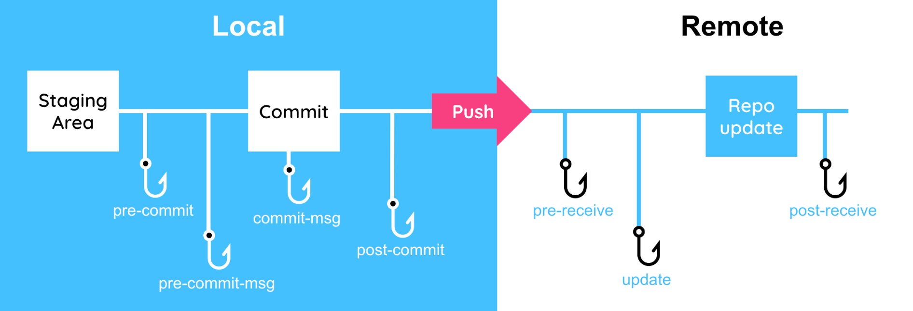

# Husky

Git이 제공하는 "훅(hook)" 기능을 쉽게 사용할 수 있게 해주는 도구입니다.\
원래는 `.git/hooks/` 폴더 안에 `pre-commit` 같은 파일을 직접 만들고 수정해야 하는데, `husky`는 이 과정을 자동화해줍니다.

주로 Git 커밋 직전(pre-commit), 푸시 직전(pre-push) 등에 자동으로 검사, 포맷 등을 실행하고 싶을 때 사용합니다.

## 워크플로



### 커밋 워크플로 훅

| 훅 이름              | 설명                                                        |
| -------------------- | ----------------------------------------------------------- |
| `pre-commit`         | commit 을 실행하기 전에 실행                                |
| `prepare-commit-msg` | commit 메시지를 생성하고 편집기를 실행하기 전에 실행        |
| `commit-msg`         | commit 메시지를 완성한 후 commit 을 최종 완료하기 전에 실행 |
| `post-commit`        | commit 을 완료한 후 실행                                    |

### 이메일 워크플로 훅

| 훅 이름           | 설명                                                           |
| ----------------- | -------------------------------------------------------------- |
| `applypatch-msg`  | git am 명령 실행 시 가장 먼저 실행                             |
| `pre-applypatch`  | patch 적용 후 실행하며, patch 를 중단시킬 수 있음              |
| `post-applypatch` | git am 명령에서 마지막으로 실행하며, patch 를 중단시킬 수 없음 |

### 기타 훅

| 훅 이름        | 설명                                                               |
| -------------- | ------------------------------------------------------------------ |
| `pre-rebase`   | Rebase 하기 전에 실행                                              |
| `post-rewrite` | git commit –amend, git rebase 와 같이 커밋을 변경하는 명령 후 실행 |
| `post-merge`   | Merge 가 끝나고 나서 실행                                          |
| `pre-push`     | git push 명령 실행 시, push 전에 실행. push 를 중단시킬 수 있음    |

## Husky 설치

```bash
npm install --save-dev husky
```

### Husky 초기화

```bash
npx husky init
```

설치 후 package.json의 `prepare` 스크립트에 `"husky"` 추가됩니다.

```json
"scripts": {
  "prepare": "husky" // 추가됨
},
```

그리고 `.husky` 폴더가 생성됩니다.\
`.husky/pre-commit`에는 기본 훅 추가됩니다.\
(npm test 실행)

### .husky/pre-commit에 실행 권한 부여

`.husky/pre-commit` 파일에 “실행할 수 있는 권한(실행 권한, executable permission)”을 부여합니다.

```bash
chmod +x .husky/pre-commit
```

## lint-staged

Prettier, Stylelint 관련 생태계에도 기여하고 있는 개발자가 만들었습니다.\
Git staging 영역에 올라간 파일만 대상으로 lint나 포맷을 적용합니다.\
전체 프로젝트를 검사하지 않아서 속도도 빠르고, 꼭 커밋할 파일만 검사하니 효율적이기 때문에 `Husky`의 pre-commit 훅과 함께 함께 사용합니다.

### lint-staged 설치

```bash
npm install --save-dev lint-staged
```

### pre-commit 훅(hook)세팅

`.husky/pre-commit`에 Git 커밋 전에 자동으로 `lint-staged`를 실행하라는 명령을 작성합니다.

```bash
echo 'npx lint-staged' > .husky/pre-commit
```

- `echo`\
  : 문자열을 출력하는 명령어입니다.

- `npx lint-staged`\
  : 커밋 직전에 `lint-staged`를 실행하여 staged된 파일만 lint 검사합니다.

- `> .husky/pre-commit`\
  : 위 명령어들을 `.husky/pre-commit` 파일에 **덮어씌우는** 명령입니다.

### lint-staged 설정

#### package.json

`package.json`에 아래 내용 추가

```json
"lint-staged": {
  "**/*.{js,ts,tsx}": [
    "prettier --write",
    "eslint --fix",
  ]
}
```

## commitlint

`semantic-release`, `standard-version` 같은 릴리즈 자동화 도구도 함께 관리하는 Conventional Changelog 팀에서 만든 커밋 메시지 검사 도구 패키지입니다.

커밋 메시지를 검사해서 정해진 규칙에 맞지 않으면 커밋을 막기 때문에 팀 프로젝트에서 커밋 메시지 규칙을 통일하기 위해 사용합니다.\
`husky`의 `commit-msg` 훅과 함께 연결해서 사용합니다.

### commitlint 설치

```bash
npm install --save-dev @commitlint/cli @commitlint/config-conventional
```

- `@commitlint/cli`: 커밋 메시지 검사하는 도구

- `@commitlint/config-conventional`: fix:, feat:, docs: 같은 규칙이 담긴 설정

### commitlint 설정 파일

```bash
echo '{ "extends": ["@commitlint/config-conventional"] }' > .commitlintrc.json
```

`.commitlintrc.json` 파일을 생성하여 `"@commitlint/config-conventional"` 규칙을 불러와서 적용합니다.

### commit-msg 훅 만들기

```bash
echo 'npx --no -- commitlint --edit "$1"' > .husky/commit-msg
```

- `npx --no -- commitlint --edit "$1"`\
  : 커밋 메시지를 검사하는 실제 명령어 (`$1` = 커밋 메시지 임시 파일 경로)

### .husky/commit-msg에 실행 권한 부여

Git이 이 `commit-msg`를 훅으로 실행할 수 있도록 권한을 주는 명령어입니다.

```bash
chmod +x .husky/commit-msg
```

## prepare-commit-msg

```bash
#!/bin/sh

GREEN=$(tput setaf 2)
BLUE=$(tput setaf 4)
RED=$(tput setaf 1)
BOLD=$(tput bold)
RESET=$(tput sgr0)

echo "
${BOLD}${BLUE}📝 커밋 메시지 가이드${RESET}

${GREEN}형식${RESET}: <type>: <message> [#이슈번호]

${GREEN}예시${RESET}:
  ${BLUE}feat${RESET}: 회원가입 기능 추가
  ${BLUE}fix${RESET}: 로그인 오류 수정 #123
  ${BLUE}docs${RESET}: README 업데이트

  ${BOLD}✅ commitlint 검사 규칙 요약:${RESET}
  - ${BOLD}<type>${RESET}은 반드시 있어야 하며, ${BLUE}feat, fix, docs${RESET} 등으로 시작해야 합니다.
  - ${BOLD}<message(subject)>${RESET}는 소문자로 시작해야 하며, 마침표(.)로 끝나면 안 됩니다.
  - 예시 비교:
    ${GREEN}fix: login 오류 수정${RESET} ← O
    ${RED}Fix: Login 오류 수정.${RESET} ← X

사용 가능한 type 목록:
  ${BLUE}feat${RESET}      새로운 기능
  ${BLUE}fix${RESET}       버그 수정
  ${BLUE}docs${RESET}      문서 관련 변경
  ${BLUE}style${RESET}     코드 포맷팅 (세미콜론, 들여쓰기 등)
  ${BLUE}refactor${RESET}  리팩토링 (기능 변화 없음)
  ${BLUE}test${RESET}      테스트 추가/수정
  ${BLUE}chore${RESET}     기타 설정, 패키지 변경

${GREEN}TIP:${RESET} 관련된 이슈가 있다면 메시지 끝에 ${BOLD}#123${RESET} 형태로 적어주세요.
"
```

### prepare-commit-msg 실행 권한 부여

```bash
chmod +x .husky/prepare-commit-msg
```

## 참고

- [Enhancing Flutter/Dart code quality with pre-commit hooks](https://dcm.dev/blog/2024/05/31/enhancing-dart-code-quality-with-pre-commit-hooks/)
- [짱잼이의 FE 개발 공부 저장소](https://jjang-j.tistory.com/121)
- [husky 로 git hook 하자](https://library.gabia.com/contents/8492/)
- [husky와 lint-staged로 ESLint와 Prettier 자동화하기](https://jhyeok.com/husky-with-lint-staged/)
