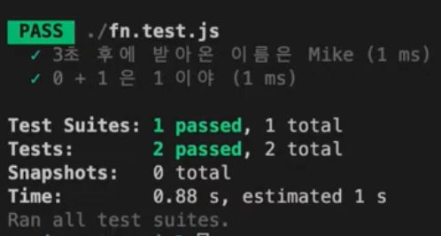

# Testing Asynchronous Code

## 비동기 코드

### 예시 1

`fn.js`의 `fn`함수는 `fn.test.js`에서 `callback`함수를 인자로 받아서 3초 후에 받아온 `callback`함수를 실행합니다.

`callback`함수는 `"Mike"`라는 인자를 받아오기 때문에 `expect(name).toBe("Tom");`는 실패가 되어야 합니다.

```javascript
// fn.js

const fn = {
  getName: (callback) => {
    const name = "Mike";
    setTimeout(() => {
      callback(name);
    }, 3000);
  },
};

module.exports = fn;
```

```javascript
// fn.test.js

const fn = require("./fn");

test("3초 후에 받아온 이름은 Mike", () => {
  function callback(name) {
    expect(name).toBe("Tom");
  }
  fn.getName(callback);
});
```

하지만 결과는 성공입니다.



이유는 `callback`을 호출하기 전 3초를 기다리지 않고 `getName` 메서드가 끝나자마자 테스트가 종료된다는 것입니다.\
`callback`안의 `expect(name).toBe("Tom")` 역시 호출되지 못합니다.

#### 해결법1 콜백

test 함수에 `done`이라고 하는 콜백함수를 전달해 줍니다.\
`done`이 호출되기 전까지 Jest는 테스트를 종료하지 않습니다.

```javascript
// fn.test.js

const fn = require("./fn");

test("3초 후에 받아온 이름은 Mike", (done) => {
  function callback(name) {
    try {
      expect(name).toBe("Tom");
      done();
    } catch (error) {
      done(error);
    }
  }
  fn.getName(callback);
});
```

#### 해결법2 프로미스

프로미스를 사용할 때는 테스트 코드에서 `return`을 사용해야합니다.

`return` 문을 생락한다면, 테스트는 `getName()`메서드로부터 반환된 프로미스가 `resolve` 되고 `then()`이 콜백을 실행할 기회를 가지기 이전에 종료 될 것입니다.

`return` 문이 있다면 `then()`까지 실행하고 난 후 종료됩니다.

```javascript
// fn.js

const fn = {
  getName: () => {
    const name = "Mike";
    return new Promise((res, rej) => {
      setTimeout(() => {
        res(name);
      }, 3000);
    });
  },
};
```

```javascript
// fn.test.js

const fn = require("./fn");

test("3초 후에 받아온 이름은 Mike", () => {
  return fn.getName().then((name) => {
    expect(name).toBe("Tom");
  });
});
```

`Matcher`를 사용하면 조금 더 간단하게 사용할 수 있습니다.

```javascript
// fn.test.js

const fn = require("./fn");

test("3초 후에 받아온 이름은 Mike", () => {
  return expect(fn.getName()).resolves.toBe("Tom");
});
```

에러를 확인하고 싶은경우는 아래와 같습니다.

```javascript
// fn.js

const fn = {
  getName: () => {
    const name = "Mike";
    return new Promise((res, rej) => {
      setTimeout(() => {
        rej("[ERROR]");
      }, 3000);
    });
  },
};

module.exports = fn;
```

```javascript
// fn.test.js

const fn = require("./fn");

test("3초 후에 받아온 이름은 Mike", () => {
  return expect(fn.getName()).rejects.toMatch("[ERROR]");
});
```

#### 해결법2 async/await

```javascript
// fn.test.js

const fn = require("./fn");

test("3초 후에 받아온 이름은 Mike", async () => {
  const name = await fn.getName();
  expect(name).toBe("Tom");
});
```

`async`와 `await`을 `.resolves`와 `.rejects`와 함께 조합할 수도 있습니다.

```javascript
// fn.test.js

const fn = require("./fn");

test("3초 후에 받아온 이름은 Mike", async () => {
  await expect(fn.getName()).resolves.toBe("Tom");
});
```

```javascript
// fn.test.js

const fn = require("./fn");

test("3초 후에 받아온 이름은 Mike", async () => {
  await expect(fn.getName()).rejects.toThrow("[ERROR]");
});
```

### 예시 2

```javascript
// app.js

const { printTitle } = require("./util");

const button = document.querySelector("button");

button.addEventListener("click", printTitle);

exports.printTitle = printTitle;
```

```javascript
// util.js

const { fetchData } = require("./http");

const loadTitle = () => {
  return fetchData().then((extractedData) => {
    const title = extractedData.title;
    const transformedTitle = title.toUpperCase();
    return transformedTitle;
  });
};

const printTitle = () => {
  loadTitle().then((title) => {
    console.log(title);
    return title;
  });
};

exports.printTetle = printTitle;
```

```javascript
// http.js

const axios = require("axios");

const fetchData = () => {
  return axios
    .get("https://jsonplaceholder.typicode.com/todos/1")
    .then((response) => {
      return response.data;
    });
};

exports.fetchData = fetchData;
```

### 테스트 되는 함수의 반환 값이 없는 경우

`printTitle` 함수를 테스트를 하면 문자열이 받아야 하는데 `undefined`를 받았다는 않았다는 오류가 발생합니다.

이유는 테스트 함수는 해당 함수의 반환값을 비교해야하는데, `printTitle` 함수에서 아무것도 반환하지 않기 때문입니다.\
`loadTitle` 함수의 프로미스를 `then`으로 받아 `return`으로 반환하고 있지만 그건 내부 함수에 대한 값이고 `printTitle`함수는 아무 값도 반환하고 있지 않습니다.

따라서 위의 코드에서 테스트를 진행하고 싶다면 함수에서 값을 반환하는 `loadTitle` 함수를 테스트하는 것이 방법이 될 수 있습니다.

```javascript
// util.test.js

const { printTitle } = require("./util");

test("should print an uppercase text", () => {
  expect(printTitle).toBe("DELECTUS AUT AUTEM");
});
```
