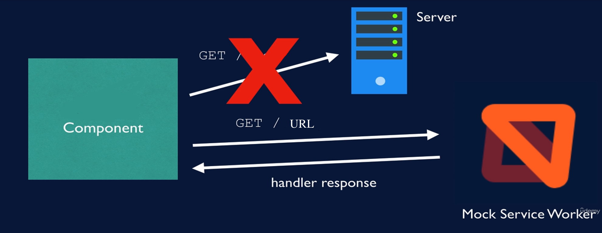

# Mock Service Worker



서비스 워커(Service Worker)를 사용하여 네트워크 호출을 가로채는 API 모킹(mocking) 라이브러리입니다.

- Service Worker
  : 웹 애플리케이션의 백그라운드에서 실행되는 자바스크립트 스크립트로, 네트워크 요청의 중간에서 동작하여 다양한 기능을 수행합니다.\
  주로 어플리케이션과 서버의 중간에서 주고 받는 데이터 요청들을 통제하고 관리할 수 있습니다.\
  특정한 네트워크 요청에 한해서 따로 저장하여 사용자가 어플리케이션을 켜자마자 데이터를 보여주거나 오프라인 상태일 때 저장한 데이터를 보여줄 수 있도록 도와줍니다.

## 사용 목적

- 실제 네트워크 호출을 가로채서 특정 응답을 반환합니다.
- 테스트 중에 네트워크 호출을 방지합니다.
- 서버 응답을 사용하여 테스트 조건 설정합니다.

### Jest / Vites 를 이용해 axios를 모킹하는 것과 차이

`axios` 모킹에 `MSW`를 사용하는 이유는 여러 가지입니다.

만약 동시에 두 가지를 요청을 한다면, 모킹 반환값으로는 이를 관리하기 어려울 뿐만 아니라 불안정합니다.
페이지를 다시 정렬하면 모의 화면에서 반환값의 순서가 잘못되어 테스트가 실패할 수도 있습니다.

요청의 POST 데이터 등에 따라 값을 반환하고 싶을 수 있습니다.
`MSW`라면 핸들러 함수로 가능합니다.

MSW는 쿠키, 이진 응답(예: 이미지) 등 요청의 정교한 측면을 처리할 수 있습니다.
서버 요청 시 사용할 메소드를 바꿀 수 있고, MSW는 어떤 메소드를 사용하든 작동합니다.

#### 요약

간단한 앱에서는 모킹이 가능하지만 더 복잡한 앱에서는 MSW로 다양한 도구를 이용할 수 있습니다.

## 사용 순서

1. Mock Service Worker를 설치합니다.

   ```bash
   npm i -D msw
   ```

2. handler 함수를 생성합니다.
   handler 함수는 특정 URL, 경로에 어떤 응답이 왔는지를 파악합니다.

3. 테스트 서버를 만듭니다.

4. 테스트 전부를 수행하는 중에 테스트 서버가 계속해서 리스닝하도록 하여 네트워크를 호출을 가로채야 합니다.
   테스트 하나가 끝날때 마다 다음 테스트를 위해 서버 핸들러를 리셋합니다.

## handler 함수

요청이 들어왔을 때 임의의 응답을 해주는 `handler` 코드를 작성해야합니다.\
`Express.js` 서버에서 볼 수 있는 코딩 패턴과 상당히 유사한 방식으로 핸들러를 구현할 수 있습니다.\
모킹 관련 코드는 프로젝트의 `mocks`이라는 디렉토리에 두는 것이 일반적인 관례입니다.

### http handler 생성

```tsx
HandlerType.HTTPMethod("URL", () => {});
```

- Handler Type: `http` or `graphql`
- HTTP method: `get`, `post`, etc...

아래의 예시에서는 `http://Full URL to mock`로 `HTTPMethod`요청한 응답으로 `{ user: { id: "abc-123", name: "John Maverick", }, }`을 보내줍니다.

```tsx
// src/mocks/handlers.js

import { http, HttpResponse } from "msw";

export const handlers = [
  http.get("http://Full URL to mock", () => {
    // Note that you DON'T have to stringify the JSON!
    return HttpResponse.json({
      user: {
        id: "abc-123",
        name: "John Maverick",
      },
    });
  }),
];
```

### HttpResponse

HttpResponse 클래스는 Fetch API Response의 대체제로 설계되었으며, 더 편리한 응답 선언과 응답 쿠키 모킹과 같은 특별한 기능을 지원을 목적으로 합니다.

- `Response`는 Fetch API에서 사용되는 객체로 fetch로 요청을 했을 때 웹서버가 응답한 결과를 담고 있는 데이터 입니다.

#### `Response`의 주요 속성 (Properties)

- `Response.status`: HTTP 상태 코드를 나타냅니다.
- `Response.statusText`: HTTP 상태 메시지를 나타냅니다.
- `Response.headers`: 응답 헤더를 나타냅니다.
- `Response.url`: 응답이 받아진 URL을 나타냅니다.
- `Response`의 주요 메소드 (Methods)
- `Response.json()`: JSON 형식의 응답을 파싱하여 JavaScript 객체로 반환합니다.
- `Response.text()`: 텍스트 형식의 응답을 문자열로 반환합니다.
- `Response.blob()`: Blob 형식의 응답을 반환합니다.
- `Response.arrayBuffer()`: ArrayBuffer 형식의 응답을 반환합니다.

```tsx
// HttpResponse 클래스의 생성자
class HttpResponse {
  constructor(
    body:
      | Blob
      | ArrayBuffer
      | TypedArray
      | DateView
      | FormData
      | ReadableStream
      | URLSearchParams
      | string
      | null
      | undefined,
    options?: {
      status?: number;
      statusText?: string;
      headers?: HeadersInit;
    }
  );
}
```

사용방법은 아래와 같습니다.

1. HttpResponse 클래스의 생성자를 사용한 응답 생성

   ```tsx
   new HttpResponse(body, init);
   ```

   body는 응답의 본문을 나타내고, init은 응답에 대한 옵션을 나타냅니다.
   상태코드, 상태 텍스트, 헤더 등을 지정할 수 있습니다.

   ```tsx
   // 예시: HttpResponse 클래스의 생성자를 사용한 응답 생성
   const response = new HttpResponse("Not found", {
     status: 404,
     headers: {
       "Content-Type": "text/plain",
     },
   });
   ```

2. HttpResponse 클래스의 JSON 응답 생성 정적 메소드

   JSON 형식의 응답을 생성하는 정적 메소드입니다. 주로 서버 응답 시 JSON 데이터를 사용하는 경우에 활용됩니다.

   ```tsx
   HttpResponse.json(body, init);
   ```

   아래 코드는 '/resource' 경로에 대한 JSON 응답을 생성합니다.
   "Response.json(body)"와 같습니다.

   ```tsx
   // 예시: JSON 응답 생성
   http.get("/resource", () => {
     return HttpResponse.json({
       id: "abc-123",
       title: "Modern Testing Practices",
     });
   });
   ```

3. HttpResponse.error() 메소드

   네트워크 오류 응답을 생성하는 정적 메소드입니다.
   주로 특정 상황에서 네트워크 오류를 시뮬레이트할 때 사용됩니다.

   ```tsx
   HttpResponse.error();
   ```

   아래 코드는 "Response.error()"와 같습니다.
   '/resource' 경로에 대한 네트워크 오류 응답을 생성합니다.

   ```tsx
   // 예시: 네트워크 오류 응답 생성
   http.get("/resource", () => {
     return HttpResponse.error();
   });
   ```

   HttpResponse.error() 및 Response.error() 모두 네트워크 오류 응답을 사용자 정의할 수 없습니다.
   사용자 정의하려면 응답 리졸버 내에서 예외를 throw하는 것을 고려하세요.

4. Custom Methods

   HttpResponse 클래스는 Fetch API 명세에는 없는 특수한 메소드들도 제공합니다.

   - HttpResponse.text(body, init)
     : 텍스트 응답을 생성하는 메소드로, Content-Type 헤더를 text/plain으로 설정합니다.

     ```tsx
     HttpResponse.text("Hello world!");
     ```

   - HttpResponse.xml(body, init)
     : XML 응답을 생성하는 메소드로, Content-Type 헤더를 application/xml으로 설정합니다.

     ```tsx
     // 예시: XML 응답 생성
     HttpResponse.xml(`
     <post>
       <id>abc-123</id>
       <title>Modern Testing Practices</title>
     </post>
     `);
     ```

   - HttpResponse.formData(body, init)
     : multipart/form-data 형식의 응답을 생성하는 메소드로, FormData를 이용하여 응답을 구성합니다.

     ```tsx
     // 예시: FormData 응답 생성
     const form = new FormData();
     form.append("id", "abc-123");
     form.append("title", "Modern Testing Practices");

     HttpResponse.formData(form);
     ```

   - HttpResponse.arrayBuffer(body, init)
     : ArrayBuffer를 이용하여 응답을 생성하는 메소드로, Content-Length 헤더를 자동으로 설정합니다.

     ```tsx
     // 예시: ArrayBuffer 응답 생성
     const buffer = new ArrayBuffer(/* byte length */);
     HttpResponse.arrayBuffer(buffer);
     ```

## 테스트 서버

### 생성

`msw/node` 모듈의 `setupServer()` 함수를 이용하면 테스트용 API 서버를 만들 수 있습니다.

```tsx
// src/mocks/server.js

import { setupServer } from "msw/node";
import { handlers } from "./handlers";

export const server = setupServer(...handlers);
```

#### setupWorker와 setupServer의 차이점

- Worker: 브라우저 환경에서 네트워크 요청을 모킹합니다. 일반적으로 React 애플리케이션 개발에서 사용됩니다.

- Server: Node.js 환경에서 네트워크 요청을 모킹합니다. 주로 서버 사이드 렌더링 또는 테스트 환경(Jest 등)에서 활용됩니다.

Next.js 애플리케이션의 초기 실행은 Node.js 환경에서 이루어집니다. 이는 window 객체가 없다는 것을 의미하며, 이로 인해 MSW의 Worker를 바로 사용하는 것이 어렵습니다. 반면, 클라이언트 사이드에서는 window 객체가 존재하므로 Worker 초기화가 가능합니다.

### 설정

테스트 실행 전에 가짜 API 서버를 올렸다가 테스트 실행 후에 내릴 수 있도록 Jest 설정을 해줍니다.

```tsx
// src/setupTests.js

import "@testing-library/jest-dom";

import { beforeAll, afterEach, afterAll } from "vitest";
import { server } from "./src/mocks/node";

// Establish API mocking before all tests
// API 모킹을 하기 위해 제일 먼저 앞서 수행하는 작업
beforeAll(() => server.listen());

// Reset any request handlers that we may add during the tests,
// so they don't affect other tests
// 테스트 간에 핸들러를 리셋하는 코드
afterEach(() => server.resetHandlers());

// Clean up after the tests are finished
// 이 코드는 마지막에 깔끔하게 서버를 끔
afterAll(() => server.close());
```

## 테스트 코드

`handler`에 요청을 보낼 테스트 코드를 실행합니다.

### 주의 사항

서버 연결은 거의 항상 비동기식이기 때문에 `await`와 `findBy`를 사용해야 합니다.

## 참고

- [Jest / Vitest 를 활용한 React 테스팅 라이브러리](https://www.udemy.com/course/jest-testing-library/)
- [MSW로 백엔드 API 모킹하기](https://www.daleseo.com/mock-service-worker/)
- [next 14: MSW 적용까지 시도해본 방법들 정리하기](https://velog.io/@wns450/msw-next-%EC%9D%B4%EC%8A%88)
