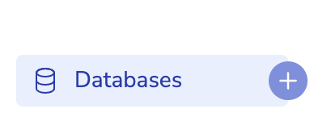
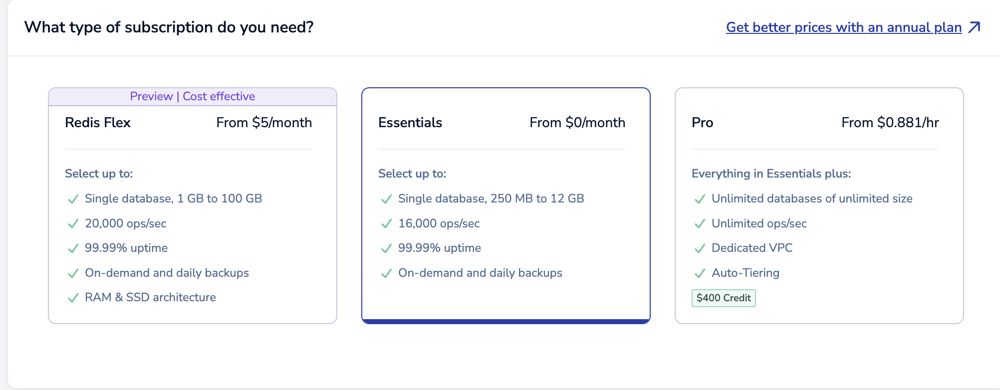
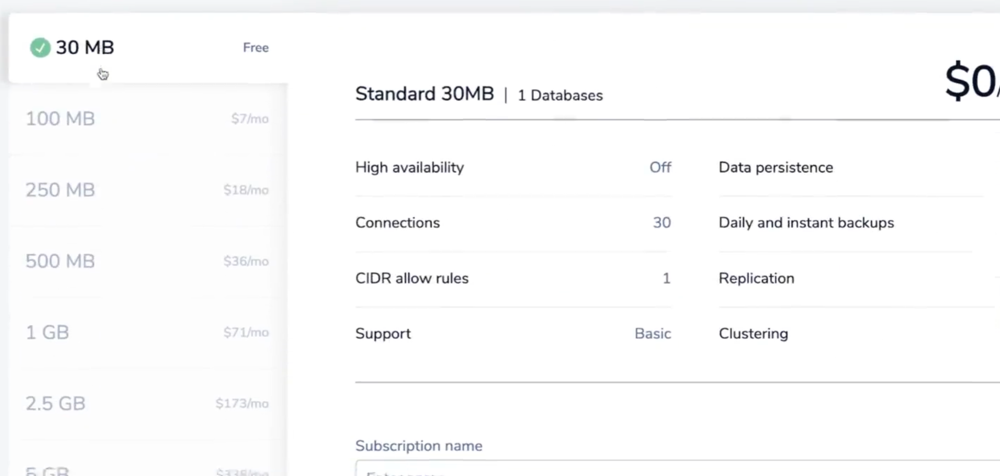
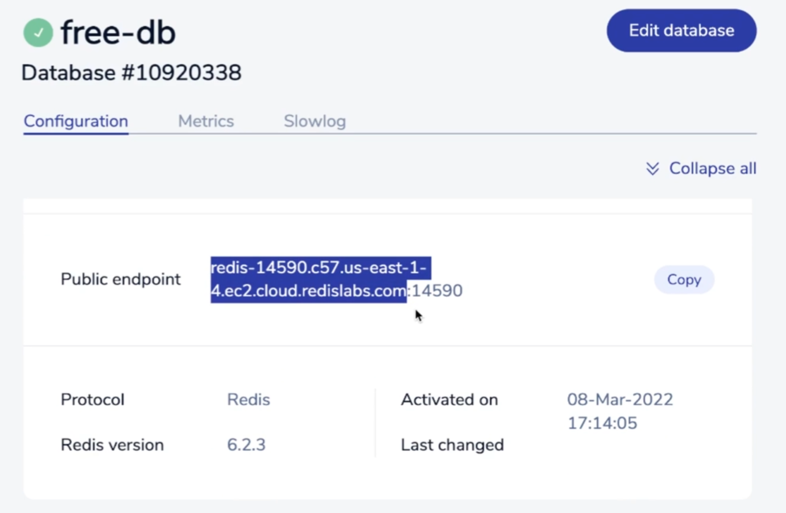
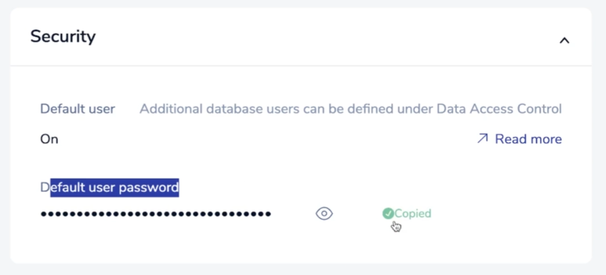

# Redis

## 레디스 사용 전 데이터베이스 endpoint와 user password 가져오기

1. [Redis](https://redis.io/lp/try1/?utm_campaign=gg_s_brand_acq_apac-en_21161918358&utm_source=google&utm_medium=cpc&utm_content=redis_exact&utm_term=&gad_source=1&gclid=Cj0KCQiA9667BhDoARIsANnamQa61RJu2wtjN6wVdTvi0pqH7RHusQrufKeh6bMpJdzYFKCOU1VnbekaAohrEALw_wcB) 홈페이지 회원 가입합니다.

2. 왼쪽 사이드 바에서 Databases의 + 버튼으로 데이터 베이스를 생성합니다.

   

3. 프리 플랜을 사용할 계획이라면 Essential 구독을 선택합니다.

   

4. 프리 플랜을 사용할 계획이라면 Standard 30MB 옵션을 선택합니다.

   

5. 데이터 베이스가 생성되면 public endpoint가 주어집니다.

   

6. 데이터 베이스가 생성되면 user password가 주어집니다.

   

7. public endpoint와 user password는 `.env`를 통해 사용합니다.

   ```json
   REDIS_HOST=redis-cloud.com
   REDIS_PORT=10000
   REDIS_PW=ghuUpjㄹlC9lㅁㅇㄹㅁㄴ2j6Iqb1341234
   ```
