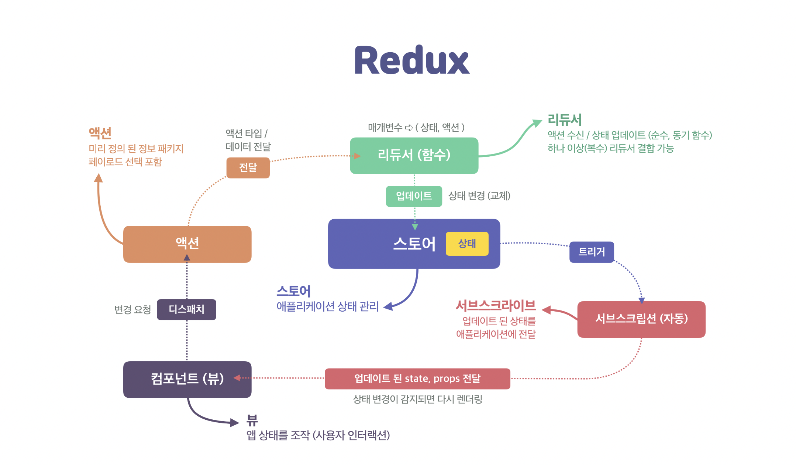

# Redux

Redux는 앱 전체에서 공용으로 사용하는 상태를 관리하는 하나의 객체라고 생각하면 됩니다.

Redux를 사용하는 이유는 Flux 아키텍처에서 파생된 구조와, 단방향 데이터 흐름(One-way data flow)의 이점을 활용하여 애플리케이션의 상태 관리를 더 명확하고 예측 가능하게 만들기 위함입니다.

## Flux 패턴

Facebook에서 제안한 애플리케이션 아키텍처 패턴입니다.

### Flux 패턴 구조

Flux 패턴에서 데이터는 항상 한 방향으로 흐르며, 상태 변경은 직접 조작하지 않고 오직 액션을 통해서만 일어납니다.\
상태 변경은 오직 액션을 통해서만 일어나므로, 예측 가능한 흐름이 보장됩니다.

```plain
[View] → (Action) → [Dispatcher] → [Store] → [View]
```

- Action: 사용자 상호작용이나 이벤트에 의해 발생하는 의도를 담은 객체입니다.

- Dispatcher: 모든 액션을 받아서 Store에 **전달**하는 중앙 허브입니다.

- Store: 애플리케이션의 상태를 저장하고, 변경된 상태를 구독자에게 알려줍니다.

- View: React 컴포넌트처럼 UI를 렌더링하며, Store의 상태를 바탕으로 동작합니다.

## Redux는 Flux의 단순화 버전

- Dispatcher 제거: 리덕스에서는 중앙 dispatcher 대신, `dispatch()` 함수로 액션을 직접 보냅니다.

- Store는 하나만 존재: Redux는 단일 중앙 Store를 사용하여 전체 앱 상태를 관리합니다.

- Reducer 함수 사용: 상태 변경 로직은 `reducer` 함수로 명확하게 분리됩니다.

  

## redux 설치

### 공식 권장 툴킷 설치

redux Core만도 내부에 포함되어 따로 설치 안 해도 됩니다.\
`createSlice`, `configureStore`, `createAsyncThunk` 등 편의 기능 포함, Redux를 쉽게 쓰기 위한 표준 도구(설정, 유틸, 미들웨어 등)도 함께 설치합니다.

React와 연결이 안 되기 때문에 단독으로는 `useSelector`, `useDispatch`, `Provider`를 사용하지 못합니다.

```bash
npm install @reduxjs/toolkit
```

### React에서 Redux를 쓸 때의 공식 표준 설치

React에서 Redux를 쓸 때의 공식 표준입니다.\
react-redux는 React에서 `Provider`, `useSelector`, `useDispatch` 등 연결 기능 제공합니다.

```bash
npm install @reduxjs/toolkit react-redux
```

### 오리지널 Redux Core만 설치

가장 낮은 수준의 Redux 기능만 포함(`createStore`, `combineReducers`, `dispatch`, `subscribe` 등)하며 React와 연결하는 기능 없습니다.

모든 설정(미들웨어, 비동기 처리 등)을 수동으로 해야 하기 때문에 요즘은 거의 사용하지 않습니다.

```bash
npm install redux
```

## redux 예시



```js
const redux = require("redux");

const INCREMENT = "increment";
const DECREMENT = "decrement";

const initialState = { counter: 0 };

// 리듀서
const reducer = (state = initialState, action) => {
  switch (action.type) {
    case INCREMENT:
      return { counter: state.counter + (action.payload || 1) };
    case DECREMENT:
      return { counter: state.counter - (action.payload || 1) };
    default:
      return state;
  }
};

// 스토어
const store = redux.createStore(reducer);

// 서브스크립션
const subscriber = () => {
  console.log("현재 상태:", store.getState());
  // 현재 상태: { counter: 5 }
  // 현재 상태: { counter: 3 }
  // 현재 상태: { counter: 4 }
};
store.subscribe(subscriber);

// 디스패치
store.dispatch({ type: INCREMENT, payload: 5 });
store.dispatch({ type: DECREMENT, payload: 2 });
store.dispatch({ type: INCREMENT });
```

### action

리듀서에서 정한 함수를 부르는 호출 명령이라고 생각하면 됩니다.

`type`이라는 속성이 있으며 `action` 에 대한 제목과 같습니다.\
`store`의 `dispatch` 메소드를 이용하여 `action` 을 발생시킬 수 있습니다.

### 리듀서

사용할 함수, 명령을 묶어놓은 것이라고 생각하면 됩니다.

입력 파라미터로는 다음 두 가지를 받습니다.

- `state`: 누적된 현재 상태 (Accumulated State)

- `action`: 발생한 액션 객체 (Dispatched Action)

이 두 값을 받아서 새로운 상태 객체(New State Object)를 반환합니다.

Redux는 하나의 새로운 Action이 발생할때마다 reducer 함수를 실행시킵니다.\
5개의 Action이 발생한다면 reducer는 5번 실행됩니다.

reducer는 동일한 입력값을 넣으면 항상 정확히 같은 출력이 산출되어야 하는 순수한 함수로 사용해야합니다.

#### 리듀서가 순수 함수이여야 하는 이유

1. 상태 변화 감지가 불가능해집니다.\
   Redux는 상태를 항상 “새 객체로 대체”하여 관리합니다.\
   이렇게 해야 이전 상태와 다음 상태를 쉽게 비교할 수 있습니다.\
   하지만 위처럼 원본 state를 직접 수정하면, 변화가 발생했더라도 이전 객체와 다음 객체가 같은 참조를 가리키게 되어 변경이 감지되지 않고, React는 리렌더링을 하지 않게 됩니다.\
   즉, 버그처럼 보이는 무반응 현상이 발생할 수 있습니다.

2. 상태 히스토리 추적과 시간 여행 디버깅이 불가능해집니다.\
   Redux는 상태 변화 이력을 저장하고, DevTools를 통해 시간을 되돌리는 디버깅 기능을 제공합니다.\
   하지만 원본 상태를 직접 수정하면, 이전 상태와 이후 상태의 경계가 모호해지기 때문에 상태 추적이 불가능해지고, 시간 여행 디버깅이 깨지게 됩니다.

#### 리듀서 잘못된 예시 모음

1. 원본 state 직접 수정\
   변경 여부 감지 불가하기 때문에 리렌더링 안 일어날 수 있습니다.

   ```js
   if (action.type === "increment") {
     state.counter++; // ❌ 원본 객체를 변경
     return state;
   }
   ```

2. 외부 변수 사용 (비결정성, 순수성 위반)\
   외부 상태에 따라 리듀서 결과가 달라지기 때문에 예측 불가능합니다.

   ```js
   let factor = 2;

   const reducer = (state = { count: 0 }, action) => {
     if (action.type === "scale") {
       return { count: state.count * factor }; // ❌ 외부 변수 의존
     }
     return state;
   };
   ```

3. 비동기 코드 포함\
   리듀서 내부에서는 비동기 코드나 부작용을 절대 넣으면 안 됩니다.\
   비동기 처리는 redux-thunk, redux-saga, middleware에서 해야 합니다.

   ```js
   if (action.type === "increment") {
     setTimeout(() => {
       console.log("2초 후 실행"); // ❌ 부작용 (side effect)
     }, 2000);
     return { counter: state.counter + 1 };
   }
   ```

4. 콘솔 출력, 알림 등 사이드 이펙트\
   `alert`는 사용자 환경에 영향을 주기 때문에 순수 함수 아닙니다.

   ```js
   if (action.type === "error") {
     alert("오류 발생"); // ❌ 외부에 영향 줌 (side effect)
     return { ...state, hasError: true };
   }
   ```

5. 랜덤, 날짜 등 비결정적 값 사용
   동일한 액션, 동일한 상태에서 호출해도 결과가 매번 달라지기 때문에 순수함수가 아닙니다.\
   따라서 시간, 랜덤 사용은 action 생성 시점에 처리해야 합니다.

   ```js
   if (action.type === "assignId") {
     return { ...state, id: Math.random() }; // ❌ 실행할 때마다 결과가 다름
   }
   ```

   ```js
   if (action.type === "setTime") {
     return { ...state, time: Date.now() }; // ❌ 매번 다른 결과
   }
   ```

### 스토어

단일 Store를 이용하여 Redux가 동작하며 모든 state는 하나의 Store에서 관리되고 수정됩니다.\
Reducer에서 반환받은 새로운 State는 Store내에 반영되고 저장됩니다.

## 참고

- [Why REDUX ? and basic principals of REDUX](https://medium.com/@nipunsachintha/why-redux-and-basic-principals-of-redux-e99905e808a2)
- [Redux Flow](https://rainbowcd.tistory.com/65)
