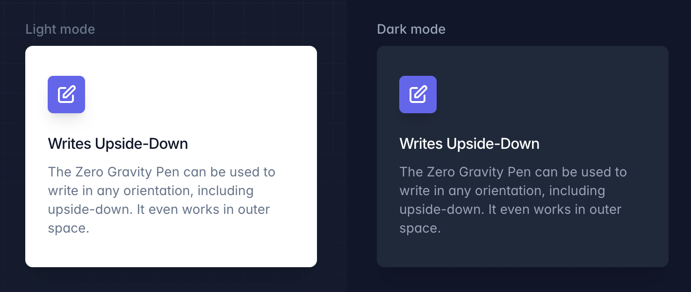

# Dark Mode

Tailwind CSS를 사용하여 다크 모드로 사이트 스타일링하기

## 기본 사용법

운영 체제에서 다크 모드가 기본 기능으로 제공되기 시작하면서, 사이트의 기본 디자인 외에 다크 버전도 디자인하는 것이 점점 더 흔해지고 있습니다.

이 과정을 최대한 쉽게 만들기 위해 Tailwind는 `dark` 변형을 제공하여 다크 모드가 활성화되었을 때 사이트의 스타일을 다르게 지정할 수 있습니다:



```html
<div class="grid grid-cols-1 sm:grid-cols-2">
  <div class="p-8 pt-7">
    <p class="mb-2 text-sm font-medium text-slate-500">라이트 모드</p>
    <div class="bg-white rounded-lg px-6 py-8 ring-1 ring-slate-900/5 shadow-xl">
      <div>
        <span class="inline-flex items-center justify-center p-2 bg-indigo-500 rounded-md shadow-lg">
          <svg class="h-6 w-6 text-white" xmlns="http://www.w3.org/2000/svg" fill="none" viewBox="0 0 24 24" stroke="currentColor" aria-hidden="true">
            <path stroke-linecap="round" stroke-linejoin="round" stroke-width="2" d="M11 5H6a2 2 0 00-2 2v11a2 2 0 002 2h11a2 2 0 002-2v-5m-1.414-9.414a2 2 0 112.828 2.828L11.828 15H9v-2.828l8.586-8.586z" />
          </svg>
        </span>
      </div>
      <h3 class="mt-5 text-base font-medium text-slate-900 tracking-tight">Writes Upside-Down</h3>
      <p class="mt-2 text-sm text-slate-500">
        The Zero Gravity Pen can be used to write in any orientation, including upside-down. It even works in outer space.
      </p>
    </div>
  </div>
  <div class="bg-slate-900 p-8 pt-7">
    <p class="mb-2 text-sm font-medium text-slate-400">다크 모드</p>
    <div class="bg-slate-800 rounded-lg px-6 py-8 ring-1 ring-slate-900/5 shadow-xl">
      <div>
        <span class="inline-flex items-center justify-center p-2 bg-indigo-500 rounded-md shadow-lg">
          <svg class="h-6 w-6 text-white" xmlns="http://www.w3.org/2000/svg" fill="none" viewBox="0 0 24 24" stroke="currentColor" aria-hidden="true">
            <path stroke-linecap="round" stroke-linejoin="round" stroke-width="2" d="M11 5H6a2 2 0 00-2 2v11a2 2 0 002 2h11a2 2 0 002-2v-5m-1.414-9.414a2 2 0 112.828 2.828L11.828 15H9v-2.828l8.586-8.586z" />
          </svg>
        </span>
      </div>
      <h3 class="mt-5 text-base font-medium text-white tracking-tight">Writes Upside-Down</h3>
      <p class="mt-2 text-sm text-slate-400">
        The Zero Gravity Pen can be used to write in any orientation, including upside-down. It even works in outer space.
      </p>
    </div>
  </div>
</div>
```

```html
<div class="bg-white **dark:bg-slate-800** rounded-lg px-6 py-8 ring-1 ring-slate-900/5 shadow-xl">
  <div>
    <span class="inline-flex items-center justify-center p-2 bg-indigo-500 rounded-md shadow-lg">
      <svg class="h-6 w-6 text-white" xmlns="http://www.w3.org/2000/svg" fill="none" viewBox="0 0 24 24" stroke="currentColor" aria-hidden="true"><!-- ... --></svg>
    </span>
  </div>
  <h3 class="text-slate-900 **dark:text-white** mt-5 text-base font-medium tracking-tight">Writes Upside-Down</h3>
  <p class="text-slate-500 **dark:text-slate-400** mt-2 text-sm">
    The Zero Gravity Pen can be used to write in any orientation, including upside-down. It even works in outer space.
  </p>
</div>
```

기본적으로 `prefers-color-scheme` CSS 미디어 기능을 사용하지만, 다크 모드를 수동으로 토글할 수 있는 사이트를 만들려면 'selector' 전략을 사용할 수 있습니다.

## 다크 모드 수동 토글하기

운영 체제의 기본 설정을 따르지 않고 다크 모드를 수동으로 토글하고 싶다면, `media` 전략 대신 `selector` 전략을 사용하세요:

`selector` 전략은 Tailwind CSS v3.4.1에서 `class` 전략을 대체했습니다.

```js
/** @type {import('tailwindcss').Config} */
module.exports = {
  darkMode: 'selector',
  // ...
}
```

이제 `dark:{class}` 클래스는 `prefers-color-scheme`에 따라 적용되지 않고, HTML 트리에서 `dark` 클래스가 존재하면 적용됩니다.

```html
<!-- 다크 모드가 활성화되지 않음 -->
<html>
<body>
  <!-- 배경은 흰색 -->
  <div class="**bg-white** dark:bg-black">
    <!-- ... -->
  </div>
</body>
</html>

<!-- 다크 모드 활성화됨 -->
<html class="**dark**">
<body>
  <!-- 배경은 검은색 -->
  <div class="bg-white **dark:bg-black**">
    <!-- ... -->
  </div>
</body>
</html>
```

Tailwind 설정에서 <a href="/docs/configuration#prefix">접두어(prefix)</a>를 설정했다면, `dark` 클래스에 해당 접두어를 추가하는 것을 잊지 마세요. 예를 들어, `tw-` 접두어를 설정했다면, 다크 모드를 활성화하려면 `tw-dark` 클래스를 사용해야 합니다.

`dark` 클래스를 `html` 요소에 추가하는 방법은 여러분에게 맡겨집니다. 일반적으로는 `localStorage`와 같은 곳에서 선호도를 읽어와 DOM을 업데이트하는 JavaScript를 사용하는 방식이 흔합니다.

### 셀렉터(custom selector) 맞춤 설정

일부 프레임워크(예: NativeScript)는 다크 모드를 활성화하는 고유한 방식이 있으며, 다크 모드가 활성화될 때 다른 클래스 이름을 추가합니다.

다크 모드 셀렉터를 맞춤 설정하려면 `darkMode`를 배열로 설정하여 두 번째 항목으로 사용자 정의 셀렉터를 지정할 수 있습니다:

```js
/** @type {import('tailwindcss').Config} */
module.exports = {
  darkMode: ['selector', '[data-mode="dark"]'],
  // ...
}
```

Tailwind는 자동으로 사용자 정의 다크 모드 셀렉터를 `:where()` 가상 클래스로 감싸서, `media` 전략을 사용할 때와 동일한 우선순위를 유지하도록 합니다:

```css
.dark\:underline:where([data-mode="dark"], [data-mode="dark"] *){
  text-decoration-line: underline;
}
```

### 시스템 기본 설정 및 수동 선택 지원

`selector` 전략은 사용자의 시스템 기본 설정 _또는_ 수동으로 선택된 모드를 지원할 수 있습니다. 이를 위해 [`window.matchMedia()` API](https://developer.mozilla.org/en-US/docs/Web/API/Window/matchMedia)를 사용할 수 있습니다.

다음은 라이트 모드, 다크 모드, 그리고 운영 체제의 기본 설정을 모두 지원하는 간단한 예시입니다:

```js
// 페이지 로드 시 또는 테마 변경 시, FOUC를 방지하려면 `head` 안에 인라인으로 추가하는 것이 좋습니다.
document.documentElement.classList.toggle(
  'dark',
  localStorage.theme === 'dark' || (!('theme' in localStorage) && window.matchMedia('(prefers-color-scheme: dark)').matches)
)

// 사용자가 명시적으로 라이트 모드를 선택했을 때
localStorage.theme = 'light'

// 사용자가 명시적으로 다크 모드를 선택했을 때
localStorage.theme = 'dark'

// 사용자가 운영 체제 기본 설정을 따르도록 명시적으로 선택했을 때
localStorage.removeItem('theme')
```

다시 말하지만, 이 과정은 여러분의 방식대로 관리할 수 있으며, 데이터베이스에서 서버 측으로 선호도를 저장하고 서버에서 클래스를 렌더링하는 방법도 가능합니다. 모든 것은 여러분의 선택입니다.

## 다크 변형 오버라이딩

Tailwind의 기본 다크 변형을 자신의 맞춤형 변형으로 대체하고 싶다면, `variant` 다크 모드 전략을 사용하여 할 수 있습니다:

```js
/** @type {import('tailwindcss').Config} */
module.exports = {
  darkMode: ['variant', '&:not(.light *)'],
  // ...
}
```

이 전략을 사용할 경우, Tailwind는 제공된 셀렉터를 어떤 식으로든 수정하지 않으므로 셀렉터의 특이성을 신경 써야 하며, 다른 유틸리티와 동일한 특이성을 유지하려면 `:where()` 가상 클래스를 사용하는 것이 좋습니다.

### 여러 셀렉터 사용하기

다크 모드를 활성화해야 하는 여러 상황이 있다면, 배열로 모든 셀렉터를 지정할 수 있습니다:

```js
/** @type {import('tailwindcss').Config} */
module.exports = {
  darkMode: ['variant', [
    '@media (prefers-color-scheme: dark) { &:not(.light *) }',
    '&:is(.dark *)',
  ]],
  // ...
}
```
