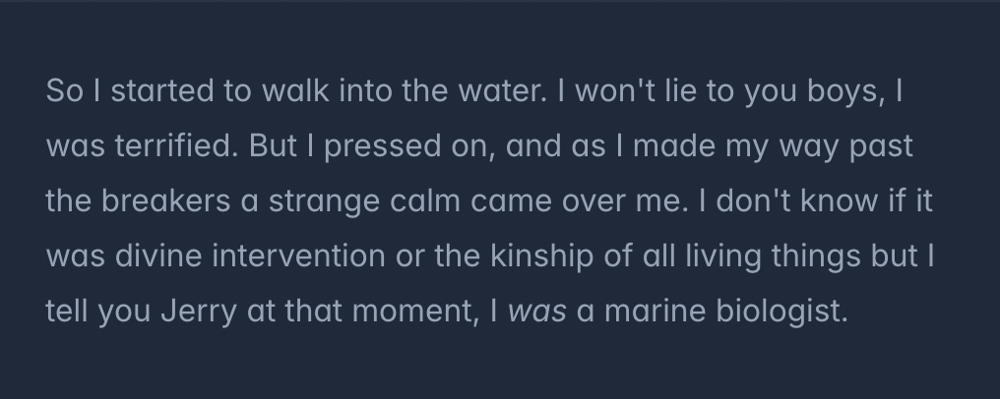

# Handling Hover, Focus, and Other States

Tailwind의 유틸리티 클래스를 사용하여 hover, focus와 같은 상태에 따른 스타일을 처리하는 방법입니다.

Tailwind의 모든 유틸리티 클래스는 조건적으로 적용될 수 있습니다. 이를 위해 클래스 이름 앞에 상태를 나타내는 수정자를 추가합니다.

예를 들어, hover 상태에서 `bg-sky-700` 클래스를 적용하려면 `hover:bg-sky-700` 클래스를 사용합니다:


```html
<button class="bg-sky-500 **hover:bg-sky-700** ...">
  Save changes
</button>
```

## 전통적인 CSS와 비교

전통적인 CSS 방식에서는 하나의 클래스 이름이 현재 상태에 따라 다른 스타일을 적용합니다.

### 전통적인 방식에서 hover 상태에 다른 스타일을 적용하는 방법

```css
.btn-primary {
  background-color: #0ea5e9;
}
.btn-primary:hover {
  background-color: #0369a1;
}
```

Tailwind에서는 hover 상태의 스타일을 기존 클래스에 추가하는 대신, 해당 상태에서만 적용되는 클래스를 요소에 추가합니다.

Tailwind는 대부분의 필요한 상태에 대한 수정자를 포함하고 있습니다. 예를 들어:

- `:hover`, `:focus`, `:first-child`, `:required`와 같은 의사 클래스
- `::before`, `::after`, `::placeholder`, `::selection`과 같은 의사 요소
- 반응형 브레이크포인트, 다크 모드, `prefers-reduced-motion`과 같은 미디어 및 기능 쿼리
- `[dir="rtl"]`, `[open]`과 같은 속성 선택자

이 수정자는 조합하여 더 구체적인 상황을 타겟팅할 수도 있습니다. 예를 들어, 다크 모드에서, 중간 화면 크기에서, hover 상태에서 배경색을 변경하는 코드:

```html
<button class="**dark:md:hover:bg-fuchsia-600** ...">
  Save changes
</button>
```

### Tailwind에서는 기본 상태와 hover 상태에 대해 별도의 클래스를 사용합니다

```css
.bg-sky-500 {
  background-color: #0ea5e9;
}
.hover\:bg-sky-700:hover {
  background-color: #0369a1;
}
```

`hover:bg-sky-700` 클래스는 오직 `:hover` 상태에서만 스타일을 정의합니다. 기본적으로는 아무 동작도 하지 않지만, 해당 요소를 hover할 때 `sky-700` 배경색으로 바뀝니다.

이렇게 유틸리티 클래스는 _조건적으로_ 적용된다고 말할 수 있습니다. 수정자를 사용하면 HTML을 떠나지 않고도 디자인이 다른 상태에서 어떻게 동작할지 정확히 제어할 수 있습니다.

## 의사 클래스 (Pseudo-classes)

### Hover, focus, active

`hover`, `focus`, `active` 수정자를 사용하여 hover, focus, active 상태에서 요소를 스타일링할 수 있습니다:


```html
<button class="bg-violet-500 hover:bg-violet-600 active:bg-violet-700 focus:outline-none focus:ring focus:ring-violet-300 ...">
  변경 사항 저장
</button>
```

Tailwind는 `:visited`, `:focus-within`, `:focus-visible` 등과 같은 다른 인터랙티브 상태에 대한 수정자도 포함합니다.

사용 가능한 모든 의사 클래스 수정자에 대한 전체 목록은 의사 클래스 참조를 확인하십시오.

### 첫 번째, 마지막, 홀수, 짝수

`first`와 `last` 수정자를 사용하여 첫 번째 자식 또는 마지막 자식인 경우 스타일링할 수 있습니다:


```html
<ul role="list" class="p-6 divide-y divide-slate-200">
  {#each people as person}
    <!-- 첫 번째/마지막 자식일 때 위/아래 패딩 제거 -->
    <li class="flex py-4 first:pt-0 last:pb-0">
      
      <div class="ml-3 overflow-hidden">
        <p class="text-sm font-medium text-slate-900">{person.name}</p>
        <p class="text-sm text-slate-500 truncate">{person.email}</p>
      </div>
    </li>
  {/each}
</ul>
```

홀수 또는 짝수 자식일 때 스타일링하려면 `odd`와 `even` 수정자를 사용할 수 있습니다:


```html
<table>
  <!-- ... -->
  <tbody>
    {#each people as person}
      <!-- 홀수 행은 흰색 배경, 짝수 행은 slate-50 배경 사용 -->
      <tr class="odd:bg-white even:bg-slate-50">
        <td>{person.name}</td>
        <td>{person.title}</td>
        <td>{person.email}</td>
      </tr>
    {/each}
  </tbody>
</table>
```

Tailwind는 `:only-child`, `:first-of-type`, `:empty` 등과 같은 다른 구조적 의사 클래스에 대한 수정자도 포함합니다.

사용 가능한 모든 의사 클래스 수정자에 대한 전체 목록은 의사 클래스 참조를 확인하십시오.

### 폼 상태 (Form states)

`required`, `invalid`, `disabled`와 같은 수정자를 사용하여 폼 요소를 다양한 상태에서 스타일링할 수 있습니다:


```html
<form>
  <label class="block">
    <span class="block text-sm font-medium text-slate-700">사용자 이름</span>
    <!-- 폼 상태 수정자를 사용하면 각 입력 요소에 동일한 클래스가 적용됩니다 -->
    <input type="text" value="tbone" disabled class="mt-1 block w-full px-3 py-2 bg-white border border-slate-300 rounded-md text-sm shadow-sm placeholder-slate-400
      focus:outline-none focus:border-sky-500 focus:ring-1 focus:ring-sky-500
      **disabled:bg-slate-50** **disabled:text-slate-500** **disabled:border-slate-200** **disabled:shadow-none**
      **invalid:border-pink-500** **invalid:text-pink-600**
      **focus:invalid:border-pink-500** **focus:invalid:ring-pink-500**
    "/>
  </label>
  <!-- ... -->
</form>
```

이와 같은 수정자를 사용하면 템플릿에서 조건부 로직의 양을 줄일 수 있으며, 입력 요소가 어떤 상태에 있든 동일한 클래스 세트를 사용하고 브라우저가 올바른 스타일을 자동으로 적용하게 할 수 있습니다.

Tailwind는 `:read-only`, `:indeterminate`, `:checked` 등 다른 폼 상태에 대한 수정자도 포함합니다.

사용 가능한 모든 의사 클래스 수정자에 대한 전체 목록은 의사 클래스 참조를 확인하십시오.

### 부모 상태에 따른 스타일링 (group-{'{modifier}'})

부모 요소의 상태에 따라 자식 요소를 스타일링해야 할 때는 부모에 `group` 클래스를 지정하고, `group-*` 수정자(예: `group-hover`)를 사용하여 자식 요소를 스타일링합니다:


```html
<a href="#" class="**group** block max-w-xs mx-auto rounded-lg p-6 bg-white ring-1 ring-slate-900/5 shadow-lg space-y-3 hover:bg-sky-500 hover:ring-sky-500">
  <div class="flex items-center space-x-3">
    <svg class="h-6 w-6 stroke-sky-500 **group-hover:stroke-white**" fill="none" viewBox="0 0 24 24"><!-- ... --></svg>
    <h3 class="text-slate-900 **group-hover:text-white** text-sm font-semibold">새 프로젝트</h3>
  </div>
  <p class="text-slate-500 **group-hover:text-white** text-sm">다양한 시작 템플릿으로 새 프로젝트를 만듭니다.</p>
</a>
```

이 패턴은 모든 의사 클래스 수정자에서 작동하며, 예를 들어 `group-focus`, `group-active`, `group-odd` 등을 사용할 수 있습니다.

#### 중첩된 그룹 구분

그룹을 중첩할 때, 특정 부모 그룹의 상태를 기반으로 스타일을 지정하려면 해당 부모 그룹에 고유한 그룹 이름을 `group/{name}` 클래스를 사용하여 지정하고, `group-hover/{name}`과 같은 클래스를 사용하여 해당 이름을 수정자로 포함시킬 수 있습니다:


```html
<ul role="list">
  {#each people as person}
    <li class="**group/item** hover:bg-slate-100 ...">
      
      <div>
        <a href="{person.url}">{person.name}</a>
        <p>{person.title}</p>
      </div>
      <a class="**group/edit** invisible hover:bg-slate-200 **group-hover/item:visible** ..." href="tel:{person.phone}">
        <span class="**group-hover/edit:text-gray-700** ...">Call</span>
        <svg class="**group-hover/edit:translate-x-0.5 group-hover/edit:text-slate-500** ...">
          <!-- ... -->
        </svg>
      </a>
    </li>
  {/each}
</ul>
```

그룹은 원하는 대로 이름을 지정할 수 있으며 특별한 설정 없이도 사용할 수 있습니다. 마크업에서 그룹의 이름을 직접 지정하면 Tailwind가 자동으로 필요한 CSS를 생성합니다.

#### 임의의 그룹

`group-*` 수정자를 임의로 생성하려면 대괄호 안에 고유한 선택자를 제공하여 한 번만 사용할 수 있는 `group-*` 수정자를 만들 수 있습니다:

```html
<div class="group is-published">
  <div class="hidden **group-[.is-published]:block**">
    Published
  </div>
</div>
```

```css
.group.is-published .group-\[\.is-published\]\:block {
  display: block;
}
```

더 많은 제어를 위해 `&` 문자를 사용하여 `.group`이 최종 선택자에서 어디에 위치해야 하는지 표시할 수 있습니다:

```html
<div class="group">
  <div class="group-[:nth-of-type(3)_&]:block">
    <!-- ... -->
  </div>
</div>
```

```css
:nth-of-type(3) .group .group-\[\:nth-of-type\(3\)_\&\]\:block {
  display: block;
}
```

### 형제 상태에 따른 스타일링 (peer-{'{modifier}'})

형제 요소의 상태에 따라 스타일을 지정하려면 형제 요소에 `peer` 클래스를 추가하고, `peer-*` 수정자를 사용하여 대상 요소를 스타일링할 수 있습니다:


```html
<form>
  <label class="block">
    <span class="block text-sm font-medium text-slate-700">Email</span>
    <input type="email" class="**peer** ..."/>
    <p class="mt-2 invisible **peer-invalid:visible** text-pink-600 text-sm">
      Please provide a valid email address.
    </p>
  </label>
</form>
```

이렇게 하면 [플로팅 레이블](https://www.youtube.com/watch?v=nJzKi6oIvBA)과 같은 다양한 멋진 효과를 JavaScript 없이 구현할 수 있습니다.

이 패턴은 `peer-focus`, `peer-required`, `peer-disabled`와 같은 모든 의사 클래스 수정자와 함께 작동합니다.

중요한 점은 `peer` 마커는 _이전_ 형제 요소에서만 사용할 수 있다는 것입니다. 이는 [다음 형제 결합자](https://developer.mozilla.org/en-US/docs/Web/CSS/Subsequent-sibling_combinator)가 CSS에서 작동하는 방식 때문입니다.

#### 작동하지 않습니다, 이전 형제만 peer로 지정할 수 있습니다

```html
<label>
  <span class="**peer-invalid:text-red-500** ...">Email</span>
  <input type="email" class="**peer** ..."/>
</label>
```

#### 피어 구분

여러 피어를 사용할 때, 특정 피어의 상태를 기준으로 스타일을 지정하려면 해당 피어에 고유한 이름을 `peer/{name}` 클래스를 사용하여 지정하고, `peer-checked/{name}`과 같은 클래스를 사용하여 수정자에 해당 이름을 포함시킬 수 있습니다:


```html
<fieldset>
  <legend>Published status</legend>

  <input id="draft" class="**peer/draft**" type="radio" name="status" checked />
  <label for="draft" class="**peer-checked/draft:text-sky-500**">Draft</label>

  <input id="published" class="**peer/published**" type="radio" name="status" />
  <label for="published" class="**peer-checked/published:text-sky-500**">Published</label>

  <div class="hidden **peer-checked/draft:block**">Drafts are only visible to administrators.</div>
  <div class="hidden **peer-checked/published:block**">Your post will be publicly visible on your site.</div>
</fieldset>
```

피어는 원하는 대로 이름을 지정할 수 있으며 특별한 설정 없이도 사용할 수 있습니다. 마크업에서 피어의 이름을 직접 지정하면 Tailwind가 자동으로 필요한 CSS를 생성합니다.

#### 임의의 피어

`peer-*` 수정자를 임의로 생성하려면 대괄호 안에 고유한 선택자를 제공하여 한 번만 사용할 수 있는 `peer-*` 수정자를 만들 수 있습니다:

```css
.peer.is-dirty:required ~ .peer-\[\.is-dirty\]\:peer-required\:block {
  display: block;
}
```

더 많은 제어를 위해 `&` 문자를 사용하여 `.peer`가 최종 선택자에서 어디에 위치해야 하는지 표시할 수 있습니다:

```html
<div>
  <input type="text" class="peer" />
  <div class="hidden **peer-[:nth-of-type(3)_&]:block**">
    <!-- ... -->
  </div>
</div>
```

```css
:nth-of-type(3) .peer ~ .peer-\[\:nth-of-type\(3\)_\&\]\:block {
  display: block;
}
```

### 직접 자식 요소 스타일링 (*-{'{modifier}'})

일반적으로 유틸리티 클래스를 자식 요소에 직접 적용하는 것이 더 바람직하지만, 자식 요소를 직접 제어할 수 없는 경우에는 `*` 수정자를 사용할 수 있습니다.


```html
<div>
  <h2>카테고리<h2>
  <ul class="***:rounded-full *:border *:border-sky-100 *:bg-sky-50 *:px-2 *:py-0.5 dark:text-sky-300 dark:*:border-sky-500/15 dark:*:bg-sky-500/10** ...">
    <li>판매</li>
    <li>마케팅</li>
    <li>SEO</li>
    <!-- ... -->
  </ul>
</div>
```

중요한 점은 자식 요소 자체에 유틸리티 클래스를 직접 적용하여 스타일을 오버라이드하는 것이, 생성된 자식 선택자의 특이성 때문에 동작하지 않는다는 것입니다.

작동하지 않음, 자식 요소는 자신의 스타일을 오버라이드할 수 없습니다.

```html
<ul class="***:bg-sky-50** ...">
  <li class="**bg-red-50** ...">판매</li>
  <li>마케팅</li>
  <li>SEO</li>
  <!-- ... -->
</ul>
```

### 후손 상태에 따른 스타일링 (has-{'{modifier}'})

`has-*` 수정자를 사용하여 후손 요소의 상태나 내용에 따라 부모 요소의 스타일을 지정할 수 있습니다.


```html
<label class="**has-[:checked]:bg-indigo-50 has-[:checked]:text-indigo-900 has-[:checked]:ring-indigo-200** ..">
  <svg fill="currentColor">
    <!-- ... -->
  </svg>
  Google Pay
  <input type="radio" class="checked:border-indigo-500 ..." />
</label>
```

`has-*` 수정자는 `has-[:focus]`와 같은 의사 클래스를 사용하여 후손의 상태에 따라 스타일을 지정하거나, `has-[img]` 또는 `has-[a]`와 같은 요소 선택자를 사용하여 후손의 내용에 따라 스타일을 지정할 수 있습니다.

#### 그룹의 후손에 따른 스타일링 (group-has-{'{modifier}'})

부모 요소의 후손에 따라 스타일을 지정하려면 부모에 `group` 클래스를 추가하고, `group-has-*` 수정자를 사용하여 목표 요소를 스타일링할 수 있습니다.


```html
<div class="**group** ...">
  
  <h4>Spencer Sharp</h4>
  <svg class="hidden **group-has-[a]:block** ...">
    <!-- ... -->
  </svg>
  <p>제품 디자이너 at <a href="...">planeteria.tech</a></p>
</div>
```

#### 동료의 후손에 따른 스타일링 (peer-has-{'{modifier}'})

형제 요소의 후손에 따라 스타일을 지정하려면 형제 요소에 `peer` 클래스를 추가하고, `peer-has-*` 수정자를 사용하여 목표 요소를 스타일링할 수 있습니다.


```html
<fieldset>
  <legend>오늘</legend>

  <div>
    <label class="**peer** ...">
      <input type="checkbox" name="todo[1]" checked />
      할 일 목록 작성
    </label>
    <svg class="**peer-has-[:checked]:hidden** ...">
      <!-- ... -->
    </svg>
  </div>

  <!-- ... -->
</fieldset>
```

## 가상 요소(Pseudo-elements)

### Before와 After

`::before`와 `::after` 가상 요소는 `before`와 `after` 수정자를 사용하여 스타일링할 수 있습니다:


```html
<label class="block">
  <span class="**after:content-['*']** **after:ml-0.5** **after:text-red-500** block text-sm font-medium text-slate-700">
    Email
  </span>
  <input type="email" name="email" class="mt-1 px-3 py-2 bg-white border shadow-sm border-slate-300 placeholder-slate-400 focus:outline-none focus:border-sky-500 focus:ring-sky-500 block w-full rounded-md sm:text-sm focus:ring-1" placeholder="you@example.com" />
</label>
```

이 수정자를 사용할 때, Tailwind은 기본적으로 `content: ''`를 자동으로 추가하므로 다른 값을 사용하고자 할 때만 이를 명시적으로 지정할 필요가 없습니다:


```html
<blockquote class="text-2xl font-semibold italic text-center text-slate-900">
  When you look
  <span class="**before:block** **before:absolute** **before:-inset-1** **before:-skew-y-3** **before:bg-pink-500** relative inline-block">
    <span class="relative text-white">annoyed</span>
  </span>
  all the time, people think that you're busy.
</blockquote>
```

대부분의 Tailwind 프로젝트에서는 `::before`와 `::after` 가상 요소를 사용하는 것보다 실제 HTML 요소를 사용하는 것이 더 간단합니다.

예를 들어, 위와 같은 디자인을 `<span>`을 사용하여 `::before` 가상 요소를 대신할 수 있습니다. 이 방식이 더 읽기 쉽고 코드 양도 적습니다:

```html
  <blockquote class="text-2xl font-semibold italic text-center text-slate-900">
    When you look
    <span class="relative">
      <span class="block absolute -inset-1 -skew-y-3 bg-pink-500" aria-hidden="true"></span>
      <span class="relative text-white">annoyed</span>
    </span>
    all the time, people think that you're busy.
  </blockquote>
```

`before`와 `after`는 가상 요소의 내용이 실제 DOM에 존재하지 않으며 사용자가 선택할 수 없을 때 사용하세요.

[preflight 기본 스타일](/docs/preflight)을 비활성화한 경우, 기본적으로 `content` 속성이 빈 문자열로 설정되지 않으므로, `before`와 `after` 수정자를 사용할 때마다 `content-['']`를 포함해야 합니다.

`preflight`가 비활성화된 경우, `content`를 수동으로 설정해야 합니다:

```html
<div class="**before:content-['']** before:block ...">
  <!-- ... -->
</div>
```

### 입력 필드의 플레이스홀더 텍스트

`placeholder` 수정자를 사용하여 입력 필드나 텍스트 영역의 플레이스홀더 텍스트를 스타일링할 수 있습니다:


```html
<label class="relative block">
  <span class="sr-only">Search</span>
  <span class="absolute inset-y-0 left-0 flex items-center pl-2">
    <svg class="h-5 w-5 fill-slate-300" viewBox="0 0 20 20"><!-- ... --></svg>
  </span>
  <input class="**placeholder:italic** **placeholder:text-slate-400** block bg-white w-full border border-slate-300 rounded-md py-2 pl-9 pr-3 shadow-sm focus:outline-none focus:border-sky-500 focus:ring-sky-500 focus:ring-1 sm:text-sm" placeholder="Search for anything..." type="text" name="search"/>
</label>
```

### 파일 입력 버튼

`file` 수정자를 사용하여 파일 입력의 버튼을 스타일링할 수 있습니다:


```html
<form class="flex items-center space-x-6">
  <div class="shrink-0">
    
  </div>
  <label class="block">
    <span class="sr-only">프로필 사진 선택</span>
    <input type="file" class="block w-full text-sm text-slate-500
      **file:mr-4** **file:py-2** **file:px-4**
      **file:rounded-full** **file:border-0**
      **file:text-sm** **file:font-semibold**
      **file:bg-violet-50** **file:text-violet-700**
      **hover:file:bg-violet-100**
    "/>
  </label>
</form>
```

Tailwind의 [테두리 리셋](/docs/preflight#border-styles-are-reset-globally)이 파일 입력 버튼에는 적용되지 않으므로, 파일 입력 버튼에 테두리를 추가하려면 `file:border-solid`와 같은 [테두리 스타일](/docs/border-style)을 명시적으로 설정해야 합니다:

```html
<input type="file" class="file:border **file:border-solid** ..." />
```

### 목록 마커

`marker` 수정자를 사용하여 목록에서 카운터나 불릿을 스타일링할 수 있습니다:


```html
<ul role="list" class="**marker:text-sky-400** list-disc pl-5 space-y-3 text-slate-500" dark-class="**marker:text-sky-400** list-disc pl-5 space-y-3 text-slate-400">
  <li>5 cups chopped Porcini mushrooms</li>
  <li>1/2 cup of olive oil</li>
  <li>3lb of celery</li>
</ul>
```

`marker` 수정자는 상속 가능하도록 설계되었으므로, `<li>` 요소에 직접 사용할 수 있을 뿐만 아니라 부모 요소에 사용하여 중복을 피할 수 있습니다.

### 강조된 텍스트

`selection` 수정자를 사용하여 활성화된 텍스트 선택을 스타일링할 수 있습니다:



```html
<div class="**selection:bg-fuchsia-300** **selection:text-fuchsia-900**">
  <p>
    So I started to walk into the water. I won't lie to you boys, I was
    terrified. But I pressed on, and as I made my way past the breakers
    a strange calm came over me. I don't know if it was divine intervention
    or the kinship of all living things but I tell you Jerry at that moment,
    I <em>was</em> a marine biologist.
  </p>
</div>
```

`selection` 수정자는 상속 가능하도록 설계되어 있으므로, 트리의 어느 곳에든 추가할 수 있으며, 모든 하위 요소에 적용됩니다.

이를 통해 사이트 전반에서 선택 색상을 브랜드에 맞게 쉽게 설정할 수 있습니다:

```html
<html>
<head>
  <!-- ... -->
</head>
<body class="**selection:bg-pink-300**">
  <!-- ... -->
</body>
</html>
```

### 첫 번째 줄과 첫 번째 글자

`first-line` 수정자를 사용하여 콘텐츠 블록의 첫 번째 줄을 스타일링하고, `first-letter` 수정자를 사용하여 첫 번째 글자를 스타일링할 수 있습니다:


```html
<p class="**first-line:uppercase** **first-line:tracking-widest**
  **first-letter:text-7xl** **first-letter:font-bold** **first-letter:text-slate-900**
  **first-letter:mr-3** **first-letter:float-left**
" dark-class="**first-line:uppercase** **first-line:tracking-widest**
  **first-letter:text-7xl** **first-letter:font-bold** **first-letter:text-white**
  **first-letter:mr-3** **first-letter:float-left**
">
  Well, let me tell you something, funny boy. Y'know that little stamp, the one
  that says "New York Public Library"? Well that may not mean anything to you,
  but that means a lot to me. One whole hell of a lot.
</p>
```

### 다이얼로그 배경

`backdrop` 수정자를 사용하여 [네이티브 `<dialog>` 요소](https://developer.mozilla.org/en-US/docs/Web/HTML/Element/dialog)의 배경을 스타일링할 수 있습니다:

```html
<dialog class="**backdrop:bg-gray-50**">
  <form method="dialog">
    <!-- ... -->
  </form>
</dialog>
```

프로젝트에서 네이티브 `<dialog>` 요소를 사용하는 경우, `open` 수정자를 사용하여 [열림/닫힘 상태 스타일링](/docs/hover-focus-and-other-states#open-closed-state)을 읽어보는 것도 좋습니다.

## 미디어 및 기능 쿼리

### 반응형 브레이크포인트

특정 브레이크포인트에서 요소를 스타일링하려면 `md`와 `lg`와 같은 반응형 수정자를 사용하십시오.

예를 들어, 이 코드는 모바일에서는 3열 그리드, 중간 너비 화면에서는 4열 그리드, 큰 너비 화면에서는 6열 그리드를 렌더링합니다:

```html
<div class="grid grid-cols-3 md:grid-cols-4 lg:grid-cols-6">
  <!-- ... -->
</div>
```

이 기능들이 어떻게 작동하는지에 대해 더 자세히 알고 싶으면 [반응형 디자인](/docs/responsive-design) 문서를 참고하십시오.

### 선호 색상 모드

`prefers-color-scheme` 미디어 쿼리는 사용자가 라이트 테마 또는 다크 테마를 선호하는지를 알려주며, 보통 운영 체제 수준에서 설정됩니다.

수정자가 없는 유틸리티를 사용하여 라이트 모드를 타겟팅하고, `dark` 수정자를 사용하여 다크 모드에 대한 오버라이드를 제공하십시오:


```html
<div class="bg-white **dark:bg-slate-900** rounded-lg px-6 py-8 ring-1 ring-slate-900/5 shadow-xl">
  <div>
    <span class="inline-flex items-center justify-center p-2 bg-indigo-500 rounded-md shadow-lg">
      <svg class="h-6 w-6 text-white" fill="none" viewBox="0 0 24 24" stroke="currentColor" aria-hidden="true"><!-- ... --></svg>
    </span>
  </div>
  <h3 class="text-slate-900 **dark:text-white** mt-5 text-base font-medium tracking-tight">Writes Upside-Down</h3>
  <p class="text-slate-500 **dark:text-slate-400** mt-2 text-sm">
    The Zero Gravity Pen can be used to write in any orientation, including upside-down. It even works in outer space.
  </p>
</div>
```

이 기능이 어떻게 작동하는지에 대해 더 자세히 알고 싶으면 [다크 모드](/docs/dark-mode) 문서를 참고하십시오.

### 선호하는 최소 동작

`prefers-reduced-motion` 미디어 쿼리는 사용자가 필수적이지 않은 동작을 최소화해 달라고 요청했는지 여부를 알려줍니다.

사용자가 동작 축소를 요청한 경우 `motion-reduce` 수정자를 사용하여 스타일을 조건부로 추가하십시오:


```html
<button type="button" class="bg-indigo-500 ..." disabled>
  <svg class="**motion-reduce:hidden** animate-spin ..." viewBox="0 0 24 24"><!-- ... --></svg>
  Processing...
</button>
```

Tailwind에는 사용자가 _동작 축소를 요청하지 않은 경우_에만 스타일을 추가하는 `motion-safe` 수정자도 포함되어 있습니다. `motion-reduce` 헬퍼를 사용할 경우 스타일을 "되돌리는" 일이 많을 수 있기 때문에 유용합니다:

```html
<!-- `motion-reduce`를 사용할 경우 많은 "되돌리기" 스타일이 필요할 수 있습니다 -->
<button class="hover:-translate-y-0.5 transition **motion-reduce:hover:translate-y-0** **motion-reduce:transition-none** ...">
  Save changes
</button>

<!-- `motion-safe`를 사용하는 것이 이런 상황에서 더 적은 코드입니다 -->
<button class="**motion-safe:hover:-translate-x-0.5** **motion-safe:transition** ...">
  Save changes
</button>
```

### 대비 선호도

`prefers-contrast` 미디어 쿼리는 사용자가 더 많은 대비 또는 적은 대비를 요청했는지 알려줍니다.

사용자가 더 많은 대비를 요청한 경우 `contrast-more` 수정자를 사용하여 스타일을 조건부로 추가하십시오:


```html
<form>
  <label class="block">
    <span class="block text-sm font-medium text-slate-700">Social Security Number</span>
    <input class="border-slate-200 placeholder-slate-400 **contrast-more:border-slate-400** **contrast-more:placeholder-slate-500**"/>
    <p class="mt-2 opacity-10 **contrast-more:opacity-100** text-slate-600 text-sm">
      We need this to steal your identity.
    </p>
  </label>
</form>
```

Tailwind에는 사용자가 더 적은 대비를 요청한 경우 스타일을 조건부로 추가할 수 있는 `contrast-less` 수정자도 포함되어 있습니다.

### 강제 색상 모드

`forced-colors` 미디어 쿼리는 사용자가 강제 색상 모드를 사용 중인지를 나타냅니다. 이 모드는 사용자가 정의한 팔레트를 사용하여 텍스트, 배경, 링크 및 버튼의 색상을 덮어씁니다.

사용자가 강제 색상 모드를 활성화한 경우 `forced-colors` 수정자를 사용하여 스타일을 조건부로 추가하십시오:


```html
<form>
  <legend> Choose a theme: </legend>
  <label>
    <input type="radio" class="**forced-colors:appearance-auto** appearance-none" />
    <p class="**forced-colors:block** hidden">
      Cyan
    </p>
    <div class="**forced-colors:hidden** h-6 w-6 rounded-full bg-cyan-200 ..."></div>
    <div class="**forced-colors:hidden** h-6 w-6 rounded-full bg-cyan-500 ..."></div>
  </label>
  <!-- ... -->
</form>
```

Tailwind에는 [강제 색상 조정](/docs/forced-color-adjust) 유틸리티도 포함되어 있어 강제 색상 모드를 선택하고 해제할 수 있습니다.

### 뷰포트 방향

`portrait`와 `landscape` 수정자를 사용하여 뷰포트가 특정 방향일 때 스타일을 조건부로 추가하십시오:

```html
<div>
  <div class="portrait:hidden">
    <!-- ... -->
  </div>
  <div class="landscape:hidden">
    <p>
      This experience is designed to be viewed in landscape. Please rotate your
      device to view the site.
    </p>
  </div>
</div>
```

### 인쇄 스타일

`print` 수정자를 사용하여 문서를 인쇄할 때만 적용되는 스타일을 조건부로 추가하십시오:

```html
<div>
  <article class="**print:hidden**">
    <h1>My Secret Pizza Recipe</h1>
    <p>This recipe is a secret, and must not be shared with anyone</p>
    <!-- ... -->
  </article>
  <div class="hidden **print:block**">
    Are you seriously trying to print this? It's secret!
  </div>
</div>
```

### 지원하는 규칙

`supports-[...]` 수정자를 사용하여 사용자의 브라우저에서 특정 기능을 지원하는지 여부에 따라 스타일을 추가하십시오.

```html
<div class="flex **supports-[display:grid]:grid** ...">
  <!-- ... -->
</div>
```

내부적으로 `supports-[...]` 수정자는 [`@supports 규칙`](https://developer.mozilla.org/en-US/docs/Web/CSS/@supports)을 생성하며, 대괄호 안에 `@supports (...)`와 함께 사용하는 모든 내용을 포함할 수 있습니다. 예를 들어, 속성/값 쌍이나 `and`와 `or`를 사용하는 표현식 등이 가능합니다.

간결함을 위해 속성이 지원되는지 여부만 확인하려는 경우, 속성 이름만 지정할 수 있습니다:

```html
<div class="bg-black/75 **supports-[backdrop-filter]:bg-black/25** **supports-[backdrop-filter]:backdrop-blur** ...">
  <!-- ... -->
</div>
```

`tailwind.config.js` 파일의 `theme.supports` 섹션에서 프로젝트에서 자주 사용하는 `@supports` 규칙에 대한 단축키를 구성할 수 있습니다:

```js
/** @type {import('tailwindcss').Config} */
module.exports = {
  theme: {
    supports: {
      grid: 'display: grid',
    },
  },
}
```

그런 다음 프로젝트에서 이러한 사용자 정의 `supports-*` 수정자를 사용할 수 있습니다:

```html
<div class="**supports-grid:grid**">
  <!-- ... -->
</div>
```

## 속성 선택자

### ARIA 상태

`aria-*` 수정자를 사용하여 [ARIA 속성](https://developer.mozilla.org/en-US/docs/Web/Accessibility/ARIA/Attributes)을 기반으로 스타일을 조건부로 적용할 수 있습니다.

예를 들어, `aria-checked` 속성이 `true`로 설정된 경우 `bg-sky-700` 클래스를 적용하려면 `aria-checked:bg-sky-700` 클래스를 사용합니다:

```html
<div aria-checked="true" class="bg-gray-600 **aria-checked:bg-sky-700**">
  <!-- ... -->
</div>
```

기본적으로 가장 일반적인 부울 ARIA 속성에 대해 수정자가 포함되어 있습니다:

| Modifier | CSS |
| --- | --- |
| <code className="before:content-none after:content-none">aria-busy</code> | <code className="whitespace-nowrap before:content-none after:content-none"><span className="text-slate-400">&</span>[aria-busy="true"]</code> |
| <code className="before:content-none after:content-none">aria-checked</code> | <code className="whitespace-nowrap before:content-none after:content-none"><span className="text-slate-400">&</span>[aria-checked="true"]</code> |
| <code className="before:content-none after:content-none">aria-disabled</code> | <code className="whitespace-nowrap before:content-none after:content-none"><span className="text-slate-400">&</span>[aria-disabled="true"]</code> |
| <code className="before:content-none after:content-none">aria-expanded</code> | <code className="whitespace-nowrap before:content-none after:content-none"><span className="text-slate-400">&</span>[aria-expanded="true"]</code> |
| <code className="before:content-none after:content-none">aria-hidden</code> | <code className="whitespace-nowrap before:content-none after:content-none"><span className="text-slate-400">&</span>[aria-hidden="true"]</code> |
| <code className="before:content-none after:content-none">aria-pressed</code> | <code className="whitespace-nowrap before:content-none after:content-none"><span className="text-slate-400">&</span>[aria-pressed="true"]</code> |
| <code className="before:content-none after:content-none">aria-readonly</code> | <code className="whitespace-nowrap before:content-none after:content-none"><span className="text-slate-400">&</span>[aria-readonly="true"]</code> |
| <code className="before:content-none after:content-none">aria-required</code> | <code className="whitespace-nowrap before:content-none after:content-none"><span className="text-slate-400">&</span>[aria-required="true"]</code> |
| <code className="before:content-none after:content-none">aria-selected</code> | <code className="whitespace-nowrap before:content-none after:content-none"><span className="text-slate-400">&</span>[aria-selected="true"]</code> |

사용 가능한 `aria-*` 수정자를 사용자 정의하려면 `tailwind.config.js` 파일에서 `theme.aria` 또는 `theme.extend.aria`를 편집하십시오:

```js
/** @type {import('tailwindcss').Config} */
module.exports = {
  theme: {
    extend: {
      aria: {
        asc: 'sort="ascending"',
        desc: 'sort="descending"',
      },
    },
  },
};
```

더 복잡한 ARIA 속성에 대해 특정 값을 사용할 때, 또는 테마에 포함할 필요가 없는 일회성 `aria` 수정자를 사용해야 하는 경우, 대괄호를 사용하여 임의의 값을 사용하여 속성을 동적으로 생성할 수 있습니다.

```html
<table>
  <thead>
    <tr>
      <th
        aria-sort="ascending"
        class="**aria-[sort=ascending]:bg-[url('/img/down-arrow.svg')]** **aria-[sort=descending]:bg-[url('/img/up-arrow.svg')]**"
      >
        Invoice #
      </th>
      <!-- ... -->
    </tr>
  </thead>
  <!-- ... -->
</table>
```

```css
.aria-\[sort\=ascending\]\:bg-\[url\(\'\/img\/down-arrow\.svg\'\)\][aria-sort=ascending] {
  background-image: url('/img/down-arrow.svg');
}

.aria-\[sort\=descending\]\:bg-\[url\(\'\/img\/up-arrow\.svg\'\)\][aria-sort=descending] {
  background-image: url('/img/up-arrow.svg');
}
```

ARIA 상태 수정자는 `group-aria-*` 및 `peer-aria-*` 수정자를 사용하여 부모 및 형제 요소를 대상으로 할 수도 있습니다:

```html
<table>
  <thead>
    <tr>
    <th aria-sort="ascending" class="group">
      Invoice #
      <svg class="**group-aria-[sort=ascending]:rotate-0** **group-aria-[sort=descending]:rotate-180**"><!-- ... --></svg>
    </th>
    <!-- ... -->
    </tr>
  </thead>
  <!-- ... -->
</table>
```

```css
.group[aria-sort=ascending] .group-aria-\[sort\=ascending\]\:rotate-0 {
  --tw-rotate: 0deg;
  transform: translate(var(--tw-translate-x), var(--tw-translate-y)) rotate(var(--tw-rotate)) skewX(var(--tw-skew-x)) skewY(var(--tw-skew-y)) scaleX(var(--tw-scale-x)) scaleY(var(--tw-scale-y));
}

.group[aria-sort=descending] .group-aria-\[sort\=descending\]\:rotate-180 {
  --tw-rotate: 180deg;
  transform: translate(var(--tw-translate-x), var(--tw-translate-y)) rotate(var(--tw-rotate)) skewX(var(--tw-skew-x)) skewY(var(--tw-skew-y)) scaleX(var(--tw-scale-x)) scaleY(var(--tw-scale-y));
}
```

### 데이터 속성

`data-*` 수정자를 사용하여 [데이터 속성](https://developer.mozilla.org/en-US/docs/Learn/HTML/Howto/Use_data_attributes)을 기반으로 조건부로 스타일을 적용할 수 있습니다.

`data-*` 속성은 정의상 표준이 없기 때문에 기본적으로 임의의 값만 지원됩니다. 예를 들어:

```html
<!-- 적용됩니다 -->
<div data-size="large" class="**data-[size=large]:p-8**">
  <!-- ... -->
</div>

<!-- 적용되지 않습니다 -->
<div data-size="medium" class="**data-[size=large]:p-8**">
  <!-- ... -->
</div>
```

자주 사용하는 데이터 속성 선택자에 대한 단축키를 `tailwind.config.js` 파일의 `theme.data` 섹션에서 구성할 수 있습니다:

```js
/** @type {import('tailwindcss').Config} */
module.exports = {
  theme: {
    data: {
      checked: 'ui~="checked"',
    },
  },
}
```

그런 다음 프로젝트에서 이러한 사용자 정의 `data-*` 수정자를 사용할 수 있습니다:

```html
<div data-ui="checked active" class="**data-checked:underline**">
  <!-- ... -->
</div>
```

### RTL 지원


`rtl` 및 `ltr` 수정자를 사용하여 다방향 레이아웃을 구축할 때 오른쪽에서 왼쪽, 왼쪽에서 오른쪽 모드에서 스타일을 조건부로 추가할 수 있습니다:

```html
  <div class="group flex items-center">
    
    <div class="ltr:ml-3 rtl:mr-3">
      <p class="text-sm font-medium text-slate-700 group-hover:text-slate-900" dark-class="text-sm font-medium text-slate-300 group-hover:text-white">...</p>
      <p class="text-sm font-medium text-slate-500 group-hover:text-slate-700" dark-class="text-sm font-medium text-slate-500 group-hover:text-slate-300">...</p>
    </div>
  </div>
```

`ltr` 수정자는 `dir` 속성이 명시적으로 `ltr`로 설정되지 않는 한 적용되지 않으므로, 다방향 사이트를 구축할 때 항상 방향을 설정해야 합니다. 오른쪽에서 왼쪽 모드에서만 사용하는 것이 아니라 왼쪽에서 오른쪽 모드에서도 항상 설정하십시오.

```html
<html dir="ltr">
  <!-- ... -->
</html>
```

이 수정자는 왼쪽에서 오른쪽, 오른쪽에서 왼쪽 레이아웃을 모두 지원해야 하는 사이트에서만 유용합니다. 한 방향만 지원하는 사이트를 구축하는 경우 이러한 수정자는 필요하지 않으며, 콘텐츠에 맞는 스타일만 적용하면 됩니다.

### 열림/닫힘 상태

`open` 수정자를 사용하여 `<details>` 또는 `<dialog>` 요소가 열려 있을 때 조건부로 스타일을 추가할 수 있습니다:

```html
  <div class="max-w-lg mx-auto p-8">
    <details class="open:bg-white dark:open:bg-slate-900 open:ring-1 open:ring-black/5 dark:open:ring-white/10 open:shadow-lg p-6 rounded-lg" open>
      <summary class="text-sm leading-6 text-slate-900 dark:text-white font-semibold select-none">
        왜 오발틴이라고 부를까요?
      </summary>
      <div class="mt-3 text-sm leading-6 text-slate-600 dark:text-slate-400">
        <p>컵은 둥글고, 항아리는 둥글다. 차라리 '라운드틴'이라고 불러야 합니다.</p>
      </div>
    </details>
  </div>
```

## 사용자 정의 수정자

### 임의 변형자 사용하기

[임의 값](/docs/adding-custom-styles#using-arbitrary-values)을 사용하여 유틸리티 클래스에 사용자 정의 값을 적용하는 것처럼, 임의 변형자는 HTML에서 직접 사용자 정의 선택자 수정자를 작성할 수 있게 해줍니다.

임의 변형자는 대괄호로 감싼 선택자 형식 문자열입니다. 예를 들어, 이 임의 수정자는 요소가 세 번째 자식일 때만 선택합니다:

```html
<ul role="list">
  {#each items as item}
    <li class="**[&:nth-child(3)]:underline**">{item}</li>
  {/each}
</ul>
```

```css
/* https://media.giphy.com/media/uPnKU86sFa2fm/giphy.gif */
.\[\&\:nth-child\(3\)\]\:underline:nth-child(3) {
  text-decoration-style: underline
}
```

형식 문자열은 [`addVariant` 플러그인 API](/docs/plugins#adding-variants)에서 사용하는 것과 동일하며, `&`는 수정된 선택자를 나타냅니다.

임의 변형자는 Tailwind의 다른 수정자들과 마찬가지로 기본 제공 수정자와 함께 사용할 수 있습니다:

```html
<ul role="list">
  {#each items as item}
    <li class="**lg:[&:nth-child(3)]:hover:underline**">{item}</li>
  {/each}
</ul>
```

```css
/* https://media.giphy.com/media/Sd3cd0SrUKZEyWmAlM/giphy.gif */
@media (min-width: 1024px) {
  .lg\:\[\&\:nth-child\(3\)\]\:hover\:underline:hover:nth-child(3) {
    text-decoration-line: underline;
  }
}
```

선택자에 공백이 필요하면 언더스코어를 사용할 수 있습니다. 예를 들어, 이 임의 수정자는 해당 클래스가 추가된 요소 내의 모든 `p` 요소를 선택합니다:

```html
<div class="**[&_p]:mt-4**">
  <p>Lorem ipsum...</p>
  <ul>
    <li>
      <p>Lorem ipsum...</p>
    </li>
    <!-- ... -->
  </ul>
</div>
```

```css
.\[\&_p\]\:mt-4 p {
    margin-top: 1rem;
}
```

또한 `@media`나 `@supports`와 같은 at-rule을 임의 변형자에서 사용할 수 있습니다:

```html
<div class="flex **[@supports(display:grid)]:grid**">
  <!-- ... -->
</div>
```

```css
/* https://media.giphy.com/media/sEms56zTGDx96/giphy.gif */
@supports (display: grid) {
  .\[\@supports\(display\:grid\)\]\:grid {
    display: grid;
  }
}
```

at-rule 사용자 정의 수정자에서는 `&` 자리 표시자가 필요하지 않으며, 마치 전처리기에서 중첩하는 것처럼 사용할 수 있습니다.

at-rule과 일반 선택자 수정자를 결합할 수도 있습니다. 이 경우 at-rule 후에 중괄호 내에서 선택자 수정자를 포함시킵니다:

```html
<button type="button" class="**[@media(any-hover:hover){&:hover}]:opacity-100**">
  <!-- ... -->
</button>
```

```css
/* https://media.giphy.com/media/l0IypeKl9NJhPFMrK/giphy.gif */
@media (any-hover: hover) {
  .\[\@media\(any-hover\:hover\)\{\&\:hover\}\]\:opacity-100:hover {
    opacity: 1
  }
}
```

### 플러그인 만들기

프로젝트에서 동일한 임의 수정자를 여러 번 사용하고 있다면, 이를 `addVariant` API를 사용하여 플러그인으로 추출하는 것이 좋습니다:

```js {{ filename: 'tailwind.config.js' }}
let plugin = require('tailwindcss/plugin')

module.exports = {
  // ...
  plugins: [
    plugin(function ({ addVariant }) {
      // `third` 변형자를 추가, 예: `third:pb-0`
      addVariant('third', '&:nth-child(3)')
    })
  ]
}
```

[변형자 플러그인 추가하기](/docs/plugins#adding-variants) 문서에서 더 알아보세요.

## 고급 주제

### 사용자 정의 클래스와 함께 사용하기

Tailwind의 모든 수정자는 Tailwind의 [레이어](/docs/adding-custom-styles#using-css-and-layer)에서 정의하거나 [플러그인](/docs/adding-custom-styles#writing-plugins)을 사용하여 추가한 사용자 정의 클래스와 함께 사용할 수 있습니다:

```css
/* main.css 파일 */
@tailwind base;
@tailwind components;
@tailwind utilities;

@layer utilities {
  .content-auto {
    content-visibility: auto;
  }
}
```

```html
<!-- HTML 예시 -->
<div class="lg:content-auto">
  <!-- ... -->
</div>
```

### 수정자 순서 지정하기

수정자를 쌓을 때, 수정자는 함수 호출처럼 안쪽에서 바깥쪽으로 적용됩니다:

```js
// 이 수정자들:
'dark:group-hover:focus:opacity-100'

// ...다음과 같이 적용됩니다:
dark(groupHover(focus('opacity-100')))
```

대부분의 경우 이 순서가 중요하지 않지만, 몇 가지 경우에는 순서에 따라 의미가 달라지는 CSS가 생성됩니다.

예를 들어, `darkMode`가 `class`로 설정된 경우, `dark`와 `group-hover` 수정자를 결합하면 사용하는 순서에 따라 다른 결과가 생성됩니다:

```css
/* dark:group-hover:opacity-100 */
.dark .group:hover .dark\:group-hover\:opacity-100 {
  opacity: 1;
}

/* group-hover:dark:opacity-100 */
.group:hover .dark .group-hover\:dark\:opacity-100 {
  opacity: 1;
}
```

첫 번째 예시에서는 `dark` 요소가 `group` 요소의 부모여야 하지만, 두 번째 예시에서는 그 반대입니다.

또 다른 중요한 예시는 공식 타이포그래피 플러그인에 포함된 `prose-headings`와 같은 수정자를 사용할 때입니다:

```css
/* prose-headings:hover:underline */
.prose-headings\:hover\:underline:hover :is(:where(h1, h2, h3, h4, th)) {
  text-decoration: underline;
}

/* hover:prose-headings:underline */
.hover\:prose-headings\:underline :is(:where(h1, h2, h3, h4, th)):hover {
  text-decoration: underline;
}
```

첫 번째 예시에서는 기사를 호버할 때 모든 제목이 밑줄이 그어지지만, 두 번째 예시에서는 각 제목을 호버할 때만 밑줄이 그어집니다.

## 부록

### 빠른 참조

Tailwind에서 기본적으로 포함된 모든 수정자에 대한 빠른 참조 표입니다.

| Modifier | CSS |
| --- | --- |
| <a href="#hover" className="whitespace-nowrap">hover</a> | <code className="whitespace-nowrap before:content-none after:content-none"><span className="text-slate-400">&</span>:hover</code> |
| <a href="#focus" className="whitespace-nowrap">focus</a> | <code className="whitespace-nowrap before:content-none after:content-none"><span className="text-slate-400">&</span>:focus</code> |
| <a href="#focus-within" className="whitespace-nowrap">focus-within</a> | <code className="whitespace-nowrap before:content-none after:content-none"><span className="text-slate-400">&</span>:focus-within</code> |
| <a href="#focus-visible" className="whitespace-nowrap">focus-visible</a> | <code className="whitespace-nowrap before:content-none after:content-none"><span className="text-slate-400">&</span>:focus-visible</code> |
| <a href="#active" className="whitespace-nowrap">active</a> | <code className="whitespace-nowrap before:content-none after:content-none"><span className="text-slate-400">&</span>:active</code> |
| <a href="#visited" className="whitespace-nowrap">visited</a> | <code className="whitespace-nowrap before:content-none after:content-none"><span className="text-slate-400">&</span>:visited</code> |
| <a href="#target" className="whitespace-nowrap">target</a> | <code className="whitespace-nowrap before:content-none after:content-none"><span className="text-slate-400">&</span>:target</code> |
| <a href="#styling-direct-children" className="whitespace-nowrap">*</a> | <code className="whitespace-nowrap before:content-none after:content-none"><span className="text-slate-400">&</span> > *</code> |
| <a href="#styling-based-on-descendants" className="whitespace-nowrap">has</a> | <code className="whitespace-nowrap before:content-none after:content-none"><span className="text-slate-400">&</span>:has</code> |
| <a href="#first" className="whitespace-nowrap">first</a> | <code className="whitespace-nowrap before:content-none after:content-none"><span className="text-slate-400">&</span>:first-child</code> |
| <a href="#last" className="whitespace-nowrap">last</a> | <code className="whitespace-nowrap before:content-none after:content-none"><span className="text-slate-400">&</span>:last-child</code> |
| <a href="#only" className="whitespace-nowrap">only</a> | <code className="whitespace-nowrap before:content-none after:content-none"><span className="text-slate-400">&</span>:only-child</code> |
| <a href="#odd" className="whitespace-nowrap">odd</a> | <code className="whitespace-nowrap before:content-none after:content-none"><span className="text-slate-400">&</span>:nth-child(odd)</code> |
| <a href="#even" className="whitespace-nowrap">even</a> | <code className="whitespace-nowrap before:content-none after:content-none"><span className="text-slate-400">&</span>:nth-child(even)</code> |
| <a href="#first-of-type" className="whitespace-nowrap">first-of-type</a> | <code className="whitespace-nowrap before:content-none after:content-none"><span className="text-slate-400">&</span>:first-of-type</code> |
| <a href="#last-of-type" className="whitespace-nowrap">last-of-type</a> | <code className="whitespace-nowrap before:content-none after:content-none"><span className="text-slate-400">&</span>:last-of-type</code> |
| <a href="#only-of-type" className="whitespace-nowrap">only-of-type</a> | <code className="whitespace-nowrap before:content-none after:content-none"><span className="text-slate-400">&</span>:only-of-type</code> |
| <a href="#empty" className="whitespace-nowrap">empty</a> | <code className="whitespace-nowrap before:content-none after:content-none"><span className="text-slate-400">&</span>:empty</code> |
| <a href="#disabled" className="whitespace-nowrap">disabled</a> | <code className="whitespace-nowrap before:content-none after:content-none"><span className="text-slate-400">&</span>:disabled</code> |
| <a href="#enabled" className="whitespace-nowrap">enabled</a> | <code className="whitespace-nowrap before:content-none after:content-none"><span className="text-slate-400">&</span>:enabled</code> |
| <a href="#checked" className="whitespace-nowrap">checked</a> | <code className="whitespace-nowrap before:content-none after:content-none"><span className="text-slate-400">&</span>:checked</code> |
| <a href="#indeterminate" className="whitespace-nowrap">indeterminate</a> | <code className="whitespace-nowrap before:content-none after:content-none"><span className="text-slate-400">&</span>:indeterminate</code> |
| <a href="#default" className="whitespace-nowrap">default</a> | <code className="whitespace-nowrap before:content-none after:content-none"><span className="text-slate-400">&</span>:default</code> |
| <a href="#required" className="whitespace-nowrap">required</a> | <code className="whitespace-nowrap before:content-none after:content-none"><span className="text-slate-400">&</span>:required</code> |
| <a href="#valid" className="whitespace-nowrap">valid</a> | <code className="whitespace-nowrap before:content-none after:content-none"><span className="text-slate-400">&</span>:valid</code> |
| <a href="#invalid" className="whitespace-nowrap">invalid</a> | <code className="whitespace-nowrap before:content-none after:content-none"><span className="text-slate-400">&</span>:invalid</code> |
| <a href="#in-range" className="whitespace-nowrap">in-range</a> | <code className="whitespace-nowrap before:content-none after:content-none"><span className="text-slate-400">&</span>:in-range</code> |
| <a href="#out-of-range" className="whitespace-nowrap">out-of-range</a> | <code className="whitespace-nowrap before:content-none after:content-none"><span className="text-slate-400">&</span>:out-of-range</code> |
| <a href="#placeholder-shown" className="whitespace-nowrap">placeholder-shown</a> | <code className="whitespace-nowrap before:content-none after:content-none"><span className="text-slate-400">&</span>:placeholder-shown</code> |
| <a href="#autofill" className="whitespace-nowrap">autofill</a> | <code className="whitespace-nowrap before:content-none after:content-none"><span className="text-slate-400">&</span>:autofill</code> |
| <a href="#read-only" className="whitespace-nowrap">read-only</a> | <code className="whitespace-nowrap before:content-none after:content-none"><span className="text-slate-400">&</span>:read-only</code> |
| <a href="#before-and-after" className="whitespace-nowrap">before</a> | <code className="whitespace-nowrap before:content-none after:content-none"><span className="text-slate-400">&</span>::before</code> |
| <a href="#before-and-after" className="whitespace-nowrap">after</a> | <code className="whitespace-nowrap before:content-none after:content-none"><span className="text-slate-400">&</span>::after</code> |
| <a href="#first-line-and-first-letter" className="whitespace-nowrap">first-letter</a> | <code className="whitespace-nowrap before:content-none after:content-none"><span className="text-slate-400">&</span>::first-letter</code> |
| <a href="#first-line-and-first-letter" className="whitespace-nowrap">first-line</a> | <code className="whitespace-nowrap before:content-none after:content-none"><span className="text-slate-400">&</span>::first-line</code> |
| <a href="#highlighted-text" className="whitespace-nowrap">marker</a> | <code className="whitespace-nowrap before:content-none after:content-none"><span className="text-slate-400">&</span>::marker</code> |
| <a href="#selection" className="whitespace-nowrap">selection</a> | <code className="whitespace-nowrap before:content-none after:content-none"><span className="text-slate-400">&</span>::selection</code> |
| <a href="#file-input-buttons" className="whitespace-nowrap">file</a> | <code className="whitespace-nowrap before:content-none after:content-none"><span className="text-slate-400">&</span>::file-selector-button</code> |
| <a href="#dialog-backdrops" className="whitespace-nowrap">backdrop</a> | <code className="whitespace-nowrap before:content-none after:content-none"><span className="text-slate-400">&</span>::backdrop</code> |
| <a href="#placeholder" className="whitespace-nowrap">placeholder</a> | <code className="whitespace-nowrap before:content-none after:content-none"><span className="text-slate-400">&</span>::placeholder</code> |
| <a href="#responsive-breakpoints" className="whitespace-nowrap">sm</a> | <code className="whitespace-nowrap before:content-none after:content-none">@media (min-width: 640px)</code> |
| <a href="#responsive-breakpoints" className="whitespace-nowrap">md</a> | <code className="whitespace-nowrap before:content-none after:content-none">@media (min-width: 768px)</code> |
| <a href="#responsive-breakpoints" className="whitespace-nowrap">lg</a> | <code className="whitespace-nowrap before:content-none after:content-none">@media (min-width: 1024px)</code> |
| <a href="#responsive-breakpoints" className="whitespace-nowrap">xl</a> | <code className="whitespace-nowrap before:content-none after:content-none">@media (min-width: 1280px)</code> |
| <a href="#responsive-breakpoints" className="whitespace-nowrap">2xl</a> | <code className="whitespace-nowrap before:content-none after:content-none">@media (min-width: 1536px)</code> |
| <a href="#responsive-breakpoints" className="whitespace-nowrap">min-[<span className="text-slate-400">...</span>]</a> | <code className="whitespace-nowrap before:content-none after:content-none">@media (min-width: <span className="text-slate-400">...</span>)</code> |
| <a href="#responsive-breakpoints" className="whitespace-nowrap">max-sm</a> | <code className="whitespace-nowrap before:content-none after:content-none">@media not all and (min-width: 640px)</code> |
| <a href="#responsive-breakpoints" className="whitespace-nowrap">max-md</a> | <code className="whitespace-nowrap before:content-none after:content-none">@media not all and (min-width: 768px)</code> |
| <a href="#responsive-breakpoints" className="whitespace-nowrap">max-lg</a> | <code className="whitespace-nowrap before:content-none after:content-none">@media not all and (min-width: 1024px)</code> |
| <a href="#responsive-breakpoints" className="whitespace-nowrap">max-xl</a> | <code className="whitespace-nowrap before:content-none after:content-none">@media not all and (min-width: 1280px)</code> |
| <a href="#responsive-breakpoints" className="whitespace-nowrap">max-2xl</a> | <code className="whitespace-nowrap before:content-none after:content-none">@media not all and (min-width: 1536px)</code> |
| <a href="#responsive-breakpoints" className="whitespace-nowrap">max-[<span className="text-slate-400">...</span>]</a> | <code className="whitespace-nowrap before:content-none after:content-none">@media (max-width: <span className="text-slate-400">...</span>)</code> |
| <a href="#prefers-color-scheme" className="whitespace-nowrap">dark</a> | <code className="whitespace-nowrap before:content-none after:content-none">@media (prefers-color-scheme: dark)</code> |
| <a href="#viewport-orientation" className="whitespace-nowrap">portrait</a> | <code className="whitespace-nowrap before:content-none after:content-none">@media (orientation: portrait)</code> |
| <a href="#viewport-orientation" className="whitespace-nowrap">landscape</a> | <code className="whitespace-nowrap before:content-none after:content-none">@media (orientation: landscape)</code> |
| <a href="#prefers-reduced-motion" className="whitespace-nowrap">motion-safe</a> | <code className="whitespace-nowrap before:content-none after:content-none">@media (prefers-reduced-motion: no-preference)</code> |
| <a href="#prefers-reduced-motion" className="whitespace-nowrap">motion-reduce</a> | <code className="whitespace-nowrap before:content-none after:content-none">@media (prefers-reduced-motion: reduce)</code> |
| <a href="#prefers-contrast" className="whitespace-nowrap">contrast-more</a> | <code className="whitespace-nowrap before:content-none after:content-none">@media (prefers-contrast: more)</code> |
| <a href="#prefers-contrast" className="whitespace-nowrap">contrast-less</a> | <code className="whitespace-nowrap before:content-none after:content-none">@media (prefers-contrast: less)</code> |
| <a href="#print-styles" className="whitespace-nowrap">print</a> | <code className="whitespace-nowrap before:content-none after:content-none">@media print</code> |
| <a href="#supports-rules" className="whitespace-nowrap">supports-[<span className="text-slate-400">&hellip;</span>]</a> | <code className="whitespace-nowrap before:content-none after:content-none">@supports (<span className="text-slate-400">&hellip;</span>)</code> |
| <a href="#aria-states" className="whitespace-nowrap">aria-checked</a> | <code className="whitespace-nowrap before:content-none after:content-none"><span className="text-slate-400">&</span>[aria-checked="true"]</code> |
| <a href="#aria-states" className="whitespace-nowrap">aria-disabled</a> | <code className="whitespace-nowrap before:content-none after:content-none"><span className="text-slate-400">&</span>[aria-disabled="true"]</code> |
| <a href="#aria-states" className="whitespace-nowrap">aria-expanded</a> | <code className="whitespace-nowrap before:content-none after:content-none"><span className="text-slate-400">&</span>[aria-expanded="true"]</code> |
| <a href="#aria-states" className="whitespace-nowrap">aria-hidden</a> | <code className="whitespace-nowrap before:content-none after:content-none"><span className="text-slate-400">&</span>[aria-hidden="true"]</code> |
| <a href="#aria-states" className="whitespace-nowrap">aria-pressed</a> | <code className="whitespace-nowrap before:content-none after:content-none"><span className="text-slate-400">&</span>[aria-pressed="true"]</code> |
| <a href="#aria-states" className="whitespace-nowrap">aria-readonly</a> | <code className="whitespace-nowrap before:content-none after:content-none"><span className="text-slate-400">&</span>[aria-readonly="true"]</code> |
| <a href="#aria-states" className="whitespace-nowrap">aria-required</a> | <code className="whitespace-nowrap before:content-none after:content-none"><span className="text-slate-400">&</span>[aria-required="true"]</code> |
| <a href="#aria-states" className="whitespace-nowrap">aria-selected</a> | <code className="whitespace-nowrap before:content-none after:content-none"><span className="text-slate-400">&</span>[aria-selected="true"]</code> |
| <a href="#aria-states" className="whitespace-nowrap">aria-[<span className="text-slate-400">&hellip;</span>]</a> | <code className="whitespace-nowrap before:content-none after:content-none"><span className="text-slate-400">&</span>[aria-<span className="text-slate-400">&hellip;</span>]</code> |
| <a href="#data-attributes" className="whitespace-nowrap">data-[<span className="text-slate-400">...</span>]</a> | <code className="whitespace-nowrap before:content-none after:content-none"><span className="text-slate-400">&</span>[data-<span className="text-slate-400">...</span>]</code> |
| <a href="#rtl-support" className="whitespace-nowrap">rtl</a> | <code className="whitespace-nowrap before:content-none after:content-none">[dir="rtl"] <span className="text-slate-400">&</span></code> |
| <a href="#rtl-support" className="whitespace-nowrap">ltr</a> | <code className="whitespace-nowrap before:content-none after:content-none">[dir="ltr"] <span className="text-slate-400">&</span></code> |
| <a href="#open-closed-state" className="whitespace-nowrap">open</a> | <code className="whitespace-nowrap before:content-none after:content-none"><span className="text-slate-400">&</span>[open]</code> |

### 의사 클래스 참조

이 섹션은 Tailwind에서 제공하는 모든 의사 클래스 수정자의 예시 목록으로, [의사 클래스 문서](/docs/hover-focus-and-other-states#pseudo-classes)와 함께 사용할 수 있습니다.

#### hover (:hover)

사용자가 마우스 커서를 올렸을 때 스타일을 적용하려면 `hover` 수정자를 사용합니다:

```html
<div class="bg-black **hover:bg-white** ...">
  <!-- ... -->
</div>
```

#### focus (:focus)

요소가 포커스를 가질 때 스타일을 적용하려면 `focus` 수정자를 사용합니다:

```html
<input class="border-gray-300 **focus:border-blue-400** ..." />
```

#### focus-within (:focus-within)

요소나 그 하위 요소가 포커스를 가질 때 스타일을 적용하려면 `focus-within` 수정자를 사용합니다:

```html
<div class="**focus-within:shadow-lg** ...">
  <input type="text" />
</div>
```

#### focus-visible (:focus-visible)

키보드로 포커스를 얻은 요소에 스타일을 적용하려면 `focus-visible` 수정자를 사용합니다:

```html
<button class="focus:outline-none **focus-visible:ring** ...">
  Submit
</button>
```

#### active (:active)

`active` 수식어를 사용하여 요소가 눌렸을 때 스타일을 지정합니다:

```html
<button class="bg-blue-500 active:bg-blue-600 ...">
  Submit
</button>
```

#### visited (:visited)

`visited` 수식어를 사용하여 링크가 이미 방문된 경우 스타일을 지정합니다:

```html
<a href="https://seinfeldquotes.com" class="text-blue-600 visited:text-purple-600 ...">
  Inspiration
</a>
```

#### target (:target)

`target` 수식어를 사용하여 요소의 ID가 현재 URL 조각과 일치하는 경우 스타일을 지정합니다:

```html
<div id="about" class="target:shadow-lg ...">
  <!-- ... -->
</div>
```

#### first (:first-child)

`first` 수식어를 사용하여 요소가 첫 번째 자식일 때 스타일을 지정합니다:

```html
<ul>
  {#each people as person}
    <li class="py-4 first:pt-0 ...">
      <!-- ... -->
    </li>
  {/each}
</ul>
```

#### last (:last-child)

`last` 수식어를 사용하여 요소가 마지막 자식일 때 스타일을 지정합니다:

```html
<ul>
  {#each people as person}
    <li class="py-4 last:pb-0 ...">
      <!-- ... -->
    </li>
  {/each}
</ul>
```

#### only (:only-child)

`only` 수식어를 사용하여 요소가 유일한 자식일 때 스타일을 지정합니다:

```html
<ul>
  {#each people as person}
    <li class="py-4 only:py-0 ...">
      <!-- ... -->
    </li>
  {/each}
</ul>
```

#### odd (:nth-child(odd))

`odd` 수식어를 사용하여 요소가 홀수 번째 자식일 때 스타일을 지정합니다:

```html
<table>
  {#each people as person}
    <tr class="bg-white odd:bg-gray-100 ...">
      <!-- ... -->
    </tr>
  {/each}
</table>
```

#### even (:nth-child(even))

`even` 수식어를 사용하여 요소가 짝수 번째 자식일 때 스타일을 지정합니다:

```html
<table>
  {#each people as person}
    <tr class="bg-white even:bg-gray-100 ...">
      <!-- ... -->
    </tr>
  {/each}
</table>
```

#### first-of-type (:first-of-type)

`first-of-type` 수식어를 사용하여 요소가 같은 타입의 첫 번째 자식일 때 스타일을 지정합니다:

```html
<nav>
  
  {#each links as link}
    <a href="#" class="ml-2 first-of-type:ml-6 ...">
      <!-- ... -->
    </a>
  {/each}
</nav>
```

#### last-of-type (:last-of-type)

`last-of-type` 수식어를 사용하여 요소가 같은 타입의 마지막 자식일 때 스타일을 지정합니다:

```html
<nav>
  
  {#each links as link}
    <a href="#" class="mr-2 last-of-type:mr-6 ...">
      <!-- ... -->
    </a>
  {/each}
  <button>More</button>
</nav>
```

#### only-of-type (:only-of-type)

`only-of-type` 수식어를 사용하여 요소가 같은 타입의 유일한 자식일 때 스타일을 지정합니다:

```html
<nav>
  
  {#each links as link}
    <a href="#" class="mx-2 only-of-type:mx-6 ...">
      <!-- ... -->
    </a>
  {/each}
  <button>More</button>
</nav>
```

#### empty (:empty)

`empty` 수식어를 사용하여 요소에 내용이 없을 때 스타일을 지정합니다:

```html
<ul>
  {#each people as person}
    <li class="empty:hidden ...">{person.hobby}</li>
  {/each}
</ul>
```

#### disabled (:disabled)

`disabled` 수식어를 사용하여 입력 필드가 비활성화되었을 때 스타일을 지정합니다:

```html
<input class="disabled:opacity-75 ..." />
```

#### enabled (:enabled)

`enabled` 수식어를 사용하여 입력 필드가 활성화되었을 때 스타일을 지정합니다. 이는 요소가 비활성화되지 않았을 때 다른 스타일을 적용하려는 경우에 유용합니다:

```html
<input class="enabled:hover:border-gray-400 disabled:opacity-75 ..." />
```

#### checked (:checked)

`checked` 수식어를 사용하여 체크박스나 라디오 버튼이 선택되었을 때 스타일을 지정합니다:

```html
<input type="checkbox" class="appearance-none checked:bg-blue-500 ..." />
```

#### indeterminate (:indeterminate)

`indeterminate` 수식어를 사용하여 체크박스나 라디오 버튼이 불확정 상태일 때 스타일을 지정합니다:

```html
<input type="checkbox" class="appearance-none indeterminate:bg-gray-300 ..." />
```

#### default (:default)

페이지가 처음 로드될 때 기본값이 설정된 옵션, 체크박스 또는 라디오 버튼을 스타일링하려면 `default` 수식어를 사용합니다:

```html
<input type="checkbox" class="default:ring-2 ..." />
```

#### required (:required)

필수 입력 필드가 있을 때 해당 입력 필드를 스타일링하려면 `required` 수식어를 사용합니다:

```html
<input class="required:border-red-500 ..." />
```

#### valid (:valid)

입력이 유효할 때 해당 입력 필드를 스타일링하려면 `valid` 수식어를 사용합니다:

```html
<input class="valid:border-green-500 ..." />
```

#### invalid (:invalid)

입력이 잘못된 상태일 때 해당 입력 필드를 스타일링하려면 `invalid` 수식어를 사용합니다:

```html
<input class="invalid:border-red-500 ..." />
```

#### in-range (:in-range)

입력 값이 지정된 범위 내에 있을 때 해당 입력 필드를 스타일링하려면 `in-range` 수식어를 사용합니다:

```html
<input min="1" max="5" class="in-range:border-green-500 ..." />
```

#### out-of-range (:out-of-range)

입력 값이 지정된 범위를 벗어날 때 해당 입력 필드를 스타일링하려면 `out-of-range` 수식어를 사용합니다:

```html
<input min="1" max="5" class="out-of-range:border-red-500 ..." />
```

#### placeholder-shown (:placeholder-shown)

입력 필드에 placeholder가 표시될 때 해당 입력 필드를 스타일링하려면 `placeholder-shown` 수식어를 사용합니다:

```html
<input class="placeholder-shown:border-gray-500 ..." placeholder="you@example.com" />
```

#### autofill (:autofill)

브라우저에서 자동으로 채워진 입력 필드를 스타일링하려면 `autofill` 수식어를 사용합니다:

```html
<input class="autofill:bg-yellow-200 ..." />
```

#### read-only (:read-only)

입력 필드가 읽기 전용일 때 해당 입력 필드를 스타일링하려면 `read-only` 수식어를 사용합니다:

```html
<input class="read-only:bg-gray-100 ..." />
```
