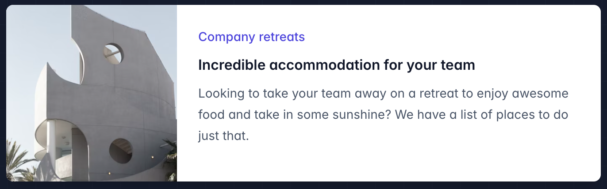

# Responsive Design

반응형 유틸리티 변형을 사용하여 적응형 사용자 인터페이스를 구축합니다.

## 개요

Tailwind의 모든 유틸리티 클래스는 서로 다른 브레이크포인트에서 조건부로 적용할 수 있어, HTML을 벗어나지 않고 복잡한 반응형 인터페이스를 쉽게 만들 수 있습니다.

먼저, 문서의 `<head>`에 [뷰포트 메타 태그](https://developer.mozilla.org/en-US/docs/Web/HTML/Viewport_meta_tag)를 추가했는지 확인하세요:

```html
<meta name="viewport" content="width=device-width, initial-scale=1.0">
```

그런 다음, 유틸리티를 추가하고 특정 브레이크포인트에서만 작동하도록 하려면 유틸리티 앞에 브레이크포인트 이름을 접두사로 추가하고 `:` 문자를 사용하면 됩니다:

```html
<!-- 기본적으로 16, 중간 화면에서는 32, 큰 화면에서는 48 -->

```

기본적으로 5개의 브레이크포인트가 있으며, 이는 일반적인 장치 해상도에서 영감을 받았습니다:

| 브레이크포인트 접두사 | 최소 너비 | CSS |
| --- | --- | --- |
| `sm` | 640px | `@media (min-width: 640px) { ... }` |
| `md` | 768px | `@media (min-width: 768px) { ... }` |
| `lg` | 1024px | `@media (min-width: 1024px) { ... }` |
| `xl` | 1280px | `@media (min-width: 1280px) { ... }` |
| `2xl` | 1536px | `@media (min-width: 1536px) { ... }` |

이는 **프레임워크의 모든 유틸리티 클래스에 적용되므로**, 주어진 브레이크포인트에서 문자 간격이나 커서 스타일 같은 것들도 변경할 수 있습니다.

다음은 작은 화면에서는 스택형 레이아웃을 사용하고, 큰 화면에서는 나란히 배치된 레이아웃을 사용하는 마케팅 페이지 구성 요소의 간단한 예입니다:



```html
<div class="max-w-md mx-auto bg-white rounded-xl shadow-md overflow-hidden md:max-w-2xl">
  <div class="md:flex">
    <div class="md:shrink-0">
      
    </div>
    <div class="p-8">
      <div class="uppercase tracking-wide text-sm text-indigo-500 font-semibold">Company retreats</div>
      <a href="#" class="block mt-1 text-lg leading-tight font-medium text-black hover:underline">Incredible accommodation for your team</a>
      <p class="mt-2 text-slate-500">Looking to take your team away on a retreat to enjoy awesome food and take in some sunshine? We have a list of places to do just that.</p>
    </div>
  </div>
</div>
```

위의 예시에서 어떻게 작동하는지 설명하겠습니다:

- 기본적으로 외부 `div`는 `display: block`입니다. 그러나 `md:flex` 유틸리티를 추가하면 중간 화면 이상에서는 `display: flex`로 변경됩니다.
- 부모가 플렉스 컨테이너일 때 이미지는 절대적으로 축소되지 않도록 해야 하므로, `md:shrink-0`을 추가하여 중간 화면 이상에서 축소를 방지합니다. 사실 `shrink-0`을 사용해도 작은 화면에서는 아무런 효과가 없지만, `md` 화면에서만 중요하므로 클래스 이름에 그것을 명확하게 표시하는 것이 좋습니다.
- 작은 화면에서는 이미지는 기본적으로 전체 너비입니다. 중간 화면 이상에서는 너비를 고정 크기로 제한하고 `md:h-full md:w-48`을 사용하여 이미지가 전체 높이를 유지하도록 했습니다.

이 예시에서는 하나의 브레이크포인트만 사용했지만, `sm`, `lg`, `xl`, 또는 `2xl` 반응형 접두사를 사용하여 다른 크기에서 이 구성 요소를 쉽게 커스터마이즈할 수 있습니다.

## 모바일 우선 작업

기본적으로 Tailwind는 모바일 우선 브레이크포인트 시스템을 사용하며, 이는 Bootstrap과 같은 다른 프레임워크에서 익숙할 수 있는 방식입니다.

이것은 접두사가 없는 유틸리티(예: `uppercase`)가 모든 화면 크기에서 적용되는 반면, 접두사가 있는 유틸리티(예: `md:uppercase`)는 지정된 브레이크포인트 *이상*에서만 적용된다는 의미입니다.

### 모바일 화면 타겟팅

이 접근 방식에서 가장 놀랄 수 있는 점은 모바일에 스타일을 적용하려면 `sm:` 접두사 버전을 사용하지 않고 접두사 없는 유틸리티를 사용해야 한다는 점입니다. `sm:`을 "작은 화면"을 의미한다고 생각하지 말고 "작은 *브레이크포인트*"라고 생각하세요.

#### `sm:`을 사용하여 모바일 장치를 타겟팅하지 마세요

```html
<!-- 이것은 640px 이상 화면에서만 텍스트를 중앙에 배치합니다. 작은 화면에서는 적용되지 않습니다 -->
<div class="sm:text-center"></div>
```

#### 모바일을 타겟팅하려면 접두사 없는 유틸리티를 사용하고, 큰 브레이크포인트에서 이를 덮어씁니다

```html
<!-- 모바일에서는 텍스트를 중앙 정렬하고, 640px 이상에서는 왼쪽 정렬 -->
<div class="text-center sm:text-left"></div>
```

따라서 디자인에서 모바일 레이아웃을 먼저 구현한 후, `sm` 화면에서 적합한 변경 사항을 추가하고, 그다음 `md` 화면과 같은 더 큰 화면을 적용하는 것이 좋습니다.

### 브레이크포인트 범위 타겟팅

기본적으로 `md:flex`와 같은 규칙으로 적용된 스타일은 해당 브레이크포인트에서 적용되고 더 큰 브레이크포인트에서도 유지됩니다.

특정 브레이크포인트 범위에서만 유틸리티를 적용하려면 `md`와 같은 반응형 수정자와 `max-*` 수정자를 조합하여 스타일을 특정 범위에만 제한할 수 있습니다:

```html
<div class="md:max-xl:flex">
  <!-- ... -->
</div>
```

Tailwind는 각 브레이크포인트에 대해 해당하는 `max-*` 수정자를 자동으로 생성하므로, 기본적으로 다음과 같은 수정자가 제공됩니다:

| Modifier | Media query |
| --- | --- |
| `max-sm` | `@media not all and (min-width: 640px) { ... }` |
| `max-md` | `@media not all and (min-width: 768px) { ... }` |
| `max-lg` | `@media not all and (min-width: 1024px) { ... }` |
| `max-xl` | `@media not all and (min-width: 1280px) { ... }` |
| `max-2xl` | `@media not all and (min-width: 1536px) { ... }` |

### 단일 브레이크포인트 타겟팅

단일 브레이크포인트를 타겟팅하려면, `md`와 같은 반응형 수정자와 다음 브레이크포인트에 대한 `max-*` 수정자를 조합하여 해당 브레이크포인트의 범위를 타겟팅합니다:

```html
<div class="md:max-lg:flex">
  <!-- ... -->
</div>
```

[브레이크포인트 범위 타겟팅](#targeting-a-breakpoint-range)에 대해 자세히 알아보세요.

## 사용자 정의 브레이크포인트 사용

### 테마 커스터마이징

`tailwind.config.js` 파일에서 브레이크포인트를 완전히 커스터마이징할 수 있습니다:

```js
/** @type {import('tailwindcss').Config} */
module.exports = {
  theme: {
    screens: {
      'tablet': '640px',
      // => @media (min-width: 640px) { ... }

      'laptop': '1024px',
      // => @media (min-width: 1024px) { ... }

      'desktop': '1280px',
      // => @media (min-width: 1280px) { ... }
    },
  }
}
```

[브레이크포인트 커스터마이징 문서](/docs/breakpoints)에서 더 자세히 알아보세요.

---

### 임의 값

테마에 포함시키기 어려운 일회성 브레이크포인트가 필요한 경우, `min` 또는 `max` 수정자를 사용하여 임의 값을 생성해 사용자 정의 브레이크포인트를 즉시 적용할 수 있습니다.

```html
<div class="**min-[320px]:text-center** **max-[600px]:bg-sky-300**">
  <!-- ... -->
</div>
```

[임의 값 지원](/docs/adding-custom-styles#using-arbitrary-values) 문서에서 더 알아보세요.
