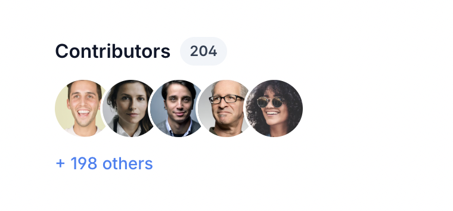
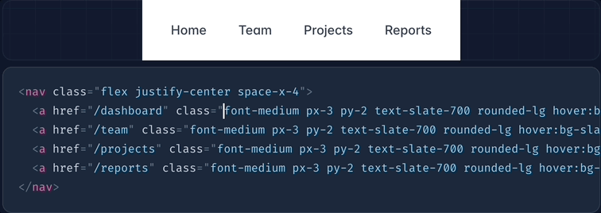

# Reusing Styles (스타일 재사용)

중복을 관리하고 재사용 가능한 추상화를 생성하는 방법.

Tailwind는 [유틸리티 우선](https://tailwindcss.com/docs/utility-first) 워크플로를 권장하며, 이는 디자인을 구현하는 데 낮은 수준의 유틸리티 클래스를 사용하는 방법입니다. 이는 불필요한 추상화를 피하고 그로 인한 문제점을 해결하는 강력한 방법입니다.

하지만 프로젝트가 커짐에 따라, 공통된 유틸리티 조합을 여러 번 반복하여 동일한 디자인을 다른 곳에서 구현하게 됩니다.

예를 들어, 아래 템플릿에서 각 아바타 이미지에 대해 유틸리티 클래스가 5번 반복되고 있습니다:



```html
<div>
  <div class="flex items-center space-x-2 text-base">
    <h4 class="font-semibold text-slate-900">Contributors</h4>
    <span class="rounded-full bg-slate-100 px-2 py-1 text-xs font-semibold text-slate-700">204</span>
  </div>
  <div class="mt-3 flex -space-x-2 overflow-hidden">
    
    
    
    
    
  </div>
  <div class="mt-3 text-sm font-medium">
    <a href="#" class="text-blue-500">+ 198 others</a>
  </div>
</div>
```

걱정하지 마세요! 이 가이드에서는 프로젝트에서 스타일을 재사용하는 다양한 전략과 각 전략을 언제 적용할지에 대한 모범 사례를 배울 수 있습니다.

## 에디터 및 언어 기능 사용

이런 중복은 종종 진짜 문제는 아니며, 대부분은 하나의 위치에 모여 있거나, 실제로는 항목 배열을 반복하면서 마크업을 한 번만 작성하는 경우입니다.

재사용해야 하는 스타일이 단일 파일 내에서만 재사용된다면, 다중 커서 편집 및 루프를 사용하는 것이 중복을 관리하는 가장 간단한 방법입니다.

### 다중 커서 편집

중복이 단일 파일 내의 요소 그룹에 국한되어 있을 때, 이를 처리하는 가장 쉬운 방법은 [다중 커서 편집](https://code.visualstudio.com/docs/editor/codebasics#_multiple-selections-multicursor)을 사용하여 각 요소의 클래스 목록을 동시에 빠르게 선택하고 편집하는 것입니다:

중복된 클래스 목록을 한 번에 빠르게 편집할 수 있다면, 추가적인 추상화를 도입할 필요가 없습니다.



### 루프

어떤 것을 추출하거나 커스텀 클래스를 만들어야 한다고 가정하기 전에, 실제로 템플릿에서 그것을 한 번 이상 사용하고 있는지 확인하세요.

종종 렌더링된 페이지에서 여러 번 나타나는 디자인 요소는 실제로 루프에서 마크업이 렌더링되기 때문에 한 번만 작성됩니다.

예를 들어, 이 가이드의 처음에 나온 아바타들은 실제 프로젝트에서는 거의 확실히 루프에서 렌더링될 것입니다:


```html
<div>
  <div class="flex items-center space-x-2 text-base">
    <h4 class="font-semibold text-slate-900">Contributors</h4>
    <span class="rounded-full bg-slate-100 px-2 py-1 text-xs font-semibold text-slate-700">204</span>
  </div>
  <div class="mt-3 flex -space-x-2 overflow-hidden">
    **{#each contributors as user}**
      ****
    **{/each}**
  </div>
  <div class="mt-3 text-sm font-medium">
    <a href="#" class="text-blue-500">+ 198 others</a>
  </div>
</div>
```

내비게이션 예시도 루프나 `map`을 사용하여 다시 작성할 수 있습니다:


```jsx
<nav className="flex sm:justify-center space-x-4">
  {[
    ['Home', '/dashboard'],
    ['Team', '/team'],
    ['Projects', '/projects'],
    ['Reports', '/reports'],
  ].map(([title, url]) => (
    <a href={url} className="rounded-lg px-3 py-2 text-slate-700 font-medium hover:bg-slate-100 hover:text-slate-900">{title}</a>
  ))}
</nav>
```

이처럼 요소가 루프에서 렌더링될 때, 실제 클래스 목록은 한 번만 작성되므로 중복 문제를 해결할 필요가 없습니다.

## 컴포넌트와 및 partials 추출

여러 파일에서 스타일을 재사용해야 하는 경우, 최선의 전략은 React, Svelte, Vue와 같은 프론트엔드 프레임워크를 사용하는 경우에는 컴포넌트를 만들고, Blade, ERB, Twig, Nunjucks와 같은 템플릿 언어를 사용하는 경우에는 부분 템플릿을 만드는 것입니다.


```html {{ filename: 'VacationCard.vue' }}
<template>
  <div>
    
    <div class="mt-2">
      <div>
        <div class="text-xs text-slate-600 uppercase font-bold tracking-wider">{{ eyebrow }}</div>
        <div class="font-bold text-slate-700 leading-snug">
          <a :href="url" class="hover:underline">{{ title }}</a>
        </div>
        <div class="mt-2 text-sm text-slate-600">{{ pricing }}</div>
      </div>
    </div>
  </div>
</template>

<script>
  export default {
    props: ['img', 'imgAlt', 'eyebrow', 'title', 'pricing', 'url']
  }
</script>
```

이제 이 컴포넌트를 원하는 만큼 여러 곳에서 사용할 수 있으며, 스타일에 대한 단일 출처를 가지고 있기 때문에 한 곳에서 쉽게 업데이트할 수 있습니다.

### CSS 추상화와 비교

컴포넌트가 단일 HTML 요소인 경우가 아니라면, 이를 정의하는 데 필요한 정보는 CSS만으로 캡처할 수 없습니다. 복잡한 경우 HTML 구조는 CSS만큼 중요합니다.

#### 복잡한 컴포넌트를 추출할 때 CSS 클래스만 의존하지 마세요


```html
<!-- 커스텀 CSS가 있어도 여전히 이 HTML 구조를 반복해야 합니다 -->
<div class="chat-notification">
  <div class="chat-notification-logo-wrapper">
    
  </div>
  <div class="chat-notification-content">
    <div class="chat-notification-title">ChitChat</div>
    <p class="chat-notification-message">You have a new message!</p>
  </div>
</div>

<style>
  .chat-notification { /* ... */ }
  .chat-notification-logo-wrapper { /* ... */ }
  .chat-notification-logo { /* ... */ }
  .chat-notification-content { /* ... */ }
  .chat-notification-title { /* ... */ }
  .chat-notification-message { /* ... */ }
</style>
```

이처럼 컴포넌트의 각 요소에 대해 클래스를 만들어도, 이 컴포넌트를 사용할 때마다 HTML 구조를 반복해야 합니다. 물론, 폰트 크기를 한 곳에서 업데이트할 수는 있지만, 제목을 링크로 바꿔야 한다면 어떻게 할까요?

컴포넌트와 템플릿 부분 템플릿은 CSS만으로 추상화하는 것보다 훨씬 더 잘 이 문제를 해결합니다. 컴포넌트는 HTML과 스타일을 모두 캡슐화할 수 있기 때문에, 폰트 크기를 업데이트하는 일은 CSS만큼 간단하면서도, 제목을 링크로 바꾸는 작업도 한 곳에서 쉽게 처리할 수 있습니다.

#### 템플릿 부분 템플릿 또는 JavaScript 컴포넌트 생성


```jsx {{ filename: 'Notification.jsx' }}
function Notification({ imageUrl, imageAlt, title, message }) {
  return (
    <div className="p-6 max-w-sm mx-auto bg-white rounded-xl shadow-md flex items-center space-x-4">
      <div className="shrink-0">
        
      </div>
      <div>
        <div className="text-xl font-medium text-black">{title}</div>
        <p className="text-slate-500">{message}</p>
      </div>
    </div>
  )
}
```

이처럼 컴포넌트와 템플릿 부분 템플릿을 생성하면, 스타일에 대한 단일 출처가 있기 때문에 유틸리티 클래스를 사용하는 것 외에는 다른 방법이 필요하지 않습니다.

## `@apply`를 사용한 클래스 추출

ERB나 Twig와 같은 전통적인 템플릿 언어를 사용하는 경우, 버튼과 같은 작은 컴포넌트를 위한 템플릿 부분 템플릿을 만드는 것이 간단한 CSS 클래스인 `btn`을 사용하는 것보다 과한 작업처럼 느껴질 수 있습니다.

복잡한 컴포넌트에는 적절한 템플릿 부분 템플릿을 생성하는 것이 매우 권장되지만, 템플릿 부분이 지나치게 번거롭다고 느껴질 경우, Tailwind의 `@apply` 지시어를 사용하여 반복되는 유틸리티 패턴을 사용자 정의 CSS 클래스로 추출할 수 있습니다.

다음은 `@apply`를 사용하여 기존 유틸리티로 `btn-primary` 클래스를 구성한 예시입니다:


```html {{ example: true }}
<div class="text-center">
  <button type="button" class="py-2 px-5 bg-violet-500 text-white font-semibold rounded-full shadow-md hover:bg-violet-700 focus:outline-none focus:ring focus:ring-violet-400 focus:ring-opacity-75">
    Save changes
  </button>
</div>
```

```html {{ filename: 'HTML' }}
<!-- 사용자 정의 클래스를 추출하기 전 -->
<button class="py-2 px-5 bg-violet-500 text-white font-semibold rounded-full shadow-md hover:bg-violet-700 focus:outline-none focus:ring focus:ring-violet-400 focus:ring-opacity-75">
  Save changes
</button>

<!-- 사용자 정의 클래스를 추출한 후 -->
<button class="**btn-primary**">
  Save changes
</button>
```

<div className="-mb-4"/>

```css {{ filename: 'CSS' }}
@tailwind base;
@tailwind components;
@tailwind utilities;

@layer components {
  .btn-primary {
    @apply py-2 px-5 bg-violet-500 text-white font-semibold rounded-full shadow-md hover:bg-violet-700 focus:outline-none focus:ring focus:ring-violet-400 focus:ring-opacity-75;
  }
}
```

`@apply`와 `@layer`에 대해 더 배우려면 [Functions & Directives](/docs/functions-and-directives#layer) 문서를 참조하세요.

### 조기 추상화를 피하기

무엇을 하든, **"더 깔끔하게 보이게 하려고" <code className="font-semibold text-slate-900">@apply</code>를 사용하지 마세요.** 맞습니다, Tailwind 클래스가 가득한 HTML 템플릿은 좀 지저분해 보일 수 있습니다. 하지만 맞춤형 CSS가 넘쳐나는 프로젝트에서 변경을 하는 것은 그보다 더 나쁩니다.

모든 것에 대해 `@apply`를 사용하기 시작하면, 사실상 다시 CSS를 작성하고 있는 셈입니다. 이는 Tailwind가 제공하는 워크플로우와 유지 관리의 장점을 버리는 것과 같습니다. 예를 들어:

- **항상 클래스 이름을 생각해야 한다** — 이름을 지을 필요가 없는 것에 대해 클래스 이름을 짓는 것은 시간을 낭비하게 하고 에너지를 소모하게 만듭니다.
- **변경을 위해 여러 파일을 오가야 한다** — 모든 것을 함께 배치하는 것보다 더 큰 워크플로우 방해 요소가 될 수 있습니다.
- **스타일 변경이 더 두려워진다** — CSS는 글로벌이기 때문에, 해당 클래스를 수정할 때 다른 부분에 영향을 미치지 않을지 확신할 수 있나요?
- **CSS 번들이 더 커진다** — 으악.

`@apply`를 사용하려면, 버튼이나 폼 컨트롤처럼 매우 작고 재사용 가능한 것들에만 사용하세요. 그럴 때조차 React와 같은 프레임워크를 사용 중이라면, 컴포넌트가 더 나은 선택일 수 있습니다.
