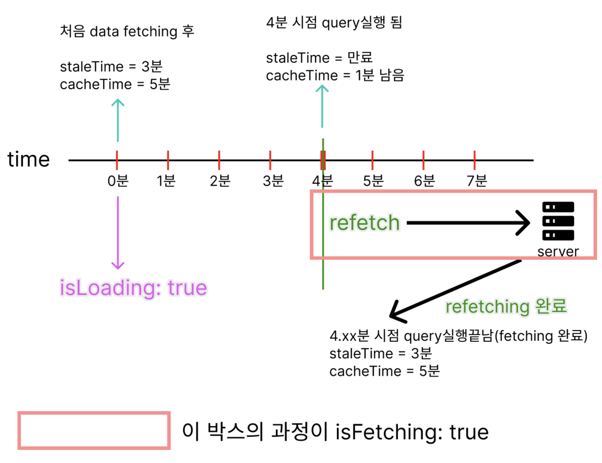

# Tanstack Query

React Query는 클라이언트에서 서버 데이터 캐시를 관리합니다.

## 설치

### Tanstack Query 설치

```bash
npm i @tanstack/react-query
```

### ESLint Plugin Query 설치

```bash
npm i -D @tanstack/eslint-plugin-query
```

```cjs
// .eslintrc.cjs
  extends: [
    // 추가
    "plugin:@tanstack/eslint-plugin-query/recommended",
  ]
```

### Tanstack Query Devtools 설치

```bash
npm i @tanstack/react-query-devtools
```

## QueryClient

### QueryClientProvider

`QueryClientProvider`는 TanStack Query에서 전역적으로 `QueryClient`를 제공하기 위한 컴포넌트입니다.\
프로젝트 범위를 `QueryClientProvider`로 랩핑하고, 사용할 `queryClient` 인스턴스를 연결합니다.

`QueryClient`는 비동기 데이터 상태 관리를 처리하는 데 필요한 모든 정보를 담고 있는 핵심 객체입니다.

```tsx
import { QueryClient, QueryClientProvider } from "@tanstack/react-query";
import { ReactQueryDevtools } from "@tanstack/react-query-devtools";

// 쿼리를 관리하고 서버 데이터도 저장하는 쿼리 클라이언트 생성
const queryClient = new QueryClient(
  // tanstack-query 전역 설정 옵션(선택사항)
  {
    defaultOptions: {
      queries: {
        staleTime: Infinity,
        gcTime: Infinity,
        refetchOnWindowFocus: false,
      },
    },
  }
  // 모든 쿼리의 데이터, 메타 정보 및 상태를 저장하는 역할
  queryCache: new QueryCache({
    // 쿼리가 오류를 만나면 호출되는 함수
    onError: (error) => {
      console.error(error)
    },
  }),

  mutationCache: new MutationCache({
    // mutation이 오류를 만나면 호출되는 함수
    onError: (error) => {
      console.error(error)
    },
  }),
);

function App() {
  return (
    // 자식 컴포넌트에 캐시 및 클라이언트 구성을 제공할 QueryClient에 접근 가능하도록 공급
    <QueryClientProvider client={queryClient}>
      <Todos />
      <ReactQueryDevtools />
    </QueryClientProvider>
  );
}
```

### useQueryClient

현재 사용 중인 `QueryClient` 인스턴스를 가져오는 Tanstack Query의 훅입니다.

```tsx
import { useQueryClient } from "@tanstack/react-query";

const Todos = () => {
  const queryClient = useQueryClient(); // 현재 QueryClient 가져오기

  return <div>QueryClient 사용 가능</div>;
};
```

## 데이터를 미리 불러오는 옵션

|       API       |  method to  | data from | 캐시 저장 유무 |
| :-------------: | :---------: | :-------: | :------------: |
|  prefetchQuery  | queryClient |  server   |      yes       |
|  setQueryData   | queryClient |  client   |      yes       |
| placeholderData |  useQuery   |  client   |       no       |
|   initialData   |  useQuery   |  client   |      yes       |

## prefetchQuery

데이터를 캐시에 추가합니다.\
추가된 데이터는 기본적으로 `stale`로 간주됩니다.\
그래서 이후 데이터를 사용해야 할 때, 그 데이터는 여전히 `stale` 상태라서 다시 데이터를 가져와야 합니다.\
하지만 데이터를 다시 가져오는 동안, 캐시가 만료되지 않으면 새로고침 될 때까지 캐시에 있는 데이터 제공하게 됩니다.

```tsx
import { useQueryClient } from "@tanstack/react-query";

const queryClient = useQueryClient();

await queryClient.prefetchQuery({ queryKey, queryFn });
```

프리페치는 일회성 작업입니다.\
따라서 `refetchOnMount`, `refetchOnWindowFocus`, `refetchOnReconnect` 같은 리페칭 옵션은 프리페치에 적용되지 않습니다.

### setQueryData

캐시에 있는 데이터를 즉시 변경하는 함수입니다.\
API 요청 없이도 데이터의 상태를 직접 수정할 수 있습니다.\
`setQueryData`는 캐시만 변경할 뿐, 실제 서버 데이터는 변경되지 않습니다.\
낙관적 업데이트를 사용할 때 유용합니다.

```tsx
import { useQueryClient } from "@tanstack/react-query";

const queryClient = useQueryClient();

queryClient.setQueryData(queryKey, (oldData) => newData);
```

#### setQueryData 주의

기존 데이터를 직접 수정하면 안됩니다.

```tsx
// 잘못된 코드
queryClient.setQueryData(["todos"], (oldData) => {
  // 기존 배열을 수정하면 안 됨
  oldData.push({ id: 3, title: "새로운 할 일" });
  return oldData;
});
```

```tsx
// 올바른 코드
queryClient.setQueryData(["todos"], (oldData) => {
  // 새로운 배열을 반환
  return [...oldData, { id: 3, title: "새로운 할 일" }];
});
```

## isFetching 과 isLoading

|     속성     |                설명                |                              활성화 조건                               |                          주요 사용 사례                          |
| :----------: | :--------------------------------: | :--------------------------------------------------------------------: | :--------------------------------------------------------------: |
| `isLoading`  |  쿼리의 "초기 로딩 상태"를 나타냄  |                   데이터가 캐시에 없고, 처음 요청 시                   | 초기 상태에서 로딩 스피너를 표시하거나, 첫 화면을 처리할 때 사용 |
| `isFetching` | 네트워크 요청이 진행 중임을 나타냄 | 데이터 요청 중이라면 항상 활성화 (`refetch`, `staleTime` 만료 등 포함) |         새 데이터를 가져오는 모든 상태를 처리할 때 사용          |

`isFetching`은 비동기 쿼리가 아직 해결되지 않았다는 것(네트워크 요청 중)을 말합니다.\
캐시 데이터 유무와 관계없이 초기 요청, 리패치(`refetch`), 백그라운드 요청 등 모든 네트워크 요청 상태를 나타냅니다.\
쿼리가 새로고침되거나, `staleTime이` 지나 데이터를 다시 가져오는 경우에도 `isFetching: true`가 됩니다.\
데이터가 이미 화면에 표시되고 있어도 새 데이터를 가져오는 동안 로딩 스피너를 표시하고 싶을 때 유용합니다.

`isLoading`은 `isFetching`의 하위 집합으로, 첫 로딩 상태라는 것을 말합니다.\
따라서 `isLoading`이 `true`라면 `isFetching`도 `true`일 수 밖에 없습니다.\
`queryFn`가 아직 미해결이며, 캐시된 데이터도 없습니다.\
쿼리를 전에 실행한 적이 없어서 데이터를 가져오는 중이고 캐시된 데이터도 없어서 보여줄 수 없습니다.\
캐시에 데이터가 있으면 `isLoading`은 `false`가 됩니다.\
첫 로딩 상태를 구분하고 싶을 때, 즉 데이터를 처음 요청할 때만 로딩 스피너를 표시하거나 초기 화면 상태를 처리하고 싶을 때 유용합니다.

### isFetching vs. isLoading



`isFetching`은 데이터를 아직 가져오고 있는 상태로 비동기 쿼리 함수가 아직 해결되지 않았을 때 `true`입니다.\
즉, `staleTime`이 만료되고 `gcTime`은 유효할 때입니다.

`isLoading`은 `isFetching`이 `true`면서 해당 쿼리에 대한 캐시된 데이터가 없는 상태입니다.\
즉, `cache`가 비워진 상태에서 데이터를 `fetching`할 때이며 `isPending`과 `isFetching`이 모두 `true`일 때 설정됩니다.\
(`isLoading = isPending && isFetching`)
