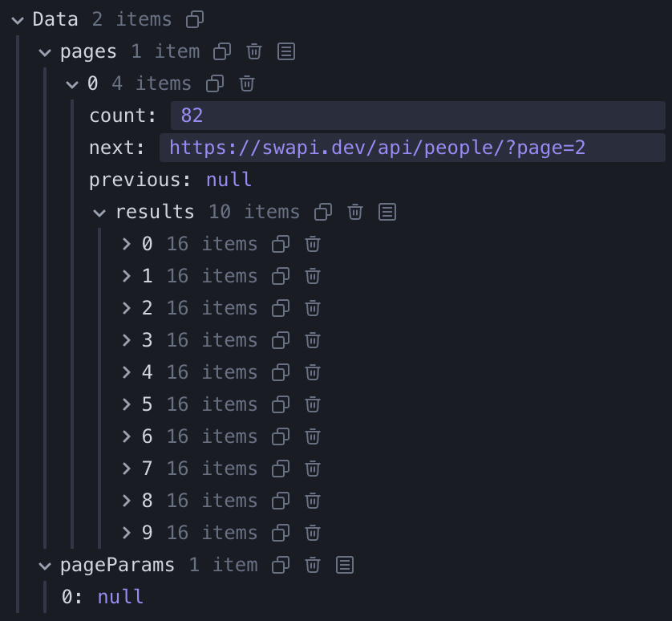

# Infinite Queries

## useInfiniteQuery

무한 스크롤 기능을 구현하기 위한 훅입니다.\
`useQuery`와는 달리, 다음 페이지 데이터를 가져오는 함수를 제공하여 데이터를 페이지 단위로 가져옵니다.\
사용자가 스크롤을 내리거나 버튼을 클릭하는 등 특정 조건에서 추가 데이터를 요청할 수 있게 해줍니다.

```tsx
const {
  fetchNextPage,
  fetchPreviousPage,
  hasNextPage,
  hasPreviousPage,
  isFetchingNextPage,
  isFetchingPreviousPage,
  promise,
  ...result
} = useInfiniteQuery({
  queryKey,
  queryFn: ({ pageParam }) => fetchPage(pageParam),
  initialPageParam: 1,
  ...options,
  getNextPageParam: (lastPage, allPages, lastPageParam, allPageParams) =>
    lastPage.nextCursor,
  getPreviousPageParam: (firstPage, allPages, firstPageParam, allPageParams) =>
    firstPage.prevCursor,
});
```

### useInfiniteQuery 흐름

1. 컴포넌트 마운트

   `data`는 `undefined`이며, `useInfiniteQuery`가 `queryFn`을 실행하기 시작

   ```tsx
    const { data } = useInfiniteQuery(...)
   ```

2. 첫 번째 요청 (`queryFn` 실행)

   `queryFn` 실행 시 `pageParam`이 없으면 기본값인 `initialUrl`이 사용

   ```tsx
   const { data } = useInfiniteQuery({
     queryFn: ({ pageParam = defaultUrl }) => ...
   });
   ```

3. 첫 번째 요청 완료 후 `getNextPageParam` 실행

   `data.pages[0]`가 `lastPage`가 됨\
   `getNextPageParam`에서 `lastPage.next`가 `undefined`가 아니면 `hasNextPage: true`로 설정\
   `lastPage.next` 값이 있다면, `pageParam`을 사용하여 `fetchNextPage` 호출 시 다음 페이지 요청

   ```tsx
   const { data } = useInfiniteQuery({
     queryFn: ({ pageParam = defaultUrl }) => ...,
     getNextPageParam: (lastPage, allPages) => ...
   });

    // data.pages API 응답 예시
    // 0: {
    //    "count": 82,
    //    "next": "https://swapi.py4e.com/api/people/?page=2",
    //    "previous": null,
    //    "results": [ ... ]
    // }

    // 결과
    // pageParam: "https://swapi.py4e.com/api/people/?page=2"
    // hasNextPage: true
   ```

4. 추가 데이터 요청 (`fetchNextPage` 호출)

   `fetchNextPage` 호출하면 `pageParam`을 기반으로 두 번째 API 요청을 실행\
   요청이 완료되면 `data.pages[1]`이 추가됨\
   다시 `getNextPageParam`이 실행

   ```tsx
   const { data, fetchNextPage } = useInfiniteQuery({
     queryFn: ({ pageParam = defaultUrl }) => ...,
     getNextPageParam: (lastPage, allPages) => ...
   });

   if (hasNextPage && !isFetchingNextPage) {
     fetchNextPage();
   }
   ```

5. 두 번째 요청 완료 후 `getNextPageParam` 실행

   데이터 요청이 완료되면 `data.pages[1]`에 새로운 데이터가 추가되고, 3번으로 돌아가 반복

   ```tsx
   const { data, fetchNextPage, hasNextPage, isFetchingNextPage } = useInfiniteQuery({
     queryFn: ({ pageParam = defaultUrl }) => ...,
     getNextPageParam: (lastPage, allPages) => ...
   });
    // data.pages API 응답 예시
    // 0: {
    //  "count": 82,
    //  "next": "https://swapi.py4e.com/api/people/?page=3",
    //  "previous": "https://swapi.py4e.com/api/people/?page=1",
    //  "results": [ ... ]
    // }

    // 결과
    // pageParam: "https://swapi.py4e.com/api/people/?page=3"
    // hasNextPage: true
   ```

6. 마지막 페이지 도달 (`hasNextPage`가 `false`로 변경)

   `fetchNextPage`가 호출될 때 `getNextPageParam`이 실행되지만 `lastPage.next === null`이라면 `undefined` 반환\
   `hasNextPage: false`로 설정되며, 더 이상 `fetchNextPage`가 호출되지 않음.

   ```tsx
   const { data, hasNextPage } = useInfiniteQuery({
     queryFn: ({ pageParam = defaultUrl }) => ...,
     getNextPageParam: (lastPage, allPages) => ...,
   });
    // data.pages API 응답 예시
    // 0: {
    //  "count": 82,
    //  "next": null,
    //  "previous": "https://swapi.py4e.com/api/people/?page=8",
    //  "results": [ ... ]
    // }

    // 결과
    // pageParam: undefined
    // hasNextPage: true
   ```

### pageParam

`useInfiniteQuery`에서 페이지네이션 API 요청을 제어하는 매개변수입니다.\
TanStack Query가 상태를 자동으로 관리하며 `getNextPageParam`을 통해 다음 페이지 요청에 필요한 값을 결정합니다.\

```tsx
useInfiniteQuery({
  queryFn: ({ pageParam }) => fetchPage(pageParam),
});
```

### getNextPageParam

`queryFn`의 `pageParam`을 업데이트하기 위해 다음 페이지를 가져오기 위한 조건을 정의하는 함수입니다.\
새로운 페이지를 요청할지 말지를 결정하는 데 사용됩니다.

```tsx
useInfiniteQuery({
  queryFn: ({ pageParam }) => fetchPage(pageParam),
  getNextPageParam: (lastPage) => {
    return lastPage.next || undefined;
  },
});
```

### fetchNextPage

사용자가 더 많은 데이터를 필요할 때마다 호출하고 싶은 함수입니다.\
무한 스크롤이나 "더 보기" 버튼을 구현할 때 사용되며, 현재 쿼리에 대한 다음 페이지의 데이터를 요청합니다.

`fetchNextPage()`는 내부적으로 `getNextPageParam` 함수에서 반환된 값을 기반으로 다음 페이지를 요청합니다.\
`getNextPageParam`의 반환값이 `undefined`이면, 더 이상 가져올 데이터가 없다고 간주하여 요청이 중단됩니다.\
요청이 성공하면, 기존 데이터에 새로운 페이지 데이터를 병합합니다.

```tsx
const { fetchNextPage, hasNextPage, isFetchingNextPage } =
  useInfiniteQuery({
    queryKey: ["posts"],
    queryFn: fetchPosts,
    getNextPageParam: (lastPage) => lastPage.nextPage ?? undefined, // 다음 페이지 파라미터 설정
  });

return (
    <button
      onClick={() => fetchNextPage()}
      disabled={!hasNextPage || isFetchingNextPage}
    >
      다음 페이지
    </button>
  </div>
);
```

### hasNextPage

`hasNextPage`는 `getNextPageParam`의 반환값에 의해 결정됩니다.\
`getNextPageParam`가 `undefined`을 반환하면, `hasNextPage`는 `false`로 설정됩니다.\
`getNextPageParam`가 유효한 값을 반환하면, `hasNextPage`는 `true`로 설정됩니다.

### isFetchingNextPage

`useInfiniteQuery`를 사용할 때 다음 페이지를 가져오는 네트워크 요청이 진행 중인지 여부를 나타냅니다.\
다음 페이지 데이터를 가져오는 요청(`fetchNextPage`)이 진행 중인지 확인하는 데 사용됩니다.

### migration에 나온 isLoading의 이전 이름 isInitialLoading

`isInitialLoading`은 이제 더 이상 사용되지 않으며, `isLoading`으로 대체됩니다.

## 사용 예시 2

```json
// api 예시
{
  "count": 82,
  "next": "https://swapi.dev/api/people/?page=2",
  "previous": null,
  "results": [ ... ]
}
```

```jsx
import { useInfiniteQuery } from "@tanstack/react-query";
import InfiniteScroll from "react-infinite-scroller";

import { Person } from "./Person";

const initialUrl = "https://swapi.dev/api/people/";
const fetchUrl = async (url) => {
  const response = await fetch(url);
  return response.json();
};

export function InfinitePeople() {
  const {
    data,
    fetchNextPage,
    hasNextPage,
    isFetching,
    isLoading,
    isError,
    error,
  } = useInfiniteQuery({
    queryKey: ["sw-people"],
    queryFn: ({ pageParam = initialUrl }) => fetchUrl(pageParam),
    getNextPageParam: (lastPage) => {
      return lastPage.next || undefined;
    },
  });

  // 쿼리가 처음 시작되고 데이터를 아직 한 번도 로드하지 않았을 때
  if (isLoading) {
    return <div className="loading">Loading...</div>;
  }

  if (isError) {
    return <div>Error {error.toString()}</div>;
  }

  return (
    <>
      {/* 데이터를 아직 한 번도 로드하지 않았을 때와 추가적인 데이터 로딩 중일 때 모두 */}
      {isFetching && <div className="loading">Fetching...</div>}
      <InfiniteScroll
        // 컴포넌트가 첫 번째 항목 세트를 로드(페이지 로드시)해야 하는지 여부
        // (첫 번째 로드는 reactQuery의 queryFn가 initialUrl로 마운트될 때 이미 함)
        initialLoad={false}
        // 더 많은 항목을 요청할 때 호출되는 콜백 함수
        loadMore={() => {
          if (!isFetching) {
            fetchNextPage();
          }
        }}
        // 로드할 항목이 더 있는지 여부
        // false일 경우 이벤트 리스너가 제거
        hasMore={hasNextPage}
      >
        {/* 로드할 컨텐츠 */}
        {data.pages.map((pageData) => {
          return pageData.results.map((person) => {
            return (
              <Person
                key={person.name}
                name={person.name}
                hairColor={person.hair_color}
                eyeColor={person.eyeColor}
              />
            );
          });
        })}
      </InfiniteScroll>
    </>
  );
}
```

처음 가져온 data



스크롤 이후 가져온 data


마지막 스크롤 이후 가져온 data


## 자료

- [TanStack Query v5](https://tanstack.com/query/latest)
- [React Query / TanStack Query : React로 서버 상태 관리하기](https://www.udemy.com/course/react-query-react/?couponCode=BFCPSALE24&utm_source=adwords&utm_medium=udemyads&utm_campaign=Webindex_Catchall_la.KR_cc.KR&campaigntype=Search&portfolio=SouthKorea&language=KR&product=Course&test=&audience=DSA&topic=&priority=&utm_content=deal4584&utm_term=_._ag_154831691911_._ad_667917181863_._kw__._de_c_._dm__._pl__._ti_dsa-1456167871416_._li_9211460_._pd__._&matchtype=&gad_source=1&gclid=CjwKCAiAjKu6BhAMEiwAx4UsAtEeV5vH-JflZbvwTHBc43TAyLJbxP0YIKR7ww3-7ux0GKGKi929kRoCbvMQAvD_BwE)
- [TanStack Query(React Query) 핵심 정리](https://www.heropy.dev/p/HZaKIE)
- [react-query-[useQuery & isLoading VS isFetching]](https://velog.io/@rlwjd31/react-query-useQuery-isLoading-VS-isFetching)
