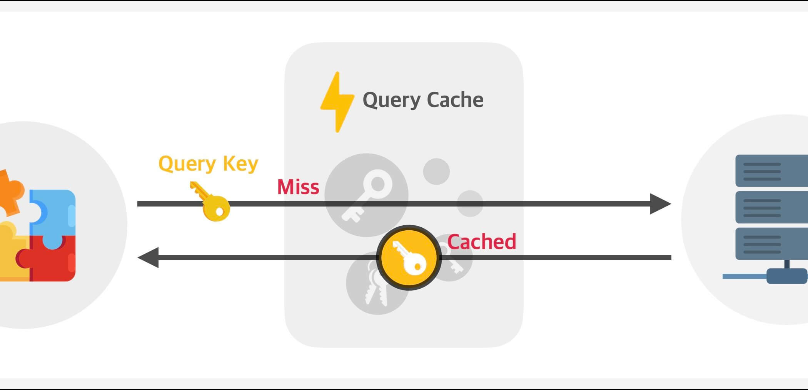
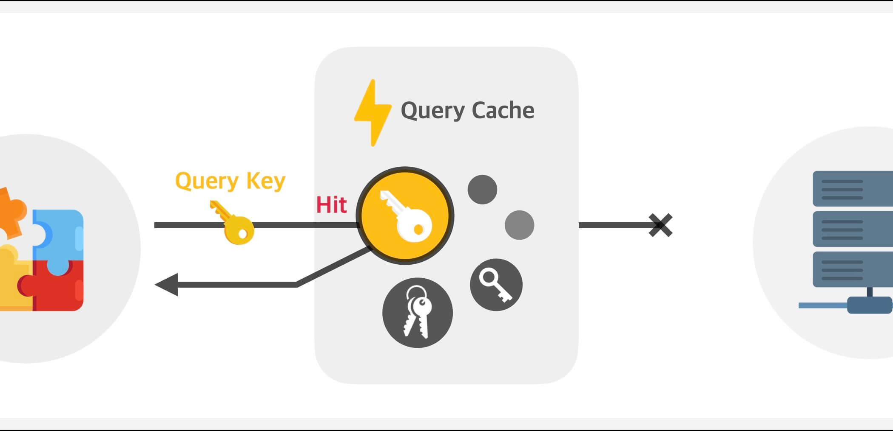
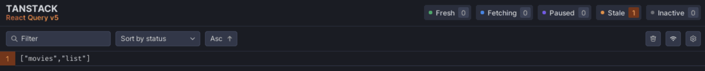
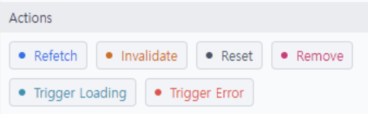

# Queries

## useQuery

데이터를 가져오고 관리하기 위해 사용하는 훅입니다.\
서버에서 데이터를 가져오거나 캐싱, 로딩 상태, 에러 처리를 자동으로 관리해줍니다.

```tsx
import { useQuery } from "@tanstack/react-query";

const query = useQuery({
  queryKey: ["todos"],
  queryFn: getTodos,
  staleTime: 1000 * 2,
});
```

### queryKey

데이터를 식별하기 위한 고유한 키입니다.\
다른 키를 가진 쿼리는 캐시를 구분하고 같은 키를 가진 쿼리는 동일한 데이터를 공유합니다.\


캐시된 데이터(Query Cache)에 queryKey와 일치하는 데이터가 없다면 서버에서 데이터를 가져옵니다.


캐시된 데이터(Query Cache)에 queryKey와 일치하는 데이터가 있다면 캐시에서 일치한 데이터를 가져옵니다.

```tsx
// 캐시 관리 상상버전

QueryCache = [
  {
    queryKey: ["todos", 1],
    data: { id: 1, title: "Todo 1" },
    state: {
      isFetching: false,
      isStale: false,
      updatedAt: 1672301231231,
    },
  },
  {
    queryKey: ["todos", 2],
    data: { id: 2, title: "Todo 2" },
    state: {
      isFetching: true,
      isStale: true,
      updatedAt: 1672301234567,
    },
  },
];

if (QueryCache[queryKey01]) {
  return QueryCache[queryKey01];
}
```

`queryKey`를 배열로 사용하는 이유는 데이터 식별을 더 세밀하게 관리하고, 효율적으로 캐싱하기 위해서입니다.\
동적 데이터를 쿼리 식별자에 포함시켜, 같은 API라도 다른 결과를 캐싱하거나 관리할 수도 있습니다.

```tsx
// 동적 파라미터 관리

const maxPostPage = 10;

const [currentPage, setCurrentPage] = useState(1);

const { data, isError, error, isLoading } = useQuery({
  queryKey: ["posts", currentPage],
  queryFn: () => fetchPosts(currentPage),
});

return (
  <>
    {/* 이전 페이지 버튼 */}
    <button
      disabled={currentPage <= 1}
      onClick={() => {
        setCurrentPage((prevValue) => prevValue - 1);
      }}
    >
      이전 페이지
    </button>

    {/* 다음 페이지 버튼 */}
    <button
      disabled={currentPage >= maxPostPage}
      onClick={() => {
        setCurrentPage((prevValue) => prevValue + 1);
      }}
    >
      다음 페이지
    </button>
  </>
);
```

### queryFn

데이터를 가져오는 비동기 함수입니다.\
이 함수를 통해 데이터를 가져오고, 성공/실패 상태를 관리합니다.

```tsx
const { isPending, error, data } = useQuery({
  queryKey: ["repoData"],
  queryFn: () =>
    fetch("https://api.github.com/repos/TanStack/query").then((res) =>
      res.json()
    ),
});
```

### isError

`queryFn`를 통해 fetch posts에서 에러가 발생했다면 데이터도 없을 거

### staleTime

데이터가 유효하다고 간주되는 기간을 설정하는 옵션입니다.\
데이터를 새로 가져오는 기준으로 설정한 시간 동안은 데이터를 캐시에서 바로 사용하며, 네트워크 요청을 생략합니다.\
기본값은 `0`이며 `ms`단위입니다.

```tsx
useQuery(["todos"], fetchTodos, { staleTime: 1000 * 10 }); // 10초
```

### gcTime

캐시 메모리 사용량 관리를 위해 사용하는 옵션입니다.\
특정 queryKey를 사용하는 컴포넌트가 언마운트되거나 더 이상 사용되지 않을 때를 기준으로 설정한 시간 이후 해당 데이터는 캐시에 삭제됩니다.\
기본값은 `5분`입니다.

```tsx
useQuery(["todos"], fetchTodos, { cacheTime: 1000 * 30 }); // 30초
```

`staleTime`은 데이터를 다시 가져와야 할 때를 알려주고, `gcTime`은 데이터를 캐시에 유지할 시간을 결정합니다.\
일반적으로 `gcTime`은 `staleTime`보다 길어야 합니다.

## 데이터의 신선도

TanStack Query는 데이터를 `fresh`, `fetching`, `paused`, `stale`, `inactive` 상태로 구분해 관리합니다.



|    상태    |                     설명                     |              기본값/설정              |
| :--------: | :------------------------------------------: | :-----------------------------------: |
|  `Fresh`   |             데이터가 유효한 상태             | `staleTime`: 0ms (기본값: 즉시 stale) |
| `Fetching` |             데이터를 가져오는 중             |          `isFetching`: true           |
|  `Paused`  |      네트워크 요청이 실패 후 대기 상태       |          `retry`: 3 (기본값)          |
|  `Stale`   | 데이터가 유효하지 않아 새 요청이 필요한 상태 |           `staleTime`: 0ms            |
| `Inactive` |   현재 사용되지 않고 캐시에만 저장된 상태    |        `gcTime`: 5분 (기본값)         |

### Fresh

데이터가 유효하고(유효 기간 안에 있으며) 재요청이 필요하지 않은 상태입니다.\
데이터가 `fresh`할 때 `refetch` 트리거가 발생했다면 데이터는 다시 가져오지 않습니다.\
기본적으로 TanStack Query에서 데이터는 Fresh할 수 없다고 판단하기 때문에 `staleTime`으로 Fresh 기간을 지정해주어야 합니다.\
`staleTime` 지나지 않았으면 데이터를 `fresh` 상태로 간주합니다.\
`staleTime`의 기본값은 0ms이며, 데이터를 가져오자마자 `stale`로 간주합니다.

```tsx
// `staleTime`을 5분으로 설정한 경우, 데이터를 가져온 지 3분이 지났으면 `fresh` 이므로 요청을 피할 수 있음
useQuery(["todos"], fetchTodos, { staleTime: 1000 * 60 * 5 });
```

### Fetching

데이터가 서버에서 로딩 중인 상태입니다.\
서버에서 데이터를 가져오는 요청이 진행 중인지 나타내는 `isFetching`이 `true`인 경우입니다.

```tsx
const { isFetching } = useQuery(["todos"], fetchTodos);

if (isFetching) {
  console.log("데이터를 가져오는 중입니다...");
}
```

### Paused

네트워크 문제가 발생했거나, 재시도를 기다리는 상태를 나타냅니다.\
실패한 요청을 자동으로 재시도하며(`retry` 기본값: 3회), 재시도가 중단된 상태를 `paused`로 간주합니다.

```tsx
// 요청이 실패했을 때 0.5초 간격으로 최대 3번 재시도를 시도하며, 이후에는 paused 상태로 전환
useQuery(["todos"], fetchTodos, {
  retry: 3,
  retryDelay: 500,
});
```

### Stale

데이터가 오래되어 유효하지 않은 상태를 나타냅니다.\
`staleTime` 설정에 따라 데이터가 `stale`로 간주됩니다.\
컴포넌트가 마운트되거나, 브라우저 포커스가 다시 맞춰질 때 자동으로 데이터를 다시 가져옵니다.

```tsx
// 데이터를 가져온 지 30초 후에 stale 상태
useQuery(["todos"], fetchTodos, { staleTime: 1000 * 30 });
```

### Inactive

특정 `queryKey`를 사용하는 컴포넌트가 없을 때, 데이터는 `inactive` 상태가 됩니다.(현재 화면에서 데이터를 사용하지 않을 때)\
캐시가 유지되지만, 데이터가 사용되지 않기 때문에 자동 요청이 발생하지 않습니다.\
`inactive` 상태가 된 데이터는 5분(`gcTime` 기본값) 동안 캐시에 남아있으며 이후 삭제됩니다.

```tsx
// 데이터가 Inactive된 상태에서 10초 후 캐시에서 제거
useQuery(["todos"], fetchTodos, { gcTime: 1000 * 10 });
```

## Actions

쿼리의 상태를 제어하거나 변경하기 위해 사용하는 메서드입니다.



|    Action    |               설명               |               활용 사례               | 캐시 데이터 삭제 여부 |
| :----------: | :------------------------------: | :-----------------------------------: | :-------------------: |
|  `Refetch`   |    데이터를 강제로 다시 요청     | 새로 고침 버튼, 즉시 최신 데이터 요청 |         유지          |
| `Invalidate` |      데이터를 stale로 전환       |  POST/PUT/DELETE 이후 데이터 무효화   |         유지          |
|   `Reset`    | 상태를 초기화 (로딩 상태로 전환) |   초기 상태로 되돌릴 필요가 있을 때   |         유지          |
|   `Remove`   |   캐시에서 데이터 완전히 삭제    |    로그아웃, 불필요한 데이터 삭제     |         삭제          |

### Refetch

쿼리를 강제로 다시 요청하여 데이터를 가져옵니다.\
데이터가 `stale` 상태가 아니더라도 당장 강제로 서버에서 데이터를 가져오도록 할 수 있습니다.

```tsx
const { refetch } = useQuery(["todos"], fetchTodos);

// Refetch 호출
refetch();
```

### Invalidate

쿼리를 `stale` 상태로 강제 전환하여, 이후 사용될 때 데이터를 다시 가져오도록 만듭니다.\
데이터 자체를 변경하지 않으며, 단지 유효성 검증 상태를 조작하는 역할만 합니다.\
하지만 `stale` 상태에서 컴포넌트가 마운트되거나, 브라우저 포커스가 다시 맞춰질 때 데이터를 다시 가져오기 때문에 `Refetch`와 비슷하게 동작하는 것처럼 보입니다.

```tsx
queryClient.invalidateQueries(["todos"]);
```

### Reset

쿼리의 상태를 데이터를 가져오기 전 초기 상태로 돌립니다.\
캐시된 데이터를 삭제하지 않고, 상태를 isLoading으로 되돌립니다.

```tsx
queryClient.resetQueries(["todos"]);
```

`initialData`가 설정되어 있다면, `Reset` 호출 시 `initialData`가 반환됩니다.

```tsx
const { data, isLoading, reset } = useQuery(["todos"], fetchTodos, {
  initialData: [{ id: 1, title: "초기 데이터" }],
});

// Reset 호출 전
console.log(data); // [{ id: 1, title: '초기 데이터' }]
console.log(isLoading); // false

// Reset 호출
reset();

console.log(data); // [{ id: 1, title: '초기 데이터' }]
console.log(isLoading); // true (로딩 상태로 전환)
```

`initialData`가 설정되어 있지 않으면 `data`는 `null` 또는 `undefined`로 초기화됩니다.\
이후 데이터를 다시 가져오면 캐시에 저장된 데이터가 반환됩니다.

### Remove

쿼리를 캐시에서 완전히 제거합니다.\
이후 동일한 `queryKey`로 요청하면 처음부터 데이터를 가져옵니다.

```tsx
queryClient.removeQueries(["todos"]);
```

## prefetchQuery

데이터를 캐시에 추가합니다.\
추가된 데이터는 기본적으로 `stale`로 간주됩니다.\
그래서 이후 데이터를 사용해야 할 때, 그 데이터는 여전히 `stale` 상태라서 다시 데이터를 가져와야 합니다.\
하지만 데이터를 다시 가져오는 동안, 캐시가 만료되지 않으면 새로고침 될 때까지 캐시에 있는 데이터 제공하게 됩니다.

```tsx
const queryClient = useQueryClient();

await queryClient.prefetchQuery({ queryKey, queryFn });
```

## useMutation

데이터 변경 작업(생성, 수정, 삭제) 등 변경 작업을 처리하기 위해 사용하는 훅입니다.\
'가져오기'에 집중하는 `useQuery`와 다르게 `useMutation`는 '보내기'에 집중합니다.\

`useMutation`에는 캐시된 것이 없어서 `isLoading`은 있지만 `isFetching`은 없고 `isPending`만 있습니다.\
또한 캐시된 것이 없기 때문에 `queryKey`도 필요하지 않습니다.

### mutationFn

서버와의 실제 변경 작업을 수행하는 함수입니다.

```tsx
function App() {
  const updateMutation = useMutation({
    mutationFn: (newTodo) => {
      return axios.post("/todos", newTodo);
    },
  });

  return (
    <div>
      {/* 갱신 요청중 */}
      {updateMutation.isPending ? (
        "Adding todo..."
      ) : (
        <>
          {/* 갱신 요청중 에러 */}
          {updateMutation.isError ? (
            <div>An error occurred: {updateMutation.error.message}</div>
          ) : null}

          {/* 갱신 요청 성공 */}
          {updateMutation.isSuccess ? <div>Todo added!</div> : null}

          <button
            onClick={() => {
              updateMutation.mutate({ id: new Date(), title: "Do Laundry" });
            }}
          >
            Create Todo
          </button>
        </>
      )}
    </div>
  );
}
```

### `.mutate()`

데이터 변경 작업 실행하여 서버와의 상호작용(예: POST, PUT, DELETE)을 트리거합니다.\
호출 시 `isPending`이 `true`로 변경되고, 작업 완료 시 성공(`isSuccess`) 또는 실패(`isError`) 상태로 전환됩니다.

`useQuery`에 인수로 전달하는 쿼리 함수와는 달리, 인수로 전달하는 `mutationFn`는 `.mutate()`을 통해 실제로 인수를 가질 수 있습니다.

```tsx
import {
  useQuery,
  useMutation,
  useQueryClient,
  QueryClient,
  QueryClientProvider,
} from "@tanstack/react-query";
import { getTodos, postTodo } from "../my-api";

function Todos() {
  // Access the client
  const queryClient = useQueryClient();

  // Queries

  // Mutations
  const mutation = useMutation({
    // postTodo는 .mutate로 받은 { id: Date.now(), title: "Do Laundry" } 객체를 받음
    mutationFn: postTodo,
    onSuccess: () => {
      // Invalidate and refetch
      queryClient.invalidateQueries({ queryKey: ["todos"] });
    },
  });

  return (
    <div>
      <ul>
        {query.data?.map((todo) => (
          <li key={todo.id}>{todo.title}</li>
        ))}
      </ul>

      <button
        onClick={() => {
          mutation.mutate({
            id: Date.now(),
            title: "Do Laundry",
          });
        }}
      >
        Add Todo
      </button>
    </div>
  );
}

render(<App />, document.getElementById("root"));
```

### .reset()

useMutation의 메서드로, 변경 작업 상태를 초기화하는 데 사용됩니다.
위의 예시에서 `reset()`을 사용하지 않는 경우 요청 이후 `"Post was deleted"`라던가 `"Title was updated"` 안내 문구가 다른 Post에서도 보이게 됩니다.\
`reset()`을 사용해 `useMutation`의 작업 상태를 초기화하여 해당 문구가 표시 되지 않게 해줍니다.

## 사용 예시 1

`QueryClientProvider`를 사용하여 `QueryClient`를 제공합니다.

```jsx
// App.jsx

import { QueryClient, QueryClientProvider } from "@tanstack/react-query";
import { ReactQueryDevtools } from "@tanstack/react-query-devtools";

import { Posts } from "./Posts";

import "./App.css";

const queryClient = new QueryClient();

function App() {
  return (
    <QueryClientProvider client={queryClient}>
      <div className="App">
        <Posts />
      </div>
      <ReactQueryDevtools />
    </QueryClientProvider>
  );
}

export default App;
```

페이지네이션을 통해 페이지에 맞는 데이터를 가져옵니다.\
다음 페이지는 `prefetchQuery`를 통해 미리 캐시에 가져옵니다.

```jsx
// Posts.jsx

import { useEffect, useState } from "react";

import { useMutation, useQuery, useQueryClient } from "@tanstack/react-query";

import { fetchPosts, deletePost, updatePost } from "./api";

import { PostDetail } from "./PostDetail";

const maxPostPage = 10;

export function Posts() {
  const [currentPage, setCurrentPage] = useState(1);
  const [selectedPost, setSelectedPost] = useState(null);

  const queryClient = useQueryClient();

  // useQuery는 '가져오기'에 집중
  const { data, isError, error, isLoading } = useQuery({
    queryKey: ["posts", currentPage],
    queryFn: () => fetchPosts(currentPage),
    staleTime: 2000,
  });

  // 데이터 변경 작업(생성, 수정, 삭제 등)을 위한 훅
  // useMutation는 '보내기'에 집중
  const deleteMutation = useMutation({
    mutationFn: (postId) => deletePost(postId),
  });
  const updateMutation = useMutation({
    mutationFn: (postId) => updatePost(postId),
  });

  useEffect(() => {
    if (currentPage < maxPostPage) {
      const nextPage = currentPage + 1;
      // 다음 페이지에 해당하는 데이터를 미리 가져와서 로딩시간 동안 보여줌
      queryClient.prefetchQuery({
        queryKey: ["posts", nextPage],
        queryFn: () => fetchPosts(nextPage),
      });
    }
  }, [currentPage, queryClient]);

  // prefetchQuery를 통해 다음에 보여줄 데이터가 캐싱되어 있기 때문에 isLoading을 사용하여 첫 데이터를 가져올 때만 로딩 표시
  if (isLoading) return <h3>Loading...</h3>;
  if (isError) {
    return (
      <>
        <h3>Something went wrong...</h3>
        <p>{error.toString()}</p>
      </>
    );
  }

  return (
    <>
      <ul>
        {/* Post 목록 */}
        {data.map((post) => (
          <li
            key={post.id}
            className="post-title"
            onClick={() => {
              // updateMutation 또는 deleteMutation을 사용 후 다른 <li>를 클릭했을 때 수정시 사용한 is~ 상태를 초기로 돌림
              // 만약 reset()을 하지 않으면 mutation 사용 후 다른 <li>를 클릭했을 때 Post was deleted 등의 메시지가 사라지지 않음
              deleteMutation.reset();
              updateMutation.reset();
              setSelectedPost(post);
            }}
          >
            {post.title}
          </li>
        ))}
      </ul>

      {/* 페이지 전환 버튼 섹션 */}
      <div className="pages">
        {/* 이전 페이지 버튼 */}
        <button
          disabled={currentPage <= 1}
          onClick={() => {
            setCurrentPage((prevValue) => prevValue - 1);
          }}
        >
          Previous page
        </button>
        {/* 현재 페이지 */}
        <span>Page {currentPage}</span>
        {/* 다음 페이지 버튼 */}
        <button
          disabled={currentPage >= maxPostPage}
          onClick={() => {
            setCurrentPage((prevValue) => prevValue + 1);
          }}
        >
          Next page
        </button>
      </div>

      <hr />

      {/* 선택된 Post의 상세 정보 표시 */}
      {selectedPost && (
        <PostDetail
          post={selectedPost}
          deleteMutation={deleteMutation}
          updateMutation={updateMutation}
        />
      )}
    </>
  );
}
```

```jsx
// PostDetails.jsx

import { useQuery } from "@tanstack/react-query";

import { fetchComments } from "./api";

import "./PostDetail.css";

export function PostDetail({ post, deleteMutation, updateMutation }) {
  const { data, isError, error, isLoading } = useQuery({
    // queryKey에 post.id가 없다면 fetchComments(post.id)의 post.id가 바뀌어도 comment가 바뀌지 않음
    queryKey: ["comments", post.id],
    queryFn: () => fetchComments(post.id),
  });

  if (isLoading) return <h3>Loading...</h3>;
  if (isError) {
    return (
      <>
        <h3>Something went wrong...</h3>
        <p>{error.toString()}</p>
      </>
    );
  }

  return (
    <>
      <h3 style={{ color: "blue" }}>{post.title}</h3>
      {/* 삭제 버튼 */}
      <div>
        {/* Post.jsx의 deleteMutation을 통해 해당 post.id 게시물 삭제 요청 */}
        <button onClick={() => deleteMutation.mutate(post.id)}>Delete</button>
      </div>

      {/* 삭제 요청이 pending 상태일 경우 안내 */}
      {deleteMutation.isPending && <p className="loading">Deleting the post</p>}

      {/* 삭제 요청이 error 일 경우 안내 */}
      {deleteMutation.isError && (
        <p className="error">
          Error deleting the post: {deleteMutation.error.toString()}
        </p>
      )}

      {/* 삭제 요청이 완료되었을 경우 */}
      {deleteMutation.isSuccess && <p className="success">Post was deleted</p>}

      {/* 갱신 버튼 */}
      <div>
        {/* Post.jsx의 updateMutation을 통해 해당 post.id 게시물 갱신 요청 */}
        <button onClick={() => updateMutation.mutate(post.id)}>
          Update title
        </button>
      </div>

      {/* 갱신 요청이 pending 상태일 경우 안내 */}
      {updateMutation.isPending && <p className="loading">Updating the post</p>}

      {/* 갱신 요청이 error 일 경우 안내 */}
      {updateMutation.isError && (
        <p className="error">
          Error updating the post: {updateMutation.error.toString()}
        </p>
      )}

      {/* 갱신 요청이 완료되었을 경우 */}
      {updateMutation.isSuccess && <p className="success">Title was updated</p>}

      {/* 선택된 Post 본문 */}
      <p>{post.body}</p>
      <h4>Comments</h4>

      {/* 선택 된 Post에 달린 댓글 */}
      {data.map((comment) => (
        <li key={comment.id}>
          {comment.email}: {comment.body}
        </li>
      ))}
    </>
  );
}
```

## 자료

- [TanStack Query v5](https://tanstack.com/query/latest)
- [React Query / TanStack Query : React로 서버 상태 관리하기](https://www.udemy.com/course/react-query-react/?couponCode=BFCPSALE24&utm_source=adwords&utm_medium=udemyads&utm_campaign=Webindex_Catchall_la.KR_cc.KR&campaigntype=Search&portfolio=SouthKorea&language=KR&product=Course&test=&audience=DSA&topic=&priority=&utm_content=deal4584&utm_term=_._ag_154831691911_._ad_667917181863_._kw__._de_c_._dm__._pl__._ti_dsa-1456167871416_._li_9211460_._pd__._&matchtype=&gad_source=1&gclid=CjwKCAiAjKu6BhAMEiwAx4UsAtEeV5vH-JflZbvwTHBc43TAyLJbxP0YIKR7ww3-7ux0GKGKi929kRoCbvMQAvD_BwE)
- [TanStack Query(React Query) 핵심 정리](https://www.heropy.dev/p/HZaKIE)
- [react-query-[useQuery & isLoading VS isFetching]](https://velog.io/@rlwjd31/react-query-useQuery-isLoading-VS-isFetching)
