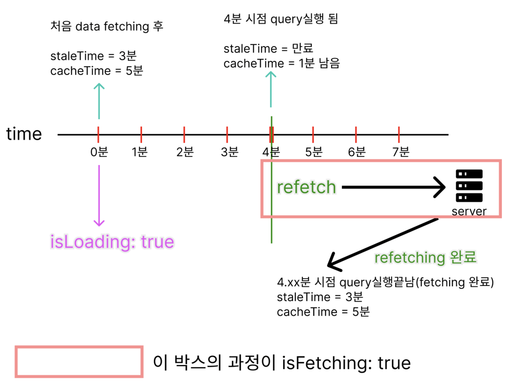

# Queries

## QueryClientProvider

`QueryClientProvider`는 TanStack Query에서 전역적으로 `QueryClient`를 제공하기 위한 컴포넌트입니다.\
프로젝트 범위를 `QueryClientProvider`로 랩핑하고, 사용할 `queryClient` 인스턴스를 연결합니다.

`QueryClient`는 비동기 데이터 상태 관리를 처리하는 데 필요한 모든 정보를 담고 있는 핵심 객체입니다.

```jsx
import { QueryClient, QueryClientProvider } from "@tanstack/react-query";
import { ReactQueryDevtools } from "@tanstack/react-query-devtools";

import { Posts } from "./Posts";

import "./App.css";

const queryClient = new QueryClient();

function App() {
  return (
    <QueryClientProvider client={queryClient}>
      <div className="App">
        <Posts />
      </div>
      <ReactQueryDevtools />
    </QueryClientProvider>
  );
}

export default App;
```

## 사용 예시 1

```jsx
// Post.jsx

import { useEffect, useState } from "react";

import { useMutation, useQuery, useQueryClient } from "@tanstack/react-query";

import { fetchPosts, deletePost, updatePost } from "./api";

import { PostDetail } from "./PostDetail";

const maxPostPage = 10;

export function Posts() {
  const [currentPage, setCurrentPage] = useState(1);
  const [selectedPost, setSelectedPost] = useState(null);

  const queryClient = useQueryClient();

  // useQuery는 '가져오기'에 집중
  const { data, isError, error, isFetching } = useQuery({
    queryKey: ["posts", currentPage],
    queryFn: () => fetchPosts(currentPage),
    staleTime: 2000,
  });

  // 데이터 변경 작업(생성, 수정, 삭제 등)을 위한 훅
  // useMutation는 '보내기'에 집중
  const deleteMutation = useMutation({
    mutationFn: (postId) => deletePost(postId),
  });
  const updateMutation = useMutation({
    mutationFn: (postId) => updatePost(postId),
  });

  useEffect(() => {
    if (currentPage < maxPostPage) {
      const nextPage = currentPage + 1;
      queryClient.prefetchQuery({
        queryKey: ["posts", nextPage],
        queryFn: () => fetchPosts(nextPage),
      });
    }
  }, [currentPage, queryClient]);

  if (isFetching) return <h3>Loading...</h3>;
  if (isError) {
    return (
      <>
        <h3>Something went wrong...</h3>
        <p>{error.toString()}</p>
      </>
    );
  }

  return (
    <>
      <ul>
        {/* Post 목록 */}
        {data.map((post) => (
          <li
            key={post.id}
            className="post-title"
            onClick={() => {
              // 수정 후 다른 li를 클릭했을 때 수정시 사용한 is~ 상태를 reset
              deleteMutation.reset();
              updateMutation.reset();
              setSelectedPost(post);
            }}
          >
            {post.title}
          </li>
        ))}
      </ul>
      {/* 페이지 전환 버튼 섹션 */}
      <div className="pages">
        {/* 이전 페이지 버튼 */}
        <button
          disabled={currentPage <= 1}
          onClick={() => {
            setCurrentPage((prevValue) => prevValue - 1);
          }}
        >
          Previous page
        </button>
        {/* 현재 페이지 */}
        <span>Page {currentPage}</span>
        {/* 다음 페이지 버튼 */}
        <button
          disabled={currentPage >= maxPostPage}
          onClick={() => {
            setCurrentPage((prevValue) => prevValue + 1);
          }}
        >
          Next page
        </button>
      </div>
      <hr />
      {/* 선택된 Post의 상세 정보 표시 */}
      {selectedPost && (
        <PostDetail
          post={selectedPost}
          deleteMutation={deleteMutation}
          updateMutation={updateMutation}
        />
      )}
    </>
  );
}
```

```jsx
// PostDetails.jsx

import { useQuery } from "@tanstack/react-query";

import { fetchComments } from "./api";

import "./PostDetail.css";

export function PostDetail({ post, deleteMutation, updateMutation }) {
  const { data, isError, error, isLoading } = useQuery({
    queryKey: ["comments", post.id],
    queryFn: () => fetchComments(post.id),
  });

  if (isLoading) return <h3>Loading...</h3>;
  if (isError) {
    return (
      <>
        <h3>Something went wrong...</h3>
        <p>{error.toString()}</p>
      </>
    );
  }

  return (
    <>
      <h3 style={{ color: "blue" }}>{post.title}</h3>
      {/* 삭제 버튼 */}
      <div>
        {/* Post.jsx의 deleteMutation을 통해 해당 post.id 게시물 삭제 요청 */}
        <button onClick={() => deleteMutation.mutate(post.id)}>Delete</button>
      </div>
      {/* 삭제 요청이 pending 상태일 경우 안내 */}
      {deleteMutation.isPending && <p className="loading">Deleting the post</p>}
      {/* 삭제 요청이 error 일 경우 안내 */}
      {deleteMutation.isError && (
        <p className="error">
          Error deleting the post: {deleteMutation.error.toString()}
        </p>
      )}
      {/* 삭제 요청이 완료되었을 경우 */}
      {deleteMutation.isSuccess && <p className="success">Post was deleted</p>}
      {/* 갱신 버튼 */}
      <div>
        {/* Post.jsx의 updateMutation을 통해 해당 post.id 게시물 갱신 요청 */}
        <button onClick={() => updateMutation.mutate(post.id)}>
          Update title
        </button>
      </div>
      {/* 갱신 요청이 pending 상태일 경우 안내 */}
      {updateMutation.isPending && <p className="loading">Updating the post</p>}
      {/* 갱신 요청이 error 일 경우 안내 */}
      {updateMutation.isError && (
        <p className="error">
          Error updating the post: {updateMutation.error.toString()}
        </p>
      )}
      {/* 갱신 요청이 완료되었을 경우 */}
      {updateMutation.isSuccess && <p className="success">Title was updated</p>}
      {/* 선택된 Post 본문 */}
      <p>{post.body}</p>
      <h4>Comments</h4>
      {/* 선택 된 Post에 달린 댓글 */}
      {data.map((comment) => (
        <li key={comment.id}>
          {comment.email}: {comment.body}
        </li>
      ))}
    </>
  );
}
```

### useQuery

데이터를 가져오고 관리하기 위해 사용하는 훅입니다.\
서버에서 데이터를 가져오거나 캐싱, 로딩 상태, 에러 처리를 자동으로 관리해줍니다.

#### queryKey

데이터를 식별하기 위한 고유한 키입니다.\
다른 키를 가진 쿼리는 캐시를 구분하고 같은 키를 가진 쿼리는 동일한 데이터를 공유합니다.

#### queryFn

데이터를 가져오는 비동기 함수입니다.\
이 함수를 통해 데이터를 가져오고, 성공/실패 상태를 관리합니다.

#### staleTime

데이터를 새로 가져오는 기준으로 설정한 시간 동안은 데이터를 캐시에서 바로 사용하며, 서버 요청을 생략합니다.\
기본값은 0이며 ms단위입니다.

### useMutation

이터를 생성, 수정, 삭제 등 변경 작업을 처리하기 위해 사용하는 훅입니다.

#### mutationFn

서버와의 실제 변경 작업을 수행하는 함수입니다.

#### .reset()

useMutation의 메서드로, 변경 작업 상태를 초기화하는 데 사용됩니다.
위의 예시에서 `reset()`을 사용하지 않는 경우 요청 이후 `"Post was deleted"`라던가 `"Title was updated"` 안내 문구가 다른 Post에서도 보이게 됩니다.\
`reset()`을 사용해 `useMutation`의 작업 상태를 초기화하여 해당 문구가 표시 되지 않게 해줍니다.

#### .mutate()

데이터 변경 작업 실행하여 서버와의 상호작용(예: POST, PUT, DELETE)을 트리거합니다.\
호출 시 `isPending`이 `true`로 변경되고, 작업 완료 시 성공(`isSuccess`) 또는 실패(`isError`) 상태로 전환됩니다.

## 사용 예시 2

```json
// api 예시
{
  "count": 82,
  "next": "https://swapi.dev/api/people/?page=2",
  "previous": null,
  "results": [ ... ]
}
```

```jsx
import { useInfiniteQuery } from "@tanstack/react-query";
import InfiniteScroll from "react-infinite-scroller";

import { Person } from "./Person";

const initialUrl = "https://swapi.dev/api/people/";
const fetchUrl = async (url) => {
  const response = await fetch(url);
  return response.json();
};

export function InfinitePeople() {
  const {
    data,
    fetchNextPage,
    hasNextPage,
    isFetching,
    isLoading,
    isError,
    error,
  } = useInfiniteQuery({
    queryKey: ["sw-people"],
    queryFn: ({ pageParam = initialUrl }) => fetchUrl(pageParam),
    getNextPageParam: (lastPage) => {
      return lastPage.next || undefined;
    },
  });

  // 쿼리가 처음 시작되고 데이터를 아직 한 번도 로드하지 않았을 때
  if (isLoading) {
    return <div className="loading">Loading...</div>;
  }

  if (isError) {
    return <div>Error {error.toString()}</div>;
  }

  return (
    <>
      {/* 데이터를 아직 한 번도 로드하지 않았을 때와 추가적인 데이터 로딩 중일 때 모두 */}
      {isFetching && <div className="loading">Fetching...</div>}
      <InfiniteScroll
        // 컴포넌트가 첫 번째 항목 세트를 로드(페이지 로드시)해야 하는지 여부
        // (첫 번째 로드는 reactQuery의 queryFn가 initialUrl로 마운트될 때 이미 함)
        initialLoad={false}
        // 더 많은 항목을 요청할 때 호출되는 콜백 함수
        loadMore={() => {
          if (!isFetching) {
            fetchNextPage();
          }
        }}
        // 로드할 항목이 더 있는지 여부
        // false일 경우 이벤트 리스너가 제거
        hasMore={hasNextPage}
      >
        {/* 로드할 컨텐츠 */}
        {data.pages.map((pageData) => {
          return pageData.results.map((person) => {
            return (
              <Person
                key={person.name}
                name={person.name}
                hairColor={person.hair_color}
                eyeColor={person.eyeColor}
              />
            );
          });
        })}
      </InfiniteScroll>
    </>
  );
}
```

처음 가져온 data


스크롤 이후 가져온 data


마지막 스크롤 이후 가져온 data


### useInfiniteQuery

무한 스크롤 기능을 구현하기 위한 훅입니다.\
데이터를 페이지 단위로 가져오고, 사용자가 스크롤을 내리거나 버튼을 클릭하는 등 특정 조건에서 추가 데이터를 요청할 수 있게 해줍니다.

#### getNextPageParam

다음 페이지를 가져오기 위한 조건을 정의하는 함수입니다.\
새로운 페이지를 요청할지 말지를 결정하는 데 사용됩니다.

### isFetching vs. isLoading



`isFetching`은 데이터를 아직 가져오고 있는 상태로 비동기 쿼리 함수가 아직 해결되지 않았을 때 `true`입니다.\
즉, `staleTime`이 만료되고 `cacheTime`은 유효할 때입니다.

`isLoading`은 `isFetching`이 `true`면서 해당 쿼리에 대한 캐시된 데이터가 없는 상태입니다.\
즉, `cache`가 비워진 상태에서 데이터를 `fetching`할 때이며 `isPending`과 `isFetching`이 모두 `true`일 때 설정됩니다.\
(`isLoading = isPending && isFetching`)

#### migration에 나온 isLoading의 이전 이름 isInitialLoading

`isInitialLoading`은 이제 더 이상 사용되지 않으며, `isLoading`으로 대체됩니다.

## 자료

- [TanStack Query v5](https://tanstack.com/query/latest)
- [React Query / TanStack Query : React로 서버 상태 관리하기](https://www.udemy.com/course/react-query-react/?couponCode=BFCPSALE24&utm_source=adwords&utm_medium=udemyads&utm_campaign=Webindex_Catchall_la.KR_cc.KR&campaigntype=Search&portfolio=SouthKorea&language=KR&product=Course&test=&audience=DSA&topic=&priority=&utm_content=deal4584&utm_term=_._ag_154831691911_._ad_667917181863_._kw__._de_c_._dm__._pl__._ti_dsa-1456167871416_._li_9211460_._pd__._&matchtype=&gad_source=1&gclid=CjwKCAiAjKu6BhAMEiwAx4UsAtEeV5vH-JflZbvwTHBc43TAyLJbxP0YIKR7ww3-7ux0GKGKi929kRoCbvMQAvD_BwE)
- [TanStack Query(React Query) 핵심 정리](https://www.heropy.dev/p/HZaKIE)
- [react-query-[useQuery & isLoading VS isFetching]](https://velog.io/@rlwjd31/react-query-useQuery-isLoading-VS-isFetching)
